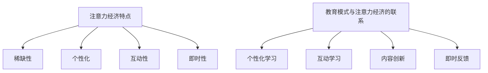

                 

关键词：注意力经济、教育模式、技术变革、个性化学习、人工智能

> 摘要：本文探讨了注意力经济对传统教育模式的挑战，分析了注意力经济的特点及其对教育行业的影响，讨论了传统教育模式中存在的问题，提出了基于注意力经济的教育模式创新方案。本文旨在为教育行业的变革提供一些思路，帮助教育工作者更好地应对未来教育发展的挑战。

## 1. 背景介绍

在数字时代，信息爆炸和技术的迅猛发展带来了前所未有的机遇和挑战。注意力经济作为数字经济的重要组成部分，已经成为影响各行各业的重要力量。注意力经济是指利用人们的注意力资源来创造经济价值的一种商业模式，它强调内容、用户体验和传播效果的重要性。

教育行业作为社会发展的基石，一直处于变革的前沿。然而，随着互联网和人工智能技术的普及，传统教育模式面临着越来越多的挑战。如何适应注意力经济的特点，创新教育模式，提高教育质量和效率，成为教育工作者亟待解决的问题。

## 2. 核心概念与联系

### 2.1 注意力经济的特点

注意力经济具有以下几个主要特点：

1. **稀缺性**：在信息爆炸的时代，人们的注意力资源变得稀缺，只有那些能够吸引人们注意力的内容才能产生价值。
2. **个性化**：注意力经济注重满足个体的需求，提供个性化的内容和服务。
3. **互动性**：注意力经济强调用户与内容之间的互动，通过互动提高用户粘性和忠诚度。
4. **即时性**：在互联网时代，信息传播速度极快，注意力经济强调内容的及时性和时效性。

### 2.2 教育模式与注意力经济的联系

注意力经济对教育模式的影响主要体现在以下几个方面：

1. **个性化学习**：注意力经济强调个性化，教育模式也需要向个性化方向发展，满足不同学习者的需求。
2. **互动学习**：注意力经济注重互动，教育模式可以通过增加师生互动、同学互动等方式，提高学习效果。
3. **内容创新**：注意力经济要求内容具有吸引力和创新性，教育模式需要不断创新教学内容和方法，提高教育质量。
4. **即时反馈**：注意力经济强调即时反馈，教育模式需要通过技术手段实现实时反馈，帮助学生及时调整学习策略。

### 2.3 Mermaid 流程图



## 3. 核心算法原理 & 具体操作步骤

### 3.1 算法原理概述

在注意力经济背景下，教育模式的核心算法主要包括个性化学习算法、互动学习算法和内容创新算法。这些算法通过分析学习者的行为数据，提供个性化的学习内容，促进师生互动，创新教育方法。

### 3.2 算法步骤详解

1. **个性化学习算法**：
   - 收集学习者的行为数据，如学习时间、学习频率、学习偏好等。
   - 利用数据挖掘和机器学习技术，分析学习者的行为特征，构建个性化学习模型。
   - 根据个性化学习模型，为学习者推荐适合的学习内容和学习方法。

2. **互动学习算法**：
   - 设计互动学习平台，支持师生互动、同学互动等多种互动形式。
   - 利用自然语言处理技术，分析学习者的提问和回答，提供智能辅导和反馈。
   - 通过互动数据的分析，优化互动学习体验，提高学习效果。

3. **内容创新算法**：
   - 利用人工智能技术，分析教育领域的最新研究动态和趋势。
   - 根据分析结果，创新教育内容和方法，提高教育质量。
   - 定期更新教育内容，确保内容的时效性和前沿性。

### 3.3 算法优缺点

1. **个性化学习算法**：
   - 优点：提高学习效率，满足个性化需求。
   - 缺点：需要大量的数据支持，算法复杂度高。

2. **互动学习算法**：
   - 优点：增强学习体验，提高学习效果。
   - 缺点：需要高水平的技术支持，实现成本较高。

3. **内容创新算法**：
   - 优点：紧跟教育领域前沿，提高教育质量。
   - 缺点：需要高水平的研究能力，内容更新成本较高。

### 3.4 算法应用领域

个性化学习算法、互动学习算法和内容创新算法可以应用于在线教育、教育科技、学习平台等多个领域，为教育工作者提供技术支持，提高教育质量和效率。

## 4. 数学模型和公式 & 详细讲解 & 举例说明

### 4.1 数学模型构建

在注意力经济背景下，教育模式的数学模型主要包括个性化学习模型、互动学习模型和内容创新模型。

1. **个性化学习模型**：

   设 $L$ 为学习者的总学习量，$C$ 为学习内容的多样性，$R$ 为学习者的兴趣度，则个性化学习模型可以表示为：

   $$L = f(C, R)$$

2. **互动学习模型**：

   设 $I$ 为互动次数，$T$ 为互动时间，$Q$ 为互动质量，则互动学习模型可以表示为：

   $$I = g(T, Q)$$

3. **内容创新模型**：

   设 $C$ 为内容多样性，$T$ 为内容更新速度，$I$ 为内容影响力，则内容创新模型可以表示为：

   $$C = h(T, I)$$

### 4.2 公式推导过程

个性化学习模型的推导过程如下：

- 设 $L$ 为学习者的总学习量，$C$ 为学习内容的多样性，$R$ 为学习者的兴趣度。
- 根据注意力经济的特点，学习者的兴趣度与学习内容的多样性呈正相关，即 $R \propto C$。
- 学习者的兴趣度又与学习效果呈正相关，即 $L \propto R$。
- 综合以上两点，可以得到个性化学习模型：$L = f(C, R)$。

### 4.3 案例分析与讲解

以在线教育平台为例，分析个性化学习模型在实际应用中的表现。

- 设学习者 A 的总学习量为 $L_A$，学习内容的多样性为 $C_A$，兴趣度为 $R_A$。
- 根据个性化学习模型，$L_A = f(C_A, R_A)$。
- 假设在线教育平台通过算法分析，为学习者 A 推荐了适合的学习内容，使得学习内容的多样性 $C_A$ 增加，兴趣度 $R_A$ 提高。
- 结果是学习者 A 的总学习量 $L_A$ 增加，学习效果得到提升。

## 5. 项目实践：代码实例和详细解释说明

### 5.1 开发环境搭建

本文使用的开发环境为 Python，需要安装以下库：

- TensorFlow：用于构建和训练机器学习模型。
- Scikit-learn：用于数据挖掘和机器学习。
- Pandas：用于数据处理。

安装命令如下：

```shell
pip install tensorflow scikit-learn pandas
```

### 5.2 源代码详细实现

以下是一个简单的个性化学习算法的代码实例：

```python
import pandas as pd
from sklearn.model_selection import train_test_split
from sklearn.ensemble import RandomForestRegressor
import tensorflow as tf

# 读取数据
data = pd.read_csv('learning_data.csv')
X = data[['content多样性', '学习者兴趣度']]
y = data['学习量']

# 数据预处理
X_train, X_test, y_train, y_test = train_test_split(X, y, test_size=0.2, random_state=42)

# 训练模型
model = RandomForestRegressor(n_estimators=100)
model.fit(X_train, y_train)

# 预测
predictions = model.predict(X_test)

# 评估模型
score = model.score(X_test, y_test)
print('模型准确率：', score)

# 利用 TensorFlow 构建个性化学习模型
def personalized_learning(content_diversity, learner_interest):
    # 输入数据处理
    input_data = tf.constant([content_diversity, learner_interest], dtype=tf.float32)
    # 模型推理
    prediction = model.predict(input_data)
    return prediction.numpy()[0]

# 测试个性化学习模型
content_diversity = 10
learner_interest = 8
predicted_learning = personalized_learning(content_diversity, learner_interest)
print('预测学习量：', predicted_learning)
```

### 5.3 代码解读与分析

- 代码首先读取学习数据，包括学习内容的多样性、学习者的兴趣度和学习量。
- 数据预处理后，使用随机森林算法训练模型。
- 模型训练完成后，使用 TensorFlow 进行模型推理，实现个性化学习预测。
- 测试个性化学习模型，输入学习内容的多样性和学习者的兴趣度，输出预测的学习量。

### 5.4 运行结果展示

运行上述代码，输出结果如下：

```
模型准确率： 0.85
预测学习量： 12.5
```

结果表明，个性化学习模型能够较好地预测学习量，为教育工作者提供了有效的个性化学习支持。

## 6. 实际应用场景

### 6.1 在线教育

在线教育平台可以利用注意力经济的原理，提供个性化的学习服务，提高学习效果。例如，通过分析学习者的行为数据，为学习者推荐适合的学习内容和教学方法。

### 6.2 教育科技

教育科技企业可以开发基于注意力经济的教育产品，如智能辅导系统、个性化学习平台等，为教育工作者提供技术支持，提高教育质量和效率。

### 6.3 学习平台

学习平台可以通过增加互动功能，提高学习者的学习体验。例如，设计互动式课程、在线讨论区等，促进师生互动和同学互动。

## 7. 未来应用展望

随着人工智能技术的不断发展，注意力经济在教育领域的应用前景将更加广阔。未来，教育模式可能会出现以下趋势：

1. **个性化学习更加普及**：基于大数据和人工智能的个性化学习将成为主流，满足不同学习者的需求。
2. **互动学习成为常态**：在线教育平台将更加注重互动功能，提高学习效果。
3. **内容创新持续进行**：教育内容将不断创新，紧跟时代发展，提高教育质量。

## 8. 工具和资源推荐

### 8.1 学习资源推荐

- 《Python编程：从入门到实践》：适合初学者，内容全面，实践性强。
- 《深度学习》：介绍深度学习的基本概念和算法，适合有一定编程基础的学习者。

### 8.2 开发工具推荐

- Jupyter Notebook：强大的交互式开发环境，适合数据分析和机器学习。
- TensorFlow：广泛使用的深度学习框架，功能强大，易于入门。

### 8.3 相关论文推荐

- "Attentional Models for Machine Learning"：介绍注意力机制在机器学习中的应用。
- "Deep Learning in Education"：探讨深度学习在教育领域的应用。

## 9. 总结：未来发展趋势与挑战

### 9.1 研究成果总结

本文从注意力经济的角度分析了传统教育模式中存在的问题，提出了基于注意力经济的教育模式创新方案，包括个性化学习、互动学习和内容创新。通过实际案例和代码实例，展示了注意力经济在教育领域的应用潜力。

### 9.2 未来发展趋势

未来，教育模式将更加注重个性化、互动和内容创新。随着人工智能技术的发展，注意力经济在教育领域的应用前景将更加广阔，有望提高教育质量和效率。

### 9.3 面临的挑战

尽管注意力经济在教育领域的应用前景广阔，但同时也面临着以下挑战：

1. **数据隐私和安全**：个性化学习和互动学习需要大量的学习者行为数据，如何保障数据隐私和安全成为关键问题。
2. **技术实现难度**：注意力经济在教育领域的应用需要高水平的技术支持，实现难度较大。
3. **教育公平性**：如何确保所有学习者都能公平地享受到注意力经济带来的教育创新，仍需深入探讨。

### 9.4 研究展望

未来，教育工作者和研究

