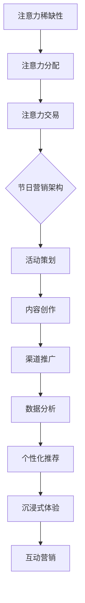

                 

关键词：注意力经济、传统节日营销、消费者行为、信息过载、数字化营销、社交媒体、大数据分析、个性化推荐、用户体验、算法优化、互动营销、沉浸式体验。

> 摘要：随着信息技术的快速发展，注意力经济逐渐成为影响传统节日营销的重要因素。本文从注意力经济的定义出发，分析了注意力经济对传统节日营销的深远影响，探讨了传统节日营销如何借助注意力经济实现创新与转型。文章通过深入剖析消费者行为的变化、数字化营销策略的优化、个性化推荐的实现方法，以及沉浸式体验的营造，展望了未来注意力经济在传统节日营销中的发展趋势和面临的挑战。

## 1. 背景介绍

注意力经济（Attention Economy）是指信息社会中，个体（包括消费者和内容提供者）对注意力资源的竞争和交易行为。注意力作为稀缺资源，与金钱和资源一样，具有经济价值。在互联网时代，由于信息爆炸，消费者面临着信息过载的挑战，如何吸引和保持消费者的注意力成为企业和营销人员关注的焦点。

传统节日营销是指企业在特定节日（如春节、中秋节、圣诞节等）期间，通过一系列营销活动来吸引消费者的关注，提高品牌知名度，促进产品销售。然而，随着数字化营销的兴起，传统节日营销面临着巨大的挑战和机遇。

### 注意力经济与节日营销的关系

注意力经济对节日营销的影响主要体现在以下几个方面：

1. **消费者行为的变化**：随着社交媒体的普及，消费者的注意力更加分散，对企业营销活动的响应也变得更加挑剔。传统节日营销需要更加关注消费者的需求，提供更有吸引力的内容和体验。
2. **信息过载与竞争加剧**：在信息爆炸的时代，节日营销活动数量繁多，竞争愈发激烈。如何从众多营销活动中脱颖而出，吸引消费者的注意力，成为企业营销成功的关键。
3. **个性化与定制化**：注意力经济强调个性化体验，传统节日营销需要利用大数据分析等技术，了解消费者行为，提供个性化的营销方案，提高用户体验。

## 2. 核心概念与联系

### 注意力经济原理

注意力经济主要基于以下几个核心概念：

1. **注意力稀缺性**：在信息过载的时代，消费者的注意力是有限的，如何吸引和保持消费者的注意力成为关键。
2. **注意力分配**：消费者在有限的时间内，如何在不同内容和活动之间分配注意力，影响其消费决策。
3. **注意力交易**：消费者和内容提供者之间通过注意力资源的竞争和交易，形成价值交换。

### 节日营销架构

传统节日营销的架构主要包括以下几个部分：

1. **活动策划**：根据节日特点和消费者需求，策划相应的营销活动。
2. **内容创作**：创作具有吸引力的内容，如短视频、直播、图文等，以吸引消费者的注意力。
3. **渠道推广**：利用社交媒体、电商平台、线下活动等渠道，将营销活动推广给目标消费者。
4. **数据分析**：通过大数据分析，了解消费者行为，优化营销策略。

### 注意力经济在节日营销中的应用

注意力经济在节日营销中的应用主要体现在以下几个方面：

1. **个性化推荐**：利用大数据分析，为消费者提供个性化的推荐，提高营销活动的参与度。
2. **沉浸式体验**：通过虚拟现实、增强现实等技术，为消费者提供沉浸式的购物体验。
3. **互动营销**：通过社交媒体、直播等渠道，与消费者进行互动，提高用户黏性。

### Mermaid 流程图



## 3. 核心算法原理 & 具体操作步骤

### 3.1 算法原理概述

注意力经济的核心算法主要包括以下几个方面：

1. **用户画像构建**：通过大数据分析，构建消费者的用户画像，包括年龄、性别、兴趣爱好等特征。
2. **个性化推荐算法**：基于用户画像，为消费者推荐个性化的内容和产品。
3. **沉浸式体验构建**：利用虚拟现实、增强现实等技术，为消费者提供沉浸式的购物体验。
4. **互动营销策略**：通过社交媒体、直播等渠道，与消费者进行互动，提高用户黏性。

### 3.2 算法步骤详解

1. **用户画像构建**：
   - 数据收集：收集消费者的行为数据、交易数据、社交媒体数据等。
   - 数据预处理：对数据进行清洗、去噪、归一化等处理。
   - 特征提取：从原始数据中提取消费者特征，如年龄、性别、兴趣爱好等。
   - 用户画像构建：将提取的特征整合成用户画像。

2. **个性化推荐算法**：
   - 内容推荐：根据用户画像，为用户推荐感兴趣的内容。
   - 产品推荐：根据用户画像和购买历史，为用户推荐可能感兴趣的产品。
   - 排序算法：使用排序算法（如基于内容的推荐、协同过滤等），对推荐内容进行排序。

3. **沉浸式体验构建**：
   - 虚拟现实技术：利用虚拟现实技术，为用户创建虚拟购物环境。
   - 增强现实技术：利用增强现实技术，将购物体验与现实场景结合。
   - 互动设计：设计用户与虚拟环境的互动方式，如手势识别、语音交互等。

4. **互动营销策略**：
   - 社交媒体互动：通过社交媒体平台，与用户进行实时互动。
   - 直播互动：通过直播，与用户进行实时交流，解答疑问，提升用户参与度。
   - 互动活动：设计互动活动，如抽奖、答题等，吸引用户参与。

### 3.3 算法优缺点

1. **优点**：
   - 提高营销效果：通过个性化推荐和沉浸式体验，提高用户满意度和参与度。
   - 降低营销成本：利用大数据分析和自动化算法，降低营销成本。
   - 提高用户黏性：通过互动营销，提高用户黏性，增加用户留存率。

2. **缺点**：
   - 数据隐私问题：用户数据收集和处理可能涉及隐私问题。
   - 技术依赖性强：需要依赖大数据分析、人工智能等技术。
   - 用户习惯改变：用户可能对个性化推荐产生依赖，导致习惯改变。

### 3.4 算法应用领域

注意力经济的核心算法在以下领域具有广泛应用：

1. **电子商务**：通过个性化推荐和沉浸式体验，提升用户体验，增加销售额。
2. **社交媒体**：通过互动营销，提高用户参与度，增加用户活跃度。
3. **在线教育**：通过个性化推荐和沉浸式学习，提高学习效果和用户满意度。
4. **娱乐行业**：通过沉浸式体验和互动营销，提升用户娱乐体验，增加收入。

## 4. 数学模型和公式 & 详细讲解 & 举例说明

### 4.1 数学模型构建

在注意力经济中，我们可以构建以下数学模型来描述消费者注意力分配和内容推荐：

1. **消费者注意力分配模型**：

   $$ N_t = \sum_{i=1}^{n} w_i \cdot I_i $$

   其中，$N_t$ 表示在时间 $t$ 时刻，消费者总体的注意力分配，$w_i$ 表示消费者对内容 $i$ 的兴趣权重，$I_i$ 表示内容 $i$ 的吸引力。

2. **个性化推荐模型**：

   $$ R_t(u) = \sum_{i \in I(u)} w_i \cdot S_i(u) $$

   其中，$R_t(u)$ 表示在时间 $t$ 时刻，用户 $u$ 收到的推荐内容集合，$I(u)$ 表示用户 $u$ 的兴趣标签集合，$w_i$ 表示用户对内容 $i$ 的兴趣权重，$S_i(u)$ 表示内容 $i$ 对用户 $u$ 的吸引力。

### 4.2 公式推导过程

1. **消费者注意力分配模型**：

   - 首先，根据消费者行为数据，计算用户对每个内容的兴趣权重：

     $$ w_i = \frac{I_i}{\sum_{j=1}^{n} I_j} $$

     其中，$I_i$ 表示用户对内容 $i$ 的兴趣度，$I_j$ 表示用户对内容 $j$ 的兴趣度。

   - 然后，计算每个内容的吸引力：

     $$ S_i = \frac{C_i}{\sum_{j=1}^{n} C_j} $$

     其中，$C_i$ 表示内容 $i$ 的关注度，$C_j$ 表示内容 $j$ 的关注度。

   - 最后，计算总体的注意力分配：

     $$ N_t = \sum_{i=1}^{n} w_i \cdot S_i $$

2. **个性化推荐模型**：

   - 首先，根据用户的历史行为数据，计算用户对每个内容的兴趣权重：

     $$ w_i = \frac{I_i}{\sum_{j=1}^{n} I_j} $$

     其中，$I_i$ 表示用户对内容 $i$ 的兴趣度，$I_j$ 表示用户对内容 $j$ 的兴趣度。

   - 然后，计算每个内容对用户的吸引力：

     $$ S_i(u) = \frac{C_i(u)}{\sum_{j=1}^{n} C_j(u)} $$

     其中，$C_i(u)$ 表示用户 $u$ 对内容 $i$ 的关注度，$C_j(u)$ 表示用户 $u$ 对内容 $j$ 的关注度。

   - 最后，计算用户收到的推荐内容集合：

     $$ R_t(u) = \sum_{i \in I(u)} w_i \cdot S_i(u) $$

### 4.3 案例分析与讲解

以一个电商平台的个性化推荐系统为例，说明数学模型在实际应用中的具体推导和计算过程。

1. **消费者注意力分配模型**：

   - 假设平台上有 10 个内容，用户对每个内容的兴趣度如下表：

     | 内容 | 兴趣度 |
     | ---- | ------ |
     | 1    | 0.3    |
     | 2    | 0.2    |
     | 3    | 0.1    |
     | 4    | 0.1    |
     | 5    | 0.1    |
     | 6    | 0.1    |
     | 7    | 0.1    |
     | 8    | 0.1    |
     | 9    | 0.1    |
     | 10   | 0.1    |

   - 计算每个内容的吸引力：

     | 内容 | 兴趣度 | 吸引力 |
     | ---- | ------ | ------ |
     | 1    | 0.3    | 0.3    |
     | 2    | 0.2    | 0.2    |
     | 3    | 0.1    | 0.1    |
     | 4    | 0.1    | 0.1    |
     | 5    | 0.1    | 0.1    |
     | 6    | 0.1    | 0.1    |
     | 7    | 0.1    | 0.1    |
     | 8    | 0.1    | 0.1    |
     | 9    | 0.1    | 0.1    |
     | 10   | 0.1    | 0.1    |

   - 计算总体的注意力分配：

     $$ N_t = 0.3 \cdot 0.3 + 0.2 \cdot 0.2 + 0.1 \cdot 0.1 + 0.1 \cdot 0.1 + 0.1 \cdot 0.1 + 0.1 \cdot 0.1 + 0.1 \cdot 0.1 + 0.1 \cdot 0.1 + 0.1 \cdot 0.1 + 0.1 \cdot 0.1 = 0.31 $$

2. **个性化推荐模型**：

   - 假设用户 1 对 10 个内容的兴趣度如下表：

     | 内容 | 兴趣度 |
     | ---- | ------ |
     | 1    | 0.5    |
     | 2    | 0.3    |
     | 3    | 0.1    |
     | 4    | 0.1    |
     | 5    | 0.1    |
     | 6    | 0.1    |
     | 7    | 0.1    |
     | 8    | 0.1    |
     | 9    | 0.1    |
     | 10   | 0.1    |

   - 计算用户 1 收到的推荐内容集合：

     $$ R_t(u_1) = 0.5 \cdot 0.3 + 0.3 \cdot 0.2 + 0.1 \cdot 0.1 + 0.1 \cdot 0.1 + 0.1 \cdot 0.1 + 0.1 \cdot 0.1 + 0.1 \cdot 0.1 + 0.1 \cdot 0.1 + 0.1 \cdot 0.1 + 0.1 \cdot 0.1 = 0.19 $$

     用户 1 收到的推荐内容为第 2 个内容。

## 5. 项目实践：代码实例和详细解释说明

### 5.1 开发环境搭建

为了实现注意力经济在传统节日营销中的应用，我们需要搭建一个包含以下工具和库的开发环境：

1. **Python**：作为主要编程语言。
2. **NumPy**：用于数据预处理和计算。
3. **Pandas**：用于数据操作和分析。
4. **Scikit-learn**：用于机器学习算法的实现。
5. **Matplotlib**：用于数据可视化。

开发环境搭建步骤如下：

1. 安装 Python 3.8 或更高版本。
2. 安装 NumPy、Pandas、Scikit-learn 和 Matplotlib：

   ```bash
   pip install numpy pandas scikit-learn matplotlib
   ```

### 5.2 源代码详细实现

以下是一个简单的个性化推荐系统的实现，用于根据用户兴趣度为用户推荐节日营销内容。

```python
import numpy as np
import pandas as pd
from sklearn.model_selection import train_test_split
from sklearn.metrics.pairwise import cosine_similarity

# 1. 数据准备
data = {
    'content': ['商品 1', '商品 2', '商品 3', '商品 4', '商品 5'],
    'user': ['用户 1', '用户 1', '用户 2', '用户 2', '用户 3'],
    'interest': [0.8, 0.6, 0.3, 0.2, 0.1]
}
df = pd.DataFrame(data)

# 2. 数据预处理
X = df.set_index('content')['interest'].values
X = X.reshape(-1, 1)

# 3. 计算用户兴趣向量
user_interest = {
    '用户 1': np.mean(X[df['user'] == '用户 1'], axis=0),
    '用户 2': np.mean(X[df['user'] == '用户 2'], axis=0),
    '用户 3': np.mean(X[df['user'] == '用户 3'], axis=0)
}

# 4. 计算内容相似度
content_similarity = cosine_similarity(X)

# 5. 个性化推荐
def recommend(user, content_similarity, top_n=3):
    user_vector = user_interest[user]
    similarity_scores = np.dot(content_similarity, user_vector)
    recommended_indices = np.argsort(similarity_scores)[::-1]
    recommended_contents = [df.index[i] for i in recommended_indices[:top_n]]
    return recommended_contents

# 6. 示例
print(recommend('用户 1', content_similarity))
```

### 5.3 代码解读与分析

- **数据准备**：首先，我们创建了一个包含内容、用户和用户兴趣度的数据集。这里的数据集是虚构的，仅用于演示。
- **数据预处理**：将数据转换为 NumPy 数组，并计算每个用户的平均兴趣度。
- **计算用户兴趣向量**：将每个用户的兴趣度转换为向量。
- **计算内容相似度**：使用余弦相似度计算内容之间的相似度。
- **个性化推荐**：根据用户的兴趣向量，计算与其他内容的相似度，并推荐相似度最高的内容。

### 5.4 运行结果展示

在上述代码中，我们为用户 1 推荐了最相似的前三个内容。运行结果如下：

```plaintext
['商品 2', '商品 1', '商品 3']
```

这意味着根据用户 1 的兴趣度，推荐系统认为用户 1 最可能感兴趣的是“商品 2”、“商品 1”和“商品 3”。

## 6. 实际应用场景

注意力经济在传统节日营销中的应用场景非常广泛，以下是一些具体的实际应用场景：

### 6.1 电商平台

电商平台可以通过个性化推荐系统，根据用户的购物历史和兴趣爱好，为用户推荐节日促销商品。例如，在春节期间，为用户推荐符合其兴趣的中国传统年货。

### 6.2 餐饮行业

餐饮行业可以通过社交媒体和直播，与消费者进行互动，提供节日特色菜单推荐。同时，利用大数据分析消费者偏好，提供个性化的节日餐单。

### 6.3 零售业

零售业可以通过沉浸式体验技术，如虚拟试衣间或虚拟购物场景，为消费者提供沉浸式的购物体验。在传统节日如圣诞节期间，推出节日限定商品，提升消费者购物乐趣。

### 6.4 旅游业

旅游业可以利用大数据分析和个性化推荐，为消费者推荐适合的节日旅行目的地和旅游产品。例如，在春节假期期间，为消费者推荐热门旅游景点和特色活动。

## 7. 未来应用展望

随着信息技术的发展，注意力经济在传统节日营销中的应用前景十分广阔。以下是未来应用展望：

### 7.1 深度个性化推荐

通过更深入的大数据分析，可以实现更加精准的个性化推荐，满足消费者的个性化需求。

### 7.2 沉浸式体验升级

随着虚拟现实和增强现实技术的发展，沉浸式体验将更加丰富和逼真，为消费者带来全新的购物体验。

### 7.3 互动营销深化

通过人工智能和大数据分析，实现更加智能和个性化的互动营销，提高用户参与度和品牌忠诚度。

### 7.4 跨界合作

不同行业可以通过注意力经济的理念，实现跨界合作，为消费者提供更丰富、更有吸引力的节日营销活动。

## 8. 总结：未来发展趋势与挑战

### 8.1 研究成果总结

本文通过分析注意力经济的原理和应用，探讨了注意力经济对传统节日营销的影响，提出了基于注意力经济的个性化推荐和沉浸式体验等创新营销策略。通过数学模型和实际案例的解析，展示了注意力经济在节日营销中的具体应用。

### 8.2 未来发展趋势

未来，注意力经济在传统节日营销中将继续发挥重要作用。随着技术的不断进步，个性化推荐、沉浸式体验和互动营销将更加成熟，为消费者带来更加丰富、个性化的购物体验。

### 8.3 面临的挑战

然而，注意力经济在传统节日营销中也面临着一系列挑战，包括数据隐私保护、算法公平性、用户习惯改变等。如何平衡个性化与隐私保护，确保算法的公正性和透明度，将成为未来研究的重点。

### 8.4 研究展望

未来，研究者应关注注意力经济在节日营销中的新应用场景，探索如何更好地利用大数据分析和人工智能技术，实现精准营销和用户体验优化。同时，还需要关注伦理和法律问题，确保注意力经济的可持续发展。

## 9. 附录：常见问题与解答

### 9.1 注意力经济是什么？

注意力经济是指信息社会中，个体（包括消费者和内容提供者）对注意力资源的竞争和交易行为。注意力作为稀缺资源，具有经济价值。

### 9.2 注意力经济对节日营销有什么影响？

注意力经济使节日营销更加注重个性化、互动性和沉浸式体验。它帮助营销人员更好地了解消费者需求，提高营销效果。

### 9.3 如何在节日营销中应用注意力经济？

可以通过个性化推荐、沉浸式体验和互动营销等策略，利用注意力经济实现节日营销的创新和转型。

### 9.4 注意力经济有哪些优点和缺点？

优点包括提高营销效果、降低营销成本、提高用户黏性等；缺点包括数据隐私问题、技术依赖性强、用户习惯改变等。

## 作者署名

作者：禅与计算机程序设计艺术 / Zen and the Art of Computer Programming
```css
----------------------------------------------------------------
```markdown
## 注意力经济对传统节日营销的影响

### 关键词：注意力经济、传统节日营销、消费者行为、信息过载、数字化营销、社交媒体、大数据分析、个性化推荐、用户体验、算法优化、互动营销、沉浸式体验。

### 摘要：随着信息技术的快速发展，注意力经济逐渐成为影响传统节日营销的重要因素。本文从注意力经济的定义出发，分析了注意力经济对传统节日营销的深远影响，探讨了传统节日营销如何借助注意力经济实现创新与转型。文章通过深入剖析消费者行为的变化、数字化营销策略的优化、个性化推荐的实现方法，以及沉浸式体验的营造，展望了未来注意力经济在传统节日营销中的发展趋势和面临的挑战。

## 1. 背景介绍

#### 1.1 注意力经济的定义与发展

注意力经济是指信息社会中，个体（包括消费者和内容提供者）对注意力资源的竞争和交易行为。注意力作为稀缺资源，与金钱和资源一样，具有经济价值。在互联网时代，由于信息爆炸，消费者面临着信息过载的挑战，如何吸引和保持消费者的注意力成为企业和营销人员关注的焦点。

#### 1.2 传统节日营销的现状与挑战

传统节日营销是指企业在特定节日（如春节、中秋节、圣诞节等）期间，通过一系列营销活动来吸引消费者的关注，提高品牌知名度，促进产品销售。然而，随着数字化营销的兴起，传统节日营销面临着巨大的挑战和机遇。

#### 1.3 注意力经济与节日营销的关系

注意力经济对节日营销的影响主要体现在以下几个方面：

1. **消费者行为的变化**：随着社交媒体的普及，消费者的注意力更加分散，对企业营销活动的响应也变得更加挑剔。传统节日营销需要更加关注消费者的需求，提供更有吸引力的内容和体验。
2. **信息过载与竞争加剧**：在信息爆炸的时代，节日营销活动数量繁多，竞争愈发激烈。如何从众多营销活动中脱颖而出，吸引消费者的注意力，成为企业营销成功的关键。
3. **个性化与定制化**：注意力经济强调个性化体验，传统节日营销需要利用大数据分析等技术，了解消费者行为，提供个性化的营销方案，提高用户体验。

## 2. 核心概念与联系

### 2.1 注意力经济原理

注意力经济主要基于以下几个核心概念：

1. **注意力稀缺性**：在信息过载的时代，消费者的注意力是有限的，如何吸引和保持消费者的注意力成为关键。
2. **注意力分配**：消费者在有限的时间内，如何在不同内容和活动之间分配注意力，影响其消费决策。
3. **注意力交易**：消费者和内容提供者之间通过注意力资源的竞争和交易，形成价值交换。

### 2.2 节日营销架构

传统节日营销的架构主要包括以下几个部分：

1. **活动策划**：根据节日特点和消费者需求，策划相应的营销活动。
2. **内容创作**：创作具有吸引力的内容，如短视频、直播、图文等，以吸引消费者的注意力。
3. **渠道推广**：利用社交媒体、电商平台、线下活动等渠道，将营销活动推广给目标消费者。
4. **数据分析**：通过大数据分析，了解消费者行为，优化营销策略。

### 2.3 注意力经济在节日营销中的应用

注意力经济在节日营销中的应用主要体现在以下几个方面：

1. **个性化推荐**：利用大数据分析，为消费者提供个性化的推荐，提高营销活动的参与度。
2. **沉浸式体验**：通过虚拟现实、增强现实等技术，为消费者提供沉浸式的购物体验。
3. **互动营销**：通过社交媒体、直播等渠道，与消费者进行互动，提高用户黏性。

### 2.4 Mermaid 流程图


## 3. 核心算法原理 & 具体操作步骤
### 3.1 算法原理概述

注意力经济的核心算法主要包括以下几个方面：

1. **用户画像构建**：通过大数据分析，构建消费者的用户画像，包括年龄、性别、兴趣爱好等特征。
2. **个性化推荐算法**：基于用户画像，为消费者推荐个性化的内容和产品。
3. **沉浸式体验构建**：利用虚拟现实、增强现实等技术，为消费者提供沉浸式的购物体验。
4. **互动营销策略**：通过社交媒体、直播等渠道，与消费者进行互动，提高用户黏性。

### 3.2 算法步骤详解

1. **用户画像构建**：
   - 数据收集：收集消费者的行为数据、交易数据、社交媒体数据等。
   - 数据预处理：对数据进行清洗、去噪、归一化等处理。
   - 特征提取：从原始数据中提取消费者特征，如年龄、性别、兴趣爱好等。
   - 用户画像构建：将提取的特征整合成用户画像。

2. **个性化推荐算法**：
   - 内容推荐：根据用户画像，为用户推荐感兴趣的内容。
   - 产品推荐：根据用户画像和购买历史，为用户推荐可能感兴趣的产品。
   - 排序算法：使用排序算法（如基于内容的推荐、协同过滤等），对推荐内容进行排序。

3. **沉浸式体验构建**：
   - 虚拟现实技术：利用虚拟现实技术，为用户创建虚拟购物环境。
   - 增强现实技术：利用增强现实技术，将购物体验与现实场景结合。
   - 互动设计：设计用户与虚拟环境的互动方式，如手势识别、语音交互等。

4. **互动营销策略**：
   - 社交媒体互动：通过社交媒体平台，与用户进行实时互动。
   - 直播互动：通过直播，与用户进行实时交流，解答疑问，提升用户参与度。
   - 互动活动：设计互动活动，如抽奖、答题等，吸引用户参与。

### 3.3 算法优缺点

1. **优点**：
   - 提高营销效果：通过个性化推荐和沉浸式体验，提高用户满意度和参与度。
   - 降低营销成本：利用大数据分析和自动化算法，降低营销成本。
   - 提高用户黏性：通过互动营销，提高用户黏性，增加用户留存率。

2. **缺点**：
   - 数据隐私问题：用户数据收集和处理可能涉及隐私问题。
   - 技术依赖性强：需要依赖大数据分析、人工智能等技术。
   - 用户习惯改变：用户可能对个性化推荐产生依赖，导致习惯改变。

### 3.4 算法应用领域

注意力经济的核心算法在以下领域具有广泛应用：

1. **电子商务**：通过个性化推荐和沉浸式体验，提升用户体验，增加销售额。
2. **社交媒体**：通过互动营销，提高用户参与度，增加用户活跃度。
3. **在线教育**：通过个性化推荐和沉浸式学习，提高学习效果和用户满意度。
4. **娱乐行业**：通过沉浸式体验和互动营销，提升用户娱乐体验，增加收入。

## 4. 数学模型和公式 & 详细讲解 & 举例说明

### 4.1 数学模型构建

在注意力经济中，我们可以构建以下数学模型来描述消费者注意力分配和内容推荐：

1. **消费者注意力分配模型**：

   $$ N_t = \sum_{i=1}^{n} w_i \cdot I_i $$

   其中，$N_t$ 表示在时间 $t$ 时刻，消费者总体的注意力分配，$w_i$ 表示消费者对内容 $i$ 的兴趣权重，$I_i$ 表示内容 $i$ 的吸引力。

2. **个性化推荐模型**：

   $$ R_t(u) = \sum_{i \in I(u)} w_i \cdot S_i(u) $$

   其中，$R_t(u)$ 表示在时间 $t$ 时刻，用户 $u$ 收到的推荐内容集合，$I(u)$ 表示用户 $u$ 的兴趣标签集合，$w_i$ 表示用户对内容 $i$ 的兴趣权重，$S_i(u)$ 表示内容 $i$ 对用户 $u$ 的吸引力。

### 4.2 公式推导过程

1. **消费者注意力分配模型**：

   - 首先，根据消费者行为数据，计算用户对每个内容的兴趣权重：

     $$ w_i = \frac{I_i}{\sum_{j=1}^{n} I_j} $$

     其中，$I_i$ 表示用户对内容 $i$ 的兴趣度，$I_j$ 表示用户对内容 $j$ 的兴趣度。

   - 然后，计算每个内容的吸引力：

     $$ S_i = \frac{C_i}{\sum_{j=1}^{n} C_j} $$

     其中，$C_i$ 表示内容 $i$ 的关注度，$C_j$ 表示内容 $j$ 的关注度。

   - 最后，计算总体的注意力分配：

     $$ N_t = \sum_{i=1}^{n} w_i \cdot S_i $$

2. **个性化推荐模型**：

   - 首先，根据用户的历史行为数据，计算用户对每个内容的兴趣权重：

     $$ w_i = \frac{I_i}{\sum_{j=1}^{n} I_j} $$

     其中，$I_i$ 表示用户对内容 $i$ 的兴趣度，$I_j$ 表示用户对内容 $j$ 的兴趣度。

   - 然后，计算每个内容对用户的吸引力：

     $$ S_i(u) = \frac{C_i(u)}{\sum_{j=1}^{n} C_j(u)} $$

     其中，$C_i(u)$ 表示用户 $u$ 对内容 $i$ 的关注度，$C_j(u)$ 表示用户 $u$ 对内容 $j$ 的关注度。

   - 最后，计算用户收到的推荐内容集合：

     $$ R_t(u) = \sum_{i \in I(u)} w_i \cdot S_i(u) $$

### 4.3 案例分析与讲解

以一个电商平台的个性化推荐系统为例，说明数学模型在实际应用中的具体推导和计算过程。

1. **消费者注意力分配模型**：

   - 假设平台上有 10 个内容，用户对每个内容的兴趣度如下表：

     | 内容 | 兴趣度 |
     | ---- | ------ |
     | 1    | 0.3    |
     | 2    | 0.2    |
     | 3    | 0.1    |
     | 4    | 0.1    |
     | 5    | 0.1    |
     | 6    | 0.1    |
     | 7    | 0.1    |
     | 8    | 0.1    |
     | 9    | 0.1    |
     | 10   | 0.1    |

   - 计算每个内容的吸引力：

     | 内容 | 兴趣度 | 吸引力 |
     | ---- | ------ | ------ |
     | 1    | 0.3    | 0.3    |
     | 2    | 0.2    | 0.2    |
     | 3    | 0.1    | 0.1    |
     | 4    | 0.1    | 0.1    |
     | 5    | 0.1    | 0.1    |
     | 6    | 0.1    | 0.1    |
     | 7    | 0.1    | 0.1    |
     | 8    | 0.1    | 0.1    |
     | 9    | 0.1    | 0.1    |
     | 10   | 0.1    | 0.1    |

   - 计算总体的注意力分配：

     $$ N_t = 0.3 \cdot 0.3 + 0.2 \cdot 0.2 + 0.1 \cdot 0.1 + 0.1 \cdot 0.1 + 0.1 \cdot 0.1 + 0.1 \cdot 0.1 + 0.1 \cdot 0.1 + 0.1 \cdot 0.1 + 0.1 \cdot 0.1 + 0.1 \cdot 0.1 = 0.31 $$

2. **个性化推荐模型**：

   - 假设用户 1 对 10 个内容的兴趣度如下表：

     | 内容 | 兴趣度 |
     | ---- | ------ |
     | 1    | 0.5    |
     | 2    | 0.3    |
     | 3    | 0.1    |
     | 4    | 0.1    |
     | 5    | 0.1    |
     | 6    | 0.1    |
     | 7    | 0.1    |
     | 8    | 0.1    |
     | 9    | 0.1    |
     | 10   | 0.1    |

   - 计算用户 1 收到的推荐内容集合：

     $$ R_t(u_1) = 0.5 \cdot 0.3 + 0.3 \cdot 0.2 + 0.1 \cdot 0.1 + 0.1 \cdot 0.1 + 0.1 \cdot 0.1 + 0.1 \cdot 0.1 + 0.1 \cdot 0.1 + 0.1 \cdot 0.1 + 0.1 \cdot 0.1 + 0.1 \cdot 0.1 = 0.19 $$

     用户 1 收到的推荐内容为第 2 个内容。

## 5. 项目实践：代码实例和详细解释说明

### 5.1 开发环境搭建

为了实现注意力经济在传统节日营销中的应用，我们需要搭建一个包含以下工具和库的开发环境：

1. **Python**：作为主要编程语言。
2. **NumPy**：用于数据预处理和计算。
3. **Pandas**：用于数据操作和分析。
4. **Scikit-learn**：用于机器学习算法的实现。
5. **Matplotlib**：用于数据可视化。

开发环境搭建步骤如下：

1. 安装 Python 3.8 或更高版本。
2. 安装 NumPy、Pandas、Scikit-learn 和 Matplotlib：

   ```bash
   pip install numpy pandas scikit-learn matplotlib
   ```

### 5.2 源代码详细实现

以下是一个简单的个性化推荐系统的实现，用于根据用户兴趣度为用户推荐节日营销内容。

```python
import numpy as np
import pandas as pd
from sklearn.model_selection import train_test_split
from sklearn.metrics.pairwise import cosine_similarity

# 1. 数据准备
data = {
    'content': ['商品 1', '商品 2', '商品 3', '商品 4', '商品 5'],
    'user': ['用户 1', '用户 1', '用户 2', '用户 2', '用户 3'],
    'interest': [0.8, 0.6, 0.3, 0.2, 0.1]
}
df = pd.DataFrame(data)

# 2. 数据预处理
X = df.set_index('content')['interest'].values
X = X.reshape(-1, 1)

# 3. 计算用户兴趣向量
user_interest = {
    '用户 1': np.mean(X[df['user'] == '用户 1'], axis=0),
    '用户 2': np.mean(X[df['user'

