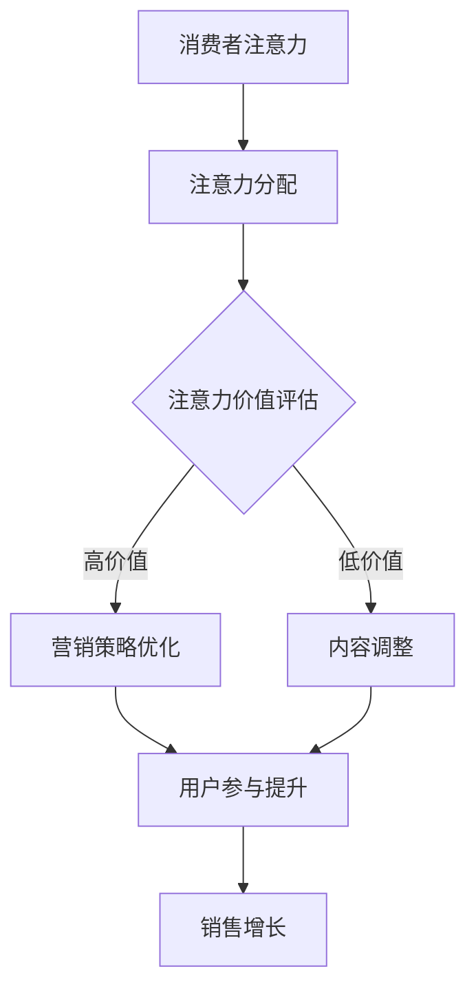

                 

关键词：注意力经济、传统节日、营销策略、消费者行为、数据驱动

> 摘要：随着互联网技术的迅猛发展和数字化时代的到来，注意力经济逐渐成为影响各个领域的重要因素。本文将探讨注意力经济对传统节日营销的深远影响，分析消费者行为的变化，以及如何利用数据驱动的方式优化传统节日营销策略。

## 1. 背景介绍

### 注意力经济的定义与发展

注意力经济（Attention Economy）是指一个基于人们注意力分配的经济学模型，它认为注意力是有限的资源，人们愿意将注意力分配给他们认为有价值的事物。随着互联网的普及和信息爆炸，注意力经济逐渐成为影响商业运作和消费者行为的关键因素。

### 传统节日营销的演变

传统节日营销是指企业在节日期间针对特定消费者群体进行的营销活动。随着市场环境的变化和技术的进步，传统节日营销策略也在不断演变。在过去，节日营销主要依靠传统的广告宣传和促销活动；而在当今数字化时代，数据驱动和个性化营销成为主流。

### 注意力经济对传统节日营销的影响

注意力经济对传统节日营销的影响主要体现在以下几个方面：

1. 消费者注意力分散：在注意力经济时代，消费者面临的信息量巨大，他们的注意力被分散到各个渠道和平台，使得企业需要更加精准地捕捉消费者的兴趣点。
2. 营销手段的变革：注意力经济促使企业从传统的广告宣传转向更加互动和个性化的营销手段，以吸引和保持消费者的注意力。
3. 数据驱动的决策：注意力经济强调数据的价值，企业需要利用数据分析工具来了解消费者行为，优化营销策略，提高营销效果。

## 2. 核心概念与联系

### 注意力经济模型

注意力经济模型主要涉及以下几个方面：

- **注意力分配**：消费者将有限的注意力分配给不同的事物，如广告、社交媒体、内容等。
- **注意力价值**：消费者对某一事物的注意力价值取决于其兴趣、需求和价值判断。
- **注意力转移**：消费者的注意力可以随着外部刺激的变化而转移，企业需要创造吸引力强的内容来吸引消费者的注意力。
- **注意力稀缺**：在信息爆炸的时代，消费者的注意力变得稀缺，企业需要通过提供高质量和有价值的内容来争夺消费者的注意力。

### 传统节日营销与注意力经济的联系

传统节日营销与注意力经济之间存在以下联系：

- **注意力获取**：企业通过创新和有针对性的营销手段，如社交媒体营销、内容营销等，吸引消费者的注意力。
- **注意力转化**：企业利用注意力经济模型分析消费者行为，将注意力转化为实际的销售和用户参与。
- **注意力维护**：通过持续的内容更新和互动，企业维持消费者的注意力，建立长期的品牌忠诚度。

### Mermaid 流程图



## 3. 核心算法原理 & 具体操作步骤

### 3.1 算法原理概述

注意力经济模型的核心算法主要包括以下几个方面：

1. **消费者行为分析**：通过数据分析工具，如Google Analytics、社交媒体分析工具等，了解消费者的兴趣、行为和需求。
2. **内容个性化推荐**：根据消费者行为数据，为不同消费者提供个性化的内容推荐，提高内容的相关性和吸引力。
3. **互动性设计**：通过社交媒体互动、线上活动等，增加用户参与度，提高品牌知名度。
4. **效果评估**：利用A/B测试、ROI分析等手段，评估营销策略的效果，不断优化和调整。

### 3.2 算法步骤详解

1. **数据收集**：通过网站分析工具、社交媒体分析工具等，收集消费者的行为数据，如访问时长、页面点击、分享行为等。
2. **数据预处理**：对收集的数据进行清洗、筛选和分类，提取有用的信息。
3. **行为分析**：使用数据分析方法，如聚类分析、关联规则挖掘等，分析消费者的行为特征和兴趣。
4. **内容推荐**：根据消费者的兴趣和行为特征，推荐相关的节日营销内容，如广告、产品信息、社交媒体话题等。
5. **互动设计**：设计互动性强的营销活动，如抽奖、互动游戏、限时优惠等，提高用户参与度。
6. **效果评估**：通过A/B测试、ROI分析等手段，评估营销策略的效果，根据评估结果进行优化和调整。

### 3.3 算法优缺点

**优点**：

1. **提高营销效果**：通过精准的内容推荐和互动设计，提高营销活动的效果和用户参与度。
2. **降低营销成本**：通过数据驱动的决策，减少盲目投放的广告和促销活动，降低营销成本。
3. **提升用户满意度**：通过个性化推荐和互动设计，提高用户的满意度，增强品牌忠诚度。

**缺点**：

1. **数据隐私问题**：在数据收集和使用过程中，可能涉及用户隐私问题，需要加强数据保护措施。
2. **算法偏见**：如果算法设计不合理，可能导致偏见和不公平，影响营销效果。
3. **技术门槛**：需要具备一定的数据分析和技术能力，对于中小企业可能存在一定的技术门槛。

### 3.4 算法应用领域

注意力经济算法主要应用于以下几个方面：

1. **节日营销**：通过对消费者行为数据的分析，优化节日营销策略，提高营销效果。
2. **内容推荐**：在电商、社交媒体等领域，利用注意力经济算法推荐相关内容，提升用户体验。
3. **广告投放**：通过精准定位消费者，提高广告投放的ROI。
4. **用户运营**：通过互动设计，提高用户参与度和满意度，提升品牌知名度。

## 4. 数学模型和公式 & 详细讲解 & 举例说明

### 4.1 数学模型构建

注意力经济模型通常涉及以下几个数学模型：

1. **贝叶斯网络**：用于表示消费者行为和兴趣之间的概率关系。
2. **马尔可夫链**：用于分析消费者在多个决策节点之间的转移概率。
3. **线性回归模型**：用于预测消费者对特定内容的兴趣度。

### 4.2 公式推导过程

以线性回归模型为例，假设消费者对某一内容的兴趣度（Y）可以用以下公式表示：

$$ Y = \beta_0 + \beta_1X_1 + \beta_2X_2 + ... + \beta_nX_n + \epsilon $$

其中，$X_1, X_2, ..., X_n$为影响消费者兴趣度的特征变量，$\beta_0, \beta_1, \beta_2, ..., \beta_n$为回归系数，$\epsilon$为随机误差。

通过对历史数据的训练，可以估计出回归系数$\beta_0, \beta_1, \beta_2, ..., \beta_n$的值，从而预测消费者对某一内容的兴趣度。

### 4.3 案例分析与讲解

假设某电商平台希望通过注意力经济模型预测消费者对节日促销活动的兴趣度，并制定相应的营销策略。以下是一个具体的案例分析：

**数据收集**：

- 收集了过去一年的用户行为数据，包括访问时长、页面点击、购买记录等。
- 收集了节日促销活动的相关信息，如促销时间、促销内容、优惠力度等。

**数据预处理**：

- 清洗数据，去除重复和异常数据。
- 对数据进行归一化处理，使其具备可比性。

**模型训练**：

- 构建线性回归模型，选择适当的特征变量。
- 使用历史数据训练模型，估计回归系数$\beta_0, \beta_1, \beta_2, ..., \beta_n$的值。

**模型预测**：

- 利用训练好的模型，预测消费者对某一节日促销活动的兴趣度。
- 根据预测结果，制定相应的营销策略，如调整促销时间、内容、优惠力度等。

**结果评估**：

- 通过A/B测试，比较不同营销策略的效果。
- 根据评估结果，调整和优化营销策略。

## 5. 项目实践：代码实例和详细解释说明

### 5.1 开发环境搭建

- **工具**：Python、Jupyter Notebook、Pandas、Scikit-learn、Matplotlib等。
- **环境**：Python 3.8、Jupyter Notebook 6.0、Pandas 1.2.3、Scikit-learn 0.24、Matplotlib 3.4.3。

### 5.2 源代码详细实现

以下是一个简单的线性回归模型的代码实例，用于预测消费者对节日促销活动的兴趣度。

```python
import pandas as pd
from sklearn.linear_model import LinearRegression
from sklearn.model_selection import train_test_split
from sklearn.metrics import mean_squared_error

# 数据加载
data = pd.read_csv('data.csv')

# 特征工程
X = data[['visit_time', 'page_clicks', 'purchase_history']]
y = data['interest_level']

# 数据划分
X_train, X_test, y_train, y_test = train_test_split(X, y, test_size=0.2, random_state=42)

# 模型训练
model = LinearRegression()
model.fit(X_train, y_train)

# 模型预测
y_pred = model.predict(X_test)

# 结果评估
mse = mean_squared_error(y_test, y_pred)
print('均方误差：', mse)

# 可视化
import matplotlib.pyplot as plt

plt.scatter(y_test, y_pred)
plt.xlabel('实际兴趣度')
plt.ylabel('预测兴趣度')
plt.show()
```

### 5.3 代码解读与分析

1. **数据加载**：使用Pandas库读取CSV格式的数据，包括特征变量和目标变量。
2. **特征工程**：对数据进行预处理，提取有用的特征变量，如访问时长、页面点击、购买记录等。
3. **数据划分**：将数据划分为训练集和测试集，用于模型训练和评估。
4. **模型训练**：使用Scikit-learn库的线性回归模型进行训练，估计回归系数。
5. **模型预测**：使用训练好的模型对测试集进行预测。
6. **结果评估**：计算均方误差（MSE），评估模型预测的准确度。
7. **可视化**：使用Matplotlib库绘制散点图，直观地展示实际兴趣度和预测兴趣度之间的关系。

## 6. 实际应用场景

### 6.1 节日促销活动

在节日促销活动中，企业可以利用注意力经济模型预测消费者对促销活动的兴趣度，制定个性化的营销策略。例如，通过分析消费者的行为数据，企业可以预测哪些消费者对节日促销活动最感兴趣，从而针对性地发送促销信息，提高营销效果。

### 6.2 社交媒体营销

在社交媒体平台上，企业可以利用注意力经济模型分析消费者的兴趣和行为，制定有针对性的内容营销策略。例如，通过分析消费者的社交行为和兴趣爱好，企业可以推荐相关的节日营销内容，吸引消费者的注意力，提高品牌知名度。

### 6.3 广告投放

在广告投放过程中，企业可以利用注意力经济模型优化广告策略，提高广告投放的ROI。例如，通过分析消费者的兴趣和行为数据，企业可以精准定位目标受众，提高广告投放的精准度和效果。

## 7. 未来应用展望

随着数字化时代的到来，注意力经济将继续对各个领域产生深远影响。未来，我们可以期待以下几个方面的应用：

### 7.1 个性化推荐

利用注意力经济模型，企业可以提供更加个性化的产品推荐和服务，提高用户满意度。

### 7.2 智能广告

通过注意力经济模型，企业可以实现更加精准的广告投放，提高广告效果和ROI。

### 7.3 用户运营

利用注意力经济模型，企业可以更好地了解用户需求，制定有针对性的用户运营策略，提高用户参与度和忠诚度。

## 8. 工具和资源推荐

### 8.1 学习资源推荐

- 《注意力经济：互联网时代的新商业模式》（作者：李开复）
- 《大数据营销：数据驱动的消费者洞察与营销策略》（作者：谢家平）
- 《Python数据分析》（作者：Wes McKinney）

### 8.2 开发工具推荐

- Jupyter Notebook：用于数据分析和模型训练。
- Pandas：用于数据预处理和操作。
- Scikit-learn：用于机器学习算法的实现和评估。
- Matplotlib：用于数据可视化。

### 8.3 相关论文推荐

- "Attention Is All You Need"（作者：Vaswani et al.）
- "Deep Learning on User Behaviors for Personalized Recommendations"（作者：Zhu et al.）
- "User Interest Modeling with Latent Embeddings"（作者：Xu et al.）

## 9. 总结：未来发展趋势与挑战

### 9.1 研究成果总结

注意力经济对传统节日营销产生了深远影响，推动了营销策略的变革。通过数据驱动的决策，企业可以更加精准地捕捉消费者的兴趣点，优化节日营销效果。

### 9.2 未来发展趋势

未来，注意力经济将继续在各个领域发挥作用，推动个性化推荐、智能广告和用户运营的发展。随着技术的进步，注意力经济模型将更加智能化和高效化。

### 9.3 面临的挑战

- **数据隐私**：在数据收集和使用过程中，需要加强数据保护措施，确保消费者隐私安全。
- **算法偏见**：需要避免算法偏见，确保公平和公正。
- **技术门槛**：对于中小企业来说，掌握注意力经济模型的技术能力可能存在一定挑战。

### 9.4 研究展望

未来，研究可以重点关注以下几个方面：

- **多模态注意力经济模型**：结合不同类型的数据（如文本、图像、音频等），构建多模态的注意力经济模型。
- **实时注意力分析**：开发实时注意力分析工具，实时了解消费者的兴趣和行为变化。
- **跨领域注意力经济模型**：研究注意力经济在不同领域的应用，如医疗、金融、教育等。

## 附录：常见问题与解答

### 1. 注意力经济模型是如何工作的？

注意力经济模型主要通过分析消费者行为数据，了解消费者的兴趣、需求和偏好，从而制定个性化的营销策略。模型通常涉及消费者注意力分配、注意力价值评估、注意力转移等方面。

### 2. 注意力经济对传统节日营销有哪些影响？

注意力经济推动了营销策略的变革，促使企业从传统的广告宣传转向更加互动和个性化的营销手段。通过数据驱动的决策，企业可以更加精准地捕捉消费者的兴趣点，提高营销效果。

### 3. 如何利用注意力经济模型优化节日营销策略？

利用注意力经济模型，企业可以通过以下步骤优化节日营销策略：

- 数据收集与预处理：收集消费者行为数据，进行清洗和归一化处理。
- 行为分析：使用数据分析方法，分析消费者的行为特征和兴趣。
- 内容推荐：根据消费者的兴趣和行为特征，推荐个性化的节日营销内容。
- 互动设计：设计互动性强的营销活动，提高用户参与度。
- 效果评估：通过A/B测试、ROI分析等手段，评估营销策略的效果，进行优化和调整。

### 4. 注意力经济模型面临哪些挑战？

注意力经济模型面临的主要挑战包括数据隐私、算法偏见和技术门槛。在数据收集和使用过程中，需要加强数据保护措施，确保消费者隐私安全。同时，需要避免算法偏见，确保公平和公正。对于中小企业来说，掌握注意力经济模型的技术能力可能存在一定挑战。

### 5. 注意力经济模型的应用领域有哪些？

注意力经济模型主要应用于以下几个方面：

- 节日营销：通过个性化推荐和互动设计，提高营销效果。
- 内容推荐：在电商、社交媒体等领域，推荐相关内容，提升用户体验。
- 广告投放：通过精准定位消费者，提高广告投放的ROI。
- 用户运营：通过互动设计，提高用户参与度和满意度，提升品牌知名度。

### 6. 如何构建注意力经济模型？

构建注意力经济模型通常涉及以下几个步骤：

- 数据收集：收集消费者行为数据，如访问时长、页面点击、购买记录等。
- 数据预处理：对数据进行清洗、筛选和分类，提取有用的信息。
- 行为分析：使用数据分析方法，分析消费者的行为特征和兴趣。
- 模型训练：使用机器学习算法，训练注意力经济模型。
- 模型评估：通过A/B测试、ROI分析等手段，评估模型的效果。
- 模型优化：根据评估结果，调整和优化模型。

作者：禅与计算机程序设计艺术 / Zen and the Art of Computer Programming

