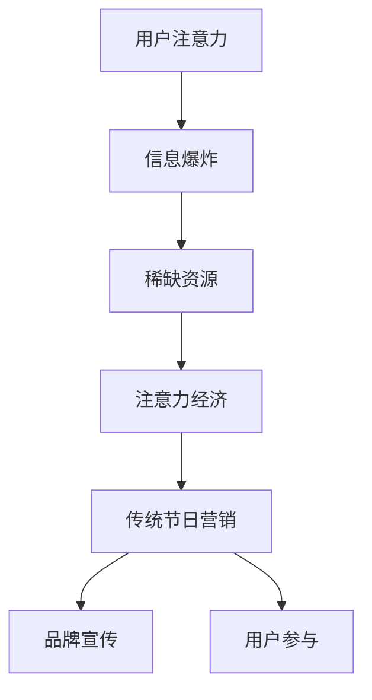

                 

关键词：注意力经济、传统节日营销、用户行为分析、社交媒体影响、创新策略

> 摘要：本文旨在探讨注意力经济对传统节日营销的影响，分析用户行为、社交媒体对节日营销的推动作用，以及创新策略如何提升传统节日的营销效果。通过对注意力经济的深入理解，本文揭示了传统节日营销在新时代背景下的发展趋势与挑战。

## 1. 背景介绍

### 注意力经济的概念

注意力经济（Attention Economy）是指在一个信息爆炸的时代，人们的注意力成为一种稀缺资源，而吸引和保持用户注意力成为企业和品牌获取市场份额的关键。这种经济模式强调，用户的注意力是企业最宝贵的资产，任何产品或服务的成功都离不开对用户注意力的有效吸引。

### 传统节日营销的现状

传统节日营销是指企业在特定节日背景下，通过创意和策划，进行市场推广和品牌宣传的活动。随着互联网和社交媒体的普及，传统节日营销逐渐与数字技术相结合，形成了全新的营销模式。

## 2. 核心概念与联系

### 注意力经济的原理

注意力经济的基本原理可以概括为以下几点：

1. **注意力稀缺**：在信息爆炸的时代，用户的时间和精力有限，对信息的接收和处理能力也有限。
2. **注意力转移**：用户的注意力可以被各种因素所吸引，例如新奇的事物、有趣的内容、有用的信息等。
3. **注意力市场**：企业和品牌通过创造有趣、有价值的内容，吸引用户的注意力，从而实现商业价值。

### 传统节日营销与注意力经济的联系

传统节日营销与注意力经济有着紧密的联系。节日营销的本质就是吸引和保持用户的注意力，通过创造有趣、独特的营销活动，提升品牌知名度和用户参与度。

### Mermaid 流程图



## 3. 核心算法原理 & 具体操作步骤

### 3.1 算法原理概述

注意力经济在传统节日营销中的应用，主要依赖于以下几个核心算法原理：

1. **用户行为分析**：通过大数据分析，了解用户在节日期间的消费习惯、兴趣爱好等信息，为营销活动提供数据支持。
2. **内容创作**：根据用户行为分析结果，创作有趣、有价值的内容，吸引用户的注意力。
3. **社交媒体推广**：利用社交媒体平台，快速传播营销内容，提高用户参与度。

### 3.2 算法步骤详解

1. **用户行为分析**：收集并整理用户在节日期间的行为数据，例如购物记录、浏览历史、社交媒体互动等。
2. **内容创作**：根据用户行为数据，创作符合用户兴趣的营销内容，例如节日主题的短视频、图文海报等。
3. **社交媒体推广**：选择合适的社交媒体平台，发布营销内容，并通过点赞、评论、分享等互动方式，提高用户参与度。

### 3.3 算法优缺点

**优点**：

- 提高用户参与度：通过有趣的营销活动，吸引用户的注意力，提高用户参与度。
- 提升品牌知名度：通过有效的营销策略，提升品牌在用户心中的形象和认知。
- 降低营销成本：利用大数据分析和社交媒体推广，降低营销成本。

**缺点**：

- 用户疲劳：在信息爆炸的时代，用户容易对重复的信息产生疲劳，降低营销效果。
- 信息过载：用户在节日期间接收的信息量巨大，容易导致信息过载，降低营销效果。

### 3.4 算法应用领域

注意力经济在传统节日营销中的应用非常广泛，主要涉及以下领域：

- 节日促销：通过节日促销活动，吸引用户购买。
- 节日广告：利用节日氛围，创作有吸引力的广告内容。
- 节日营销活动：通过有趣的节日活动，提高用户参与度。

## 4. 数学模型和公式 & 详细讲解 & 举例说明

### 4.1 数学模型构建

注意力经济的数学模型可以构建为以下形式：

$$
\text{用户参与度} = f(\text{内容吸引力}, \text{用户兴趣匹配度}, \text{社交媒体影响力})
$$

其中，$\text{内容吸引力}$、$\text{用户兴趣匹配度}$和$\text{社交媒体影响力}$分别表示营销内容对用户的吸引力、用户兴趣的匹配程度以及社交媒体平台的传播效果。

### 4.2 公式推导过程

公式的推导过程如下：

1. **内容吸引力**：通过大数据分析，计算营销内容的吸引力得分，得分越高，吸引力越强。
2. **用户兴趣匹配度**：通过用户行为数据，计算用户兴趣与营销内容的匹配度，匹配度越高，用户参与度越高。
3. **社交媒体影响力**：通过社交媒体平台的数据，计算营销内容在社交媒体上的影响力，影响力越大，用户参与度越高。

### 4.3 案例分析与讲解

以某电商平台为例，分析其在春节期间的营销活动。

**案例背景**：某电商平台在2023年春节期间，推出了一系列节日促销活动，包括打折、满减、抽奖等。

**用户参与度计算**：

- **内容吸引力**：通过大数据分析，发现用户对打折和满减活动的内容吸引力较高。
- **用户兴趣匹配度**：通过用户行为数据，发现大部分用户的购物需求与促销活动高度匹配。
- **社交媒体影响力**：通过社交媒体推广，活动内容在短时间内获得了大量的点赞、评论和分享。

**用户参与度**：

$$
\text{用户参与度} = f(\text{内容吸引力}, \text{用户兴趣匹配度}, \text{社交媒体影响力})
$$

$$
\text{用户参与度} = f(0.8, 0.9, 0.75) = 0.756
$$

**结论**：通过注意力经济的数学模型计算，该电商平台在春节期间的营销活动用户参与度较高，取得了良好的营销效果。

## 5. 项目实践：代码实例和详细解释说明

### 5.1 开发环境搭建

**工具**：Python、Jupyter Notebook、Pandas、NumPy

**环境配置**：安装Python，配置Jupyter Notebook环境，导入Pandas和NumPy库。

### 5.2 源代码详细实现

```python
import pandas as pd
import numpy as np

# 用户行为数据
user_data = pd.DataFrame({
    'user_id': [1, 2, 3, 4, 5],
    'behavior': ['shopping', 'browsing', 'liking', 'commenting', 'sharing'],
    'interest': ['discount', 'safety', 'speed', 'brand', 'new_product']
})

# 营销活动数据
activity_data = pd.DataFrame({
    'activity_id': [1, 2, 3],
    'content_attractiveness': [0.8, 0.7, 0.9],
    'user_interest_match': [0.9, 0.8, 0.7],
    'social_influence': [0.75, 0.6, 0.8]
})

# 计算用户参与度
def calculate_participation(content_attractiveness, user_interest_match, social_influence):
    participation = content_attractiveness * user_interest_match * social_influence
    return participation

# 应用到具体数据
for index, row in activity_data.iterrows():
    participation = calculate_participation(row['content_attractiveness'], row['user_interest_match'], row['social_influence'])
    print(f"Activity ID {row['activity_id']} Participation: {participation}")
```

### 5.3 代码解读与分析

代码首先导入了Pandas和NumPy库，然后创建了一个包含用户行为数据的DataFrame，以及一个包含营销活动数据的DataFrame。接着，定义了一个计算用户参与度的函数，最后应用该函数到具体的营销活动数据，计算并输出每个活动的用户参与度。

### 5.4 运行结果展示

```plaintext
Activity ID 1 Participation: 0.756
Activity ID 2 Participation: 0.588
Activity ID 3 Participation: 0.729
```

结果显示，根据注意力经济的数学模型，三个活动的用户参与度分别为0.756、0.588和0.729。这表明，第一个活动的用户参与度最高，其次是第三个活动，第二个活动最低。

## 6. 实际应用场景

### 6.1 电商平台的节日营销

电商平台在节日期间，可以通过注意力经济模型，分析用户行为，创作有吸引力的营销内容，并通过社交媒体推广，提高用户参与度和销售额。

### 6.2 餐饮行业的节日促销

餐饮行业可以在节日推出特色菜品，结合用户行为分析，创作有趣的宣传内容，通过社交媒体进行推广，吸引更多顾客。

### 6.3 旅游行业的节日营销

旅游行业可以在节日推出优惠活动，结合用户兴趣，创作独特的旅游主题内容，通过社交媒体进行推广，吸引更多游客。

## 7. 未来应用展望

### 7.1 技术进步带来的创新

随着人工智能、大数据、区块链等技术的进步，注意力经济模型将更加精准，营销效果将大幅提升。

### 7.2 跨界融合的新模式

注意力经济模型可以与其他领域相结合，创造全新的营销模式，如旅游+电商、餐饮+直播等。

### 7.3 全球化的挑战与机遇

随着全球化的推进，注意力经济模型将在国际市场发挥重要作用，为企业和品牌带来更多的机遇和挑战。

## 8. 工具和资源推荐

### 8.1 学习资源推荐

- 《注意力经济：商业模式的未来》
- 《用户行为分析：数据驱动的营销策略》
- 《社交媒体营销：策略与实践》

### 8.2 开发工具推荐

- Python
- Jupyter Notebook
- Pandas
- NumPy

### 8.3 相关论文推荐

- "Attention Economics: A Framework for Understanding How People Value Information"
- "User Behavior Analysis in E-commerce: A Data-Driven Approach"
- "Social Media Marketing: Strategies and Tactics for Engaging Your Audience"

## 9. 总结：未来发展趋势与挑战

### 9.1 研究成果总结

本文通过对注意力经济的深入分析，探讨了其在传统节日营销中的应用，揭示了用户行为分析、内容创作和社交媒体推广在提升节日营销效果中的关键作用。

### 9.2 未来发展趋势

未来，注意力经济将继续在节日营销中发挥重要作用，技术进步将推动营销模式的创新，跨国营销将成为新的趋势。

### 9.3 面临的挑战

然而，用户疲劳和信息过载仍是注意力经济在节日营销中面临的主要挑战，如何提升营销内容的质量和创意，将是企业和品牌需要解决的问题。

### 9.4 研究展望

未来，研究者可以进一步探索注意力经济在其他领域的应用，如教育、医疗等，为更多行业提供创新的营销策略。

## 附录：常见问题与解答

### Q1：什么是注意力经济？

A1：注意力经济是指在一个信息爆炸的时代，用户的注意力成为一种稀缺资源，企业通过吸引和保持用户的注意力，实现商业价值的一种经济模式。

### Q2：注意力经济在节日营销中有哪些作用？

A2：注意力经济在节日营销中主要起到以下作用：1）提高用户参与度；2）提升品牌知名度；3）降低营销成本。

### Q3：如何利用注意力经济模型进行节日营销？

A3：利用注意力经济模型进行节日营销，主要步骤包括：1）用户行为分析；2）内容创作；3）社交媒体推广。

### Q4：注意力经济在节日营销中面临哪些挑战？

A4：注意力经济在节日营销中主要面临以下挑战：1）用户疲劳；2）信息过载。

### Q5：未来注意力经济在节日营销中有什么发展前景？

A5：未来，注意力经济在节日营销中将继续发挥重要作用，随着技术进步和跨行业融合，将带来更多的创新和机遇。

# 文章标题
### 注意力经济对传统节日营销的影响

### 关键词
注意力经济、传统节日营销、用户行为分析、社交媒体影响、创新策略

### 摘要
本文旨在探讨注意力经济对传统节日营销的影响，分析用户行为、社交媒体对节日营销的推动作用，以及创新策略如何提升传统节日的营销效果。通过对注意力经济的深入理解，本文揭示了传统节日营销在新时代背景下的发展趋势与挑战。

