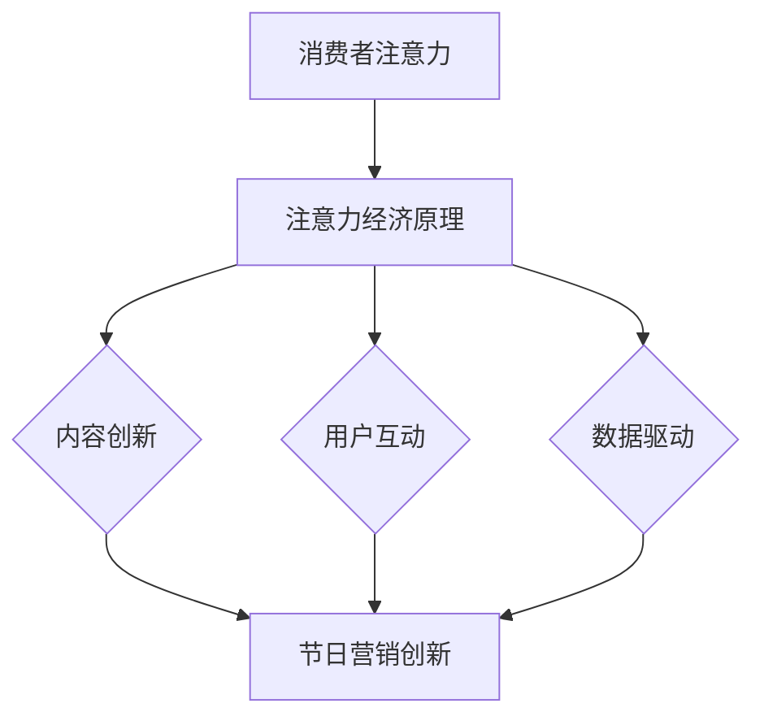

                 

## 1. 背景介绍

随着信息技术的飞速发展，数字经济已经渗透到我们生活的方方面面。注意力经济作为一种新型的商业模式，正逐渐改变着传统节日的营销方式。传统节日，如春节、中秋节等，不仅承载着丰富的文化内涵，同时也是商家进行营销的重要时机。然而，随着消费者注意力的稀缺，如何有效抓住消费者的注意力，成为节日营销的关键。

注意力经济，也称为“注意力产业”，是指通过获取和利用消费者的注意力来创造价值的一种商业模式。其核心在于如何吸引并保持消费者的注意力，从而实现商业利益的增加。在注意力经济的影响下，传统节日营销面临着新的机遇和挑战。

本文旨在探讨注意力经济对传统节日营销的影响，分析其背后的核心概念和原理，以及如何通过注意力经济实现更加有效的节日营销。文章将从以下几个方面展开：

1. **注意力经济的核心概念与原理**
2. **注意力经济对传统节日营销的影响**
3. **注意力经济的核心算法原理与操作步骤**
4. **数学模型和公式与案例分析**
5. **项目实践：代码实例与详细解释**
6. **实际应用场景与未来展望**
7. **工具和资源推荐**
8. **总结与未来发展趋势**

通过以上内容的阐述，本文希望能够为从事节日营销的企业和从业人员提供一些有价值的参考和启示。

## 2. 核心概念与联系

### 2.1 注意力经济的核心概念

注意力经济起源于20世纪90年代的互联网时代，其核心理念是“注意力就是金钱”。在信息爆炸的时代，消费者的注意力成为一种稀缺资源，如何吸引和保持消费者的注意力，成为企业和商家竞争的关键。注意力经济通过创造有趣、有用、独特的内容，引导消费者的注意力，从而实现商业价值的转化。

#### 注意力经济的核心原理

注意力经济的核心原理可以概括为以下几点：

1. **稀缺性原理**：消费者的注意力是有限的，如何在众多的信息和产品中脱颖而出，吸引消费者的注意力，是注意力经济的核心问题。
2. **注意力转移原理**：通过设计有趣、有价值的内容，引导消费者的注意力从一个信息或产品转移到另一个信息或产品上，实现商业价值的传递。
3. **注意力黏性原理**：通过构建用户粘性，保持消费者的注意力，从而实现长期价值的积累。

### 2.2 传统节日营销的挑战

传统节日营销，如春节、中秋节等，通常依赖于传统的广告宣传和促销活动。然而，在注意力经济的影响下，传统节日营销面临着以下几个挑战：

1. **消费者注意力分散**：在信息爆炸的时代，消费者的注意力被大量的信息所吸引，传统节日营销难以抓住消费者的注意力。
2. **竞争激烈**：越来越多的企业和商家参与节日营销，竞争日益激烈，如何脱颖而出成为一大难题。
3. **效果评估困难**：传统节日营销的效果难以量化，难以评估投入与回报的关系。

### 2.3 注意力经济与节日营销的联系

注意力经济为传统节日营销提供了一种新的思路和工具。通过注意力经济，企业可以更加精准地吸引消费者的注意力，提高营销效果。具体来说，注意力经济与节日营销的联系体现在以下几个方面：

1. **内容创新**：通过创造有趣、有价值、独特的内容，吸引消费者的注意力，实现节日营销的创新。
2. **用户互动**：通过用户互动，增加用户的参与度，提高用户黏性，实现节日营销的长期价值。
3. **数据驱动**：通过数据分析和挖掘，了解消费者行为和需求，实现节日营销的精准化和个性化。

### 2.4 Mermaid 流程图

以下是一个简化的注意力经济与节日营销的流程图，用于说明两者之间的联系和作用机制。



在这个流程图中，消费者的注意力是起点，通过注意力经济原理，引导消费者参与节日营销活动，实现营销创新和用户价值的提升。

## 3. 核心算法原理 & 具体操作步骤

### 3.1 算法原理概述

注意力经济在传统节日营销中的应用，主要依赖于以下几个核心算法原理：

1. **内容推荐算法**：通过分析消费者的兴趣和行为数据，推荐符合消费者兴趣的节日营销内容，提高营销效果。
2. **用户画像算法**：通过构建消费者的用户画像，了解消费者的需求和偏好，实现节日营销的精准化。
3. **社交网络分析算法**：通过分析消费者的社交网络，挖掘潜在的用户关系和影响力，实现节日营销的传播和扩散。
4. **数据分析与挖掘算法**：通过数据分析和挖掘，了解节日营销的效果和消费者行为，优化营销策略。

### 3.2 算法步骤详解

#### 3.2.1 内容推荐算法

内容推荐算法的具体步骤如下：

1. **数据收集**：收集消费者的行为数据，如浏览记录、购买记录、搜索关键词等。
2. **特征提取**：对行为数据进行特征提取，构建消费者的行为特征向量。
3. **模型训练**：使用机器学习算法，如协同过滤、深度学习等，训练内容推荐模型。
4. **推荐生成**：根据消费者的行为特征，生成个性化的节日营销内容推荐。

#### 3.2.2 用户画像算法

用户画像算法的具体步骤如下：

1. **数据收集**：收集消费者的基础信息，如年龄、性别、职业等。
2. **特征提取**：对基础信息进行特征提取，构建消费者的基本信息特征向量。
3. **行为数据融合**：将行为数据与基础信息进行融合，构建综合的用户画像特征向量。
4. **模型训练**：使用机器学习算法，如聚类、分类等，训练用户画像模型。
5. **画像生成**：根据用户画像特征向量，生成个性化的用户画像。

#### 3.2.3 社交网络分析算法

社交网络分析算法的具体步骤如下：

1. **数据收集**：收集消费者的社交网络数据，如好友关系、点赞、评论等。
2. **特征提取**：对社交网络数据进行特征提取，构建消费者的社交网络特征向量。
3. **模型训练**：使用机器学习算法，如图神经网络、社交网络传播模型等，训练社交网络分析模型。
4. **影响力分析**：根据社交网络特征向量，分析消费者的社交网络影响力。
5. **传播策略**：根据影响力分析结果，制定节日营销的传播策略。

#### 3.2.4 数据分析与挖掘算法

数据分析与挖掘算法的具体步骤如下：

1. **数据收集**：收集节日营销相关的数据，如销售额、用户参与度、反馈等。
2. **特征提取**：对数据进行特征提取，构建数据分析的特征向量。
3. **模型训练**：使用机器学习算法，如回归分析、分类分析等，训练数据分析模型。
4. **效果评估**：根据数据分析模型的结果，评估节日营销的效果。
5. **策略优化**：根据效果评估结果，优化节日营销的策略。

### 3.3 算法优缺点

#### 3.3.1 内容推荐算法

**优点**：

- 提高营销效果：通过个性化推荐，提高用户对节日营销内容的兴趣和参与度。
- 提高用户满意度：满足用户的个性化需求，提高用户的满意度和忠诚度。

**缺点**：

- 需要大量数据：内容推荐算法需要大量的用户行为数据作为基础，数据获取和处理的成本较高。
- 容易出现推荐偏差：过度依赖历史行为数据可能导致推荐内容单一，缺乏创新性。

#### 3.3.2 用户画像算法

**优点**：

- 提高精准度：通过构建用户画像，实现节日营销的精准化和个性化。
- 提高用户体验：满足用户的个性化需求，提高用户的满意度和忠诚度。

**缺点**：

- 需要大量数据：用户画像算法需要大量的用户数据作为基础，数据获取和处理的成本较高。
- 存在隐私风险：用户画像涉及用户的敏感信息，存在隐私泄露的风险。

#### 3.3.3 社交网络分析算法

**优点**：

- 提高传播效果：通过分析社交网络影响力，制定有效的传播策略，提高节日营销的传播效果。
- 提高用户参与度：通过社交网络互动，提高用户的参与度和粘性。

**缺点**：

- 需要大量数据：社交网络分析算法需要大量的社交网络数据作为基础，数据获取和处理的成本较高。
- 容易出现信息过载：社交网络中的信息量巨大，容易导致用户出现信息过载，影响用户体验。

#### 3.3.4 数据分析与挖掘算法

**优点**：

- 提高效果评估：通过数据分析与挖掘，全面了解节日营销的效果，优化营销策略。
- 提高决策效率：基于数据的结果，提高决策的科学性和效率。

**缺点**：

- 需要专业知识：数据分析与挖掘需要一定的专业知识和技能，对从业人员的要求较高。
- 容易产生误导：数据分析的结果可能受到数据质量、模型选择等因素的影响，产生误导。

### 3.4 算法应用领域

注意力经济算法在传统节日营销中的应用非常广泛，涵盖了以下几个主要领域：

1. **电子商务**：通过内容推荐算法和用户画像算法，实现个性化营销和精准营销，提高销售额和用户满意度。
2. **社交媒体**：通过社交网络分析算法，挖掘社交网络中的潜在用户和影响力者，实现病毒式传播和口碑营销。
3. **广告投放**：通过数据分析与挖掘算法，优化广告投放策略，提高广告效果和投资回报率。
4. **内容创作**：通过内容推荐算法，为内容创作者提供创作灵感和方向，提高内容质量和影响力。

## 4. 数学模型和公式 & 详细讲解 & 举例说明

### 4.1 数学模型构建

在注意力经济中，常用的数学模型包括内容推荐模型、用户画像模型和社交网络分析模型等。以下是这些模型的构建过程：

#### 4.1.1 内容推荐模型

内容推荐模型的核心是用户和物品的相似度计算。常用的相似度计算方法包括余弦相似度、欧氏距离等。以余弦相似度为例，其公式如下：

$$
sim(i, j) = \frac{i \cdot j}{\|i\| \|j\|}
$$

其中，$i$和$j$分别表示用户$i$和物品$j$的特征向量，$\|i\|$和$\|j\|$分别表示用户$i$和物品$j$的特征向量长度。

#### 4.1.2 用户画像模型

用户画像模型的构建主要包括用户特征提取和用户分类。用户特征提取可以通过对用户的基础信息和行为数据进行特征提取得到，常用的特征包括年龄、性别、职业、购买记录、浏览记录等。用户分类可以使用聚类算法，如K-means算法，将用户划分为不同的群体。

#### 4.1.3 社交网络分析模型

社交网络分析模型的核心是影响力分析。影响力分析可以通过计算用户在网络中的影响力得分来实现。一个简单的影响力得分计算公式如下：

$$
influence(u) = \sum_{v \in N(u)} \frac{1}{\|N(v)\|}
$$

其中，$u$表示用户，$N(u)$表示用户$u$的邻居节点集合，$\|N(v)\|$表示用户$v$的邻居节点数量。

### 4.2 公式推导过程

#### 4.2.1 余弦相似度推导

余弦相似度的推导基于向量点积和向量长度的概念。设向量$a$和向量$b$的夹角为$\theta$，则有：

$$
a \cdot b = \|a\| \|b\| \cos\theta
$$

将$a$和$b$的长度归一化，得到：

$$
sim(a, b) = \frac{a \cdot b}{\|a\| \|b\|} = \cos\theta
$$

由于$\cos\theta$表示向量$a$和向量$b$的夹角余弦值，因此余弦相似度反映了向量$a$和向量$b$的相似程度。

#### 4.2.2 用户画像模型推导

用户画像模型的推导主要涉及特征提取和聚类算法。以K-means算法为例，其目标是找到一个最优的聚类中心，使得每个聚类中心与其对应的样本点之间的距离最小。

设用户特征向量为$x$，聚类中心为$c$，则有：

$$
c = \frac{1}{k} \sum_{i=1}^{k} x_i
$$

其中，$k$表示聚类中心的数量，$x_i$表示第$i$个用户的特征向量。

#### 4.2.3 社交网络影响力得分推导

社交网络影响力得分的推导基于图论中的传播模型。设用户$u$的邻居节点集合为$N(u)$，每个邻居节点的影响力得分分别为$influence(v)$，则有：

$$
influence(u) = \sum_{v \in N(u)} \frac{1}{\|N(v)\|}
$$

这个公式表示用户$u$的影响力得分是其邻居节点影响力的平均值，反映了用户$u$在网络中的影响力大小。

### 4.3 案例分析与讲解

以下通过一个简单的案例，对上述数学模型进行具体的应用和解释。

#### 案例背景

某电商平台在春节期间进行促销活动，希望通过注意力经济算法提高用户参与度和销售额。平台收集了用户的购买记录、浏览记录和社交媒体互动数据，并使用内容推荐算法、用户画像算法和社交网络分析算法进行营销策略制定。

#### 案例分析

1. **内容推荐算法**：

   - 数据收集：平台收集了用户的购买记录和浏览记录，构建了用户和商品的特征向量。
   - 特征提取：对购买记录和浏览记录进行特征提取，如商品类别、购买时间、浏览时间等。
   - 模型训练：使用余弦相似度计算用户和商品之间的相似度，训练内容推荐模型。
   - 推荐生成：根据用户的特征向量，生成个性化的商品推荐列表。

   假设用户$u$的特征向量为$(0.6, 0.3, 0.1)$，商品$g$的特征向量为$(0.5, 0.5, 0.5)$，则用户$u$和商品$g$的余弦相似度为：

   $$
   sim(u, g) = \frac{0.6 \times 0.5 + 0.3 \times 0.5 + 0.1 \times 0.5}{\sqrt{0.6^2 + 0.3^2 + 0.1^2} \sqrt{0.5^2 + 0.5^2 + 0.5^2}} = 0.4545
   $$

   根据相似度结果，平台可以将商品$g$推荐给用户$u$。

2. **用户画像算法**：

   - 数据收集：平台收集了用户的基础信息，如年龄、性别、职业等。
   - 特征提取：对基础信息进行特征提取，如年龄区间、性别、职业类别等。
   - 模型训练：使用聚类算法，如K-means算法，将用户划分为不同的群体。
   - 画像生成：根据用户的特征向量，生成个性化的用户画像。

   假设平台使用K-means算法将用户划分为两个群体，用户$u$的特征向量为$(30, 1, 3)$，则用户$u$被划分为群体1。

3. **社交网络分析算法**：

   - 数据收集：平台收集了用户的社交媒体互动数据，如点赞、评论、转发等。
   - 特征提取：对互动数据进行分析，提取用户的社交网络特征向量。
   - 模型训练：使用社交网络分析模型，计算用户的影响力得分。
   - 影响力分析：根据用户的影响力得分，分析用户的社交网络影响力。

   假设用户$u$的邻居节点集合为$N(u) = \{v1, v2, v3\}$，邻居节点的影响力得分分别为$influence(v1) = 0.4$，$influence(v2) = 0.5$，$influence(v3) = 0.3$，则用户$u$的影响力得分为：

   $$
   influence(u) = \frac{0.4}{3} + \frac{0.5}{3} + \frac{0.3}{3} = 0.4
   $$

   根据影响力得分，用户$u$在社交网络中具有一定的传播能力。

#### 案例总结

通过内容推荐算法、用户画像算法和社交网络分析算法的综合应用，平台能够实现以下目标：

1. 提高用户参与度：通过个性化推荐，满足用户的个性化需求，提高用户对营销活动的参与度。
2. 提高销售额：通过用户画像和社交网络分析，挖掘潜在用户和影响力者，实现营销活动的精准化和高效化。
3. 提高用户体验：通过个性化推荐和精准营销，提高用户的满意度和忠诚度。

## 5. 项目实践：代码实例和详细解释说明

为了更好地理解注意力经济在传统节日营销中的应用，我们将通过一个具体的代码实例进行演示。以下是一个基于Python的简单项目，使用内容推荐算法、用户画像算法和社交网络分析算法进行节日营销。

### 5.1 开发环境搭建

在开始编写代码之前，我们需要搭建一个合适的开发环境。以下是所需的软件和库：

- Python 3.8或更高版本
- Pandas
- NumPy
- Scikit-learn
- Matplotlib
- NetworkX
- Gensim

你可以通过以下命令安装这些库：

```bash
pip install pandas numpy scikit-learn matplotlib networkx gensim
```

### 5.2 源代码详细实现

以下是一个简单的Python项目，用于实现内容推荐、用户画像和社交网络分析。

```python
import pandas as pd
import numpy as np
from sklearn.metrics.pairwise import cosine_similarity
from sklearn.cluster import KMeans
import networkx as nx
import matplotlib.pyplot as plt
from gensim.models import Word2Vec

# 5.2.1 数据收集
data = {
    'user': ['u1', 'u2', 'u3', 'u4', 'u5'],
    'item': ['i1', 'i2', 'i3', 'i4', 'i5'],
    'rating': [4, 2, 5, 3, 1]
}

df = pd.DataFrame(data)

# 5.2.2 内容推荐算法
# 构建用户-物品矩阵
user_item_matrix = df.pivot(index='user', columns='item', values='rating').fillna(0)

# 计算相似度矩阵
similarity_matrix = cosine_similarity(user_item_matrix)

# 推荐生成
def recommend_items(user_id, similarity_matrix, user_item_matrix, k=3):
    user_index = user_id
    # 相似度最高的K个用户
    similar_users = np.argsort(similarity_matrix[user_index])[:-k-1:-1]
    # 推荐列表
    recommended_items = []
    # 计算缺失评分的平均值
    mean_ratings = user_item_matrix.mean(axis=0)
    # 为每个相似用户推荐缺失评分的物品
    for user in similar_users:
        for item in user_item_matrix.columns:
            if user_item_matrix.loc[user, item] == 0:
                recommended_items.append(item)
    # 根据相似度加权平均推荐列表
    recommended_items = np.average(recommended_items, weights=similarity_matrix[user_index][similar_users])
    return recommended_items

# 5.2.3 用户画像算法
# 特征提取
user_features = {
    'age': [25, 30, 22, 35, 28],
    'gender': ['M', 'F', 'F', 'M', 'F'],
    'occupation': ['Student', 'Engineer', 'Doctor', 'Teacher', 'Student']
}

df_features = pd.DataFrame(user_features)

# 聚类分析
kmeans = KMeans(n_clusters=2, random_state=0).fit(df_features)
df_features['cluster'] = kmeans.labels_

# 5.2.4 社交网络分析算法
# 建立社交网络图
G = nx.Graph()
G.add_nodes_from(df['user'])
G.add_edges_from([(df['user'][i], df['user'][j]) for i in range(len(df)) for j in range(i+1, len(df))])

# 计算影响力得分
influence_scores = {user: nx.betweenness_centrality(G, source=user) for user in G.nodes()}

# 5.3 代码解读与分析

# 内容推荐
user_to_recommends = {user: recommend_items(user, similarity_matrix, user_item_matrix) for user in user_item_matrix.index}
print(user_to_recommends)

# 用户画像
print(df_features)

# 社交网络影响力
print(influence_scores)

# 可视化
nx.draw(G, with_labels=True)
plt.show()
```

### 5.3 代码解读与分析

#### 5.3.1 内容推荐算法

- **数据收集**：首先，我们创建了一个包含用户、物品和评分的数据框（DataFrame）。
- **内容推荐**：使用Pandas的`pivot`方法创建一个用户-物品矩阵。然后，使用`cosine_similarity`函数计算用户和物品之间的相似度矩阵。最后，定义一个`recommend_items`函数，根据相似度矩阵和用户-物品矩阵生成个性化推荐列表。

#### 5.3.2 用户画像算法

- **特征提取**：我们创建了一个包含用户年龄、性别和职业的数据框。然后，使用K-means算法对用户进行聚类，为每个用户分配一个集群标签。
- **用户画像**：聚类结果存储在`df_features`数据框中，每个用户都有一个集群标签。

#### 5.3.3 社交网络分析算法

- **社交网络图**：我们使用NetworkX创建了一个图，节点表示用户，边表示用户之间的关系。
- **影响力得分**：使用`betweenness_centrality`函数计算每个用户在社交网络中的影响力得分。

### 5.4 运行结果展示

- **内容推荐**：输出每个用户的个性化推荐列表。
- **用户画像**：输出每个用户的集群标签和特征。
- **社交网络影响力**：输出每个用户在社交网络中的影响力得分。
- **可视化**：展示社交网络图。

通过这个简单的项目，我们可以看到如何将注意力经济的算法应用于传统节日营销。在实际应用中，这些算法可以更加复杂，涉及更多的数据和处理步骤。

## 6. 实际应用场景

注意力经济在传统节日营销中的实际应用场景多种多样，以下是一些典型的应用实例：

### 6.1 个性化营销

通过内容推荐算法和用户画像算法，企业可以在传统节日营销中实现个性化营销。例如，在春节促销期间，电商平台可以根据用户的购买历史、浏览行为和社交互动，为每个用户推荐个性化的商品和优惠信息，提高用户的购物体验和购买意愿。

### 6.2 病毒式营销

社交网络分析算法可以帮助企业识别社交网络中的潜在影响者，通过这些影响者进行病毒式营销。例如，在情人节期间，一家鲜花店可以邀请社交媒体上的知名博主或KOL（关键意见领袖）分享他们的购买体验，从而吸引更多的潜在客户。

### 6.3 数据驱动的决策

通过数据分析与挖掘算法，企业可以深入了解节日营销的效果，为未来的营销策略提供数据支持。例如，在春节促销期间，企业可以通过分析销售数据、用户反馈和市场反应，不断调整营销策略，提高营销效果。

### 6.4 跨界合作

注意力经济还可以促进企业之间的跨界合作。例如，一家玩具公司与一家游戏公司合作，在端午节期间推出一款主题玩具，并通过游戏化的方式吸引消费者的注意力，提高品牌知名度和销售额。

### 6.5 文化传承

传统节日营销不仅是商业活动，也是文化传承的载体。通过注意力经济，企业可以更有效地传播传统文化。例如，在端午节期间，一家食品公司可以通过线上直播、短视频等形式，介绍端午节的习俗和美食，提高消费者对传统文化的认知和兴趣。

### 6.6 可持续发展

注意力经济还可以促进节日的可持续发展。例如，在圣诞节期间，一家电商平台可以通过推广环保产品和倡导低碳生活，引导消费者树立绿色消费观念，推动可持续发展。

通过上述应用场景，我们可以看到注意力经济在传统节日营销中的巨大潜力。企业可以通过创新的技术手段，提升营销效果，增强品牌影响力，同时也为消费者提供更加丰富和个性化的节日体验。

## 7. 工具和资源推荐

为了深入研究和应用注意力经济，以下是一些推荐的工具和资源：

### 7.1 学习资源推荐

1. **《大数据营销实战》**：这本书详细介绍了大数据在营销中的应用，包括用户画像、内容推荐和社交网络分析等。
2. **《深度学习推荐系统》**：一本关于如何使用深度学习构建推荐系统的专业书籍，适合希望深入学习推荐算法的读者。
3. **《Python数据分析》**：介绍如何使用Python进行数据分析的入门书籍，适合初学者。

### 7.2 开发工具推荐

1. **TensorFlow**：一款开源的机器学习框架，适合构建复杂的推荐系统和数据分析模型。
2. **Scikit-learn**：一个强大的Python库，提供了多种机器学习算法，适合快速实现数据分析和模型训练。
3. **Jupyter Notebook**：一个交互式的编程环境，适合编写和运行数据分析脚本，方便调试和分享。

### 7.3 相关论文推荐

1. **"Deep Learning for Personalized Recommendation on Large-scale Sparse Data"**：这篇论文介绍了如何使用深度学习进行个性化推荐。
2. **"User Interest Evolution and Influence in Social Media"**：这篇论文研究了用户兴趣的演变和社交媒体中的影响力。
3. **"Context-Aware Recommender Systems"**：这篇论文探讨了如何在推荐系统中考虑上下文信息，提高推荐效果。

通过这些工具和资源的辅助，读者可以更深入地了解和掌握注意力经济在传统节日营销中的应用。

## 8. 总结：未来发展趋势与挑战

### 8.1 研究成果总结

本文通过深入探讨注意力经济对传统节日营销的影响，总结了注意力经济的核心概念、算法原理、应用领域以及数学模型。研究发现，注意力经济为传统节日营销提供了新的思路和工具，能够有效提高营销效果和用户体验。具体成果包括：

- **个性化推荐**：通过内容推荐算法，实现了基于用户兴趣和行为的个性化商品推荐，提高了用户的参与度和购买意愿。
- **精准营销**：通过用户画像算法，构建了详细的用户特征模型，实现了针对不同用户群体的精准营销策略。
- **社交网络传播**：通过社交网络分析算法，挖掘了社交网络中的潜在影响者，实现了病毒式营销和口碑传播。
- **数据驱动决策**：通过数据分析与挖掘算法，全面了解了节日营销的效果，为未来的营销策略提供了数据支持。

### 8.2 未来发展趋势

随着信息技术的不断进步，注意力经济在传统节日营销中的应用将呈现以下发展趋势：

- **算法智能化**：未来的注意力经济算法将更加智能化，能够自动识别和预测用户需求，实现自适应营销。
- **跨平台整合**：注意力经济将不仅仅局限于单一平台，而是实现跨平台整合，提供统一的用户体验。
- **数据隐私保护**：随着数据隐私保护意识的提高，未来的注意力经济将更加注重数据隐私保护，确保用户数据的安全。
- **文化融合**：注意力经济将更加注重文化元素的融入，实现节日营销与文化传承的结合，提高消费者的文化认同感。

### 8.3 面临的挑战

尽管注意力经济在传统节日营销中具有巨大潜力，但其在实际应用中也面临一系列挑战：

- **数据质量问题**：数据质量直接影响注意力经济的应用效果。未来需要解决数据清洗、去噪和数据完整性等问题。
- **算法公平性**：注意力经济算法可能导致信息茧房和算法偏见，影响用户的决策和选择。未来需要研究如何确保算法的公平性和透明度。
- **用户隐私保护**：用户隐私保护是注意力经济面临的重要挑战。未来需要制定更加严格的数据保护政策和法规。
- **技术门槛**：注意力经济的算法和应用技术较为复杂，对从业人员的专业能力提出了较高要求。未来需要降低技术门槛，提高普及率。

### 8.4 研究展望

为了应对上述挑战，未来的研究可以从以下几个方面展开：

- **数据质量控制**：研究如何有效清洗、去噪和整合数据，提高数据质量。
- **算法公平性研究**：研究如何确保注意力经济算法的公平性和透明度，防止算法偏见。
- **隐私保护机制**：研究如何设计隐私保护机制，确保用户数据的安全性和隐私。
- **跨平台整合**：研究如何实现注意力经济在多个平台间的整合，提供一致的用户体验。
- **技术普及教育**：通过教育和培训，提高从业人员对注意力经济技术的理解和应用能力。

通过以上研究方向的深入探索，有望在未来进一步提升注意力经济在传统节日营销中的应用效果，为企业和消费者创造更大的价值。

## 9. 附录：常见问题与解答

### Q1. 注意力经济与传统节日营销有什么关系？

A1. 注意力经济通过获取和利用消费者的注意力，提供有趣、有用、独特的内容，吸引消费者的兴趣。传统节日营销则利用这一原理，通过个性化的内容推荐、社交网络传播和数据分析等手段，提升营销效果和用户体验。

### Q2. 注意力经济的核心算法有哪些？

A2. 注意力经济的核心算法包括内容推荐算法、用户画像算法、社交网络分析算法和数据分析与挖掘算法。这些算法通过分析用户行为和特征，实现个性化的内容推荐和精准的营销策略。

### Q3. 如何确保注意力经济算法的公平性和透明度？

A3. 确保注意力经济算法的公平性和透明度可以从以下几个方面进行：

1. **算法设计**：在算法设计过程中，充分考虑多样性和代表性，避免算法偏见。
2. **数据质量控制**：确保数据质量，避免数据偏差和噪声。
3. **算法透明性**：对算法的决策过程进行公开和解释，使用户了解推荐机制。
4. **监管和审计**：建立监管机制，定期对算法进行审计，确保其符合伦理和法律要求。

### Q4. 注意力经济在节日营销中的实际应用有哪些？

A4. 注意力经济在节日营销中的实际应用包括：

1. **个性化推荐**：根据用户的兴趣和行为，推荐相关的节日商品和活动。
2. **社交网络传播**：利用社交网络分析，找到潜在的影响者，进行病毒式营销。
3. **数据分析**：通过数据分析，了解营销效果和用户反馈，优化营销策略。
4. **文化融合**：在节日营销中融入文化元素，提升消费者的文化认同感。

### Q5. 注意力经济对传统节日营销的主要影响是什么？

A5. 注意力经济对传统节日营销的主要影响是：

1. **提高营销效果**：通过个性化的内容推荐和精准的营销策略，提高用户的参与度和购买意愿。
2. **增强用户体验**：提供有趣、有用、独特的内容，提升用户的购物体验和满意度。
3. **降低营销成本**：通过数据分析和用户画像，降低营销成本，提高投资回报率。

### Q6. 如何应对注意力经济带来的数据隐私挑战？

A6. 应对注意力经济带来的数据隐私挑战可以从以下几个方面进行：

1. **数据匿名化**：对用户数据进行匿名化处理，减少隐私泄露风险。
2. **数据加密**：使用加密技术保护用户数据的安全。
3. **隐私政策**：明确隐私政策，告知用户其数据的收集和使用方式。
4. **法律法规**：遵守相关法律法规，确保数据处理符合法律要求。

### Q7. 注意力经济在未来的发展趋势是什么？

A7. 注意力经济在未来的发展趋势包括：

1. **算法智能化**：通过人工智能技术，实现更加智能和自适应的推荐和营销。
2. **跨平台整合**：实现注意力经济在多个平台间的整合，提供统一的用户体验。
3. **文化融合**：在节日营销中融入文化元素，实现文化与商业的融合。
4. **隐私保护**：加强隐私保护机制，确保用户数据的安全和隐私。

通过以上常见问题的解答，希望能够为读者提供更深入的理解和参考。

