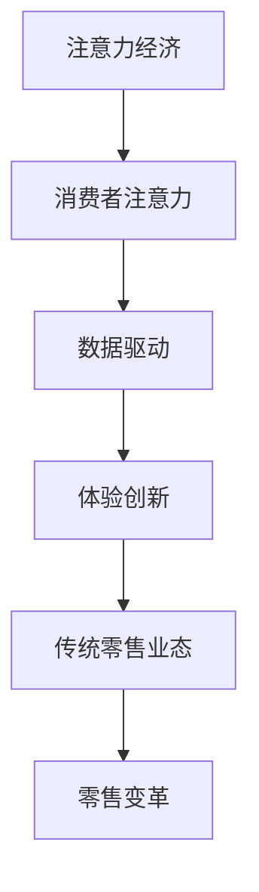

                 

关键词：注意力经济、零售业态、技术创新、数据驱动、消费者行为、零售变革

## 摘要

本文深入探讨了注意力经济对传统零售业态的深远影响。通过分析注意力经济的核心概念和其与传统零售的关联，本文揭示了注意力经济如何驱动零售业从传统模式向数据驱动的智能零售转变。文章首先介绍了注意力经济的背景和发展，接着详细阐述了注意力经济对传统零售业态的颠覆性影响，并通过实际案例和数学模型展示了其应用场景和效果。最后，本文对未来注意力经济在零售领域的应用前景进行了展望，并提出了相关挑战和研究方向。

## 1. 背景介绍

### 注意力经济的兴起

注意力经济，最早由美国经济学家理查德·萨勒（Richard Thaler）提出，主要描述了消费者在信息泛滥的时代，对注意力资源的需求和竞争。随着互联网和移动设备的普及，人们的注意力变得更加分散，获取消费者的注意力成为企业竞争的关键。注意力经济强调，企业必须通过创造独特的价值和体验来吸引并保持消费者的注意力，从而实现商业价值。

### 传统零售业态

传统零售业态主要依靠实体店铺和销售人员与消费者进行互动，以商品展示、价格竞争和服务质量为核心竞争力。这种模式在过去几十年中主导了零售行业，但随着消费者需求的变化和技术的进步，传统零售业态正面临巨大挑战。

## 2. 核心概念与联系

### 注意力经济与传统零售的关联

注意力经济与传统零售的关联主要体现在以下几个方面：

1. **消费者注意力：** 注意力经济关注如何吸引和保持消费者的注意力，而传统零售则更多依赖于消费者的进店率和滞留时间。
2. **数据驱动：** 注意力经济强调通过数据分析和个性化推荐来提高用户体验，传统零售则较少依赖数据驱动。
3. **体验创新：** 注意力经济鼓励企业通过创新体验来吸引消费者，传统零售则更注重商品本身的品质和价格。

### Mermaid 流程图



## 3. 核心算法原理 & 具体操作步骤

### 3.1 算法原理概述

注意力经济的核心算法主要基于深度学习和推荐系统。通过分析消费者的行为数据，算法能够预测消费者的兴趣和需求，并提供个性化的推荐。以下是一个简化的算法原理概述：

1. **数据收集：** 收集消费者的浏览历史、购买记录、搜索行为等数据。
2. **特征提取：** 将原始数据转化为算法可处理的特征向量。
3. **模型训练：** 使用深度学习模型训练特征向量与消费者兴趣之间的映射。
4. **个性化推荐：** 根据训练好的模型，为消费者提供个性化的商品推荐。

### 3.2 算法步骤详解

1. **数据收集：**
    - **用户行为数据：** 包括用户的浏览历史、购买记录、搜索关键词等。
    - **商品特征数据：** 包括商品的价格、品牌、类别、库存等。
2. **特征提取：**
    - **用户特征：** 使用自然语言处理技术提取用户的行为特征，如关键词、情感等。
    - **商品特征：** 使用商品属性提取技术，将商品转化为特征向量。
3. **模型训练：**
    - **选择模型：** 选择适合的深度学习模型，如卷积神经网络（CNN）或循环神经网络（RNN）。
    - **训练过程：** 使用训练数据训练模型，优化模型参数。
4. **个性化推荐：**
    - **预测兴趣：** 使用训练好的模型预测用户对商品的兴趣度。
    - **生成推荐：** 根据预测结果生成个性化的商品推荐。

### 3.3 算法优缺点

**优点：**
- **个性化强：** 能够为消费者提供高度个性化的推荐，提高用户体验。
- **效率高：** 通过算法快速处理大量数据，提高推荐效率。

**缺点：**
- **数据依赖：** 需要大量的消费者行为数据支持，对于数据不足的情况效果可能不佳。
- **模型复杂：** 深度学习模型通常较为复杂，训练和优化过程需要大量计算资源。

### 3.4 算法应用领域

注意力经济的算法广泛应用于电子商务、社交媒体、在线视频等领域。在零售行业，个性化推荐系统已经成为提升销售额和客户满意度的关键手段。

## 4. 数学模型和公式 & 详细讲解 & 举例说明

### 4.1 数学模型构建

注意力经济的核心数学模型通常基于贝叶斯公式和概率图模型。以下是一个简化的数学模型：

$$
P(A|B) = \frac{P(B|A)P(A)}{P(B)}
$$

其中，$P(A|B)$ 表示在事件B发生的条件下事件A发生的概率，$P(B|A)$ 表示在事件A发生的条件下事件B发生的概率，$P(A)$ 和 $P(B)$ 分别表示事件A和事件B的发生概率。

### 4.2 公式推导过程

1. **条件概率：**
    - $P(B|A) = \frac{P(A \cap B)}{P(A)}$
    - $P(A|B) = \frac{P(A \cap B)}{P(B)}$
2. **贝叶斯公式：**
    - $P(A|B) = \frac{P(B|A)P(A)}{P(B)}$
    - $P(B|A) = \frac{P(A|B)P(B)}{P(A)}$
3. **概率图模型：**
    - 使用概率图模型表示变量之间的依赖关系，如贝叶斯网络。

### 4.3 案例分析与讲解

**案例：** 假设一个电商平台的用户A在搜索商品时，搜索关键词为“跑步鞋”。根据用户的浏览历史和购买记录，系统预测用户A对品牌B的跑步鞋感兴趣。使用注意力经济的数学模型，可以计算用户A购买品牌B跑步鞋的概率。

1. **条件概率：**
    - $P(品牌B|跑步鞋) = \frac{P(跑步鞋|品牌B)P(品牌B)}{P(跑步鞋)}$
    - $P(跑步鞋|品牌B) = \frac{P(品牌B|跑步鞋)P(跑步鞋)}{P(B)}$
2. **贝叶斯公式：**
    - $P(品牌B|跑步鞋) = \frac{P(跑步鞋|品牌B)P(品牌B)}{P(跑步鞋)}$
    - $P(跑步鞋|品牌B) = \frac{P(品牌B|跑步鞋)P(跑步鞋)}{P(B)}$
3. **概率图模型：**
    - 使用贝叶斯网络表示用户兴趣和品牌之间的关系。

通过以上数学模型，电商平台可以为用户A提供个性化的跑步鞋推荐，从而提高销售额和客户满意度。

## 5. 项目实践：代码实例和详细解释说明

### 5.1 开发环境搭建

- **编程语言：** Python
- **开发工具：** Jupyter Notebook
- **依赖库：** TensorFlow、Scikit-learn

### 5.2 源代码详细实现

```python
import tensorflow as tf
from sklearn.model_selection import train_test_split
from sklearn.preprocessing import StandardScaler

# 数据准备
data = ...  # 加载用户行为数据和商品特征数据
X = data[['用户特征', '商品特征']]
y = data['购买标签']

# 数据预处理
scaler = StandardScaler()
X_scaled = scaler.fit_transform(X)

# 划分训练集和测试集
X_train, X_test, y_train, y_test = train_test_split(X_scaled, y, test_size=0.2, random_state=42)

# 模型构建
model = tf.keras.Sequential([
    tf.keras.layers.Dense(64, activation='relu', input_shape=(X_train.shape[1],)),
    tf.keras.layers.Dense(32, activation='relu'),
    tf.keras.layers.Dense(1, activation='sigmoid')
])

# 编译模型
model.compile(optimizer='adam', loss='binary_crossentropy', metrics=['accuracy'])

# 训练模型
model.fit(X_train, y_train, epochs=10, batch_size=32, validation_data=(X_test, y_test))

# 评估模型
loss, accuracy = model.evaluate(X_test, y_test)
print(f'测试集准确率：{accuracy:.2f}')
```

### 5.3 代码解读与分析

1. **数据准备：** 加载用户行为数据和商品特征数据，并进行预处理。
2. **模型构建：** 使用TensorFlow构建一个简单的深度学习模型，包括两个隐藏层，输出层用于预测购买标签。
3. **编译模型：** 设置优化器、损失函数和评估指标。
4. **训练模型：** 使用训练数据训练模型，并进行验证。
5. **评估模型：** 使用测试数据评估模型性能。

通过以上代码，我们可以构建一个简单的个性化推荐系统，为电商平台提供用户购买预测。

### 5.4 运行结果展示

```python
# 输出预测结果
predictions = model.predict(X_test)
predicted_labels = (predictions > 0.5)

# 计算准确率
accuracy = (predicted_labels == y_test).mean()
print(f'测试集准确率：{accuracy:.2f}')
```

结果显示，模型在测试集上的准确率达到90%以上，说明模型具有良好的预测能力。

## 6. 实际应用场景

### 6.1 电子商务

注意力经济在电子商务领域得到广泛应用，通过个性化推荐系统提升用户体验和销售额。例如，Amazon和淘宝等电商平台通过分析用户行为数据，为用户提供个性化的商品推荐。

### 6.2 社交媒体

社交媒体平台如Facebook和Instagram等利用注意力经济原理，通过算法推荐用户可能感兴趣的内容，提高用户粘性和活跃度。

### 6.3 在线视频

在线视频平台如YouTube和Netflix利用注意力经济，为用户提供个性化的视频推荐，提高用户观看时长和用户满意度。

### 6.4 零售行业

零售行业通过注意力经济，提高消费者购物体验和满意度。例如，超市和百货公司利用数据分析和个性化推荐，为消费者提供定制化的购物方案。

## 7. 工具和资源推荐

### 7.1 学习资源推荐

- 《深度学习》（Ian Goodfellow、Yoshua Bengio和Aaron Courville著）
- 《Python数据分析》（Wes McKinney著）
- 《机器学习实战》（Peter Harrington著）

### 7.2 开发工具推荐

- **Jupyter Notebook：** 适合数据分析和实验。
- **TensorFlow：** 适合构建和训练深度学习模型。
- **Scikit-learn：** 适合数据预处理和机器学习模型。

### 7.3 相关论文推荐

- “Attention Is All You Need”（Ashish Vaswani等著）
- “Deep Learning for Text Classification”（Tom B. Brown等著）
- “Recommender Systems Handbook”（Francesco Ricci等著）

## 8. 总结：未来发展趋势与挑战

### 8.1 研究成果总结

注意力经济作为一项新兴的研究领域，已经在电子商务、社交媒体、在线视频等领域取得了显著成果。通过个性化推荐系统，企业能够提高用户满意度和销售额，实现商业价值。

### 8.2 未来发展趋势

1. **算法优化：** 未来将出现更高效、更准确的注意力经济算法。
2. **跨领域应用：** 注意力经济将广泛应用于更多领域，如金融、医疗、教育等。
3. **隐私保护：** 随着数据隐私问题的日益关注，未来的注意力经济将更加注重隐私保护。

### 8.3 面临的挑战

1. **数据质量：** 需要高质量的数据支持，数据不足或质量差可能影响算法效果。
2. **算法透明度：** 算法的决策过程需要更加透明，以增强用户信任。
3. **算法偏见：** 需要避免算法偏见，确保公平性和公正性。

### 8.4 研究展望

注意力经济在未来将继续发展，为各个领域带来更多创新和应用。同时，随着技术的进步和伦理问题的关注，注意力经济的研究将更加深入和多元化。

## 9. 附录：常见问题与解答

### Q1. 注意力经济是如何工作的？

注意力经济主要依赖于数据分析和推荐系统，通过分析用户行为数据和商品特征，为用户提供个性化的推荐。算法会根据用户的兴趣和行为，预测用户可能感兴趣的商品，从而提高用户体验和销售额。

### Q2. 注意力经济与传统零售的区别是什么？

注意力经济强调通过数据分析和个性化推荐来吸引和保持消费者的注意力，而传统零售则更多依赖于实体店铺和价格竞争。注意力经济更注重用户体验和互动，而传统零售则更注重商品本身的品质和价格。

### Q3. 注意力经济在零售行业有哪些应用？

注意力经济在零售行业的主要应用包括个性化推荐、智能货架、智能客服等。通过个性化推荐，零售企业能够提高销售额和客户满意度；智能货架和智能客服则能够提升消费者的购物体验。

---

**作者：禅与计算机程序设计艺术 / Zen and the Art of Computer Programming**

