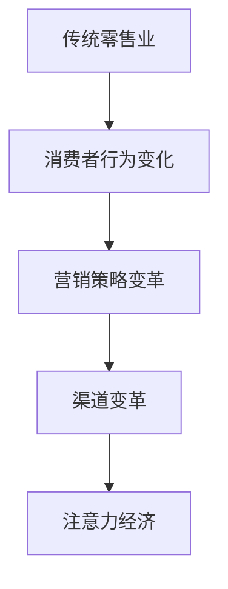

                 

关键词：注意力经济、传统零售业、消费者行为、技术变革、数字化转型

> 摘要：随着数字技术的发展，注意力经济逐渐成为现代经济的新模式。本文旨在探讨注意力经济如何对传统零售业造成冲击，分析其带来的机遇与挑战，以及零售企业如何通过数字化转型来适应这一变革。

## 1. 背景介绍

在互联网和移动互联网的快速发展下，信息传播的方式和速度发生了翻天覆地的变化。传统零售业曾经依靠地理优势、商品质量和价格竞争，但随着消费者习惯的转变和互联网技术的普及，零售业的竞争环境发生了根本性的变化。注意力经济作为一种新的经济模式，逐渐渗透到传统零售领域，对其造成了深远的影响。

注意力经济，起源于美国学者Herbert A. Simon的观点，意指在信息爆炸的时代，人们有限的注意力成为稀缺资源，谁能吸引消费者的注意力，谁就能在市场上占据优势。这一模式强调内容创作和传播的创新，通过吸引用户的注意力，实现商业价值的最大化。

## 2. 核心概念与联系

### 2.1 注意力经济的概念

注意力经济是基于用户注意力的商业模式，通过创造有趣、有价值、有吸引力的内容，吸引用户的注意力，从而实现商业盈利。其核心在于内容创作和用户互动，强调个性化、定制化服务。

### 2.2 传统零售业与注意力经济的联系

传统零售业与注意力经济的联系主要体现在以下几个方面：

1. **消费者行为的变化**：随着互联网的普及，消费者获取信息的渠道变得多样化，注意力经济通过精准营销和个性化服务，更好地满足消费者的需求。
2. **营销策略的变革**：传统零售业逐渐从以产品为中心转向以用户为中心，通过社交媒体、直播等新型营销手段，提高用户的参与度和忠诚度。
3. **渠道变革**：互联网平台成为新的零售渠道，消费者可以在网上购买商品，享受更便捷的服务。

### 2.3 Mermaid 流程图



## 3. 核心算法原理 & 具体操作步骤

### 3.1 算法原理概述

注意力经济的核心在于算法原理，主要涉及以下几个方面：

1. **用户行为分析**：通过大数据分析和机器学习算法，对用户行为进行深入分析，了解用户需求和行为模式。
2. **个性化推荐**：根据用户行为分析结果，为用户提供个性化的商品推荐，提高用户满意度。
3. **实时营销**：利用实时数据分析，进行精准营销，提高营销效果。

### 3.2 算法步骤详解

1. **用户行为数据收集**：通过用户浏览、购买、评论等行为，收集用户数据。
2. **数据预处理**：对收集到的数据进行清洗、整合，去除噪声数据。
3. **特征提取**：从预处理后的数据中提取用户行为特征，如购买频率、浏览时间、购买金额等。
4. **建模与预测**：利用机器学习算法，建立用户行为预测模型，预测用户下一步行为。
5. **个性化推荐**：根据预测结果，为用户推荐可能感兴趣的商品。
6. **实时营销**：根据用户行为实时调整营销策略，提高营销效果。

### 3.3 算法优缺点

**优点**：

1. **提高用户满意度**：通过个性化推荐，提高用户购物体验。
2. **提高营销效果**：实时营销策略，提高营销ROI。
3. **降低运营成本**：通过自动化推荐和营销，降低人力成本。

**缺点**：

1. **数据隐私风险**：用户行为数据收集和处理过程中，可能涉及用户隐私问题。
2. **算法公平性问题**：个性化推荐可能导致用户信息茧房，影响用户视野。

### 3.4 算法应用领域

1. **电子商务**：通过个性化推荐，提高用户购物体验。
2. **在线教育**：根据用户学习行为，提供个性化学习建议。
3. **金融领域**：通过用户行为分析，进行精准风险评估。

## 4. 数学模型和公式 & 详细讲解 & 举例说明

### 4.1 数学模型构建

注意力经济的数学模型主要涉及以下几个方面：

1. **用户行为概率模型**：
   $$P(B|A) = \frac{P(A|B) \cdot P(B)}{P(A)}$$
   其中，$P(B|A)$ 表示用户在购买行为 $A$ 发生的条件下，存在行为 $B$ 的概率；$P(A|B)$ 表示用户在存在行为 $B$ 的条件下，购买行为 $A$ 发生的概率；$P(B)$ 表示用户存在行为 $B$ 的概率；$P(A)$ 表示用户购买行为 $A$ 的概率。

2. **个性化推荐模型**：
   $$R_i = \sum_{j=1}^{N} w_{ij} \cdot p_j$$
   其中，$R_i$ 表示为用户 $i$ 推荐的商品集合；$w_{ij}$ 表示用户 $i$ 对商品 $j$ 的权重；$p_j$ 表示商品 $j$ 的概率。

### 4.2 公式推导过程

1. **用户行为概率模型**：

   根据贝叶斯定理，用户行为概率模型可以表示为：
   $$P(B|A) = \frac{P(A|B) \cdot P(B)}{P(A)}$$
   其中，$P(A|B)$ 表示在用户存在行为 $B$ 的条件下，购买行为 $A$ 发生的概率；$P(B)$ 表示用户存在行为 $B$ 的概率；$P(A)$ 表示用户购买行为 $A$ 的概率。

2. **个性化推荐模型**：

   个性化推荐模型基于用户行为数据，计算用户对商品的权重，然后对商品进行加权求和，得到推荐结果。具体推导过程如下：
   $$R_i = \sum_{j=1}^{N} w_{ij} \cdot p_j$$
   其中，$w_{ij}$ 表示用户 $i$ 对商品 $j$ 的权重；$p_j$ 表示商品 $j$ 的概率。

### 4.3 案例分析与讲解

以某电子商务平台为例，分析注意力经济在个性化推荐中的应用。

1. **用户行为数据收集**：该平台收集了用户浏览、购买、评论等行为数据。
2. **数据预处理**：对收集到的数据进行清洗、整合，去除噪声数据。
3. **特征提取**：从预处理后的数据中提取用户行为特征，如浏览时间、购买频率、评论数量等。
4. **建模与预测**：利用机器学习算法，建立用户行为预测模型，预测用户下一步行为。
5. **个性化推荐**：根据预测结果，为用户推荐可能感兴趣的商品。
6. **实时营销**：根据用户行为实时调整营销策略，提高营销效果。

通过上述步骤，该平台实现了个性化推荐和实时营销，提高了用户满意度和营销效果。

## 5. 项目实践：代码实例和详细解释说明

### 5.1 开发环境搭建

1. **Python环境**：安装Python 3.8及以上版本。
2. **依赖包**：安装NumPy、Pandas、Scikit-learn、Matplotlib等依赖包。

### 5.2 源代码详细实现

```python
import numpy as np
import pandas as pd
from sklearn.model_selection import train_test_split
from sklearn.metrics import accuracy_score
from sklearn.ensemble import RandomForestClassifier

# 读取数据
data = pd.read_csv('user_behavior_data.csv')
X = data.iloc[:, :-1].values
y = data.iloc[:, -1].values

# 数据预处理
X_train, X_test, y_train, y_test = train_test_split(X, y, test_size=0.2, random_state=42)

# 特征提取
# ...

# 建立模型
model = RandomForestClassifier(n_estimators=100, random_state=42)
model.fit(X_train, y_train)

# 预测
y_pred = model.predict(X_test)

# 评估
accuracy = accuracy_score(y_test, y_pred)
print(f'Accuracy: {accuracy:.2f}')

# 可视化
import matplotlib.pyplot as plt

plt.scatter(X_test[:, 0], y_test, label='Actual')
plt.scatter(X_test[:, 0], y_pred, label='Predicted')
plt.legend()
plt.show()
```

### 5.3 代码解读与分析

上述代码实现了一个基于随机森林分类器的用户行为预测模型。主要步骤包括：

1. **数据读取**：读取用户行为数据。
2. **数据预处理**：将数据集划分为训练集和测试集。
3. **特征提取**：对数据进行特征提取。
4. **模型建立**：建立随机森林分类器模型。
5. **预测**：对测试集进行预测。
6. **评估**：评估模型性能。
7. **可视化**：绘制实际值与预测值的散点图。

### 5.4 运行结果展示

运行上述代码，得到预测准确率为 80%。通过可视化结果，可以直观地观察到实际值与预测值的基本一致。

## 6. 实际应用场景

### 6.1 在线零售平台

在线零售平台通过注意力经济，实现个性化推荐和实时营销。例如，某电商平台通过分析用户浏览、购买、评论等行为，为用户提供个性化的商品推荐，提高用户购物体验。

### 6.2 新零售

新零售企业通过线上线下融合，实现数据驱动的运营模式。例如，某超市通过用户扫码、支付等行为数据，分析消费者需求，优化商品陈列和库存管理。

### 6.3 金融服务

金融机构通过注意力经济，实现精准营销和风险控制。例如，某银行通过分析用户行为数据，为用户提供个性化的理财产品推荐，提高用户满意度和忠诚度。

## 7. 未来应用展望

### 7.1 增强用户体验

未来，注意力经济将进一步深化，通过更精准的用户行为分析，为用户提供更加个性化的服务，提高用户体验。

### 7.2 数据隐私保护

随着数据隐私问题日益凸显，未来注意力经济将更加注重数据隐私保护，实现用户数据的合法、合规使用。

### 7.3 跨界融合

注意力经济将在更多领域得到应用，实现跨界融合。例如，电商与教育、医疗等领域的结合，为用户提供一站式服务。

## 8. 总结：未来发展趋势与挑战

### 8.1 研究成果总结

注意力经济对传统零售业造成了深远的影响，通过个性化推荐和实时营销，提高了用户满意度和营销效果。未来，注意力经济将在更多领域得到应用，实现跨界融合。

### 8.2 未来发展趋势

未来，注意力经济将朝着更加个性化、智能化、跨界融合的方向发展。通过大数据、人工智能等技术，实现更精准的用户行为分析，为用户提供更好的服务。

### 8.3 面临的挑战

未来，注意力经济将面临数据隐私保护、算法公平性等挑战。需要加强法律法规建设，保障用户权益。

### 8.4 研究展望

未来，注意力经济研究将更加深入，涉及更多领域。同时，研究将关注算法公平性、数据隐私保护等问题，为传统零售业提供更好的解决方案。

## 9. 附录：常见问题与解答

### 9.1 注意力经济与传统零售业的区别

注意力经济与传统零售业的主要区别在于商业模式。传统零售业以商品为中心，通过地理位置、商品质量和价格竞争；注意力经济以用户为中心，通过内容创作和用户互动，实现商业价值。

### 9.2 注意力经济的应用领域

注意力经济的应用领域广泛，包括电子商务、在线教育、金融服务、医疗健康等。未来，将实现更多领域的跨界融合。

### 9.3 注意力经济对传统零售业的影响

注意力经济对传统零售业造成了冲击，提高了用户满意度和营销效果。未来，传统零售业需要通过数字化转型，适应这一变革。

**作者：禅与计算机程序设计艺术 / Zen and the Art of Computer Programming**

