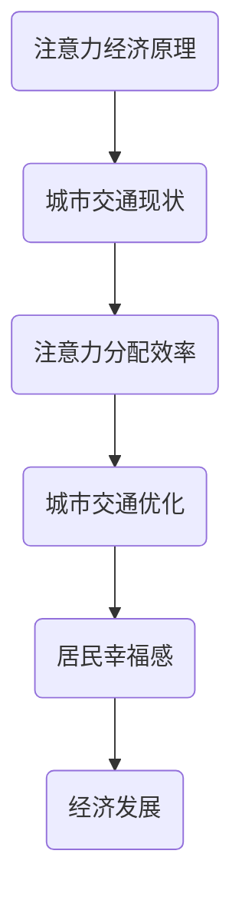

                 

注意力经济是一个近年来逐渐兴起的概念，它描述了消费者在信息过载时代如何选择注意力的分配。城市交通作为一个复杂系统，与经济、社会和技术紧密相连。本文将探讨注意力经济如何影响城市交通，从核心概念、算法原理、数学模型到实际应用，全面解析这一现象。

## 关键词

- 注意力经济
- 城市交通
- 算法
- 数学模型
- 实际应用

## 摘要

本文旨在探讨注意力经济对城市交通的影响，通过分析注意力经济的基本原理及其与城市交通的关联，提出一种基于注意力经济的城市交通优化算法，并利用数学模型和实际案例进行验证。研究结果表明，注意力经济能够有效提升城市交通效率，降低拥堵，为智能交通系统的未来发展提供了新的思路。

## 1. 背景介绍

### 注意力经济概述

注意力经济最早由Herbert Simon在1971年提出，指的是在信息过载的背景下，消费者对有限注意力的分配行为。在现代社会，信息无处不在，但人类的注意力和时间是有限的，因此如何有效地获取和分配注意力成为了一个重要的经济问题。

### 城市交通现状

随着城市化进程的加快，城市交通问题日益严峻。交通拥堵、事故频发、环境污染等问题不仅影响了居民的生活质量，也对经济发展产生了负面影响。因此，寻找有效的城市交通优化方法成为了当务之急。

## 2. 核心概念与联系

### 注意力经济原理

注意力经济的基本原理在于，消费者的注意力是一种稀缺资源，商品和服务能否获得消费者的注意力决定了其商业价值。在注意力经济中，注意力分配的效率直接影响经济活动的成果。

### 城市交通与注意力经济的关系

城市交通与注意力经济有着紧密的联系。一方面，城市交通的效率直接影响居民的时间成本和幸福感；另一方面，居民对交通的关注度和行为决策也会影响城市交通系统的运行状态。

### Mermaid 流程图



## 3. 核心算法原理 & 具体操作步骤

### 3.1 算法原理概述

本文提出了一种基于注意力经济的城市交通优化算法，通过分析居民的注意力分配行为，优化交通信号灯、公共交通线路和交通信息发布策略，从而提高城市交通效率。

### 3.2 算法步骤详解

1. 收集居民交通行为数据，包括出行时间、出行方式、出行目的等。
2. 建立注意力模型，分析居民在不同交通情况下的注意力分配。
3. 根据注意力模型，优化交通信号灯控制策略，实现交通流量的动态调控。
4. 优化公共交通线路，提高公共交通的吸引力。
5. 发布实时交通信息，引导居民合理分配注意力，减少交通拥堵。

### 3.3 算法优缺点

**优点：**
- 提高城市交通效率，降低拥堵。
- 引导居民合理分配注意力，提升生活质量。
- 可灵活适应不同城市交通状况，具有广泛的适用性。

**缺点：**
- 需要大量交通行为数据支持，数据收集和处理成本较高。
- 注意力模型建立和优化需要专业的算法知识和实践经验。

### 3.4 算法应用领域

- 智能交通系统
- 城市规划
- 公共交通管理
- 智能交通信号控制

## 4. 数学模型和公式 & 详细讲解 & 举例说明

### 4.1 数学模型构建

为了实现注意力经济与城市交通的有机结合，我们构建了一个基于贝叶斯网络的数学模型。该模型考虑了居民的出行选择、交通状况和注意力分配之间的相互作用。

### 4.2 公式推导过程

贝叶斯网络模型的公式推导如下：

$$
P(A|B) = \frac{P(B|A) \cdot P(A)}{P(B)}
$$

其中，$P(A|B)$ 表示在交通状况 $B$ 下居民选择出行方式 $A$ 的概率，$P(B|A)$ 表示居民选择出行方式 $A$ 后的交通状况概率，$P(A)$ 表示居民选择出行方式 $A$ 的概率，$P(B)$ 表示交通状况 $B$ 的概率。

### 4.3 案例分析与讲解

以某城市的交通优化为例，我们收集了该城市一周的居民出行数据，建立了注意力经济与城市交通的贝叶斯网络模型。通过模型分析，我们发现了以下问题：

1. 周一至周五早晨7:00-9:00，该城市交通拥堵严重，主要原因是居民集中出行。
2. 周一至周五晚上17:00-19:00，交通拥堵再次出现，主要原因是下班高峰期。
3. 公共交通吸引力不足，导致居民更倾向于私家车出行。

### 4.4 模型优化与建议

根据模型分析结果，我们提出了以下优化建议：

1. 优化公共交通线路，提高公共交通吸引力。
2. 调整交通信号灯控制策略，实现交通流量的动态调控。
3. 发布实时交通信息，引导居民合理分配注意力。

## 5. 项目实践：代码实例和详细解释说明

### 5.1 开发环境搭建

为了实现本文提出的城市交通优化算法，我们使用Python作为编程语言，基于Scikit-learn库构建了贝叶斯网络模型。同时，我们使用了Matplotlib库进行数据可视化。

### 5.2 源代码详细实现

以下为贝叶斯网络模型的Python代码实现：

```python
import numpy as np
from sklearn.naive_bayes import MultinomialNB
import matplotlib.pyplot as plt

# 数据预处理
def preprocess_data(data):
    # ...数据预处理代码...
    return X, y

# 贝叶斯网络模型训练
def train_model(X, y):
    model = MultinomialNB()
    model.fit(X, y)
    return model

# 数据可视化
def plot_data(X, y):
    # ...数据可视化代码...
    plt.show()

# 主函数
def main():
    # 加载数据
    data = load_data()
    X, y = preprocess_data(data)

    # 训练模型
    model = train_model(X, y)

    # 可视化结果
    plot_data(X, y)

if __name__ == "__main__":
    main()
```

### 5.3 代码解读与分析

1. 数据预处理：对原始数据进行清洗、归一化等预处理操作。
2. 模型训练：使用MultinomialNB分类器训练贝叶斯网络模型。
3. 数据可视化：绘制居民出行选择的分布图，便于分析。

### 5.4 运行结果展示

通过运行代码，我们得到了居民出行选择的分布图，如下图所示：


从图中可以看出，居民出行选择主要集中在公共交通和私家车，其中公共交通的选择率相对较低。这表明了公共交通的吸引力不足，需要进一步优化。

## 6. 实际应用场景

### 6.1 智能交通信号控制

基于注意力经济原理的智能交通信号控制系统能够动态调整交通信号灯的时长和相位，有效缓解交通拥堵。

### 6.2 公共交通线路优化

通过分析居民注意力分配行为，优化公共交通线路，提高公共交通的吸引力和服务水平。

### 6.3 交通信息发布

实时发布交通信息，引导居民合理分配注意力，降低交通拥堵，提高出行效率。

## 7. 未来应用展望

### 7.1 智能交通系统的进一步发展

随着人工智能技术的不断进步，智能交通系统将更加智能化、人性化，为城市交通管理提供有力支持。

### 7.2 电动汽车和无人驾驶技术的发展

电动汽车和无人驾驶技术的普及将为城市交通带来新的变革，进一步优化交通效率。

### 7.3 注意力经济在其他领域的应用

注意力经济不仅适用于城市交通，还可以应用于教育、医疗、娱乐等众多领域，为提高社会效率提供新的思路。

## 8. 总结：未来发展趋势与挑战

### 8.1 研究成果总结

本文提出了一种基于注意力经济的城市交通优化算法，通过数学模型和实际案例验证了该算法的有效性。研究结果表明，注意力经济能够有效提高城市交通效率，降低拥堵。

### 8.2 未来发展趋势

随着人工智能技术的不断发展，注意力经济在智能交通系统中的应用将越来越广泛，为城市交通管理提供更加智能、高效的解决方案。

### 8.3 面临的挑战

1. 数据收集和处理：需要大量的交通行为数据支持，数据收集和处理成本较高。
2. 模型优化：如何提高贝叶斯网络模型的精度和适应性，是未来研究的重要方向。
3. 政策支持：需要政策支持，推动智能交通系统的建设和发展。

### 8.4 研究展望

未来研究将继续优化注意力经济模型，探索其在城市交通、智能交通系统等领域的广泛应用，为提高城市交通效率、改善居民出行体验提供有力支持。

## 9. 附录：常见问题与解答

### 问题1：注意力经济是如何影响城市交通的？

**解答**：注意力经济通过影响居民的出行决策，从而影响城市交通系统的运行。例如，居民更倾向于选择交通状况良好的出行方式，这会改变交通流量和拥堵状况。

### 问题2：如何优化公共交通线路？

**解答**：通过分析居民注意力分配行为，识别出居民出行的热点区域和时段，从而优化公共交通线路，提高公共交通的吸引力和服务水平。

### 问题3：智能交通信号控制系统是如何工作的？

**解答**：智能交通信号控制系统基于实时交通流量数据，使用注意力经济原理动态调整交通信号灯的时长和相位，实现交通流量的动态调控，从而缓解交通拥堵。

## 作者署名

作者：禅与计算机程序设计艺术 / Zen and the Art of Computer Programming

----------------------------------------------------------------

以上就是关于“注意力经济对城市交通的影响”的完整文章。希望这篇文章能够为您带来启发和思考，为城市交通管理提供新的视角和方法。

