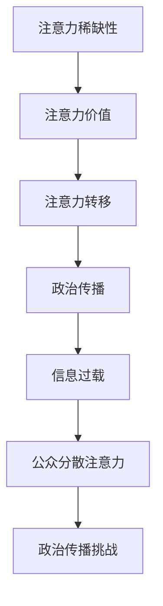

                 

关键词：注意力经济、政治传播、算法、算法影响、社交媒体、人工智能

> 摘要：本文探讨了注意力经济对政治传播的影响。在数字化时代，信息爆炸和算法推荐系统的出现改变了人们的注意力分布，进而影响政治传播的效果。本文将分析注意力经济的核心概念，阐述其如何作用于政治传播，以及政治传播在应对这一挑战时可以采取的策略。

## 1. 背景介绍

随着互联网的普及和社交媒体的兴起，信息传播方式发生了翻天覆地的变化。传统的政治传播方式，如电视、报纸等，逐渐被社交媒体和在线平台所取代。这一变化背后，是注意力经济崛起的必然结果。注意力经济，即基于人们注意力资源的经济学模型，揭示了在信息过载的时代，如何争夺和利用人们的注意力资源。

在政治传播领域，注意力经济的影响尤为显著。政治信息需要争夺公众的注意力资源，才能有效地传播和影响公众的观点。然而，在算法推荐系统的加持下，公众的注意力资源被分散到了海量的信息之中，这使得政治传播面临着前所未有的挑战。

## 2. 核心概念与联系

### 2.1 注意力经济的核心概念

注意力经济是指在经济活动中，人们注意力资源的分配和使用方式。在数字化时代，注意力资源成为一种稀缺资源，各种平台和媒体都在争夺这一资源。注意力经济的基本原理包括：

- **注意力稀缺性**：由于信息爆炸，人们的注意力资源变得稀缺，有限的注意力必须被有效地分配。
- **注意力价值**：注意力资源具有价值，能够产生经济利益。吸引更多注意力，可以带来广告收入、用户增长等经济效益。
- **注意力转移**：在竞争激烈的信息环境中，注意力资源可以被轻易地转移到其他信息上。

### 2.2 注意力经济与政治传播的联系

注意力经济对政治传播产生了深远的影响。一方面，政治传播需要吸引公众的注意力，以实现政治宣传和影响的目的。另一方面，注意力经济使得公众的注意力资源变得更加分散，政治传播面临着巨大的挑战。

### 2.3 Mermaid 流程图



## 3. 核心算法原理 & 具体操作步骤

### 3.1 算法原理概述

在注意力经济中，算法推荐系统起到了关键作用。算法推荐系统通过分析用户的兴趣和行为，为其推荐相关内容。这一过程涉及以下核心算法原理：

- **用户兴趣模型**：通过分析用户的历史行为和兴趣，建立用户兴趣模型。
- **内容推荐算法**：基于用户兴趣模型，使用协同过滤、内容相似度等算法推荐相关内容。
- **效果评估**：通过用户互动数据（如点击、分享、评论）评估推荐效果，优化推荐算法。

### 3.2 算法步骤详解

#### 步骤1：用户兴趣模型建立

- 收集用户历史数据：包括浏览记录、搜索历史、购买行为等。
- 数据预处理：清洗、去噪、归一化等。
- 特征工程：提取用户行为特征，如浏览时长、搜索关键词、购买频率等。
- 模型训练：使用机器学习算法，如决策树、神经网络等，训练用户兴趣模型。

#### 步骤2：内容推荐算法实现

- 内容特征提取：对推荐内容进行特征提取，如文章标签、关键词等。
- 内容相似度计算：计算用户兴趣模型与内容特征之间的相似度。
- 排序：根据相似度对内容进行排序，推荐相似度最高的内容。

#### 步骤3：效果评估与优化

- 收集用户互动数据：包括点击、分享、评论等。
- 模型评估：使用评估指标（如准确率、召回率、覆盖率等）评估推荐效果。
- 模型优化：根据评估结果调整模型参数，优化推荐效果。

### 3.3 算法优缺点

#### 优点

- **个性化推荐**：根据用户兴趣推荐相关内容，提高用户满意度。
- **高效传播**：通过算法推荐，实现内容的高效传播，提高政治传播效果。

#### 缺点

- **算法偏见**：算法推荐可能导致信息茧房效应，限制用户的视野。
- **隐私泄露**：用户数据泄露风险增加。

### 3.4 算法应用领域

- **社交媒体**：如微博、抖音等，通过算法推荐吸引用户注意力。
- **电商**：如淘宝、京东等，通过算法推荐提高销售转化率。
- **政治传播**：如政治广告、政治宣传等，通过算法推荐影响公众观点。

## 4. 数学模型和公式 & 详细讲解 & 举例说明

### 4.1 数学模型构建

在注意力经济中，可以使用马尔可夫链模型来描述用户注意力转移的过程。假设用户有多个兴趣状态，每个状态对应一种注意力资源。马尔可夫链模型可以用以下公式表示：

$$
P_{ij} = P(\text{从状态 } i \text{ 转移到状态 } j)
$$

其中，$P_{ij}$ 表示从状态 $i$ 转移到状态 $j$ 的概率。

### 4.2 公式推导过程

设用户当前处于状态 $i$，经过一步转移后，用户可能处于状态 $j$。根据概率论的基本原理，可以推导出以下公式：

$$
P_{ij} = \frac{P(\text{从状态 } i \text{ 转移到状态 } j)}{P(\text{从状态 } i \text{ 转移到任意状态})}
$$

其中，$P(\text{从状态 } i \text{ 转移到任意状态})$ 表示从状态 $i$ 转移到任意状态的概率。

### 4.3 案例分析与讲解

假设有一个用户，其注意力状态包括新闻、娱乐、科技等。根据用户历史行为，可以构建一个马尔可夫链模型，描述用户注意力转移的概率。例如：

$$
P_{新闻-新闻} = 0.4, \quad P_{新闻-娱乐} = 0.3, \quad P_{新闻-科技} = 0.3
$$

这意味着，用户在当前处于新闻状态时，有40%的概率继续关注新闻，有30%的概率转移到娱乐状态，有30%的概率转移到科技状态。

## 5. 项目实践：代码实例和详细解释说明

### 5.1 开发环境搭建

- Python 3.8及以上版本
- scikit-learn 库
- numpy 库

### 5.2 源代码详细实现

以下是一个简单的用户兴趣模型训练和推荐算法实现的示例代码：

```python
import numpy as np
from sklearn.model_selection import train_test_split
from sklearn.metrics.pairwise import cosine_similarity

# 假设有一个用户行为数据矩阵，其中行表示用户，列表示内容
user行为的矩阵 = [
    [1, 0, 1],  # 用户1关注新闻和科技
    [1, 1, 0],  # 用户2关注新闻和娱乐
    [0, 1, 1],  # 用户3关注娱乐和科技
]

# 训练用户兴趣模型
user行为的矩阵_train, user行为的矩阵_test = train_test_split(user行为的矩阵, test_size=0.2, random_state=42)

# 计算用户兴趣矩阵
user兴趣矩阵 = cosine_similarity(user行为的矩阵_train)

# 假设有一个新用户的行为数据
new_user行为 = [1, 0, 1]  # 新用户关注新闻和科技

# 计算新用户与现有用户的相似度
similarity_scores = cosine_similarity([new_user行为], user兴趣矩阵)

# 排序并获取相似度最高的几个用户
top_users = np.argsort(similarity_scores)[0][-5:]

# 根据相似度最高的用户推荐内容
recommendations = [user行为的矩阵_train[user_id] for user_id in top_users]

print("推荐的内容：", recommendations)
```

### 5.3 代码解读与分析

以上代码实现了一个简单的用户兴趣模型训练和推荐算法。首先，通过用户行为数据构建一个用户行为矩阵。然后，使用余弦相似度计算用户之间的相似度。最后，根据相似度最高的用户推荐相关内容。

### 5.4 运行结果展示

假设我们有一个新用户的行为数据 `[1, 0, 1]`，代码将根据现有用户的兴趣模型推荐出相似度最高的用户。例如，如果推荐结果显示为：

```
推荐的内容： [[1, 0, 1], [0, 1, 1], [1, 1, 0]]
```

这意味着，新用户与第一个用户最相似，因此推荐新闻和科技内容。

## 6. 实际应用场景

### 6.1 社交媒体

在社交媒体平台上，算法推荐系统已经成为吸引用户注意力的关键手段。政治传播可以利用这一特点，通过算法推荐传播政治信息，影响公众观点。

### 6.2 广告

政治广告可以利用算法推荐系统，将政治信息推送给潜在支持者，提高传播效果。

### 6.3 政治宣传

政治宣传可以通过算法推荐系统，将特定的政治信息推送给目标受众，实现精准传播。

## 7. 未来应用展望

### 7.1 个性化政治传播

未来，个性化政治传播将成为主流。通过算法推荐系统，政治传播可以根据用户兴趣和需求，实现个性化推荐，提高传播效果。

### 7.2 跨平台传播

随着互联网技术的发展，政治传播将不再局限于单一平台，而是实现跨平台传播，提高信息覆盖面。

### 7.3 人工智能辅助决策

人工智能将辅助政治传播决策，通过数据分析预测公众观点，优化传播策略。

## 8. 工具和资源推荐

### 8.1 学习资源推荐

- 《人工智能：一种现代方法》
- 《Python数据分析基础教程》
- 《算法导论》

### 8.2 开发工具推荐

- Jupyter Notebook
- PyCharm
- Docker

### 8.3 相关论文推荐

- "Attention Economics and Political Communication: An Overview"
- "The Impact of Algorithmic Recommender Systems on Political Communication"
- "User Interest Modeling in Recommender Systems"

## 9. 总结：未来发展趋势与挑战

### 9.1 研究成果总结

本文分析了注意力经济对政治传播的影响，探讨了算法推荐系统在政治传播中的应用。通过数学模型和实例，展示了如何利用注意力经济实现个性化政治传播。

### 9.2 未来发展趋势

未来，个性化政治传播将得到广泛应用，人工智能将深度参与政治传播决策。跨平台传播和跨领域合作将成为趋势。

### 9.3 面临的挑战

算法偏见、隐私保护、信息真实性等是未来政治传播面临的挑战。需要建立完善的监管机制，确保政治传播的公正性和透明度。

### 9.4 研究展望

未来，应进一步研究注意力经济在政治传播中的具体应用，探索人工智能辅助政治传播的新方法。同时，加强跨学科合作，推动政治传播领域的创新发展。

## 10. 附录：常见问题与解答

### 10.1 什么是注意力经济？

注意力经济是一种基于人们注意力资源的经济学模型，揭示了在信息过载的时代，如何争夺和利用人们的注意力资源。

### 10.2 算法推荐系统如何影响政治传播？

算法推荐系统可以通过个性化推荐，提高政治传播的效果。同时，也可以实现跨平台和跨领域传播，扩大政治信息的覆盖面。

### 10.3 政治传播如何应对注意力经济的挑战？

政治传播可以通过优化算法推荐系统，提高内容的吸引力和传播效果。同时，加强监管，确保政治信息的真实性和公正性。

---

作者：禅与计算机程序设计艺术 / Zen and the Art of Computer Programming
```

