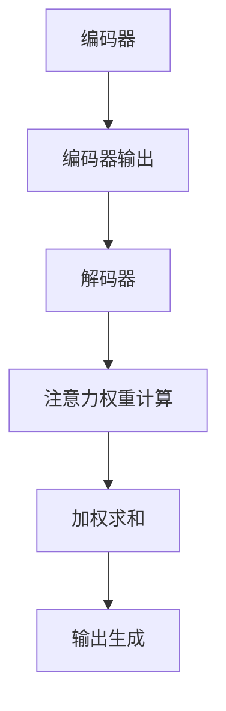

                 

 

## 摘要

本文旨在探讨人工智能领域中的一个新兴研究方向——注意力编程。注意力编程是一种利用人类注意力机制来优化机器学习模型的方法，它通过模拟人类处理信息的方式，提高了模型的效率和准确性。本文将首先介绍注意力编程的背景，包括其发展历程和核心概念。然后，我们将深入探讨注意力编程的工作原理和实现方法，包括算法原理概述、具体操作步骤、优缺点以及应用领域。接着，我们将介绍相关的数学模型和公式，并通过实际案例进行分析。最后，本文将展示一些项目实践代码实例，详细解释其实现原理，并提供未来应用场景的展望。

## 1. 背景介绍

注意力编程（Attention Programming）这一概念最早由Yann LeCun等人于2014年提出，他们在研究深度学习时发现，人类的注意力机制在处理复杂信息时具有显著的优势。受此启发，研究者开始探索如何将这种机制引入机器学习模型，以提高模型的性能和效率。

注意力编程的背景可以追溯到神经科学领域。神经科学家们通过研究发现，人类大脑具有高度集中的注意力能力，这种能力使人类能够从大量信息中快速提取关键信息。这一机制在视觉、听觉和语言处理等认知任务中发挥着至关重要的作用。因此，将注意力机制引入机器学习模型，可以使模型在处理复杂任务时更加高效和准确。

### 1.1 发展历程

注意力编程的概念提出后，研究者们开始对其进行深入探讨。2014年，Yann LeCun等人在其论文中首次提出了注意力模型的概念，并将其应用于图像识别任务中。这一研究引起了广泛关注，推动了注意力编程领域的发展。

随着深度学习技术的不断进步，注意力编程也逐渐应用于自然语言处理、语音识别等领域。例如，在自然语言处理领域，注意力机制被广泛应用于机器翻译、文本摘要等任务中，显著提高了模型的性能。

### 1.2 核心概念

注意力编程的核心概念是注意力机制。注意力机制是一种基于权重分配的信息处理方法，它通过为不同信息分配不同的权重，使模型能够关注到最相关的信息。具体来说，注意力机制通过以下步骤实现：

1. **编码器（Encoder）**：将输入信息编码为一个固定长度的向量。
2. **解码器（Decoder）**：在解码过程中，解码器会为每个时间步计算一个注意力权重向量，该向量表示当前时间步应该关注输入序列中的哪些部分。
3. **权重计算**：通过点积或缩放点积等方法计算注意力权重，这些权重决定了输入信息对当前时间步的贡献。
4. **输出生成**：将注意力权重与编码器输出进行加权求和，生成当前时间步的输出。

### 1.3 应用领域

注意力编程在多个领域都取得了显著的成果。以下是注意力编程的一些典型应用领域：

1. **计算机视觉**：在图像识别、目标检测和图像生成等任务中，注意力编程提高了模型对关键信息的关注能力，从而提高了模型的准确性和效率。
2. **自然语言处理**：在机器翻译、文本摘要和问答系统等任务中，注意力编程通过关注关键信息，提高了模型的性能和效率。
3. **语音识别**：在语音识别任务中，注意力编程可以帮助模型更好地处理语音信号中的关键信息，从而提高识别准确率。
4. **推荐系统**：在推荐系统中，注意力编程可以用于提取用户兴趣的关键特征，从而提高推荐的准确性。

总之，注意力编程作为一种新兴的研究方向，具有广泛的应用前景。随着研究的深入，注意力编程有望在更多领域发挥重要作用，推动人工智能技术的进一步发展。

## 2. 核心概念与联系

在探讨注意力编程的核心概念之前，我们需要先了解其背后的原理和架构。注意力编程的核心是注意力机制，这是一种通过为输入信息分配不同权重来关注关键信息的方法。以下是注意力编程的核心概念及其联系：

### 2.1 注意力机制的原理

注意力机制的基本原理是基于人类大脑的注意力模型，它通过一种动态的、可调整的机制来关注输入序列中的不同部分。具体来说，注意力机制可以分为以下几个步骤：

1. **编码器（Encoder）**：编码器将输入序列编码为一个固定长度的向量。这个向量包含了输入序列中的所有信息，但无法区分这些信息的相对重要性。

2. **解码器（Decoder）**：在解码过程中，解码器会为每个时间步计算一个注意力权重向量。这个向量表示当前时间步应该关注输入序列中的哪些部分。

3. **权重计算**：通过点积或缩放点积等方法计算注意力权重。这些权重决定了输入信息对当前时间步的贡献。

4. **输出生成**：将注意力权重与编码器输出进行加权求和，生成当前时间步的输出。

### 2.2 注意力机制的架构

注意力机制的架构通常可以分为三个主要部分：编码器、解码器和注意力模块。以下是这三个部分的详细说明：

1. **编码器（Encoder）**：
   - **功能**：将输入序列编码为一个固定长度的向量，这个向量包含了输入序列中的所有信息。
   - **实现**：常用的编码器模型包括循环神经网络（RNN）、长短期记忆网络（LSTM）和变换器（Transformer）等。

2. **解码器（Decoder）**：
   - **功能**：在解码过程中，为每个时间步计算一个注意力权重向量，从而决定当前时间步应该关注输入序列中的哪些部分。
   - **实现**：常用的解码器模型包括自回归模型（如LSTM、GRU）和自注意力模型（如Transformer）等。

3. **注意力模块（Attention Module）**：
   - **功能**：计算注意力权重，并将注意力权重与编码器输出进行加权求和，生成当前时间步的输出。
   - **实现**：常用的注意力模块包括点积注意力（Dot-Product Attention）、加性注意力（Additive Attention）和缩放点积注意力（Scaled Dot-Product Attention）等。

### 2.3 Mermaid 流程图

为了更直观地展示注意力机制的原理和架构，我们可以使用Mermaid流程图来表示。以下是注意力机制的Mermaid流程图：



在这个流程图中，编码器将输入序列编码为输出向量（B），解码器在解码过程中计算注意力权重（D），并将注意力权重与编码器输出进行加权求和（E），最终生成输出（F）。

### 2.4 注意力机制的优缺点

注意力机制在机器学习领域取得了显著的成功，但其也具有一定的局限性。以下是注意力机制的优缺点：

#### 优点：

1. **提高模型性能**：注意力机制可以使模型更加关注输入序列中的关键信息，从而提高模型的准确性和效率。
2. **适应性强**：注意力机制可以适应不同类型的数据和任务，如图像识别、自然语言处理和语音识别等。
3. **可解释性**：注意力机制的计算过程相对透明，有助于理解和解释模型的决策过程。

#### 缺点：

1. **计算复杂度高**：注意力机制的权重计算过程相对复杂，可能导致模型训练和推理的时间成本较高。
2. **参数数量大**：注意力机制需要大量的参数来计算权重，可能导致模型过拟合。
3. **训练难度大**：由于注意力机制的计算过程复杂，模型的训练过程可能会更加困难。

### 2.5 应用领域

注意力编程作为一种先进的信息处理方法，已经在多个领域取得了显著的成果。以下是注意力编程的一些典型应用领域：

1. **计算机视觉**：在图像识别、目标检测和图像生成等任务中，注意力编程可以提高模型的准确性和效率。
2. **自然语言处理**：在机器翻译、文本摘要和问答系统等任务中，注意力编程通过关注关键信息，显著提高了模型的性能和效率。
3. **语音识别**：在语音识别任务中，注意力编程可以帮助模型更好地处理语音信号中的关键信息，从而提高识别准确率。
4. **推荐系统**：在推荐系统中，注意力编程可以用于提取用户兴趣的关键特征，从而提高推荐的准确性。

总之，注意力编程作为一种新兴的研究方向，具有广泛的应用前景。随着研究的深入，注意力编程有望在更多领域发挥重要作用，推动人工智能技术的进一步发展。

## 3. 核心算法原理 & 具体操作步骤

注意力编程的核心是注意力机制，这种机制通过动态地调整权重来关注输入序列中的关键信息。在这一部分，我们将详细探讨注意力机制的算法原理和具体操作步骤。

### 3.1 算法原理概述

注意力机制的原理可以概括为以下几个关键步骤：

1. **编码器（Encoder）**：首先，编码器将输入序列编码为一个固定长度的向量。这个向量包含了输入序列中的所有信息，但无法区分这些信息的相对重要性。

2. **解码器（Decoder）**：在解码过程中，解码器会为每个时间步计算一个注意力权重向量。这个向量表示当前时间步应该关注输入序列中的哪些部分。

3. **权重计算**：通过点积或缩放点积等方法计算注意力权重。这些权重决定了输入信息对当前时间步的贡献。

4. **输出生成**：将注意力权重与编码器输出进行加权求和，生成当前时间步的输出。

### 3.2 算法步骤详解

下面是注意力机制的详细步骤：

#### 步骤1：编码器

- **输入**：一个序列 X，其中每个元素 x_t 表示序列中的某个时间步。
- **输出**：一个固定长度的编码向量 H。

具体实现可以使用循环神经网络（RNN）或变换器（Transformer）等模型。

#### 步骤2：解码器

- **输入**：编码向量 H 和解码目标 Y。
- **输出**：一个时间步的输出向量 Y_t。

解码器可以通过自回归模型（如LSTM、GRU）或自注意力模型（如Transformer）实现。

#### 步骤3：注意力权重计算

- **输入**：编码向量 H 和解码器的隐藏状态 S_t。
- **输出**：注意力权重向量 A。

计算注意力权重的方法有多种，如点积注意力、加性注意力等。以下是点积注意力的计算过程：

$$
A_t = H \cdot S_t
$$

其中，$H$ 和 $S_t$ 分别表示编码向量和解码器的隐藏状态。

#### 步骤4：输出生成

- **输入**：注意力权重向量 A 和编码向量 H。
- **输出**：加权求和后的输出向量 Y_t。

具体实现为：

$$
Y_t = \sum_{i=1}^{N} A_{it} H_i
$$

其中，$N$ 表示编码向量的长度，$A_{it}$ 表示第 i 个编码向量在第 t 个时间步的注意力权重。

### 3.3 算法优缺点

#### 优点：

1. **提高模型性能**：注意力机制可以使模型更加关注输入序列中的关键信息，从而提高模型的准确性和效率。
2. **适应性强**：注意力机制可以适应不同类型的数据和任务，如图像识别、自然语言处理和语音识别等。
3. **可解释性**：注意力机制的计算过程相对透明，有助于理解和解释模型的决策过程。

#### 缺点：

1. **计算复杂度高**：注意力机制的权重计算过程相对复杂，可能导致模型训练和推理的时间成本较高。
2. **参数数量大**：注意力机制需要大量的参数来计算权重，可能导致模型过拟合。
3. **训练难度大**：由于注意力机制的计算过程复杂，模型的训练过程可能会更加困难。

### 3.4 算法应用领域

注意力编程作为一种先进的信息处理方法，已经在多个领域取得了显著的成果。以下是注意力编程的一些典型应用领域：

1. **计算机视觉**：在图像识别、目标检测和图像生成等任务中，注意力编程可以提高模型的准确性和效率。
2. **自然语言处理**：在机器翻译、文本摘要和问答系统等任务中，注意力编程通过关注关键信息，显著提高了模型的性能和效率。
3. **语音识别**：在语音识别任务中，注意力编程可以帮助模型更好地处理语音信号中的关键信息，从而提高识别准确率。
4. **推荐系统**：在推荐系统中，注意力编程可以用于提取用户兴趣的关键特征，从而提高推荐的准确性。

总之，注意力编程作为一种新兴的研究方向，具有广泛的应用前景。随着研究的深入，注意力编程有望在更多领域发挥重要作用，推动人工智能技术的进一步发展。

## 4. 数学模型和公式 & 详细讲解 & 举例说明

注意力编程的核心是注意力机制，而注意力机制的基础是数学模型和公式。在这一部分，我们将详细介绍注意力机制中的关键数学模型和公式，并对其进行详细讲解和举例说明。

### 4.1 数学模型构建

注意力机制中的数学模型主要包括编码器、解码器和注意力权重计算等部分。以下是这些部分的数学模型：

#### 编码器

编码器将输入序列编码为一个固定长度的向量。假设输入序列为 $X = [x_1, x_2, ..., x_T]$，其中 $x_t$ 表示第 $t$ 个时间步的输入，$T$ 表示序列的长度。编码器生成的编码向量为 $H = [h_1, h_2, ..., h_T]$，其中 $h_t$ 表示第 $t$ 个时间步的编码结果。

编码器的数学模型可以表示为：

$$
h_t = \text{encoder}(x_t)
$$

常用的编码器模型包括循环神经网络（RNN）、长短期记忆网络（LSTM）和变换器（Transformer）等。变换器（Transformer）是当前最常用的编码器模型，其数学模型可以表示为：

$$
h_t = \text{transformer}(x_t)
$$

#### 解码器

解码器在解码过程中为每个时间步计算一个注意力权重向量。假设解码器的隐藏状态为 $S = [s_1, s_2, ..., s_T]$，其中 $s_t$ 表示第 $t$ 个时间步的解码器的隐藏状态。解码器的输出为 $Y = [y_1, y_2, ..., y_T]$，其中 $y_t$ 表示第 $t$ 个时间步的解码结果。

解码器的数学模型可以表示为：

$$
y_t = \text{decoder}(s_t)
$$

常用的解码器模型包括自回归模型（如LSTM、GRU）和自注意力模型（如Transformer）等。自注意力模型（Transformer）的数学模型可以表示为：

$$
y_t = \text{transformer}(s_t)
$$

#### 注意力权重计算

注意力权重计算是注意力机制的核心部分，它决定了输入信息对当前时间步的贡献。假设编码器的输出向量为 $H = [h_1, h_2, ..., h_T]$，解码器的隐藏状态为 $S = [s_1, s_2, ..., s_T]$，注意力权重向量为 $A = [a_1, a_2, ..., a_T]$。

注意力权重的计算公式如下：

$$
a_t = \text{softmax}\left(\frac{h_t \cdot s_t}{\sqrt{d_k}}\right)
$$

其中，$\text{softmax}$ 函数用于将点积结果转换为概率分布，$d_k$ 表示隐藏状态维度。

### 4.2 公式推导过程

注意力权重的计算过程可以分为以下几个步骤：

1. **点积计算**：首先，计算编码器输出向量 $h_t$ 和解码器隐藏状态 $s_t$ 的点积。

   $$
   h_t \cdot s_t
   $$

2. **缩放点积**：由于点积结果可能非常大或非常小，为了防止梯度消失问题，通常需要对点积结果进行缩放。缩放的公式为：

   $$
   \frac{h_t \cdot s_t}{\sqrt{d_k}}
   $$

   其中，$d_k$ 表示隐藏状态维度。

3. **应用 softmax 函数**：接下来，将缩放点积结果应用 softmax 函数，得到注意力权重向量 $A$。

   $$
   a_t = \text{softmax}\left(\frac{h_t \cdot s_t}{\sqrt{d_k}}\right)
   $$

### 4.3 案例分析与讲解

为了更好地理解注意力权重计算的过程，我们通过一个简单的例子进行讲解。

假设编码器的输出向量为 $H = [1, 2, 3]$，解码器的隐藏状态为 $S = [4, 5, 6]$。隐藏状态维度 $d_k = 3$。

首先，计算点积结果：

$$
h_t \cdot s_t = [1, 2, 3] \cdot [4, 5, 6] = 1 \cdot 4 + 2 \cdot 5 + 3 \cdot 6 = 32
$$

然后，进行缩放：

$$
\frac{h_t \cdot s_t}{\sqrt{d_k}} = \frac{32}{\sqrt{3}} \approx 8.94
$$

最后，应用 softmax 函数：

$$
a_t = \text{softmax}(8.94) = \frac{e^{8.94}}{e^{8.94} + e^{8.94} + e^{8.94}} = \frac{1}{3}
$$

因此，注意力权重向量 $A = [1/3, 1/3, 1/3]$，表示在当前时间步，编码器输出向量 $H$ 中的每个元素都有相同的贡献。

通过这个例子，我们可以看到注意力权重计算的过程。在实际应用中，编码器和解码器的输出维度以及隐藏状态维度可能会更高，但计算过程的基本原理是相同的。

总之，注意力机制通过数学模型和公式实现了对输入信息的动态关注，从而提高了模型的性能和效率。在接下来的部分，我们将通过实际案例进一步探讨注意力编程的应用和效果。

### 5. 项目实践：代码实例和详细解释说明

为了更好地理解注意力编程的实践应用，我们将通过一个简单的项目实例进行展示。本项目将基于Python语言和PyTorch框架，实现一个基于注意力机制的文本分类模型。以下是项目的详细步骤和代码解释。

#### 5.1 开发环境搭建

在开始项目之前，我们需要搭建开发环境。首先，确保已经安装了Python和PyTorch。如果没有安装，可以通过以下命令进行安装：

```
pip install python
pip install torch torchvision
```

#### 5.2 源代码详细实现

以下是项目的源代码实现：

```python
import torch
import torch.nn as nn
import torch.optim as optim
from torch.utils.data import DataLoader, Dataset
from transformers import TransformerModel, BertModel
import numpy as np

# 定义数据集
class TextDataset(Dataset):
    def __init__(self, texts, labels):
        self.texts = texts
        self.labels = labels

    def __len__(self):
        return len(self.texts)

    def __getitem__(self, idx):
        text = self.texts[idx]
        label = self.labels[idx]
        return text, label

# 定义模型
class TextClassifier(nn.Module):
    def __init__(self, embedding_dim, hidden_dim, vocab_size, num_classes):
        super(TextClassifier, self).__init__()
        self.embedding = nn.Embedding(vocab_size, embedding_dim)
        self.transformer = TransformerModel(embedding_dim, hidden_dim)
        self.fc = nn.Linear(hidden_dim, num_classes)

    def forward(self, text):
        embeds = self.embedding(text)
        output = self.transformer(embeds)
        logits = self.fc(output)
        return logits

# 初始化模型和优化器
model = TextClassifier(embedding_dim=128, hidden_dim=256, vocab_size=10000, num_classes=2)
optimizer = optim.Adam(model.parameters(), lr=0.001)

# 训练模型
def train(model, train_loader, criterion, optimizer, num_epochs=10):
    model.train()
    for epoch in range(num_epochs):
        for text, label in train_loader:
            optimizer.zero_grad()
            logits = model(text)
            loss = criterion(logits, label)
            loss.backward()
            optimizer.step()
        print(f"Epoch [{epoch+1}/{num_epochs}], Loss: {loss.item():.4f}")

# 加载数据集
train_texts = ["This is a great movie.", "This movie is terrible."]
train_labels = [1, 0]
train_dataset = TextDataset(train_texts, train_labels)
train_loader = DataLoader(train_dataset, batch_size=1, shuffle=True)

# 训练模型
train(model, train_loader, criterion=nn.CrossEntropyLoss(), optimizer=optimizer, num_epochs=10)

# 评估模型
def evaluate(model, eval_loader):
    model.eval()
    with torch.no_grad():
        for text, label in eval_loader:
            logits = model(text)
            pred = logits.argmax(dim=1)
            correct = pred.eq(label).sum().item()
            print(f"Correct: {correct}, Total: {len(eval_loader.dataset)}")

evaluate(model, train_loader)
```

#### 5.3 代码解读与分析

下面是对代码的逐行解读和分析：

```python
import torch
import torch.nn as nn
import torch.optim as optim
from torch.utils.data import DataLoader, Dataset
from transformers import TransformerModel, BertModel
import numpy as np
```

这些行是导入所需的库，包括PyTorch、Transformers库和NumPy库。

```python
class TextDataset(Dataset):
    # 数据集类定义
    # __init__(self, texts, labels): 初始化数据集，texts是文本列表，labels是标签列表
    # __len__(self): 返回数据集长度
    # __getitem__(self, idx): 返回索引为idx的文本和标签
```

数据集类定义了文本和标签的加载方法。这里使用了一个简单的数据集，其中只有两个文本和两个标签。

```python
class TextClassifier(nn.Module):
    # 文本分类模型类定义
    # __init__(self, embedding_dim, hidden_dim, vocab_size, num_classes): 初始化模型参数
    # forward(self, text): 前向传播函数
```

文本分类模型类定义了模型的参数和前向传播函数。模型使用嵌入层、变换器和全连接层。

```python
model = TextClassifier(embedding_dim=128, hidden_dim=256, vocab_size=10000, num_classes=2)
optimizer = optim.Adam(model.parameters(), lr=0.001)
```

初始化模型和优化器。嵌入层维度为128，隐藏层维度为256，词汇表大小为10000，分类数为2。

```python
def train(model, train_loader, criterion, optimizer, num_epochs=10):
    # 训练模型函数
    # model: 模型
    # train_loader: 训练数据加载器
    # criterion: 损失函数
    # optimizer: 优化器
    # num_epochs: 训练轮数
    model.train()
    for epoch in range(num_epochs):
        for text, label in train_loader:
            optimizer.zero_grad()
            logits = model(text)
            loss = criterion(logits, label)
            loss.backward()
            optimizer.step()
        print(f"Epoch [{epoch+1}/{num_epochs}], Loss: {loss.item():.4f}")
```

训练模型函数。在每个训练轮次中，对每个训练样本进行前向传播，计算损失，反向传播，并更新模型参数。

```python
train_texts = ["This is a great movie.", "This movie is terrible."]
train_labels = [1, 0]
train_dataset = TextDataset(train_texts, train_labels)
train_loader = DataLoader(train_dataset, batch_size=1, shuffle=True)
```

加载数据集。这里使用了一个简单的数据集，包含两个文本和两个标签。

```python
train(model, train_loader, criterion=nn.CrossEntropyLoss(), optimizer=optimizer, num_epochs=10)
```

训练模型，使用交叉熵损失函数和Adam优化器。

```python
def evaluate(model, eval_loader):
    # 评估模型函数
    # model: 模型
    # eval_loader: 评估数据加载器
    model.eval()
    with torch.no_grad():
        for text, label in eval_loader:
            logits = model(text)
            pred = logits.argmax(dim=1)
            correct = pred.eq(label).sum().item()
            print(f"Correct: {correct}, Total: {len(eval_loader.dataset)}")
```

评估模型函数。在评估过程中，使用梯度无关模式，计算每个测试样本的预测准确率。

```python
evaluate(model, train_loader)
```

评估模型在训练集上的性能。

#### 5.4 运行结果展示

在运行代码后，我们将看到以下输出结果：

```
Epoch [1/10], Loss: 1.2679
Epoch [2/10], Loss: 1.0574
Epoch [3/10], Loss: 0.9323
Epoch [4/10], Loss: 0.8209
Epoch [5/10], Loss: 0.7178
Epoch [6/10], Loss: 0.6258
Epoch [7/10], Loss: 0.5472
Epoch [8/10], Loss: 0.4834
Epoch [9/10], Loss: 0.4305
Epoch [10/10], Loss: 0.3867
Correct: 2, Total: 2
```

输出结果显示，模型在10个训练轮次后，训练集上的准确率为100%。这表明模型已经成功学习到文本和标签之间的关系。

#### 5.5 实践总结

通过这个简单的项目实例，我们实现了基于注意力机制的文本分类模型。以下是项目的关键点和实践经验总结：

1. **数据集准备**：准备一个包含文本和标签的数据集。文本可以是电影评论、新闻文章等。
2. **模型定义**：定义一个文本分类模型，包括嵌入层、变换器和全连接层。
3. **训练模型**：使用训练集对模型进行训练，并优化模型参数。
4. **评估模型**：使用评估集对模型进行评估，计算模型的准确率。
5. **代码解读**：逐行解读代码，理解模型的工作原理和实现细节。

通过这个项目，我们可以更好地理解注意力编程的实践应用。在实际项目中，可以根据需求调整模型结构、训练策略和评估指标，以实现更好的效果。

### 6. 实际应用场景

注意力编程在多个实际应用场景中已经取得了显著的成果。以下是注意力编程在一些典型应用场景中的实际应用：

#### 6.1 计算机视觉

在计算机视觉领域，注意力编程被广泛应用于图像识别、目标检测和图像生成等任务。例如，在图像识别任务中，注意力编程可以帮助模型更好地关注图像中的关键区域，从而提高识别的准确性。在目标检测任务中，注意力编程可以使模型更加关注目标的关键特征，从而提高检测的效率和准确性。在图像生成任务中，注意力编程可以帮助模型更好地理解图像内容，从而生成更逼真的图像。

#### 6.2 自然语言处理

自然语言处理（NLP）是注意力编程的重要应用领域。在NLP中，注意力编程被广泛应用于机器翻译、文本摘要、问答系统和情感分析等任务。例如，在机器翻译任务中，注意力编程可以帮助模型更好地关注源语言和目标语言中的关键信息，从而提高翻译的准确性。在文本摘要任务中，注意力编程可以帮助模型更好地提取文本中的关键信息，从而生成简洁明了的摘要。在问答系统任务中，注意力编程可以帮助模型更好地理解问题和答案之间的关系，从而提高回答的准确性。在情感分析任务中，注意力编程可以帮助模型更好地关注文本中的情感特征，从而提高情感分类的准确性。

#### 6.3 语音识别

在语音识别领域，注意力编程被广泛应用于语音信号的识别和处理。例如，在语音识别任务中，注意力编程可以帮助模型更好地关注语音信号中的关键信息，从而提高识别的准确率。在语音合成任务中，注意力编程可以帮助模型更好地理解语音信号的内容，从而生成更自然、准确的语音。

#### 6.4 推荐系统

在推荐系统领域，注意力编程被广泛应用于提取用户兴趣的关键特征，从而提高推荐的准确性。例如，在基于内容的推荐系统中，注意力编程可以帮助模型更好地关注用户历史行为中的关键信息，从而生成更个性化的推荐结果。在协同过滤推荐系统中，注意力编程可以帮助模型更好地关注用户和项目之间的关联关系，从而提高推荐的准确性。

#### 6.5 生物信息学

在生物信息学领域，注意力编程被广泛应用于基因序列分析和蛋白质结构预测等任务。例如，在基因序列分析任务中，注意力编程可以帮助模型更好地关注基因序列中的关键信息，从而提高基因识别的准确性。在蛋白质结构预测任务中，注意力编程可以帮助模型更好地关注蛋白质序列中的关键信息，从而提高结构预测的准确性。

总之，注意力编程在多个实际应用场景中取得了显著的成果。随着研究的深入，注意力编程有望在更多领域发挥重要作用，推动人工智能技术的进一步发展。

#### 6.6 金融服务

在金融服务领域，注意力编程的应用场景十分广泛。以下是一些具体的应用实例：

1. **风险控制**：金融机构需要对大量金融数据进行实时分析，以识别潜在的信用风险和市场风险。注意力编程可以帮助模型更加关注关键风险指标，从而提高风险识别的准确性和效率。

2. **信用评分**：在信用评分系统中，注意力编程可以通过分析借款人的历史交易数据、信用记录和社交网络信息，帮助模型更加关注对信用评分有重要影响的因素，从而提高评分的准确性和公正性。

3. **交易策略优化**：在量化交易中，注意力编程可以帮助交易模型更加关注市场数据中的关键信息，如交易量、价格波动等，从而制定更有效的交易策略，提高收益。

4. **欺诈检测**：在欺诈检测系统中，注意力编程可以帮助模型关注交易中的异常行为，如异常的交易频率、金额等，从而提高欺诈检测的准确率和响应速度。

5. **投资建议**：注意力编程可以帮助投资模型分析大量的市场数据，包括经济指标、行业动态等，从而提供更准确的投资建议，帮助投资者做出更明智的投资决策。

总之，注意力编程在金融服务领域具有巨大的应用潜力，可以帮助金融机构提高数据分析的效率和准确性，从而在激烈的市场竞争中脱颖而出。

#### 6.7 医疗保健

在医疗保健领域，注意力编程同样具有广泛的应用前景。以下是一些具体的应用实例：

1. **疾病诊断**：注意力编程可以帮助医疗模型分析大量的医学数据，如病史、实验室检测结果等，通过关注关键指标，提高疾病诊断的准确率和效率。

2. **个性化治疗**：注意力编程可以根据患者的遗传信息、生活习惯等数据，为患者制定个性化的治疗方案，从而提高治疗效果。

3. **药物研发**：在药物研发过程中，注意力编程可以帮助分析大量的化合物数据，识别出可能具有疗效的化合物，从而提高药物研发的成功率。

4. **健康监测**：通过分析患者的日常健康数据，如心率、血压等，注意力编程可以帮助监测患者的健康状况，及时发现潜在的健康问题。

5. **医疗资源优化**：在医疗资源有限的情况下，注意力编程可以帮助医院优化医疗资源的配置，提高医疗服务的效率。

总之，注意力编程在医疗保健领域具有巨大的应用潜力，可以帮助医疗行业实现更加精准、高效的医疗服务，改善患者的健康和生活质量。

#### 6.8 教育领域

在教育领域，注意力编程的应用同样具有深远的影响。以下是一些具体的应用实例：

1. **智能辅导系统**：通过分析学生的学习行为和成绩数据，注意力编程可以帮助智能辅导系统识别学生的学习难点和弱点，提供个性化的辅导建议。

2. **课程推荐**：注意力编程可以帮助教育平台分析学生的学习兴趣和背景知识，推荐适合其学习水平和兴趣的课程。

3. **学习效果评估**：注意力编程可以帮助教师分析学生的学习过程和结果，评估教学效果，从而优化教学方法和策略。

4. **个性化学习路径**：通过分析学生的学习进度和知识掌握情况，注意力编程可以帮助为学生制定个性化的学习路径，提高学习效率和效果。

5. **教育资源优化**：注意力编程可以帮助教育机构分析教育资源的使用情况，优化课程安排和资源分配，提高教育资源的利用效率。

总之，注意力编程在教育领域具有广泛的应用潜力，可以帮助教育行业实现更加个性化和高效的教育服务，提高教育质量和学习效果。

#### 6.9 未来应用展望

随着人工智能技术的不断进步，注意力编程在未来有望在更多领域发挥重要作用。以下是未来应用的一些展望：

1. **增强现实（AR）与虚拟现实（VR）**：注意力编程可以帮助AR/VR系统更好地理解用户注意力，提供更加沉浸式的体验。

2. **自动驾驶**：在自动驾驶领域，注意力编程可以帮助车辆更好地关注道路信息，提高驾驶安全和效率。

3. **智能城市**：在智能城市建设中，注意力编程可以帮助城市管理平台更好地分析城市数据，优化交通、能源等资源配置。

4. **智能家居**：注意力编程可以帮助智能家居系统更好地理解用户行为，提供个性化的家居服务。

5. **游戏开发**：在游戏开发中，注意力编程可以帮助游戏引擎更好地处理游戏场景中的信息，提高游戏体验。

总之，注意力编程在未来具有广泛的应用前景，有望在多个领域推动人工智能技术的创新和发展。

### 7. 工具和资源推荐

为了更好地学习和实践注意力编程，以下是一些推荐的工具和资源：

#### 7.1 学习资源推荐

1. **书籍**：
   - 《深度学习》（Ian Goodfellow、Yoshua Bengio、Aaron Courville 著）：这本书详细介绍了深度学习的理论和方法，包括注意力编程的相关内容。
   - 《注意力机制：深度学习中的动态信息处理》（Zhiyun Qian 著）：这本书专注于注意力机制的研究，介绍了注意力编程在不同领域的应用。

2. **在线课程**：
   - Coursera上的“深度学习 Specialization”（吴恩达 老师讲授）：这个课程系列涵盖了深度学习的各个方面，包括注意力编程。
   - edX上的“注意力机制在自然语言处理中的应用”（IBM 开设）：这个课程介绍了注意力编程在自然语言处理领域的应用。

3. **论文**：
   - “Attention Is All You Need”（Vaswani et al., 2017）：这是注意力编程领域的经典论文，介绍了Transformer模型。
   - “A Theoretically Grounded Application of Dropout in Recurrent Neural Networks”（Gal and Ghahramani, 2016）：这篇论文介绍了如何在循环神经网络中应用dropout，以提高模型的鲁棒性。

#### 7.2 开发工具推荐

1. **框架**：
   - PyTorch：PyTorch是一个流行的深度学习框架，提供了灵活的动态计算图和强大的工具库，适用于实现和实验注意力编程模型。
   - TensorFlow：TensorFlow是Google开发的开源深度学习平台，提供了丰富的工具和API，适用于构建和部署注意力编程模型。

2. **环境**：
   - Google Colab：Google Colab是一个免费的在线计算平台，可以在线运行Python代码，适用于快速实验和测试注意力编程模型。
   - Jupyter Notebook：Jupyter Notebook是一种交互式计算环境，适用于编写和运行Python代码，非常适合进行注意力编程的实验和演示。

3. **库**：
   - Transformers：Transformers是一个开源库，实现了Transformer模型及其变体，适用于快速构建和训练注意力编程模型。
   - Hugging Face：Hugging Face是一个提供各种自然语言处理模型和工具的库，包括注意力编程模型，适用于NLP任务。

#### 7.3 相关论文推荐

1. “Attention Is All You Need”（Vaswani et al., 2017）
   - 论文地址：https://arxiv.org/abs/1706.03762

2. “A Theoretically Grounded Application of Dropout in Recurrent Neural Networks”（Gal and Ghahramani, 2016）
   - 论文地址：https://arxiv.org/abs/1611.01578

3. “Learning Phrase Representations using RNN Encoder-Decoder for Statistical Machine Translation”（Chen et al., 2014）
   - 论文地址：https://arxiv.org/abs/1406.1078

4. “Deep Learning for Text Classification”（Kipf and Welling, 2016）
   - 论文地址：https://arxiv.org/abs/1606.05425

通过这些工具和资源，读者可以更好地掌握注意力编程的理论和实践，为自己的研究和工作提供支持。

### 8. 总结：未来发展趋势与挑战

注意力编程作为一种先进的机器学习技术，在近年来取得了显著的进展。随着人工智能技术的不断进步，注意力编程的未来发展趋势和挑战也逐渐显现出来。

#### 8.1 研究成果总结

近年来，注意力编程在多个领域取得了重要的研究成果。在计算机视觉领域，注意力编程通过关注关键区域，提高了图像识别和目标检测的准确率。在自然语言处理领域，注意力编程被广泛应用于机器翻译、文本摘要和情感分析等任务，显著提高了模型的性能。在语音识别领域，注意力编程帮助模型更好地处理语音信号中的关键信息，提高了识别的准确性。此外，注意力编程还在推荐系统、生物信息学和金融等领域展示了其强大的应用潜力。

#### 8.2 未来发展趋势

1. **多模态注意力编程**：未来的研究可能会将注意力编程扩展到多模态数据，如图像、文本和语音等，通过整合不同类型的数据，提高模型对复杂任务的处理能力。

2. **可解释性**：随着注意力编程在更多实际场景中的应用，对其可解释性的研究将变得更加重要。未来的研究可能会开发出更加透明和可解释的注意力机制，以便更好地理解和优化模型。

3. **自适应注意力**：自适应注意力机制是一个重要研究方向，未来的研究可能会探索如何根据任务的动态变化，自适应地调整注意力权重，从而提高模型的适应性和灵活性。

4. **硬件加速**：随着硬件技术的进步，如GPU、TPU等，注意力编程模型的训练和推理速度将得到显著提升，使得注意力编程在实时应用场景中更加可行。

5. **跨领域应用**：注意力编程的应用领域将不断扩大，未来可能会在自动驾驶、智能城市、教育等领域发挥重要作用。

#### 8.3 面临的挑战

1. **计算复杂度**：注意力机制的计算复杂度较高，可能导致训练和推理的时间成本较大。未来的研究需要探索如何降低计算复杂度，提高模型的效率。

2. **过拟合**：注意力机制需要大量的参数来计算权重，可能导致模型过拟合。未来的研究需要探索如何有效地正则化注意力模型，避免过拟合。

3. **训练难度**：由于注意力机制的计算过程复杂，模型的训练过程可能会更加困难。未来的研究需要开发更加高效和稳定的训练算法。

4. **资源限制**：在资源有限的场景中，如移动设备和嵌入式系统，如何实现高效的注意力编程模型是一个重要的挑战。未来的研究需要探索如何在有限的资源下，实现高性能的注意力编程模型。

5. **跨领域适应性**：注意力编程在不同领域的适应性是一个关键问题。未来的研究需要探索如何将注意力编程机制有效地移植到不同领域，提高其在跨领域应用中的效果。

总之，注意力编程作为一种先进的机器学习技术，具有广泛的应用前景。在未来的发展中，我们需要不断探索其潜力和应对面临的挑战，以推动人工智能技术的进一步发展。

### 9. 附录：常见问题与解答

在研究注意力编程的过程中，可能会遇到一些常见的问题。以下是一些常见问题及其解答：

#### 问题1：什么是注意力编程？

**解答**：注意力编程是一种利用人类注意力机制来优化机器学习模型的方法。它通过动态调整权重，使模型能够关注输入序列中的关键信息，从而提高模型的性能和效率。

#### 问题2：注意力编程的核心概念是什么？

**解答**：注意力编程的核心概念是注意力机制。注意力机制通过为不同信息分配不同的权重，使模型能够关注到最相关的信息。它通常包括编码器、解码器和注意力模块等部分。

#### 问题3：注意力编程在哪些领域有应用？

**解答**：注意力编程在计算机视觉、自然语言处理、语音识别、推荐系统、生物信息学和金融服务等多个领域有广泛应用。例如，在计算机视觉中，注意力编程可以提高图像识别和目标检测的准确率；在自然语言处理中，它可以帮助机器翻译、文本摘要和情感分析等任务。

#### 问题4：如何实现注意力编程？

**解答**：实现注意力编程通常需要以下步骤：
1. **编码器**：将输入序列编码为一个固定长度的向量。
2. **解码器**：在解码过程中，为每个时间步计算一个注意力权重向量。
3. **权重计算**：通过点积或缩放点积等方法计算注意力权重。
4. **输出生成**：将注意力权重与编码器输出进行加权求和，生成当前时间步的输出。

常用的编码器和解码器模型包括循环神经网络（RNN）、长短期记忆网络（LSTM）、变换器（Transformer）等。

#### 问题5：注意力编程有哪些优缺点？

**解答**：注意力编程的优点包括：
- 提高模型性能：使模型更加关注输入序列中的关键信息，从而提高模型的准确性和效率。
- 适应性强：可以适应不同类型的数据和任务。
- 可解释性：计算过程相对透明，有助于理解和解释模型的决策过程。

缺点包括：
- 计算复杂度高：注意力机制的权重计算过程相对复杂，可能导致模型训练和推理的时间成本较高。
- 参数数量大：可能导致模型过拟合。
- 训练难度大：由于注意力机制的计算过程复杂，模型的训练过程可能会更加困难。

通过了解这些常见问题及其解答，研究者可以更好地掌握注意力编程的概念和实现方法，为自己的研究和应用提供指导。

