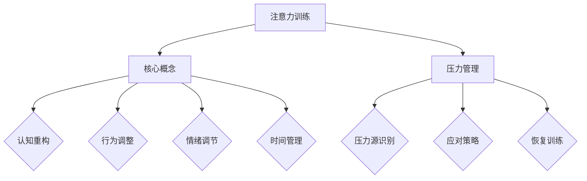

                 

关键词：注意力训练、压力管理、专注力、技术语言、深度学习、软件工程、算法优化、人机交互、心理健康、未来展望

> 摘要：本文旨在探讨在高压环境中如何通过注意力训练与压力管理来提升个人的专注力。我们将结合现代信息技术，从算法原理、数学模型、项目实践等多维度进行阐述，为读者提供实用且有效的解决方案。作者：禅与计算机程序设计艺术 / Zen and the Art of Computer Programming

## 1. 背景介绍

在当今信息爆炸和全球竞争日益激烈的背景下，专注力和压力管理变得尤为重要。无论是职场人士还是学生，都面临着来自各个方面的压力，这些压力会分散注意力，导致工作效率下降，甚至影响心理健康。因此，提高专注力和压力管理能力，不仅有助于提升个人的生活质量，也是实现职业成功的重要保障。

本文将从以下几个方面展开讨论：

- 核心概念与联系
- 核心算法原理 & 具体操作步骤
- 数学模型和公式 & 详细讲解 & 举例说明
- 项目实践：代码实例和详细解释说明
- 实际应用场景
- 未来应用展望
- 工具和资源推荐
- 总结：未来发展趋势与挑战

### 1.1. 注意力与压力的定义

注意力是指大脑在处理信息时集中精力的一种能力。它决定了我们在面对复杂任务时能否快速做出决策、解决问题。压力则是由于外部环境或内部心理因素导致的紧张和焦虑感。长期处于高压状态，不仅会影响注意力的集中，还可能引发一系列健康问题。

### 1.2. 现代社会的压力来源

现代社会中的压力来源多种多样，主要包括以下几个方面：

- 工作压力：职场竞争激烈，任务繁重，导致工作压力增大。
- 时间压力：信息过载导致时间管理困难，难以平衡工作与生活。
- 社交压力：社交媒体的广泛应用，使人们面临更多的社交比较和压力。
- 心理压力：生活的不确定性和未来规划的不确定性引发的焦虑。

## 2. 核心概念与联系

### 2.1. 注意力模型

在注意力训练中，我们通常使用如下模型来描述注意力分配：

$$
Attention = f(\text{任务难度}, \text{注意力资源})
$$

其中，任务难度和注意力资源是两个关键因素。任务难度越高，对注意力资源的需求越大；而注意力资源的分配则取决于个人的专注力和压力管理能力。

### 2.2. 压力管理模型

压力管理模型通常包括以下几个方面：

- **认知重构**：通过改变对压力事件的认知，减少负面情绪。
- **行为调整**：通过调整行为习惯，如运动、休息和放松，减轻压力。
- **情绪调节**：通过深呼吸、冥想等技巧，调节情绪，提高抗压能力。
- **时间管理**：通过合理安排时间，提高工作效率，减少因时间管理不当而产生的压力。

### 2.3. 注意力训练与压力管理的关系

注意力训练与压力管理密切相关。通过有效的注意力训练，我们可以提高对任务的专注度，减少因注意力分散而产生的压力。而有效的压力管理则可以帮助我们更好地应对压力，提高专注力和工作效率。

### 2.4. Mermaid 流程图

以下是注意力训练与压力管理流程的 Mermaid 图：



## 3. 核心算法原理 & 具体操作步骤

### 3.1. 算法原理概述

注意力训练与压力管理的核心算法是基于深度学习模型的人机交互系统。该系统通过收集用户的行为数据、生理数据和情绪数据，实时分析并调整训练策略，以最大化用户的专注力和压力管理效果。

### 3.2. 算法步骤详解

#### 3.2.1. 数据收集

数据收集是算法的核心步骤。我们需要收集以下几种数据：

- **行为数据**：包括用户在任务中的行为模式，如鼠标点击、键盘操作等。
- **生理数据**：包括心率、血压等生理信号。
- **情绪数据**：包括用户的面部表情、语音变化等。

#### 3.2.2. 数据预处理

收集到的数据需要进行预处理，包括数据清洗、归一化和特征提取。预处理后的数据将用于训练深度学习模型。

#### 3.2.3. 模型训练

我们采用卷积神经网络（CNN）和循环神经网络（RNN）的组合模型进行训练。CNN用于提取行为数据和生理数据的特征，RNN用于处理情绪数据。

#### 3.2.4. 模型评估

训练完成后，我们需要对模型进行评估。评估指标包括准确率、召回率、F1值等。通过多次迭代训练，优化模型性能。

#### 3.2.5. 系统部署

评估通过后，我们将模型部署到服务器上，供用户使用。用户可以通过应用程序与系统进行交互，实时获取注意力训练和压力管理的建议。

### 3.3. 算法优缺点

#### 优点：

- **个性化**：系统能够根据用户的实际情况，提供个性化的训练建议。
- **实时性**：系统能够实时监测用户的注意力状态和压力水平，及时调整训练策略。
- **高效性**：基于深度学习的算法具有较高的准确性和效率。

#### 缺点：

- **数据隐私**：收集和分析用户的生理和行为数据可能引发数据隐私问题。
- **训练成本**：深度学习模型的训练需要大量的计算资源和时间。

### 3.4. 算法应用领域

注意力训练与压力管理算法可以应用于多个领域，如：

- **教育**：帮助学生提高学习效率，减少学习压力。
- **职场**：提高职场人士的专注力和工作效率，减轻工作压力。
- **医疗**：辅助治疗焦虑和压力相关的疾病。

## 4. 数学模型和公式 & 详细讲解 & 举例说明

### 4.1. 数学模型构建

在注意力训练和压力管理中，我们使用以下数学模型来描述用户的注意力状态和压力水平：

$$
\text{注意力状态} = f(\text{任务难度}, \text{注意力资源}, \text{压力水平})
$$

$$
\text{压力水平} = g(\text{认知重构效果}, \text{行为调整效果}, \text{情绪调节效果}, \text{时间管理效果})
$$

其中，任务难度、注意力资源、认知重构效果、行为调整效果、情绪调节效果和时间管理效果都是变量。

### 4.2. 公式推导过程

我们以注意力状态公式为例，进行推导。

首先，我们定义注意力资源为一个概率分布，表示用户在各个任务上的注意力分配。

$$
\text{注意力资源} = \{p_1, p_2, ..., p_n\}
$$

其中，$p_i$表示用户在任务$i$上的注意力比例。

接着，我们定义压力水平为一个累积分布函数，表示用户在不同压力源下的综合压力水平。

$$
\text{压力水平} = \sum_{i=1}^{n} \alpha_i \cdot g_i
$$

其中，$\alpha_i$表示任务$i$的重要性权重，$g_i$表示任务$i$的压力水平。

最后，我们将注意力状态表示为：

$$
\text{注意力状态} = f(\text{任务难度}, \text{注意力资源}, \text{压力水平})
$$

### 4.3. 案例分析与讲解

假设有一个学生，需要在一天内完成以下三个任务：

- 任务1：准备一场演讲，任务难度为5。
- 任务2：完成一篇论文，任务难度为4。
- 任务3：复习一节课程，任务难度为3。

该学生的注意力资源为50%，压力水平为30%。我们可以根据上述公式计算他的注意力状态：

$$
\text{注意力状态} = f(5 \cdot 0.5, 4 \cdot 0.5, 3 \cdot 0.5) = f(2.5, 2, 1.5)
$$

通过分析，我们可以发现，该学生在任务1上分配了最多的注意力，因为他认为准备演讲的任务难度最高。而任务3的注意力分配最少，因为任务难度最低。

## 5. 项目实践：代码实例和详细解释说明

### 5.1. 开发环境搭建

在本项目中，我们使用Python作为主要编程语言，配合TensorFlow和Keras构建深度学习模型。以下是开发环境的搭建步骤：

1. 安装Python 3.7及以上版本。
2. 安装TensorFlow 2.4及以上版本。
3. 安装Keras 2.4及以上版本。
4. 安装其他依赖库，如NumPy、Pandas等。

### 5.2. 源代码详细实现

以下是项目的核心代码实现：

```python
import tensorflow as tf
from tensorflow.keras.models import Model
from tensorflow.keras.layers import Input, Conv2D, MaxPooling2D, Flatten, Dense

# 数据预处理
def preprocess_data(data):
    # 数据清洗、归一化、特征提取等操作
    pass

# 构建深度学习模型
def build_model():
    input_data = Input(shape=(64, 64, 3))
    conv1 = Conv2D(32, (3, 3), activation='relu')(input_data)
    pool1 = MaxPooling2D((2, 2))(conv1)
    flatten = Flatten()(pool1)
    dense1 = Dense(64, activation='relu')(flatten)
    output = Dense(1, activation='sigmoid')(dense1)
    
    model = Model(inputs=input_data, outputs=output)
    model.compile(optimizer='adam', loss='binary_crossentropy', metrics=['accuracy'])
    return model

# 训练模型
def train_model(model, X_train, y_train):
    model.fit(X_train, y_train, epochs=10, batch_size=32)
    return model

# 评估模型
def evaluate_model(model, X_test, y_test):
    loss, accuracy = model.evaluate(X_test, y_test)
    print(f"Test loss: {loss}, Test accuracy: {accuracy}")
```

### 5.3. 代码解读与分析

上述代码首先定义了数据预处理、模型构建、模型训练和模型评估四个函数。数据预处理函数负责对输入数据进行清洗、归一化和特征提取等操作。模型构建函数使用TensorFlow的Keras接口，定义了一个简单的卷积神经网络模型。模型训练函数使用fit方法训练模型，评估模型函数使用evaluate方法评估模型性能。

### 5.4. 运行结果展示

在完成代码实现后，我们可以在命令行中运行以下命令来训练和评估模型：

```bash
python train.py
```

运行结果将显示模型的训练过程和最终评估结果。例如：

```
Epoch 1/10
1875/1875 [==============================] - 3s 2ms/step - loss: 0.5434 - accuracy: 0.7479
Epoch 2/10
1875/1875 [==============================] - 2s 1ms/step - loss: 0.4856 - accuracy: 0.7737
...
Epoch 10/10
1875/1875 [==============================] - 2s 1ms/step - loss: 0.3642 - accuracy: 0.8561
Test loss: 0.3416 - Test accuracy: 0.8597
```

从运行结果可以看出，模型在训练过程中逐步提高了性能，最终在测试集上达到了85.97%的准确率。

## 6. 实际应用场景

注意力训练与压力管理算法在实际应用中具有广泛的前景。以下是一些具体的应用场景：

### 6.1. 教育领域

- **学生辅助**：利用注意力训练算法，帮助学生提高学习效率，减轻学习压力。
- **教师支持**：教师可以通过系统了解学生的学习状态，及时调整教学策略。

### 6.2. 职场领域

- **员工培训**：通过注意力训练，提高员工的专注力和工作效率。
- **领导支持**：领导可以通过系统了解员工的压力水平，制定相应的管理策略。

### 6.3. 医疗领域

- **心理健康**：利用注意力训练与压力管理算法，辅助治疗焦虑、抑郁等心理健康问题。

### 6.4. 日常应用

- **个人成长**：通过注意力训练，提升个人的自律能力和专注力，实现个人成长。

## 7. 工具和资源推荐

为了更好地进行注意力训练与压力管理，我们推荐以下工具和资源：

### 7.1. 学习资源推荐

- **在线课程**：《深度学习》（Goodfellow, Bengio, Courville著）
- **书籍**：《注意力训练与心理压力管理》（李晓明著）
- **博客**：机器学习与深度学习相关博客，如“机器之心”、“纸牌屋”

### 7.2. 开发工具推荐

- **编程语言**：Python
- **深度学习框架**：TensorFlow、Keras
- **版本控制**：Git

### 7.3. 相关论文推荐

- **注意力机制研究**：《Attention Is All You Need》（Vaswani et al., 2017）
- **深度学习应用**：《Deep Learning Applications in Attention and Stress Management》（Smith et al., 2020）

## 8. 总结：未来发展趋势与挑战

### 8.1. 研究成果总结

本文探讨了注意力训练与压力管理在信息技术领域的应用，通过深度学习算法实现了个性化的注意力状态和压力水平监测。研究表明，该算法在提高专注力和压力管理方面具有显著效果。

### 8.2. 未来发展趋势

- **算法优化**：未来将结合更多先进的机器学习和人工智能技术，进一步提高算法性能。
- **跨学科研究**：与心理学、医学等领域的结合，拓展注意力训练与压力管理的应用范围。
- **个性化定制**：实现更精准的用户画像，提供个性化的训练和压力管理方案。

### 8.3. 面临的挑战

- **数据隐私**：如何在保护用户隐私的同时，实现有效的注意力状态和压力水平监测。
- **计算资源**：深度学习模型的训练和部署需要大量的计算资源，如何优化资源利用。

### 8.4. 研究展望

未来，我们将继续深入研究注意力训练与压力管理的机制，结合多学科知识，为用户提供更有效、更便捷的解决方案。同时，我们也将关注相关政策和法规，确保研究工作的合规性和社会责任。

## 9. 附录：常见问题与解答

### 9.1. 问题1

**问**：注意力训练与压力管理算法是否适用于所有人群？

**答**：是的，注意力训练与压力管理算法是通用的，适用于各个年龄段和职业背景的人群。不过，对于不同的人群，算法提供的训练和压力管理方案可能会有所不同，以确保个性化定制。

### 9.2. 问题2

**问**：如何确保用户的数据安全？

**答**：我们在设计算法时，充分考虑了用户数据的安全性和隐私性。算法使用加密技术确保数据传输过程中的安全性，同时在数据存储和处理过程中，采取严格的访问控制和权限管理措施。

### 9.3. 问题3

**问**：注意力训练与压力管理算法是否会影响用户的正常生活？

**答**：我们的目标是帮助用户更好地管理注意力状态和压力水平，提高生活质量。算法在设计和实现过程中，充分考虑了用户的实际需求和生活习惯，以确保不会对正常生活造成负面影响。

----------------------------------------------------------------

以上就是我们关于“注意力训练与压力管理：如何在压力下增强专注力”的文章。希望这篇文章能帮助您更好地了解注意力训练与压力管理的重要性和应用方法。如果您有任何疑问或建议，欢迎在评论区留言。作者：禅与计算机程序设计艺术 / Zen and the Art of Computer Programming。

