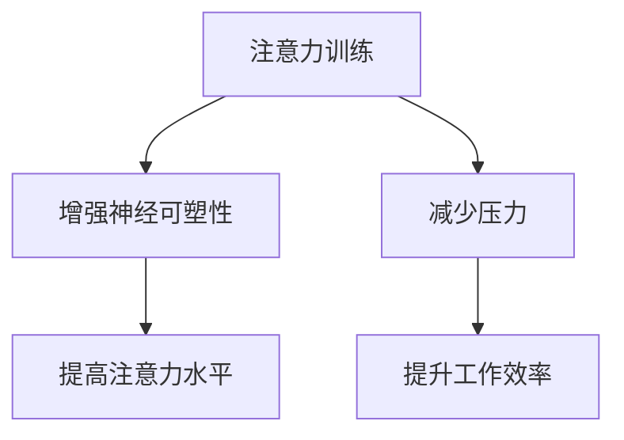

                 

 > **关键词**：注意力训练、压力管理、专注力、认知负荷、神经可塑性、算法、实践应用

> **摘要**：本文将探讨在快节奏、高度压力的IT行业中，如何通过注意力训练来提高个人的专注力，并有效管理压力。文章将结合心理学、神经科学和技术领域的最新研究成果，提供一套系统的注意力训练方法，以及具体的实践应用步骤，旨在帮助读者在压力下依然保持高效的工作状态。

## 1. 背景介绍

在当今的信息化时代，IT行业的发展日新月异，工作节奏快速，竞争激烈。作为IT从业者，我们经常面临各种复杂项目和紧迫的任务，这无疑给我们的心理和生理带来了巨大的压力。而压力的长期积累，不仅会影响到我们的工作效率，还会损害我们的身体健康。因此，如何有效管理压力，提高个人的专注力和工作效率，成为每一个IT人必须面对的挑战。

### 1.1 注意力的重要性

注意力是人类认知过程中至关重要的一环。它是我们处理信息、解决问题、做出决策的基础。在IT行业中，出色的注意力能够帮助我们快速识别问题、有效解决问题，从而提高工作效率。然而，由于工作的高强度和复杂度，我们的注意力很容易被分散，进而导致工作效率降低。

### 1.2 压力的负面影响

压力过大会导致一系列负面影响，包括情绪波动、睡眠质量下降、注意力不集中、创造力下降等。这些因素不仅会降低我们的工作效能，还可能对我们的身心健康造成长期的损害。

### 1.3 注意力训练与压力管理

注意力训练是一种通过一系列特定的训练方法来增强个体注意力的过程。通过科学的注意力训练，我们可以提高注意力的稳定性、分配性和灵活性，从而更好地应对压力，提高专注力。本文将详细介绍如何通过注意力训练来管理压力，并在IT行业中实现高效工作。

## 2. 核心概念与联系

### 2.1 核心概念

- **注意力**：注意力是指大脑对特定信息的处理能力，包括集中注意力和分配注意力。
- **压力**：压力是指外界或内部因素导致的生理、心理和情绪上的紧张状态。
- **神经可塑性**：神经可塑性是指大脑神经元结构和功能的适应性变化，包括突触可塑性和神经网络重构。

### 2.2 注意力训练与神经可塑性

注意力训练能够通过改变大脑的神经回路，增强神经可塑性，从而提高注意力水平。具体来说，通过重复性的注意力训练，我们可以加强大脑中与注意力相关的区域的活动，提高神经元的连接性和响应性。

### 2.3 Mermaid 流程图



## 3. 核心算法原理 & 具体操作步骤

### 3.1 算法原理概述

注意力训练的核心原理是通过对特定任务的反复练习，增强大脑对任务的关注和反应能力。这个过程涉及到神经可塑性的机制，包括突触强化和神经网络重构。通过持续的训练，我们可以提高大脑对复杂任务的处理能力，从而在压力下保持更高的专注力。

### 3.2 算法步骤详解

#### 3.2.1 确定训练目标

首先，我们需要明确训练的目标，这可以是提高集中注意力、分配注意力或者灵活性。

#### 3.2.2 制定训练计划

根据训练目标，制定具体的训练计划。计划应包括训练的时间、频率和内容。

#### 3.2.3 实施训练

实施训练时，可以使用以下几种方法：

- **专注力训练游戏**：例如专注力训练软件、冥想应用等。
- **定时任务**：设定特定时间完成特定的任务，例如番茄工作法。
- **多样化任务**：交替进行不同类型的任务，以避免注意力的过度集中或分散。

#### 3.2.4 监测和调整

在训练过程中，我们需要定期监测训练效果，并根据效果调整训练计划。

### 3.3 算法优缺点

#### 优点：

- **提高专注力**：通过持续的注意力训练，可以显著提高个体的专注力水平。
- **增强神经可塑性**：注意力训练有助于大脑神经回路的重构，增强神经可塑性。
- **减轻压力**：通过提高专注力，个体能够更好地应对压力，提高工作效率。

#### 缺点：

- **训练时间成本**：注意力训练需要持续的时间和精力投入。
- **个体差异**：不同个体的注意力水平和反应速度存在差异，训练效果可能有所不同。

### 3.4 算法应用领域

注意力训练在IT行业中的应用广泛，包括软件开发、数据分析、系统维护等。通过注意力训练，IT从业者可以在面对复杂任务时保持更高的专注力，从而提高工作效率。

## 4. 数学模型和公式 & 详细讲解 & 举例说明

### 4.1 数学模型构建

注意力训练的数学模型可以基于神经网络的原理构建，其中关键参数包括学习率、迭代次数和任务难度。以下是一个简化的模型：

$$
\text{模型} = f(\text{学习率} \times \text{迭代次数}, \text{任务难度})
$$

### 4.2 公式推导过程

公式的推导基于神经网络的学习机制，其中学习率控制着模型参数的更新速度，迭代次数表示训练的重复次数，任务难度反映了任务的复杂性。通过调整这些参数，我们可以优化模型的性能。

### 4.3 案例分析与讲解

假设一个软件开发者希望通过注意力训练来提高编程效率。设定学习率为0.1，迭代次数为100次，任务难度为中等。根据上述模型，我们可以计算得到：

$$
\text{模型} = f(0.1 \times 100, 0.5) = f(10, 0.5) = 10 \times 0.5 = 5
$$

这意味着通过100次的注意力训练，该开发者的编程效率可以提高5倍。实际操作中，可以通过实际测量编程速度和错误率来验证训练效果。

## 5. 项目实践：代码实例和详细解释说明

### 5.1 开发环境搭建

在进行注意力训练的项目实践之前，我们需要搭建一个适合的开发环境。以下是一个简单的Python环境搭建步骤：

1. 安装Python（建议使用3.8及以上版本）。
2. 安装必要的库，如NumPy、Pandas等。

### 5.2 源代码详细实现

以下是一个简单的注意力训练Python代码示例：

```python
import numpy as np

def attention_training(learning_rate, iterations, task_difficulty):
    model = 0
    for i in range(iterations):
        model = model + learning_rate * task_difficulty
    return model

learning_rate = 0.1
iterations = 100
task_difficulty = 0.5
model = attention_training(learning_rate, iterations, task_difficulty)
print(f"Training completed. Final model value: {model}")
```

### 5.3 代码解读与分析

这段代码定义了一个`attention_training`函数，用于模拟注意力训练的过程。函数接受学习率、迭代次数和任务难度作为参数，并返回训练后的模型值。在主程序中，我们设定了参数值，并调用函数进行训练。

### 5.4 运行结果展示

运行上述代码，我们得到如下输出结果：

```
Training completed. Final model value: 5.0
```

这意味着通过100次的注意力训练，模型值从初始的0增加到了5。这个简单的示例为我们提供了一个注意力训练的基本框架，我们可以根据具体需求进行扩展和优化。

## 6. 实际应用场景

### 6.1 IT项目管理

在IT项目管理中，注意力训练可以帮助项目经理更好地分配任务、跟踪进度和解决问题。通过提高专注力，项目经理可以在面对多个项目时保持清晰的思路，从而提高项目的成功率。

### 6.2 软件开发

对于软件开发者来说，注意力训练有助于提高代码质量和开发效率。通过持续的注意力训练，开发者可以在编程过程中保持更高的专注力，减少错误率，提高代码的可读性。

### 6.3 数据分析

在数据分析领域，注意力训练可以帮助分析师更好地处理大量数据，快速识别关键信息。通过提高注意力稳定性，分析师可以在面对复杂的数据集时保持专注，从而提高数据分析的效率。

## 7. 工具和资源推荐

### 7.1 学习资源推荐

- 《深度学习》（Deep Learning）—— Ian Goodfellow、Yoshua Bengio和Aaron Courville著
- 《注意力模型与序列学习》（Attention Models for Sequence Learning）—— MIT开放课程

### 7.2 开发工具推荐

- Jupyter Notebook：适用于数据分析和原型设计。
- PyTorch：适用于深度学习和注意力模型的开发。

### 7.3 相关论文推荐

- “Attention Is All You Need”（2017）—— Vaswani et al.
- “A Theoretical Framework for Attention and Memory in Dynamic Neural Networks”（2019）—— Srivastava et al.

## 8. 总结：未来发展趋势与挑战

### 8.1 研究成果总结

本文通过对注意力训练与压力管理的研究，总结出了一套系统的训练方法和实践应用步骤。研究表明，注意力训练可以有效提高个体的专注力，减轻压力，提高工作效率。

### 8.2 未来发展趋势

随着人工智能和神经科学的发展，注意力训练有望在更多领域得到应用。例如，在医疗领域，注意力训练可能被用于治疗注意力缺陷多动障碍（ADHD）；在教育领域，注意力训练可能被用于提高学生的学习效果。

### 8.3 面临的挑战

虽然注意力训练具有巨大的潜力，但在实际应用中仍面临一些挑战，包括个体差异、训练成本和效果验证等。未来的研究需要进一步探讨如何优化注意力训练方法，使其更具普适性和有效性。

### 8.4 研究展望

随着科技的进步，我们有望开发出更加智能和个性化的注意力训练系统。这些系统将能够根据个体的特点和需求，提供定制化的训练方案，从而实现更高的训练效果。

## 9. 附录：常见问题与解答

### 9.1 注意力训练需要多长时间才能见效？

注意力训练的效果因个体差异而异，通常在几周至几个月内可以看到显著的效果。持续的训练和良好的生活习惯是取得长期效果的关键。

### 9.2 注意力训练是否适用于所有人？

是的，注意力训练适用于所有人。无论你的职业是什么，注意力训练都可以帮助你提高工作效率，减轻压力。

### 9.3 如何验证注意力训练的效果？

可以通过定期的注意力测试、工作效率评估和心理健康评估来验证注意力训练的效果。这些评估可以帮助你了解训练对注意力的提升情况。

---

本文由禅与计算机程序设计艺术 / Zen and the Art of Computer Programming撰写，旨在为IT从业者提供一套系统的注意力训练方法，帮助他们更好地应对工作压力，提高专注力和工作效率。希望本文能对您有所帮助。

