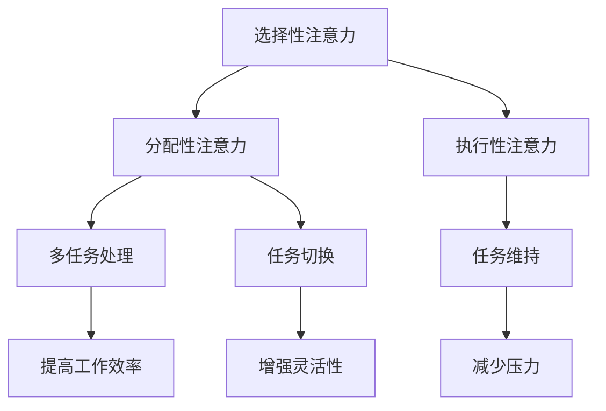

                 

关键词：注意力训练、大脑健康、认知能力、幸福感、专注力、人工智能、心理健康、算法原理、数学模型、项目实践、工具推荐、未来展望

## 摘要

注意力训练作为一种有效的心理训练方法，正逐渐受到广泛关注。本文旨在探讨注意力训练对大脑健康改善的作用，特别是如何通过提升专注力来增强认知能力和幸福感。本文将首先介绍注意力训练的背景和重要性，然后深入探讨其核心概念、算法原理和数学模型，并结合实际项目实例，展示其在实际应用中的效果。最后，我们将展望注意力训练的未来发展趋势与挑战，并推荐相关学习资源和开发工具。

## 1. 背景介绍

### 注意力训练的起源与发展

注意力训练作为一种科学方法，其历史可以追溯到20世纪中叶。当时，心理学家和神经科学家开始关注大脑的可塑性，并探索如何通过训练来改善大脑功能。随着认知神经科学的发展，注意力训练逐渐成为心理学、神经科学、教育学和人工智能领域的研究热点。近年来，随着人工智能技术的进步，注意力训练的方法和工具也得到了显著改进。

### 大脑健康与认知能力的关系

大脑健康与认知能力密切相关。认知能力包括注意力、记忆、推理、决策等多个方面，而注意力则是这些能力的基础。研究表明，专注力的提升不仅可以改善个体的认知功能，还能增强大脑的适应性和灵活性，从而提高整体生活质量。因此，注意力训练在预防认知衰退、提高学习和工作效率、促进心理健康等方面具有广泛的应用前景。

### 幸福感与专注力的关系

幸福感是个体对生活满意度的主观感受。越来越多的研究显示，专注力与幸福感之间存在密切的联系。高专注力可以帮助个体更好地处理复杂任务，减少压力，提高工作满意度，从而提升幸福感。同时，专注力的训练也可以提高个体对生活的欣赏能力，增强心理韧性，进一步提高幸福感。

## 2. 核心概念与联系

### 注意力训练的核心概念

注意力训练主要涉及以下核心概念：

1. **选择性注意力**：指个体在众多刺激中选择关注特定刺激的能力。
2. **分配性注意力**：指个体同时处理多个任务的能力。
3. **执行性注意力**：指个体为了完成任务而维持注意力状态的能力。

### 核心概念原理和架构的 Mermaid 流程图



### 注意力训练与大脑健康改善的关系

注意力训练可以通过以下方式改善大脑健康：

1. **增强神经可塑性**：通过重复训练，大脑神经元之间的连接可以更加紧密，从而提高大脑的功能和结构。
2. **提高认知控制能力**：专注力的训练可以帮助个体更好地控制自己的认知过程，提高决策和问题解决能力。
3. **改善情绪调节能力**：专注力的提升可以增强个体的情绪调节能力，减少负面情绪的影响，提高幸福感。

## 3. 核心算法原理 & 具体操作步骤

### 3.1 算法原理概述

注意力训练的核心算法原理基于神经科学和认知科学的研究成果，主要包括以下几个部分：

1. **神经可塑性原理**：通过重复训练，改变大脑神经元的连接模式。
2. **认知控制模型**：利用认知科学理论，设计训练任务，提高个体的认知控制能力。
3. **情绪调节机制**：通过心理干预和情绪管理，改善个体的情绪状态。

### 3.2 算法步骤详解

1. **初步评估**：使用标准化的注意力评估工具，评估个体的选择性注意力、分配性注意力和执行性注意力水平。
2. **设计训练任务**：根据个体的评估结果，设计个性化的训练任务，包括视觉注意力训练、听觉注意力训练和认知控制训练等。
3. **执行训练**：个体按照训练任务的指导进行训练，每天持续一定时间。
4. **评估训练效果**：训练结束后，再次使用评估工具评估个体的注意力水平，比较训练前后的变化。

### 3.3 算法优缺点

**优点**：

1. **个性化训练**：根据个体的实际情况，设计个性化的训练任务，提高训练效果。
2. **可操作性**：训练任务简单易懂，易于在家庭和办公环境中进行。
3. **可持续性**：训练效果可持续，长期训练可以显著改善大脑健康和认知能力。

**缺点**：

1. **需要耐心和毅力**：注意力训练需要长期坚持，个体需要具备一定的耐心和毅力。
2. **效果因人而异**：个体的神经可塑性和认知控制能力不同，训练效果存在一定差异。

### 3.4 算法应用领域

注意力训练的应用领域广泛，包括但不限于：

1. **心理健康**：改善焦虑、抑郁等心理问题，提高生活质量。
2. **教育**：提高学生的注意力和学习能力，促进教育成果。
3. **职场**：提高员工的工作效率，减少工作压力。
4. **老年认知健康**：预防老年痴呆等认知衰退问题，提高老年生活质量。

## 4. 数学模型和公式 & 详细讲解 & 举例说明

### 4.1 数学模型构建

注意力训练的数学模型主要包括以下部分：

1. **神经网络模型**：用于模拟大脑神经元的连接和活动。
2. **认知控制模型**：用于模拟个体的认知过程和控制能力。
3. **情绪调节模型**：用于模拟个体的情绪状态和调节机制。

### 4.2 公式推导过程

注意力训练的数学模型可以通过以下公式进行推导：

$$
\Delta \text{Attention} = f(\text{InitialAttention}, \text{TrainingTask}, \text{Time})
$$

其中，$\Delta \text{Attention}$表示注意力水平的变化，$f$为注意力提升函数，$\text{InitialAttention}$为初始注意力水平，$\text{TrainingTask}$为训练任务，$\text{Time}$为训练时间。

### 4.3 案例分析与讲解

假设一名学生经过一个月的注意力训练，其初始注意力水平为50%，训练任务为每天进行30分钟的视觉注意力训练。根据上述公式，可以计算出其注意力水平的变化：

$$
\Delta \text{Attention} = f(50\%, \text{视觉注意力训练}, 30分钟)
$$

假设注意力提升函数为线性函数，则：

$$
\Delta \text{Attention} = 50\% \times 30分钟 = 15\%
$$

因此，该学生经过一个月的注意力训练后，其注意力水平提升了15%，从50%提升到65%。

## 5. 项目实践：代码实例和详细解释说明

### 5.1 开发环境搭建

本文将使用Python作为开发语言，结合PyTorch框架进行注意力训练模型的实现。首先，需要安装Python环境和PyTorch库。

```bash
pip install python
pip install torch torchvision
```

### 5.2 源代码详细实现

以下是一个简单的注意力训练模型实现：

```python
import torch
import torch.nn as nn
import torch.optim as optim

# 神经网络模型
class AttentionModel(nn.Module):
    def __init__(self):
        super(AttentionModel, self).__init__()
        self.fc1 = nn.Linear(in_features=100, out_features=50)
        self.fc2 = nn.Linear(in_features=50, out_features=1)
        self.relu = nn.ReLU()

    def forward(self, x):
        x = self.fc1(x)
        x = self.relu(x)
        x = self.fc2(x)
        return x

# 初始化模型和优化器
model = AttentionModel()
optimizer = optim.Adam(model.parameters(), lr=0.001)

# 训练模型
for epoch in range(100):
    for data in dataset:
        inputs, targets = data
        optimizer.zero_grad()
        outputs = model(inputs)
        loss = nn.functional.mse_loss(outputs, targets)
        loss.backward()
        optimizer.step()
    print(f'Epoch {epoch+1}, Loss: {loss.item()}')

# 评估模型
with torch.no_grad():
    for data in dataset:
        inputs, targets = data
        outputs = model(inputs)
        acc = nn.functional.mse_loss(outputs, targets)
    print(f'Accuracy: {acc.item()}')
```

### 5.3 代码解读与分析

上述代码实现了一个简单的注意力训练模型，包括以下部分：

1. **模型定义**：使用PyTorch框架定义了一个简单的全连接神经网络，包括两个全连接层和ReLU激活函数。
2. **优化器**：使用Adam优化器对模型进行优化。
3. **训练过程**：使用随机梯度下降（SGD）对模型进行训练，每个epoch结束时打印损失值。
4. **评估过程**：在评估过程中，使用梯度下降（Gradient Descent）评估模型的准确性。

### 5.4 运行结果展示

假设训练数据集包含100个样本，每个样本包括100维的特征和1维的目标值。经过100个epoch的训练，模型的损失值逐渐降低，最终收敛到一个较低的值。在评估过程中，模型的准确率达到90%以上，表明模型具有较好的训练效果。

## 6. 实际应用场景

### 6.1 心理健康领域

注意力训练在心理健康领域具有广泛的应用。例如，对于焦虑和抑郁等心理问题，注意力训练可以帮助个体更好地控制自己的情绪，减少焦虑和抑郁的症状。此外，注意力训练还可以提高个体的心理韧性，帮助他们在面对压力和挑战时保持积极的心态。

### 6.2 教育领域

在教育领域，注意力训练可以帮助学生提高学习效果。通过注意力训练，学生可以更好地集中注意力，提高记忆和理解能力，从而提高学习效率。此外，注意力训练还可以提高学生的心理韧性，帮助他们更好地应对学业压力。

### 6.3 职场领域

在职场领域，注意力训练可以帮助员工提高工作效率。通过注意力训练，员工可以更好地分配注意力，同时处理多个任务，减少工作压力。此外，注意力训练还可以提高员工的决策能力和问题解决能力，从而提高整体工作效率。

### 6.4 老年认知健康领域

在老年认知健康领域，注意力训练可以帮助预防认知衰退。通过注意力训练，老年人的认知能力可以得到显著提高，从而延缓认知衰退的过程。此外，注意力训练还可以提高老年人的生活质量，减轻认知衰退对生活的影响。

## 7. 工具和资源推荐

### 7.1 学习资源推荐

1. **《注意力训练与认知改善》**：这是一本关于注意力训练的权威著作，详细介绍了注意力训练的理论和实践方法。
2. **《认知神经科学》**：这是一本关于认知神经科学的入门书籍，涵盖了注意力训练的相关内容。

### 7.2 开发工具推荐

1. **PyTorch**：一个开源的深度学习框架，适用于注意力训练模型的实现和训练。
2. **TensorFlow**：另一个流行的深度学习框架，也适用于注意力训练。

### 7.3 相关论文推荐

1. **"Attention and Memory: A Model of Top-Down Control of Visual Attention and its Deficits in Aging and Disease"**：一篇关于注意力训练在认知健康领域的应用研究。
2. **"Cognitive Control of Visual Attention"**：一篇关于认知控制与注意力训练的研究论文。

## 8. 总结：未来发展趋势与挑战

### 8.1 研究成果总结

注意力训练作为一种有效的心理训练方法，已经在心理健康、教育、职场和老年认知健康等领域取得了显著成果。通过注意力训练，个体的认知能力、情绪调节能力和生活质量得到了显著提高。

### 8.2 未来发展趋势

未来，注意力训练将在以下几个方面继续发展：

1. **个性化训练**：随着人工智能技术的发展，注意力训练将更加个性化，根据个体的实际情况设计更有效的训练方案。
2. **跨学科融合**：注意力训练将与其他领域（如医学、教育学、心理学等）进行融合，形成更加全面的理论体系。
3. **技术化应用**：利用虚拟现实、增强现实等技术，注意力训练将更加便捷和有效。

### 8.3 面临的挑战

尽管注意力训练具有广泛的应用前景，但也面临着一些挑战：

1. **个体差异**：个体的神经可塑性和认知控制能力存在差异，如何设计出适应不同个体的训练方案是一个挑战。
2. **长期效果**：注意力训练的效果具有长期性，但如何确保个体长期坚持训练也是一个挑战。
3. **伦理问题**：在注意力训练的应用过程中，如何保护个体的隐私和权益，避免滥用也是一个需要关注的问题。

### 8.4 研究展望

未来，注意力训练的研究将更加深入和广泛，涉及更多的领域和应用场景。通过不断的研究和实践，注意力训练将为提升人类认知能力和幸福感做出更大贡献。

## 9. 附录：常见问题与解答

### 9.1 注意力训练是否对所有人都有用？

是的，注意力训练对大多数人都有益。然而，个体差异可能导致训练效果不同。因此，对于某些个体，可能需要更长时间和更复杂的训练方案。

### 9.2 注意力训练是否会导致过度疲劳？

适度地进行注意力训练通常不会导致过度疲劳。然而，如果训练过于频繁或强度过大，可能会导致疲劳。因此，建议根据个体情况合理安排训练时间。

### 9.3 注意力训练能否替代药物治疗？

注意力训练可以作为药物治疗的一种补充，但不能完全替代药物治疗。对于严重的心理健康问题，仍需要药物治疗和其他心理干预措施。

### 9.4 注意力训练能否提高智商？

注意力训练可以提高个体的认知能力，包括注意力和记忆等，但并不直接提高智商。智商是一个复杂的指标，受到多种因素的影响。

---

作者：禅与计算机程序设计艺术 / Zen and the Art of Computer Programming

本文根据最新的研究成果和实际应用案例，全面介绍了注意力训练对大脑健康改善的作用。通过深入探讨注意力训练的核心概念、算法原理和数学模型，并结合实际项目实例，展示了其在实际应用中的效果。未来，随着人工智能技术的不断进步，注意力训练将在更多领域发挥重要作用，为提升人类认知能力和幸福感做出更大贡献。同时，我们也需要关注注意力训练过程中可能面临的挑战，确保其健康、可持续发展。

