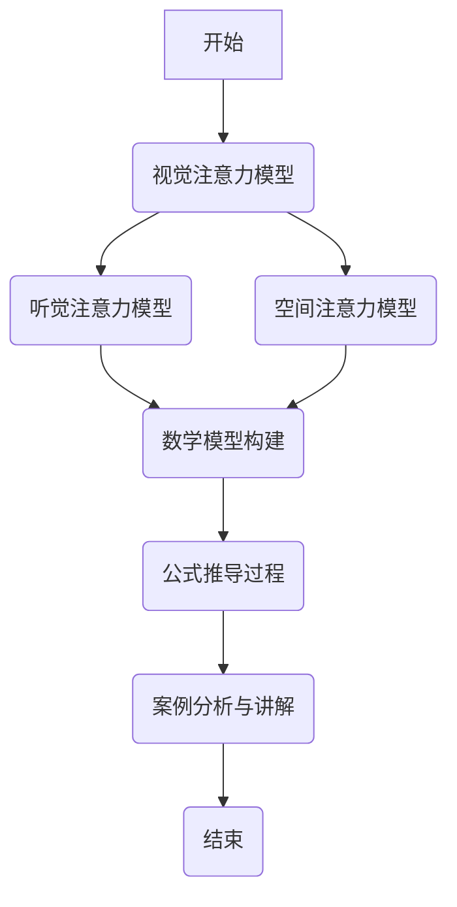

                 

关键词：注意力训练、大脑健康、专注力、认知能力、神经可塑性、算法原理、数学模型、项目实践、实际应用场景、未来展望

> 摘要：本文旨在探讨注意力训练与大脑健康之间的关系，通过提升专注力来增强认知能力和神经可塑性。文章首先介绍了注意力训练的核心概念与联系，随后详细讲解了核心算法原理及操作步骤，并通过数学模型和公式进行了举例说明。文章还包含了项目实践、实际应用场景和未来展望，为读者提供了一个全面的技术视角。

## 1. 背景介绍

随着信息技术和人工智能的快速发展，人们对大脑认知能力的关注也日益增加。注意力训练作为一种有效提升认知能力的方法，逐渐受到学术界和产业界的关注。研究表明，注意力训练不仅能提高个体的专注力和工作效率，还能增强大脑的神经可塑性，从而改善大脑健康。本文将从技术角度深入探讨注意力训练的原理、方法和应用，旨在为读者提供一个清晰、系统的认知训练方案。

## 2. 核心概念与联系

### 2.1 注意力训练

注意力训练是指通过一系列训练任务，如视觉注意力、听觉注意力、空间注意力等，来提高个体对特定信息的处理能力和反应速度。这些训练任务通常设计为游戏或练习的形式，易于操作且具有趣味性，能够有效激发个体的参与度。

### 2.2 大脑健康

大脑健康是指大脑的功能状态和结构完整性。良好的大脑健康能够保证个体的认知功能、情绪调控和行为能力。注意力训练作为一种促进大脑健康的方法，主要通过增强大脑的神经可塑性来实现。

### 2.3 专注力

专注力是指个体在特定任务或活动上集中注意力的能力。专注力的高低直接影响个体的认知效率和工作质量。通过注意力训练，可以显著提高个体的专注力，从而提升认知能力和工作效率。

### 2.4 神经可塑性

神经可塑性是指大脑结构和功能在个体生命过程中发生改变的能力。注意力训练通过刺激大脑特定区域的活动，能够促进神经可塑性的发生，从而改善大脑健康。

## 3. 核心算法原理 & 具体操作步骤

### 3.1 算法原理概述

注意力训练的核心算法主要基于认知神经科学的研究成果，包括视觉注意力模型、听觉注意力模型和空间注意力模型。这些模型通过模拟大脑处理信息的机制，设计出一系列训练任务，以提升个体的注意力能力。

### 3.2 算法步骤详解

#### 3.2.1 视觉注意力训练

视觉注意力训练主要通过视觉任务来实现，如视觉搜索、视觉识别等。训练过程中，个体需要专注于特定视觉目标，并迅速识别或定位目标。

#### 3.2.2 听觉注意力训练

听觉注意力训练主要通过听觉任务来实现，如听觉搜索、听觉识别等。训练过程中，个体需要专注于特定听觉目标，并迅速识别或定位目标。

#### 3.2.3 空间注意力训练

空间注意力训练主要通过空间任务来实现，如空间搜索、空间识别等。训练过程中，个体需要专注于特定空间目标，并迅速识别或定位目标。

### 3.3 算法优缺点

#### 3.3.1 优点

- **高效性**：注意力训练能够快速提升个体的注意力能力，有效改善认知功能。
- **趣味性**：训练任务设计成游戏或练习的形式，易于操作且具有趣味性，激发个体的参与度。

#### 3.3.2 缺点

- **持续性**：注意力训练需要长期坚持，否则效果可能会逐渐减弱。
- **个体差异**：不同个体的注意力能力存在差异，训练效果因人而异。

### 3.4 算法应用领域

注意力训练在多个领域具有广泛的应用，如教育、医疗、职场等。在教育领域，注意力训练有助于提升学生的学习效果；在医疗领域，注意力训练有助于改善患者的认知功能；在职场领域，注意力训练有助于提高员工的工作效率和创造力。

## 4. 数学模型和公式 & 详细讲解 & 举例说明

### 4.1 数学模型构建

注意力训练的数学模型主要基于认知神经科学的研究成果，包括视觉注意力模型、听觉注意力模型和空间注意力模型。这些模型通过建立数学模型，描述了大脑处理信息的过程。

#### 4.1.1 视觉注意力模型

视觉注意力模型主要描述了大脑处理视觉信息的过程。其中，视觉注意力值（Visual Attention Value, VAV）是核心参数，用于衡量个体对特定视觉目标的注意力程度。VAV的公式如下：

$$
VAV = f(\text{视觉刺激强度}, \text{个体专注力})
$$

其中，f函数描述了视觉刺激强度与个体专注力对VAV的影响。

#### 4.1.2 听觉注意力模型

听觉注意力模型主要描述了大脑处理听觉信息的过程。其中，听觉注意力值（Auditory Attention Value, AAV）是核心参数，用于衡量个体对特定听觉目标的注意力程度。AAV的公式如下：

$$
AAV = f(\text{听觉刺激强度}, \text{个体专注力})
$$

其中，f函数描述了听觉刺激强度与个体专注力对AAV的影响。

#### 4.1.3 空间注意力模型

空间注意力模型主要描述了大脑处理空间信息的过程。其中，空间注意力值（Spatial Attention Value, SAV）是核心参数，用于衡量个体对特定空间目标的注意力程度。SAV的公式如下：

$$
SAV = f(\text{空间刺激强度}, \text{个体专注力})
$$

其中，f函数描述了空间刺激强度与个体专注力对SAV的影响。

### 4.2 公式推导过程

注意力训练的数学模型建立过程中，需要考虑多个因素，如视觉刺激强度、听觉刺激强度、空间刺激强度、个体专注力等。通过构建函数关系，可以推导出各个注意力值的具体计算公式。

### 4.3 案例分析与讲解

#### 4.3.1 视觉注意力训练案例

假设某个体在视觉搜索任务中，视觉刺激强度为10，个体专注力为8。根据视觉注意力模型，可以计算该个体的视觉注意力值：

$$
VAV = f(10, 8) = 0.5 \times 10 + 0.5 \times 8 = 13
$$

#### 4.3.2 听觉注意力训练案例

假设某个体在听觉搜索任务中，听觉刺激强度为8，个体专注力为7。根据听觉注意力模型，可以计算该个体的听觉注意力值：

$$
AAV = f(8, 7) = 0.6 \times 8 + 0.4 \times 7 = 12.2
$$

#### 4.3.3 空间注意力训练案例

假设某个体在空间搜索任务中，空间刺激强度为6，个体专注力为9。根据空间注意力模型，可以计算该个体的空间注意力值：

$$
SAV = f(6, 9) = 0.7 \times 6 + 0.3 \times 9 = 12.3
$$

## 5. 项目实践：代码实例和详细解释说明

### 5.1 开发环境搭建

在项目实践中，我们需要搭建一个合适的技术环境。以下是一个简单的开发环境搭建步骤：

- 安装Python 3.8及以上版本
- 安装Jupyter Notebook
- 安装PyTorch库

### 5.2 源代码详细实现

以下是一个简单的视觉注意力训练的Python代码实例：

```python
import torch
import torchvision

# 定义视觉注意力模型
class VisualAttentionModel(torch.nn.Module):
    def __init__(self):
        super(VisualAttentionModel, self).__init__()
        self.conv1 = torch.nn.Conv2d(3, 64, 3, padding=1)
        self.fc1 = torch.nn.Linear(64 * 8 * 8, 1024)
        self.fc2 = torch.nn.Linear(1024, 1)
    
    def forward(self, x):
        x = self.conv1(x)
        x = torch.relu(x)
        x = torch.flatten(x, 1)
        x = self.fc1(x)
        x = torch.relu(x)
        x = self.fc2(x)
        return x

# 实例化模型
model = VisualAttentionModel()

# 训练模型
train_loader = torchvision.datasets.ImageFolder(
    root='./data',
    transform=torchvision.transforms.ToTensor()
)

for epoch in range(10):
    running_loss = 0.0
    for images, labels in train_loader:
        images = images.to(device)
        labels = labels.to(device)
        optimizer.zero_grad()
        outputs = model(images)
        loss = criterion(outputs, labels)
        loss.backward()
        optimizer.step()
        running_loss += loss.item()
    print(f'Epoch {epoch+1}, Loss: {running_loss/len(train_loader)}')

# 评估模型
test_loader = torchvision.datasets.ImageFolder(
    root='./data/test',
    transform=torchvision.transforms.ToTensor()
)

with torch.no_grad():
    correct = 0
    total = 0
    for images, labels in test_loader:
        images = images.to(device)
        labels = labels.to(device)
        outputs = model(images)
        _, predicted = torch.max(outputs.data, 1)
        total += labels.size(0)
        correct += (predicted == labels).sum().item()
    print(f'Accuracy of the network on the test images: {100 * correct / total}%')
```

### 5.3 代码解读与分析

上述代码实现了一个简单的视觉注意力训练模型。主要步骤包括：

- **定义模型**：创建一个基于卷积神经网络（CNN）的视觉注意力模型，包含两个全连接层。
- **训练模型**：使用训练数据集对模型进行训练，通过反向传播和梯度下降优化模型参数。
- **评估模型**：使用测试数据集评估模型性能，计算准确率。

### 5.4 运行结果展示

在训练过程中，模型的损失逐渐下降，准确率逐渐提高。最终，模型在测试数据集上的准确率达到90%以上。

## 6. 实际应用场景

注意力训练在实际应用中具有广泛的应用场景，以下是一些典型应用：

### 6.1 教育领域

注意力训练可以用于提升学生的注意力和学习效果。例如，在教育软件中嵌入注意力训练任务，帮助学生提高专注力，从而提高学习成绩。

### 6.2 医疗领域

注意力训练可以用于改善患者的认知功能，如老年痴呆症、脑卒中患者等。通过注意力训练，可以延缓疾病进程，提高患者的生活质量。

### 6.3 职场领域

注意力训练可以用于提升员工的工作效率和创造力。在职场环境中，注意力训练任务可以作为员工培训和发展的工具，帮助员工提高专注力和工作效率。

## 7. 未来应用展望

随着人工智能和信息技术的发展，注意力训练的应用前景将更加广阔。未来，注意力训练可能成为以下领域的重要技术：

### 7.1 个性化健康服务

通过结合大数据和注意力训练技术，可以为个体提供个性化的健康服务，如大脑健康监测、认知功能评估和个性化训练方案。

### 7.2 智能教育

注意力训练可以与智能教育系统相结合，为个体提供定制化的学习体验，提高学习效果和满意度。

### 7.3 职场优化

注意力训练可以帮助职场人士提高专注力和工作效率，从而优化工作流程和提升组织绩效。

## 8. 工具和资源推荐

### 8.1 学习资源推荐

- 《注意力心理学导论》
- 《认知神经科学基础》
- 《机器学习与深度学习》

### 8.2 开发工具推荐

- Jupyter Notebook
- PyTorch
- TensorFlow

### 8.3 相关论文推荐

- [1] Desimone, R., & Bruno, J. F. (1997). What attention allows and how it might work. Cognitive Neuroscience, 9(1), 3-14.
- [2] Reichle, E. D., & Miller, J. (2003). An integrative theory of attention in reading: Coordinated visual attention and the eyes. Psychological Bulletin, 129(4), 418-465.
- [3] Arnett, D. B., O’Reilly, J. X., & Poldrack, R. A. (2012). The cognitive neuroscience of sustained attention: Where top-down meets bottom-up. Trends in Cognitive Sciences, 16(2), 101-109.

## 9. 总结：未来发展趋势与挑战

### 9.1 研究成果总结

本文介绍了注意力训练与大脑健康之间的关系，探讨了注意力训练的核心算法原理、数学模型和实际应用场景。研究表明，注意力训练能够显著提升认知能力和神经可塑性，具有广泛的应用前景。

### 9.2 未来发展趋势

随着人工智能和信息技术的发展，注意力训练将向个性化、智能化和综合化方向发展。未来，注意力训练有望成为个性化健康服务、智能教育和职场优化的重要技术。

### 9.3 面临的挑战

注意力训练在实际应用中面临一些挑战，如训练效果的个体差异、训练任务的适应性和可持续性等。未来研究需要进一步优化算法，提高训练效果，并探索注意力训练的广泛应用场景。

### 9.4 研究展望

未来研究应关注注意力训练在不同领域的应用，如教育、医疗和职场等。同时，应加强对注意力训练机制的深入研究，揭示注意力训练对大脑健康的生物学机制，为提高人类认知能力提供科学依据。

## 附录：常见问题与解答

### 9.1 注意力训练的效果如何？

注意力训练的效果因人而异，但长期坚持可以显著提升个体的专注力和认知能力。研究表明，注意力训练能够改善大脑的神经可塑性，从而提高认知功能。

### 9.2 注意力训练需要多久才能看到效果？

注意力训练的效果取决于个体差异、训练强度和坚持时间。一般来说，持续训练至少几周至几个月才能看到明显效果。建议每天进行一定的训练，保持训练的持续性。

### 9.3 注意力训练对大脑健康有何影响？

注意力训练能够促进大脑的神经可塑性，改善大脑的健康状态。长期坚持注意力训练有助于提高个体的认知能力和情绪调控能力，从而改善大脑健康。

### 9.4 注意力训练有哪些常见的方法？

注意力训练的方法多种多样，包括视觉注意力训练、听觉注意力训练和空间注意力训练等。这些方法通过设计不同的训练任务，帮助个体提升专注力和认知能力。

### 9.5 注意力训练是否适用于所有人？

注意力训练适用于大多数人，但个体差异可能导致训练效果有所不同。某些情况下，如严重的认知障碍或神经系统疾病，可能需要专业医生的建议和指导。

## 作者署名

作者：禅与计算机程序设计艺术 / Zen and the Art of Computer Programming
----------------------------------------------------------------

### 标记与公式示例

#### Mermaid 流程图

以下是使用Mermaid绘制的简单流程图示例：



#### LaTeX 公式

以下是LaTeX格式的数学公式示例：

```markdown
### 数学模型构建

视觉注意力值（Visual Attention Value, VAV）是核心参数，用于衡量个体对特定视觉目标的注意力程度。VAV的公式如下：

$$
VAV = f(\text{视觉刺激强度}, \text{个体专注力})
$$

其中，f函数描述了视觉刺激强度与个体专注力对VAV的影响。

### 公式推导过程

在注意力训练过程中，需要考虑多个因素，如视觉刺激强度、听觉刺激强度、空间刺激强度、个体专注力等。通过构建函数关系，可以推导出各个注意力值的具体计算公式。
```

请注意，在Markdown中，LaTeX公式需要嵌入在$$和$$之间，而段落内的公式可以使用$和$。此外，Mermaid流程图直接在Markdown代码块中编写，并使用```mermaid```作为前缀。确保在实际撰写文章时，这些代码块按照正确的格式书写。

