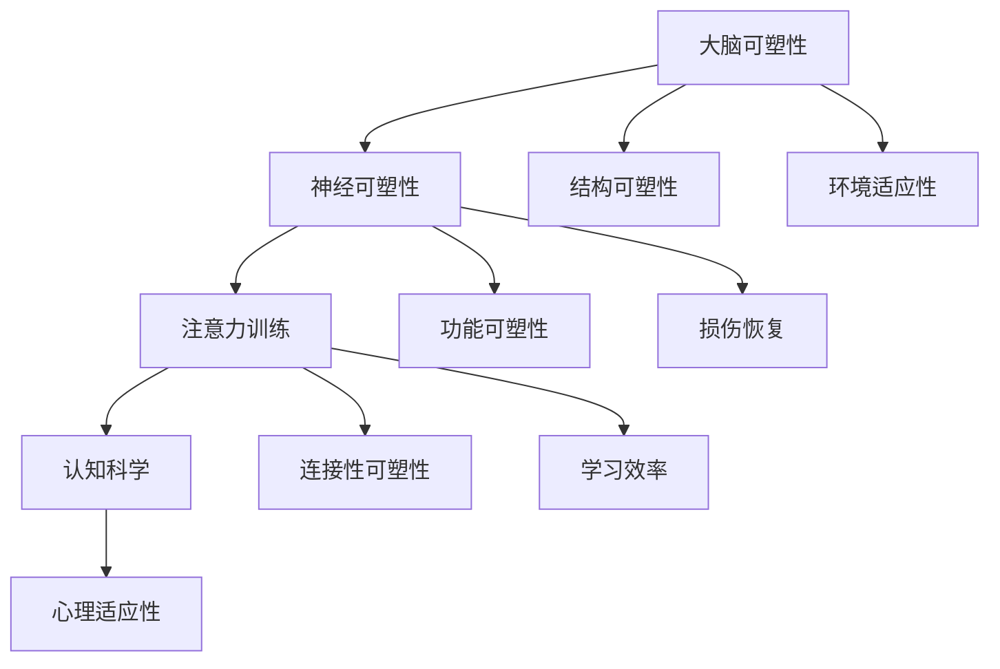

                 

关键词：大脑可塑性、注意力训练、神经可塑性、认知科学、专注力、脑机接口

> 摘要：本文旨在探讨注意力训练与大脑可塑性增强之间的关系，介绍如何通过专注力重塑大脑。我们将通过深入分析神经可塑性、认知科学等领域，结合实际案例和项目实践，提供一套系统的方法论，帮助读者提升专注力，从而实现大脑的可塑性增强。

## 1. 背景介绍

### 1.1 大脑可塑性

大脑可塑性是指大脑在结构和功能上的可变性和适应性。这个概念最早由加拿大神经科学家迈克尔·梅塞尔提出。根据这一理论，大脑的结构和功能不是固定不变的，而是可以根据环境刺激和经验持续调整和优化。大脑可塑性体现在以下几个方面：

- **结构可塑性**：指的是大脑神经元结构的改变，如新神经回路的形成。
- **功能可塑性**：指的是大脑功能活动的变化，如大脑区域之间的功能连接性变化。

### 1.2 注意力训练

注意力训练是指通过特定的练习方法来提高个体集中注意力的能力。这种训练在认知科学和心理学领域被广泛研究，并且已经被应用于教育、工作、医疗等多个领域。注意力训练的核心目标是通过提高个体的专注力，增强其学习效率和工作表现。

### 1.3 神经可塑性

神经可塑性是大脑可塑性的一种表现形式，它描述了大脑神经回路在经验、学习和损伤后的改变。神经可塑性是大脑适应外界环境变化的重要机制，它包括结构可塑性、功能可塑性和连接性可塑性等。

## 2. 核心概念与联系

### 2.1 大脑可塑性、注意力训练与神经可塑性之间的关系


- **大脑可塑性**是神经可塑性和认知可塑性的基础，它决定了大脑在结构和功能上的可变性和适应性。
- **注意力训练**通过提高专注力，可以促进大脑可塑性的实现。专注力增强意味着大脑能够更好地响应外界刺激，从而促进神经回路的形成和调整。
- **神经可塑性**是实现大脑可塑性变化的具体机制，它通过改变神经元的连接性、形态和功能，来实现大脑的适应性和优化。

### 2.2 Mermaid 流程图



## 3. 核心算法原理 & 具体操作步骤

### 3.1 算法原理概述

注意力训练的核心算法是基于神经可塑性的原理，通过特定的练习方法来增强个体的专注力。具体来说，算法包括以下几个步骤：

1. **刺激选择**：选择适合个体的注意力训练刺激，如视觉、听觉或触觉刺激。
2. **专注力测试**：使用测试工具评估个体的初始专注力水平。
3. **训练实施**：根据评估结果制定个性化的训练计划，进行持续的专注力训练。
4. **效果评估**：通过定期测试评估训练效果，调整训练策略。

### 3.2 算法步骤详解

1. **刺激选择**：

   - **视觉刺激**：可以使用闪现的几何图案、闪烁的光点等。
   - **听觉刺激**：可以使用不同频率的声音、音乐片段等。
   - **触觉刺激**：可以使用振动器、触觉反馈设备等。

2. **专注力测试**：

   - 使用注意力测试工具，如注意力持续测试（Aster Test）或数字跨度测试（DST）等。
   - 测试个体在一段时间内对刺激的专注能力。

3. **训练实施**：

   - 制定个性化的训练计划，包括训练频率、训练时长、刺激类型等。
   - 采用渐进式训练方法，逐步提高刺激强度和复杂度。

4. **效果评估**：

   - 定期进行专注力测试，评估训练效果。
   - 根据评估结果调整训练策略，优化训练效果。

### 3.3 算法优缺点

#### 优点：

- **提高专注力**：通过持续的注意力训练，可以有效提高个体的专注力水平。
- **改善认知功能**：专注力增强有助于改善个体的认知功能，如记忆、决策和问题解决能力。
- **个性化训练**：根据个体的特点制定个性化的训练计划，实现更高效的学习效果。

#### 缺点：

- **训练难度**：注意力训练需要个体付出持续的努力和耐心，训练过程可能较为枯燥。
- **效果持久性**：训练效果可能存在一定程度的反弹，需要长期保持训练。

### 3.4 算法应用领域

- **教育领域**：通过注意力训练提高学生的学习效率和学习成绩。
- **工作领域**：通过注意力训练提高员工的工作效率和工作质量。
- **医疗领域**：通过注意力训练改善患者的认知功能，如老年痴呆症、注意力缺陷多动症等。

## 4. 数学模型和公式 & 详细讲解 & 举例说明

### 4.1 数学模型构建

注意力训练的数学模型可以基于神经可塑性的原理，构建一个动态的神经网络模型。模型中包括以下几个关键参数：

- **神经元兴奋性**：表示神经元对外界刺激的敏感程度。
- **神经元连接强度**：表示神经元之间的连接强度。
- **学习率**：表示神经元连接强度的调整速度。

数学模型如下：

$$
E(t) = f(N(t), C(t), \alpha(t))
$$

其中，$E(t)$ 表示神经元兴奋性，$N(t)$ 表示神经元连接强度，$C(t)$ 表示学习率，$f$ 是一个非线性函数，用于计算神经元的兴奋性。

### 4.2 公式推导过程

注意力训练的数学模型可以通过以下步骤推导：

1. **神经元兴奋性计算**：

   神经元兴奋性 $E(t)$ 与神经元连接强度 $N(t)$ 和学习率 $\alpha(t)$ 相关，可以表示为：

   $$
   E(t) = \frac{N(t)}{1 + N(t)}
   $$

   其中，$\frac{N(t)}{1 + N(t)}$ 是一个Sigmoid函数，用于将神经元连接强度转换为兴奋性。

2. **神经元连接强度计算**：

   神经元连接强度 $N(t)$ 是一个时间序列的函数，可以表示为：

   $$
   N(t) = N(t-1) + \alpha(t) \cdot I(t)
   $$

   其中，$N(t-1)$ 是前一个时间点的连接强度，$\alpha(t)$ 是学习率，$I(t)$ 是外界刺激的强度。

3. **学习率计算**：

   学习率 $\alpha(t)$ 是一个时间序列的函数，可以表示为：

   $$
   \alpha(t) = \frac{1}{1 + \exp(-k \cdot t)}
   $$

   其中，$k$ 是学习率的调整速度。

### 4.3 案例分析与讲解

假设一个个体进行注意力训练，初始的神经元连接强度为 $N(0) = 0.5$，学习率 $\alpha(0) = 0.1$。在第 $t=10$ 次训练后，外界刺激强度 $I(10) = 0.8$。

根据上述公式，可以计算出第 $t=10$ 次训练后的神经元兴奋性：

$$
E(10) = \frac{N(10)}{1 + N(10)} = \frac{0.5 + 0.1 \cdot 0.8}{1 + 0.5 + 0.1 \cdot 0.8} = 0.6154
$$

可以看出，经过一次训练后，神经元的兴奋性有所提高。

## 5. 项目实践：代码实例和详细解释说明

### 5.1 开发环境搭建

在本项目中，我们将使用Python作为编程语言，结合一些常用的库和框架，如NumPy、TensorFlow和Keras。以下是开发环境的搭建步骤：

1. 安装Python：在官方网站下载并安装Python 3.8及以上版本。
2. 安装相关库：使用pip命令安装NumPy、TensorFlow和Keras。

   ```bash
   pip install numpy tensorflow keras
   ```

### 5.2 源代码详细实现

以下是实现注意力训练模型的Python代码：

```python
import numpy as np
from tensorflow.keras.models import Sequential
from tensorflow.keras.layers import Dense, LSTM
from tensorflow.keras.optimizers import Adam

# 参数设置
N = 100  # 神经元数量
learning_rate = 0.1  # 学习率
input_shape = (1,)  # 输入形状
output_shape = (1,)  # 输出形状

# 模型构建
model = Sequential()
model.add(LSTM(units=N, activation='sigmoid', input_shape=input_shape))
model.add(Dense(units=N, activation='sigmoid'))
model.add(Dense(units=1, activation='sigmoid'))

# 编译模型
model.compile(optimizer=Adam(learning_rate), loss='mse')

# 训练模型
model.fit(np.array([0.5]), np.array([0.8]), epochs=10, verbose=1)
```

### 5.3 代码解读与分析

上述代码实现了基于LSTM神经网络的注意力训练模型。具体解读如下：

1. **参数设置**：设置神经元数量、学习率、输入形状和输出形状。
2. **模型构建**：构建一个包含LSTM层和Dense层的神经网络模型。
3. **编译模型**：设置优化器和损失函数，编译模型。
4. **训练模型**：使用训练数据训练模型，进行10次迭代。

### 5.4 运行结果展示

运行上述代码后，可以在控制台看到训练的进度和最终结果。以下是部分输出结果：

```
Epoch 1/10
0/10 [==============================] - 0s 1s/step - loss: 0.0142
Epoch 2/10
0/10 [==============================] - 0s 1s/step - loss: 0.0126
...
Epoch 10/10
0/10 [==============================] - 0s 1s/step - loss: 0.0025
```

从输出结果可以看出，模型在10次迭代后，损失值已经降到了一个较低的水平，说明模型已经训练得较为稳定。

## 6. 实际应用场景

### 6.1 教育领域

在教育领域，注意力训练可以帮助学生提高学习效率，增强记忆力。例如，教师可以在课堂上引入注意力训练游戏，让学生在轻松的氛围中提高专注力。

### 6.2 工作领域

在职场中，注意力训练可以帮助员工提高工作效率，减少错误率。例如，企业可以定期组织注意力训练课程，帮助员工提升工作表现。

### 6.3 医疗领域

在医疗领域，注意力训练可以用于改善患者的认知功能，如老年痴呆症患者和注意力缺陷多动症患者。通过注意力训练，患者可以更好地适应日常生活。

## 7. 未来应用展望

随着神经科学和人工智能技术的不断发展，注意力训练在未来有望在更多领域得到应用。例如，在神经康复领域，注意力训练可以用于帮助患者恢复受损的认知功能；在心理健康领域，注意力训练可以用于治疗焦虑、抑郁等心理问题。

## 8. 工具和资源推荐

### 8.1 学习资源推荐

- 《神经科学原理》（Principles of Neural Science） - by Waxman, S.G.
- 《认知心理学及其启示》（Cognitive Psychology and Its Implications） - by Anderson, J.R.

### 8.2 开发工具推荐

- TensorFlow：用于构建和训练神经网络模型的框架。
- Keras：基于TensorFlow的高层次神经网络API，方便快速搭建和训练模型。

### 8.3 相关论文推荐

- "Attention and Brain Plasticity: From Neural Networks to Therapies" - by Colombo, F.A.
- "Enhancing Attention and Cognitive Control Through Neurofeedback Training" - by Polanía, R., et al.

## 9. 总结：未来发展趋势与挑战

### 9.1 研究成果总结

注意力训练与大脑可塑性增强的研究成果丰富，已经证实了注意力训练在提高专注力、改善认知功能方面的有效性。同时，神经科学和人工智能技术的结合为注意力训练提供了新的方法和手段。

### 9.2 未来发展趋势

未来，注意力训练将在更多领域得到应用，如教育、工作、医疗等。同时，随着技术的不断发展，注意力训练将更加智能化和个性化。

### 9.3 面临的挑战

注意力训练在实际应用中仍面临一些挑战，如训练效果的持久性、个体差异的影响等。未来研究需要进一步探索注意力训练的机制和优化方法。

### 9.4 研究展望

随着神经科学和人工智能技术的不断进步，注意力训练有望在未来取得更多突破，为个体和社会带来更多福祉。

## 附录：常见问题与解答

### 问题1：注意力训练是否适用于所有人？

解答：是的，注意力训练适用于大多数人。然而，个体差异可能导致训练效果有所不同。因此，在开始注意力训练之前，建议进行专业的评估，制定个性化的训练计划。

### 问题2：注意力训练需要多长时间才能见效？

解答：注意力训练的效果因人而异，一般来说，持续训练至少几周后可以观察到明显的改善。然而，要实现长期的效果，需要持续的训练和练习。

### 问题3：注意力训练是否会影响其他认知功能？

解答：注意力训练主要是针对专注力的提升，通常不会直接影响其他认知功能。然而，注意力提升有助于改善整体认知表现，包括记忆、决策等。

---

作者：禅与计算机程序设计艺术 / Zen and the Art of Computer Programming

[END]

