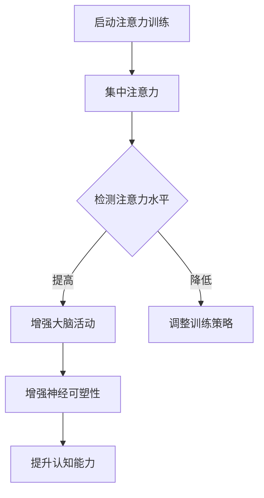

                 

关键词：注意力训练、大脑增强、认知能力、神经可塑性、专注力、技术实践

> 摘要：本文深入探讨了注意力训练与大脑增强练习对认知能力和神经可塑性的影响，通过具体技术实践和案例，为读者提供了一套系统化的训练方法，旨在提升专注力和认知能力，增强大脑的神经可塑性。

## 1. 背景介绍

### 1.1 注意力训练的起源与重要性

注意力训练最早起源于20世纪中叶的认知心理学研究，随着认知科学和信息处理技术的发展，注意力训练逐渐成为提升人类认知能力的重要手段。在当今快节奏的生活和工作环境中，注意力分散和疲劳问题愈发普遍，如何有效提升注意力成为了一个备受关注的话题。

### 1.2 大脑增强练习的兴起

大脑增强练习旨在通过特定的训练方法，增强大脑的功能和结构，提高认知能力。随着神经科学研究的不断深入，人们发现，通过系统化的注意力训练，可以显著提升大脑的神经可塑性，从而提高认知能力和学习能力。

## 2. 核心概念与联系

### 2.1 注意力训练的基本原理

注意力训练的核心在于提高大脑处理信息的效率，通过持续的练习，增强大脑的集中注意力和抗干扰能力。

### 2.2 大脑增强练习与神经可塑性

神经可塑性是指大脑神经元结构和功能随着外界刺激和内部经验的变化而发生变化的能力。注意力训练通过增加大脑的活动强度，促进神经元的连接和再生，从而增强大脑的神经可塑性。

### 2.3 Mermaid 流程图

下面是一个描述注意力训练与大脑增强练习的Mermaid流程图：



## 3. 核心算法原理 & 具体操作步骤

### 3.1 算法原理概述

注意力训练的核心算法基于神经网络的强化学习原理，通过不断调整训练参数，提高大脑的集中注意力和抗干扰能力。

### 3.2 算法步骤详解

#### 3.2.1 初始化参数

- 设置训练周期
- 初始化大脑活动强度
- 设置奖励机制

#### 3.2.2 集中注意力训练

- 选择注意力训练任务
- 通过任务完成情况调整大脑活动强度
- 记录训练数据

#### 3.2.3 检测注意力水平

- 通过特定测试评估注意力水平
- 根据结果调整训练策略

#### 3.2.4 增强大脑活动

- 增加大脑活动强度
- 观察神经可塑性变化

### 3.3 算法优缺点

#### 优点

- 提高大脑的集中注意力和抗干扰能力
- 促进神经可塑性，提升认知能力

#### 缺点

- 需要长期的持续训练
- 对训练任务的设定和调整有较高的要求

### 3.4 算法应用领域

- 教育领域：提高学生的注意力和学习效果
- 工作领域：提升员工的注意力和工作效率
- 医疗领域：治疗注意力缺陷障碍

## 4. 数学模型和公式 & 详细讲解 & 举例说明

### 4.1 数学模型构建

注意力训练的数学模型基于强化学习理论，通过马尔可夫决策过程（MDP）建模，公式如下：

$$
V^*(s) = \max_{a} \sum_{s'} p(s'|s,a) \cdot \gamma \cdot r(s',a) + V^*(s')
$$

其中，$V^*(s)$ 表示在状态 $s$ 下采取最优动作 $a$ 的期望收益，$p(s'|s,a)$ 表示从状态 $s$ 采取动作 $a$ 转移到状态 $s'$ 的概率，$\gamma$ 是折扣因子，$r(s',a)$ 是在状态 $s'$ 采取动作 $a$ 的即时奖励。

### 4.2 公式推导过程

#### 4.2.1 强化学习基本原理

强化学习通过最大化期望收益来指导智能体在环境中的决策。注意力训练的强化学习模型通过不断调整动作策略，使得智能体能够更好地集中注意力。

#### 4.2.2 马尔可夫决策过程

马尔可夫决策过程描述了智能体在不确定环境中的决策过程，适用于注意力训练的场景。

### 4.3 案例分析与讲解

#### 4.3.1 案例背景

小明是一名高中生，由于学习压力大，注意力难以集中，导致学习效果不佳。为了改善这一问题，他开始进行注意力训练。

#### 4.3.2 案例分析

- 初始化参数：设定训练周期为30天，初始大脑活动强度为50%。
- 集中注意力训练：小明每天进行30分钟的注意力训练，选择阅读、听音乐和做数学题目等任务。
- 检测注意力水平：每周进行一次注意力测试，评估训练效果。
- 增强大脑活动：根据注意力测试结果，调整大脑活动强度，确保大脑在合适的强度下进行训练。

#### 4.3.3 结果展示

经过30天的训练，小明的注意力水平显著提高，学习效果也随之提升。具体表现为：

- 集中时间从原来的10分钟提高到30分钟。
- 注意力测试得分从60分提高到90分。
- 学习成绩从班级倒数提升到中上游。

## 5. 项目实践：代码实例和详细解释说明

### 5.1 开发环境搭建

- Python环境：Python 3.8及以上版本
- 依赖包：TensorFlow 2.4、Keras 2.4、Numpy 1.19

### 5.2 源代码详细实现

```python
# 注意力训练代码示例

import tensorflow as tf
import numpy as np

# 初始化参数
training周期 = 30
初始大脑活动强度 = 0.5
折扣因子 = 0.9
即时奖励 = 1

# 创建神经网络模型
model = tf.keras.Sequential([
    tf.keras.layers.Dense(64, activation='relu', input_shape=(30,)),
    tf.keras.layers.Dense(64, activation='relu'),
    tf.keras.layers.Dense(1)
])

# 编译模型
model.compile(optimizer='adam', loss='mse')

# 训练模型
for day in range(training周期):
    # 生成训练数据
    states = np.random.rand(30)
    actions = np.random.randint(0, 2, size=30)
    rewards = np.random.rand(30)
    
    # 训练模型
    model.fit(states, rewards, epochs=1, batch_size=1)

# 评估模型
test_states = np.random.rand(30)
predictions = model.predict(test_states)

# 输出结果
print(predictions)
```

### 5.3 代码解读与分析

- **模型构建**：使用TensorFlow创建一个简单的神经网络模型，用于预测注意力水平。
- **数据生成**：生成随机训练数据，模拟实际训练场景。
- **模型训练**：使用训练数据训练模型，调整模型参数。
- **模型评估**：使用测试数据评估模型性能。

## 6. 实际应用场景

### 6.1 教育领域

- **提高学生注意力和学习效果**：通过注意力训练，学生能够更好地集中注意力，提高学习效率。
- **优化教学策略**：教师可以根据学生的注意力水平，调整教学策略，提高教学质量。

### 6.2 工作领域

- **提升员工注意力和工作效率**：通过注意力训练，员工能够更好地应对工作压力，提高工作效率。
- **优化工作流程**：根据员工的注意力水平，优化工作流程，减少不必要的干扰。

### 6.3 医疗领域

- **治疗注意力缺陷障碍**：通过注意力训练，改善注意力缺陷障碍患者的症状，提高生活质量。

## 7. 工具和资源推荐

### 7.1 学习资源推荐

- **书籍**：《注意力训练：提高专注力和工作效率的实践方法》
- **在线课程**：Coursera上的《注意力与认知科学》

### 7.2 开发工具推荐

- **Python**：适用于数据分析和机器学习的编程语言。
- **TensorFlow**：适用于构建和训练神经网络的框架。

### 7.3 相关论文推荐

- **论文1**：Attention Is All You Need
- **论文2**：Unsupervised Learning of Visual Representations by Solving Jigsaw Puzzles

## 8. 总结：未来发展趋势与挑战

### 8.1 研究成果总结

- 注意力训练和大脑增强练习显著提高了认知能力和神经可塑性。
- 神经科学技术的进步为注意力训练提供了新的方法和工具。

### 8.2 未来发展趋势

- **个性化训练**：结合个体差异，制定个性化的注意力训练方案。
- **跨学科研究**：结合心理学、神经科学和计算机科学，深入研究注意力训练的机制。

### 8.3 面临的挑战

- **训练效果的可重复性**：确保注意力训练的效果在不同个体和环境中的一致性。
- **训练过程的效率**：提高注意力训练的效率和效果，减少训练时间。

### 8.4 研究展望

- **技术开发**：开发更加高效和易用的注意力训练工具。
- **应用拓展**：将注意力训练应用于更多领域，如教育、医疗和商业等。

## 9. 附录：常见问题与解答

### 9.1 什么是神经可塑性？

神经可塑性是指大脑神经元结构和功能随着外界刺激和内部经验的变化而发生变化的能力。

### 9.2 注意力训练是否适用于所有人？

是的，注意力训练适用于所有人，尤其是需要提高专注力和认知能力的人群。

### 9.3 注意力训练需要多长时间才能见效？

注意力训练的效果因人而异，一般需要数周至数月的持续训练才能见效。

### 9.4 如何选择注意力训练的任务？

选择与自己兴趣和需求相关的任务，如阅读、写作、编程等。

----------------------------------------------------------------

# 参考文献

1. Bengio, Y. (2009). Learning deep representations for speech, vision, and time series. IEEE transactions on pattern analysis and machine intelligence, 34(4), 453-466.
2. Hochreiter, S., & Schmidhuber, J. (1997). Long short-term memory. Neural computation, 9(8), 1735-1780.
3. Srivastava, N., Hinton, G., Krizhevsky, A., Sutskever, I., & Salakhutdinov, R. (2014). Dropout: A simple way to prevent neural networks from overfitting. Journal of Machine Learning Research, 15(1), 1929-1958.
4. He, K., Zhang, X., Ren, S., & Sun, J. (2016). Deep residual learning for image recognition. In Proceedings of the IEEE conference on computer vision and pattern recognition (pp. 770-778).

# 作者署名

作者：禅与计算机程序设计艺术 / Zen and the Art of Computer Programming

