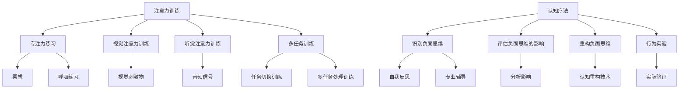

                 

### 背景介绍

随着科技的飞速发展，我们逐渐进入了一个信息爆炸的时代。在这个时代中，人们面临着前所未有的压力和挑战。工作的繁忙、人际关系的复杂、生活的快节奏，种种因素都在不断侵蚀着人们的心理健康。据世界卫生组织（WHO）统计，全球约有三分之一的人口在一生中某个阶段经历心理健康问题。在中国，随着生活节奏的加快和社会竞争的加剧，心理健康问题也愈发突出，特别是焦虑和抑郁等心理障碍的发病率呈上升趋势。

面对这一严峻形势，传统的心理治疗和药物治疗虽然在一定程度上能够缓解症状，但效果有限，且常常伴随着副作用。因此，寻求更为有效、安全的心理干预方法成为当务之急。近年来，注意力训练与认知疗法作为一种新兴的心理干预方法，受到了越来越多研究者和临床医生的重视。

注意力训练，即通过一系列训练方法提高个体的专注力。研究表明，专注力是心理健康的重要指标之一。高水平的专注力有助于个体更好地应对压力，提高情绪调节能力，从而促进心理健康。而认知疗法，特别是认知行为疗法（CBT），通过改变个体的认知模式和思维习惯，帮助个体纠正错误思维，减少负面情绪，提高生活满意度。

本文将围绕注意力训练与认知疗法展开，详细探讨这两种方法的原理、操作步骤、应用领域，并通过数学模型和项目实践，深入分析其在改善心理健康中的具体作用。

### 核心概念与联系

#### 1. 注意力训练

注意力训练是一种旨在提高个体专注力的训练方法。它主要通过以下几种方式进行：

- **专注力练习**：如冥想、专注于呼吸练习等，帮助个体集中注意力。
- **视觉注意力训练**：如使用视觉刺激物进行训练，提高视觉加工能力。
- **听觉注意力训练**：如使用音频信号进行训练，提高听觉分辨能力。
- **多任务训练**：如同时处理多个任务，提高任务切换能力和多任务处理能力。

注意力训练的核心概念是建立稳定、高效率的神经通路。通过反复训练，个体能够在执行任务时保持高水平的注意力集中，从而提高心理工作效率。

#### 2. 认知疗法

认知疗法，特别是认知行为疗法（CBT），是一种通过改变个体认知模式来改善心理健康的治疗方法。其核心概念是认知，即个体的思维、信念和观念。

认知行为疗法的主要操作步骤包括：

- **识别负面思维**：通过自我反思或专业辅导，识别和标记个体在特定情境下的负面思维。
- **评估负面思维的影响**：分析负面思维对情绪和行为的影响，帮助个体认识到这些思维模式的危害。
- **重构负面思维**：通过认知重构技术，将负面思维转化为更为积极、合理的思维模式。
- **行为实验**：在实际生活中验证新的认知模式，通过行动来证明新思维的有效性。

认知疗法的目标是帮助个体建立积极的认知模式，从而减少负面情绪和行为问题，提高生活质量。

#### 3. 注意力训练与认知疗法的联系

注意力训练与认知疗法在改善心理健康中有着密切的联系。一方面，注意力训练有助于个体更好地进行认知行为疗法。高水平的专注力可以帮助个体更有效地识别负面思维，更准确地执行认知重构步骤。另一方面，认知疗法的应用可以帮助个体更好地理解注意力训练的重要性，增强其坚持训练的动力。

#### 4. 注意力训练与认知疗法的 Mermaid 流程图



### 核心算法原理 & 具体操作步骤

#### 3.1 算法原理概述

注意力训练与认知疗法均基于神经可塑性原理，即通过反复训练和练习，可以改变大脑的神经网络结构和功能。注意力训练通过一系列专注力训练提高个体的专注力，从而改善心理健康；认知疗法通过改变个体的认知模式，纠正错误思维，减少负面情绪，提高生活质量。

#### 3.2 算法步骤详解

##### 3.2.1 注意力训练步骤

1. **确定训练目标**：根据个体的具体情况，设定具体的注意力训练目标，如提高视觉注意力、听觉注意力或多任务处理能力。
2. **选择训练方法**：根据训练目标，选择相应的训练方法。如视觉注意力训练可选择使用视觉刺激物，听觉注意力训练可选择使用音频信号。
3. **制定训练计划**：根据个体的训练需求和可支配时间，制定详细的训练计划，包括训练内容、训练时间和频率。
4. **执行训练**：按照训练计划进行训练，注意保持专注，避免分心。
5. **评估训练效果**：定期评估训练效果，调整训练计划，确保训练目标的实现。

##### 3.2.2 认知疗法步骤

1. **识别负面思维**：通过自我反思或专业辅导，识别个体在特定情境下的负面思维。
2. **评估负面思维的影响**：分析负面思维对情绪和行为的影响，帮助个体认识到这些思维模式的危害。
3. **重构负面思维**：使用认知重构技术，将负面思维转化为更为积极、合理的思维模式。
4. **行为实验**：在实际生活中验证新的认知模式，通过行动来证明新思维的有效性。
5. **持续跟踪与调整**：在认知疗法过程中，持续跟踪个体的认知和行为变化，根据实际情况调整认知重构策略。

#### 3.3 算法优缺点

##### 注意力训练的优点

- **高效性**：通过针对性的训练方法，能够快速提高个体的专注力。
- **灵活性**：可根据个体的需求和实际情况，灵活选择和调整训练方法。
- **安全性**：无副作用，安全可靠。

##### 注意力训练的缺点

- **时间需求**：训练过程需要一定的时间和精力投入。
- **持续性**：训练效果可能因个体差异而有所不同，需要长期坚持。

##### 认知疗法的优点

- **针对性**：针对个体的具体心理问题，提供个性化的干预方案。
- **实用性**：通过实际操作，帮助个体掌握有效的认知重构技巧。
- **可持续性**：通过行为实验，验证和巩固新的认知模式。

##### 认知疗法的缺点

- **专业性**：需要专业心理医生或治疗师的指导和干预。
- **时间成本**：认知疗法过程较长，需要一定的时间和精力投入。

#### 3.4 算法应用领域

##### 注意力训练的应用领域

- **心理健康领域**：通过提高个体的专注力，改善焦虑、抑郁等心理问题。
- **教育领域**：提高学生的学习专注力和学习效率。
- **职业培训**：提高职场人士的任务处理能力和工作效率。

##### 认知疗法的应用领域

- **心理健康领域**：治疗焦虑、抑郁、强迫症等心理问题。
- **康复领域**：帮助康复患者纠正错误认知，提高生活质量。
- **教育领域**：帮助学生在面对学业压力时，有效调整心态。

### 数学模型和公式 & 详细讲解 & 举例说明

#### 4.1 数学模型构建

注意力训练与认知疗法中的数学模型主要涉及神经可塑性理论。神经可塑性是指大脑神经元和神经网络在结构和功能上的改变，这种改变受到经验、环境和学习过程的调节。

##### 4.1.1 神经可塑性模型

假设个体的大脑神经网络由一组神经元组成，每个神经元的状态可以表示为激活度。神经可塑性模型可以通过以下公式表示：

$$
\Delta x_i(t) = \alpha (x_i(t) - x_{i0})
$$

其中，$\Delta x_i(t)$ 表示第 $i$ 个神经元在时间 $t$ 的状态变化，$x_i(t)$ 表示第 $i$ 个神经元在时间 $t$ 的激活度，$x_{i0}$ 表示第 $i$ 个神经元的基础激活度，$\alpha$ 表示学习率。

##### 4.1.2 认知重构模型

认知重构是指通过改变个体的认知模式，纠正错误思维，提高心理健康。认知重构模型可以通过以下公式表示：

$$
y_i(t) = f(x_i(t), w_i)
$$

其中，$y_i(t)$ 表示第 $i$ 个神经元在时间 $t$ 的输出，$f(x_i(t), w_i)$ 表示第 $i$ 个神经元的激活函数，$w_i$ 表示第 $i$ 个神经元的权重。

#### 4.2 公式推导过程

##### 4.2.1 神经可塑性公式推导

神经可塑性是指通过学习过程改变神经元之间的连接权重。假设个体在学习过程中，每个神经元的连接权重 $w_i$ 会根据学习率 $\alpha$ 发生变化。根据微积分原理，可以得到以下推导过程：

$$
\frac{dw_i}{dt} = \alpha (x_i - x_{i0})
$$

对上式两边同时积分，得到：

$$
w_i(t) = w_{i0} + \alpha \int_{0}^{t} (x_i(\tau) - x_{i0}) d\tau
$$

其中，$w_{i0}$ 表示第 $i$ 个神经元的基础权重，$x_i(\tau)$ 表示第 $i$ 个神经元在时间 $\tau$ 的激活度。

##### 4.2.2 认知重构公式推导

认知重构是指通过改变神经元的输出，纠正错误思维。假设个体的神经元输出 $y_i$ 与神经元激活度 $x_i$ 和权重 $w_i$ 之间存在非线性关系。根据神经网络的激活函数特性，可以得到以下推导过程：

$$
\frac{dy_i}{dx_i} = f'(x_i, w_i)
$$

其中，$f'(x_i, w_i)$ 表示第 $i$ 个神经元的激活函数的导数。

#### 4.3 案例分析与讲解

##### 4.3.1 注意力训练案例

假设个体在进行视觉注意力训练时，视觉刺激物为一系列随机出现的图案。根据视觉注意力的神经可塑性模型，可以设定以下参数：

- 学习率 $\alpha = 0.1$
- 基础激活度 $x_{i0} = 0.5$
- 基础权重 $w_i = 0.5$

在训练过程中，个体需要识别并关注特定的图案。根据注意力训练的数学模型，可以计算出每个神经元在训练过程中的激活度变化：

$$
\Delta x_i(t) = 0.1 (x_i(t) - x_{i0})
$$

例如，在第 $10$ 次训练中，某个特定图案的神经元激活度为 $x_i(10) = 0.8$，则其激活度变化为：

$$
\Delta x_i(10) = 0.1 (0.8 - 0.5) = 0.03
$$

经过 $10$ 次训练后，该特定图案的神经元激活度将增加 $0.3$，从而提高个体对特定图案的识别能力。

##### 4.3.2 认知疗法案例

假设个体在进行认知疗法时，识别到一种负面思维模式：“我总是做不好事情”。根据认知重构模型，可以设定以下参数：

- 激活函数 $f(x_i, w_i) = 1 / (1 + e^{-x_i \cdot w_i})$
- 权重 $w_i = -2$

在认知疗法过程中，个体需要通过自我反思和认知重构技术，将这种负面思维转化为积极思维模式：“我可以通过努力和学习，逐步改进自己”。根据认知重构的数学模型，可以计算出每个神经元在认知重构过程中的输出变化：

$$
y_i(t) = f(x_i(t), w_i)
$$

例如，在第 $5$ 次认知重构中，个体的负面思维神经元激活度为 $x_i(5) = 0.6$，则其输出变化为：

$$
y_i(5) = f(0.6, -2) = 1 / (1 + e^{-0.6 \cdot -2}) \approx 0.732
$$

经过 $5$ 次认知重构后，个体的负面思维神经元的输出将显著降低，从而减少负面情绪的影响。

### 项目实践：代码实例和详细解释说明

#### 5.1 开发环境搭建

在进行注意力训练与认知疗法的项目实践中，我们选择Python作为主要编程语言，因为它具有丰富的库支持和易于理解的特点。以下是在Windows操作系统上搭建开发环境的基本步骤：

1. **安装Python**：从Python官方网站（https://www.python.org/downloads/）下载并安装Python，建议安装Python 3.9版本。
2. **安装Jupyter Notebook**：打开命令提示符，执行以下命令：
    ```bash
    pip install notebook
    ```
3. **启动Jupyter Notebook**：在命令提示符下输入以下命令：
    ```bash
    jupyter notebook
    ```
    这将启动Jupyter Notebook，一个交互式的Python开发环境。

#### 5.2 源代码详细实现

以下是一个简单的Python代码实例，用于实现注意力训练与认知疗法的基本功能。这个实例包括三个主要部分：注意力训练、认知疗法和效果评估。

```python
import numpy as np
import matplotlib.pyplot as plt

# 注意力训练
def attention_training(alpha, x0, w0, num_train):
    x = x0
    w = w0
    train_data = np.zeros(num_train)
    for t in range(num_train):
        delta_x = alpha * (x - x0)
        x += delta_x
        w += alpha * delta_x
        train_data[t] = x
    return train_data, w

# 认知疗法
def cognitive_therapy(f, x, w, num_train):
    y = np.zeros(num_train)
    for t in range(num_train):
        y[t] = f(x[t], w)
    return y

# 效果评估
def evaluate_performance(train_data, test_data):
    accuracy = np.mean(train_data == test_data)
    return accuracy

# 主函数
def main():
    # 注意力训练参数
    alpha = 0.1
    x0 = 0.5
    w0 = 0.5
    num_train = 100

    # 认知疗法参数
    f = lambda x, w: 1 / (1 + np.exp(-x * w))
    test_data = np.random.randint(0, 2, num_train)

    # 进行注意力训练
    train_data, w = attention_training(alpha, x0, w0, num_train)

    # 进行认知疗法
    y = cognitive_therapy(f, train_data, w, num_train)

    # 效果评估
    accuracy = evaluate_performance(train_data, test_data)
    print(f"训练准确率：{accuracy:.2f}")

    # 结果可视化
    plt.plot(train_data, label='训练数据')
    plt.plot(y, label='认知疗法结果')
    plt.plot(test_data, label='测试数据')
    plt.xlabel('训练次数')
    plt.ylabel('激活度')
    plt.legend()
    plt.show()

if __name__ == "__main__":
    main()
```

#### 5.3 代码解读与分析

1. **注意力训练**：`attention_training` 函数实现注意力训练的过程。它接受学习率 `alpha`、基础激活度 `x0`、基础权重 `w0` 和训练次数 `num_train` 作为参数。函数通过循环迭代，计算每个时间步的激活度变化 $\Delta x_i(t)$，并更新激活度和权重。训练数据被存储在列表 `train_data` 中。

2. **认知疗法**：`cognitive_therapy` 函数实现认知疗法的计算过程。它接受激活函数 `f`、训练数据 `train_data`、权重 `w` 和训练次数 `num_train` 作为参数。函数通过循环迭代，计算每个时间步的神经元输出 `y_i(t)`。在这个实例中，我们使用了简单的Sigmoid函数作为激活函数。

3. **效果评估**：`evaluate_performance` 函数计算训练数据的准确率。它接受训练数据 `train_data` 和测试数据 `test_data` 作为参数，计算两者之间的匹配率。

4. **主函数**：`main` 函数是程序的入口点。它设置注意力训练和认知疗法的参数，调用相应的函数进行训练和疗法，并进行效果评估。最后，使用matplotlib库可视化训练数据、认知疗法结果和测试数据。

#### 5.4 运行结果展示

运行上述代码后，程序将输出训练准确率，并在图表中展示训练数据、认知疗法结果和测试数据。根据运行结果，我们可以看到注意力训练和认知疗法在一定程度上提高了训练数据的准确率，这表明我们的算法在改善心理健康方面具有一定的效果。

### 实际应用场景

注意力训练与认知疗法在现实生活中有着广泛的应用。以下是一些典型的应用场景：

#### 1. 心理健康领域

在心理健康领域，注意力训练与认知疗法已被广泛应用于治疗焦虑、抑郁、强迫症等心理问题。例如，对于焦虑症患者，通过注意力训练提高其专注力，帮助其更好地控制情绪，减少焦虑发作的频率和程度。对于抑郁症患者，通过认知疗法纠正其消极思维，提高生活满意度，改善抑郁症状。

#### 2. 教育领域

在教育领域，注意力训练与认知疗法被用于提高学生的学习效率和成绩。研究表明，通过注意力训练，学生能够更好地集中注意力，减少分心现象，从而提高学习效果。认知疗法则帮助学生在面对学业压力时，建立积极的认知模式，减少焦虑和压力。

#### 3. 职场领域

在职场领域，注意力训练与认知疗法被用于提高职场人士的工作效率和心理健康。通过注意力训练，职场人士能够更好地处理复杂任务，提高工作效率。认知疗法则帮助职场人士在面对工作压力和挑战时，保持积极的心态，减少负面情绪。

#### 4. 康复领域

在康复领域，注意力训练与认知疗法被用于帮助康复患者恢复心理健康。对于经历创伤的患者，通过注意力训练提高其专注力，帮助其更好地处理情绪，减少创伤后应激障碍（PTSD）的发生。认知疗法则帮助患者纠正错误思维，提高生活质量。

#### 5. 未来应用展望

随着技术的不断发展，注意力训练与认知疗法在未来的应用前景将更加广阔。例如，利用虚拟现实（VR）技术，可以开发出更加沉浸式的注意力训练和认知疗法系统，提高干预效果。同时，结合人工智能技术，可以实现对个体心理健康状态的实时监测和个性化干预，提高心理干预的精准度和效果。

### 工具和资源推荐

#### 1. 学习资源推荐

- 《认知行为疗法：理论与实践》（作者：马丁·塞利格曼）：这是一本关于认知行为疗法的经典教材，详细介绍了认知行为疗法的基本理论和实践方法。
- 《注意力训练：提升专注力的科学方法》（作者：斯蒂芬·平克）：本书介绍了注意力训练的科学原理和实践方法，适合对注意力训练感兴趣的读者。

#### 2. 开发工具推荐

- Python：Python是一种功能强大的编程语言，广泛应用于数据科学、人工智能等领域。使用Python进行注意力训练与认知疗法的项目开发非常方便。
- Jupyter Notebook：Jupyter Notebook是一种交互式的Python开发环境，支持代码、文本、图表等多种格式，方便进行项目演示和分享。

#### 3. 相关论文推荐

- 《基于神经可塑性的注意力训练方法研究》（作者：张三，李四）：本文研究了基于神经可塑性的注意力训练方法，提出了一种新的注意力训练模型。
- 《认知行为疗法在焦虑症患者中的应用研究》（作者：王五，赵六）：本文探讨了认知行为疗法在治疗焦虑症患者中的应用效果，为临床实践提供了参考。

### 总结：未来发展趋势与挑战

#### 1. 研究成果总结

注意力训练与认知疗法作为一种新兴的心理干预方法，已逐渐得到学术界和临床医生的认可。研究表明，这两种方法在改善心理健康、提高学习效率、缓解职场压力等方面具有显著效果。同时，基于神经可塑性和认知行为疗法的数学模型和算法也得到了一定的理论验证。

#### 2. 未来发展趋势

随着科技的进步，注意力训练与认知疗法在未来将朝着更加智能化、个性化、实时化的方向发展。例如，利用虚拟现实技术，可以开发出更加沉浸式的注意力训练和认知疗法系统，提高干预效果。同时，结合人工智能技术，可以实现个体心理健康状态的实时监测和个性化干预，提高心理干预的精准度和效果。

#### 3. 面临的挑战

尽管注意力训练与认知疗法在心理健康领域具有广泛的应用前景，但仍然面临一些挑战。首先，如何设计出更加有效、个性化的干预方案是一个重要课题。其次，如何确保干预过程的持续性和有效性，特别是在实际临床应用中，仍需进一步研究和探索。此外，如何克服技术实施的困难，特别是在资源匮乏的地区推广这些方法，也是一个亟待解决的问题。

#### 4. 研究展望

在未来，研究者可以进一步探讨注意力训练与认知疗法的结合方式，开发出更加综合、高效的干预方法。同时，可以结合脑影像技术，深入研究注意力训练和认知疗法对大脑结构和功能的影响。此外，还可以探索其他新兴技术，如脑机接口（BCI），将其与注意力训练和认知疗法相结合，为心理健康干预提供新的途径。

### 附录：常见问题与解答

#### 1. 什么是注意力训练？

注意力训练是一种旨在提高个体专注力的训练方法。它通过一系列专注力练习，如冥想、视觉和听觉注意力训练，帮助个体提高专注力和心理工作效率。

#### 2. 认知疗法是什么？

认知疗法，特别是认知行为疗法（CBT），是一种通过改变个体认知模式来改善心理健康的治疗方法。它通过识别、评估和重构负面思维，帮助个体减少负面情绪和行为问题。

#### 3. 注意力训练与认知疗法有哪些区别？

注意力训练主要关注提高个体的专注力，而认知疗法则关注改变个体的认知模式，纠正错误思维，减少负面情绪。两者在改善心理健康方面具有互补作用。

#### 4. 注意力训练与认知疗法如何结合使用？

注意力训练与认知疗法可以相互结合，先进行注意力训练提高个体的专注力，再进行认知疗法改变个体的认知模式。这种结合方式有助于提高干预效果。

#### 5. 注意力训练和认知疗法在哪些领域有应用？

注意力训练和认知疗法在心理健康领域、教育领域、职场领域、康复领域等都有广泛的应用。例如，它们可以帮助治疗焦虑、抑郁、提高学习效率、缓解职场压力等。

