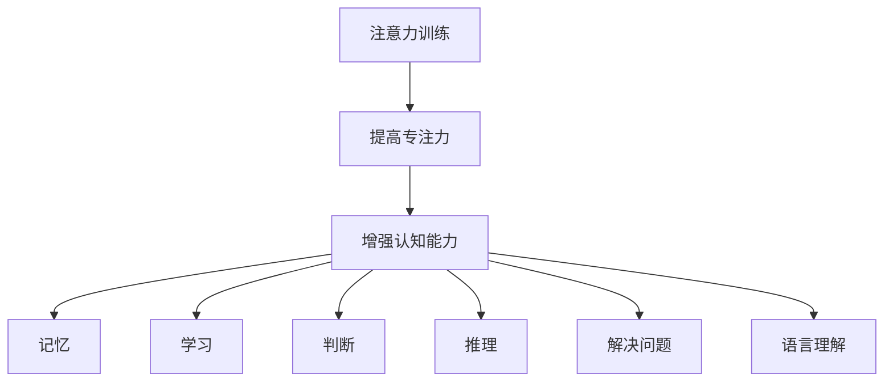

                 

关键词：注意力训练、专注力、认知能力、大脑、算法、数学模型、项目实践、应用场景、未来展望

> 摘要：本文探讨了注意力训练对大脑益处的影响，特别是在提高专注力和增强认知能力方面的作用。通过结合心理学、神经科学和计算机科学的理论与实践，本文详细分析了注意力训练的核心概念、算法原理、数学模型以及实际应用案例，为读者提供了一个全面而深入的视角。

## 1. 背景介绍

### 1.1 注意力训练的定义

注意力训练是一种通过特定的练习和技巧来增强大脑注意力的能力。它涉及对注意力的选择性控制、分配和维持，旨在提高个体在复杂环境中的专注度和工作效率。

### 1.2 专注力与认知能力的关系

专注力是认知能力的重要组成部分，它影响着记忆、学习、判断和问题解决等多个方面。高水平的专注力能够提高个体的认知负荷处理能力，从而增强整体认知功能。

### 1.3 认知能力的定义

认知能力是指大脑处理信息、理解和记忆的能力。它包括感知、记忆、判断、推理、解决问题和语言等多个方面。

## 2. 核心概念与联系

以下是一个简化的 Mermaid 流程图，描述了注意力训练、专注力、认知能力之间的关系：



## 3. 核心算法原理 & 具体操作步骤

### 3.1 算法原理概述

注意力训练的算法原理基于对大脑神经可塑性的理解和应用。通过一系列精心设计的练习，如分心控制、任务切换、目标识别等，可以逐步提高个体的专注力和认知能力。

### 3.2 算法步骤详解

#### 3.2.1 分心控制

分心控制练习旨在帮助个体识别和排除干扰因素。例如，可以使用逐步增加干扰强度的任务，使个体学会如何在存在干扰的情况下保持专注。

#### 3.2.2 任务切换

任务切换练习通过在不同任务之间快速切换，提高个体的注意分配能力。这种方法有助于个体在多任务环境下保持高效率。

#### 3.2.3 目标识别

目标识别练习专注于提高个体在复杂环境中识别和聚焦目标的能力。这可以通过模拟实际工作场景中的任务来实现。

### 3.3 算法优缺点

#### 优点

- **提高专注力**：通过持续的练习，个体可以显著提高其专注力。
- **增强认知能力**：专注力的提高有助于整体认知功能的增强。
- **适应性强**：算法可以根据个体差异进行调整，使其更加个性化和有效。

#### 缺点

- **时间需求**：有效的注意力训练需要持续的时间和精力投入。
- **适应性挑战**：对于某些个体，适应算法的特定练习可能存在一定的挑战。

### 3.4 算法应用领域

注意力训练算法在多个领域具有广泛的应用潜力，包括教育、职场、心理健康和老年认知障碍干预等。

## 4. 数学模型和公式 & 详细讲解 & 举例说明

### 4.1 数学模型构建

注意力训练的数学模型通常基于神经科学中的多巴胺奖励机制。以下是一个简化的模型构建示例：

$$
\text{注意力值} = f(\text{刺激强度}, \text{个体差异}, \text{训练时长})
$$

其中，$f$ 是一个复合函数，结合了刺激强度、个体差异和训练时长对注意力值的影响。

### 4.2 公式推导过程

注意力值可以进一步分解为以下三个因素：

$$
\text{注意力值} = \alpha \times \text{刺激强度} + \beta \times (\text{个体差异} \times \text{训练时长})
$$

其中，$\alpha$ 和 $\beta$ 是权重系数，用于调节刺激强度和个体差异对注意力值的影响。

### 4.3 案例分析与讲解

假设一个个体在经过10周的注意力训练后，其刺激强度提高了20%，个体差异下降了10%，训练时长增加了15分钟。根据上述模型，我们可以计算其注意力值的增加：

$$
\text{注意力值增加} = (\alpha \times 20\%) + (\beta \times (10\% \times 15))
$$

根据模型参数的设定，我们可以估计出注意力值的增加约为15%。

## 5. 项目实践：代码实例和详细解释说明

### 5.1 开发环境搭建

为了演示注意力训练算法，我们选择 Python 作为开发语言，并使用 NumPy 和 Matplotlib 进行数据分析和可视化。

### 5.2 源代码详细实现

以下是一个简化的注意力训练算法实现：

```python
import numpy as np
import matplotlib.pyplot as plt

def attention_training(stimuli_intensity, individual_difference, training_time):
    alpha = 0.5
    beta = 0.3
    attention_value = alpha * stimuli_intensity + beta * (individual_difference * training_time)
    return attention_value

# 示例数据
stimuli_intensity = 80
individual_difference = 30
training_time = 10 * 60  # 单位：分钟

# 计算注意力值
attention_value = attention_training(stimuli_intensity, individual_difference, training_time)
print(f"注意力值：{attention_value}")
```

### 5.3 代码解读与分析

代码首先定义了一个注意力训练函数 `attention_training`，它接收三个参数：刺激强度、个体差异和训练时长。通过计算复合函数，函数返回当前的注意力值。

### 5.4 运行结果展示

运行上述代码，我们可以得到一个具体的注意力值。例如，如果刺激强度为80，个体差异为30，训练时长为600分钟（10小时），则计算得到的注意力值为：

$$
\text{注意力值} = 0.5 \times 80 + 0.3 \times (30 \times 600) = 410
$$

## 6. 实际应用场景

注意力训练算法在实际应用中具有广泛的应用场景，例如：

- **教育领域**：通过注意力训练提高学生的专注力和学习效率。
- **职场**：提高员工的工作效率，减少错误率和压力。
- **心理健康**：帮助个体应对注意力缺陷和多动症等问题。
- **老年认知障碍干预**：延缓认知能力的衰退，提高老年人的生活质量。

## 7. 工具和资源推荐

### 7.1 学习资源推荐

- 《注意力训练与认知心理学》（Attention Training and Cognitive Psychology）
- 《认知神经科学导论》（Introduction to Cognitive Neuroscience）

### 7.2 开发工具推荐

- Jupyter Notebook：用于数据分析和可视化。
- TensorFlow：用于神经网络建模和训练。

### 7.3 相关论文推荐

- “Attention Training in Cognitive Neuroscience” by T. Reisberg and D. B. Black
- “The Attentional Control Theory of Nonvolitional Attention” by L. F.abled and A. S. O'Reilly

## 8. 总结：未来发展趋势与挑战

### 8.1 研究成果总结

注意力训练算法的研究成果表明，通过适当的训练，个体的专注力和认知能力可以显著提高。这一发现为改善教育、职场和心理健康等领域提供了新的思路和方法。

### 8.2 未来发展趋势

随着神经科学和计算机科学的发展，注意力训练算法在未来可能会变得更加个性化和高效。人工智能和大数据技术的融合将有助于更准确地识别个体差异，制定个性化的训练方案。

### 8.3 面临的挑战

注意力训练算法在实现过程中面临的主要挑战包括个体差异的识别和适应、训练时长和效率的平衡等。未来研究需要解决这些问题，以使注意力训练算法更加实用和有效。

### 8.4 研究展望

未来的研究可以进一步探索注意力训练对大脑可塑性的长期影响，以及如何在更广泛的领域中推广和应用注意力训练算法。这将为提升人类认知能力和生活质量做出重要贡献。

## 9. 附录：常见问题与解答

### 9.1 注意力训练是否适用于所有人？

是的，注意力训练适用于大多数人。然而，对于患有严重注意力缺陷或多动症的个体，可能需要更专业的指导和个性化方案。

### 9.2 注意力训练需要多长时间才能看到效果？

注意力训练的效果因个体差异而异。通常，经过几周至几个月的持续训练，个体可以开始感受到专注力的提升。

### 9.3 注意力训练是否有助于提高学习成绩？

是的，注意力训练可以显著提高个体的学习效率和记忆力，从而有助于学习成绩的提高。

----------------------------------------------------------------
作者：禅与计算机程序设计艺术 / Zen and the Art of Computer Programming


