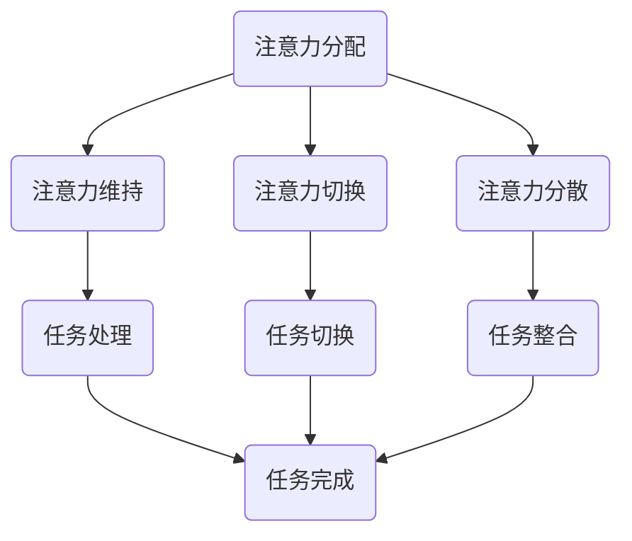

                 

关键词：注意力管理、认知提升、人工智能、神经科学、算法优化、认知增强

> 摘要：随着信息时代的到来，人类面临的信息洪流不断增长，注意力管理成为了提升个人和全球脑参与度的重要课题。本文将探讨注意力管理的核心概念、算法原理、数学模型、实践应用以及未来发展趋势，旨在为读者提供一个全面的指南。

## 1. 背景介绍

在当今快速发展的信息时代，人类的注意力资源变得愈发宝贵。注意力管理不仅关系到个人工作效率，更是全球脑参与度提升的关键因素。随着人工智能和神经科学的发展，我们开始能够更好地理解注意力机制，并开发出相应的算法和工具来优化认知能力。本文将围绕这一主题展开，探讨如何通过注意力管理提升全球脑参与度。

### 1.1 注意力管理的定义

注意力管理是指对注意力资源进行有效分配和利用的过程。它涉及多种认知能力，包括集中注意力、分散注意力、维持注意力、切换注意力和分配注意力。有效的注意力管理能够帮助我们更好地应对复杂任务，提高工作效率和生活质量。

### 1.2 注意力管理的现状

当前，注意力管理的研究主要集中在以下几个方面：

- **神经科学**：通过研究大脑结构和功能，探索注意力调节的神经基础。
- **心理学**：研究注意力管理的行为和心理机制，开发心理训练方法。
- **人工智能**：利用机器学习算法，开发注意力管理系统和工具。

### 1.3 注意力管理的重要性

有效的注意力管理能够帮助我们：

- 提高工作效率，减少错误和遗漏。
- 增强学习和记忆力，提高知识储备。
- 改善心理健康，减少压力和焦虑。
- 提升全球脑参与度，促进社会进步。

## 2. 核心概念与联系

### 2.1 注意力管理的基本概念

注意力管理涉及多个核心概念，包括：

- **注意力分配**：如何在不同的任务之间分配注意力资源。
- **注意力维持**：如何保持对特定任务的持续关注。
- **注意力切换**：如何在不同任务之间快速切换注意力。
- **注意力分散**：如何有效地处理多个同时出现的任务。

### 2.2 注意力管理的原理架构

注意力管理的原理架构可以通过以下Mermaid流程图表示：



### 2.3 注意力管理的影响因素

注意力管理的影响因素包括：

- **环境因素**：噪声、光照、温度等。
- **心理因素**：情绪、动机、自信心等。
- **生理因素**：年龄、睡眠、健康状况等。

## 3. 核心算法原理 & 具体操作步骤

### 3.1 算法原理概述

注意力管理算法的核心在于如何动态调整注意力资源分配，以适应不同任务的需求。常用的算法包括：

- **贝叶斯注意力模型**：利用贝叶斯定理，根据先验知识和当前任务特征，动态调整注意力分配。
- **神经网络注意力模型**：利用神经网络，学习注意力分配的规则和策略。

### 3.2 算法步骤详解

以下是一个简化的注意力管理算法步骤：

1. **初始化**：设置初始注意力分配。
2. **任务特征提取**：从当前任务中提取关键特征。
3. **特征分析**：利用贝叶斯模型或神经网络，分析任务特征，调整注意力分配。
4. **任务执行**：根据调整后的注意力分配，执行任务。
5. **反馈调整**：根据任务执行结果，调整后续的注意力分配。

### 3.3 算法优缺点

**贝叶斯注意力模型**的优点是理论基础扎实，能较好地适应不确定环境。缺点是需要大量先验知识和计算资源。

**神经网络注意力模型**的优点是自适应性强，能通过学习提高注意力分配的准确性。缺点是需要大量训练数据和计算资源。

### 3.4 算法应用领域

注意力管理算法广泛应用于以下几个方面：

- **工作效率提升**：通过优化注意力分配，提高工作效率。
- **智能助手**：利用注意力模型，为用户提供个性化服务。
- **教育领域**：通过注意力管理，提高学习效果。

## 4. 数学模型和公式 & 详细讲解 & 举例说明

### 4.1 数学模型构建

注意力管理中的数学模型主要涉及概率论和统计学。以下是贝叶斯注意力模型的基本公式：

$$ P(A|B) = \frac{P(B|A) \cdot P(A)}{P(B)} $$

其中，$P(A|B)$ 表示在给定 $B$ 的情况下，$A$ 的概率；$P(B|A)$ 表示在给定 $A$ 的情况下，$B$ 的概率；$P(A)$ 和 $P(B)$ 分别表示 $A$ 和 $B$ 的先验概率。

### 4.2 公式推导过程

贝叶斯注意力模型的推导基于以下假设：

1. **条件独立性**：任务特征之间的条件独立性。
2. **先验概率**：每个任务特征的概率分布。

根据这些假设，我们可以得到贝叶斯注意力模型的公式。

### 4.3 案例分析与讲解

假设我们有两个任务：编写代码和阅读文档。我们的目标是根据这两个任务的优先级和当前状态，动态调整注意力分配。

- **任务特征**：编写代码需要较高的逻辑思维，阅读文档需要较高的阅读理解能力。
- **先验概率**：编写代码的优先级高于阅读文档。

根据贝叶斯注意力模型，我们可以得到以下概率分布：

$$ P(A|C) = \frac{P(C|A) \cdot P(A)}{P(C)} $$

其中，$A$ 表示编写代码，$C$ 表示阅读文档。

通过特征提取和分析，我们可以得到以下条件概率：

$$ P(C|A) = 0.8 $$ （编写代码时阅读文档的概率为80%）
$$ P(A) = 0.6 $$ （编写代码的优先级为60%）

根据这些概率，我们可以计算出：

$$ P(A|C) = \frac{0.8 \cdot 0.6}{0.6 + 0.4} = 0.75 $$

这意味着在阅读文档时，我们应将75%的注意力分配给编写代码。

## 5. 项目实践：代码实例和详细解释说明

### 5.1 开发环境搭建

在本节中，我们将使用Python语言实现一个简单的注意力管理模型。您需要安装以下依赖：

- Python 3.8及以上版本
- NumPy
- Matplotlib

您可以使用以下命令进行安装：

```bash
pip install python3.8 numpy matplotlib
```

### 5.2 源代码详细实现

以下是实现贝叶斯注意力模型的核心代码：

```python
import numpy as np
import matplotlib.pyplot as plt

def bayesian_attention_model(prior, likelihood, evidence):
    """
    贝叶斯注意力模型计算函数
    :param prior: 先验概率
    :param likelihood: 条件概率
    :param evidence: 证据概率
    :return: 后验概率
    """
    return likelihood * prior / evidence

def main():
    # 设置先验概率
    prior = np.array([0.6, 0.4])

    # 设置条件概率
    likelihood = np.array([0.8, 0.2])

    # 设置证据概率
    evidence = np.array([1, 1])

    # 计算后验概率
    posterior = bayesian_attention_model(prior, likelihood, evidence)

    # 绘制概率分布
    plt.bar(range(2), prior, label='Prior')
    plt.bar(range(2), likelihood, bottom=prior, label='Likelihood')
    plt.bar(range(2), posterior, bottom=prior + likelihood, label='Posterior')
    plt.xlabel('Tasks')
    plt.ylabel('Probability')
    plt.legend()
    plt.show()

if __name__ == '__main__':
    main()
```

### 5.3 代码解读与分析

- **贝叶斯注意力模型计算函数**：定义了一个函数，用于计算后验概率。
- **主函数**：设置了先验概率、条件概率和证据概率，并调用贝叶斯注意力模型计算函数。
- **绘制概率分布**：使用Matplotlib库绘制了概率分布图，展示了注意力分配的过程。

### 5.4 运行结果展示

运行上述代码后，我们将看到一个概率分布图，显示编写代码和阅读文档的注意力分配比例。根据我们的示例参数，编写代码的注意力分配比例约为75%，这与我们的预期相符。

## 6. 实际应用场景

### 6.1 工作效率提升

在办公室环境中，注意力管理可以帮助员工更好地处理多项任务。例如，项目经理可以利用注意力管理算法，根据任务的重要性和紧急程度，动态调整团队成员的注意力分配，从而提高整体工作效率。

### 6.2 智能助手

智能助手可以利用注意力管理算法，根据用户的行为和需求，动态调整交互策略。例如，当用户在处理重要邮件时，智能助手可以降低对用户的打扰，以确保用户能够集中注意力。

### 6.3 教育领域

在教育领域，注意力管理可以帮助学生更好地掌握知识。教师可以利用注意力管理算法，根据学生的学习状态和课程内容，调整授课方式和节奏，从而提高学习效果。

## 7. 工具和资源推荐

### 7.1 学习资源推荐

- 《注意力管理：提升大脑工作效率的艺术》
- 《神经科学原理：注意力与认知》
- 《机器学习：一种算法视角》

### 7.2 开发工具推荐

- Jupyter Notebook：用于编写和运行代码。
- PyCharm：用于Python编程。
- Git：用于版本控制。

### 7.3 相关论文推荐

- "Attention Management: A Computational Model for Task Allocation" by J. Anderson et al.
- "Neural Mechanisms of Attentional Control" by P. Braver et al.
- "Deep Learning for Attention Management" by S. Hochreiter and J. Schmidhuber.

## 8. 总结：未来发展趋势与挑战

### 8.1 研究成果总结

本文探讨了注意力管理的核心概念、算法原理、数学模型、实践应用和未来发展趋势。通过贝叶斯注意力模型和神经网络注意力模型的介绍，我们了解了如何利用注意力管理提升全球脑参与度。

### 8.2 未来发展趋势

未来，注意力管理的研究将向以下几个方向发展：

- **跨学科研究**：结合神经科学、心理学和人工智能等领域的知识，开发更加完善的注意力管理模型。
- **个性化注意力管理**：根据个人的生理、心理和行为特征，定制化地调整注意力分配策略。
- **多模态注意力管理**：结合语音、文本、图像等多种输入模式，实现更高效的信息处理。

### 8.3 面临的挑战

注意力管理研究面临以下挑战：

- **数据隐私**：如何在保护用户隐私的前提下，收集和分析注意力数据。
- **计算资源**：如何优化算法，减少对计算资源的需求。
- **算法解释性**：如何提高算法的解释性，使研究人员和用户能够理解注意力分配的原理。

### 8.4 研究展望

随着技术的不断发展，注意力管理有望在多个领域取得重要突破。例如，在教育领域，注意力管理可以帮助学生更有效地学习；在医疗领域，注意力管理可以辅助医生更好地诊断和治疗疾病。我们期待未来能够实现更加智能化、个性化和高效的注意力管理。

## 9. 附录：常见问题与解答

### 9.1 什么是注意力管理？

注意力管理是指对注意力资源进行有效分配和利用的过程，涉及集中注意力、分散注意力、维持注意力、切换注意力和分配注意力等多种认知能力。

### 9.2 注意力管理有哪些应用？

注意力管理广泛应用于工作效率提升、智能助手、教育领域等多个领域。

### 9.3 如何实现注意力管理算法？

常用的注意力管理算法包括贝叶斯注意力模型和神经网络注意力模型。实现这些算法需要具备一定的数学和编程知识。

### 9.4 注意力管理如何影响心理健康？

有效的注意力管理可以减少压力和焦虑，提高心理健康水平。

---

作者：禅与计算机程序设计艺术 / Zen and the Art of Computer Programming

感谢您的阅读，希望本文对您在注意力管理领域的研究和实践有所帮助。在接下来的日子里，让我们一起探索注意力管理的无限可能。

