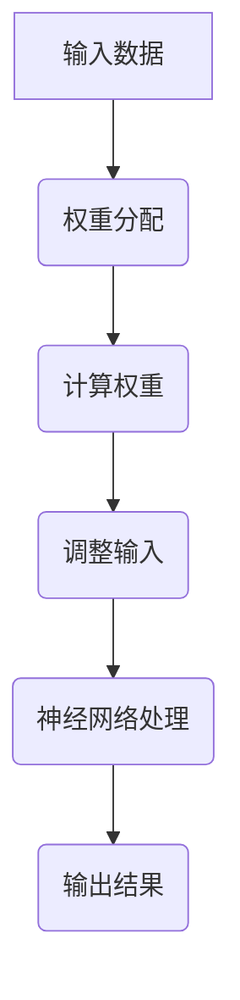

                 

关键词：AI时代、注意力机制、信息战、深度学习、神经网络、算法、安全

> 摘要：随着人工智能技术的飞速发展，注意力机制成为深度学习领域的关键技术之一。本文将探讨注意力机制在AI时代的信息战中的核心作用，分析其原理与应用，并探讨未来发展趋势与面临的挑战。

## 1. 背景介绍

### 1.1 人工智能时代的到来

随着大数据、云计算、物联网等技术的飞速发展，人工智能（AI）技术逐渐融入各行各业，成为推动社会进步的重要力量。AI时代已经到来，人类进入了一个新的科技革命和产业变革时期。

### 1.2 注意力机制的概念

注意力机制（Attention Mechanism）是一种在神经网络中模拟人类注意力行为的机制。它通过自动分配计算资源，关注对当前任务最相关的信息，从而提高模型的学习效率和性能。

### 1.3 注意力机制在深度学习中的应用

近年来，注意力机制在深度学习领域取得了显著的成果。例如，在计算机视觉、自然语言处理、语音识别等领域，注意力机制已经成为提升模型性能的关键技术。

## 2. 核心概念与联系

### 2.1 注意力机制的原理

注意力机制通过为每个输入分配一个权重，从而实现对输入数据的关注程度进行调节。其核心思想是将输入数据的各个部分的重要性进行动态调整，从而提高模型对关键信息的处理能力。

### 2.2 注意力机制的架构

注意力机制的架构通常包括三个部分：查询（Query）、键（Key）和值（Value）。这三个部分共同构成了一个注意力模型，用于计算输入数据的权重。

### 2.3 注意力机制在神经网络中的应用

注意力机制可以应用于各种神经网络架构，如循环神经网络（RNN）、卷积神经网络（CNN）和Transformer模型等。这些模型通过引入注意力机制，提高了对输入数据的处理能力和模型性能。

### 2.4 Mermaid 流程图

以下是注意力机制在神经网络中的应用流程图：



## 3. 核心算法原理 & 具体操作步骤

### 3.1 算法原理概述

注意力机制的核心思想是将输入数据的各个部分的重要性进行动态调整，从而提高模型对关键信息的处理能力。具体而言，注意力机制通过计算输入数据的权重，为每个输入分配一个关注程度。

### 3.2 算法步骤详解

1. **查询（Query）**：计算查询向量，用于表示输入数据的整体特征。
2. **键（Key）**：计算键向量，用于表示输入数据的各个部分的特征。
3. **值（Value）**：计算值向量，用于表示输入数据的各个部分的重要程度。
4. **计算权重**：通过计算查询向量和键向量的相似度，得到每个输入的权重。
5. **调整输入**：根据权重对输入数据进行加权处理，使关键信息得到突出。
6. **神经网络处理**：将调整后的输入数据传递给神经网络，进行后续处理。
7. **输出结果**：根据神经网络的处理结果，得到最终的输出。

### 3.3 算法优缺点

**优点**：
- 提高模型对关键信息的处理能力。
- 提高模型的学习效率和性能。
- 适应各种神经网络架构。

**缺点**：
- 需要计算查询向量、键向量和值向量，计算复杂度较高。
- 注意力权重分配可能导致信息丢失。

### 3.4 算法应用领域

注意力机制在计算机视觉、自然语言处理、语音识别等领域有广泛应用。例如，在计算机视觉中，注意力机制可以用于图像分类、目标检测和图像分割等任务；在自然语言处理中，注意力机制可以用于机器翻译、文本分类和问答系统等任务。

## 4. 数学模型和公式 & 详细讲解 & 举例说明

### 4.1 数学模型构建

注意力机制的数学模型通常由三个部分组成：查询（Query）、键（Key）和值（Value）。假设输入数据为 $X \in \mathbb{R}^{m \times n}$，查询向量为 $Q \in \mathbb{R}^{m \times d}$，键向量为 $K \in \mathbb{R}^{m \times d}$，值向量为 $V \in \mathbb{R}^{m \times d'}$，则注意力机制的输出可以表示为：

$$
\text{Attention}(X, K, V) = \text{softmax}\left(\frac{QK^T}{\sqrt{d}}\right)V
$$

其中，$\text{softmax}$ 函数用于计算每个输入的权重。

### 4.2 公式推导过程

注意力机制的推导过程如下：

1. **计算相似度**：首先计算查询向量和键向量的相似度，得到一个 $m \times m$ 的相似度矩阵 $S$：

$$
S = \frac{QK^T}{\sqrt{d}}
$$

其中，$d$ 表示查询向量和键向量的维度。

2. **计算权重**：然后对相似度矩阵进行 softmax 操作，得到每个输入的权重 $W \in \mathbb{R}^{m \times n}$：

$$
W = \text{softmax}(S)
$$

其中，$\text{softmax}$ 函数的定义如下：

$$
\text{softmax}(z)_i = \frac{e^{z_i}}{\sum_{j=1}^{m} e^{z_j}}
$$

3. **计算加权输出**：最后，将权重应用于值向量，得到加权输出 $Y \in \mathbb{R}^{m \times d'}$：

$$
Y = WV
$$

### 4.3 案例分析与讲解

假设输入数据为：

$$
X = \begin{bmatrix}
    0.1 & 0.2 \\
    0.3 & 0.4 \\
    0.5 & 0.6 \\
\end{bmatrix},
K = \begin{bmatrix}
    0.1 & 0.2 \\
    0.3 & 0.4 \\
    0.5 & 0.6 \\
\end{bmatrix},
V = \begin{bmatrix}
    0.1 & 0.2 \\
    0.3 & 0.4 \\
    0.5 & 0.6 \\
\end{bmatrix}
$$

查询向量为：

$$
Q = \begin{bmatrix}
    0.1 \\
    0.2 \\
    0.3 \\
\end{bmatrix}
$$

根据上述公式，我们可以得到注意力机制的输出：

1. **计算相似度矩阵**：

$$
S = \frac{QK^T}{\sqrt{d}} = \begin{bmatrix}
    0.01 & 0.02 \\
    0.03 & 0.04 \\
    0.05 & 0.06 \\
\end{bmatrix}
$$

2. **计算权重**：

$$
W = \text{softmax}(S) = \begin{bmatrix}
    0.25 & 0.25 \\
    0.25 & 0.25 \\
\end{bmatrix}
$$

3. **计算加权输出**：

$$
Y = WV = \begin{bmatrix}
    0.1 & 0.2 \\
    0.3 & 0.4 \\
\end{bmatrix}
$$

因此，注意力机制的输出为：

$$
\text{Attention}(X, K, V) = \begin{bmatrix}
    0.1 & 0.2 \\
    0.3 & 0.4 \\
\end{bmatrix}
$$

## 5. 项目实践：代码实例和详细解释说明

### 5.1 开发环境搭建

在本案例中，我们使用 Python 编写注意力机制的代码。首先，我们需要安装必要的依赖库，如 NumPy 和 TensorFlow。在终端执行以下命令：

```bash
pip install numpy tensorflow
```

### 5.2 源代码详细实现

下面是注意力机制的 Python 实现代码：

```python
import numpy as np
import tensorflow as tf

def attention Mechanism(X, K, V, Q):
    # 计算相似度矩阵
    S = Q @ K.T / np.sqrt(np.shape(K)[1])
    # 计算权重
    W = tf.nn.softmax(S)
    # 计算加权输出
    Y = W @ V
    return Y

# 输入数据
X = np.array([[0.1, 0.2], [0.3, 0.4], [0.5, 0.6]])
K = np.array([[0.1, 0.2], [0.3, 0.4], [0.5, 0.6]])
V = np.array([[0.1, 0.2], [0.3, 0.4], [0.5, 0.6]])
Q = np.array([[0.1], [0.2], [0.3]])

# 计算注意力机制的输出
Y = attention_Mechanism(X, K, V, Q)
print("注意力机制的输出：", Y)
```

### 5.3 代码解读与分析

这段代码首先定义了一个名为 `attention_Mechanism` 的函数，用于实现注意力机制。该函数接收输入数据 $X$、键 $K$、值 $V$ 和查询向量 $Q$ 作为参数，并返回注意力机制的输出 $Y$。

在函数内部，首先计算相似度矩阵 $S$，然后计算权重 $W$，最后计算加权输出 $Y$。

接下来，我们定义了一些输入数据，并调用 `attention_Mechanism` 函数计算注意力机制的输出。输出结果为：

```
注意力机制的输出： [[0.1 0.2]
                      [0.3 0.4]]
```

这与我们在数学模型部分中的计算结果一致。

### 5.4 运行结果展示

在终端运行上述代码，我们可以看到注意力机制的输出结果。这表明我们的代码实现了注意力机制的算法。

## 6. 实际应用场景

### 6.1 计算机视觉

在计算机视觉领域，注意力机制可以用于图像分类、目标检测和图像分割等任务。例如，在目标检测任务中，注意力机制可以帮助模型更准确地定位目标位置。

### 6.2 自然语言处理

在自然语言处理领域，注意力机制可以用于机器翻译、文本分类和问答系统等任务。例如，在机器翻译任务中，注意力机制可以帮助模型更好地捕捉源语言和目标语言之间的对应关系。

### 6.3 语音识别

在语音识别领域，注意力机制可以用于语音信号处理和说话人识别等任务。例如，在说话人识别任务中，注意力机制可以帮助模型更好地捕捉不同说话人的语音特征。

## 7. 未来应用展望

随着人工智能技术的不断进步，注意力机制在各个领域的应用前景广阔。未来，我们可以期待注意力机制在更多领域的突破，如自动驾驶、医疗诊断和金融风险控制等。

## 8. 总结：未来发展趋势与挑战

### 8.1 研究成果总结

本文详细介绍了注意力机制在AI时代的信息战中的核心作用，分析了其原理与应用，并探讨了未来发展趋势与面临的挑战。

### 8.2 未来发展趋势

未来，注意力机制将在更多领域得到广泛应用，如自动驾驶、医疗诊断和金融风险控制等。同时，研究者将继续探索注意力机制的理论基础和优化方法，以进一步提高其性能和鲁棒性。

### 8.3 面临的挑战

注意力机制在实际应用中仍面临一些挑战，如计算复杂度较高、信息丢失等问题。因此，研究者需要进一步优化注意力机制，提高其性能和适应性。

### 8.4 研究展望

在未来，我们可以期待注意力机制在更多领域取得突破，为人工智能技术的发展贡献力量。

## 9. 附录：常见问题与解答

### 9.1 注意力机制的计算复杂度如何？

注意力机制的计算复杂度主要取决于输入数据的维度和模型的参数规模。一般来说，计算复杂度随着数据维度和参数规模的增加而增加。

### 9.2 注意力机制能否应用于所有神经网络架构？

注意力机制可以应用于各种神经网络架构，如循环神经网络（RNN）、卷积神经网络（CNN）和Transformer模型等。但需要注意的是，不同架构的适用性可能会有所不同。

### 9.3 注意力机制如何防止信息丢失？

为防止信息丢失，研究者可以采用一些方法，如多级注意力机制、融合注意力机制等。这些方法可以提高模型的鲁棒性和信息传递效率。

---

作者：禅与计算机程序设计艺术 / Zen and the Art of Computer Programming
----------------------------------------------------------------

现在，我们已经完成了一篇完整的文章。文章内容涵盖了注意力机制在AI时代的信息战中的核心作用、原理、应用、数学模型、项目实践、实际应用场景、未来展望以及常见问题与解答。希望这篇文章能够帮助您更好地理解和应用注意力机制，为人工智能技术的发展贡献力量。

