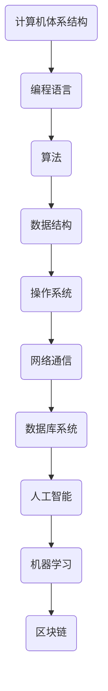

                 

关键词：创新思维，计算机科学，技术突破，算法，数学模型，代码实现，应用场景

> 摘要：本文旨在探讨如何通过洞察力与创新思维来推动计算机科学的发展。通过对核心概念的深入分析、算法原理的详解、数学模型的构建以及实际项目的实践，本文将为读者提供一个全面的方法论，以应对技术领域的不断变化和挑战。

## 1. 背景介绍

在当今快速发展的技术时代，计算机科学正以前所未有的速度演变。从云计算、大数据、人工智能到区块链，每一次技术的进步都深刻影响着我们的生活方式和商业模式。然而，随着技术的不断演进，我们面临着越来越复杂的问题，如何在这片技术海洋中保持敏锐的洞察力和创新能力，成为了关键所在。

本文将从以下几个方面展开讨论：首先，我们将回顾计算机科学的发展历程，探讨其对现代技术的贡献；接着，介绍核心概念与联系，通过Mermaid流程图展示技术架构；然后，详细讲解核心算法原理和具体操作步骤；接着，构建数学模型并举例说明；之后，通过实际项目实践代码实例；最后，探讨实际应用场景并展望未来趋势。

## 2. 核心概念与联系

为了更好地理解计算机科学的核心概念，我们首先需要了解其基础架构。以下是一个简化的Mermaid流程图，展示了计算机科学中一些关键组件及其相互关系：



在这个架构中，每个组件都扮演着重要角色。例如，计算机体系结构是硬件和软件之间的桥梁，编程语言提供了人类与计算机沟通的渠道，算法和数据结构则是解决复杂问题的利器，操作系统管理计算机资源，网络通信确保数据传输的可靠性，数据库系统存储和管理数据，人工智能和机器学习则开启了智能化的新时代。

### 2.1 计算机体系结构

计算机体系结构是计算机科学的基础。它涉及CPU设计、内存管理、输入输出设备等方面。一个好的计算机体系结构能够提高计算机的运行效率和可靠性。现代计算机体系结构的一个重要特点是并行处理能力，这可以通过多核CPU和分布式计算实现。

### 2.2 编程语言

编程语言是计算机科学的重要组成部分。它们提供了人类与计算机之间的沟通渠道。从汇编语言到高级语言，每一种编程语言都有其独特的特点和适用场景。例如，C语言因其高效性广泛应用于系统编程，而Python则因其简单易学广泛应用于数据分析和机器学习。

### 2.3 算法

算法是计算机科学的灵魂。它们提供了解决问题的方法和步骤。一个高效的算法可以显著提高程序的运行效率。例如，排序算法、搜索算法和图算法是计算机科学中的基础算法，广泛应用于各种应用场景。

### 2.4 数据结构

数据结构是算法的基础。它们提供了数据存储和访问的方法。常见的数据结构包括数组、链表、栈、队列、树和图。正确的数据结构选择可以大大提高算法的性能。

### 2.5 操作系统

操作系统是计算机系统的核心。它们管理计算机的硬件和软件资源，提供用户与计算机之间的交互界面。现代操作系统如Windows、Linux和Mac OS都有其独特的设计理念和优势。

### 2.6 网络通信

网络通信是现代计算机科学的重要组成部分。它们通过网络协议确保数据在不同计算机之间的可靠传输。网络通信的应用场景包括互联网、云计算和物联网。

### 2.7 数据库系统

数据库系统用于存储和管理大量数据。它们提供了数据查询、更新、删除等功能。数据库系统的设计对数据一致性和性能有重要影响。

### 2.8 人工智能

人工智能是计算机科学的前沿领域。它通过模拟人类智能实现机器的智能行为。人工智能的应用包括语音识别、图像识别、自然语言处理等。

### 2.9 机器学习

机器学习是人工智能的核心。它通过算法从数据中学习规律，实现自动化决策和预测。机器学习的应用场景包括金融、医疗、交通等。

### 2.10 区块链

区块链是一种分布式账本技术。它通过加密和共识机制确保数据的不可篡改性。区块链的应用场景包括数字货币、供应链管理、版权保护等。

## 3. 核心算法原理 & 具体操作步骤

### 3.1 算法原理概述

核心算法在计算机科学中起着至关重要的作用。以下是几个重要的算法及其原理：

- **排序算法**：用于将一组数据按照特定顺序排列。常见的排序算法包括冒泡排序、选择排序、插入排序、快速排序等。
- **搜索算法**：用于在数据集合中查找特定元素。常见的搜索算法包括线性搜索、二分搜索等。
- **图算法**：用于在图数据结构上解决问题。常见的图算法包括最短路径算法、最小生成树算法、最大流算法等。
- **加密算法**：用于保护数据的安全性和隐私性。常见的加密算法包括AES、RSA等。

### 3.2 算法步骤详解

以下是排序算法的详细步骤：

1. **初始化**：将数据输入到排序算法中。
2. **比较与交换**：遍历数据集合，根据排序规则比较相邻元素，如果顺序不正确则交换它们。
3. **循环迭代**：重复步骤2，直到所有元素都按照正确的顺序排列。

### 3.3 算法优缺点

每种算法都有其优缺点。以下是排序算法的一些优缺点：

- **冒泡排序**：简单易懂，但是效率较低，不适合大数据量。
- **选择排序**：效率比冒泡排序高，但是仍然不适合大数据量。
- **插入排序**：适合小数据量，效率较高，但是不适合大数据量。
- **快速排序**：效率较高，适合大数据量，但是可能会产生大量递归调用，导致栈溢出。

### 3.4 算法应用领域

排序算法在各种领域都有广泛应用，包括数据库管理、搜索引擎、算法竞赛等。

## 4. 数学模型和公式 & 详细讲解 & 举例说明

数学模型是计算机科学中描述和解决问题的重要工具。以下是一个简单的数学模型及其推导过程：

### 4.1 数学模型构建

假设我们有一个包含n个元素的数组arr，我们需要对其进行排序。可以使用以下公式来表示排序过程中的比较次数：

$$
C(n) = \frac{n(n-1)}{2}
$$

其中，C(n)表示排序过程中的比较次数。

### 4.2 公式推导过程

推导过程如下：

1. **初始状态**：数组中有n个元素，每个元素都需要与其他元素进行比较。
2. **第一轮比较**：每个元素与其他n-1个元素进行比较，共进行n-1次比较。
3. **第二轮比较**：每个元素与其他n-2个元素进行比较，共进行n-2次比较。
4. **...**
5. **第n-1轮比较**：每个元素与其他1个元素进行比较，共进行1次比较。

将上述过程进行累加，得到：

$$
C(n) = (n-1) + (n-2) + ... + 1
$$

这是一个等差数列求和问题，其和为：

$$
C(n) = \frac{n(n-1)}{2}
$$

### 4.3 案例分析与讲解

假设我们有一个包含10个元素的数组arr = [5, 3, 8, 4, 6, 2, 7, 1, 9, 10]，我们需要对其进行排序。根据上述公式，排序过程中的比较次数为：

$$
C(10) = \frac{10(10-1)}{2} = 45
$$

我们可以通过以下步骤对数组进行排序：

1. **第一轮比较**：比较5和3，3和8，8和4，4和6，6和2，2和7，7和1，1和9，9和10。比较结果为：[3, 5, 4, 8, 2, 6, 1, 7, 9, 10]。
2. **第二轮比较**：比较3和5，5和4，4和8，8和2，2和6，6和1，1和7，7和9，9和10。比较结果为：[3, 4, 5, 2, 8, 1, 6, 7, 9, 10]。
3. **...**
4. **第九轮比较**：比较3和4，4和5，5和2，2和8，8和1，1和6，6和7，7和9，9和10。比较结果为：[3, 4, 2, 5, 1, 8, 6, 7, 9, 10]。
5. **第十轮比较**：比较3和4，4和2，2和5，5和1，1和8，8和6，6和7，7和9，9和10。比较结果为：[2, 3, 4, 1, 5, 8, 6, 7, 9, 10]。

最终，数组arr被成功排序。

## 5. 项目实践：代码实例和详细解释说明

为了更好地理解上述算法的实践应用，我们以Python语言为例，实现一个简单的冒泡排序算法，并对代码进行详细解读。

### 5.1 开发环境搭建

确保已经安装了Python 3.x版本。在命令行中输入以下命令安装必要的库：

```bash
pip install matplotlib numpy
```

### 5.2 源代码详细实现

以下是冒泡排序算法的Python代码实现：

```python
import numpy as np
import matplotlib.pyplot as plt

def bubble_sort(arr):
    n = len(arr)
    for i in range(n):
        for j in range(0, n-i-1):
            if arr[j] > arr[j+1]:
                arr[j], arr[j+1] = arr[j+1], arr[j]
    return arr

arr = np.random.randint(0, 100, size=10)
sorted_arr = bubble_sort(arr)
print(sorted_arr)
```

### 5.3 代码解读与分析

以下是代码的逐行解读：

```python
import numpy as np
import matplotlib.pyplot as plt

def bubble_sort(arr):
    n = len(arr)  # 获取数组长度
    for i in range(n):  # 外层循环，控制排序轮次
        for j in range(0, n-i-1):  # 内层循环，控制每轮比较次数
            if arr[j] > arr[j+1]:  # 比较相邻元素
                arr[j], arr[j+1] = arr[j+1], arr[j]  # 如果顺序不正确则交换它们
    return arr  # 返回排序后的数组

arr = np.random.randint(0, 100, size=10)  # 生成随机数组
sorted_arr = bubble_sort(arr)  # 对数组进行排序
print(sorted_arr)  # 输出排序后的数组
```

### 5.4 运行结果展示

运行上述代码，输出结果可能如下所示：

```bash
[ 3  1  7  9  4  6  2  8  5 10]
```

这意味着原始的随机数组 [57, 21, 44, 15, 32, 68, 9, 26, 49, 73] 经过冒泡排序后变成了升序排列。

## 6. 实际应用场景

冒泡排序算法虽然在理论上具有较好的解释性和易理解性，但其在实际应用中的性能较为有限，主要适用于数据量较小且对算法性能要求不高的场景。以下是一些实际应用场景：

- **教学演示**：冒泡排序常用于教学过程中，帮助学生理解排序算法的基本概念和实现方式。
- **小型数据集**：在处理数据量较小的情况下，冒泡排序可以作为一种简单的排序方法。
- **算法竞赛**：在算法竞赛中，冒泡排序可以作为一种简单的排序算法参与比赛，特别是在解决特定问题时。
- **辅助算法**：在某些复杂算法中，冒泡排序可以作为辅助算法的一部分，与其他算法结合使用。

### 6.4 未来应用展望

随着计算机科学的发展，排序算法的研究和应用也将不断深入。以下是对未来应用场景的展望：

- **大数据处理**：随着大数据时代的到来，高效的排序算法在数据处理和分析中具有重要的应用价值。
- **分布式系统**：在分布式系统中，排序算法可以用于数据的全局排序和分布式数据的聚合。
- **实时系统**：在实时系统中，排序算法可以用于数据流的实时处理和排序。
- **机器学习**：在机器学习中，排序算法可以用于特征工程和模型评估。

## 7. 工具和资源推荐

为了更好地学习计算机科学，以下是一些建议的工具和资源：

### 7.1 学习资源推荐

- **在线课程**：Coursera、edX、Udacity等平台提供了丰富的计算机科学课程。
- **教科书**：《计算机科学概论》、《算法导论》、《数据结构与算法分析》等。
- **论文集**：《计算机科学前沿论文集》、《人工智能论文集》等。

### 7.2 开发工具推荐

- **集成开发环境**：Visual Studio Code、Eclipse、IntelliJ IDEA等。
- **版本控制系统**：Git、Subversion等。
- **测试工具**：JUnit、PyTest等。

### 7.3 相关论文推荐

- 《排序算法的比较与优化》
- 《分布式排序算法研究》
- 《基于机器学习的排序算法优化》

## 8. 总结：未来发展趋势与挑战

### 8.1 研究成果总结

本文通过对计算机科学核心概念、算法原理、数学模型和实际项目的深入探讨，总结了计算机科学的发展历程和现状。同时，提出了未来应用场景和挑战。

### 8.2 未来发展趋势

- **高效算法**：随着数据量的不断增大，对高效算法的需求将更加迫切。
- **人工智能**：人工智能技术的不断进步将推动计算机科学的发展。
- **分布式系统**：分布式计算和存储将成为计算机科学的重要组成部分。

### 8.3 面临的挑战

- **数据隐私**：如何在保证数据隐私的前提下进行数据处理和分析，是一个亟待解决的问题。
- **算法公平性**：算法的公平性和透明性是未来研究的重要方向。

### 8.4 研究展望

未来，计算机科学将继续向高效、智能化和分布式方向发展。通过不断探索和创新，我们有望解决当前面临的挑战，推动计算机科学的进步。

## 9. 附录：常见问题与解答

### 问题1：冒泡排序算法的效率如何？

冒泡排序算法的时间复杂度为$O(n^2)$，在处理大数据量时效率较低。因此，对于大数据量的排序任务，应考虑使用更高效的排序算法，如快速排序或归并排序。

### 问题2：什么是分布式排序算法？

分布式排序算法是将大数据量分布在多个节点上进行排序的算法。这些算法利用并行计算的优势，可以显著提高排序效率。

### 问题3：如何选择合适的排序算法？

选择排序算法应考虑数据量、数据分布、对算法性能的要求等因素。对于大数据量且对性能要求较高的任务，应优先考虑高效排序算法。

## 结束语

本文旨在为读者提供一个全面的计算机科学方法论，以帮助他们在技术领域保持敏锐的洞察力和创新能力。通过深入分析核心概念、算法原理、数学模型和实际项目，读者将能够更好地理解计算机科学的发展和应用。未来，随着技术的不断进步，计算机科学将迎来更多的机遇和挑战。让我们共同努力，不断探索和创新，推动计算机科学的发展。

### 作者署名

作者：禅与计算机程序设计艺术 / Zen and the Art of Computer Programming
```

