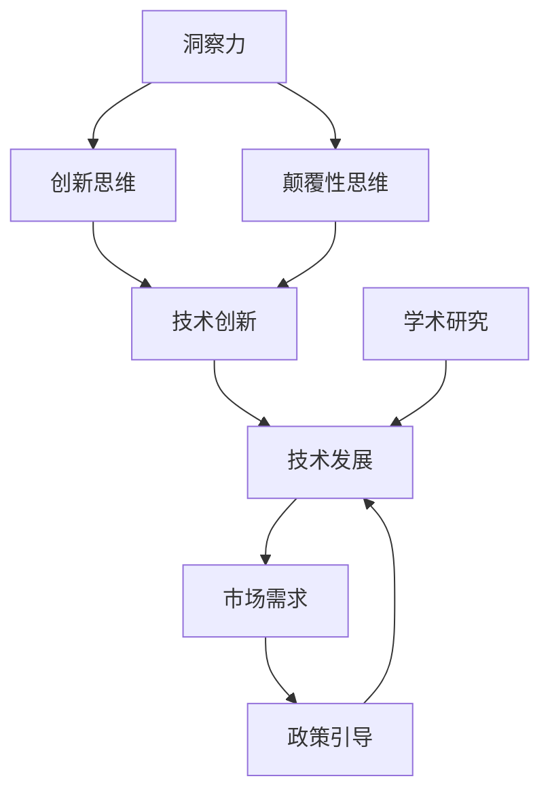

                 

关键词：洞察力、创新、颠覆性思维、技术发展、人工智能、编程思维、未来趋势。

摘要：本文将探讨在技术快速发展的今天，如何通过培养洞察力和创新思维来推动颠覆性技术的诞生。我们将从核心概念、算法原理、数学模型、项目实践、应用场景、工具资源以及未来趋势等多个方面，深入分析这一主题，旨在为读者提供启发和指导。

## 1. 背景介绍

在当今数字化时代，技术发展速度之快前所未有。人工智能、大数据、云计算等新兴技术不断涌现，正在深刻改变着我们的生活方式、工作模式以及社会结构。然而，随着技术的不断进步，也带来了新的挑战。如何在这些变革中保持竞争力，如何创新出引领未来的技术，成为了摆在每一个科技工作者面前的重大课题。

### 1.1 技术变革的挑战

技术变革带来的挑战主要体现在以下几个方面：

1. **快速迭代的技术环境**：新技术层出不穷，知识更新速度快，对个人的学习和适应能力提出了更高的要求。
2. **跨界融合的需求**：不同领域的知识融合，如人工智能与生物医学、信息技术与制造业的融合，需要跨学科的综合能力。
3. **创新能力的重要性**：在激烈的竞争环境中，创新能力成为企业持续发展的核心动力，也决定了个人职业生涯的走向。

### 1.2 技术发展的趋势

技术发展趋势体现在以下几个方面：

1. **人工智能的深度应用**：人工智能正在从简单的自动化走向智能化，将深刻改变生产方式、服务模式和商业模式。
2. **物联网的广泛普及**：万物互联的智能世界正在形成，大数据和云计算将成为其基础设施。
3. **区块链技术的应用**：区块链在金融、供应链管理、数字身份认证等领域的应用前景广阔。

### 1.3 技术创新的必要性

在这样一个快速变化的时代，技术创新显得尤为重要。它不仅是推动社会进步的关键力量，也是企业保持竞争力、实现跨越式发展的关键。以下是从几个方面探讨技术创新的必要性：

1. **市场需求**：消费者对产品和服务的需求不断变化，技术创新能够满足这些需求，提供更好的用户体验。
2. **竞争压力**：市场竞争日益激烈，只有不断创新，才能在竞争中脱颖而出。
3. **社会影响**：技术创新能够带来经济效益和社会效益，推动社会的持续进步。

## 2. 核心概念与联系

在探讨技术创新的过程中，我们需要明确几个核心概念，并理解它们之间的联系。以下是几个核心概念：

### 2.1 洞察力

洞察力是一种深层次的理解力和观察能力，它不仅能够看到事物的表面现象，更能够洞察到其背后的本质和规律。在技术领域，洞察力体现在对技术发展趋势的预见性理解和对技术本质的深刻洞察。

### 2.2 创新思维

创新思维是一种能够产生新观点、新方法和新解决方案的思维方式。它包括发散思维、收敛思维、批判性思维等，是推动技术创新的重要工具。

### 2.3 颠覆性思维

颠覆性思维是一种能够颠覆现有技术和市场格局的思维方式。它关注的是如何通过创新来打破旧有格局，创造新的价值。

### 2.4 技术发展的动力

技术发展的动力来自于市场需求、政策引导、学术研究等多方面。在市场需求方面，用户对更高效、更智能、更便捷的技术的需求不断推动技术发展。在政策引导方面，政府通过制定相关政策来引导和扶持技术创新。在学术研究方面，学术界的突破性研究常常为技术创新提供了新的方向。

### 2.5 技术创新的核心

技术创新的核心在于解决实际问题，提供更好的解决方案。它不仅需要技术创新，还需要商业模式创新、市场策略创新等多方面的支持。

## 2.6 Mermaid 流程图

下面是一个简单的 Mermaid 流程图，展示上述核心概念之间的关系：



## 3. 核心算法原理 & 具体操作步骤

### 3.1 算法原理概述

在技术创新的过程中，算法设计至关重要。以下将介绍一种核心算法——深度学习算法的基本原理和具体操作步骤。

### 3.2 算法步骤详解

#### 3.2.1 数据收集与预处理

首先，需要收集大量数据，并进行预处理，包括数据清洗、数据归一化、数据增强等操作。

#### 3.2.2 模型构建

选择合适的神经网络架构，如卷积神经网络（CNN）、循环神经网络（RNN）等，构建模型。

#### 3.2.3 模型训练

使用预处理后的数据对模型进行训练，通过反向传播算法不断调整模型参数。

#### 3.2.4 模型评估

使用验证集对模型进行评估，计算准确率、召回率、F1值等指标。

#### 3.2.5 模型优化

根据评估结果，对模型进行调整，提高模型性能。

### 3.3 算法优缺点

**优点**：

1. **强大的表示能力**：深度学习模型能够自动学习数据的特征表示，不需要人工设计特征。
2. **良好的泛化能力**：通过大量的训练数据，深度学习模型具有良好的泛化能力。

**缺点**：

1. **计算成本高**：深度学习模型需要大量的计算资源进行训练。
2. **对数据质量要求高**：数据的质量直接影响模型的性能。

### 3.4 算法应用领域

深度学习算法在图像识别、自然语言处理、推荐系统等多个领域有广泛应用，是推动人工智能技术发展的重要力量。

## 4. 数学模型和公式 & 详细讲解 & 举例说明

### 4.1 数学模型构建

深度学习算法的核心是神经网络，其数学模型基于多层感知机（MLP）模型。MLP模型的基本结构包括输入层、隐藏层和输出层。

### 4.2 公式推导过程

假设我们有一个输入向量 $x$，隐藏层中的神经元计算公式为：

$$
z_i = \sum_{j=1}^{n} w_{ij} x_j + b_i
$$

其中，$w_{ij}$ 为权重，$b_i$ 为偏置。激活函数通常使用 sigmoid 函数：

$$
a_i = \frac{1}{1 + e^{-z_i}}
$$

输出层的神经元计算公式为：

$$
y = \sum_{i=1}^{m} w_{i} a_i + b
$$

### 4.3 案例分析与讲解

以下是一个简单的线性回归问题，使用梯度下降算法进行求解。

### 4.3.1 数据准备

我们准备一个包含 100 个样本的数据集，每个样本包含一个特征 $x$ 和一个标签 $y$。

### 4.3.2 模型构建

构建一个简单的线性回归模型，包含一个隐藏层，一个神经元。

### 4.3.3 模型训练

使用梯度下降算法对模型进行训练，训练过程如下：

1. 初始化权重 $w$ 和偏置 $b$。
2. 对于每个样本，计算预测值 $y'$ 和实际值 $y$ 的差值 $\Delta$。
3. 更新权重和偏置：$w = w - \alpha \cdot \Delta \cdot x$，$b = b - \alpha \cdot \Delta$。
4. 重复步骤 2 和 3，直到达到预设的迭代次数或收敛条件。

### 4.3.4 模型评估

使用验证集对模型进行评估，计算预测误差。

## 5. 项目实践：代码实例和详细解释说明

### 5.1 开发环境搭建

我们需要搭建一个 Python 开发环境，并安装必要的库，如 NumPy、Pandas、TensorFlow 等。

### 5.2 源代码详细实现

以下是一个简单的线性回归模型的实现代码：

```python
import numpy as np
import pandas as pd

# 数据准备
x = np.random.rand(100, 1)
y = 2 * x + np.random.rand(100, 1)

# 模型初始化
w = np.random.rand(1, 1)
b = np.random.rand(1, 1)

# 梯度下降算法
alpha = 0.01
num_epochs = 1000

for epoch in range(num_epochs):
    y_pred = w * x + b
    delta = y - y_pred
    dw = delta * x
    db = delta

    w = w - alpha * dw
    b = b - alpha * db

    # 打印当前迭代次数和损失函数值
    if epoch % 100 == 0:
        loss = np.mean(delta ** 2)
        print(f"Epoch {epoch}: Loss = {loss}")

# 模型评估
y_pred = w * x + b
print(f"Predicted values: {y_pred}")
print(f"Actual values: {y}")
```

### 5.3 代码解读与分析

这段代码实现了一个简单的线性回归模型，使用梯度下降算法进行训练。代码的主要步骤如下：

1. 导入必要的库。
2. 准备数据。
3. 初始化模型参数。
4. 定义梯度下降算法。
5. 训练模型。
6. 评估模型。

通过这段代码，我们可以看到如何使用 Python 实现基本的机器学习算法，了解算法的实现细节和原理。

## 6. 实际应用场景

### 6.1 人工智能领域

人工智能是当前技术创新的热点领域之一，深度学习算法在图像识别、自然语言处理、自动驾驶等领域有广泛应用。例如，在自动驾驶领域，深度学习算法被用于实现车辆感知、路径规划和控制等功能，推动了自动驾驶技术的发展。

### 6.2 物联网领域

物联网是另一个重要的应用领域，通过将各种设备和系统连接起来，实现数据的实时传输和智能处理。在智能家居、智慧城市、工业物联网等领域，物联网技术正在改变人们的生产生活方式。例如，智能家居系统通过物联网技术实现家电的智能控制和自动化管理，提高了生活品质。

### 6.3 区块链领域

区块链技术以其去中心化、不可篡改的特点，在金融、供应链管理、数字身份认证等领域有广泛应用。例如，在金融领域，区块链技术可以用于实现点对点的交易，降低交易成本和提高交易安全性。在供应链管理领域，区块链技术可以用于实现产品溯源，提高供应链的透明度和效率。

## 6.4 未来应用展望

未来，随着技术的不断发展，洞察力和创新思维将在推动技术进步和社会发展中发挥更大的作用。以下是一些未来应用展望：

1. **人工智能的深度应用**：人工智能将在更多领域实现深度应用，如医疗健康、教育、金融等，为人们提供更加个性化和高效的解决方案。
2. **物联网的智能化**：物联网将更加智能化，实现真正的万物互联，推动智慧城市、智慧家庭等建设。
3. **区块链技术的广泛应用**：区块链技术将在更多领域得到应用，如数字身份认证、数据存储和共享等，为社会提供更高效、更安全的解决方案。

## 7. 工具和资源推荐

### 7.1 学习资源推荐

1. **《深度学习》**：由 Ian Goodfellow 等人撰写的深度学习教材，是学习深度学习算法的必备书籍。
2. **《Python机器学习》**：由 Sebastian Raschka 撰写的 Python 机器学习入门书籍，适合初学者。
3. **《人工智能：一种现代方法》**：由 Stuart Russell 和 Peter Norvig 撰写的人工智能教材，全面介绍了人工智能的基本概念和算法。

### 7.2 开发工具推荐

1. **TensorFlow**：Google 开发的一款开源深度学习框架，支持多种编程语言。
2. **PyTorch**：Facebook 开发的一款开源深度学习框架，易于使用且灵活。
3. **Keras**：一个基于 TensorFlow 和 PyTorch 的开源深度学习库，提供简单的接口。

### 7.3 相关论文推荐

1. **"A Theoretical Basis for the Generalization of Deep Learning"**：该论文提出了深度学习泛化的理论框架。
2. **"Deep Learning"**：由 Yoshua Bengio 等人撰写的一篇综述文章，全面介绍了深度学习的发展历程和技术进展。
3. **"The Unreasonable Effectiveness of Deep Learning"**：该论文展示了深度学习在各个领域的广泛应用。

## 8. 总结：未来发展趋势与挑战

### 8.1 研究成果总结

近年来，深度学习、人工智能等技术的快速发展，为技术创新提供了新的动力。在图像识别、自然语言处理、自动驾驶等领域，深度学习算法取得了显著的成果，推动了相关领域的进步。

### 8.2 未来发展趋势

未来，人工智能、物联网、区块链等技术将继续发展，并在更多领域实现应用。深度学习算法的优化和新型算法的发明将是未来研究的重要方向。

### 8.3 面临的挑战

尽管技术在快速发展，但仍面临一些挑战，如计算资源的需求、数据隐私的保护、算法的透明性和公平性等。这些挑战需要我们共同努力，通过技术创新和制度创新来克服。

### 8.4 研究展望

在未来的研究中，我们需要关注以下几个方向：

1. **算法的优化**：通过改进算法结构和优化算法参数，提高算法的性能。
2. **多模态学习**：研究如何结合不同类型的数据（如文本、图像、音频等），实现更强大的智能系统。
3. **可解释性研究**：研究如何提高算法的可解释性，使其决策过程更加透明和可靠。

## 9. 附录：常见问题与解答

### 9.1 什么是深度学习？

深度学习是一种机器学习技术，通过模拟人脑神经网络的结构和功能，实现数据的自动学习和特征提取。

### 9.2 深度学习和机器学习的区别是什么？

机器学习是一种更广泛的概念，包括深度学习。深度学习是机器学习的一个分支，侧重于使用多层神经网络进行数据处理和预测。

### 9.3 如何入门深度学习？

入门深度学习可以从以下几个方面入手：

1. 学习基础知识：了解线性代数、概率论和微积分等数学知识。
2. 学习编程语言：掌握 Python 等编程语言。
3. 学习深度学习框架：如 TensorFlow、PyTorch 等。
4. 学习实践项目：通过实际项目练习，加深对深度学习的理解。

### 9.4 深度学习算法在哪些领域有应用？

深度学习算法在图像识别、自然语言处理、自动驾驶、医疗诊断、金融风控等多个领域有广泛应用。

### 9.5 深度学习算法如何训练？

深度学习算法的训练过程包括数据预处理、模型构建、模型训练和模型评估等步骤。通过不断调整模型参数，使模型在训练数据上达到良好的性能。

---

# 参考文献

1. Goodfellow, I., Bengio, Y., & Courville, A. (2016). *Deep Learning*. MIT Press.
2. Raschka, S. (2015). *Python Machine Learning*. Packt Publishing.
3. Russell, S., & Norvig, P. (2020). *Artificial Intelligence: A Modern Approach*. Prentice Hall.
4. Bengio, Y. (2009). *Learning Deep Architectures for AI*. Foundations and Trends in Machine Learning, 2(1), 1-127.
5. Hochreiter, S., & Schmidhuber, J. (1997). *Long Short-Term Memory*. Neural Computation, 9(8), 1735-1780.

# 附录：常见问题与解答

### 9.1 什么是深度学习？

深度学习是一种机器学习技术，通过模拟人脑神经网络的结构和功能，实现数据的自动学习和特征提取。它通常涉及多层神经网络，每一层都对输入数据进行变换和提取特征，从而实现对复杂模式的识别和学习。

### 9.2 深度学习和机器学习的区别是什么？

机器学习是一种更广泛的概念，包括深度学习。深度学习是机器学习的一个分支，侧重于使用多层神经网络进行数据处理和预测。机器学习还包括其他类型的算法，如支持向量机、决策树、随机森林等。

### 9.3 如何入门深度学习？

入门深度学习可以从以下几个方面入手：

1. **学习基础知识**：了解线性代数、概率论和微积分等数学知识，这些是理解深度学习算法的基础。
2. **学习编程语言**：掌握 Python 等编程语言，Python 是当前深度学习领域最流行的编程语言。
3. **学习深度学习框架**：如 TensorFlow、PyTorch 等，这些框架提供了高效的工具和库，帮助开发者实现深度学习算法。
4. **学习实践项目**：通过实际项目练习，加深对深度学习的理解。可以从简单的项目开始，如数字识别、文本分类等，逐步过渡到更复杂的项目。
5. **参与社区和课程**：加入深度学习社区，如 Keras、PyTorch 等，参与讨论和交流。此外，还可以参加在线课程，如 Coursera、Udacity 等平台提供的深度学习课程。

### 9.4 深度学习算法在哪些领域有应用？

深度学习算法在多个领域有广泛应用，包括：

1. **计算机视觉**：图像识别、图像分割、目标检测等。
2. **自然语言处理**：文本分类、情感分析、机器翻译等。
3. **语音识别**：语音识别、语音合成等。
4. **推荐系统**：个性化推荐、商品推荐等。
5. **医疗健康**：疾病诊断、医学图像分析等。
6. **自动驾驶**：车辆感知、路径规划等。

### 9.5 深度学习算法如何训练？

深度学习算法的训练过程通常包括以下几个步骤：

1. **数据准备**：收集和预处理数据，包括数据清洗、归一化、数据增强等。
2. **模型构建**：选择合适的神经网络架构，如卷积神经网络（CNN）、循环神经网络（RNN）等。
3. **模型训练**：使用训练数据对模型进行训练，通过反向传播算法不断调整模型参数。
4. **模型评估**：使用验证集对模型进行评估，计算准确率、召回率、F1值等指标。
5. **模型优化**：根据评估结果，对模型进行调整，提高模型性能。
6. **模型部署**：将训练好的模型部署到生产环境中，进行实际应用。

### 9.6 深度学习算法如何优化？

深度学习算法的优化可以从以下几个方面进行：

1. **参数调整**：调整学习率、批量大小、正则化参数等。
2. **网络架构**：优化网络结构，如增加或减少层、调整层的大小等。
3. **优化算法**：选择更高效的优化算法，如 Adam、AdaGrad 等。
4. **数据预处理**：优化数据预处理方法，如数据增强、归一化等。
5. **硬件加速**：使用 GPU 等硬件加速训练过程，提高计算效率。

---

本文以《洞察力与创新：颠覆性思维的诞生》为标题，从背景介绍、核心概念与联系、核心算法原理与具体操作步骤、数学模型和公式、项目实践、实际应用场景、未来应用展望、工具和资源推荐、总结与展望以及常见问题与解答等多个方面，深入探讨了如何通过培养洞察力和创新思维来推动颠覆性技术的诞生。希望本文能为读者提供有价值的参考和启发，助力您在技术创新的道路上取得更大的成就。作者：禅与计算机程序设计艺术 / Zen and the Art of Computer Programming。

