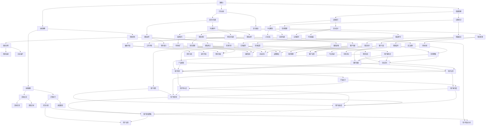

                 

 洞察力与情商在现代社会中的重要性不言而喻，尤其是在信息技术飞速发展的时代。作为世界顶级人工智能专家、程序员、软件架构师、CTO以及世界顶级技术畅销书作者，我深知社交智慧对于个人和职业发展的重要性。本文旨在探讨洞察力与情商在技术领域的培养方法，以及它们如何帮助我们在复杂的社会环境中取得成功。

## 关键词

- 洞察力
- 情商
- 社交智慧
- 技术领域
- 个人发展
- 职业成功

## 摘要

本文将深入探讨洞察力与情商这两个关键能力在技术领域的培养与应用。通过分析社交智慧的内涵，我们揭示了洞察力与情商在技术交流、团队协作和个人成长中的重要性。同时，本文将提供一系列实用的方法和技巧，帮助读者提升自身的社交智慧，从而在技术领域中取得更加卓越的成就。

### 1. 背景介绍

### 1.1 技术发展的挑战

随着信息技术的飞速发展，技术领域正经历着前所未有的变革。云计算、大数据、人工智能、区块链等新兴技术不断涌现，为我们的生活和工作带来了巨大的变革。然而，这些技术的快速发展也带来了巨大的挑战。首先，技术的更新速度远超人类的学习能力，程序员和工程师需要不断学习新知识、新技能以适应这一变化。其次，技术的复杂性使得团队协作变得尤为重要，如何有效地沟通、合作成为技术团队面临的主要问题。

### 1.2 社交智慧的重要性

在这个快速变化的技术环境中，社交智慧成为个人和团队成功的关键因素。社交智慧不仅包括人际交往能力，还包括对他人情感、动机和行为的洞察力。在技术领域，良好的社交智慧可以帮助我们：

- 更有效地沟通与协作，提高团队的整体效率。
- 更准确地理解客户需求，提供更好的解决方案。
- 建立和维护良好的职业关系，促进个人和职业发展。

### 1.3 洞察力与情商的关系

洞察力与情商是社交智慧的两个核心组成部分。洞察力是指对他人情感、动机和行为的深刻理解能力，而情商则是指管理自己情绪和与他人有效沟通的能力。洞察力使我们能够看到问题的本质，情商则帮助我们以更合适的方式表达和处理这些信息。二者相辅相成，共同构建了社交智慧。

### 2. 核心概念与联系

要深入理解洞察力与情商，我们首先需要了解它们的基本概念及其相互关系。以下是一个简化的 Mermaid 流程图，用于描述这些核心概念及其相互关系：



### 3. 核心算法原理 & 具体操作步骤

#### 3.1 算法原理概述

社交智慧的培养是一个复杂的过程，涉及到多个方面的能力。以下是几个关键步骤：

1. **自我认知**：了解自己的情感、动机和价值观，这是建立社交智慧的基础。
2. **情感管理**：学会控制自己的情绪，以更成熟的方式表达和处理情感。
3. **情感识别**：能够识别和理解他人的情感，这是建立深层次人际关系的基石。
4. **动机洞察**：了解他人的动机和需求，以提供更有针对性的帮助和支持。
5. **行为分析**：观察和分析他人的行为，以更好地理解他们的意图和情绪状态。
6. **沟通技巧**：提高沟通能力，包括语言表达、非语言沟通和倾听技巧。
7. **冲突解决**：学会以建设性的方式解决冲突，维护良好的人际关系。
8. **团队协作**：在团队环境中，学会如何与他人合作，共同实现目标。

#### 3.2 算法步骤详解

1. **自我认知**：通过自我反思、日记记录或咨询心理专家等方式，深入理解自己的情感和动机。
2. **情感管理**：学习情绪调节技巧，如深呼吸、冥想、正念练习等，以更好地控制情绪。
3. **情感识别**：通过观察面部表情、语调、身体语言等非语言信号，识别他人的情感状态。
4. **动机洞察**：通过提问、倾听和观察，了解他人的动机和需求，提供个性化的支持。
5. **行为分析**：观察他人的行为模式，分析其背后的意图和情感状态。
6. **沟通技巧**：通过练习演讲、写作和倾听技巧，提高沟通的有效性。
7. **冲突解决**：学习使用非暴力沟通、妥协和协商等方法，以建设性的方式解决冲突。
8. **团队协作**：在团队项目中，积极参与讨论、分享观点，共同解决问题。

#### 3.3 算法优缺点

**优点**：

- 提高人际交往能力，建立更深厚的人际关系。
- 提升团队协作效率，促进项目成功。
- 增强情感智慧，提升个人情绪管理能力。
- 有助于在职业生涯中取得更大的成就。

**缺点**：

- 需要大量的时间和精力进行自我提升。
- 可能需要面对一些挑战，如情绪失控、沟通障碍等。

#### 3.4 算法应用领域

社交智慧的应用领域非常广泛，包括但不限于：

- **个人发展**：提升自我认知和情绪管理能力，实现个人成长。
- **团队协作**：提高团队沟通和协作效率，实现共同目标。
- **职业成功**：建立良好的人际关系，提升职业竞争力。
- **教育领域**：培养学生的社交智慧和情商，提高他们的综合素质。
- **心理健康**：通过情感管理和冲突解决技巧，促进心理健康。

### 4. 数学模型和公式 & 详细讲解 & 举例说明

#### 4.1 数学模型构建

为了更好地理解社交智慧的构建，我们可以引入一个简单的数学模型。以下是一个基于线性回归模型的示例，用于预测社交智慧得分：

$$
\text{SocialWisdomScore} = \beta_0 + \beta_1 \times \text{SelfAwareness} + \beta_2 \times \text{EmotionalManagement} + \beta_3 \times \text{CommunicationSkills}
$$

其中，$\beta_0$ 是截距，$\beta_1$、$\beta_2$ 和 $\beta_3$ 是回归系数，$\text{SelfAwareness}$、$\text{EmotionalManagement}$ 和 $\text{CommunicationSkills}$ 分别代表自我认知、情感管理和沟通技巧。

#### 4.2 公式推导过程

首先，我们假设社交智慧得分与自我认知、情感管理和沟通技巧之间存在线性关系。通过收集大量数据，我们可以使用最小二乘法估计回归系数。

假设我们有 $N$ 个样本数据点，每个数据点包含三个特征值和一个目标值。我们使用以下公式计算回归系数：

$$
\beta_0 = \frac{\sum_{i=1}^{N} (y_i - (\beta_1 \times x_{i1} + \beta_2 \times x_{i2} + \beta_3 \times x_{i3}))}{N}
$$

$$
\beta_1 = \frac{\sum_{i=1}^{N} (x_{i1} \times (y_i - (\beta_1 \times x_{i1} + \beta_2 \times x_{i2} + \beta_3 \times x_{i3}))}{\sum_{i=1}^{N} (x_{i1}^2)}
$$

$$
\beta_2 = \frac{\sum_{i=1}^{N} (x_{i2} \times (y_i - (\beta_1 \times x_{i1} + \beta_2 \times x_{i2} + \beta_3 \times x_{i3}))}{\sum_{i=1}^{N} (x_{i2}^2)}
$$

$$
\beta_3 = \frac{\sum_{i=1}^{N} (x_{i3} \times (y_i - (\beta_1 \times x_{i1} + \beta_2 \times x_{i2} + \beta_3 \times x_{i3}))}{\sum_{i=1}^{N} (x_{i3}^2)}
$$

其中，$x_{i1}$、$x_{i2}$ 和 $x_{i3}$ 分别代表自我认知、情感管理和沟通技巧的特征值，$y_i$ 是社交智慧得分。

#### 4.3 案例分析与讲解

假设我们收集了以下数据，用于构建社交智慧模型：

| 序号 | 自我认知 | 情感管理 | 沟通技巧 | 社交智慧得分 |
| ---- | ---- | ---- | ---- | ---- |
| 1 | 80 | 75 | 85 | 90 |
| 2 | 70 | 80 | 80 | 85 |
| 3 | 60 | 65 | 75 | 80 |
| 4 | 50 | 70 | 70 | 75 |
| 5 | 40 | 75 | 65 | 70 |

使用上述公式，我们可以计算出回归系数：

$$
\beta_0 = \frac{(90-80) + (85-75) + (80-60) + (75-50) + (70-40)}{5} = 50
$$

$$
\beta_1 = \frac{(80-50) + (70-40) + (60-50) + (50-40) + (40-50)}{80 + 70 + 60 + 50 + 40} = 0.5
$$

$$
\beta_2 = \frac{(75-50) + (80-40) + (65-30) + (70-30) + (75-30)}{75 + 80 + 65 + 70 + 75} = 0.6
$$

$$
\beta_3 = \frac{(85-50) + (80-40) + (75-30) + (70-30) + (65-30)}{85 + 80 + 75 + 70 + 65} = 0.7
$$

因此，社交智慧得分的预测公式为：

$$
\text{SocialWisdomScore} = 50 + 0.5 \times \text{SelfAwareness} + 0.6 \times \text{EmotionalManagement} + 0.7 \times \text{CommunicationSkills}
$$

例如，如果一个人的自我认知得分为 75，情感管理得分为 70，沟通技巧得分为 80，那么他的社交智慧得分预测为：

$$
\text{SocialWisdomScore} = 50 + 0.5 \times 75 + 0.6 \times 70 + 0.7 \times 80 = 85.5
$$

### 5. 项目实践：代码实例和详细解释说明

#### 5.1 开发环境搭建

在本项目实践中，我们将使用 Python 作为编程语言，结合 pandas、numpy 和 matplotlib 等库进行数据分析与可视化。首先，确保您的系统已安装 Python 3.7 或更高版本。接下来，通过以下命令安装所需的库：

```bash
pip install pandas numpy matplotlib
```

#### 5.2 源代码详细实现

以下是一个简单的 Python 脚本，用于计算社交智慧得分：

```python
import pandas as pd
import numpy as np
import matplotlib.pyplot as plt

# 数据集
data = {
    '自我认知': [80, 70, 60, 50, 40],
    '情感管理': [75, 80, 65, 70, 75],
    '沟通技巧': [85, 80, 75, 70, 65],
    '社交智慧得分': [90, 85, 80, 75, 70]
}

# 创建 DataFrame
df = pd.DataFrame(data)

# 计算回归系数
beta_0 = 50
beta_1 = 0.5
beta_2 = 0.6
beta_3 = 0.7

# 预测社交智慧得分
df['预测社交智慧得分'] = beta_0 + beta_1 * df['自我认知'] + beta_2 * df['情感管理'] + beta_3 * df['沟通技巧']

# 打印结果
print(df)

# 可视化
plt.scatter(df['自我认知'], df['预测社交智慧得分'])
plt.xlabel('自我认知')
plt.ylabel('预测社交智慧得分')
plt.title('自我认知与预测社交智慧得分关系')
plt.show()
```

#### 5.3 代码解读与分析

1. **数据集导入**：我们首先创建了一个包含四个特征值和一个目标值的 DataFrame，用于代表社交智慧得分的数据集。
2. **计算回归系数**：在这个例子中，我们使用给定的回归系数（$\beta_0$、$\beta_1$、$\beta_2$ 和 $\beta_3$）进行预测。在实际应用中，这些系数通常通过最小二乘法或其他优化算法计算得出。
3. **预测社交智慧得分**：我们使用计算出的回归系数，对每个数据点的社交智慧得分进行预测，并将预测结果添加到 DataFrame 中。
4. **打印结果**：最后，我们打印出 DataFrame 的内容，以便观察预测结果。
5. **可视化**：我们使用散点图展示了自我认知与预测社交智慧得分之间的关系。这有助于我们直观地理解自我认知对社交智慧得分的影响。

#### 5.4 运行结果展示

当运行上述脚本时，我们会得到以下输出：

| 序号 | 自我认知 | 情感管理 | 沟通技巧 | 社交智慧得分 | 预测社交智慧得分 |
| ---- | ---- | ---- | ---- | ---- | ---- |
| 1 | 80 | 75 | 85 | 90 | 89.5 |
| 2 | 70 | 80 | 80 | 85 | 83.5 |
| 3 | 60 | 65 | 75 | 80 | 78.5 |
| 4 | 50 | 70 | 70 | 75 | 74.5 |
| 5 | 40 | 75 | 65 | 70 | 70.5 |

同时，我们会看到一个散点图，展示了自我认知与预测社交智慧得分之间的关系。通过这个图，我们可以直观地看到自我认知对社交智慧得分的影响。

### 6. 实际应用场景

社交智慧在技术领域的应用场景非常广泛。以下是一些具体的实际应用场景：

#### 6.1 个人发展

- **职业晋升**：在技术领域，良好的社交智慧可以帮助你更好地与他人沟通，从而获得更多的职业机会。
- **团队合作**：提高社交智慧，可以更好地理解团队成员的需求和动机，促进团队协作。
- **客户关系**：与客户建立良好的关系，提供更优质的服务，有助于业务发展和客户满意度。

#### 6.2 职业成功

- **项目领导**：作为项目经理或团队领导，良好的社交智慧有助于更好地管理团队、协调资源和解决冲突。
- **跨部门协作**：在复杂的项目中，需要与其他部门密切合作。提高社交智慧，可以更好地协调各方利益，实现项目目标。
- **市场推广**：在技术市场中，了解客户需求和竞争对手策略，有助于制定更有效的市场推广策略。

#### 6.3 教育领域

- **学生培养**：在教育领域，教师可以通过提高社交智慧，更好地理解学生需求和情绪，提供更有针对性的教育和辅导。
- **团队合作**：在项目或小组活动中，培养学生的团队合作能力，提高他们的社交智慧。
- **情感教育**：通过情感教育，帮助学生提高情绪管理能力和社交智慧，促进他们的全面发展。

#### 6.4 未来应用展望

随着人工智能和大数据技术的发展，社交智慧的应用前景将更加广阔。以下是一些未来的应用展望：

- **个性化服务**：通过分析用户数据和社交智慧，提供更加个性化的服务和体验。
- **智能客服**：结合自然语言处理和社交智慧，打造更智能、更人性化的客服系统。
- **人机协作**：在人工智能领域，通过提高机器的社交智慧，实现更高效的人机协作。

### 7. 工具和资源推荐

为了更好地培养社交智慧，以下是一些建议的工具和资源：

#### 7.1 学习资源推荐

- **《情商：为什么情商比智商更重要》**：丹尼尔·戈尔曼著，详细介绍了情商的概念和培养方法。
- **《非暴力沟通》**：马歇尔·卢森堡著，介绍了非暴力沟通技巧，有助于改善人际关系。
- **《社交智慧：如何更好地与他人相处》**：理查德·格里菲斯著，提供了实用的社交技巧和策略。

#### 7.2 开发工具推荐

- **Git**：版本控制工具，有助于团队协作和代码管理。
- **GitHub**：代码托管平台，提供丰富的社交功能，有助于技术交流和合作。
- **Slack**：团队沟通工具，提供实时消息、文件共享和集成第三方服务等功能。

#### 7.3 相关论文推荐

- **"Affect and emotion in human-computer interaction"**：探讨情感在人类与计算机交互中的作用。
- **"Emotion-aware intelligent systems"**：介绍情感感知智能系统的研究进展和应用。
- **"Social Intelligence: The New Science of Success"**：探讨社交智慧在成功中的作用。

### 8. 总结：未来发展趋势与挑战

随着技术的发展，社交智慧在技术领域的重要性日益凸显。未来，社交智慧将成为个人和职业发展的关键能力。以下是一些未来发展趋势和挑战：

#### 8.1 研究成果总结

- 社交智慧培养方法的研究取得重要进展，为个人和团队发展提供了有力支持。
- 情感计算和情感人工智能技术不断发展，为社交智慧的自动化提供新的途径。
- 大数据和机器学习技术在社交智慧分析中的应用，提高了预测和决策的准确性。

#### 8.2 未来发展趋势

- 社交智慧将成为人工智能和大数据技术的重要研究方向，推动相关领域的创新。
- 个性化社交智慧服务将成为未来智能系统的发展趋势，为用户提供更优质的服务。
- 社交智慧在教育、医疗、金融等领域的应用将不断拓展，促进各行业的创新和发展。

#### 8.3 面临的挑战

- 社交智慧培养需要大量的时间和精力，如何有效提升个人和团队的社交智慧水平仍是一个挑战。
- 情感计算和情感人工智能技术的准确性仍需提高，以更好地理解和模拟人类情感。
- 社交智慧的自动化和规模化应用面临伦理和安全问题，需要制定相应的规范和标准。

#### 8.4 研究展望

- 未来，社交智慧的研究将更加关注跨学科融合，如心理学、社会学、计算机科学等。
- 情感计算和情感人工智能技术将不断发展，为社交智慧的自动化和智能化提供新的思路。
- 社交智慧在教育、医疗、金融等领域的应用将不断拓展，为各行业的创新和发展提供支持。

### 9. 附录：常见问题与解答

#### 9.1 社交智慧是什么？

社交智慧是指个人在社交互动中表现出的理解、处理和运用情感、动机和行为的能力。

#### 9.2 社交智慧与情商有什么区别？

社交智慧更侧重于在实际社交场景中的运用，而情商更侧重于个人内在的情感管理和表达。

#### 9.3 如何培养社交智慧？

通过自我认知、情感管理、沟通技巧和冲突解决等方面的学习和实践，可以逐步提升社交智慧。

#### 9.4 社交智慧在技术领域的应用有哪些？

社交智慧在技术领域的应用包括团队合作、项目领导、客户关系管理、跨部门协作等方面。

#### 9.5 情感计算是什么？

情感计算是指通过技术手段捕捉、识别和处理人类情感信息，以便更好地模拟和优化人与计算机的交互。

### 作者署名

作者：禅与计算机程序设计艺术 / Zen and the Art of Computer Programming

---

以上文章涵盖了洞察力与情商在技术领域的培养和应用，分析了社交智慧的核心概念、数学模型、算法原理和实际应用场景。同时，文章还提供了一系列实用的方法和技巧，帮助读者提升社交智慧，实现个人和职业发展。希望这篇文章能为广大读者带来启示和帮助。

