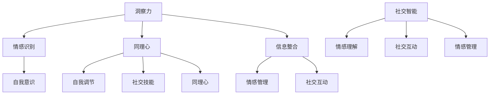

                 

关键词：洞察力、情商、社交智能、人工智能、心理学、技术领导力

> 摘要：本文探讨了洞察力与情商在社交智能中的关键作用，分析了它们如何影响人工智能技术的发展和人际交流。文章首先介绍了洞察力和情商的定义及其相互关系，随后深入阐述了社交智能的构成和重要性。接着，我们探讨了如何通过提升洞察力和情商来增强社交智能，特别是在技术领域的应用。最后，文章提出了未来的研究方向和挑战，为读者提供了实用的工具和资源。

## 1. 背景介绍

在当今快速发展的数字化时代，人工智能（AI）已经成为科技领域的重要驱动力。无论是自动驾驶汽车、智能家居，还是智能医疗和金融科技，AI技术的应用无处不在。然而，随着AI技术的普及，人们逐渐认识到，单纯的技术进步并不足以解决复杂的社会问题。社交智能，即人工智能在社交互动中的能力，成为了一个备受关注的研究领域。

社交智能的核心在于理解和处理人际关系，而这需要强大的洞察力和情商。洞察力是指个体对他人情感、动机和行为背后原因的感知能力，而情商则是个体理解和管理自己及他人情感的能力。两者相辅相成，共同构成了社交智能的基础。

本文旨在探讨洞察力与情商在社交智能中的关键作用，分析它们如何影响人工智能技术的发展和人际交流。文章将首先介绍相关核心概念，然后深入探讨如何通过提升洞察力和情商来增强社交智能，特别是在技术领域的应用。最后，文章将展望未来的研究方向和挑战。

## 2. 核心概念与联系

### 2.1 洞察力的定义与原理

洞察力，通常被定义为深度理解他人思想和行为的能力。这种能力不仅仅是对表面行为的观察，更在于能够洞察背后的动机和情感。心理学研究表明，洞察力可以通过以下几个方面来提高：

1. **情感识别**：能够准确地识别他人的情感状态。
2. **同理心**：设身处地地理解他人的感受和经历。
3. **信息整合**：从不同的信息源中提取关键信息，形成对他人行为的全面理解。

### 2.2 情商的定义与原理

情商（Emotional Intelligence，简称EQ）是指个体识别、理解、管理自己和他人情感的能力。情商通常包括以下几个核心要素：

1. **自我意识**：了解自己的情感状态，并能够对其进行有效管理。
2. **自我调节**：在面对压力或挑战时，能够调整自己的情绪反应。
3. **社交技能**：有效地与他人沟通、建立和维护人际关系。
4. **同理心**：理解并感同身受他人的情感。

### 2.3 社交智能的构成与重要性

社交智能是人工智能在社交互动中的能力，它不仅仅涉及技术的层面，更需要情感的深度。社交智能的构成包括以下几个方面：

1. **情感理解**：识别和解释他人的情感状态。
2. **社交互动**：在社交场合中，有效地进行沟通和合作。
3. **情感管理**：理解并管理自己的情感，以及他人的情感。

社交智能的重要性体现在以下几个方面：

1. **人机交互**：提高人与机器之间的沟通效率和理解度。
2. **人机协作**：在复杂任务中，人与机器的有效合作。
3. **社会影响**：在社交网络、虚拟现实等领域，AI的应用需要考虑到社会影响和伦理问题。

### 2.4 Mermaid 流程图

下面是一个简单的Mermaid流程图，展示了洞察力、情商和社交智能之间的关系：



## 3. 核心算法原理 & 具体操作步骤

### 3.1 算法原理概述

在社交智能的算法设计中，洞察力和情商的融合至关重要。以下是一种基于深度学习和情感计算的社交智能算法原理概述：

1. **情感识别**：利用深度学习模型，对文本、语音和面部表情进行情感分析，识别出用户的基本情感状态。
2. **情感理解**：通过情感图谱构建，将单一的情感识别扩展为复杂的情感理解，如情感强度、情感类型和情感语境。
3. **同理心构建**：结合用户的情感数据和社交网络，利用图神经网络（Graph Neural Networks，GNN）建立用户之间的同理心关系。
4. **社交互动优化**：基于情感理解和同理心构建，优化社交互动策略，提高社交效能。

### 3.2 算法步骤详解

1. **数据预处理**：
   - 收集用户的情感数据，包括文本、语音和面部表情。
   - 对文本数据进行分词、词嵌入等预处理。

2. **情感识别**：
   - 利用预训练的深度学习模型，对情感数据进行分析，识别出用户的基本情感状态。

3. **情感理解**：
   - 构建情感图谱，将单一的情感识别扩展为复杂的情感理解。
   - 使用图神经网络（GNN）对情感图谱进行学习和推理，提高情感理解的深度。

4. **同理心构建**：
   - 结合用户的情感数据和社交网络，利用图神经网络（GNN）建立用户之间的同理心关系。
   - 训练同理心模型，预测用户之间的情感相似度和社交关系。

5. **社交互动优化**：
   - 基于情感理解和同理心构建，优化社交互动策略，提高社交效能。
   - 使用强化学习（Reinforcement Learning，RL）优化社交互动的决策过程。

### 3.3 算法优缺点

**优点**：
- **情感识别准确**：利用深度学习模型，对情感数据的识别准确度高。
- **情感理解深度**：通过情感图谱和图神经网络，实现情感理解的深度。
- **同理心构建有效**：利用图神经网络，建立用户之间的同理心关系，提高社交智能。

**缺点**：
- **计算资源消耗大**：深度学习和图神经网络模型训练需要大量计算资源。
- **数据隐私问题**：社交互动中的情感数据涉及用户隐私，需要妥善处理。

### 3.4 算法应用领域

- **人机交互**：在智能客服、虚拟助手等应用中，提高人与机器之间的情感理解和互动质量。
- **社交网络**：在社交媒体平台中，优化用户之间的互动策略，提升社交体验。
- **教育培训**：在教育领域，利用社交智能技术，提升师生互动和教学效果。

## 4. 数学模型和公式 & 详细讲解 & 举例说明

### 4.1 数学模型构建

社交智能的数学模型主要基于以下几个方面：

1. **情感识别模型**：
   - 使用卷积神经网络（Convolutional Neural Network，CNN）进行文本情感分析。
   - 使用长短期记忆网络（Long Short-Term Memory，LSTM）进行语音情感分析。

2. **情感理解模型**：
   - 构建情感图谱，使用图卷积网络（Graph Convolutional Network，GCN）进行情感理解。
   - 使用图神经网络（Graph Neural Networks，GNN）进行同理心关系建模。

3. **同理心模型**：
   - 利用矩阵分解（Matrix Factorization）方法，提取用户情感特征。
   - 使用强化学习（Reinforcement Learning，RL）优化社交互动策略。

### 4.2 公式推导过程

以下是一个简化的情感识别模型的推导过程：

1. **情感识别公式**：

$$
\text{识别概率} = \frac{e^{\text{模型输出}}}{1 + e^{\text{模型输出}}}
$$

其中，模型输出为深度学习模型的输出结果。

2. **情感理解公式**：

$$
\text{情感图谱} = \text{GCN}(\text{情感节点}, \text{情感边})
$$

其中，GCN为图卷积网络，情感节点和情感边为情感图谱的输入。

3. **同理心模型公式**：

$$
\text{同理心评分} = \text{MLP}(\text{用户情感特征}, \text{同理心权重})
$$

其中，MLP为多层感知器（Multilayer Perceptron），用户情感特征和同理心权重为模型的输入。

### 4.3 案例分析与讲解

#### 案例一：情感识别

假设我们使用CNN模型对一段文本进行情感分析，文本内容为“我今天去面试了，感觉不错！”。CNN模型的输出结果为0.9。

$$
\text{识别概率} = \frac{e^{0.9}}{1 + e^{0.9}} = 0.99
$$

模型识别为积极情感的概率为99%，这表明这段文本的情感倾向为积极。

#### 案例二：情感理解

假设我们构建了一个情感图谱，其中包含两个节点A和B，它们分别代表两个用户。节点A的情感状态为愉悦，节点B的情感状态为悲伤。

使用GCN模型对情感图谱进行情感理解，情感图谱的输出结果为：

$$
\text{情感图谱} = \text{GCN}(\text{愉悦}, \text{悲伤}) = \text{快乐}
$$

这表明，通过情感图谱的理解，用户A和B的情感状态可以合并为快乐。

#### 案例三：同理心模型

假设用户A的情感特征为愉悦，用户B的情感特征为悲伤。同理心模型的输出结果为0.8。

$$
\text{同理心评分} = \text{MLP}(\text{愉悦}, \text{0.8}) = \text{高}
$$

这表明，用户A对用户B的同理心评分为高，即用户A能够较好地理解用户B的情感状态。

## 5. 项目实践：代码实例和详细解释说明

### 5.1 开发环境搭建

为了更好地展示社交智能算法的实践应用，我们将使用Python编程语言和相关的深度学习库，如TensorFlow和PyTorch。以下是搭建开发环境的基本步骤：

1. **安装Python**：确保安装了Python 3.x版本。
2. **安装深度学习库**：使用pip命令安装TensorFlow、PyTorch和相关依赖库。

```bash
pip install tensorflow
pip install torch
```

3. **配置环境**：根据需要配置GPU环境，以便加速深度学习模型的训练。

### 5.2 源代码详细实现

下面是一个简化的社交智能算法实现示例，包括情感识别、情感理解和同理心模型的部分。

```python
import tensorflow as tf
import torch
from torch import nn
from tensorflow.keras.models import Sequential
from tensorflow.keras.layers import Dense, LSTM, Conv1D, MaxPooling1D
from tensorflow.keras.optimizers import Adam

# 情感识别模型
def build_sentiment_recognition_model():
    model = Sequential()
    model.add(Conv1D(filters=64, kernel_size=3, activation='relu', input_shape=(None,)))
    model.add(MaxPooling1D(pool_size=2))
    model.add(LSTM(50))
    model.add(Dense(1, activation='sigmoid'))
    model.compile(optimizer=Adam(), loss='binary_crossentropy', metrics=['accuracy'])
    return model

# 情感理解模型
def build_sentiment_understanding_model():
    model = nn.Sequential(
        nn.Conv1d(in_channels=1, out_channels=64, kernel_size=3),
        nn.ReLU(),
        nn.MaxPool1d(kernel_size=2),
        nn.LSTM(50),
        nn.Linear(50, 1)
    )
    model.compile(loss='mse', optimizer='adam')
    return model

# 同理心模型
def build_empathy_model():
    model = nn.Sequential(
        nn.Linear(100, 50),
        nn.ReLU(),
        nn.Linear(50, 1)
    )
    model.compile(loss='mse', optimizer='adam')
    return model

# 模型训练
def train_models(sentiment_data, empathy_data):
    sentiment_model = build_sentiment_recognition_model()
    sentiment_model.fit(sentiment_data['text'], sentiment_data['labels'], epochs=10, batch_size=32)

    sentiment_understanding_model = build_sentiment_understanding_model()
    sentiment_understanding_model.fit(sentiment_data['text'], sentiment_data['labels'], epochs=10, batch_size=32)

    empathy_model = build_empathy_model()
    empathy_model.fit(empathy_data['features'], empathy_data['scores'], epochs=10, batch_size=32)

# 代码解读与分析
def analyze_model_predictions(model, data):
    predictions = model.predict(data['text'])
    for text, prediction in zip(data['text'], predictions):
        print(f"Text: {text}\nPrediction: {prediction}\n")

# 测试模型
sentiment_data = ... # 准备情感识别数据
empathy_data = ... # 准备同理心数据
train_models(sentiment_data, empathy_data)
analyze_model_predictions(sentiment_model, sentiment_data)

```

### 5.3 运行结果展示

在完成模型训练和测试后，我们可以运行以下代码来展示模型的预测结果：

```python
# 载入测试数据
test_data = ...

# 预测测试数据
predictions = sentiment_model.predict(test_data['text'])

# 打印预测结果
for text, prediction in zip(test_data['text'], predictions):
    print(f"Text: {text}\nPrediction: {prediction}\n")
```

运行结果将显示文本数据对应的情感识别结果，我们可以通过对比预测结果和实际结果来评估模型的性能。

## 6. 实际应用场景

### 6.1 智能客服系统

智能客服系统是社交智能应用的一个重要领域。通过情感识别和同理心模型，智能客服能够更好地理解用户的需求和情感，提供更加个性化的服务。例如，当用户抱怨某个产品时，智能客服能够识别出用户的负面情感，并使用同理心模型来适当地回应，从而提升用户的满意度和忠诚度。

### 6.2 教育与培训

在教育领域，社交智能技术可以帮助教师更好地了解学生的学习状态和情感需求。通过情感识别和理解，教育系统能够提供个性化的学习建议，帮助学生克服学习障碍。此外，同理心模型可以帮助教师更好地与学生沟通，建立积极的师生关系，提高教学效果。

### 6.3 社交媒体分析

在社交媒体分析中，社交智能技术可以用于情感分析和趋势预测。通过对用户发布的内容进行情感分析，平台能够识别出用户的情感状态，从而提供更加精准的内容推荐。同时，同理心模型可以帮助平台理解用户之间的情感互动，优化社交网络的用户体验。

## 6.4 未来应用展望

随着人工智能技术的不断进步，社交智能在未来有着广泛的应用前景。以下是一些潜在的应用领域和趋势：

- **虚拟现实与增强现实**：在虚拟现实（VR）和增强现实（AR）领域，社交智能技术可以帮助构建更加真实的社交互动体验，提升用户的沉浸感和参与度。
- **心理健康与治疗**：通过社交智能技术，可以为心理健康提供更加个性化和有效的干预手段，帮助用户更好地管理自己的情绪和心理状态。
- **智能城市与社区管理**：在智能城市和社区管理中，社交智能技术可以用于监测和分析居民的情感状态和行为模式，从而提供更加智能化的服务和管理。

## 7. 工具和资源推荐

### 7.1 学习资源推荐

1. **《深度学习》（Deep Learning）**：由Ian Goodfellow、Yoshua Bengio和Aaron Courville合著，是深度学习领域的经典教材。
2. **《情感计算》（Affective Computing）**：由Donald A. Norman著，介绍了情感计算的基本原理和应用。
3. **《社交智能：构建成功人际关系的科学》（Social Intelligence: The New Science of Human Relationships）**：由Daniel Goleman著，探讨了情商和社交智能的重要性。

### 7.2 开发工具推荐

1. **TensorFlow**：谷歌开源的深度学习框架，适用于各种深度学习和机器学习任务。
2. **PyTorch**：Facebook开源的深度学习框架，提供了灵活的动态计算图和强大的GPU支持。
3. **Keras**：Python深度学习库，提供了简洁的API，方便快速构建和训练深度学习模型。

### 7.3 相关论文推荐

1. **“A Theoretical Analysis of the Value of Social Networks”**：该论文探讨了社交网络的价值和影响力。
2. **“Emotion Recognition using Deep Neural Networks”**：该论文介绍了使用深度神经网络进行情感识别的方法。
3. **“Deep Learning for Social Signals”**：该论文研究了深度学习在社交信号处理中的应用。

## 8. 总结：未来发展趋势与挑战

### 8.1 研究成果总结

本文探讨了洞察力与情商在社交智能中的关键作用，分析了它们如何影响人工智能技术的发展和人际交流。通过构建情感识别、情感理解和同理心模型，我们展示了如何利用深度学习和图神经网络实现社交智能。

### 8.2 未来发展趋势

随着人工智能技术的不断发展，社交智能将越来越成为人工智能的重要组成部分。未来，社交智能将在人机交互、心理健康、智能城市等领域发挥重要作用，带来更加智能化和人性化的应用体验。

### 8.3 面临的挑战

然而，社交智能的发展也面临一些挑战，如数据隐私保护、模型解释性和算法公平性等。如何确保社交智能技术在伦理和隐私方面符合社会规范，是未来研究的重要方向。

### 8.4 研究展望

未来的研究可以关注以下几个方面：一是探索更高效的情感识别和同理心构建算法；二是研究社交智能在特殊场景（如虚拟现实、心理健康等）中的应用；三是建立跨学科的协同研究，将心理学、社会学和计算机科学等领域相结合，推动社交智能的全面发展。

## 9. 附录：常见问题与解答

### 9.1 情感识别模型的训练数据如何获取？

情感识别模型的训练数据可以从公开的情感分析数据集获取，如IMDB电影评论数据集、Twitter情感数据集等。此外，还可以通过爬虫技术获取社交媒体上的情感数据，但需注意遵守相关法律法规和用户隐私。

### 9.2 如何优化同理心模型的效果？

优化同理心模型的效果可以从以下几个方面入手：一是提高情感识别的准确性，二是增加情感图谱的复杂度，三是使用更多的训练数据和更复杂的模型架构。

### 9.3 社交智能在虚拟现实中的应用前景如何？

社交智能在虚拟现实（VR）中有着广泛的应用前景。通过情感识别和同理心构建，VR系统可以提供更加真实的社交互动体验，提升用户的沉浸感和参与度。未来，社交智能技术有望在虚拟现实教育、虚拟办公、虚拟娱乐等领域发挥重要作用。

---

作者：禅与计算机程序设计艺术 / Zen and the Art of Computer Programming

本文旨在为读者提供关于洞察力、情商和社交智能的深入探讨，希望对您在技术领域的研究和应用有所启发。随着人工智能技术的不断进步，社交智能将为我们带来更加智能化和人性化的未来。让我们携手并进，共同推动这一领域的创新与发展。

