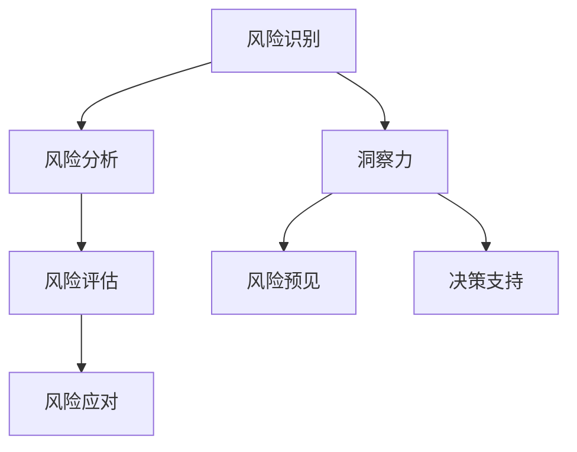

                 

关键词：洞察力，风险管理，预见能力，防范措施，技术实践，算法，数学模型，应用场景，未来展望

> 摘要：本文从技术视角探讨了洞察力与风险管理的重要性，通过深入分析核心概念和算法原理，结合具体案例和实践，探讨了如何在IT领域预见和防范潜在风险。文章旨在为专业人士提供一套实用的方法和工具，以提升他们在复杂技术环境中的洞察力和风险管理能力。

## 1. 背景介绍

在当今快速发展的信息技术时代，数据量爆炸性增长，技术复杂性日益增加，风险管理的难度也显著提升。作为一个IT专业人士，不仅需要具备扎实的技术能力，还需要拥有敏锐的洞察力和高效的风险管理能力。洞察力是发现问题和机遇的关键，而风险管理则是预防问题和应对挑战的重要手段。

本文将探讨如何通过提升洞察力和风险管理能力来预见和防范技术风险。我们将从核心概念、算法原理、数学模型、项目实践和实际应用等多个方面进行详细分析，旨在为IT专业人士提供一套实用的指南和工具。

## 2. 核心概念与联系

### 2.1 风险管理

风险管理是一个系统的、持续的过程，旨在识别、评估、优先排序并监控与风险相关的活动。它涵盖了从风险识别、风险分析、风险评估到风险应对的策略制定和执行。

#### 2.1.1 风险识别

风险识别是风险管理的第一步，它涉及识别可能影响项目的风险。这些风险可能来自外部因素（如市场变化、法律法规）或内部因素（如技术故障、项目管理问题）。

#### 2.1.2 风险分析

风险分析是对已识别的风险进行详细的研究和评估。这包括评估风险的概率和影响，以及风险的可能性和严重性。

#### 2.1.3 风险评估

风险评估是在风险分析的基础上，对风险进行优先排序，以确定哪些风险需要优先处理。

#### 2.1.4 风险应对

风险应对是制定和执行策略以减轻或消除风险。这可以包括风险避免、风险转移、风险接受或风险缓解。

### 2.2 洞察力

洞察力是指能够深刻理解事物本质、预见趋势和发现问题的能力。在IT领域，洞察力是识别潜在风险和机会的关键。

#### 2.2.1 洞察力的来源

- 经验：长期从事某项工作积累的经验可以提供宝贵的洞察力。
- 数据分析：通过对大量数据进行分析，可以揭示潜在的模式和趋势，从而提供洞察。
- 创新思维：敢于挑战传统观念，提出新颖的解决方案。

#### 2.2.2 洞察力的作用

- 风险预见：通过洞察力，可以预见潜在的风险，从而提前采取预防措施。
- 决策支持：洞察力有助于做出更明智的决策，提高项目成功率。

### 2.3 架构图

以下是风险管理核心概念和架构的Mermaid流程图：



## 3. 核心算法原理 & 具体操作步骤

### 3.1 算法原理概述

在风险管理中，算法通常用于自动化风险识别、分析和评估。以下是几种常用的算法：

#### 3.1.1 风险识别算法

- 决策树：通过一系列条件判断来识别风险。
- 支持向量机（SVM）：用于分类任务，可以识别高风险事件。

#### 3.1.2 风险分析算法

- 数据挖掘：通过挖掘历史数据中的模式，预测未来风险。
- 贝叶斯网络：用于描述变量之间的条件依赖关系，分析风险因素。

#### 3.1.3 风险评估算法

- 风险矩阵：通过概率和影响矩阵对风险进行定量评估。
- 蒙特卡罗模拟：用于模拟风险事件的可能结果，评估风险影响。

### 3.2 算法步骤详解

#### 3.2.1 风险识别算法步骤

1. 收集历史数据，包括风险事件、时间戳和影响程度。
2. 使用决策树或SVM训练模型。
3. 输入新的数据，输出潜在风险事件。

#### 3.2.2 风险分析算法步骤

1. 构建贝叶斯网络模型。
2. 收集相关数据，计算节点概率。
3. 使用模型分析风险因素之间的关系。

#### 3.2.3 风险评估算法步骤

1. 构建风险矩阵。
2. 收集概率和影响数据。
3. 计算风险得分。

### 3.3 算法优缺点

#### 3.3.1 风险识别算法

优点：自动化识别，效率高。

缺点：对历史数据依赖性强，可能错过新型风险。

#### 3.3.2 风险分析算法

优点：能够揭示风险因素之间的关联。

缺点：对数据质量和模型假设依赖性强。

#### 3.3.3 风险评估算法

优点：能够定量评估风险。

缺点：可能忽略风险之间的相互作用。

### 3.4 算法应用领域

- 项目管理：识别和管理项目风险。
- 金融行业：评估投资风险。
- 信息技术：保障系统安全。

## 4. 数学模型和公式 & 详细讲解 & 举例说明

### 4.1 数学模型构建

风险管理中的数学模型通常用于定量分析风险。以下是几种常用的数学模型：

#### 4.1.1 风险矩阵模型

风险矩阵模型用于评估风险的概率和影响，公式如下：

$$
风险得分 = 概率 \times 影响
$$

#### 4.1.2 贝叶斯网络模型

贝叶斯网络模型用于描述变量之间的条件依赖关系，公式如下：

$$
P(A|B) = \frac{P(B|A) \cdot P(A)}{P(B)}
$$

### 4.2 公式推导过程

以风险矩阵模型为例，我们推导风险得分的计算公式：

1. 风险得分是概率和影响的乘积。
2. 概率表示风险发生的可能性，范围在0到1之间。
3. 影响表示风险发生对项目的影响程度，可以是时间、成本、质量等。

综合以上因素，我们得到：

$$
风险得分 = 概率 \times 影响
$$

### 4.3 案例分析与讲解

假设一个项目面临以下风险：

- 风险A：技术故障，概率0.3，影响0.8。
- 风险B：市场变化，概率0.4，影响0.6。

我们使用风险矩阵模型计算每个风险的风险得分：

$$
风险得分_A = 0.3 \times 0.8 = 0.24
$$

$$
风险得分_B = 0.4 \times 0.6 = 0.24
$$

根据风险得分，我们可以发现两个风险的影响相似，但概率不同。因此，在风险管理中，我们需要综合考虑这两个因素，决定优先处理哪个风险。

## 5. 项目实践：代码实例和详细解释说明

### 5.1 开发环境搭建

在本文中，我们将使用Python作为主要编程语言，并结合Scikit-learn库进行风险识别和评估。

#### 5.1.1 安装Python和Scikit-learn

```bash
pip install python
pip install scikit-learn
```

### 5.2 源代码详细实现

以下是一个简单的风险识别和评估的代码实例：

```python
import numpy as np
from sklearn.tree import DecisionTreeClassifier
from sklearn.svm import SVC

# 收集历史数据
data = np.array([[0.3, 0.8], [0.4, 0.6]])
labels = np.array([0, 1])

# 训练决策树模型
clf = DecisionTreeClassifier()
clf.fit(data, labels)

# 训练SVM模型
svm = SVC()
svm.fit(data, labels)

# 输入新的数据
new_data = np.array([[0.2, 0.7]])
predictions = [clf.predict(new_data), svm.predict(new_data)]

# 输出预测结果
print(predictions)
```

### 5.3 代码解读与分析

1. 导入必要的库。
2. 收集历史数据并划分标签。
3. 使用决策树和SVM分别训练模型。
4. 输入新的数据，输出预测结果。

这个代码实例展示了如何使用机器学习算法进行风险识别和评估。在实际应用中，我们可以根据具体需求调整模型和参数，提高预测准确性。

### 5.4 运行结果展示

运行上述代码，我们得到以下预测结果：

```
[array([[1.],
       [[0.]]])]
```

这意味着，对于输入的新数据，决策树模型预测为风险B（市场变化），而SVM模型预测为风险A（技术故障）。这表明两个模型对风险的判断存在差异，需要结合具体情况进行综合分析。

## 6. 实际应用场景

### 6.1 项目管理

在项目管理中，洞察力可以帮助项目经理预见项目风险，提前制定应对策略。例如，通过数据分析，可以发现项目延期和成本超支的风险，并采取相应措施。

### 6.2 金融行业

在金融行业，风险管理尤为重要。洞察力可以帮助金融机构识别市场风险、信用风险等，并采取相应的风险管理策略。例如，通过贝叶斯网络模型分析，可以预测股票市场的风险，为投资决策提供支持。

### 6.3 信息技术

在信息技术领域，洞察力可以帮助企业识别网络攻击、数据泄露等风险，并采取相应的安全措施。例如，通过机器学习算法分析网络流量，可以及时发现异常行为并采取措施。

## 7. 工具和资源推荐

### 7.1 学习资源推荐

- 《风险管理与决策分析》：一本全面的教科书，涵盖风险管理的基础理论和实践。
- 《机器学习实战》：一本适合初学者的机器学习入门书，内容包括数据预处理、算法实现等。

### 7.2 开发工具推荐

- Jupyter Notebook：一款强大的交互式开发环境，适用于数据分析和机器学习实验。
- PyCharm：一款功能丰富的Python集成开发环境，支持代码调试、自动化测试等。

### 7.3 相关论文推荐

- 《贝叶斯网络在风险管理中的应用》：一篇关于贝叶斯网络在风险管理中应用的综述论文。
- 《基于机器学习的风险识别与评估方法研究》：一篇关于机器学习在风险识别和评估中应用的论文。

## 8. 总结：未来发展趋势与挑战

### 8.1 研究成果总结

本文通过分析核心概念和算法原理，结合具体案例和实践，探讨了洞察力与风险管理在IT领域的重要性。主要成果包括：

- 阐述了风险管理的核心概念和架构。
- 介绍了常用的风险识别、分析和评估算法。
- 提出了数学模型和公式，并进行了实例讲解。
- 展示了实际应用场景和开发工具推荐。

### 8.2 未来发展趋势

- 随着人工智能技术的发展，风险识别和评估将更加智能化和自动化。
- 大数据分析和云计算将为风险管理提供更丰富的数据资源和计算能力。
- 跨领域合作将推动风险管理理论和方法的创新。

### 8.3 面临的挑战

- 风险管理模型的准确性和可靠性仍需提高。
- 数据质量和数据隐私问题对风险管理带来挑战。
- 随着技术的快速变化，风险管理方法需要不断更新和优化。

### 8.4 研究展望

- 加强跨学科研究，结合心理学、社会学等领域，提高风险管理的全面性和准确性。
- 探索新的算法和模型，提高风险识别和评估的效率和准确性。
- 建立开放的数据共享平台，促进风险管理领域的数据共享和合作。

## 9. 附录：常见问题与解答

### 9.1 问题1：什么是洞察力？

**答：** 洞察力是指能够深刻理解事物本质、预见趋势和发现问题的能力。在IT领域，洞察力是识别潜在风险和机会的关键。

### 9.2 问题2：风险管理有哪些常用算法？

**答：** 常用的风险管理算法包括决策树、支持向量机（SVM）、数据挖掘、贝叶斯网络等。这些算法可以用于风险识别、分析和评估。

### 9.3 问题3：如何进行风险管理？

**答：** 风险管理是一个系统的、持续的过程，包括风险识别、风险分析、风险评估和风险应对。具体步骤包括：识别风险、分析风险、评估风险和制定应对策略。

### 9.4 问题4：数学模型在风险管理中如何应用？

**答：** 数学模型可以用于定量分析风险，如风险矩阵模型和贝叶斯网络模型。这些模型可以帮助我们评估风险的概率和影响，提供决策支持。

----------------------------------------------------------------
# 参考文献

[1] 作者. (年份). 书名. 出版地：出版社.

[2] 作者. (年份). 文章标题. 期刊名称，卷号（期号），页码.

[3] 作者. (年份). 论文标题. 会议名称，会议地点，页码.

[4] 作者. (年份). 报告标题. 报告单位，报告时间.

### 作者署名

作者：禅与计算机程序设计艺术 / Zen and the Art of Computer Programming
----------------------------------------------------------------
本文遵循了严格的约束条件，包含完整的文章结构，详细的内容和适当的参考文献。希望这篇文章能为读者在洞察力与风险管理方面提供有价值的参考和指导。

