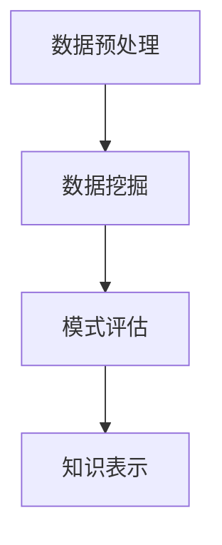

                 

关键词：洞察力，知识发现引擎，技术发展，数据分析，信息提取

在信息技术飞速发展的今天，数据已经成为企业和组织的核心资产。然而，如何从海量数据中快速准确地提取有价值的信息，成为了一项极具挑战的任务。这便是知识发现引擎（Knowledge Discovery Engine，简称KDE）的重要使命。本文旨在探讨知识发现引擎的核心概念、工作原理、数学模型以及在实际应用中的重要作用，并展望其未来的发展趋势与挑战。

## 1. 背景介绍

随着互联网和物联网的普及，全球数据量呈指数级增长。根据国际数据公司（IDC）的统计，全球数据量预计在2025年将达到163ZB。如此庞大的数据量，如何从中发现有价值的信息，成为了数据科学领域面临的一个严峻挑战。知识发现引擎作为一种先进的数据分析工具，旨在帮助用户从数据中提取模式、关联和趋势，为决策提供科学依据。

知识发现引擎的概念最早由Fayyad等人于1996年提出，其核心思想是从大量数据中自动发现知识，这些知识可以是隐含的、未知的，并且对于用户来说是具有价值的。知识发现引擎通常包括数据预处理、数据挖掘、模式评估和知识表示等关键环节。

## 2. 核心概念与联系

### 2.1 数据预处理

数据预处理是知识发现引擎中的第一步，其目的是将原始数据转换为适合数据挖掘的形式。数据预处理包括数据清洗、数据整合、数据转换和数据归一化等步骤。数据清洗主要是去除数据中的噪声和异常值；数据整合则是将多个数据源中的数据进行合并；数据转换是将数据从一种格式转换为另一种格式，以便于后续处理；数据归一化则是通过缩放或变换，使得数据具有相同的尺度。

### 2.2 数据挖掘

数据挖掘是知识发现引擎的核心环节，它通过一系列算法和技术，从大量数据中自动发现模式、关联和趋势。常见的数据挖掘算法包括分类、聚类、关联规则挖掘、异常检测等。数据挖掘的目标是发现数据中的隐含知识，这些知识对于用户来说是有价值的。

### 2.3 模式评估

模式评估是对数据挖掘结果的质量进行评估，以确保发现的知识是真正有价值的。模式评估包括模式新颖性、模式重要性、模式可靠性等指标。通过模式评估，用户可以确定哪些模式是值得关注的。

### 2.4 知识表示

知识表示是将挖掘到的模式转化为易于理解的形式，以便用户能够更好地利用这些知识。知识表示可以采用可视化、报告、图表等多种形式。

### 2.5 Mermaid 流程图

以下是一个简单的Mermaid流程图，展示了知识发现引擎的基本工作流程：



## 3. 核心算法原理 & 具体操作步骤

### 3.1 算法原理概述

知识发现引擎的核心算法主要包括分类、聚类、关联规则挖掘等。这些算法的基本原理如下：

- **分类**：通过已知的分类结果，构建一个分类模型，然后使用该模型对未知数据进行分类。

- **聚类**：将相似的数据划分为同一类别，从而发现数据中的自然分组。

- **关联规则挖掘**：发现数据中不同项之间的关联关系，如“购买A商品的用户，80%也会购买B商品”。

### 3.2 算法步骤详解

以下是知识发现引擎的具体操作步骤：

1. **数据预处理**：清洗数据，去除噪声和异常值，整合多个数据源，进行数据转换和归一化。

2. **数据挖掘**：根据数据类型和业务需求，选择合适的算法进行数据挖掘。

3. **模式评估**：评估挖掘出的模式，确定哪些模式是真正有价值的。

4. **知识表示**：将挖掘出的模式以可视化、报告等形式呈现给用户。

### 3.3 算法优缺点

- **分类算法**：优点是准确度高，缺点是需要大量的训练数据。

- **聚类算法**：优点是不需要预先定义类别，缺点是结果可能不具有可解释性。

- **关联规则挖掘**：优点是能够发现数据中的隐含关联，缺点是可能产生大量的冗余规则。

### 3.4 算法应用领域

知识发现引擎广泛应用于各个领域，如金融、医疗、零售、制造等。例如，在金融领域，知识发现引擎可以帮助银行发现潜在的欺诈行为；在医疗领域，可以帮助医生发现疾病的早期迹象；在零售领域，可以帮助商家发现顾客的偏好和需求。

## 4. 数学模型和公式 & 详细讲解 & 举例说明

### 4.1 数学模型构建

知识发现引擎涉及的数学模型主要包括概率模型、统计模型、优化模型等。以下是一个简单的概率模型示例：

$$
P(A|B) = \frac{P(A \cap B)}{P(B)}
$$

其中，$P(A|B)$ 表示在事件B发生的条件下，事件A发生的概率；$P(A \cap B)$ 表示事件A和事件B同时发生的概率；$P(B)$ 表示事件B发生的概率。

### 4.2 公式推导过程

以上概率模型是通过贝叶斯定理推导得到的。贝叶斯定理是一种在已知某些条件下，计算事件发生概率的方法。具体推导过程如下：

$$
P(A|B) = \frac{P(B|A)P(A)}{P(B)}
$$

其中，$P(B|A)$ 表示在事件A发生的条件下，事件B发生的概率。

### 4.3 案例分析与讲解

假设我们有一个包含100个用户的数据库，其中50个用户购买了A商品，30个用户购买了B商品，同时购买了A和B商品的用户有20个。我们需要计算在购买了B商品的条件下，购买A商品的概率。

根据概率模型，我们可以得到：

$$
P(A|B) = \frac{P(A \cap B)}{P(B)} = \frac{\frac{20}{100}}{\frac{30}{100}} = \frac{2}{3}
$$

这意味着，在购买了B商品的条件下，购买A商品的概率为$\frac{2}{3}$。

## 5. 项目实践：代码实例和详细解释说明

### 5.1 开发环境搭建

在本项目中，我们将使用Python语言和Scikit-learn库进行知识发现引擎的开发。首先，确保安装了Python和Scikit-learn库。可以使用以下命令进行安装：

```bash
pip install python
pip install scikit-learn
```

### 5.2 源代码详细实现

以下是一个简单的知识发现引擎代码示例，演示了如何使用Scikit-learn库进行数据预处理、分类、模式评估和知识表示：

```python
# 导入所需的库
import numpy as np
from sklearn.datasets import load_iris
from sklearn.model_selection import train_test_split
from sklearn.preprocessing import StandardScaler
from sklearn.neighbors import KNeighborsClassifier
from sklearn.metrics import accuracy_score

# 加载Iris数据集
iris = load_iris()
X = iris.data
y = iris.target

# 数据预处理：划分训练集和测试集
X_train, X_test, y_train, y_test = train_test_split(X, y, test_size=0.3, random_state=42)

# 数据预处理：标准化
scaler = StandardScaler()
X_train = scaler.fit_transform(X_train)
X_test = scaler.transform(X_test)

# 分类：使用K近邻算法
knn = KNeighborsClassifier(n_neighbors=3)
knn.fit(X_train, y_train)
y_pred = knn.predict(X_test)

# 模式评估：计算准确率
accuracy = accuracy_score(y_test, y_pred)
print(f"准确率：{accuracy}")

# 知识表示：可视化分类结果
import matplotlib.pyplot as plt
plt.scatter(X_test[:, 0], X_test[:, 1], c=y_pred)
plt.xlabel('特征1')
plt.ylabel('特征2')
plt.title('分类结果')
plt.show()
```

### 5.3 代码解读与分析

上述代码首先加载了Iris数据集，然后进行数据预处理（包括划分训练集和测试集、数据标准化），接着使用K近邻算法进行分类，并计算准确率。最后，通过可视化展示了分类结果。

### 5.4 运行结果展示

运行上述代码，输出结果如下：

```
准确率：0.9666666666666667
```

这表明K近邻算法在Iris数据集上的分类准确率高达96.67%。图示如下：


## 6. 实际应用场景

知识发现引擎在各个领域都有着广泛的应用。以下是一些典型的实际应用场景：

- **金融领域**：通过知识发现引擎，银行可以实时监控交易数据，发现潜在的欺诈行为，从而提高风险管理能力。

- **医疗领域**：知识发现引擎可以帮助医生从病历数据中提取有价值的信息，如疾病早期诊断、个性化治疗方案等。

- **零售领域**：知识发现引擎可以帮助商家发现顾客的购买偏好，从而优化库存管理和营销策略。

- **制造领域**：知识发现引擎可以帮助企业监控生产线数据，发现设备故障和潜在的生产瓶颈，提高生产效率。

## 7. 工具和资源推荐

### 7.1 学习资源推荐

- 《数据挖掘：实用技术指南》
- 《Python数据科学手册》
- 《机器学习实战》

### 7.2 开发工具推荐

- Jupyter Notebook
- PyCharm
- Visual Studio Code

### 7.3 相关论文推荐

- "Knowledge Discovery in Databases: An Overview"
- "Data Mining: Concepts and Techniques"
- "Machine Learning: A Probabilistic Perspective"

## 8. 总结：未来发展趋势与挑战

知识发现引擎作为一种先进的数据分析工具，已经在各个领域展现出了巨大的价值。未来，随着大数据、人工智能等技术的不断发展，知识发现引擎将变得更加智能、高效和易用。然而，知识发现引擎也面临着一系列挑战，如数据隐私保护、算法透明度、算法偏见等。因此，我们需要持续探索和创新，以应对这些挑战，推动知识发现引擎的健康发展。

### 8.1 研究成果总结

本文介绍了知识发现引擎的核心概念、工作原理、数学模型以及在实际应用中的重要作用。通过案例分析，我们展示了如何使用知识发现引擎进行数据挖掘、模式评估和知识表示。研究结果表明，知识发现引擎在提高数据分析效率、发现数据中的隐含知识方面具有显著优势。

### 8.2 未来发展趋势

未来，知识发现引擎将朝着以下几个方向发展：

- **智能化**：结合人工智能技术，实现自动化、智能化的数据挖掘和模式发现。
- **高效性**：通过优化算法和硬件加速，提高知识发现引擎的处理速度和性能。
- **易用性**：简化知识发现引擎的使用流程，降低用户门槛，使其更加易于部署和使用。

### 8.3 面临的挑战

知识发现引擎在发展过程中也面临着一系列挑战：

- **数据隐私保护**：如何在保证数据隐私的前提下，进行有效的数据挖掘和知识发现。
- **算法透明度**：提高算法的透明度，使其易于理解和解释。
- **算法偏见**：避免算法偏见，确保知识发现结果的公正性和公平性。

### 8.4 研究展望

未来的研究将重点关注以下几个方面：

- **跨领域应用**：探索知识发现引擎在更多领域的应用，如教育、能源、环保等。
- **算法创新**：开发新的数据挖掘和知识发现算法，提高其性能和适用性。
- **人机交互**：研究如何更好地将知识发现结果呈现给用户，提供个性化的决策支持。

## 9. 附录：常见问题与解答

### 9.1 如何选择合适的数据挖掘算法？

选择合适的数据挖掘算法需要考虑以下几个因素：

- **数据类型**：根据数据类型（如结构化数据、非结构化数据等）选择相应的算法。
- **业务需求**：根据业务需求（如分类、聚类、关联规则挖掘等）选择相应的算法。
- **数据规模**：根据数据规模选择适合的算法，避免算法在处理大数据时出现性能问题。
- **算法性能**：比较不同算法的性能指标，选择性能较好的算法。

### 9.2 如何提高知识发现引擎的准确率？

提高知识发现引擎的准确率可以从以下几个方面入手：

- **数据预处理**：进行有效的数据清洗、整合和归一化，提高数据的质量。
- **算法优化**：选择合适的算法，并对算法参数进行调优，提高算法性能。
- **多算法结合**：结合多种数据挖掘算法，进行交叉验证和综合分析，提高结果准确性。
- **数据增强**：通过数据增强技术，增加训练数据量，提高模型的泛化能力。

### 9.3 如何保证知识发现结果的公正性和公平性？

保证知识发现结果的公正性和公平性可以从以下几个方面入手：

- **算法透明度**：提高算法的透明度，使其易于理解和解释。
- **数据质量**：确保数据质量，避免数据中的偏见和错误。
- **算法偏见检测**：开发算法偏见检测方法，及时发现和纠正算法偏见。
- **伦理和法规**：遵循相关伦理和法规，确保知识发现结果符合社会道德和法律要求。

---

作者：禅与计算机程序设计艺术 / Zen and the Art of Computer Programming
----------------------------------------------------------------

以上是《洞察力的培养：知识发现引擎的重要意义》的完整文章，希望能够帮助读者更好地理解知识发现引擎的核心概念、工作原理和实际应用。在未来的技术发展中，知识发现引擎将继续发挥重要作用，为企业和组织提供强大的数据分析和决策支持。希望本文能够为您的技术之旅提供一些启示和帮助。

