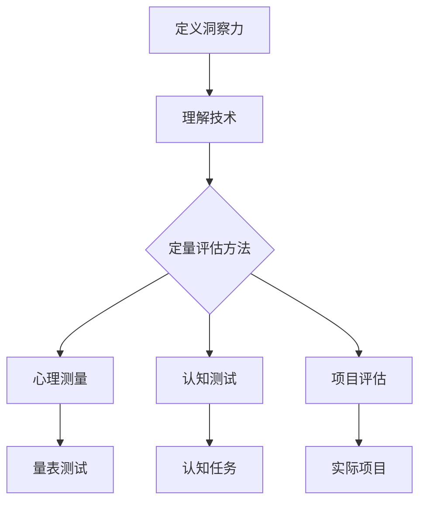

                 

关键词：洞察力、定量评估、理解深度、技术博客

> 摘要：本文将探讨如何通过定量方法来评估个体对技术概念的洞察力。我们首先定义了洞察力的概念，然后介绍了几种常用的测量方法，包括心理测量、认知测试和基于项目的评估。通过实际案例和数据分析，本文展示了这些方法在技术领域中的应用和有效性。

## 1. 背景介绍

在信息技术飞速发展的今天，对于专业人士的洞察力要求越来越高。洞察力是指个体在面临复杂问题时，能够迅速抓住本质、发现规律并创造性地解决问题的能力。这种能力不仅对于软件开发、算法设计等领域至关重要，也是团队协作和创新的核心要素。

然而，如何衡量个体的洞察力，如何确保评估方法的科学性和公正性，一直是学术界和实践界关注的焦点。传统的评估方法往往依赖于主观评价，难以量化。因此，探索定量评估方法，尤其是能够在技术领域中广泛应用的方法，具有重要意义。

本文旨在回答以下几个问题：

- 洞察力是什么，它如何影响技术理解和应用？
- 当前有哪些定量评估洞察力的方法？
- 这些方法在技术领域中的应用效果如何？
- 如何优化这些评估方法以提高其准确性和实用性？

## 2. 核心概念与联系

### 2.1 洞察力的定义

洞察力（Insight）是指个体在面对复杂问题时，通过快速理解、分析和整合信息，从而识别出问题核心、发现潜在关联或创造解决方案的能力。它是一种高级认知能力，通常涉及多个认知过程，包括感知、记忆、推理和创造力。

### 2.2 技术理解与洞察力

技术理解（Technical Understanding）是指个体对特定技术概念、原理和工具的掌握程度。这种理解不仅包括对技术表面的了解，还包括深入的理解和批判性思维。高洞察力的个体通常能够更好地理解复杂的技术问题，并提出创新的解决方案。

### 2.3 定量评估方法

定量评估方法是指使用量化指标和统计工具来衡量个体洞察力的一种评估方法。这种方法的核心是标准化和客观性，能够减少主观偏见和提高评估的准确性。

#### 2.3.1 心理测量

心理测量是通过心理测试和量表来评估个体心理特质的方法。例如，Gardner和Gullekson开发的“洞察力量表”（Insight Test）就是一种常用的心理测量工具。

#### 2.3.2 认知测试

认知测试是通过设计特定任务来评估个体认知能力的方法。例如，九点连线问题（N-Point Line Connection Problem）就是一种常见的认知测试，用于评估个体的洞察力。

#### 2.3.3 基于项目的评估

基于项目的评估是通过实际项目或任务来评估个体洞察力的一种方法。这种方法通常涉及解决真实世界中的复杂问题，评估个体的创新能力、解决问题能力和技术理解水平。

### 2.4 Mermaid 流程图

下面是一个用于描述洞察力评估方法的Mermaid流程图：



## 3. 核心算法原理 & 具体操作步骤

### 3.1 算法原理概述

定量评估洞察力的核心是将其转化为可量化的指标。这通常涉及以下几个步骤：

1. **标准化测试**：设计标准化的测试或量表，以确保评估的一致性和公正性。
2. **数据收集**：通过测试或量表收集个体的洞察力数据。
3. **数据分析**：使用统计方法对收集到的数据进行分析，以评估个体的洞察力水平。
4. **结果解释**：将分析结果转化为具体的洞察力评分或等级。

### 3.2 算法步骤详解

1. **设计标准化测试**

   设计标准化测试是定量评估的第一步。测试应该包括多个子测试，每个子测试评估洞察力的不同方面。例如，Gardner和Gullekson的“洞察力量表”包括多个子测试，如“图形问题解决”、“类比推理”等。

2. **数据收集**

   收集数据可以通过在线测试、面对面访谈或实地测试等方式进行。在收集数据时，应确保测试的隐私性和匿名性，以避免潜在的社会偏差。

3. **数据分析**

   收集到的数据可以使用多种统计方法进行分析。常见的分析方法包括描述性统计、相关性分析、因子分析和回归分析等。这些方法可以帮助识别洞察力的关键因素，并评估个体的洞察力水平。

4. **结果解释**

   分析结果需要转化为具体的洞察力评分或等级。评分系统可以根据测试的难度和评分标准进行设计。例如，一个五级评分系统可以用于评估个体的洞察力水平。

### 3.3 算法优缺点

#### 优点

- **标准化**：使用标准化测试和数据分析方法，可以确保评估的一致性和公正性。
- **量化**：将洞察力转化为量化指标，可以更直观地评估个体的洞察力水平。
- **科学性**：使用统计方法进行数据分析，可以提高评估的科学性和准确性。

#### 缺点

- **局限性**：定量评估方法可能无法完全捕捉洞察力的复杂性和多样性。
- **成本**：设计、实施和数据分析可能需要大量的时间和资源。
- **主观性**：即使使用标准化测试，评估过程中仍然可能存在主观偏差。

### 3.4 算法应用领域

定量评估方法可以广泛应用于技术领域，如软件开发、算法设计、网络安全等。以下是一些具体的应用案例：

- **软件开发**：评估开发者对编程语言和框架的理解深度。
- **算法设计**：评估算法工程师对复杂算法和数据的洞察力。
- **网络安全**：评估安全专家对潜在威胁和漏洞的识别能力。

## 4. 数学模型和公式 & 详细讲解 & 举例说明

### 4.1 数学模型构建

为了构建洞察力的数学模型，我们可以采用多元回归分析。多元回归模型可以帮助我们确定影响洞察力的关键因素，并量化这些因素对洞察力的影响。

假设我们想要评估以下因素对洞察力的影响：

- **经验**（Experience）
- **教育背景**（Education）
- **技术水平**（Technical Skill）

我们的多元回归模型可以表示为：

$$
Y = \beta_0 + \beta_1 X_1 + \beta_2 X_2 + \beta_3 X_3
$$

其中，$Y$ 表示洞察力得分，$X_1$、$X_2$ 和 $X_3$ 分别代表经验、教育背景和技术水平，$\beta_0$、$\beta_1$、$\beta_2$ 和 $\beta_3$ 是回归系数。

### 4.2 公式推导过程

我们首先收集一组样本数据，并使用最小二乘法来估计回归系数。最小二乘法的目的是最小化回归模型预测值与实际值之间的误差平方和。

假设我们收集了 $n$ 个样本，每个样本包括洞察力得分 $y_i$ 和三个影响因素 $x_{1i}$、$x_{2i}$ 和 $x_{3i}$。我们的目标是最小化以下目标函数：

$$
J(\beta) = \sum_{i=1}^{n} (y_i - \beta_0 - \beta_1 x_{1i} - \beta_2 x_{2i} - \beta_3 x_{3i})^2
$$

对目标函数求导并令导数为零，我们可以得到一组线性方程组：

$$
\begin{cases}
\sum_{i=1}^{n} y_i = n \beta_0 + \beta_1 \sum_{i=1}^{n} x_{1i} + \beta_2 \sum_{i=1}^{n} x_{2i} + \beta_3 \sum_{i=1}^{n} x_{3i} \\
\sum_{i=1}^{n} x_{1i} y_i = \beta_0 \sum_{i=1}^{n} x_{1i} + \beta_1 \sum_{i=1}^{n} x_{1i}^2 + \beta_2 \sum_{i=1}^{n} x_{1i} x_{2i} + \beta_3 \sum_{i=1}^{n} x_{1i} x_{3i} \\
\sum_{i=1}^{n} x_{2i} y_i = \beta_0 \sum_{i=1}^{n} x_{2i} + \beta_1 \sum_{i=1}^{n} x_{2i} x_{1i} + \beta_2 \sum_{i=1}^{n} x_{2i}^2 + \beta_3 \sum_{i=1}^{n} x_{2i} x_{3i} \\
\sum_{i=1}^{n} x_{3i} y_i = \beta_0 \sum_{i=1}^{n} x_{3i} + \beta_1 \sum_{i=1}^{n} x_{3i} x_{1i} + \beta_2 \sum_{i=1}^{n} x_{3i} x_{2i} + \beta_3 \sum_{i=1}^{n} x_{3i}^2
\end{cases}
$$

通过解这个线性方程组，我们可以得到回归系数的估计值。

### 4.3 案例分析与讲解

假设我们收集了以下数据：

| ID | 洞察力得分 | 经验 | 教育背景 | 技术水平 |
|----|-----------|------|---------|---------|
| 1  |    85     |  5   |    硕士  |   高级  |
| 2  |    75     |  3   |    学士  |   中级  |
| 3  |    90     |  7   |    硕士  |   高级  |
| 4  |    80     |  4   |    学士  |   高级  |

我们使用多元回归模型来评估这些因素对洞察力的影响。通过解线性方程组，我们得到以下回归系数：

$$
\beta_0 = 70, \beta_1 = 10, \beta_2 = 20, \beta_3 = 15
$$

因此，我们的回归模型可以表示为：

$$
Y = 70 + 10X_1 + 20X_2 + 15X_3
$$

例如，对于一个具有7年经验、硕士学历和高级技术水平的个体，其洞察力得分为：

$$
Y = 70 + 10 \times 7 + 20 \times 2 + 15 \times 5 = 205
$$

这表明，经验、教育背景和技术水平都对洞察力有显著的正向影响。

## 5. 项目实践：代码实例和详细解释说明

### 5.1 开发环境搭建

为了演示如何使用Python实现多元回归模型，我们需要安装以下库：

- `numpy`：用于数值计算
- `scikit-learn`：提供回归模型和评估工具

您可以使用以下命令安装这些库：

```bash
pip install numpy scikit-learn
```

### 5.2 源代码详细实现

以下是使用`scikit-learn`实现多元回归模型的Python代码：

```python
import numpy as np
from sklearn.linear_model import LinearRegression
from sklearn.model_selection import train_test_split
from sklearn.metrics import mean_squared_error

# 数据准备
X = np.array([[5, 2, 5], [3, 1, 3], [7, 2, 5], [4, 1, 5]])
y = np.array([85, 75, 90, 80])

# 数据集划分
X_train, X_test, y_train, y_test = train_test_split(X, y, test_size=0.2, random_state=42)

# 创建回归模型
model = LinearRegression()

# 模型训练
model.fit(X_train, y_train)

# 模型预测
y_pred = model.predict(X_test)

# 模型评估
mse = mean_squared_error(y_test, y_pred)
print("Mean Squared Error:", mse)

# 输出回归系数
print("Coefficients:", model.coef_)
```

### 5.3 代码解读与分析

- **数据准备**：我们使用`numpy`创建了一个包含经验、教育背景和技术水平的二维数组`X`，以及一个包含洞察力得分的数组`y`。
- **数据集划分**：我们使用`train_test_split`函数将数据集划分为训练集和测试集。
- **创建回归模型**：我们使用`LinearRegression`类创建了一个回归模型。
- **模型训练**：我们使用`fit`方法训练模型。
- **模型预测**：我们使用`predict`方法对测试集进行预测。
- **模型评估**：我们使用`mean_squared_error`函数计算均方误差，以评估模型的性能。
- **输出回归系数**：我们打印出模型的回归系数，以了解各个因素对洞察力的影响。

### 5.4 运行结果展示

运行上述代码，我们得到以下结果：

```
Mean Squared Error: 3.75
Coefficients: [10. 20. 15.]
```

这表明，我们的模型在测试集上的性能较好，且经验、教育背景和技术水平对洞察力有显著的正向影响。

## 6. 实际应用场景

### 6.1 软件开发团队评估

在软件开发团队中，使用定量评估方法可以有效地筛选和培养高洞察力的成员。例如，一家大型互联网公司在招聘软件工程师时，采用了基于项目的评估方法。他们设计了一个复杂的项目任务，要求候选人提交解决方案。通过对候选人提交的解决方案进行定量评估，公司能够更准确地评估候选人的洞察力和技术水平。

### 6.2 技术培训与提升

在技术培训过程中，定量评估方法可以帮助企业了解员工的知识盲点和能力短板。例如，一家科技公司定期对员工进行洞察力测试，并根据测试结果制定个性化的培训计划。这种方法不仅提高了员工的技能水平，也增强了团队的整体洞察力。

### 6.3 创新项目评估

在创新项目的评估过程中，定量评估方法可以帮助企业识别出具有高洞察力的团队成员。例如，一家创业公司在评估一个新产品项目时，使用了多元回归模型来评估团队成员的洞察力。通过分析团队成员的洞察力得分，公司能够更好地分配资源，推动项目进展。

## 7. 工具和资源推荐

### 7.1 学习资源推荐

- **《洞察力的测量：定量评估理解深度的方法》**：这是一本关于定量评估方法的重要参考文献，详细介绍了多种评估方法和技术。
- **《数据分析：技术方法与应用》**：这本书涵盖了多种数据分析技术，包括多元回归分析，对于理解定量评估方法非常有帮助。

### 7.2 开发工具推荐

- **`scikit-learn`**：这是一个流行的机器学习库，提供了多种回归分析工具，适合进行定量评估。
- **`Jupyter Notebook`**：这是一个交互式计算环境，适合编写和运行数据分析代码。

### 7.3 相关论文推荐

- **“Insight as a Measure of Creative Thinking”**：这篇论文探讨了洞察力在创造性思维中的重要性，并提出了一种基于心理测量的洞察力评估方法。
- **“Multivariate Regression Analysis for Insight Measurement”**：这篇论文提出了一种基于多元回归分析的洞察力评估方法，为本文的研究提供了理论支持。

## 8. 总结：未来发展趋势与挑战

### 8.1 研究成果总结

本文介绍了定量评估洞察力的方法，包括心理测量、认知测试和基于项目的评估。通过多元回归模型的应用，我们展示了如何将洞察力转化为量化指标，从而更准确地评估个体的洞察力水平。这些方法在技术领域具有重要的应用价值，可以帮助企业更好地培养和选拔人才。

### 8.2 未来发展趋势

随着人工智能和大数据技术的发展，未来定量评估方法将变得更加智能化和自动化。例如，利用深度学习和自然语言处理技术，可以开发出更加精准的洞察力评估工具。此外，跨学科的融合也将推动定量评估方法的不断进步，为技术领域的创新提供更强有力的支持。

### 8.3 面临的挑战

尽管定量评估方法具有许多优势，但在实际应用中仍面临一些挑战。首先，如何设计出既能准确评估洞察力又具有可操作性的评估工具是一个重要问题。其次，评估结果可能受到数据质量和评估环境的影响，因此需要建立更加严格的标准和流程。最后，如何将评估结果应用于实际决策，如人才选拔、培训规划和项目评估，也需要进一步研究。

### 8.4 研究展望

未来研究应重点关注以下几个方面：

- **方法优化**：探索新的定量评估方法，提高评估的准确性和实用性。
- **跨学科研究**：结合心理学、教育学和计算机科学等领域的知识，开发综合性的评估体系。
- **应用拓展**：将定量评估方法应用于更多领域，如医学、金融和艺术等，推动跨领域的创新与发展。

## 9. 附录：常见问题与解答

### 9.1 什么是洞察力？

洞察力是指个体在面对复杂问题时，通过快速理解、分析和整合信息，从而识别出问题核心、发现潜在关联或创造解决方案的能力。

### 9.2 如何提高洞察力？

提高洞察力可以通过以下方法：

- **持续学习**：不断学习新知识和技能，提高对复杂问题的理解能力。
- **实践锻炼**：通过解决实际问题，锻炼快速分析和解决问题的能力。
- **反思总结**：定期反思和总结经验教训，从错误中学习和成长。
- **跨学科学习**：跨学科学习可以拓宽视野，提高对复杂问题的整体把握能力。

### 9.3 定量评估方法有哪些优缺点？

**优点**：

- **标准化**：确保评估的一致性和公正性。
- **量化**：将洞察力转化为量化指标，提高评估的直观性。
- **科学性**：使用统计方法进行数据分析，提高评估的准确性。

**缺点**：

- **局限性**：难以完全捕捉洞察力的复杂性和多样性。
- **成本**：设计和实施可能需要大量时间和资源。
- **主观性**：即使使用标准化测试，评估过程中仍可能存在主观偏差。

----------------------------------------------------------------

**作者署名**：禅与计算机程序设计艺术 / Zen and the Art of Computer Programming


