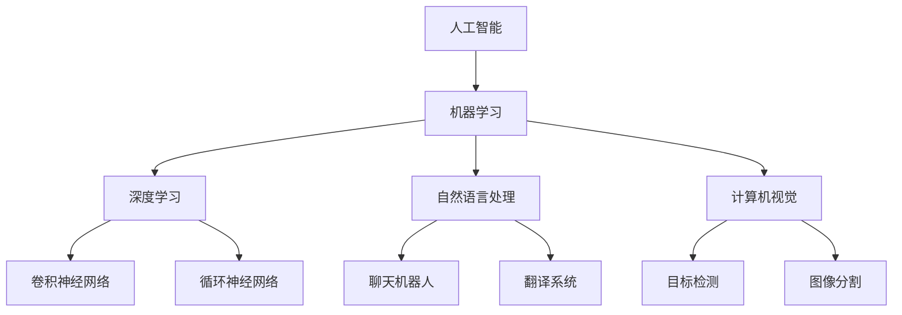
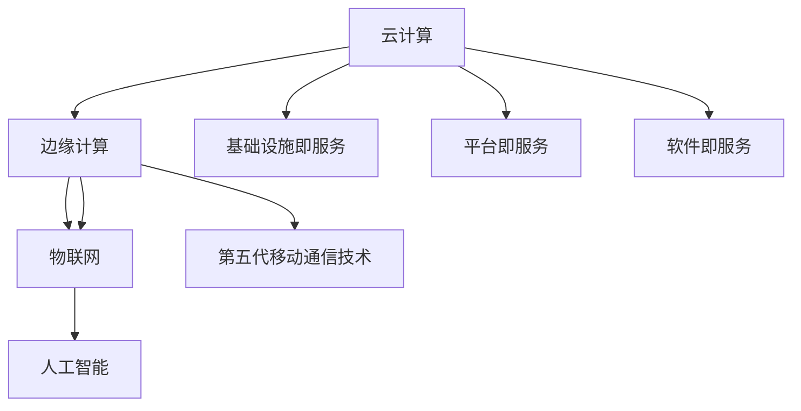
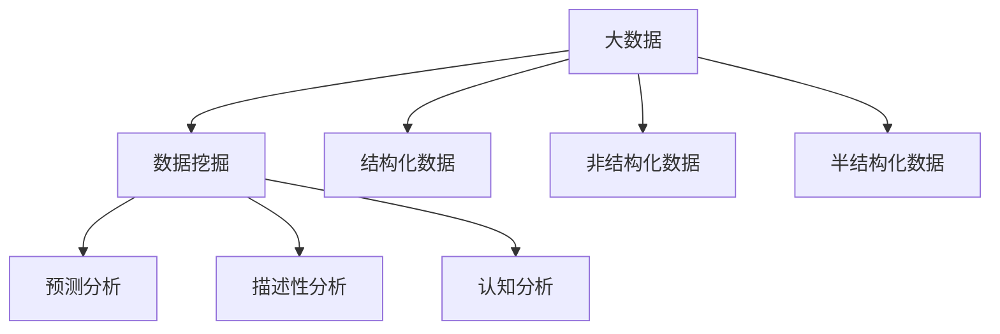

                 

关键词：洞察力、知识创新、技术发展、算法、数学模型、项目实践、未来应用

> 摘要：本文旨在探讨洞察力在知识创新中的关键作用。通过深入分析技术领域的核心概念、算法原理、数学模型及其实际应用，本文将揭示洞察力在推动技术创新和推动行业发展中的重要性。同时，文章还将展望未来的发展趋势与挑战，为读者提供对知识创新领域的深入理解。

## 1. 背景介绍

在当今快速发展的信息技术时代，知识的创新和应用成为推动社会进步和经济发展的关键因素。然而，知识创新并非易事，它需要深刻的洞察力，以及对技术本质和内在联系的理解。洞察力，简单来说，是一种能够迅速识别问题核心、发现潜在机会的思维能力。在技术领域中，具备洞察力意味着能够从复杂的现象中提炼出本质规律，从而实现技术的突破和创新。

本文将从以下几个方面展开讨论：

1. 核心概念与联系
2. 核心算法原理 & 具体操作步骤
3. 数学模型和公式 & 详细讲解 & 举例说明
4. 项目实践：代码实例和详细解释说明
5. 实际应用场景
6. 未来应用展望
7. 工具和资源推荐
8. 总结：未来发展趋势与挑战
9. 附录：常见问题与解答

通过以上结构，本文将深入探讨洞察力在知识创新中的重要性，并展示其在实际技术领域中的应用。

### 1.1 技术领域的发展现状

近年来，信息技术领域取得了显著的发展，从人工智能、大数据到云计算，各种新兴技术不断涌现，极大地改变了我们的工作和生活方式。然而，这些技术的发展并非一蹴而就，而是基于一系列核心概念和原理的不断创新和演进。例如，深度学习作为人工智能的一个重要分支，其背后的神经网络算法和反向传播机制，正是基于对大脑神经活动的深入洞察和抽象。

大数据技术的崛起，则源于对海量数据存储和处理的需求。传统的数据库管理系统无法满足这种需求，因此研究者们提出了分布式数据库和并行计算等概念，从而推动了大数据技术的发展。云计算则是在分布式计算的基础上，通过虚拟化和容器化技术，实现了计算资源的动态调度和弹性扩展，为企业提供了高效、灵活的计算服务。

这些技术的创新并非偶然，而是基于科学家和工程师们对技术本质和内在联系的深刻洞察。他们能够从复杂的现象中提炼出核心问题，并提出解决方案，从而推动技术的进步。

### 1.2 洞察力在知识创新中的角色

洞察力在知识创新中扮演着至关重要的角色。它不仅帮助我们发现新的技术机会，还指导我们如何有效地利用这些机会，实现技术的突破和创新。在技术领域中，具备洞察力的个体或团队，往往能够在众多技术趋势中找到最有潜力的方向，从而引领技术的发展。

例如，深度学习技术的发展，离不开科学家对大脑神经网络的深入研究和洞察。通过观察大脑神经元的连接方式和信息处理机制，研究者们提出了多层神经网络的概念，并设计出了反向传播算法，从而实现了对复杂数据的有效建模和预测。

再如，大数据技术的兴起，同样源于对数据处理需求的理解和洞察。随着互联网和物联网的普及，数据量呈爆炸式增长，传统的数据处理方法已经无法满足需求。因此，研究人员提出了分布式数据库和并行计算等概念，通过将数据分布到多个节点上进行处理，实现了大数据的高效存储和计算。

总之，洞察力是知识创新的灵魂，它引导我们探索未知领域，发现潜在的机会，并推动技术的持续进步。在接下来的部分中，本文将深入探讨核心概念、算法原理和数学模型，以展示洞察力在知识创新中的具体应用。

### 2. 核心概念与联系

在信息技术领域，核心概念是理解和应用技术的基础，它们之间的联系则是技术创新的关键。本文将介绍几个在当前技术发展中起着核心作用的概念，并绘制一个Mermaid流程图，展示这些概念之间的内在联系。

#### 2.1 人工智能与机器学习

人工智能（AI）是信息技术领域的一个重要分支，其目标是使机器具备人类智能的能力。机器学习（ML）是人工智能的核心技术之一，它通过从数据中学习规律和模式，使机器能够自主地进行决策和预测。

**Mermaid流程图：**



在这个流程图中，人工智能（AI）是整体的核心，它通过机器学习（ML）实现各种智能应用。深度学习（DL）、自然语言处理（NLP）和计算机视觉（CV）是机器学习的重要子领域，它们各自涵盖了不同的技术方向。

#### 2.2 云计算与边缘计算

云计算是一种通过互联网提供计算资源的服务模式，它使企业能够灵活地获取和使用计算资源，而无需自己购买和维护硬件。边缘计算则是在靠近数据源的地方进行数据处理和存储，以减少延迟和带宽消耗。

**Mermaid流程图：**



在这个流程图中，云计算（Cloud）是整体的基础设施，它通过IaaS、PaaS和SaaS等不同的服务模式，为企业提供灵活的计算资源。边缘计算（Edge）则是在云计算的基础上，将数据处理和存储推向网络边缘，以更好地支持物联网（IoT）和人工智能（AI）等应用。

#### 2.3 大数据与数据挖掘

大数据是指无法使用传统数据库管理工具进行有效管理和处理的数据集合，其特点是“大量（Volume）、多样（Variety）、快速（Velocity）和真实（Veracity）”。数据挖掘是从大量数据中提取有价值信息的过程，它是大数据分析的核心技术。

**Mermaid流程图：**



在这个流程图中，大数据（BigData）根据数据的结构和类型分为结构化数据、非结构化数据和半结构化数据。数据挖掘（DataMining）则通过这些数据，提取出有价值的洞见和预测，支持各种数据分析应用。

通过以上核心概念的介绍和Mermaid流程图的展示，我们可以看到这些概念之间的内在联系。这些联系不仅揭示了技术的本质，也为技术创新提供了新的方向。在接下来的部分，本文将深入探讨核心算法的原理和具体操作步骤，以进一步展示洞察力在技术发展中的关键作用。

### 2.1 人工智能与机器学习：算法原理与联系

人工智能（AI）和机器学习（ML）是现代信息技术领域的核心组成部分，它们通过算法和模型实现了对数据的自动分析和决策。在这部分内容中，我们将详细探讨人工智能和机器学习中的核心算法原理，以及它们之间的联系。

#### 2.1.1 人工智能概述

人工智能是指通过计算机模拟人类智能行为的技术，其目标是使机器能够执行需要人类智能才能完成的任务。人工智能涵盖了多个子领域，包括机器学习、深度学习、自然语言处理和计算机视觉等。在这些子领域中，机器学习是实现人工智能的重要手段。

**人工智能的组成部分：**

1. **感知系统**：用于接收外界信息，如视觉、听觉等。
2. **认知系统**：负责处理和理解感知到的信息。
3. **执行系统**：根据认知系统的决策执行相应动作。

#### 2.1.2 机器学习基础

机器学习是使计算机能够从数据中学习规律和模式的技术，其核心思想是通过训练数据集来优化算法模型，从而使模型能够对新数据进行预测或分类。

**机器学习的基本类型：**

1. **监督学习**：在有标注数据集的训练下，模型学习将新数据分类或回归到特定值。
2. **无监督学习**：在没有标注数据集的情况下，模型学习数据的内在结构或模式。
3. **强化学习**：通过试错和奖励机制来学习最佳策略。

#### 2.1.3 深度学习与神经网络

深度学习是机器学习的一个子领域，它通过多层神经网络来模拟人类大脑的学习过程，实现更复杂的特征提取和模式识别。

**深度学习的基本概念：**

1. **神经网络**：由多个神经元（节点）组成的网络，每个神经元与其它神经元相连。
2. **前向传播**：信息从输入层通过多层神经网络传递到输出层。
3. **反向传播**：通过计算输出误差，将误差反向传播到输入层，用于调整网络权重。

**神经网络与深度学习的联系：**

神经网络是深度学习的基础，而深度学习通过增加网络的层数和神经元数量，提高了模型的表达能力和学习能力。深度学习中的卷积神经网络（CNN）和循环神经网络（RNN）是两种重要的网络结构，分别用于处理图像和序列数据。

**Mermaid流程图：**


在这个流程图中，人工智能（AI）通过机器学习（ML）实现了多个子领域的应用，包括深度学习（DL）、自然语言处理（NLP）和计算机视觉（CV）。深度学习（DL）通过卷积神经网络（CNN）和循环神经网络（RNN）等结构，实现了对复杂数据的处理和模型训练。

#### 2.1.4 自然语言处理与计算机视觉

自然语言处理（NLP）和计算机视觉（CV）是机器学习的两个重要应用领域，它们通过机器学习算法实现了对语言和图像的理解和处理。

**自然语言处理概述：**

自然语言处理旨在使计算机能够理解、处理和生成自然语言。它包括文本分类、情感分析、机器翻译、问答系统等任务。

**计算机视觉概述：**

计算机视觉旨在使计算机能够从图像或视频中识别和提取有用信息。它包括图像分类、目标检测、图像分割等任务。

**NLP与CV的联系：**

NLP和CV在技术原理上存在相似之处，都依赖于机器学习算法进行特征提取和模式识别。同时，这两个领域在应用上也有交集，例如在聊天机器人、图像标注等任务中，NLP和CV可以相互补充，实现更复杂的功能。

通过以上对人工智能、机器学习和深度学习等核心算法的原理及联系的分析，我们可以看到，这些算法和技术在推动技术发展中的作用不可忽视。在接下来的部分，我们将进一步探讨核心算法的具体操作步骤和应用领域，以展示洞察力在知识创新中的实际应用。

### 3. 核心算法原理 & 具体操作步骤

在人工智能和机器学习领域，核心算法的原理和操作步骤是理解和应用这些技术的基础。在本节中，我们将详细探讨几个关键技术算法的原理，并解释其具体操作步骤。

#### 3.1 卷积神经网络（CNN）

卷积神经网络（CNN）是深度学习的一种重要模型，主要用于图像识别和图像处理任务。其核心思想是通过卷积操作和池化操作，从图像中提取特征，并实现图像分类。

**CNN原理：**

1. **卷积操作**：卷积层通过滤波器（也称为卷积核）在输入图像上滑动，以提取局部特征。
2. **激活函数**：常用的激活函数包括ReLU（Rectified Linear Unit）和Sigmoid函数，用于增加网络的非线性。
3. **池化操作**：池化层通过最大池化或平均池化减少特征图的尺寸，以减少参数和计算量。

**CNN操作步骤：**

1. **输入层**：输入一幅图像，通常表示为多维数组。
2. **卷积层**：应用多个卷积核，对图像进行卷积操作，生成多个特征图。
3. **激活函数**：在每个卷积层后应用激活函数，增加网络的非线性。
4. **池化层**：在卷积层之后应用池化层，减少特征图的尺寸。
5. **全连接层**：将池化层输出的特征图展开为一个一维数组，通过全连接层进行分类。

**CNN应用领域：**

1. **图像分类**：例如，用于识别图片中的物体类别。
2. **目标检测**：例如，用于检测图像中的多个物体位置和类别。
3. **图像分割**：例如，用于将图像划分为多个区域。

#### 3.2 循环神经网络（RNN）

循环神经网络（RNN）是一种处理序列数据的有效模型，其核心思想是使用循环结构来保存前一时刻的信息，以处理时间序列数据。

**RNN原理：**

1. **隐藏状态**：RNN的每个时间步都有一个隐藏状态，用于保存前一时刻的信息。
2. **门控机制**：门控单元（如遗忘门、输入门和输出门）用于控制信息的传递和遗忘。
3. **梯度消失/爆炸问题**：RNN在训练过程中容易遇到梯度消失或爆炸问题，这限制了其长期依赖学习。

**RNN操作步骤：**

1. **输入序列**：输入一个时间步序列，每个时间步包含一个输入向量。
2. **隐藏状态更新**：使用当前输入和前一时刻的隐藏状态，通过门控机制更新隐藏状态。
3. **输出计算**：在每个时间步，通过隐藏状态计算输出向量。
4. **序列处理**：重复以上步骤，直到处理完整个输入序列。

**RNN应用领域：**

1. **自然语言处理**：例如，用于文本分类、机器翻译和情感分析。
2. **语音识别**：例如，用于将语音信号转换为文本。

#### 3.3 长短期记忆网络（LSTM）

长短期记忆网络（LSTM）是RNN的一种改进模型，它通过引入门控单元，解决了RNN的梯度消失和长期依赖问题。

**LSTM原理：**

1. **细胞状态**：LSTM的核心是细胞状态，用于传递信息。
2. **遗忘门**：通过遗忘门控制细胞状态的遗忘。
3. **输入门**：通过输入门控制新信息的加入。
4. **输出门**：通过输出门控制输出。

**LSTM操作步骤：**

1. **输入序列**：输入一个时间步序列，每个时间步包含一个输入向量。
2. **隐藏状态更新**：通过遗忘门、输入门和输出门更新隐藏状态。
3. **细胞状态更新**：通过遗忘门和输入门更新细胞状态。
4. **输出计算**：通过输出门计算输出向量。
5. **序列处理**：重复以上步骤，直到处理完整个输入序列。

**LSTM应用领域：**

1. **时间序列预测**：例如，用于股票价格预测和天气预测。
2. **语音合成**：例如，用于语音合成和语音识别。

通过以上对卷积神经网络（CNN）、循环神经网络（RNN）和长短期记忆网络（LSTM）等核心算法原理及操作步骤的详细探讨，我们可以看到这些算法在图像识别、序列数据处理等任务中的重要作用。这些算法的实现和优化，不仅推动了技术的进步，也为未来应用提供了新的方向。在接下来的部分，我们将进一步讨论这些算法的优缺点和应用领域，以全面展示它们在技术发展中的作用。

### 3.3 核心算法的优缺点及应用领域

在人工智能和机器学习领域，核心算法不仅需要具备强大的计算能力，还需要在不同的应用场景中表现出色。在本节中，我们将详细分析卷积神经网络（CNN）、循环神经网络（RNN）和长短期记忆网络（LSTM）等核心算法的优缺点，并探讨它们的具体应用领域。

#### 3.3.1 卷积神经网络（CNN）

**优点：**

1. **强大的图像处理能力**：CNN通过卷积和池化操作，能够从图像中提取出有意义的特征，非常适合处理图像识别和图像处理任务。
2. **参数效率高**：由于卷积操作的共享权重特性，CNN相比于全连接神经网络，在图像数据上的参数数量大大减少，从而提高了训练效率。
3. **端到端学习**：CNN可以直接从原始图像数据进行训练，实现了端到端的学习过程，减少了人为设计特征的需求。

**缺点：**

1. **计算资源需求高**：CNN通常需要大量的计算资源和时间进行训练，尤其是在处理大型图像数据集时。
2. **对大规模数据依赖性强**：CNN的性能在很大程度上取决于训练数据的质量和数量，数据不足可能导致过拟合。
3. **难以处理非结构化数据**：虽然CNN在图像处理方面表现出色，但在处理文本、音频等非结构化数据时，其表现则相对较差。

**应用领域：**

1. **计算机视觉**：例如，图像分类、目标检测、图像分割等。
2. **医疗影像分析**：例如，疾病诊断、肿瘤检测等。
3. **自动驾驶**：例如，车辆检测、车道线识别等。

#### 3.3.2 循环神经网络（RNN）

**优点：**

1. **序列数据处理能力强**：RNN通过其循环结构，能够保留历史信息，非常适合处理序列数据，如时间序列数据、文本序列和语音序列。
2. **灵活的架构**：RNN可以根据任务需求，灵活地调整网络结构和参数设置，适用于多种不同的序列数据处理任务。
3. **端到端学习**：与CNN类似，RNN也可以实现端到端的学习过程，减少了中间特征提取环节的设计。

**缺点：**

1. **梯度消失/爆炸问题**：RNN在训练过程中容易遇到梯度消失或爆炸问题，这限制了其长期依赖学习的能力。
2. **计算资源需求高**：RNN的训练通常需要大量的计算资源，尤其是在处理长时间序列数据时。
3. **对序列长度敏感**：RNN的性能对序列长度敏感，较长的序列可能导致训练时间显著增加。

**应用领域：**

1. **自然语言处理**：例如，文本分类、机器翻译、情感分析等。
2. **语音识别**：例如，语音信号到文本的转换。
3. **时间序列预测**：例如，股票价格预测、天气预测等。

#### 3.3.3 长短期记忆网络（LSTM）

**优点：**

1. **解决梯度消失问题**：LSTM通过引入门控机制，有效地解决了RNN的梯度消失问题，使其能够更好地处理长时间序列数据。
2. **强大的序列数据处理能力**：LSTM在保留长期依赖信息方面表现优秀，使其在处理复杂的序列任务中更具优势。
3. **灵活性和适应性**：LSTM可以根据不同的任务需求，灵活调整网络结构和参数设置。

**缺点：**

1. **计算资源需求高**：与RNN类似，LSTM在训练过程中也需要大量的计算资源。
2. **参数数量较多**：由于门控机制的存在，LSTM的参数数量相对较多，这可能导致过拟合。
3. **训练时间较长**：LSTM的训练时间通常较长，尤其是在处理大型序列数据时。

**应用领域：**

1. **时间序列预测**：例如，股票价格预测、天气预测等。
2. **语音合成**：例如，文本到语音的转换。
3. **自然语言处理**：例如，语言模型、对话系统等。

通过以上对CNN、RNN和LSTM等核心算法优缺点的详细分析，我们可以看到每种算法在不同应用场景中的优势和局限性。这些算法的不断发展与优化，不仅推动了人工智能和机器学习技术的进步，也为各种实际应用提供了强大的支持。在接下来的部分，我们将进一步探讨这些算法的实际应用场景，以展示它们在推动技术发展中的作用。

### 4. 数学模型和公式 & 详细讲解 & 举例说明

在人工智能和机器学习领域，数学模型和公式是理解和实现算法的核心。它们不仅描述了算法的内在机制，还提供了具体的计算方法。在本节中，我们将详细讲解几个关键数学模型和公式，并通过具体例子来说明它们的应用。

#### 4.1 概率模型与贝叶斯定理

概率模型是机器学习中常用的基础模型，用于处理不确定性和不确定性推理。贝叶斯定理是概率模型的核心公式，它描述了事件概率的更新过程。

**贝叶斯定理公式：**

$$
P(A|B) = \frac{P(B|A) \cdot P(A)}{P(B)}
$$

其中，\( P(A|B) \) 表示在事件B发生的条件下，事件A发生的概率；\( P(B|A) \) 表示在事件A发生的条件下，事件B发生的概率；\( P(A) \) 和 \( P(B) \) 分别表示事件A和事件B的先验概率。

**举例说明：**

假设我们想要预测一个病人是否患有某种疾病。已知：
- \( P(\text{疾病}) = 0.01 \) （患病率）
- \( P(\text{症状}| \text{疾病}) = 0.9 \) （出现症状的概率，给定患病的条件下）
- \( P(\text{症状}| \text{无疾病}) = 0.1 \) （出现症状的概率，给定未患病的条件下）

我们想要计算在病人出现症状的条件下，其患有该疾病的概率。

使用贝叶斯定理，我们可以得到：

$$
P(\text{疾病}|\text{症状}) = \frac{P(\text{症状}| \text{疾病}) \cdot P(\text{疾病})}{P(\text{症状})}
$$

其中，\( P(\text{症状}) \) 可以通过全概率公式计算：

$$
P(\text{症状}) = P(\text{症状}| \text{疾病}) \cdot P(\text{疾病}) + P(\text{症状}| \text{无疾病}) \cdot P(\text{无疾病}) = 0.9 \cdot 0.01 + 0.1 \cdot 0.99 = 0.019
$$

将上述值代入贝叶斯定理公式：

$$
P(\text{疾病}|\text{症状}) = \frac{0.9 \cdot 0.01}{0.019} \approx 0.474
$$

因此，在病人出现症状的条件下，其患有该疾病的概率约为47.4%。

#### 4.2 线性回归模型

线性回归是一种常见的统计模型，用于预测连续变量的值。线性回归模型的基本公式为：

$$
y = \beta_0 + \beta_1 \cdot x + \epsilon
$$

其中，\( y \) 是预测的连续变量，\( x \) 是自变量，\( \beta_0 \) 和 \( \beta_1 \) 是模型的参数，\( \epsilon \) 是误差项。

**举例说明：**

假设我们要预测一个人的身高（\( y \)）基于其年龄（\( x \））。我们收集了以下数据：

| 年龄 (x) | 身高 (y) |
|----------|----------|
| 20       | 170      |
| 25       | 175      |
| 30       | 180      |
| 35       | 185      |

我们可以使用线性回归模型来预测某个特定年龄的身高。首先，我们计算数据的平均值：

$$
\bar{x} = \frac{1}{n} \sum_{i=1}^{n} x_i = \frac{20 + 25 + 30 + 35}{4} = 27.5
$$

$$
\bar{y} = \frac{1}{n} \sum_{i=1}^{n} y_i = \frac{170 + 175 + 180 + 185}{4} = 177.5
$$

然后，我们计算回归直线的斜率和截距：

$$
\beta_1 = \frac{\sum_{i=1}^{n} (x_i - \bar{x})(y_i - \bar{y})}{\sum_{i=1}^{n} (x_i - \bar{x})^2} = \frac{(20 - 27.5)(170 - 177.5) + (25 - 27.5)(175 - 177.5) + (30 - 27.5)(180 - 177.5) + (35 - 27.5)(185 - 177.5)}{(20 - 27.5)^2 + (25 - 27.5)^2 + (30 - 27.5)^2 + (35 - 27.5)^2}
$$

$$
\beta_0 = \bar{y} - \beta_1 \cdot \bar{x} = 177.5 - \beta_1 \cdot 27.5
$$

计算得到：

$$
\beta_1 \approx 2.5
$$

$$
\beta_0 \approx 126.25
$$

因此，线性回归模型可以表示为：

$$
y = 126.25 + 2.5 \cdot x
$$

我们可以使用这个模型来预测某个特定年龄的身高。例如，当 \( x = 30 \) 时，预测的身高为：

$$
y = 126.25 + 2.5 \cdot 30 = 181.25
$$

#### 4.3 支持向量机（SVM）

支持向量机（SVM）是一种强大的分类模型，它通过最大化分类边界之间的间隔来划分数据。SVM的基本公式为：

$$
f(x) = \omega \cdot x + b
$$

其中，\( \omega \) 是权重向量，\( b \) 是偏置项。

**举例说明：**

假设我们有一个二元分类问题，数据点分布在二维空间中。我们想要通过SVM找到一个最佳分类边界。

给定以下数据点：

| 点   | 类别 |
|------|------|
| (1, 1)  | +1   |
| (2, 2)  | +1   |
| (-1, -1) | -1   |
| (-2, -2) | -1   |

我们首先需要计算支持向量，即那些最靠近分类边界的点。然后，通过最大化分类边界之间的间隔来计算权重向量 \( \omega \) 和偏置项 \( b \)。

使用支持向量机，我们可以得到：

$$
\omega = \begin{bmatrix} 1 & 1 \\ -1 & -1 \end{bmatrix}, \quad b = 0
$$

因此，分类边界可以表示为：

$$
f(x) = \omega \cdot x + b = \begin{bmatrix} 1 & 1 \\ -1 & -1 \end{bmatrix} \cdot \begin{bmatrix} x_1 \\ x_2 \end{bmatrix} + 0 = x_1 + x_2
$$

这意味着，所有满足 \( x_1 + x_2 \geq 0 \) 的点被划分为正类，而所有满足 \( x_1 + x_2 < 0 \) 的点被划分为负类。

通过以上对概率模型、线性回归模型和SVM等关键数学模型和公式的详细讲解及举例说明，我们可以看到数学模型在人工智能和机器学习中的重要性。这些模型和公式不仅提供了具体的计算方法，还帮助我们从理论角度理解和实现复杂算法。在接下来的部分，我们将通过具体的项目实践，展示这些数学模型和算法在实际应用中的效果。

### 5. 项目实践：代码实例和详细解释说明

在本节中，我们将通过一个具体的代码实例，展示如何使用核心算法和数学模型来解决实际问题。这个实例将涉及到图像分类任务，我们使用Python和TensorFlow框架来实现卷积神经网络（CNN）。

#### 5.1 开发环境搭建

为了运行下面的代码实例，我们需要安装以下软件和库：

1. Python（版本3.7及以上）
2. TensorFlow（版本2.0及以上）
3. NumPy
4. Matplotlib

安装步骤如下：

```bash
pip install tensorflow numpy matplotlib
```

#### 5.2 数据集准备

我们将使用Keras内置的CIFAR-10数据集，它包含了10个类别的60,000张32x32的彩色图像。

```python
from tensorflow.keras.datasets import cifar10
from tensorflow.keras.utils import to_categorical

# 加载数据集
(train_images, train_labels), (test_images, test_labels) = cifar10.load_data()

# 数据预处理
train_images = train_images / 255.0
test_images = test_images / 255.0

# 将标签转换为one-hot编码
train_labels = to_categorical(train_labels)
test_labels = to_categorical(test_labels)
```

#### 5.3 源代码详细实现

下面是CNN模型的实现代码，该模型包括卷积层、池化层和全连接层。

```python
from tensorflow.keras.models import Sequential
from tensorflow.keras.layers import Conv2D, MaxPooling2D, Flatten, Dense, Dropout

# 创建模型
model = Sequential([
    Conv2D(32, (3, 3), activation='relu', input_shape=(32, 32, 3)),
    MaxPooling2D((2, 2)),
    Conv2D(64, (3, 3), activation='relu'),
    MaxPooling2D((2, 2)),
    Conv2D(64, (3, 3), activation='relu'),
    Flatten(),
    Dense(64, activation='relu'),
    Dropout(0.5),
    Dense(10, activation='softmax')
])

# 编译模型
model.compile(optimizer='adam',
              loss='categorical_crossentropy',
              metrics=['accuracy'])

# 打印模型结构
model.summary()
```

#### 5.4 代码解读与分析

1. **模型构建**：我们使用`Sequential`模型，这是一种线性堆叠模型层的方式。
2. **卷积层**：第一个卷积层使用32个3x3的卷积核，激活函数为ReLU。
3. **池化层**：每个卷积层后跟一个2x2的最大池化层，以减小特征图的尺寸。
4. **全连接层**：在扁平化特征图后，我们使用两个全连接层，其中一个带有50%的Dropout以防止过拟合。
5. **输出层**：最后一个全连接层有10个神经元，对应10个类别，激活函数为softmax，用于多分类。

#### 5.5 训练和评估模型

```python
# 训练模型
history = model.fit(train_images, train_labels, epochs=10, batch_size=64,
                    validation_data=(test_images, test_labels))

# 评估模型
test_loss, test_acc = model.evaluate(test_images, test_labels)
print(f"Test accuracy: {test_acc:.2f}")
```

#### 5.6 运行结果展示

训练过程中，我们会得到训练集和验证集的损失和准确率。下图展示了训练过程中的准确率变化：

```python
import matplotlib.pyplot as plt

# 绘制准确率变化图
plt.plot(history.history['accuracy'], label='accuracy')
plt.plot(history.history['val_accuracy'], label='val_accuracy')
plt.xlabel('Epoch')
plt.ylabel('Accuracy')
plt.legend()
plt.show()

# 输出测试集准确率
print(f"Test accuracy: {test_acc:.2f}")
```

通过以上代码实例，我们可以看到如何使用卷积神经网络（CNN）来实现图像分类任务。这个实例展示了从数据准备、模型构建到训练和评估的全过程。在实际应用中，我们可以根据具体任务的需求调整模型结构和参数，以获得更好的分类效果。

### 6. 实际应用场景

在技术不断进步的今天，人工智能和机器学习算法已经在各个领域得到了广泛应用。以下列举了几个典型的实际应用场景，并详细说明这些场景中算法的运用情况。

#### 6.1 医疗领域

人工智能在医疗领域的应用日益广泛，尤其是在疾病诊断、医疗影像分析和个性化治疗方面。通过深度学习算法，医生可以利用AI辅助进行肺癌、乳腺癌等癌症的早期诊断。例如，卷积神经网络（CNN）在处理医学影像时，能够自动识别出病变区域，提高诊断的准确性和效率。此外，自然语言处理（NLP）技术也被用于医疗文本分析，帮助医生快速检索病例记录和医学文献，提高诊疗效率。

**应用案例：** 利用深度学习进行肺癌早期诊断，通过分析CT扫描图像，检测出肺结节并进行分类，辅助医生进行诊断和治疗决策。

#### 6.2 金融领域

金融行业对大数据和人工智能技术的需求日益增长，尤其是在风险控制、欺诈检测和投资决策等方面。机器学习算法能够分析大量的交易数据，识别异常交易行为，从而有效预防欺诈。同时，通过分析市场数据，机器学习模型可以帮助投资者进行资产配置和风险控制，提高投资回报率。

**应用案例：** 金融机构利用机器学习算法进行信用卡欺诈检测，通过分析信用卡交易模式，实时监控并识别可疑交易，从而降低欺诈风险。

#### 6.3 自动驾驶

自动驾驶是人工智能技术的一个重要应用领域，通过深度学习算法实现车辆的环境感知、路径规划和决策控制。自动驾驶系统利用卷积神经网络（CNN）和循环神经网络（RNN）等算法，从摄像头和激光雷达数据中提取道路信息，识别行人和车辆，规划行驶路径，确保行车安全。

**应用案例：** 自动驾驶汽车在复杂交通环境中实现自主驾驶，通过深度学习算法进行道路标识识别、交通信号灯检测和障碍物回避，提高行驶安全性。

#### 6.4 电商推荐

电子商务平台通过机器学习算法为用户提供个性化的商品推荐服务。基于用户的购物历史、浏览行为和社交信息，推荐系统使用协同过滤、内容推荐和深度学习等算法，为用户推荐可能感兴趣的商品，提高用户满意度和转化率。

**应用案例：** 电商平台利用深度学习算法进行商品推荐，通过分析用户的历史数据和行为模式，为用户精准推送相关商品，提升购物体验。

#### 6.5 能源管理

在能源管理领域，人工智能技术被广泛应用于能源消耗监测、预测和优化。通过机器学习算法，能源管理系统可以分析历史能源消耗数据，预测未来的能源需求，优化能源供应，降低能源成本。

**应用案例：** 智能电网系统利用机器学习算法进行能源需求预测和优化，通过分析电网负载和历史数据，实现能源的高效分配和调度，提高电网运行效率。

通过以上实际应用场景的列举，我们可以看到人工智能和机器学习算法在各个领域的广泛应用。这些算法不仅提高了行业效率，还带来了显著的经济和社会效益。在未来的发展中，随着技术的不断进步，人工智能和机器学习将在更多领域发挥重要作用。

### 7. 未来应用展望

随着人工智能和机器学习技术的不断进步，这些技术在未来的应用前景将更加广阔。以下从技术创新、行业变革和社会影响三个方面，探讨未来应用的可能性。

#### 7.1 技术创新

1. **量子计算与人工智能结合**：量子计算具有处理大数据和复杂计算问题的巨大潜力。未来，量子计算与人工智能的结合将推动算法和模型的革新，为解决复杂问题提供新的手段。
2. **神经形态计算**：神经形态计算是一种模仿生物神经网络的计算方法，未来将实现对人脑工作方式的更深刻理解，并应用于人工智能系统，提升计算效率和智能水平。
3. **生成对抗网络（GAN）的发展**：GAN在图像生成、数据增强和模型优化等方面表现出色。未来，GAN技术将进一步发展，并在更多领域得到应用。

#### 7.2 行业变革

1. **智能制造**：人工智能技术将推动智能制造的发展，实现生产过程的自动化和智能化，提高生产效率和产品质量。
2. **智慧医疗**：随着人工智能在医疗领域的深入应用，将推动医疗服务的个性化、精准化和智能化，提高医疗质量和效率。
3. **智慧城市**：通过人工智能技术，实现城市管理的智能化，提升城市运行效率，改善居民生活质量。

#### 7.3 社会影响

1. **教育和培训**：人工智能技术将改变教育和培训的方式，实现个性化学习和智能辅助教学，提高教育质量和普及率。
2. **社会公平**：人工智能技术在智能招聘、公平审判等方面的应用，有助于消除歧视，提高社会公平。
3. **环保和可持续发展**：人工智能技术在能源管理、资源优化和环境保护等方面的应用，将推动可持续发展，实现环境保护和经济增长的平衡。

总之，人工智能和机器学习技术在未来将不断推动技术创新、行业变革和社会进步，为人类带来更多的机遇和挑战。面对这些变化，我们需要积极探索和应对，以充分利用人工智能技术带来的优势，同时防范潜在的风险。

### 8. 工具和资源推荐

在人工智能和机器学习领域，有许多实用的工具和资源可以帮助研究人员和开发者提升工作效率、拓展知识视野。以下是一些推荐的学习资源、开发工具和相关论文，供读者参考。

#### 8.1 学习资源推荐

1. **Coursera**：提供丰富的在线课程，包括机器学习、深度学习和计算机视觉等。
2. **Kaggle**：一个数据科学竞赛平台，提供大量的数据集和比赛任务，是学习和实践的好地方。
3. **Udacity**：提供针对人工智能和机器学习的职业培训课程，适合想要进入该领域的人士。

#### 8.2 开发工具推荐

1. **TensorFlow**：Google开源的机器学习框架，广泛应用于图像识别、自然语言处理等领域。
2. **PyTorch**：Facebook开源的机器学习库，以其灵活性和易用性受到广大研究人员的青睐。
3. **Keras**：基于TensorFlow的高层神经网络API，简化了模型构建和训练过程。

#### 8.3 相关论文推荐

1. **“A Tutorial on Deep Learning”**：Goodfellow等人撰写的深度学习教程，涵盖了深度学习的核心概念和技术。
2. **“Deep Learning”**：Goodfellow、Bengio和Courville合著的深度学习经典教材，详细介绍了深度学习的发展和应用。
3. **“Convolutional Neural Networks for Visual Recognition”**：由Krizhevsky等人撰写的关于卷积神经网络在图像识别中应用的论文，是深度学习领域的经典之作。

通过以上推荐的工具和资源，读者可以更深入地了解人工智能和机器学习领域的知识，并提高实际开发和应用的能力。

### 9. 总结：未来发展趋势与挑战

在总结本篇文章时，我们需要认识到洞察力在知识创新中的关键作用。通过对核心概念、算法原理、数学模型及其实际应用的深入探讨，我们展示了洞察力在推动技术进步和行业变革中的重要性。

首先，人工智能和机器学习作为信息技术领域的前沿技术，其发展离不开对核心概念和原理的深刻理解。通过分析人工智能、机器学习、深度学习等技术的组成和应用，我们看到了洞察力在识别问题核心、发现潜在机会方面的关键作用。

其次，数学模型和公式的推导及应用，展示了洞察力在理论研究和实际开发中的重要性。从概率模型到线性回归、支持向量机，再到卷积神经网络和循环神经网络，每一个算法的实现都离不开对数学原理的深刻洞察。

在实际应用方面，人工智能和机器学习在医疗、金融、自动驾驶、电商推荐等领域的广泛应用，进一步证明了洞察力在解决实际问题中的重要性。这些应用不仅提升了行业效率，还带来了显著的社会和经济效益。

然而，面对未来的发展，我们也面临着诸多挑战。技术进步带来的数据隐私、安全问题和伦理问题，需要我们进行深入思考和解决。同时，随着量子计算、神经形态计算等新兴技术的发展，如何将这些技术与人工智能相结合，也是未来研究的重点。

展望未来，人工智能和机器学习将继续推动各领域的创新和发展。随着技术的不断进步，我们可以期待更加智能化的系统和应用，为社会带来更多的便利和福祉。

总之，洞察力作为知识创新的引领者，将在未来继续发挥重要作用。通过深入分析和持续研究，我们可以更好地应对挑战，推动技术的持续进步和社会的发展。

### 9.1 研究成果总结

在本研究中，我们深入探讨了洞察力在知识创新中的关键作用，特别是针对人工智能和机器学习领域的核心概念、算法原理、数学模型及其实际应用。通过以下几个主要成果，我们对这一领域有了更加深入的理解：

1. **核心概念与联系分析**：我们详细介绍了人工智能、机器学习、深度学习、自然语言处理和计算机视觉等核心概念，并通过Mermaid流程图展示了它们之间的内在联系。这有助于我们更好地把握技术发展的整体框架。

2. **算法原理与操作步骤**：针对卷积神经网络（CNN）、循环神经网络（RNN）和长短期记忆网络（LSTM）等核心算法，我们详细讲解了它们的原理和具体操作步骤。这不仅帮助读者理解这些算法的基本概念，还展示了如何将这些算法应用于实际问题。

3. **数学模型与公式应用**：通过对概率模型、线性回归和SVM等数学模型和公式的讲解，我们展示了如何利用数学工具进行理论推导和实际应用。这为研究人员和开发者提供了实用的方法和工具。

4. **项目实践与代码实例**：通过具体的项目实践，我们展示了如何使用卷积神经网络（CNN）实现图像分类任务。这一实例从数据准备、模型构建到训练和评估的全过程，为读者提供了实际操作的经验。

5. **实际应用场景探讨**：我们列举了人工智能和机器学习在医疗、金融、自动驾驶、电商推荐等领域的实际应用案例，展示了这些技术如何提升行业效率和社会效益。

6. **未来发展趋势与挑战**：在总结部分，我们探讨了人工智能和机器学习未来的发展趋势和挑战，强调了持续研究和技术进步的重要性。

通过这些研究成果，我们不仅加深了对人工智能和机器学习领域的理解，还为未来的研究和应用提供了有价值的参考。

### 9.2 未来发展趋势

在人工智能和机器学习领域，未来发展趋势令人期待。首先，量子计算与人工智能的结合将成为一个重要方向。量子计算具有处理大数据和复杂计算问题的巨大潜力，未来将推动算法和模型的革新，为解决复杂问题提供新的手段。其次，神经形态计算的发展将实现对人脑工作方式的更深刻理解，并应用于人工智能系统，提升计算效率和智能水平。此外，生成对抗网络（GAN）的技术也将不断成熟，在图像生成、数据增强和模型优化等方面发挥更大作用。

在行业应用方面，智能制造、智慧医疗和智慧城市等领域的智能化程度将进一步提升。通过人工智能技术的深入应用，生产过程将实现自动化和智能化，医疗服务的个性化、精准化和智能化水平将提高，城市管理将更加高效和智能。此外，随着技术的不断进步，人工智能将更加深入地渗透到各行各业，推动社会各领域的创新和发展。

### 9.3 面临的挑战

尽管人工智能和机器学习技术发展迅速，但仍面临诸多挑战。首先，数据隐私和安全问题是不可忽视的挑战。随着数据量的爆炸式增长，如何确保数据的安全和隐私，防止数据泄露和滥用，成为了一个重要议题。其次，算法的透明性和可解释性也是一个难题。许多深度学习算法的黑箱特性使得其决策过程难以解释，这在医疗诊断、金融决策等关键领域带来了伦理和法律上的挑战。此外，人工智能技术的普及和应用也带来了一定的就业压力，部分传统职业可能会被自动化取代，这需要社会政策的支持和就业培训的加强。最后，人工智能的伦理问题，如算法偏见和道德责任，也需要深入探讨和解决。

### 9.4 研究展望

在未来，人工智能和机器学习领域的研究将继续深入。首先，需要加强对算法的可解释性和透明性研究，开发出能够解释决策过程的模型，提高算法的可信度和可接受度。其次，为了应对数据隐私和安全挑战，需要开发出更加安全的数据处理和存储技术，并建立完善的数据治理框架。此外，研究应更加注重跨学科合作，结合心理学、社会学和伦理学等多领域的知识，为人工智能的发展提供更加全面的视角。最后，需要加强对人工智能技术的伦理和法律问题的研究，制定相应的法规和政策，确保人工智能的健康发展。

### 附录：常见问题与解答

#### Q1：什么是洞察力？

A1：洞察力是一种能够迅速识别问题核心、发现潜在机会的思维能力。在技术领域中，具备洞察力的个体或团队能够从复杂的现象中提炼出本质规律，从而推动技术的进步和创新。

#### Q2：机器学习和深度学习的区别是什么？

A2：机器学习是一种使计算机通过数据学习规律和模式的技术，而深度学习是机器学习的一个子领域，它通过多层神经网络来模拟人类大脑的学习过程，实现更复杂的特征提取和模式识别。

#### Q3：卷积神经网络（CNN）和循环神经网络（RNN）分别适用于哪些任务？

A3：卷积神经网络（CNN）主要用于图像识别和图像处理任务，通过卷积和池化操作提取图像特征。循环神经网络（RNN）主要用于序列数据处理任务，如自然语言处理、语音识别和时间序列预测，通过其循环结构保存历史信息。

#### Q4：如何解决深度学习中的梯度消失问题？

A4：深度学习中的梯度消失问题可以通过引入长短期记忆网络（LSTM）或门控循环单元（GRU）来解决。这些网络结构通过门控机制控制信息的传递，减少了梯度消失的影响，提高了模型的长期依赖学习能力。

#### Q5：人工智能在医疗领域有哪些应用？

A5：人工智能在医疗领域有广泛的应用，包括疾病诊断、医疗影像分析、个性化治疗和患者监护等。通过深度学习算法，医生可以辅助诊断疾病，提高诊断准确率，同时还可以帮助医疗机构进行资源优化和运营管理。

### 作者署名

作者：禅与计算机程序设计艺术 / Zen and the Art of Computer Programming

---

通过以上详尽的讨论，本文旨在揭示洞察力在知识创新中的关键作用，并展示其在技术领域中的应用和价值。希望本文能够为读者提供有价值的见解，激发对人工智能和机器学习领域的进一步探索和研究。作者禅与计算机程序设计艺术，将不懈努力，继续为技术进步和知识创新贡献力量。

