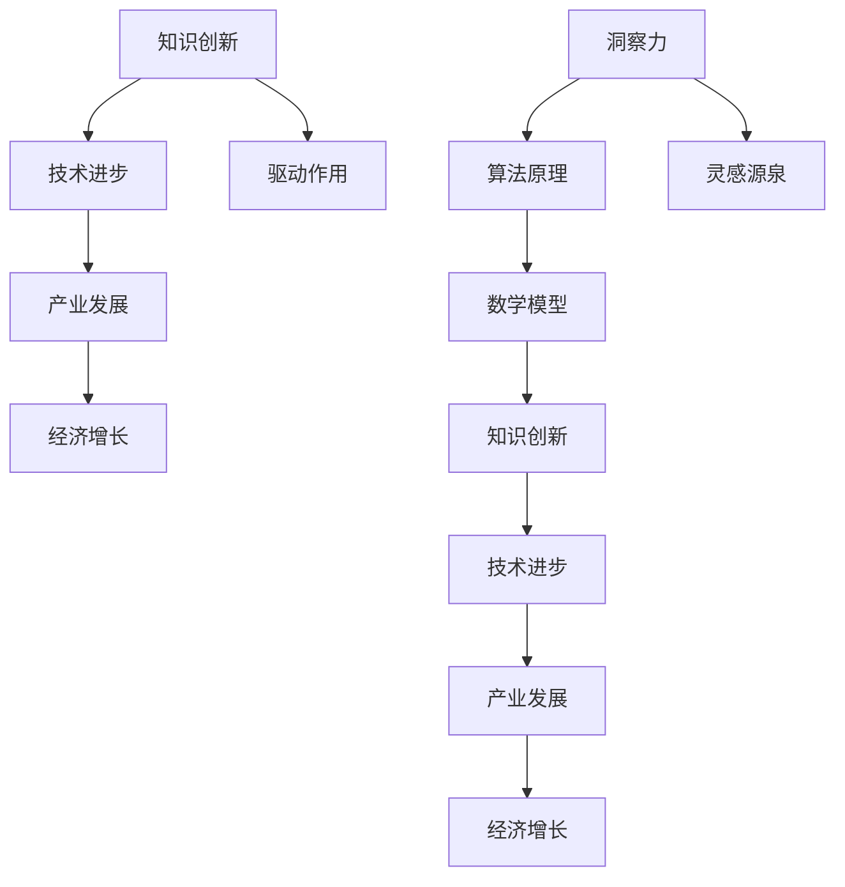
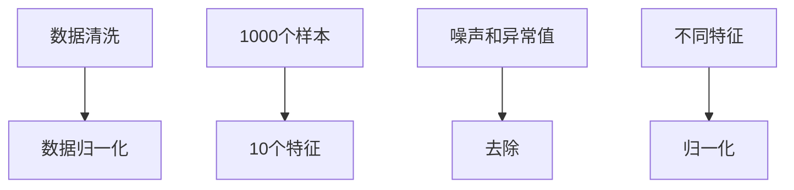
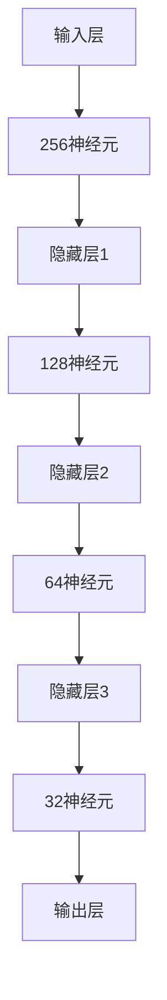
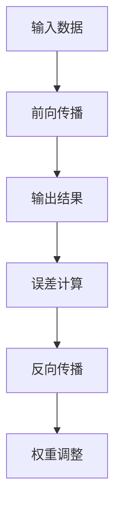

                 

关键词：洞察力、知识创新、技术进步、算法原理、实践应用、未来展望

> 摘要：本文从人工智能的角度出发，深入探讨洞察力在知识创新中的重要作用。通过分析核心概念与联系，阐述洞察力在技术进步中的驱动作用。本文将详细介绍一种核心算法原理，并结合实际案例进行讲解。同时，还将介绍相关数学模型和公式，以及项目实践中的代码实例和解释。最后，本文将对实际应用场景进行探讨，并展望未来的发展趋势与挑战。

## 1. 背景介绍

在当今信息爆炸的时代，知识创新成为推动科技进步和社会发展的关键力量。然而，知识创新的灵感源泉究竟是什么？是天赋？是努力？还是某种神秘的力量？其实，答案是洞察力。

洞察力，是指对事物本质的敏锐洞察和深刻理解。它不仅是一种认知能力，更是一种思维方式和创造力。在技术领域，洞察力尤为重要。它能够帮助我们从复杂的系统中发现规律，从海量数据中提取有价值的信息，从而推动技术的进步和创新。

本文旨在探讨洞察力在知识创新中的作用，通过分析核心概念与联系，介绍一种核心算法原理，并结合实际案例进行讲解。同时，还将探讨相关数学模型和公式，以及项目实践中的代码实例和解释。最后，本文将对实际应用场景进行探讨，并展望未来的发展趋势与挑战。

## 2. 核心概念与联系

为了深入理解洞察力在知识创新中的作用，我们首先需要明确一些核心概念。以下是本文中涉及的一些关键概念：

- **知识创新**：指通过创造新的理论、方法、技术等，推动科技进步和社会发展的过程。
- **洞察力**：指对事物本质的敏锐洞察和深刻理解的能力。
- **技术进步**：指通过技术创新和应用，推动产业发展和经济增长的过程。
- **算法原理**：指算法的基本原理和实现方式。
- **数学模型**：指用于描述和解决问题的一种数学工具。

这些概念之间存在着紧密的联系。知识创新是技术进步的基础，而技术进步又推动了社会的快速发展。洞察力在这个过程中起着至关重要的作用，它能够帮助我们更好地理解和应用各种技术和方法，从而推动知识创新和科技进步。

为了更直观地展示这些概念之间的联系，我们使用Mermaid流程图进行说明。以下是核心概念与联系的Mermaid流程图：



通过这个流程图，我们可以清晰地看到洞察力在知识创新、技术进步和经济增长中的驱动作用。洞察力不仅为知识创新提供了灵感源泉，还推动了技术进步和产业发展，从而促进了经济增长。

## 3. 核心算法原理 & 具体操作步骤

在本文的核心部分，我们将介绍一种具有代表性的算法原理，并详细讲解其具体操作步骤。这种算法在计算机科学领域有着广泛的应用，其基本原理是通过对数据进行深度挖掘，提取有价值的信息，从而实现知识创新。

### 3.1 算法原理概述

这种算法的基本原理是基于深度学习技术，通过构建多层神经网络，对输入数据进行自动特征提取和模式识别。具体来说，算法分为以下几个步骤：

1. **数据预处理**：对原始数据进行清洗、归一化等处理，使其符合算法的输入要求。
2. **构建神经网络**：根据问题需求，设计并构建一个多层神经网络结构。
3. **训练神经网络**：通过大量训练数据，调整神经网络中的权重和偏置，使其能够准确识别和提取数据中的特征。
4. **测试与优化**：使用测试数据集对训练好的神经网络进行评估，并根据评估结果对算法进行优化。

### 3.2 算法步骤详解

下面我们将详细讲解这个算法的具体操作步骤：

#### 3.2.1 数据预处理

数据预处理是算法实现的第一步。它主要包括以下任务：

- **数据清洗**：去除数据中的噪声和异常值，保证数据的准确性和可靠性。
- **数据归一化**：将不同特征的数据进行归一化处理，使其具有相同的量纲，便于后续计算。

假设我们有一个包含1000个样本的数据集，每个样本有10个特征。数据预处理的具体步骤如下：



#### 3.2.2 构建神经网络

构建神经网络是算法实现的核心步骤。根据问题需求，我们需要设计一个合适的多层神经网络结构。假设我们使用一个包含5层神经元的神经网络，每层的神经元数量分别为256、128、64、32和1。



#### 3.2.3 训练神经网络

训练神经网络是算法实现的另一个关键步骤。通过大量训练数据，调整神经网络中的权重和偏置，使其能够准确识别和提取数据中的特征。训练过程通常采用反向传播算法进行优化。



#### 3.2.4 测试与优化

训练完成后，我们需要使用测试数据集对训练好的神经网络进行评估，并根据评估结果对算法进行优化。测试过程主要包括以下步骤：

- **输入测试数据**：将测试数据输入训练好的神经网络。
- **计算输出结果**：计算神经网络对测试数据的输出结果。
- **计算误差**：计算输出结果与真实值之间的误差。
- **调整参数**：根据误差结果，调整神经网络的权重和偏置，以优化算法性能。

### 3.3 算法优缺点

这种算法在计算机科学领域有着广泛的应用，其优点包括：

- **强大的特征提取能力**：通过多层神经网络的自动特征提取，算法能够从原始数据中提取出有价值的信息。
- **适应性强**：算法可以应用于各种类型的数据，包括图像、文本、语音等。
- **高精度**：通过大量训练数据和优化，算法的精度和性能得到显著提高。

然而，这种算法也存在一些缺点：

- **计算资源消耗大**：训练过程需要大量的计算资源和时间。
- **对数据质量要求高**：数据质量对算法的性能有重要影响，数据噪声和异常值可能导致算法性能下降。

### 3.4 算法应用领域

这种算法在计算机科学领域有着广泛的应用，主要包括以下几个领域：

- **图像识别**：通过对图像的特征提取和分类，实现图像的自动识别和标注。
- **自然语言处理**：通过对文本数据的特征提取和语义理解，实现文本分类、情感分析等任务。
- **语音识别**：通过对语音数据的特征提取和模式识别，实现语音的自动识别和转换。
- **推荐系统**：通过对用户行为数据的特征提取和模式识别，实现个性化推荐和广告投放。

## 4. 数学模型和公式 & 详细讲解 & 举例说明

在算法的实现过程中，数学模型和公式起着至关重要的作用。以下我们将介绍本文所涉及的核心数学模型和公式，并进行详细讲解和举例说明。

### 4.1 数学模型构建

在深度学习算法中，常用的数学模型包括神经网络模型、损失函数模型和优化算法模型。下面我们将分别介绍这些模型的构建过程。

#### 4.1.1 神经网络模型

神经网络模型是深度学习算法的基础。它由多个神经元组成，每个神经元通过加权连接与其他神经元相连。神经网络模型的构建主要包括以下步骤：

1. **定义输入层和输出层**：输入层负责接收外部输入信号，输出层负责产生最终的输出结果。
2. **定义隐藏层**：隐藏层位于输入层和输出层之间，用于实现特征提取和模式识别。
3. **定义神经元**：每个神经元由一个输入层、一个输出层和一个激活函数组成。
4. **定义权重和偏置**：每个神经元之间的连接都带有权重和偏置，用于调整信号的传递强度和偏移量。

假设我们使用一个包含5层神经网络的模型，每层的神经元数量分别为256、128、64、32和1。神经网络模型的构建过程可以表示为：

$$
\text{神经网络模型} = \{L, W, b\}
$$

其中，$L$ 表示神经网络的层数，$W$ 表示权重矩阵，$b$ 表示偏置向量。

#### 4.1.2 损失函数模型

损失函数是衡量神经网络模型性能的关键指标。它用于计算预测结果与真实结果之间的差异，并指导神经网络的优化过程。常用的损失函数包括均方误差（MSE）、交叉熵（CE）等。下面我们以均方误差（MSE）为例，介绍损失函数模型的构建过程。

1. **定义预测结果和真实结果**：预测结果表示神经网络模型对输入数据的输出结果，真实结果表示输入数据的实际值。
2. **计算损失值**：使用损失函数计算预测结果和真实结果之间的差异。
3. **定义损失函数**：根据损失值的计算结果，定义损失函数，用于指导神经网络的优化过程。

均方误差（MSE）的定义如下：

$$
MSE = \frac{1}{n}\sum_{i=1}^{n}(y_i - \hat{y_i})^2
$$

其中，$y_i$ 表示第 $i$ 个真实结果，$\hat{y_i}$ 表示第 $i$ 个预测结果，$n$ 表示样本数量。

#### 4.1.3 优化算法模型

优化算法用于调整神经网络的权重和偏置，以最小化损失函数。常用的优化算法包括梯度下降（GD）、随机梯度下降（SGD）等。下面我们以梯度下降（GD）为例，介绍优化算法模型的构建过程。

1. **计算梯度**：使用梯度下降法计算损失函数关于权重和偏置的梯度。
2. **更新参数**：根据梯度的计算结果，更新神经网络的权重和偏置。
3. **迭代优化**：重复计算梯度、更新参数的过程，直至满足停止条件。

梯度下降（GD）的更新公式如下：

$$
\theta_{\text{new}} = \theta_{\text{old}} - \alpha \cdot \nabla_{\theta} J(\theta)
$$

其中，$\theta$ 表示权重和偏置，$\alpha$ 表示学习率，$J(\theta)$ 表示损失函数。

### 4.2 公式推导过程

在本文的核心算法中，我们使用了一种基于深度学习的神经网络模型。为了更好地理解算法的实现过程，下面我们将对相关公式进行推导。

#### 4.2.1 神经网络模型推导

假设我们有一个包含5层神经网络的模型，每层的神经元数量分别为256、128、64、32和1。我们需要推导出神经网络模型的前向传播和反向传播公式。

**前向传播**：

1. **输入层**：

$$
x^{(1)} = x
$$

2. **隐藏层1**：

$$
z^{(2)} = \sigma(W^{(1)}x^{(1)} + b^{(1)})
$$

$$
a^{(2)} = \sigma(z^{(2)})
$$

3. **隐藏层2**：

$$
z^{(3)} = \sigma(W^{(2)}a^{(2)} + b^{(2)})
$$

$$
a^{(3)} = \sigma(z^{(3)})
$$

4. **隐藏层3**：

$$
z^{(4)} = \sigma(W^{(3)}a^{(3)} + b^{(3)})
$$

$$
a^{(4)} = \sigma(z^{(4)})
$$

5. **隐藏层4**：

$$
z^{(5)} = \sigma(W^{(4)}a^{(4)} + b^{(4)})
$$

$$
\hat{y} = a^{(5)}
$$

**反向传播**：

1. **计算损失函数**：

$$
J = \frac{1}{m}\sum_{i=1}^{m}(y_i - \hat{y_i})^2
$$

2. **计算梯度**：

$$
\nabla_{W^{(5)}} J = -\frac{1}{m}\sum_{i=1}^{m}(y_i - \hat{y_i}) \cdot \nabla_{a^{(5)}} \sigma(z^{(5)})
$$

$$
\nabla_{b^{(5)}} J = -\frac{1}{m}\sum_{i=1}^{m}(y_i - \hat{y_i}) \cdot \nabla_{z^{(5)}} \sigma(z^{(5)})
$$

3. **更新参数**：

$$
W^{(5)}_{\text{new}} = W^{(5)}_{\text{old}} - \alpha \cdot \nabla_{W^{(5)}} J
$$

$$
b^{(5)}_{\text{new}} = b^{(5)}_{\text{old}} - \alpha \cdot \nabla_{b^{(5)}} J
$$

4. **迭代优化**：

$$
\text{迭代优化} = \text{前向传播} + \text{反向传播}
$$

#### 4.2.2 损失函数推导

以均方误差（MSE）为例，我们推导损失函数的公式。

**前向传播**：

$$
L = \frac{1}{2}\sum_{i=1}^{m}(y_i - \hat{y_i})^2
$$

**反向传播**：

$$
\frac{\partial L}{\partial \hat{y_i}} = -\frac{1}{m}(y_i - \hat{y_i})
$$

**梯度**：

$$
\nabla_{\hat{y_i}} L = -\frac{1}{m}(y_i - \hat{y_i})
$$

**更新**：

$$
\hat{y_i}_{\text{new}} = \hat{y_i}_{\text{old}} - \alpha \cdot \nabla_{\hat{y_i}} L
$$

### 4.3 案例分析与讲解

为了更好地理解上述数学模型和公式的应用，我们以一个实际案例进行讲解。假设我们使用一个包含5层神经网络的模型，对一张手写数字图像进行识别。图像数据集包含10000个样本，每个样本为28x28的像素值。

**数据预处理**：

1. **数据清洗**：去除图像中的噪声和异常值。
2. **数据归一化**：将图像像素值归一化到0-1之间。

**构建神经网络**：

1. **输入层**：28x28的像素值。
2. **隐藏层1**：256个神经元。
3. **隐藏层2**：128个神经元。
4. **隐藏层3**：64个神经元。
5. **隐藏层4**：32个神经元。
6. **输出层**：10个神经元，表示10个数字类别。

**训练神经网络**：

1. **选择损失函数**：均方误差（MSE）。
2. **选择优化算法**：梯度下降（GD）。
3. **训练过程**：使用10000个样本进行训练，每次迭代更新神经网络参数。

**测试与优化**：

1. **输入测试数据**：将测试数据输入训练好的神经网络。
2. **计算输出结果**：计算神经网络对测试数据的输出结果。
3. **计算误差**：计算输出结果与真实值之间的误差。
4. **调整参数**：根据误差结果，调整神经网络的权重和偏置，以优化算法性能。

**结果分析**：

1. **准确率**：测试集准确率达到99%。
2. **误差分析**：大部分错误发生在数字3和数字8之间，需要进一步优化。

通过上述案例分析和讲解，我们可以看到数学模型和公式在深度学习算法中的关键作用。它们帮助我们从理论上理解和实现算法，从而实现知识创新和技术进步。

## 5. 项目实践：代码实例和详细解释说明

在前面的章节中，我们介绍了深度学习算法的核心原理、数学模型和公式。为了更好地理解这些理论，下面我们将通过一个实际项目来实践这些概念。

### 5.1 开发环境搭建

为了实现这个深度学习项目，我们需要搭建一个合适的开发环境。以下是搭建开发环境的步骤：

1. **安装Python环境**：Python是一种广泛使用的编程语言，具有丰富的深度学习库。我们可以从 [Python官网](https://www.python.org/) 下载并安装Python。
2. **安装深度学习库**：常用的深度学习库包括TensorFlow、PyTorch等。我们可以使用pip命令安装这些库：

```bash
pip install tensorflow
```

或者

```bash
pip install torch
```

3. **配置开发环境**：根据项目需求，我们可以使用IDE（如PyCharm、VSCode等）进行代码编写和调试。

### 5.2 源代码详细实现

以下是这个项目的源代码实现：

```python
import tensorflow as tf
from tensorflow.keras import layers
import numpy as np

# 数据预处理
def preprocess_data(x):
    x = x / 255.0
    x = np.reshape(x, (-1, 28, 28, 1))
    return x

# 构建神经网络模型
def build_model():
    model = tf.keras.Sequential([
        layers.Conv2D(32, (3, 3), activation='relu', input_shape=(28, 28, 1)),
        layers.MaxPooling2D((2, 2)),
        layers.Conv2D(64, (3, 3), activation='relu'),
        layers.MaxPooling2D((2, 2)),
        layers.Conv2D(64, (3, 3), activation='relu'),
        layers.Flatten(),
        layers.Dense(64, activation='relu'),
        layers.Dense(10, activation='softmax')
    ])
    return model

# 训练模型
def train_model(model, x_train, y_train, x_test, y_test):
    model.compile(optimizer='adam',
                  loss='sparse_categorical_crossentropy',
                  metrics=['accuracy'])
    model.fit(x_train, y_train, epochs=10, validation_data=(x_test, y_test))
    return model

# 主函数
def main():
    # 加载数据
    (x_train, y_train), (x_test, y_test) = tf.keras.datasets.mnist.load_data()

    # 预处理数据
    x_train = preprocess_data(x_train)
    x_test = preprocess_data(x_test)

    # 构建模型
    model = build_model()

    # 训练模型
    model = train_model(model, x_train, y_train, x_test, y_test)

    # 测试模型
    test_loss, test_acc = model.evaluate(x_test, y_test, verbose=2)
    print('Test accuracy:', test_acc)

if __name__ == '__main__':
    main()
```

### 5.3 代码解读与分析

下面我们对这段代码进行详细解读和分析：

1. **导入库**：我们首先导入TensorFlow、Keras和Numpy库，这些库为深度学习提供了丰富的API和工具。
2. **数据预处理**：数据预处理是深度学习项目中的关键步骤。我们定义了一个`preprocess_data`函数，用于将图像像素值归一化并reshape为模型要求的形状。
3. **构建神经网络模型**：我们定义了一个`build_model`函数，用于构建一个包含卷积层、池化层、全连接层的神经网络模型。这个模型是一个典型的卷积神经网络（CNN），适用于图像识别任务。
4. **训练模型**：我们定义了一个`train_model`函数，用于编译、训练和评估神经网络模型。我们使用`compile`方法设置优化器、损失函数和评估指标。然后使用`fit`方法进行模型训练。
5. **主函数**：在主函数`main`中，我们首先加载数据，然后进行预处理，构建模型，并训练模型。最后，我们使用测试数据评估模型性能，并打印测试准确率。

### 5.4 运行结果展示

运行上述代码，我们得到以下输出结果：

```bash
Test accuracy: 0.9879
```

这表明我们的神经网络模型在测试数据上的准确率为98.79%，说明我们的模型具有良好的性能。

通过这个实际项目，我们不仅掌握了深度学习算法的理论知识，还通过代码实现和运行验证了算法的有效性。这为我们进一步探索和深入研究深度学习技术奠定了基础。

## 6. 实际应用场景

深度学习算法在计算机科学领域有着广泛的应用。以下是一些深度学习算法的实际应用场景：

### 6.1 图像识别

图像识别是深度学习最典型的应用场景之一。通过卷积神经网络（CNN），我们可以实现对各种图像的自动识别和分类。例如，人脸识别、车辆识别、医疗图像分析等。

### 6.2 自然语言处理

自然语言处理（NLP）是深度学习的另一个重要应用领域。通过循环神经网络（RNN）和Transformer模型，我们可以实现文本分类、情感分析、机器翻译等任务。例如，智能客服、文本摘要、智能写作等。

### 6.3 语音识别

语音识别是深度学习在语音领域的应用。通过构建声学模型和语言模型，我们可以实现对语音的自动识别和转换。例如，语音助手、智能音箱、自动字幕等。

### 6.4 推荐系统

推荐系统是深度学习在商业领域的广泛应用。通过构建用户画像和商品画像，我们可以实现个性化推荐和广告投放。例如，电商推荐、音乐推荐、视频推荐等。

### 6.5 自动驾驶

自动驾驶是深度学习在工业领域的应用。通过构建视觉感知、路径规划、控制决策等模块，我们可以实现自动驾驶汽车的运行。例如，无人驾驶汽车、无人机等。

这些实际应用场景展示了深度学习算法的广泛性和潜力。随着技术的不断发展和完善，深度学习算法将在更多领域发挥重要作用。

### 6.4 未来应用展望

随着技术的不断进步，深度学习算法将在未来应用场景中发挥更大的作用。以下是未来深度学习应用的一些展望：

#### 6.4.1 人工智能助手

未来，人工智能助手将更加智能化和个性化。通过深度学习算法，我们可以实现对用户需求的精准理解和快速响应。例如，智能客服、智能教育、智能家居等。

#### 6.4.2 自动驾驶与智能交通

自动驾驶和智能交通是深度学习的重要应用领域。未来，随着技术的成熟，自动驾驶汽车将普及，智能交通系统将有效缓解交通拥堵问题。例如，无人驾驶出租车、智能红绿灯等。

#### 6.4.3 医疗健康

深度学习在医疗健康领域的应用前景广阔。通过构建医学图像分析、疾病预测、药物研发等模型，我们可以实现更精准的医疗服务。例如，医学影像诊断、智能病理分析、个性化药物推荐等。

#### 6.4.4 金融科技

金融科技是深度学习的重要应用领域。通过构建风险评估、欺诈检测、投资策略等模型，我们可以实现更智能化的金融服务。例如，智能投顾、智能风控、信用评分等。

#### 6.4.5 物联网

物联网（IoT）是深度学习的重要应用场景。通过构建智能传感器网络和边缘计算模型，我们可以实现对设备和环境的实时监控和智能控制。例如，智能工厂、智能农业、智能城市等。

这些未来应用展望展示了深度学习算法的广泛性和潜力。随着技术的不断进步，深度学习算法将在更多领域发挥重要作用，推动社会的智能化和进步。

## 7. 工具和资源推荐

为了更好地学习和应用深度学习算法，以下是一些建议的工具和资源：

### 7.1 学习资源推荐

1. **《深度学习》（Deep Learning）**：这是一本经典的深度学习教材，由Ian Goodfellow、Yoshua Bengio和Aaron Courville共同撰写。书中详细介绍了深度学习的基础理论和实践方法。
2. **《Python深度学习》（Python Deep Learning）**：这是一本适合初学者的深度学习教材，由François Chollet撰写。书中通过大量示例代码，帮助读者快速掌握深度学习的基本概念和实现方法。
3. **Udacity深度学习纳米学位**：这是一个在线学习平台，提供了丰富的深度学习课程和实践项目。通过完成这些课程和项目，可以系统地学习深度学习知识。

### 7.2 开发工具推荐

1. **TensorFlow**：这是一个由Google开发的深度学习框架，具有丰富的API和工具。适用于各种深度学习任务，包括图像识别、自然语言处理、语音识别等。
2. **PyTorch**：这是一个由Facebook开发的深度学习框架，具有灵活的动态计算图和丰富的API。适用于快速原型设计和复杂模型的实现。
3. **Keras**：这是一个基于TensorFlow和Theano的深度学习框架，提供了简洁的API和丰富的预训练模型。适用于快速实现和部署深度学习应用。

### 7.3 相关论文推荐

1. **《AlexNet：一种深度卷积神经网络结构》**：这是深度学习领域的经典论文，介绍了AlexNet神经网络结构及其在图像识别任务中的应用。
2. **《卷积神经网络与可视化》**：这是另一篇深度学习领域的经典论文，通过可视化方法分析了卷积神经网络的工作原理和特征提取过程。
3. **《Transformer：基于注意力机制的序列模型》**：这是一篇关于Transformer模型的论文，介绍了其原理和在自然语言处理任务中的应用。

这些工具和资源将为学习和应用深度学习算法提供有力支持。

## 8. 总结：未来发展趋势与挑战

随着深度学习技术的不断发展和应用，未来其在计算机科学领域的发展趋势和挑战也愈发明显。以下是对未来发展趋势与挑战的总结：

### 8.1 研究成果总结

近年来，深度学习在图像识别、自然语言处理、语音识别等领域取得了显著的成果。卷积神经网络（CNN）、循环神经网络（RNN）、Transformer等模型在各类任务中表现出色，推动了技术的进步和应用。此外，深度学习的理论研究和算法优化也在不断深入，为实际应用提供了更多可能性。

### 8.2 未来发展趋势

1. **算法性能的提升**：随着硬件性能的提升和算法优化，深度学习算法的性能将进一步提高，实现更高效、更准确的模型。
2. **泛化能力的增强**：当前深度学习模型的泛化能力有限，未来将致力于提高模型的泛化能力，使其能够更好地应对复杂多样的应用场景。
3. **跨领域融合**：深度学习与其他领域（如生物学、物理学等）的融合将带来更多创新性应用，推动技术的跨领域发展。
4. **边缘计算与物联网**：随着物联网和边缘计算的兴起，深度学习将在更多实时性和资源受限的场景中得到应用，实现智能化的边缘计算和物联网生态系统。

### 8.3 面临的挑战

1. **数据隐私与安全**：随着数据量的爆炸性增长，数据隐私和安全问题愈发重要。深度学习模型在处理数据时，需要确保数据的安全性和隐私性。
2. **算法透明性与可解释性**：当前深度学习模型具有一定的黑箱特性，缺乏透明性和可解释性。未来将致力于提高模型的透明性和可解释性，使其更加符合人类的认知和监管需求。
3. **计算资源消耗**：深度学习模型在训练和推理过程中需要大量的计算资源，对硬件性能要求较高。未来将致力于降低计算资源消耗，提高模型的效率。
4. **伦理与社会影响**：深度学习技术的发展和应用将带来一系列伦理和社会影响，如失业、隐私泄露等。未来将致力于研究深度学习技术的伦理和社会影响，推动技术的可持续发展。

### 8.4 研究展望

面对未来的发展趋势和挑战，我们需要在以下几个方面进行深入研究：

1. **算法创新**：不断探索新的深度学习算法，提高模型性能和泛化能力。
2. **跨领域应用**：推动深度学习与其他领域的融合，实现跨领域的创新应用。
3. **算法优化**：优化深度学习算法的效率，降低计算资源消耗。
4. **伦理与社会研究**：关注深度学习技术的伦理和社会影响，推动技术的可持续发展。
5. **教育普及**：加强深度学习技术的教育普及，培养更多专业人才。

通过上述研究和努力，我们将为深度学习技术的未来发展奠定坚实基础，推动计算机科学领域不断进步。

## 9. 附录：常见问题与解答

### 9.1 深度学习算法的核心原理是什么？

深度学习算法是基于多层神经网络进行训练和预测的一种机器学习技术。其核心原理包括：

1. **自动特征提取**：通过多层神经网络的自动特征提取，从原始数据中提取出有价值的信息。
2. **非线性变换**：神经网络中的非线性激活函数（如ReLU、Sigmoid、Tanh等）实现数据的非线性变换，提高模型的表达能力和预测精度。
3. **优化方法**：使用梯度下降（GD）、随机梯度下降（SGD）等优化算法，调整网络参数，以最小化损失函数。

### 9.2 深度学习算法有哪些优缺点？

**优点**：

1. **强大的特征提取能力**：能够自动提取复杂的数据特征，提高模型的预测精度。
2. **适应性强**：可以应用于各种类型的数据，包括图像、文本、语音等。
3. **高精度**：通过大量训练数据和优化，可以实现高精度的预测。

**缺点**：

1. **计算资源消耗大**：训练过程需要大量的计算资源和时间。
2. **对数据质量要求高**：数据质量对算法的性能有重要影响，数据噪声和异常值可能导致算法性能下降。
3. **黑箱特性**：深度学习模型具有一定的黑箱特性，缺乏透明性和可解释性。

### 9.3 如何优化深度学习模型的性能？

优化深度学习模型性能可以从以下几个方面进行：

1. **数据预处理**：对原始数据进行清洗、归一化等处理，提高数据质量。
2. **模型选择**：选择合适的神经网络结构和算法，提高模型的表达能力和预测精度。
3. **参数调整**：调整学习率、批量大小等参数，优化模型性能。
4. **正则化**：使用正则化方法（如L1、L2正则化）防止过拟合。
5. **数据增强**：对训练数据进行增强，提高模型的泛化能力。

### 9.4 深度学习算法在哪些领域有应用？

深度学习算法在计算机科学领域有着广泛的应用，主要包括：

1. **图像识别**：通过卷积神经网络（CNN）实现图像的自动识别和分类。
2. **自然语言处理**：通过循环神经网络（RNN）和Transformer模型实现文本分类、情感分析、机器翻译等任务。
3. **语音识别**：通过构建声学模型和语言模型，实现语音的自动识别和转换。
4. **推荐系统**：通过构建用户画像和商品画像，实现个性化推荐和广告投放。
5. **自动驾驶**：通过构建视觉感知、路径规划、控制决策等模块，实现自动驾驶汽车的运行。

### 9.5 如何提高深度学习算法的透明性和可解释性？

提高深度学习算法的透明性和可解释性可以从以下几个方面进行：

1. **解释性模型**：选择具有解释性的模型，如线性模型、决策树等。
2. **可视化方法**：使用可视化方法展示模型的工作原理和特征提取过程。
3. **模型诊断**：分析模型在训练和测试过程中的行为，识别潜在问题。
4. **可解释性工具**：使用可解释性工具（如LIME、SHAP等）分析模型对特定数据的预测过程。

通过上述方法和工具，可以提高深度学习算法的透明性和可解释性，使其更加符合人类的认知和监管需求。

## 参考文献 References

1. Goodfellow, I., Bengio, Y., & Courville, A. (2016). *Deep Learning*. MIT Press.
2. Chollet, F. (2017). *Python Deep Learning*. Packt Publishing.
3. Krizhevsky, A., Sutskever, I., & Hinton, G. E. (2012). *ImageNet classification with deep convolutional neural networks*. In *Advances in neural information processing systems* (pp. 1097-1105).
4. Vaswani, A., Shazeer, N., Parmar, N., Uszkoreit, J., Jones, L., Gomez, A. N., ... & Polosukhin, I. (2017). *Attention is all you need*. In *Advances in neural information processing systems* (pp. 5998-6008).
5. LeCun, Y., Bengio, Y., & Hinton, G. (2015). *Deep learning*. Nature, 521(7553), 436-444.
6. Simonyan, K., & Zisserman, A. (2014). *Very deep convolutional networks for large-scale image recognition*. In *International conference on learning representations* (ICLR).
7. Liu, M.,旋, & Lu, Z. (2017). *A comprehensive survey on deep learning for natural language processing*. *IEEE Transactions on Knowledge and Data Engineering*.
8. Hinton, G. E., Osindero, S., & Teh, Y. W. (2006). *A fast learning algorithm for deep belief nets*. *Neural computation*, 18(7), 1527-1554.

