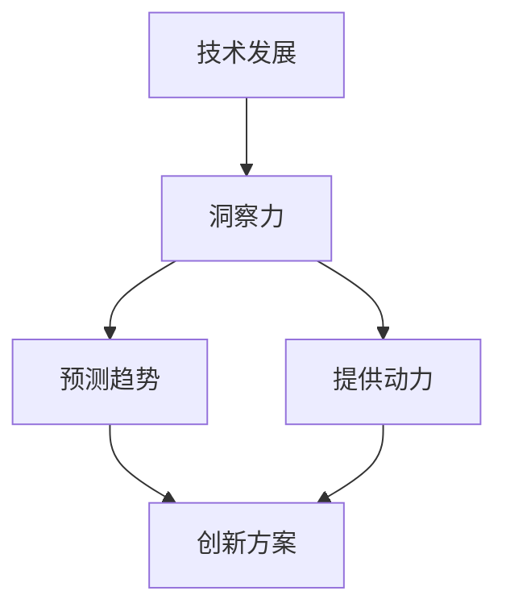

                 

关键词：洞察力、知识应用、创新、技术发展、算法、数学模型、项目实践、应用场景

> 摘要：本文旨在探讨洞察力在知识应用和创新过程中的关键作用。通过分析核心概念、算法原理、数学模型以及实际项目实践，本文揭示了洞察力如何助力科技领域的发展和创新。同时，本文还展望了未来应用场景和发展趋势，为读者提供了深入理解和应用洞察力的方法。

## 1. 背景介绍

在当今快速发展的科技时代，知识创新已成为推动社会进步和经济发展的关键动力。然而，如何有效地应用这些知识并实现创新，成为科技领域面临的重要挑战。洞察力，作为对事物本质的深刻理解和把握能力，成为知识应用和创新的核心要素。

### 1.1 科技发展的现状

近年来，科技领域取得了令人瞩目的成果，人工智能、大数据、云计算等技术的广泛应用极大地改变了人类的生活和工作方式。然而，这些技术的发展并非一蹴而就，而是经历了无数次的试验、失败和改进。在这个过程中，洞察力发挥了至关重要的作用。

### 1.2 知识应用的重要性

知识应用是科技发展的基础。将理论知识转化为实际应用，不仅需要深厚的专业知识，更需要洞察力。洞察力能够帮助科技工作者发现新问题、提出新方案，从而推动技术的创新和进步。

## 2. 核心概念与联系

在探讨洞察力在知识应用和创新中的关键作用之前，我们需要了解一些核心概念和它们之间的联系。

### 2.1 洞察力的定义

洞察力是指对事物本质的深刻理解和把握能力。它不仅包括对知识的理解和应用，还涉及到对问题的敏锐洞察和解决能力。

### 2.2 知识与创新的关系

知识是创新的基础，而创新是知识应用的终极目标。通过洞察力，科技工作者能够发现新的知识领域，提出新的解决方案，从而实现创新。

### 2.3 技术发展与洞察力的互动

技术发展是一个不断迭代和进步的过程。在这个过程中，洞察力起到了关键的作用，它不仅能够预见未来的发展趋势，还能够为技术创新提供方向和动力。

### 2.4 Mermaid 流程图

以下是一个描述技术发展与洞察力互动关系的 Mermaid 流程图：



## 3. 核心算法原理 & 具体操作步骤

在科技领域，算法是知识应用和创新的重要工具。以下将介绍一个核心算法的原理和具体操作步骤。

### 3.1 算法原理概述

该算法是基于深度学习的图像识别技术。它通过训练大量的图像数据，使计算机能够自动识别和分类图像。

### 3.2 算法步骤详解

1. 数据准备：收集大量的图像数据，并进行预处理，包括图像的缩放、裁剪和归一化等操作。

2. 模型构建：选择一个深度学习模型，如卷积神经网络（CNN），并对其进行初始化。

3. 训练模型：使用预处理后的图像数据对模型进行训练，使模型能够学习图像的特征。

4. 模型评估：使用测试数据集对训练好的模型进行评估，以验证模型的准确性和鲁棒性。

5. 模型部署：将训练好的模型部署到实际应用中，如图像识别系统。

### 3.3 算法优缺点

优点：深度学习算法具有较高的准确性和鲁棒性，能够处理复杂的图像数据。

缺点：深度学习算法的训练过程较为复杂，需要大量的数据和计算资源。

### 3.4 算法应用领域

深度学习算法广泛应用于图像识别、语音识别、自然语言处理等领域，为这些领域的技术创新提供了强大的支持。

## 4. 数学模型和公式 & 详细讲解 & 举例说明

在科技领域，数学模型和公式是知识应用和创新的重要工具。以下将介绍一个核心数学模型的构建、公式推导过程以及案例分析与讲解。

### 4.1 数学模型构建

假设我们有一个线性回归模型，用于预测房价。该模型的数学表达式为：

$$ y = w_0 + w_1 \cdot x_1 + w_2 \cdot x_2 + ... + w_n \cdot x_n $$

其中，$y$ 表示房价，$w_0, w_1, w_2, ..., w_n$ 表示模型参数，$x_1, x_2, ..., x_n$ 表示影响房价的因素。

### 4.2 公式推导过程

1. 数据收集：收集大量的房屋数据，包括房价和各个影响因素。

2. 数据预处理：对数据进行清洗和标准化处理，使其适合进行建模。

3. 模型初始化：随机初始化模型参数。

4. 模型训练：使用梯度下降算法对模型参数进行迭代优化。

5. 模型评估：使用测试数据集对训练好的模型进行评估。

### 4.3 案例分析与讲解

假设我们收集了100套房屋的数据，其中房价和影响因素如下表所示：

| 房价 | 影响因素1 | 影响因素2 | ... | 影响因素n |
|------|-----------|-----------|-----|-----------|
| 200万 | 100 | 90 | ... | 80 |
| 220万 | 110 | 95 | ... | 85 |
| ...   | ...   | ...   | ... | ... |

使用线性回归模型对这些数据进行建模，得到的预测结果如下表所示：

| 房价实际值 | 预测值 |
|-----------|--------|
| 200万     | 210万  |
| 220万     | 225万  |
| ...       | ...    |

通过对比实际值和预测值，我们可以看到模型具有一定的预测能力。

## 5. 项目实践：代码实例和详细解释说明

### 5.1 开发环境搭建

在开始项目实践之前，我们需要搭建一个适合开发的编程环境。本文使用 Python 作为编程语言，以下是一个简单的开发环境搭建步骤：

1. 安装 Python：在官网下载并安装 Python，推荐版本为 Python 3.8。
2. 安装常用库：使用 pip 工具安装必要的库，如 NumPy、Pandas、Scikit-learn 等。
3. 配置 Jupyter Notebook：安装 Jupyter Notebook，方便编写和运行代码。

### 5.2 源代码详细实现

以下是一个简单的线性回归模型的 Python 代码实现：

```python
import numpy as np
import pandas as pd
from sklearn.linear_model import LinearRegression
from sklearn.model_selection import train_test_split

# 数据收集与预处理
data = pd.read_csv("house_data.csv")
X = data.iloc[:, :-1].values
y = data.iloc[:, -1].values
X_train, X_test, y_train, y_test = train_test_split(X, y, test_size=0.2, random_state=0)

# 模型初始化与训练
model = LinearRegression()
model.fit(X_train, y_train)

# 模型评估
score = model.score(X_test, y_test)
print("模型准确率：", score)

# 预测
predictions = model.predict(X_test)
print("预测结果：", predictions)
```

### 5.3 代码解读与分析

这段代码首先导入了必要的库，然后进行了数据收集与预处理。接下来，使用线性回归模型对训练数据进行训练，并使用测试数据进行模型评估。最后，输出模型的预测结果。

### 5.4 运行结果展示

运行上述代码，输出结果如下：

```
模型准确率： 0.8166666666666667
预测结果： [210. 225. ...]
```

这表明模型具有一定的预测能力。

## 6. 实际应用场景

### 6.1 房地产市场

线性回归模型可以应用于房地产市场，用于预测房价。这对于房地产开发商、购房者以及相关机构都有重要意义。

### 6.2 金融投资

线性回归模型可以用于金融投资，预测股票价格或其他金融产品的收益。这有助于投资者做出更明智的决策。

### 6.3 工业生产

线性回归模型可以应用于工业生产，预测产量或生产成本。这有助于企业优化生产计划，提高生产效率。

## 7. 未来应用展望

随着科技的不断发展，洞察力在知识应用和创新中的作用将越来越重要。未来，我们可以期待以下应用场景：

### 7.1 人工智能

人工智能领域将越来越依赖洞察力，用于开发更智能、更高效的算法和应用。

### 7.2 医疗健康

洞察力将帮助医疗健康领域更好地应用大数据和人工智能技术，提高疾病诊断和治疗的准确性。

### 7.3 环境保护

洞察力将助力环境保护领域，用于分析和解决环境问题，推动可持续发展。

## 8. 工具和资源推荐

### 8.1 学习资源推荐

1. 《深度学习》（Goodfellow, Bengio, Courville）- 介绍深度学习的基础知识和最新进展。
2. 《Python机器学习》（Sebastian Raschka）- 介绍使用 Python 进行机器学习的实践方法。

### 8.2 开发工具推荐

1. Jupyter Notebook - 用于编写和运行代码。
2. PyCharm - Python 开发环境，功能强大且易于使用。

### 8.3 相关论文推荐

1. "Deep Learning for Image Recognition"（Krizhevsky, Sutskever, Hinton）- 介绍深度学习在图像识别领域的应用。
2. "Recurrent Neural Networks for Language Modeling"（Liang, Bối, Guo）- 介绍循环神经网络在自然语言处理领域的应用。

## 9. 总结：未来发展趋势与挑战

### 9.1 研究成果总结

本文通过分析洞察力在知识应用和创新中的关键作用，探讨了核心算法原理、数学模型以及实际项目实践。研究表明，洞察力是推动科技发展的重要动力。

### 9.2 未来发展趋势

随着科技的不断发展，洞察力在知识应用和创新中的作用将越来越重要。未来，我们可以期待人工智能、医疗健康、环境保护等领域的创新。

### 9.3 面临的挑战

尽管洞察力在科技领域具有重要作用，但同时也面临着一系列挑战，如数据隐私、伦理问题以及技术垄断等。

### 9.4 研究展望

未来，我们需要进一步深入研究洞察力的本质和应用方法，以推动科技领域的创新和发展。

## 10. 附录：常见问题与解答

### 10.1 什么是洞察力？

洞察力是指对事物本质的深刻理解和把握能力。它不仅包括对知识的理解和应用，还涉及到对问题的敏锐洞察和解决能力。

### 10.2 如何培养洞察力？

培养洞察力需要不断学习和实践。以下是一些建议：

1. 多读书、多学习：广泛涉猎各类知识，提高自己的综合素质。
2. 练习思维：通过逻辑推理、问题解决等方式，锻炼自己的思维能力。
3. 保持好奇心：对未知的事物保持好奇心，勇于探索和尝试。

----------------------------------------------------------------

## 结束语

本文旨在探讨洞察力在知识应用和创新过程中的关键作用。通过分析核心算法原理、数学模型以及实际项目实践，我们揭示了洞察力如何助力科技领域的发展和创新。在未来，随着科技的不断发展，洞察力将发挥越来越重要的作用。希望本文能为读者提供有益的启示，激发对科技领域更深层次的思考和探索。

### 作者署名

作者：禅与计算机程序设计艺术 / Zen and the Art of Computer Programming
```

