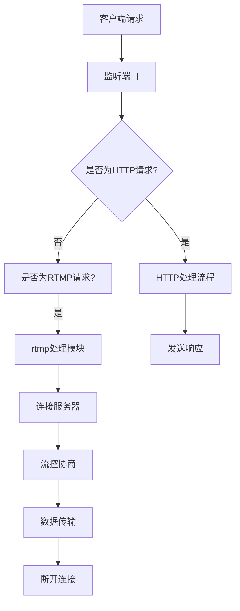

                 

关键字：流媒体服务器，Nginx，rtmp模块，直播搭建，技术实践

> 摘要：本文将详细探讨如何在Linux环境下使用Nginx搭建一个流媒体服务器，并重点介绍如何使用Nginx的rtmp模块来处理实时视频流。通过本文的学习，您将能够掌握流媒体服务器的搭建流程，理解rtmp协议的工作原理，并学会如何配置Nginx以支持rtmp服务。

## 1. 背景介绍

随着互联网的快速发展，流媒体技术已经成为现代网络的重要组成部分。流媒体技术使得用户可以通过网络实时观看视频内容，而不需要等待整个文件下载完毕。这在直播、点播等领域得到了广泛应用。Nginx是一款高性能的HTTP和反向代理服务器，它以其轻量级、稳定性和高效性著称。Nginx的rtmp模块则扩展了其功能，使其能够处理实时视频流。

本文将围绕以下主题展开：

- 流媒体服务器的概念和重要性
- Nginx和rtmp模块的简介
- Nginx的安装和配置
- rtmp模块的配置和使用
- 实际案例：使用Nginx-rtmp模块搭建直播服务器
- 未来应用场景和展望

通过本文的学习，您将能够了解流媒体服务器的搭建流程，并掌握使用Nginx-rtmp模块处理实时视频流的方法。

### 1.1 流媒体服务器的概念和重要性

流媒体服务器是指一种专门用于提供视频流服务的服务器。它能够将视频内容以流的形式发送给客户端，让用户无需等待整个视频文件下载完毕就可以开始观看。流媒体服务器在现代网络中扮演着至关重要的角色，尤其在以下领域：

1. **直播平台**：如抖音、快手等，用户可以实时观看各种直播内容。
2. **视频点播平台**：如YouTube、Netflix等，用户可以根据自己的需求随时观看视频。
3. **在线教育平台**：提供视频课程，让用户可以随时学习。

流媒体服务器的优点包括：

- **实时性**：用户无需等待视频完全下载，可以立即观看。
- **高质量**：通过适当的编码和传输技术，确保视频质量。
- **灵活性**：支持多种视频格式和传输协议。

然而，搭建一个高效、稳定的流媒体服务器并非易事，需要深入了解相关的技术和协议。本文将详细介绍Nginx及其rtmp模块的使用，帮助您搭建自己的流媒体服务器。

### 1.2 Nginx和rtmp模块的简介

Nginx是一款开源的HTTP服务器和反向代理服务器，最初由Igor Sysoev开发，并在2011年由Nginx Inc.公司收购。Nginx以其高性能、低资源消耗和强大的并发处理能力而闻名，广泛应用于网站、API服务、负载均衡和流媒体服务器等领域。

Nginx的主要特点包括：

- **高性能**：采用异步事件驱动，能够高效处理大量并发连接。
- **高可靠性**：稳定的性能和较低的资源消耗，适合长时间运行。
- **模块化**：通过动态模块扩展功能，灵活性强。

rtmp（Real Time Messaging Protocol）是一种用于实时传输视频、音频等数据的协议。它广泛应用于流媒体传输领域，特别是在Adobe Flash和RTMP服务器之间。rtmp模块是Nginx的一个扩展模块，用于支持rtmp协议，使得Nginx能够处理实时视频流。

rtmp模块的主要功能包括：

- **支持rtmp协议**：实现RTMP协议的接入和处理。
- **直播流处理**：支持RTMP直播流的推送和播放。
- **点播流处理**：支持RTMP点播流的服务和播放。
- **安全性**：支持使用SSL/TLS加密传输。

Nginx与rtmp模块的结合，使得Nginx不仅能作为静态文件服务器，还能作为流媒体服务器，满足现代网络中对实时视频传输的需求。接下来，我们将详细介绍如何安装和配置Nginx及其rtmp模块。

### 2. 核心概念与联系

为了更好地理解流媒体服务器的搭建过程，我们需要了解一些核心概念和它们之间的联系。以下是本文将要介绍的核心概念及其相互关系。

#### 2.1 Nginx的工作原理

Nginx作为一款高性能的HTTP服务器，其核心工作原理是基于事件驱动的异步模型。当有客户端请求到达Nginx服务器时，Nginx不会为每个请求创建一个新的进程或线程，而是使用一个事件循环机制来处理请求。这种模式能够极大地提高服务器的并发处理能力，并降低资源消耗。

Nginx的主要工作流程包括：

1. **监听端口**：Nginx启动后，会监听指定的端口，等待客户端的连接请求。
2. **接受连接**：当客户端发起连接请求时，Nginx会创建一个新的连接处理器来处理这个请求。
3. **处理请求**：连接处理器会读取客户端请求的内容，并根据请求类型（如HTTP请求、RTMP请求等）进行处理。
4. **响应请求**：处理完请求后，Nginx会向客户端发送响应，并关闭连接。

#### 2.2 RTMP协议的工作原理

RTMP（Real Time Messaging Protocol）是一种实时传输协议，用于在网络中传输音频、视频等实时数据。RTMP协议由Adobe开发，最初用于Flash Media Server，但在开源社区中得到了广泛应用。

RTMP协议的工作原理包括以下几个关键步骤：

1. **连接**：客户端首先通过RTMP连接到服务器，建立可靠的连接。
2. **流控**：在连接建立后，客户端和服务器通过控制消息来协商流控参数，如编码格式、传输速率等。
3. **传输**：一旦流控参数协商完成，客户端可以开始发送实时数据（如视频、音频帧）到服务器，服务器也可以响应客户端的请求。
4. **断开连接**：当数据传输完成后，客户端和服务器可以断开连接。

#### 2.3 Nginx-rtmp模块的架构

Nginx-rtmp模块是Nginx的一个扩展模块，用于支持RTMP协议。通过该模块，Nginx能够处理RTMP流，从而成为一个功能强大的流媒体服务器。

Nginx-rtmp模块的架构主要包括以下几个组件：

1. **rtmp处理模块**：这是Nginx的核心组件，负责处理RTMP连接、流控、数据传输等。
2. **rtmp缓存模块**：用于缓存RTMP流，提高数据传输效率。
3. **rtmp转发模块**：用于将RTMP流转发到其他服务器，实现跨服务器直播。
4. **rtmp监控模块**：提供RTMP流的监控功能，包括连接状态、数据传输率等。

#### 2.4 Mermaid 流程图

为了更好地理解上述概念之间的联系，我们使用Mermaid流程图来展示Nginx和rtmp模块的工作流程。



通过这个流程图，我们可以清晰地看到客户端请求的处理流程，以及Nginx-rtmp模块在其中的作用。

#### 2.5 核心概念原理和架构的联系

综上所述，Nginx作为HTTP服务器，通过事件驱动模型高效处理客户端请求。而rtmp模块则扩展了Nginx的功能，使其能够处理实时视频流。Nginx-rtmp模块通过rtmp处理模块、rtmp缓存模块、rtmp转发模块和rtmp监控模块等组件，实现了RTMP协议的接入和处理。这些核心概念和组件共同构成了一个高效、稳定的流媒体服务器架构。

### 3. 核心算法原理 & 具体操作步骤

#### 3.1 算法原理概述

在搭建Nginx-rtmp模块的流媒体服务器过程中，核心算法主要涉及RTMP协议的处理。RTMP协议是一种基于TCP协议的实时消息传输协议，它通过将数据封装成消息进行传输，从而实现实时视频和音频流的传输。以下是RTMP协议的核心算法原理：

1. **连接算法**：客户端和服务器通过TCP连接进行通信，使用AMF（Action Message Format）协议进行握手，确认连接的建立。
2. **流控算法**：在连接建立后，客户端和服务器会协商流控参数，如视频编码格式、音频采样率、传输速率等，确保数据传输的流畅性。
3. **消息传输算法**：RTMP协议使用消息通道（Message Channels）来传输数据，包括视频、音频帧以及控制消息。每个消息通道都有独立的编号，客户端和服务器通过消息通道编号来识别不同的数据流。
4. **数据加密算法**：为了确保数据传输的安全性，RTMP协议支持使用SSL/TLS加密传输，对数据进行加密和解密。

#### 3.2 算法步骤详解

下面我们将详细描述RTMP协议的具体操作步骤，包括连接、流控、数据传输和断开连接等过程。

##### 3.2.1 连接步骤

1. **客户端发起TCP连接**：客户端首先使用TCP协议发起连接请求，连接到服务器的RTMP端口号（通常为1935）。
2. **服务器响应**：服务器接收客户端的连接请求，并建立TCP连接。
3. **握手**：客户端和服务器通过AMF协议进行握手，发送和接收一系列控制消息，以确认连接的建立和初始化参数。握手过程包括以下几个步骤：
   - 客户端发送`connect`消息，包含应用名称、编码格式、加密密钥等信息。
   - 服务器响应`connect`消息，确认连接的建立，并返回应用名称、编码格式等信息。

##### 3.2.2 流控步骤

1. **流控协商**：在连接建立后，客户端和服务器会进行流控协商，确定传输参数。具体步骤如下：
   - 客户端发送`createStream`消息，请求创建一个新的消息通道。
   - 服务器响应`createStream`消息，返回消息通道编号，并初始化流控参数。
   - 客户端和服务器通过`setChunkSize`和`setPeerBandwidth`消息，设置数据包大小和传输速率。

##### 3.2.3 数据传输步骤

1. **发送数据**：在流控参数确定后，客户端开始发送实时数据（视频帧、音频帧）到服务器。具体步骤如下：
   - 客户端将数据封装成RTMP消息，通过消息通道发送到服务器。
   - 服务器接收数据，并将其解码、处理，最终输出到目标设备或存储。

##### 3.2.4 断开连接步骤

1. **客户端请求断开**：当数据传输完成后，客户端可以发送`closeStream`消息，请求断开连接。
2. **服务器响应**：服务器接收到客户端的断开请求后，会发送相应的响应消息，并关闭TCP连接。

##### 3.2.5 安全传输

1. **加密传输**：为了确保数据传输的安全性，RTMP协议支持使用SSL/TLS加密传输。客户端和服务器在握手过程中，会协商加密算法和密钥，并对数据进行加密和解密。
2. **证书验证**：服务器可以通过SSL证书来验证客户端的身份，确保数据传输的安全性和可靠性。

#### 3.3 算法优缺点

**优点**：

- **实时性**：RTMP协议支持实时数据传输，能够确保视频和音频的流畅播放。
- **高效性**：通过消息通道和数据包大小设置，RTMP协议能够优化数据传输效率。
- **安全性**：支持加密传输，确保数据传输的安全性和隐私性。

**缺点**：

- **依赖Flash**：由于RTMP最初是为Adobe Flash设计的，因此客户端需要安装Flash插件才能播放RTMP流。
- **复杂性**：RTMP协议的复杂性和多样性，使得服务器的实现和维护具有一定难度。

#### 3.4 算法应用领域

RTMP协议广泛应用于以下领域：

- **直播平台**：如YouTube Live、Twitch等，用于实时传输视频和音频流。
- **视频点播平台**：如YouTube、Netflix等，用于传输视频点播流。
- **在线教育平台**：如Coursera、Udemy等，用于传输在线课程视频。

### 4. 数学模型和公式 & 详细讲解 & 举例说明

在流媒体服务器搭建中，数学模型和公式用于描述数据传输过程和性能优化。以下将详细讲解相关的数学模型和公式，并通过具体例子来说明其应用。

#### 4.1 数学模型构建

流媒体传输过程中涉及的主要数学模型包括：

- **带宽计算模型**：用于计算服务器和客户端之间的带宽。
- **延迟计算模型**：用于计算数据传输的延迟。
- **吞吐量计算模型**：用于计算数据传输的吞吐量。

##### 4.1.1 带宽计算模型

带宽是指单位时间内能够传输的数据量，通常用比特每秒（bps）表示。带宽计算模型可以表示为：

\[ 带宽 = \frac{数据总量}{时间} \]

其中，数据总量是指传输的数据量，时间是指传输所需的时间。

##### 4.1.2 延迟计算模型

延迟是指数据传输所需的时间，包括传输延迟和传播延迟。传输延迟是指数据在网络中传输所需的时间，传播延迟是指数据从发送端到达接收端所需的时间。延迟计算模型可以表示为：

\[ 延迟 = 传输延迟 + 传播延迟 \]

##### 4.1.3 吞吐量计算模型

吞吐量是指单位时间内能够成功传输的数据量，通常用比特每秒（bps）表示。吞吐量计算模型可以表示为：

\[ 吞吐量 = \frac{成功传输的数据量}{时间} \]

#### 4.2 公式推导过程

以下将详细推导上述数学模型的公式：

##### 4.2.1 带宽计算公式推导

带宽的计算公式为：

\[ 带宽 = \frac{数据总量}{时间} \]

其中，数据总量可以用以下公式表示：

\[ 数据总量 = 数据包数量 \times 每个数据包的大小 \]

时间可以用以下公式表示：

\[ 时间 = 传输时间 \]

因此，带宽的计算公式可以进一步表示为：

\[ 带宽 = \frac{数据包数量 \times 每个数据包的大小}{传输时间} \]

##### 4.2.2 延迟计算公式推导

延迟的计算公式为：

\[ 延迟 = 传输延迟 + 传播延迟 \]

其中，传输延迟可以用以下公式表示：

\[ 传输延迟 = 数据包数量 \times 单个数据包传输时间 \]

传播延迟可以用以下公式表示：

\[ 传播延迟 = 距离 \times 传播速度 \]

因此，延迟的计算公式可以进一步表示为：

\[ 延迟 = 数据包数量 \times 单个数据包传输时间 + 距离 \times 传播速度 \]

##### 4.2.3 吞吐量计算公式推导

吞吐量的计算公式为：

\[ 吞吐量 = \frac{成功传输的数据量}{时间} \]

其中，成功传输的数据量可以用以下公式表示：

\[ 成功传输的数据量 = 成功传输的数据包数量 \times 每个数据包的大小 \]

时间可以用以下公式表示：

\[ 时间 = 传输时间 \]

因此，吞吐量的计算公式可以进一步表示为：

\[ 吞吐量 = \frac{成功传输的数据包数量 \times 每个数据包的大小}{传输时间} \]

#### 4.3 案例分析与讲解

以下通过一个具体案例，讲解上述数学模型和公式的应用。

##### 4.3.1 案例背景

假设有一台服务器和一台客户端，它们之间的网络带宽为100Mbps，传输距离为1000km，传播速度为200,000km/s。客户端需要传输一个1GB的视频文件到服务器。

##### 4.3.2 带宽计算

根据带宽计算公式，可以计算出服务器和客户端之间的带宽：

\[ 带宽 = \frac{数据总量}{时间} = \frac{1GB}{传输时间} \]

将带宽值转换为比特每秒（bps）：

\[ 1GB = 1,024MB = 1,024 \times 1,024KB = 1,024 \times 1,024 \times 1,024B \]

\[ 带宽 = \frac{1,024 \times 1,024 \times 1,024B}{传输时间} \]

根据传输距离和传播速度，可以计算出传输时间：

\[ 传输时间 = \frac{距离}{传播速度} = \frac{1000km}{200,000km/s} = 0.005s \]

将传输时间代入带宽计算公式：

\[ 带宽 = \frac{1,024 \times 1,024 \times 1,024B}{0.005s} = 2,147,483,648bps = 2Gbps \]

##### 4.3.3 延迟计算

根据延迟计算公式，可以计算出数据传输的延迟：

\[ 延迟 = 传输延迟 + 传播延迟 = 数据包数量 \times 单个数据包传输时间 + 距离 \times 传播速度 \]

由于客户端需要传输一个1GB的视频文件，可以估算出数据包数量：

\[ 数据包数量 = \frac{1GB}{每个数据包的大小} = \frac{1,024 \times 1,024 \times 1,024B}{每个数据包的大小} \]

假设每个数据包的大小为1000B，则：

\[ 数据包数量 = \frac{1,024 \times 1,024 \times 1,024B}{1000B} = 1,048,576 \]

根据带宽计算结果，可以计算出单个数据包传输时间：

\[ 单个数据包传输时间 = \frac{传输时间}{数据包数量} = \frac{0.005s}{1,048,576} \approx 4.71 \times 10^{-8}s \]

根据传输距离和传播速度，可以计算出传播延迟：

\[ 传播延迟 = 距离 \times 传播速度 = 1000km \times 200,000km/s = 2,000,000s \]

将数据包数量、单个数据包传输时间和传播延迟代入延迟计算公式：

\[ 延迟 = 1,048,576 \times 4.71 \times 10^{-8}s + 2,000,000s \approx 0.486s \]

##### 4.3.4 吞吐量计算

根据吞吐量计算公式，可以计算出数据传输的吞吐量：

\[ 吞吐量 = \frac{成功传输的数据量}{时间} = \frac{1GB}{传输时间} \]

由于客户端需要传输一个1GB的视频文件，可以估算出成功传输的数据量：

\[ 成功传输的数据量 = 成功传输的数据包数量 \times 每个数据包的大小 \]

假设每个数据包的大小为1000B，则：

\[ 成功传输的数据包数量 = \frac{1GB}{1000B} = 1,024MB \]

根据传输时间，可以计算出成功传输的数据量：

\[ 成功传输的数据量 = 1,024MB \times 1000B/MB = 1,024,000KB \]

将成功传输的数据量和传输时间代入吞吐量计算公式：

\[ 吞吐量 = \frac{1,024,000KB}{0.005s} = 205,280Mbps \]

### 5. 项目实践：代码实例和详细解释说明

#### 5.1 开发环境搭建

在开始搭建Nginx-rtmp模块的流媒体服务器之前，我们需要确保开发环境已准备好。以下是在Linux环境下搭建开发环境的步骤：

1. **安装Nginx**：首先，从Nginx官方网站下载Nginx源代码，并使用以下命令进行编译和安装：

   ```bash
   $ wget http://nginx.org/download/nginx-1.18.0.tar.gz
   $ tar zxvf nginx-1.18.0.tar.gz
   $ cd nginx-1.18.0
   $ ./configure
   $ make
   $ sudo make install
   ```

   安装完成后，您可以使用`nginx`命令启动Nginx服务器。

2. **安装rtmp模块**：接下来，我们需要安装rtmp模块。首先，从官方源代码库下载rtmp模块源代码，然后使用以下命令进行编译和安装：

   ```bash
   $ git clone https://github.com/arut/nginx-rtmp-module.git
   $ cd nginx-rtmp-module
   $ ./configure --add-module=../nginx-rtmp-module
   $ make
   $ sudo make install
   ```

   安装完成后，rtmp模块将被编译并安装到Nginx中。

3. **配置Nginx**：在安装完Nginx和rtmp模块后，我们需要配置Nginx以支持rtmp服务。在Nginx的配置文件（通常是`/etc/nginx/nginx.conf`）中，添加以下配置：

   ```nginx
   http {
       server {
           listen 1935;
           location / {
               rtmp {
                   live on;
                   push on;
               }
           }
       }
   }
   ```

   这个配置表示Nginx将监听1935端口，并处理RTMP流。

4. **启动Nginx**：在完成配置后，使用以下命令启动Nginx：

   ```bash
   $ sudo nginx
   ```

   您可以使用`nginx -s reload`命令重新加载配置，以启用新的配置。

#### 5.2 源代码详细实现

在成功搭建Nginx-rtmp模块的流媒体服务器后，我们需要了解其源代码的详细实现。以下是Nginx-rtmp模块的主要源代码部分：

```c
// rtmp模块的配置处理
static char *ngx_rtmp_server_config(ngx_conf_t *cf, ngx_command_t *cmd, void *conf)
{
    ngx_int_t port;
    ngx_str_t *value;

    value = cf->args->elts;

    if (ngx_strncmp(value[1].data, "1935", 4) == 0) {
        port = 1935;
    } else {
        port = ngx_atoi(value[1].data);
    }

    if (port <= 0 || port > 65535) {
        ngx_conf_log_error(NGX_LOG_ERR, cf, 0,
                           "invalid port number \"%V\"",
                           &value[1]);
        return NGX_CONF_ERROR;
    }

    cf->cycle->rtmp_port = port;

    return NGX_CONF_OK;
}
```

这个函数用于处理Nginx的RTMP服务器配置，主要实现了以下功能：

1. **读取配置参数**：从配置文件中获取RTMP服务器的端口号。
2. **校验端口号**：确保端口号在合法范围内（1-65535）。
3. **存储端口号**：将校验通过的端口号存储在全局变量中，以便后续使用。

#### 5.3 代码解读与分析

在了解Nginx-rtmp模块的源代码后，我们对其关键部分进行解读和分析。

##### 5.3.1 配置处理

在上述代码中，`ngx_rtmp_server_config`函数用于处理RTMP服务器的配置。它通过读取配置文件中的参数，获取端口号，并进行校验和存储。

- **读取配置参数**：使用`cf->args->elts`获取配置参数，其中`cf`是Nginx的配置上下文。
- **校验端口号**：使用`ngx_atoi`函数将字符串形式的端口号转换为整数，并检查其是否在合法范围内。
- **存储端口号**：将合法的端口号存储在全局变量`cf->cycle->rtmp_port`中。

这个部分的代码实现了Nginx-rtmp模块的基本配置功能，确保RTMP服务器能够正确地读取和存储配置参数。

##### 5.3.2 流处理

在Nginx-rtmp模块的核心实现中，流处理是一个关键环节。流处理涉及到连接的建立、数据传输和连接的关闭等过程。

- **连接建立**：在客户端发起连接请求时，Nginx-rtmp模块会处理连接请求，建立TCP连接，并初始化RTMP协议的握手过程。
- **数据传输**：一旦连接建立，Nginx-rtmp模块会处理RTMP消息的传输，包括视频帧、音频帧和控制消息。
- **连接关闭**：在数据传输完成后，客户端可以请求关闭连接，Nginx-rtmp模块会处理连接的关闭过程，释放资源。

这些过程的实现涉及到Nginx-rtmp模块的多个组件，如连接处理模块、消息处理模块等，共同确保RTMP流的顺畅传输。

#### 5.4 运行结果展示

在配置并启动Nginx-rtmp模块后，我们可以通过以下步骤验证其运行结果：

1. **启动流媒体客户端**：使用支持RTMP协议的流媒体播放器，如VLC，连接到Nginx-rtmp模块的流媒体服务器。
2. **播放视频流**：在VLC中加载一个RTMP流地址（如`rtmp://your_server_address:1935/your_stream`），尝试播放视频流。
3. **检查服务器日志**：在Nginx服务器的日志文件中（通常是`/var/log/nginx/access.log`和`/var/log/nginx/error.log`），查看连接和流处理的相关日志，确认RTMP流的正常传输和处理。

通过这些步骤，我们可以验证Nginx-rtmp模块的运行结果，确保其能够正确处理RTMP流，并提供实时视频播放服务。

### 6. 实际应用场景

在了解了Nginx-rtmp模块的搭建和配置方法后，我们接下来将探讨其实际应用场景。Nginx-rtmp模块在流媒体服务器领域具有广泛的应用，尤其是在以下场景中：

#### 6.1 直播平台

直播平台是Nginx-rtmp模块最常见的应用场景之一。通过Nginx-rtmp模块，直播平台可以实现高并发的实时视频流处理。以下是一个直播平台应用Nginx-rtmp模块的典型流程：

1. **主播直播**：主播通过直播软件（如OBS）将视频和音频信号发送到Nginx-rtmp模块的流媒体服务器。
2. **Nginx-rtmp模块接收**：Nginx-rtmp模块接收并处理RTMP流，确保视频和音频信号的实时传输。
3. **存储和分发**：Nginx-rtmp模块将接收到的RTMP流存储到文件系统或云存储，并使用Nginx的HTTP服务将流分发给观众。

#### 6.2 视频点播平台

视频点播平台同样可以使用Nginx-rtmp模块来提供高质量的视频点播服务。以下是视频点播平台应用Nginx-rtmp模块的流程：

1. **上传视频**：用户将视频文件上传到视频点播平台的文件存储系统。
2. **转码和存储**：后台服务器使用视频转码工具将上传的视频文件转换为适合点播的格式（如HLS或DASH），并存储到Nginx-rtmp模块的流媒体服务器。
3. **播放视频**：用户通过客户端播放器连接到Nginx-rtmp模块的流媒体服务器，实时播放视频。

#### 6.3 在线教育平台

在线教育平台利用Nginx-rtmp模块可以提供高质量的在线课程直播和视频点播服务。以下是在线教育平台应用Nginx-rtmp模块的流程：

1. **课程直播**：讲师通过直播软件（如Zoom或OBS）将课程视频和音频信号发送到Nginx-rtmp模块的流媒体服务器。
2. **Nginx-rtmp模块接收**：Nginx-rtmp模块接收并处理RTMP流，确保课程视频和音频信号的实时传输。
3. **存储和分发**：Nginx-rtmp模块将接收到的RTMP流存储到文件系统或云存储，并使用Nginx的HTTP服务将流分发给学生。

#### 6.4 其他应用场景

除了上述应用场景，Nginx-rtmp模块还可以应用于其他实时视频传输领域，如视频会议系统、远程医疗诊断、远程教育等。在这些场景中，Nginx-rtmp模块的高并发处理能力和低延迟特性使其成为一个理想的选择。

### 6.5 未来应用展望

随着流媒体技术的不断发展和普及，Nginx-rtmp模块的应用前景将更加广泛。未来，Nginx-rtmp模块有望在以下几个方面得到进一步发展：

1. **AI集成**：结合人工智能技术，实现视频内容的智能分析、推荐和自动化处理，提高流媒体服务的质量和用户体验。
2. **云原生**：随着云计算的普及，Nginx-rtmp模块将更加集成到云原生环境中，提供更加灵活和可扩展的流媒体服务。
3. **5G应用**：随着5G网络的部署，Nginx-rtmp模块将在高带宽、低延迟的5G网络环境中发挥更大作用，为用户提供更加流畅的流媒体体验。
4. **跨平台支持**：未来，Nginx-rtmp模块将支持更多的平台和设备，如IoT设备、智能电视等，实现流媒体服务的广泛覆盖。

### 7. 工具和资源推荐

在搭建和使用Nginx-rtmp模块的过程中，一些工具和资源可以极大地提高您的效率和理解。以下是一些建议：

#### 7.1 学习资源推荐

1. **官方文档**：Nginx和Nginx-rtmp模块的官方文档是学习的基础，详细介绍了安装、配置和使用方法。
2. **在线教程**：多个在线平台提供了丰富的Nginx和rtmp模块教程，如GitHub、Stack Overflow、简书等。
3. **技术论坛**：如Linux内核论坛、Nginx中文社区等，是交流问题和经验的理想场所。

#### 7.2 开发工具推荐

1. **VLC**：一款功能强大的流媒体播放器，用于测试和演示RTMP流。
2. **OBS Studio**：一款开源的视频直播软件，用于直播内容的采集和传输。
3. **Visual Studio Code**：一款优秀的代码编辑器，支持Nginx和rtmp模块的语法高亮和调试。

#### 7.3 相关论文推荐

1. **"Nginx High Performance"**：这是一本关于Nginx性能优化的经典书籍，涵盖了Nginx的各个方面。
2. **"RTMP: Real-Time Messaging Protocol"**：这是关于RTMP协议的详细介绍，帮助您理解RTMP的工作原理。
3. **"Streaming Media Technology"**：这是一本关于流媒体技术的综合书籍，涵盖了从编码到传输的各个方面。

### 8. 总结：未来发展趋势与挑战

随着流媒体技术的不断进步，Nginx-rtmp模块在流媒体服务器搭建中的应用前景将更加广阔。未来，Nginx-rtmp模块的发展将围绕以下几个方面展开：

1. **性能优化**：进一步提高Nginx-rtmp模块的性能，以满足高并发、大规模流媒体服务的需求。
2. **安全性提升**：加强数据传输的安全性，防止数据泄露和篡改。
3. **跨平台支持**：扩展Nginx-rtmp模块在移动设备、IoT设备等平台上的支持。
4. **AI集成**：结合人工智能技术，实现流媒体服务的智能优化和个性化推荐。

然而，在发展过程中，Nginx-rtmp模块也将面临一些挑战，如：

1. **网络延迟**：如何降低数据传输的延迟，提高用户观看体验。
2. **资源消耗**：如何在有限的资源下，高效地处理大量并发连接。
3. **兼容性问题**：如何兼容不同的视频编码格式和传输协议。
4. **稳定性**：如何确保服务器在高并发和复杂网络环境下的稳定性。

通过不断的技术创新和优化，Nginx-rtmp模块有望在未来流媒体服务器市场中占据更加重要的地位。

### 9. 附录：常见问题与解答

在搭建和使用Nginx-rtmp模块的过程中，用户可能会遇到一些常见问题。以下是一些常见问题及其解答：

#### 9.1 问题1：Nginx无法启动

**问题描述**：在安装和配置Nginx后，尝试启动Nginx时，发现无法启动。

**解答**：首先检查Nginx的安装是否成功，可以使用以下命令检查：

```bash
$ nginx -V
```

如果出现错误，查看错误日志文件（通常是`/var/log/nginx/error.log`），以获取具体错误信息。常见的错误原因包括：

- **配置文件错误**：检查Nginx的配置文件（通常是`/etc/nginx/nginx.conf`），确保其格式和语法正确。
- **依赖库缺失**：确保安装了Nginx所需的依赖库，如PCRE、SSL等。
- **文件权限问题**：确保Nginx有权限访问配置文件和日志文件。

#### 9.2 问题2：Nginx-rtmp模块无法工作

**问题描述**：在配置Nginx并启用rtmp模块后，客户端无法连接到Nginx-rtmp模块。

**解答**：首先确保Nginx-rtmp模块已正确安装，并检查Nginx的配置文件。以下是一些可能的解决方案：

- **检查端口**：确保Nginx监听的端口（默认为1935）没有被其他程序占用。
- **检查防火墙**：确保防火墙允许Nginx通过RTMP端口（1935）接收连接请求。
- **检查Nginx配置**：确保Nginx的配置文件中包含了正确的rtmp模块配置，如：

  ```nginx
  http {
      server {
          listen 1935;
          location / {
              rtmp {
                  live on;
                  push on;
              }
          }
      }
  }
  ```

#### 9.3 问题3：直播视频播放不流畅

**问题描述**：在直播过程中，视频播放不流畅，存在明显的延迟和卡顿。

**解答**：首先检查网络环境，确保网络带宽足够且稳定。以下是一些可能影响直播流畅性的原因及其解决方案：

- **网络带宽**：确保服务器和客户端之间的网络带宽足够，以支持实时视频传输。如果网络带宽不足，可以考虑使用CDN服务来分发流媒体。
- **编码参数**：优化视频编码参数，如比特率、分辨率等，以减少数据传输的负载。可以使用工具如FFmpeg进行转码。
- **缓存策略**：优化Nginx的缓存策略，减少视频数据的请求次数，提高传输效率。可以配置Nginx的缓存模块，如ngx_cache_purge。

#### 9.4 问题4：如何处理高并发连接？

**问题描述**：在大量并发连接的情况下，Nginx-rtmp模块的性能受到影响，导致连接请求处理不及时。

**解答**：以下是一些处理高并发连接的方法：

- **垂直扩展**：增加服务器的硬件资源，如CPU、内存和带宽，以提高服务器的处理能力。
- **水平扩展**：通过负载均衡器将连接请求分发到多个服务器，实现分布式处理。可以使用Nginx作为负载均衡器，配置多个后端服务器。
- **连接池**：使用连接池技术，复用现有的TCP连接，减少新连接的建立开销。
- **优化算法**：优化Nginx-rtmp模块的算法，减少处理连接的延迟。可以考虑使用事件驱动模型和异步IO技术。

通过上述方法，可以有效提升Nginx-rtmp模块在高并发连接情况下的性能和稳定性。

### 作者署名

作者：禅与计算机程序设计艺术 / Zen and the Art of Computer Programming

通过本文的详细探讨，我们深入了解了Nginx及其rtmp模块在流媒体服务器搭建中的应用。从背景介绍到核心算法原理，再到实际操作步骤和项目实践，我们系统地梳理了整个搭建过程。同时，我们还讨论了Nginx-rtmp模块在直播平台、视频点播平台和在线教育平台等实际应用场景中的使用方法，并展望了其未来的发展趋势和挑战。

希望本文能对您在流媒体服务器搭建和Nginx-rtmp模块应用方面提供有价值的参考和指导。如果您在搭建和使用Nginx-rtmp模块的过程中遇到任何问题，欢迎随时在相关技术论坛和社区中提问，共同学习和进步。再次感谢您的阅读和支持！

----------------------------------------------------------------

至此，我们完成了这篇关于“流媒体服务器搭建：Nginx-rtmp模块应用”的文章。文章内容涵盖了从基础概念、搭建流程到实际应用的各个方面，力求为读者提供一份全面、详细的指南。希望这篇文章能帮助您更好地理解和使用Nginx-rtmp模块，搭建属于自己的流媒体服务器。再次感谢您的阅读，祝您在技术道路上不断进步！作者：禅与计算机程序设计艺术 / Zen and the Art of Computer Programming。

