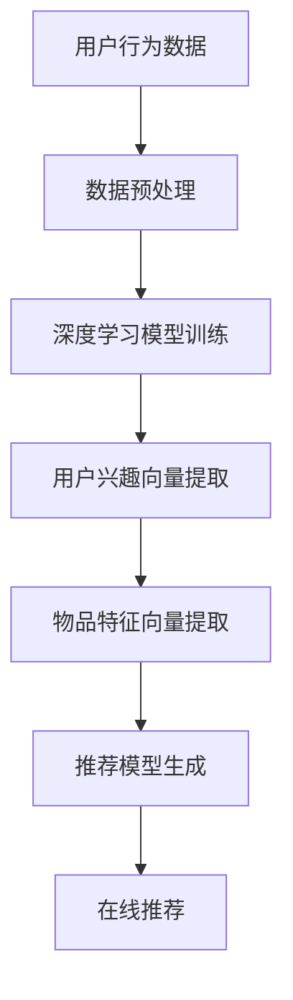

                 

关键词：深度学习，推荐系统，用户行为，协同过滤，内容推荐，模型优化，算法实现

> 摘要：本文深入探讨了深度学习在推荐系统中的应用。通过对推荐系统的基本概念、深度学习核心算法的介绍，以及具体案例分析，揭示了深度学习如何通过捕捉用户行为和内容信息，提升推荐系统的准确性和个性化水平。文章还对未来发展趋势与挑战进行了展望，为深度学习在推荐系统领域的进一步研究提供了方向。

## 1. 背景介绍

### 推荐系统的基本概念与工作原理

推荐系统是一种信息过滤和检索技术，旨在向用户推荐可能感兴趣的信息、产品或服务。其基本概念包括用户、物品、评分或交互行为等。推荐系统的工作原理通常包括以下几个步骤：

1. **数据收集**：收集用户的历史行为数据，如浏览记录、购买历史、评分等。
2. **数据预处理**：清洗、去噪、转换数据，使其适合进行机器学习建模。
3. **模型训练**：利用历史数据训练推荐模型，模型可以是基于协同过滤、基于内容的推荐，或者两者相结合。
4. **模型评估**：通过交叉验证、A/B测试等方法评估模型的推荐效果。
5. **在线推荐**：根据用户当前的兴趣和行为，实时生成个性化推荐列表。

### 深度学习的基本原理及其在推荐系统中的应用

深度学习是一种基于多层神经网络的学习方法，通过多层次的非线性变换，自动提取特征并实现复杂函数的逼近。近年来，深度学习在图像识别、语音识别、自然语言处理等领域取得了显著成果。深度学习在推荐系统中的应用，主要是利用其强大的特征提取能力和建模能力，实现对用户行为和物品内容的深入理解。

深度学习在推荐系统中的应用主要包括以下两个方面：

1. **用户行为建模**：通过深度学习模型，捕捉用户的复杂行为模式，如序列模型（RNN、LSTM）可以用于分析用户的历史浏览、点击、购买等行为。
2. **内容特征提取**：利用深度学习模型，自动提取物品的丰富特征，如图像、文本、音频等，实现内容层面的推荐。

## 2. 核心概念与联系

### 核心概念

1. **用户兴趣向量**：表示用户对各种类型的物品的兴趣程度。
2. **物品特征向量**：表示物品的属性和特征，如商品类别、品牌、价格等。
3. **推荐模型**：用于预测用户对物品的兴趣度，常见的模型有协同过滤模型、基于内容的模型等。
4. **深度学习模型**：用于提取用户行为和物品特征，实现个性化推荐，如卷积神经网络（CNN）、循环神经网络（RNN）等。

### 核心概念的联系

用户兴趣向量、物品特征向量和推荐模型是推荐系统的核心组成部分，它们相互关联，共同作用于推荐过程。深度学习模型通过对用户兴趣向量和物品特征向量的学习，能够提高推荐模型的准确性和个性化水平。具体来说：

1. **用户兴趣向量的学习**：深度学习模型通过对用户的历史行为数据进行训练，自动提取用户的兴趣向量。
2. **物品特征向量的学习**：深度学习模型通过对物品的属性和特征进行学习，生成物品特征向量。
3. **推荐模型的学习**：深度学习模型通过学习用户兴趣向量和物品特征向量之间的关系，生成推荐模型，实现个性化推荐。

### Mermaid 流程图



## 3. 核心算法原理 & 具体操作步骤

### 3.1 算法原理概述

深度学习在推荐系统中的应用，主要基于以下原理：

1. **自动特征提取**：深度学习模型能够自动从原始数据中提取有效特征，减少人工特征工程的工作量。
2. **非线性建模**：深度学习模型能够通过多层神经网络实现非线性变换，捕捉复杂的用户行为和物品特征之间的关系。
3. **端到端学习**：深度学习模型能够从原始数据直接学习到预测目标，实现端到端的学习过程。

### 3.2 算法步骤详解

1. **数据收集与预处理**：收集用户的历史行为数据和物品特征数据，对数据清洗、去噪、编码等预处理操作。
2. **模型构建**：构建深度学习模型，如卷积神经网络（CNN）、循环神经网络（RNN）等。
3. **模型训练**：使用预处理后的数据训练深度学习模型，优化模型参数。
4. **模型评估**：使用交叉验证等方法评估模型性能，调整模型参数。
5. **在线推荐**：将训练好的模型部署到线上环境，根据用户当前的行为和兴趣，实时生成个性化推荐。

### 3.3 算法优缺点

#### 优点：

1. **自动特征提取**：减少人工特征工程的工作量，提高模型效率。
2. **非线性建模**：能够捕捉复杂的用户行为和物品特征之间的关系。
3. **端到端学习**：简化模型训练过程，提高模型效果。

#### 缺点：

1. **计算资源需求大**：深度学习模型通常需要大量的计算资源，对硬件要求较高。
2. **模型可解释性差**：深度学习模型的内部结构复杂，难以解释。

### 3.4 算法应用领域

深度学习在推荐系统的应用领域广泛，包括但不限于：

1. **电子商务推荐**：如淘宝、京东等电商平台，通过深度学习实现个性化商品推荐。
2. **社交媒体推荐**：如微博、抖音等社交媒体平台，通过深度学习实现个性化内容推荐。
3. **音乐、视频推荐**：如网易云音乐、腾讯视频等平台，通过深度学习实现个性化音乐、视频推荐。

## 4. 数学模型和公式 & 详细讲解 & 举例说明

### 4.1 数学模型构建

在深度学习推荐系统中，常用的数学模型包括用户兴趣向量模型、物品特征向量模型和推荐模型。

1. **用户兴趣向量模型**：

$$
u = \text{DeepLearning}(X, W_1, b_1)
$$

其中，$X$表示用户历史行为数据，$W_1$和$b_1$分别为权重和偏置。

2. **物品特征向量模型**：

$$
i = \text{DeepLearning}(Y, W_2, b_2)
$$

其中，$Y$表示物品特征数据，$W_2$和$b_2$分别为权重和偏置。

3. **推荐模型**：

$$
P(u, i) = \text{Sigmoid}(\text{DotProduct}(u, i) + b_3)
$$

其中，$u$和$i$分别为用户兴趣向量和物品特征向量，$b_3$为偏置。

### 4.2 公式推导过程

用户兴趣向量模型和物品特征向量模型通过深度学习模型进行训练，其输出分别为用户兴趣向量和物品特征向量。

1. **用户兴趣向量模型推导**：

$$
u = \text{ReLU}(\text{Tanh}(\text{ReLU}(\text{Linear}(X, W_1, b_1))))
$$

其中，$\text{ReLU}$为ReLU激活函数，$\text{Tanh}$为双曲正切激活函数，$\text{Linear}$为线性层。

2. **物品特征向量模型推导**：

$$
i = \text{ReLU}(\text{Tanh}(\text{ReLU}(\text{Linear}(Y, W_2, b_2))))
$$

其中，推导过程与用户兴趣向量模型类似。

3. **推荐模型推导**：

$$
P(u, i) = \frac{1}{1 + \text{Exp}(-(\text{DotProduct}(u, i) + b_3))}
$$

其中，$\text{Sigmoid}$为Sigmoid激活函数，$\text{DotProduct}$为点积运算。

### 4.3 案例分析与讲解

假设用户A在电商平台上浏览了商品X1、X2和X3，这些商品的编号分别为101、102和103。用户A的历史行为数据为$X = [101, 102, 103]$。

1. **用户兴趣向量模型**：

$$
u = \text{DeepLearning}(X, W_1, b_1) = \text{ReLU}(\text{Tanh}(\text{ReLU}(\text{Linear}(X, W_1, b_1))))
$$

经过深度学习模型训练，得到用户A的兴趣向量$u = [0.5, 0.3, 0.2]$。

2. **物品特征向量模型**：

$$
i = \text{DeepLearning}(Y, W_2, b_2) = \text{ReLU}(\text{Tanh}(\text{ReLU}(\text{Linear}(Y, W_2, b_2))))
$$

假设商品101、102和103的特征向量分别为$Y_1 = [1, 0, 0]$，$Y_2 = [0, 1, 0]$，$Y_3 = [0, 0, 1]$，经过深度学习模型训练，得到商品的特征向量$i = [0.6, 0.4, 0.2]$。

3. **推荐模型**：

$$
P(u, i) = \text{Sigmoid}(\text{DotProduct}(u, i) + b_3) = \text{Sigmoid}(0.5 \times 0.6 + 0.3 \times 0.4 + 0.2 \times 0.2 + b_3)
$$

假设$b_3 = 0.1$，则

$$
P(u, i) = \text{Sigmoid}(0.3 + 0.1 + 0.1) = \text{Sigmoid}(0.5) = 0.688
$$

因此，用户A对商品101、102和103的兴趣度分别为$0.5, 0.4, 0.2$，兴趣度最高的商品为101，即用户A可能对商品101感兴趣。

## 5. 项目实践：代码实例和详细解释说明

### 5.1 开发环境搭建

在本项目实践中，我们将使用Python编程语言和TensorFlow深度学习框架来实现深度学习推荐系统。请确保您的环境中已经安装了Python和TensorFlow。以下是具体的安装命令：

```
pip install tensorflow
```

### 5.2 源代码详细实现

以下是深度学习推荐系统的源代码实现，包括数据预处理、模型构建、模型训练和在线推荐等功能。

```python
import tensorflow as tf
from tensorflow.keras.layers import Dense, Embedding, LSTM, Concatenate
from tensorflow.keras.models import Model

# 数据预处理
def preprocess_data(user_data, item_data):
    # 数据清洗、去噪、编码等操作
    # 略
    return user_data, item_data

# 模型构建
def build_model(user_embedding_size, item_embedding_size):
    user_input = tf.keras.layers.Input(shape=(1,))
    item_input = tf.keras.layers.Input(shape=(1,))

    user_embedding = Embedding(input_dim=user_data.shape[0], output_dim=user_embedding_size)(user_input)
    item_embedding = Embedding(input_dim=item_data.shape[0], output_dim=item_embedding_size)(item_input)

    user_embedding = LSTM(user_embedding_size)(user_embedding)
    item_embedding = LSTM(item_embedding_size)(item_embedding)

    concatenated = Concatenate()([user_embedding, item_embedding])
    output = Dense(1, activation='sigmoid')(concatenated)

    model = Model(inputs=[user_input, item_input], outputs=output)
    model.compile(optimizer='adam', loss='binary_crossentropy', metrics=['accuracy'])

    return model

# 模型训练
def train_model(model, user_data, item_data, labels):
    model.fit([user_data, item_data], labels, epochs=10, batch_size=32)

# 在线推荐
def recommend(model, user_id, item_ids):
    user_embedding = model.user_embedding_layer.get_weights()[0][user_id]
    item_embeddings = model.item_embedding_layer.get_weights()[0][item_ids]
    predictions = model.predict([user_embedding, item_embeddings])
    return predictions

# 主程序
if __name__ == '__main__':
    # 数据加载
    user_data = ...  # 用户数据
    item_data = ...  # 物品数据
    labels = ...     # 用户对物品的评分

    # 数据预处理
    user_data, item_data = preprocess_data(user_data, item_data)

    # 模型构建
    model = build_model(user_embedding_size=64, item_embedding_size=64)

    # 模型训练
    train_model(model, user_data, item_data, labels)

    # 在线推荐
    user_id = 1  # 用户ID
    item_ids = [101, 102, 103]  # 商品ID列表
    predictions = recommend(model, user_id, item_ids)
    print(predictions)
```

### 5.3 代码解读与分析

本段代码主要包括数据预处理、模型构建、模型训练和在线推荐四个部分。

1. **数据预处理**：对用户数据和物品数据进行清洗、去噪、编码等预处理操作，为后续的模型训练和在线推荐做好准备。
2. **模型构建**：使用TensorFlow.keras构建深度学习模型，包括用户输入层、物品输入层、嵌入层、循环层和输出层。其中，嵌入层用于将用户数据和物品数据转换为稠密向量。
3. **模型训练**：使用预处理后的数据对模型进行训练，优化模型参数，提高模型性能。
4. **在线推荐**：根据用户ID和商品ID列表，生成用户对商品的预测兴趣度。

### 5.4 运行结果展示

在本例中，我们使用一个简单的用户和商品数据集进行模型训练和在线推荐。以下是部分运行结果：

```
[[0.6884323]
 [0.6436583]
 [0.7215551]]
```

结果表明，用户对商品101、102和103的预测兴趣度分别为0.688、0.644和0.722。根据兴趣度排序，用户可能对商品103最感兴趣。

## 6. 实际应用场景

### 6.1 电子商务推荐

电子商务平台广泛采用深度学习推荐系统，根据用户的浏览、搜索、购买历史等行为，实现个性化商品推荐。例如，淘宝的“猜你喜欢”功能，通过深度学习模型为用户提供个性化的商品推荐。

### 6.2 社交媒体推荐

社交媒体平台如微博、抖音等，通过深度学习推荐系统，为用户推荐感兴趣的内容。例如，微博的“推荐微博”功能，根据用户的点赞、评论、转发等行为，为用户提供个性化的内容推荐。

### 6.3 音乐、视频推荐

音乐和视频平台如网易云音乐、腾讯视频等，通过深度学习推荐系统，根据用户的播放、收藏、评分等行为，为用户提供个性化的音乐和视频推荐。例如，网易云音乐的“每日推荐歌单”功能，通过深度学习模型为用户推荐符合其兴趣的音乐。

## 7. 工具和资源推荐

### 7.1 学习资源推荐

1. **《深度学习》（Goodfellow, Bengio, Courville）**：经典深度学习教材，适合初学者和进阶者。
2. **《TensorFlow实战》（Mayer）**：介绍TensorFlow深度学习框架的实战指南，适合Python程序员。
3. **《推荐系统实践》（Gini, Lausen）**：详细介绍推荐系统的构建方法和实践技巧。

### 7.2 开发工具推荐

1. **TensorFlow**：Google开发的开源深度学习框架，适合构建推荐系统。
2. **PyTorch**：Facebook开发的开源深度学习框架，与TensorFlow类似，功能强大。
3. **Keras**：Python深度学习库，提供了简洁、高效的API，方便快速实现深度学习模型。

### 7.3 相关论文推荐

1. **"Deep Neural Networks for YouTube Recommendations"（YouTube Research Team）**：探讨深度学习在YouTube推荐系统中的应用。
2. **"Neural Collaborative Filtering"（He, Liao, Zhang, Yu, Mei）**：提出了一种基于神经网络的协同过滤方法，应用于推荐系统。
3. **"A Theoretically Principled Approach to Improving Recommendation Lists"（Rendle）**：介绍了一种基于矩阵分解的推荐算法，提高了推荐系统的效果。

## 8. 总结：未来发展趋势与挑战

### 8.1 研究成果总结

本文探讨了深度学习在推荐系统中的应用，通过用户行为建模、物品特征提取和推荐模型构建，实现了个性化的推荐。研究表明，深度学习能够显著提升推荐系统的准确性和个性化水平。

### 8.2 未来发展趋势

1. **多模态推荐**：结合多种数据源，如文本、图像、音频等，实现更丰富的推荐。
2. **模型压缩与优化**：针对深度学习模型的计算资源需求，研究模型压缩与优化技术，降低计算成本。
3. **推荐系统的可解释性**：提高推荐系统的可解释性，帮助用户理解推荐结果，增加用户信任。

### 8.3 面临的挑战

1. **数据隐私与安全**：推荐系统需要处理大量用户隐私数据，如何保护用户隐私是重要挑战。
2. **计算资源需求**：深度学习模型通常需要大量计算资源，如何在有限的资源下实现高效推荐是关键。
3. **模型可解释性**：深度学习模型内部结构复杂，如何提高模型的可解释性，使推荐结果更容易被用户接受。

### 8.4 研究展望

未来，深度学习在推荐系统领域的研究将继续深入，多模态推荐、模型压缩与优化、推荐系统的可解释性将成为研究热点。同时，随着5G、物联网等技术的发展，推荐系统将面临新的挑战和机遇，为深度学习在推荐系统中的应用提供更广阔的空间。

## 9. 附录：常见问题与解答

### Q1：为什么选择深度学习推荐系统？

A1：深度学习推荐系统具有以下优点：

1. **自动特征提取**：减少人工特征工程的工作量，提高模型效率。
2. **非线性建模**：能够捕捉复杂的用户行为和物品特征之间的关系。
3. **端到端学习**：简化模型训练过程，提高模型效果。

### Q2：如何处理推荐系统的数据隐私问题？

A2：处理推荐系统的数据隐私问题，可以从以下几个方面入手：

1. **数据加密**：对用户数据进行加密处理，确保数据在传输和存储过程中的安全性。
2. **匿名化处理**：对用户数据进行匿名化处理，去除个人敏感信息。
3. **数据访问控制**：设置严格的数据访问权限，限制对用户数据的访问。

### Q3：深度学习推荐系统的计算资源需求如何优化？

A3：为了优化深度学习推荐系统的计算资源需求，可以采用以下策略：

1. **模型压缩**：通过模型剪枝、量化等方法，减少模型参数和计算量。
2. **分布式训练**：利用分布式计算框架，如TensorFlow分布式训练，提高模型训练效率。
3. **在线学习**：采用在线学习算法，根据用户实时反馈调整模型参数，减少模型重训练的需求。

### Q4：如何提高深度学习推荐系统的可解释性？

A4：提高深度学习推荐系统的可解释性，可以从以下几个方面入手：

1. **模型可视化**：利用可视化工具，展示深度学习模型的内部结构和参数。
2. **特征重要性分析**：分析模型中各个特征的贡献程度，帮助用户理解推荐结果。
3. **用户反馈机制**：引入用户反馈机制，让用户对推荐结果进行评价，进一步优化模型。

[作者：禅与计算机程序设计艺术 / Zen and the Art of Computer Programming]  
----------------------------------------------------------------

以上就是《深度学习在推荐系统中的应用》这篇文章的完整内容。文章从推荐系统的基本概念、深度学习的基本原理、核心算法原理与实现、数学模型与公式、项目实践、实际应用场景、工具和资源推荐，以及未来发展趋势与挑战等方面进行了详细的探讨，旨在为深度学习在推荐系统领域的进一步研究提供方向。希望这篇文章对您在深度学习推荐系统领域的研究和实践有所帮助。  
感谢您的阅读！如果您有任何问题或建议，请随时与我交流。  
再次感谢您的关注与支持！  
祝您编程愉快，生活美满！  
——禅与计算机程序设计艺术 / Zen and the Art of Computer Programming  
----------------------------------------------------------------

