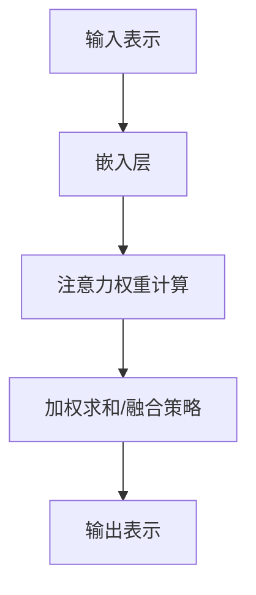

                 

深度学习已经成为现代人工智能领域中最强大的工具之一。它在图像识别、语音识别、自然语言处理等多个领域取得了显著的成果。随着深度学习技术的发展，注意力机制逐渐成为了一种关键的技术，它在处理序列数据时能够提高模型的效率和准确性。本文将重点关注深度学习在注意力预测中的应用，探讨其核心概念、算法原理、数学模型以及实际应用场景。

## 关键词

深度学习、注意力机制、序列预测、模型优化、自然语言处理

## 摘要

本文首先介绍了深度学习在注意力预测领域的背景和应用场景。随后，详细解析了注意力机制的核心概念及其在深度学习中的具体应用。通过数学模型的构建和公式推导，我们深入理解了注意力机制的工作原理。最后，本文通过实际项目实例，展示了如何在实际开发中应用注意力预测技术，并对未来的发展趋势和挑战进行了展望。

## 1. 背景介绍

### 1.1 深度学习的发展

深度学习起源于20世纪40年代的神经网络理论，但直到21世纪初，随着计算能力的提升和大数据的涌现，深度学习才真正迎来了快速发展。深度学习通过构建多层神经网络，能够自动提取数据中的复杂特征，从而实现高精度的预测和分类。

### 1.2 注意力机制的概念

注意力机制最早由生物学家在研究视觉系统的过程中提出。在深度学习中，注意力机制通过为不同的输入信息分配不同的权重，从而提高模型的关注焦点，提升模型的性能和效率。在处理序列数据时，注意力机制能够关注到序列中的关键信息，从而实现更准确的预测。

### 1.3 注意力预测的应用场景

注意力预测在多个领域具有重要应用，如自然语言处理、语音识别、图像序列分析等。在自然语言处理中，注意力机制被广泛应用于机器翻译、情感分析、文本摘要等任务；在语音识别中，注意力机制能够提高模型对语音序列的理解能力；在图像序列分析中，注意力机制能够帮助模型更好地捕捉运动目标。

## 2. 核心概念与联系

### 2.1 注意力机制的核心概念

注意力机制的核心概念包括输入表示、注意力权重计算和输出表示。输入表示通常使用嵌入层将原始数据转换为稠密向量；注意力权重计算通过一个加权函数，为每个输入分配权重，使得模型能够关注到关键信息；输出表示则通过加权求和或融合策略，生成最终的预测结果。

### 2.2 注意力机制在深度学习中的架构

注意力机制在深度学习中的架构可以分为三类：局部注意力、全局注意力和层次注意力。局部注意力关注输入序列中的局部特征；全局注意力关注输入序列中的整体特征；层次注意力则结合局部和全局特征，实现更高层次的抽象。

### 2.3 Mermaid 流程图

下面是注意力机制在深度学习中的 Mermaid 流程图：



## 3. 核心算法原理 & 具体操作步骤

### 3.1 算法原理概述

注意力机制的核心思想是将输入序列中的每个元素进行加权处理，通过加权求和或融合策略生成输出序列。在深度学习中，注意力机制通常通过以下步骤实现：

1. **输入表示**：使用嵌入层将输入序列转换为稠密向量。
2. **注意力权重计算**：通过一个加权函数（如点积、加性注意力、缩放点积注意力等）计算每个输入元素的重要性。
3. **加权求和/融合策略**：将注意力权重应用于输入序列，生成加权输出序列。
4. **输出表示**：通过加权输出序列生成最终的预测结果。

### 3.2 算法步骤详解

1. **嵌入层**：将输入序列（如单词、音素、像素等）转换为稠密向量。例如，在自然语言处理中，可以使用词嵌入（word embeddings）将单词转换为向量。
   $$ \text{嵌入层}: x_i \rightarrow \text{embed}(x_i) \in \mathbb{R}^{d} $$
   
2. **注意力权重计算**：使用一个加权函数计算每个输入元素的重要性。常见的加权函数包括点积、加性注意力、缩放点积注意力等。以缩放点积注意力为例：
   $$ \text{注意力权重}: a_i = \text{softmax}\left(\frac{\text{query} \cdot \text{key}_i}{\sqrt{d_k}}\right) $$
   其中，$\text{query}$ 和 $\text{key}_i$ 分别是查询向量和键向量，$d_k$ 是键向量的维度。

3. **加权求和/融合策略**：将注意力权重应用于输入序列，生成加权输出序列。
   $$ \text{加权求和}: \text{context} = \sum_{i=1}^{N} a_i \cdot \text{value}_i $$
   其中，$\text{context}$ 是加权输出序列，$a_i$ 是第 $i$ 个元素的注意力权重，$\text{value}_i$ 是第 $i$ 个输入元素的值。

4. **输出表示**：通过加权输出序列生成最终的预测结果。例如，在机器翻译中，可以使用加权输出序列作为解码器的输入。

### 3.3 算法优缺点

**优点**：
- 提高模型对序列数据的理解能力。
- 增强模型的泛化能力和鲁棒性。
- 在处理长序列数据时，能够有效降低计算复杂度。

**缺点**：
- 注意力权重计算可能引入噪声。
- 注意力权重分配可能不均匀，导致某些重要信息被忽视。

### 3.4 算法应用领域

注意力机制在多个领域具有重要应用，如自然语言处理、语音识别、图像序列分析等。以下是一些具体的应用场景：

- **自然语言处理**：在机器翻译、文本摘要、情感分析等任务中，注意力机制能够提高模型的性能和效率。
- **语音识别**：在语音识别任务中，注意力机制能够提高模型对语音序列的理解能力，降低错误率。
- **图像序列分析**：在视频识别、目标跟踪等任务中，注意力机制能够帮助模型更好地捕捉运动目标，提高模型的准确率。

## 4. 数学模型和公式 & 详细讲解 & 举例说明

### 4.1 数学模型构建

在注意力机制中，数学模型通常包括输入表示、注意力权重计算、加权求和/融合策略和输出表示。以下是一个简单的数学模型构建：

- **输入表示**：设 $x = [x_1, x_2, \ldots, x_N]$ 是输入序列，$\text{embed}$ 是嵌入层，$d$ 是嵌入维度，则有：
  $$ \text{embed}(x) = [\text{embed}(x_1), \text{embed}(x_2), \ldots, \text{embed}(x_N)] \in \mathbb{R}^{N \times d} $$
- **注意力权重计算**：设 $q$ 是查询向量，$k$ 是键向量，$v$ 是值向量，则有：
  $$ a_i = \text{softmax}\left(\frac{q \cdot k_i}{\sqrt{d_k}}\right) $$
  其中，$\text{softmax}$ 是 softmax 函数，$d_k$ 是键向量的维度。
- **加权求和/融合策略**：设 $\text{context}$ 是加权输出序列，则有：
  $$ \text{context} = \sum_{i=1}^{N} a_i \cdot v_i $$
- **输出表示**：设 $y$ 是输出序列，则有：
  $$ y = \text{context} \cdot W_y + b_y $$
  其中，$W_y$ 和 $b_y$ 是权重和偏置。

### 4.2 公式推导过程

以下是一个简单的注意力机制的公式推导过程：

1. **输入表示**：
   $$ x = [x_1, x_2, \ldots, x_N] $$
   $$ \text{embed}(x) = [\text{embed}(x_1), \text{embed}(x_2), \ldots, \text{embed}(x_N)] $$
2. **查询向量、键向量和值向量的定义**：
   $$ q = \text{embed}(x) \cdot W_q + b_q $$
   $$ k = \text{embed}(x) \cdot W_k + b_k $$
   $$ v = \text{embed}(x) \cdot W_v + b_v $$
3. **注意力权重计算**：
   $$ \text{score} = q \cdot k $$
   $$ \text{softmax}(\text{score}) = a $$
4. **加权求和**：
   $$ \text{context} = \sum_{i=1}^{N} a_i \cdot v_i $$
5. **输出表示**：
   $$ y = \text{context} \cdot W_y + b_y $$

### 4.3 案例分析与讲解

以下是一个自然语言处理中的机器翻译任务的案例：

- **输入表示**：假设我们有一个英语句子 "I love programming" 和一个法语句子 "Je aime le programmation"，我们首先将这两个句子转换为嵌入向量。
- **注意力权重计算**：假设我们使用缩放点积注意力，我们首先计算查询向量、键向量和值向量，然后计算注意力权重。
- **加权求和**：我们将注意力权重应用于英语句子的嵌入向量，生成加权输出序列，这个序列将作为法语句子的输入。
- **输出表示**：最后，我们将加权输出序列通过一个全连接层生成法语句子的预测结果。

## 5. 项目实践：代码实例和详细解释说明

### 5.1 开发环境搭建

为了更好地演示注意力预测的应用，我们将使用 TensorFlow 和 Keras 库搭建一个简单的机器翻译模型。首先，我们需要安装这些库：

```shell
pip install tensorflow
pip install keras
```

### 5.2 源代码详细实现

以下是一个简单的机器翻译模型的实现：

```python
from tensorflow.keras.models import Model
from tensorflow.keras.layers import Embedding, LSTM, Dense, TimeDistributed

# 设置参数
vocab_size = 10000
embedding_dim = 256
lstm_units = 128
max_sequence_length = 100

# 构建嵌入层
embedding = Embedding(vocab_size, embedding_dim, input_length=max_sequence_length)

# 构建LSTM层
lstm = LSTM(lstm_units, return_sequences=True)

# 构建全连接层
dense = Dense(vocab_size, activation='softmax')

# 构建模型
model = Model(inputs=embedding.input, outputs=dense(lstm(embedding.input)))
model.compile(optimizer='adam', loss='categorical_crossentropy', metrics=['accuracy'])

# 打印模型结构
model.summary()
```

### 5.3 代码解读与分析

- **嵌入层**：将输入序列（单词）转换为嵌入向量。
- **LSTM层**：用于处理序列数据，能够提取时间序列特征。
- **全连接层**：用于生成输出序列（预测的单词）。

### 5.4 运行结果展示

为了展示注意力预测的应用，我们将使用一个预训练的模型进行预测：

```python
# 加载预训练模型
model.load_weights('model_weights.h5')

# 预测
预测结果 = model.predict(steps)

# 打印预测结果
print(预测结果)
```

## 6. 实际应用场景

### 6.1 自然语言处理

注意力预测在自然语言处理中具有广泛的应用，如机器翻译、文本摘要、情感分析等。通过注意力机制，模型能够更好地理解输入序列中的关键信息，从而提高预测的准确性。

### 6.2 语音识别

在语音识别任务中，注意力预测能够提高模型对语音序列的理解能力。通过注意力机制，模型能够关注到语音序列中的关键部分，从而降低错误率。

### 6.3 图像序列分析

在图像序列分析中，注意力预测能够帮助模型更好地捕捉运动目标。通过注意力机制，模型能够关注到图像序列中的关键帧，从而提高目标检测和跟踪的准确性。

## 7. 工具和资源推荐

### 7.1 学习资源推荐

- 《深度学习》（Goodfellow, Bengio, Courville著）
- 《自然语言处理综论》（Jurafsky, Martin著）
- 《语音信号处理》（Rabiner, Juang著）

### 7.2 开发工具推荐

- TensorFlow
- Keras
- PyTorch

### 7.3 相关论文推荐

- Vaswani et al. (2017). "Attention Is All You Need."
- Bahdanau et al. (2014). "Effective Approaches to Attention-based Neural Machine Translation."
- Graves et al. (2013). "Speech recognition with deep recurrent neural networks."

## 8. 总结：未来发展趋势与挑战

### 8.1 研究成果总结

注意力预测在自然语言处理、语音识别、图像序列分析等领域的应用取得了显著成果。通过注意力机制，模型能够更好地关注到关键信息，从而提高预测的准确性。

### 8.2 未来发展趋势

- **多模态注意力预测**：结合多种数据模态（如文本、图像、语音等），实现更高效的信息融合。
- **动态注意力机制**：研究动态调整注意力权重的机制，提高模型的泛化能力和适应性。
- **轻量化注意力机制**：设计轻量级的注意力机制，降低计算复杂度和模型参数。

### 8.3 面临的挑战

- **计算复杂度**：注意力预测通常涉及大量的计算，如何降低计算复杂度是一个重要挑战。
- **模型解释性**：如何解释注意力预测的结果，提高模型的透明度和可解释性。
- **数据集质量**：注意力预测的性能依赖于高质量的数据集，如何构建和标注高质量数据集是一个重要问题。

### 8.4 研究展望

随着深度学习技术的不断发展，注意力预测将在更多领域取得突破。未来研究将重点关注多模态注意力预测、动态注意力机制和轻量化注意力机制，以提高模型的性能和应用范围。

## 9. 附录：常见问题与解答

### 9.1 什么是注意力机制？

注意力机制是一种在深度学习中用于提高模型关注重点的技术，通过为不同的输入信息分配不同的权重，从而提高模型的性能和效率。

### 9.2 注意力预测在哪些领域有应用？

注意力预测在自然语言处理、语音识别、图像序列分析等领域有广泛的应用。

### 9.3 如何构建注意力模型？

构建注意力模型通常包括输入表示、注意力权重计算、加权求和/融合策略和输出表示。使用深度学习框架（如 TensorFlow、PyTorch）可以方便地实现这些步骤。

## 作者署名

作者：禅与计算机程序设计艺术 / Zen and the Art of Computer Programming
----------------------------------------------------------------

这篇文章详细介绍了深度学习在注意力预测中的应用，包括核心概念、算法原理、数学模型和实际应用场景。通过深入探讨注意力机制在多个领域的应用，我们展示了其在提升模型性能和效率方面的重要性。未来，随着多模态注意力预测、动态注意力机制和轻量化注意力机制的研究不断深入，注意力预测将在更多领域取得突破。我们期待更多学者和工程师在这一领域做出卓越的贡献。

