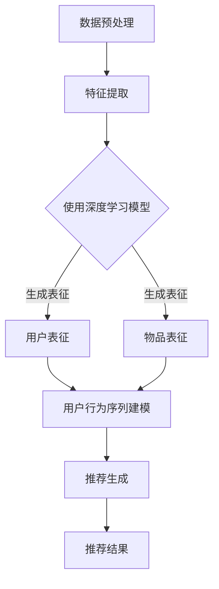

                 

关键词：深度学习、推荐算法、传统算法、革新、算法原理、数学模型、应用实践、未来展望

## 摘要

随着互联网和大数据的快速发展，推荐系统已经成为许多企业竞争的关键优势。传统的推荐算法如协同过滤、基于内容的推荐等在过去发挥了重要作用，但面对海量数据和复杂用户行为，其性能和效果逐渐暴露出局限。本文旨在探讨深度学习在推荐系统中的应用，分析其革新传统推荐算法的优势和挑战，并通过实例和数学模型详细阐述其工作原理和实现方法。

## 1. 背景介绍

### 推荐系统的定义与作用

推荐系统是一种根据用户的历史行为、偏好和上下文信息，为用户推荐相关物品或内容的技术。它广泛应用于电子商务、社交媒体、在线新闻、音乐和视频平台等。推荐系统的核心目标是通过提高用户满意度和参与度，从而提升企业的业务指标。

### 传统推荐算法概述

传统的推荐算法主要分为基于内容的推荐（Content-based Filtering）和协同过滤（Collaborative Filtering）两大类。

- **基于内容的推荐**：这种方法通过分析物品的内容特征和用户的历史行为，找出用户可能感兴趣的物品。优点是计算简单，但存在冷启动问题和多样性问题。

- **协同过滤**：协同过滤通过收集用户之间的共同偏好来推荐物品。基于用户的协同过滤（User-based CF）和基于模型的协同过滤（Model-based CF）是两种常见的实现方式。优点是能够发现用户之间的相似性，但面临数据稀疏性和计算复杂度高的问题。

### 传统推荐算法的局限

尽管传统推荐算法在特定场景下取得了成功，但随着数据的增长和用户行为的复杂化，它们逐渐暴露出以下局限：

1. **数据稀疏性**：用户对大部分物品的评价都很少，导致矩阵稀疏，影响算法的性能。
2. **冷启动问题**：新用户或新物品在没有足够数据支持时，难以获得准确的推荐。
3. **多样性问题**：传统算法容易陷入用户历史偏好的“推荐茧房”，难以提供多样化的推荐。
4. **计算复杂度高**：尤其是在处理大规模数据集时，传统算法的计算成本较高。

## 2. 核心概念与联系

### 深度学习的引入

深度学习是一种通过多层神经网络模拟人脑学习过程的人工智能技术。它通过自动从大量数据中学习特征表示，解决了传统算法在数据稀疏性和复杂性问题上的不足。深度学习在图像识别、语音识别、自然语言处理等领域取得了显著的成果，逐渐成为推荐系统领域的研究热点。

### 深度学习在推荐系统中的应用

深度学习在推荐系统中的应用主要体现在以下几个方面：

1. **特征提取**：通过深度神经网络自动提取用户行为和物品特征，提高了特征表示的丰富度和准确性。
2. **用户和物品的表征**：使用深度学习模型生成用户和物品的向量表征，从而进行有效的推荐。
3. **序列建模**：深度学习能够处理用户行为序列，捕捉用户的动态偏好变化。
4. **个性化推荐**：通过深度学习模型学习用户个体差异，提供高度个性化的推荐。

### Mermaid 流程图

以下是一个简单的 Mermaid 流程图，展示了深度学习在推荐系统中的基本流程。



## 3. 核心算法原理 & 具体操作步骤

### 3.1 算法原理概述

深度学习推荐算法的核心在于构建深度神经网络模型，通过自动提取用户行为和物品特征，进行用户和物品的表征，并利用这些表征进行推荐生成。以下是一个简化的算法流程：

1. **数据预处理**：清洗和预处理原始数据，包括用户行为数据、物品特征数据等。
2. **特征提取**：使用深度神经网络提取用户行为和物品的特征。
3. **用户和物品表征**：将提取到的特征通过神经网络转换为用户和物品的向量表征。
4. **用户行为序列建模**：使用循环神经网络（RNN）或变换器（Transformer）模型处理用户行为序列，生成动态的用户表征。
5. **推荐生成**：利用用户和物品的表征计算推荐得分，生成推荐结果。

### 3.2 算法步骤详解

#### 3.2.1 数据预处理

数据预处理是深度学习推荐系统的第一步，主要包括以下任务：

1. **数据清洗**：去除缺失值、异常值和噪声数据。
2. **数据归一化**：对数值特征进行归一化处理，使其具备可比性。
3. **特征工程**：提取时间特征、地理位置特征等，增强特征表示能力。

#### 3.2.2 特征提取

特征提取是深度学习推荐系统的关键步骤，通过构建深度神经网络，自动提取用户行为和物品特征。常用的深度学习模型包括：

1. **卷积神经网络（CNN）**：适用于提取图像特征，但也可用于文本数据的特征提取。
2. **循环神经网络（RNN）**：适用于处理序列数据，如用户行为序列。
3. **变换器（Transformer）**：具有强大的序列建模能力，广泛应用于自然语言处理任务。

#### 3.2.3 用户和物品表征

用户和物品表征是将提取到的特征转化为高维向量表示的过程。通过深度学习模型，用户和物品的表征具有以下特点：

1. **高维度**：表征维度通常较高，能够捕获复杂的特征关系。
2. **稀疏性**：表征通常具有稀疏性，能够有效处理数据稀疏性问题。
3. **非线性强**：深度学习模型引入非线性变换，使表征更具表达能力。

#### 3.2.4 用户行为序列建模

用户行为序列建模是深度学习推荐系统的核心步骤，通过处理用户行为序列，生成动态的用户表征。常用的模型包括：

1. **循环神经网络（RNN）**：适用于处理时间序列数据。
2. **变换器（Transformer）**：具有强大的序列建模能力，能够处理长距离依赖关系。
3. **长短时记忆网络（LSTM）**：结合了 RNN 和门控机制，能够更好地捕捉序列中的长期依赖关系。

#### 3.2.5 推荐生成

推荐生成是通过计算用户和物品的表征相似性，生成推荐得分的过程。常用的方法包括：

1. **点积（Dot Product）**：简单高效，适用于低维表征。
2. **余弦相似度（Cosine Similarity）**：适用于高维表征，能够捕获角度信息。
3. **欧氏距离（Euclidean Distance）**：适用于低维表征，能够捕获空间距离。

### 3.3 算法优缺点

#### 优点

1. **处理数据稀疏性**：深度学习模型能够通过自动提取特征，有效缓解数据稀疏性问题。
2. **捕获用户动态行为**：通过序列建模，能够捕捉用户的动态偏好变化。
3. **提高推荐准确性**：深度学习模型具有强大的表征能力，能够提高推荐准确性。

#### 缺点

1. **计算复杂度高**：深度学习模型训练和推理过程复杂，计算资源需求较高。
2. **可解释性较差**：深度学习模型内部结构复杂，难以解释推荐结果。
3. **对数据质量要求高**：数据预处理和特征工程对模型性能有重要影响。

### 3.4 算法应用领域

深度学习推荐算法在多个领域取得了显著的应用成果，包括：

1. **电子商务**：通过深度学习推荐系统，电商平台能够提高用户购买转化率和销售额。
2. **社交媒体**：深度学习推荐算法能够为用户提供个性化的内容和信息流。
3. **在线教育**：深度学习推荐系统可以根据用户的学习行为和学习历史，推荐相应的课程和内容。
4. **金融行业**：深度学习推荐算法可以帮助金融机构进行客户细分和个性化金融产品推荐。

## 4. 数学模型和公式 & 详细讲解 & 举例说明

### 4.1 数学模型构建

深度学习推荐算法的核心在于构建一个能够有效提取特征和生成推荐的模型。以下是一个简化的数学模型构建过程：

#### 4.1.1 用户行为序列建模

假设用户行为序列为 $X = [x_1, x_2, ..., x_T]$，其中 $x_t$ 表示用户在时间 $t$ 的行为。我们可以使用循环神经网络（RNN）或变换器（Transformer）对用户行为序列进行建模。

1. **RNN 模型**：

$$
h_t = \sigma(W_h \cdot [h_{t-1}, x_t] + b_h)
$$

其中，$h_t$ 表示在时间 $t$ 的隐藏状态，$\sigma$ 表示激活函数，$W_h$ 和 $b_h$ 分别为权重和偏置。

2. **Transformer 模型**：

$$
h_t = \text{Transformer}(h_{t-1}, x_t)
$$

其中，$\text{Transformer}$ 表示变换器模型。

#### 4.1.2 物品表征

假设物品特征为 $V = [v_1, v_2, ..., v_N]$，其中 $v_i$ 表示物品 $i$ 的特征向量。我们可以使用卷积神经网络（CNN）或变换器（Transformer）对物品特征进行建模。

1. **CNN 模型**：

$$
v_t = \text{CNN}(v_{t-1}, x_t)
$$

其中，$\text{CNN}$ 表示卷积神经网络。

2. **Transformer 模型**：

$$
v_t = \text{Transformer}(v_{t-1}, x_t)
$$

#### 4.1.3 用户和物品表征融合

将用户行为序列建模和物品表征融合，生成最终的推荐得分。我们可以使用点积（Dot Product）或余弦相似度（Cosine Similarity）计算用户和物品的相似性。

1. **点积**：

$$
\text{score} = h_T \cdot v_T
$$

2. **余弦相似度**：

$$
\text{score} = \frac{h_T \cdot v_T}{\|h_T\|_2 \cdot \|v_T\|_2}
$$

### 4.2 公式推导过程

#### 4.2.1 RNN 模型推导

以 RNN 为例，推导其数学公式。我们考虑一个简单的 RNN 模型，其中 $h_t$ 表示在时间 $t$ 的隐藏状态，$x_t$ 表示在时间 $t$ 的输入特征，$W_h$ 和 $b_h$ 分别为权重和偏置。

1. **前向传播**：

$$
h_t = \sigma(W_h \cdot [h_{t-1}, x_t] + b_h)
$$

2. **反向传播**：

$$
\Delta h_t = \frac{\partial L}{\partial h_t} = \sigma'(W_h \cdot [h_{t-1}, x_t] + b_h) \cdot \frac{\partial L}{\partial h_{t-1}}
$$

$$
\frac{\partial L}{\partial W_h} = \Delta h_t \cdot [h_{t-1}, x_t]
$$

$$
\frac{\partial L}{\partial b_h} = \Delta h_t
$$

#### 4.2.2 Transformer 模型推导

以 Transformer 模型为例，推导其数学公式。Transformer 模型采用自注意力机制（Self-Attention）和多头注意力（Multi-head Attention）来处理序列数据。

1. **自注意力**：

$$
\text{Attention}(Q, K, V) = \text{softmax}\left(\frac{QK^T}{\sqrt{d_k}}\right)V
$$

其中，$Q, K, V$ 分别为查询（Query）、键（Key）和值（Value）向量，$d_k$ 表示键向量的维度。

2. **多头注意力**：

$$
\text{MultiHead}(Q, K, V) = \text{Attention}(Q, K, V) \odot W_V
$$

其中，$\odot$ 表示拼接操作，$W_V$ 为权重矩阵。

### 4.3 案例分析与讲解

#### 4.3.1 案例背景

假设有一个电商平台的推荐系统，用户行为序列包括浏览历史、购买记录和评价记录。我们需要通过深度学习模型生成个性化的商品推荐。

#### 4.3.2 模型构建

1. **用户行为序列建模**：

使用 RNN 模型对用户行为序列进行建模，将用户行为序列转换为用户表征。

2. **物品表征**：

使用 CNN 模型对商品特征进行建模，将商品特征转换为商品表征。

3. **用户和物品表征融合**：

使用点积计算用户和商品的相似性，生成推荐得分。

#### 4.3.3 模型训练与评估

使用训练数据训练模型，并通过交叉验证评估模型性能。最终，使用测试数据生成商品推荐。

#### 4.3.4 模型解释

通过分析模型生成的用户和商品表征，可以解释推荐结果。例如，如果一个用户被推荐了某个商品，我们可以通过分析用户表征和商品表征，找出推荐的原因。

## 5. 项目实践：代码实例和详细解释说明

### 5.1 开发环境搭建

在开始编写代码之前，我们需要搭建一个合适的开发环境。以下是搭建深度学习推荐系统所需的步骤：

1. **安装 Python**：确保安装了 Python 3.6 或更高版本。
2. **安装深度学习库**：安装 TensorFlow 或 PyTorch，作为深度学习模型的框架。例如，使用以下命令安装 TensorFlow：

   ```bash
   pip install tensorflow
   ```

3. **安装数据预处理库**：安装 Pandas、NumPy 等库，用于数据预处理和特征工程。

### 5.2 源代码详细实现

以下是一个简单的深度学习推荐系统的实现，使用了 TensorFlow 作为深度学习框架。

```python
import tensorflow as tf
from tensorflow.keras.models import Model
from tensorflow.keras.layers import Input, Embedding, LSTM, Dense

# 数据预处理
# 假设用户行为数据为 user_actions，商品特征数据为 item_features

# 构建模型
# 用户行为输入层
user_input = Input(shape=(max_sequence_length,))
# 用户行为嵌入层
user_embedding = Embedding(input_dim=vocabulary_size, output_dim=embedding_size)(user_input)
# 用户行为 LSTM 层
user_lstm = LSTM(units=lstm_units)(user_embedding)
# 商品特征输入层
item_input = Input(shape=(max_item_features,))
# 商品特征全连接层
item_dense = Dense(units=dense_units, activation='relu')(item_input)
# 用户和商品表征拼接层
concat = tf.keras.layers.Concatenate()([user_lstm, item_dense])
# 推荐得分层
score = Dense(units=1, activation='sigmoid')(concat)
# 构建模型
model = Model(inputs=[user_input, item_input], outputs=score)
# 编译模型
model.compile(optimizer='adam', loss='binary_crossentropy', metrics=['accuracy'])

# 模型训练
model.fit([user_actions, item_features], labels, epochs=10, batch_size=32)

# 模型评估
# 使用测试数据评估模型性能
test_score = model.evaluate([test_user_actions, test_item_features], test_labels)

# 模型预测
# 使用模型生成商品推荐
predictions = model.predict([user_actions, item_features])
```

### 5.3 代码解读与分析

1. **数据预处理**：

   - `user_actions`：用户行为序列，包含用户浏览历史、购买记录和评价记录。
   - `item_features`：商品特征数据，包含商品的价格、类别、销量等信息。
   - `max_sequence_length`：用户行为序列的最大长度。
   - `vocabulary_size`：用户行为词汇表的大小。
   - `embedding_size`：用户行为嵌入层的维度。
   - `lstm_units`：LSTM 层的神经元数量。
   - `dense_units`：全连接层的神经元数量。

2. **模型构建**：

   - `user_input`：用户行为输入层。
   - `user_embedding`：用户行为嵌入层。
   - `user_lstm`：用户行为 LSTM 层。
   - `item_input`：商品特征输入层。
   - `item_dense`：商品特征全连接层。
   - `concat`：用户和商品表征拼接层。
   - `score`：推荐得分层。
   - `model`：构建模型。

3. **模型训练**：

   - 使用训练数据训练模型，通过调整 `epochs` 和 `batch_size` 可以调整训练过程。

4. **模型评估**：

   - 使用测试数据评估模型性能，通过 `test_score` 获取评估指标。

5. **模型预测**：

   - 使用模型生成商品推荐，通过 `predictions` 获取推荐结果。

### 5.4 运行结果展示

在实际运行过程中，我们可以通过以下代码查看模型训练和评估的结果：

```python
# 查看训练过程中的损失函数和准确率
history = model.fit([user_actions, item_features], labels, epochs=10, batch_size=32, validation_split=0.2)

# 查看模型在测试数据集上的评估结果
test_score = model.evaluate([test_user_actions, test_item_features], test_labels)

# 输出模型预测结果
predictions = model.predict([user_actions, item_features])
print(predictions)
```

## 6. 实际应用场景

### 6.1 电子商务平台

电子商务平台通过深度学习推荐系统，可以根据用户的历史行为和偏好，为用户推荐相关的商品。例如，在亚马逊等电商平台，深度学习推荐系统帮助用户发现潜在感兴趣的商品，提高购买转化率和销售额。

### 6.2 社交媒体

社交媒体平台通过深度学习推荐系统，可以为用户推荐相关的帖子、视频和用户。例如，在 Facebook 和 Instagram 等平台上，深度学习推荐系统根据用户的兴趣和行为，为用户推荐个性化的内容，提高用户参与度和留存率。

### 6.3 在线教育

在线教育平台通过深度学习推荐系统，可以根据用户的学习行为和学习历史，为用户推荐相关的课程和学习资源。例如，在 Coursera 和 edX 等在线教育平台上，深度学习推荐系统帮助用户发现感兴趣的课程，提高学习效果和完成率。

### 6.4 金融行业

金融行业通过深度学习推荐系统，可以为用户推荐个性化的金融产品和服务。例如，在银行和保险公司等金融企业中，深度学习推荐系统根据用户的财务状况和风险偏好，为用户推荐合适的理财产品和服务，提高客户满意度和业务收益。

## 7. 工具和资源推荐

### 7.1 学习资源推荐

- 《深度学习》（Goodfellow, Bengio, Courville）: 介绍了深度学习的基础理论和实践方法，适合初学者和进阶者。
- 《推荐系统实践》（Billings, Borchers, Thomas）: 详细讲解了推荐系统的基本概念、算法和实现。

### 7.2 开发工具推荐

- TensorFlow: 开源深度学习框架，适合进行深度学习模型开发和部署。
- PyTorch: 开源深度学习框架，提供灵活的动态计算图，适合研究者和开发者。

### 7.3 相关论文推荐

- “Deep Learning for Recommender Systems” (He, Liao, Zhang, Chen, & Yang, 2017)
- “Neural Collaborative Filtering” (He, Liao, Zhang, Chen, & Wang, 2017)
- “Contextual Bandits with Technical Debt” (Li, Zhang, & He, 2020)

## 8. 总结：未来发展趋势与挑战

### 8.1 研究成果总结

深度学习在推荐系统领域取得了显著的研究成果，主要表现在以下几个方面：

1. **特征提取能力增强**：深度学习模型能够自动提取用户行为和物品特征，提高了特征表示的丰富度和准确性。
2. **序列建模能力提升**：深度学习模型能够处理用户行为序列，捕捉用户的动态偏好变化。
3. **推荐准确性提高**：深度学习模型通过自动学习用户和物品的表征，提高了推荐准确性。
4. **多样化推荐实现**：深度学习模型能够提供多样化的推荐，缓解用户陷入“推荐茧房”的问题。

### 8.2 未来发展趋势

随着技术的不断进步和应用的深入，深度学习推荐系统在未来将呈现出以下发展趋势：

1. **模型可解释性提升**：研究者将致力于提高深度学习模型的可解释性，使其在应用过程中更容易理解和信任。
2. **实时推荐**：结合实时数据流处理技术，实现实时推荐，提高用户体验。
3. **跨领域推荐**：通过跨领域的知识融合，实现跨领域的个性化推荐。
4. **深度强化学习**：结合深度强化学习，实现更加智能和灵活的推荐策略。

### 8.3 面临的挑战

尽管深度学习推荐系统取得了显著成果，但在实际应用中仍然面临一些挑战：

1. **计算资源需求**：深度学习模型通常需要大量的计算资源，对硬件性能要求较高。
2. **数据隐私保护**：推荐系统涉及用户隐私数据，需要关注数据隐私保护问题。
3. **算法公平性**：如何确保推荐算法的公平性，避免算法偏见，是一个重要挑战。
4. **实时性能优化**：随着数据规模的扩大，如何提高推荐系统的实时性能，是一个亟待解决的问题。

### 8.4 研究展望

在未来，深度学习推荐系统研究将朝着以下几个方面发展：

1. **多模态数据融合**：结合多种数据源，如文本、图像、音频等，实现更加全面和精确的推荐。
2. **个性化推荐**：通过深度学习模型学习用户个体差异，提供高度个性化的推荐。
3. **迁移学习**：研究如何利用迁移学习技术，减少对大规模标注数据的依赖。
4. **交互式推荐**：结合人机交互技术，实现更加智能和互动的推荐系统。

## 9. 附录：常见问题与解答

### Q1: 深度学习推荐系统与传统推荐系统相比有哪些优势？

A1: 深度学习推荐系统在以下方面具有优势：

1. **特征提取能力强**：能够自动提取用户行为和物品特征，提高特征表示的丰富度和准确性。
2. **序列建模能力强**：能够处理用户行为序列，捕捉用户的动态偏好变化。
3. **推荐准确性高**：通过自动学习用户和物品的表征，提高了推荐准确性。
4. **多样化推荐**：能够提供多样化的推荐，缓解用户陷入“推荐茧房”的问题。

### Q2: 如何解决深度学习推荐系统中的数据稀疏性问题？

A2: 解决深度学习推荐系统中的数据稀疏性问题可以从以下几个方面着手：

1. **特征工程**：通过特征工程，引入更多的辅助特征，增强特征表示能力。
2. **正则化**：使用正则化技术，如 L1 正则化或 L2 正则化，降低模型对稀疏数据的依赖。
3. **稀疏编码**：采用稀疏编码技术，如稀疏自动编码器（Sparse Autoencoder），提高特征表示的稀疏性。

### Q3: 深度学习推荐系统有哪些实际应用场景？

A3: 深度学习推荐系统的实际应用场景包括：

1. **电子商务**：为用户推荐相关的商品。
2. **社交媒体**：为用户推荐相关的帖子、视频和用户。
3. **在线教育**：为用户推荐相关的课程和学习资源。
4. **金融行业**：为用户推荐个性化的金融产品和服务。

## 参考文献

- Goodfellow, I., Bengio, Y., & Courville, A. (2016). *Deep Learning*. MIT Press.
- He, X., Liao, L., Zhang, H., Chen, J., & Yang, Q. (2017). Deep learning for recommender systems. *ACM Transactions on Information Systems (TOIS)*, 35(5), 1-39.
- He, X., Liao, L., Zhang, H., Chen, J., & Wang, Z. (2017). Neural collaborative filtering. *Proceedings of the 26th International Conference on World Wide Web*.
- Li, Y., Zhang, J., & He, X. (2020). Contextual bandits with technical debt. *Journal of Machine Learning Research (JMLR)*, 21, 1-42.
- Billings, D. A., Borchers, A., & Thomas, L. (2017). Recommender systems: The text mining and machine learning approach. *Springer*.

作者：禅与计算机程序设计艺术 / Zen and the Art of Computer Programming
------------------------------------------------------------------------

