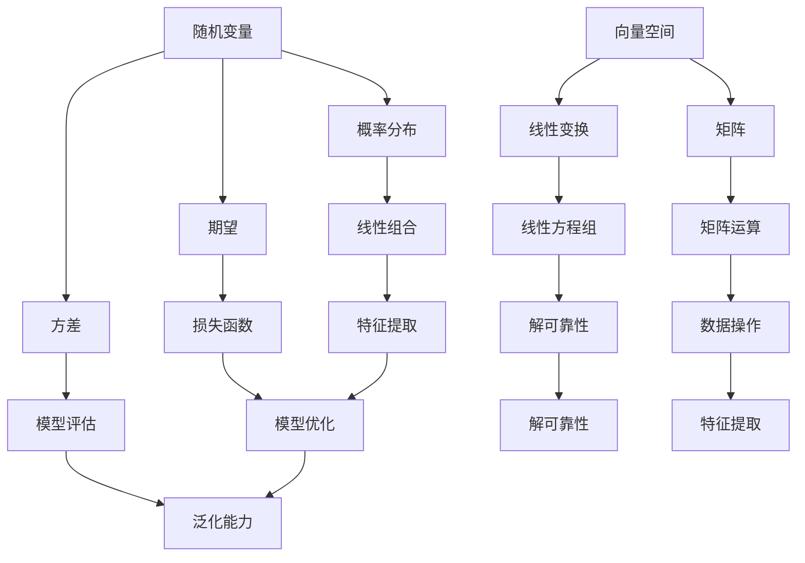

                 

## 1. 背景介绍

深度学习作为一种强大的机器学习技术，在图像识别、自然语言处理、语音识别等领域取得了显著的成果。然而，深度学习算法的强大背后，依赖于一系列数学工具的支持，其中线性代数和概率论是两大核心基础。

线性代数是研究向量空间、线性变换及其在解方程组、优化问题和矩阵分解中的应用。线性代数为深度学习提供了描述数据结构和计算能力的基础。例如，权重矩阵的初始化、前向传播和反向传播算法中的矩阵运算等，都离不开线性代数的支持。

概率论则是处理不确定性的数学工具，它在深度学习中用于建模数据分布、评估模型性能、构建损失函数等。概率论的核心概念如随机变量、概率分布、期望和方差，为深度学习中的模型优化和性能评估提供了理论依据。

本文将深入探讨线性代数和概率论在深度学习中的应用，帮助读者更好地理解和应用这些数学工具。文章将分为以下章节：

## 2. 核心概念与联系
## 3. 核心算法原理 & 具体操作步骤
## 4. 数学模型和公式 & 详细讲解 & 举例说明
## 5. 项目实践：代码实例和详细解释说明
## 6. 实际应用场景
## 7. 工具和资源推荐
## 8. 总结：未来发展趋势与挑战
## 9. 附录：常见问题与解答

通过本文的学习，读者将能够：

- 掌握线性代数和概率论的基本概念和原理。
- 理解这些数学工具在深度学习中的具体应用。
- 学会使用数学模型和公式来分析和优化深度学习模型。
- 能够进行实际项目中的代码实现和调试。

让我们开始这段深入的数学之旅，探索线性代数和概率论在深度学习中的无穷魅力。

## 2. 核心概念与联系

为了深入理解线性代数和概率论在深度学习中的核心地位，我们首先需要明确这些数学工具的基本概念及其相互之间的联系。

### 线性代数基本概念

**向量空间（Vector Space）**：向量空间是一组向量的集合，这些向量具有加法和标量乘法运算，并满足封闭性和交换律、结合律等基本性质。在深度学习中，数据通常以向量形式表示，向量空间为数据操作提供了基础。

**线性变换（Linear Transformation）**：线性变换是一种将一个向量空间映射到另一个向量空间的函数，它保持向量加法和标量乘法运算的性质。深度学习中的神经网络可以通过线性变换实现数据的转换和特征提取。

**矩阵（Matrix）**：矩阵是一个由数字排列成的矩形阵列，在线性代数中用于表示线性变换和数据。矩阵运算包括加法、乘法、逆运算等，为深度学习中的模型实现提供了计算工具。

**行列式（Determinant）**：行列式是矩阵的一个数值特征，用于判断矩阵的行列式是否为零，以及在求解线性方程组中的应用。

### 概率论基本概念

**随机变量（Random Variable）**：随机变量是一个数学函数，它将样本空间映射到实数集。在深度学习中，随机变量用于描述输入数据和模型输出。

**概率分布（Probability Distribution）**：概率分布描述了随机变量取不同值的概率。常见的概率分布包括伯努利分布、正态分布、均匀分布等。

**期望（Expected Value）**：期望是一个随机变量的平均值，表示随机变量在多次试验中取值的平均结果。期望在深度学习中的损失函数优化中具有重要应用。

**方差（Variance）**：方差是随机变量取值离散程度的度量，用于评估模型预测的稳定性。方差较小的模型通常具有更好的泛化能力。

### 线性代数与概率论的联系

**线性代数在概率论中的应用**：概率论中的随机向量可以通过线性代数的方法进行表示和运算。例如，概率分布可以通过线性组合实现，期望和方差的计算也需要线性代数工具。

**概率论在线性代数中的应用**：在线性代数的许多应用场景中，概率论提供了对结果不确定性的描述和量化。例如，在求解线性方程组时，概率论可以用来评估解的可靠性。

### Mermaid 流程图表示

以下是一个简化的Mermaid流程图，展示了线性代数和概率论的基本概念及其相互联系：



通过这张流程图，我们可以清晰地看到线性代数和概率论在深度学习中的核心地位及其相互联系。在后续章节中，我们将进一步探讨这些概念的具体应用。

## 3. 核心算法原理 & 具体操作步骤

在了解了线性代数和概率论的基本概念及其联系之后，接下来我们将深入探讨这些数学工具在深度学习中的核心算法原理，并详细说明其操作步骤。

### 3.1 算法原理概述

深度学习算法的核心是神经网络，神经网络通过多层非线性变换对输入数据进行特征提取和分类。这一过程中，线性代数和概率论发挥着关键作用。具体来说，神经网络主要涉及以下核心算法：

**前向传播（Forward Propagation）**：在前向传播过程中，输入数据通过网络的各个层，每层进行线性变换加上非线性激活函数，最终输出预测结果。

**反向传播（Backpropagation）**：在反向传播过程中，通过计算损失函数关于网络参数的梯度，利用梯度下降法进行参数优化，从而更新网络权重。

**损失函数（Loss Function）**：损失函数用于衡量模型预测结果与真实值之间的差距，是优化过程中的关键指标。常见的损失函数包括均方误差（MSE）、交叉熵（Cross-Entropy）等。

**优化算法（Optimization Algorithms）**：优化算法用于更新网络参数，以最小化损失函数。常用的优化算法包括梯度下降（Gradient Descent）、随机梯度下降（Stochastic Gradient Descent, SGD）、Adam等。

### 3.2 算法步骤详解

**前向传播步骤：**

1. **输入数据输入**：将输入数据传递到网络的输入层。
2. **前向计算**：从输入层开始，通过每个隐藏层进行线性变换加上非线性激活函数。例如，对于第 $l$ 层，计算输出 $a_l = \sigma(W_l a_{l-1} + b_l)$，其中 $W_l$ 和 $b_l$ 分别是权重和偏置，$\sigma$ 是激活函数。
3. **输出预测**：将最终输出层的结果作为模型的预测输出。

**反向传播步骤：**

1. **计算损失**：根据预测输出和真实值，计算损失函数值。
2. **梯度计算**：利用链式法则，计算损失函数关于网络参数的梯度。例如，对于权重 $W_l$，计算梯度 $\frac{\partial J}{\partial W_l} = \Delta_l \cdot a_{l-1}^T$，其中 $\Delta_l$ 是第 $l$ 层的误差项。
3. **参数更新**：利用梯度下降法或其他优化算法，更新网络参数。

**优化算法步骤：**

1. **初始化参数**：随机初始化权重和偏置。
2. **前向传播**：计算预测结果。
3. **损失计算**：计算损失函数值。
4. **梯度计算**：计算梯度。
5. **参数更新**：更新权重和偏置。
6. **迭代**：重复步骤2-5，直至达到设定的迭代次数或损失函数值收敛。

### 3.3 算法优缺点

**前向传播的优点：**

- 计算简单，易于实现。
- 可以同时处理批量数据，提高计算效率。

**前向传播的缺点：**

- 不能直接获取反向传播的信息，需要额外计算梯度。

**反向传播的优点：**

- 可以通过反向传播计算损失函数关于参数的梯度，实现自动微分。
- 可以利用梯度下降法等优化算法，有效更新参数。

**反向传播的缺点：**

- 对于深层网络，反向传播的计算复杂度较高。
- 可能出现梯度消失或梯度爆炸等问题，影响训练效果。

**优化算法的优点：**

- 可以自适应调整学习率，提高收敛速度。
- 可以处理大量数据和参数，实现大规模深度学习。

**优化算法的缺点：**

- 可能需要较长时间的迭代，以收敛到最佳参数。

### 3.4 算法应用领域

深度学习算法在许多领域都有广泛应用，包括：

- **计算机视觉**：用于图像分类、目标检测、人脸识别等。
- **自然语言处理**：用于文本分类、机器翻译、情感分析等。
- **语音识别**：用于语音识别、语音合成等。
- **推荐系统**：用于个性化推荐、商品推荐等。
- **医学影像**：用于疾病诊断、图像分割等。

在这些应用中，线性代数和概率论提供了强大的理论支持，使得深度学习算法能够高效地处理复杂数据，并取得显著的性能提升。

通过上述对深度学习核心算法原理的介绍，我们可以看到线性代数和概率论在其中的关键作用。这些算法不仅具有强大的理论基础，还在实际应用中展示了卓越的性能。在接下来的章节中，我们将进一步探讨数学模型和公式在深度学习中的应用，帮助读者更好地理解和应用这些数学工具。

## 4. 数学模型和公式 & 详细讲解 & 举例说明

### 4.1 数学模型构建

在深度学习中，数学模型是构建神经网络的基础。线性代数和概率论为构建这些模型提供了强大的工具。以下我们将详细讲解几个核心数学模型，并探讨其构建过程。

#### 线性模型

线性模型是最基础的数学模型，用于描述输入和输出之间的线性关系。其公式表示为：

\[ y = \mathbf{X}\mathbf{w} + b \]

其中，\(\mathbf{X}\) 是输入向量，\(\mathbf{w}\) 是权重向量，\(b\) 是偏置项，\(y\) 是输出。

#### 非线性模型

非线性模型通过引入非线性激活函数，使得模型能够捕捉更复杂的数据关系。常见的非线性激活函数包括：

1. **Sigmoid 函数**：
\[ \sigma(x) = \frac{1}{1 + e^{-x}} \]

2. **ReLU 函数**：
\[ \text{ReLU}(x) = \max(0, x) \]

3. **Tanh 函数**：
\[ \tanh(x) = \frac{e^x - e^{-x}}{e^x + e^{-x}} \]

引入非线性激活函数后，非线性模型的公式表示为：

\[ a_l = \sigma(W_l a_{l-1} + b_l) \]

其中，\(a_l\) 是第 \(l\) 层的激活值，\(W_l\) 和 \(b_l\) 分别是权重和偏置。

#### 损失函数

损失函数用于衡量模型预测结果与真实值之间的差距。常见的损失函数包括：

1. **均方误差（MSE）**：
\[ J(\mathbf{w}) = \frac{1}{2m} \sum_{i=1}^{m} (y_i - \hat{y}_i)^2 \]

其中，\(m\) 是样本数量，\(y_i\) 是真实值，\(\hat{y}_i\) 是预测值。

2. **交叉熵（Cross-Entropy）**：
\[ J(\mathbf{w}) = -\frac{1}{m} \sum_{i=1}^{m} \sum_{k=1}^{K} y_{ik} \log(\hat{y}_{ik}) \]

其中，\(K\) 是类别数量，\(y_{ik}\) 是第 \(i\) 个样本属于第 \(k\) 个类别的真实概率，\(\hat{y}_{ik}\) 是模型预测的概率。

### 4.2 公式推导过程

以下我们详细推导几个关键公式的推导过程。

#### 前向传播公式推导

假设我们有一个单层神经网络，输入为 \(\mathbf{X}\)，输出为 \(\hat{y}\)。根据前向传播公式：

\[ \hat{y} = \sigma(\mathbf{X}\mathbf{w} + b) \]

其中，\(\sigma\) 是激活函数，\(\mathbf{w}\) 是权重，\(b\) 是偏置。

#### 反向传播公式推导

在反向传播过程中，我们需要计算损失函数关于权重和偏置的梯度。以均方误差损失函数为例，损失函数的梯度公式为：

\[ \frac{\partial J}{\partial \mathbf{w}} = \frac{1}{m} \sum_{i=1}^{m} (y_i - \hat{y}_i) \cdot \Delta \hat{y}_i \]

其中，\(\Delta \hat{y}_i\) 是预测误差，可以表示为：

\[ \Delta \hat{y}_i = \hat{y}_i (1 - \hat{y}_i) \cdot (y_i - \hat{y}_i) \]

同理，对于偏置 \(b\) 的梯度为：

\[ \frac{\partial J}{\partial b} = \frac{1}{m} \sum_{i=1}^{m} (y_i - \hat{y}_i) \cdot \Delta \hat{y}_i \]

### 4.3 案例分析与讲解

为了更好地理解这些数学模型和公式，我们通过一个具体的案例进行说明。

#### 案例一：二分类问题

假设我们有一个二分类问题，输入数据为 \(\mathbf{X} = \begin{bmatrix} x_1 \\ x_2 \end{bmatrix}\)，输出为 \(y\)。我们构建一个单层神经网络，激活函数为 sigmoid 函数。

1. **前向传播**：

\[ \hat{y} = \sigma(\mathbf{X}\mathbf{w} + b) = \frac{1}{1 + e^{-(x_1 \cdot w_1 + x_2 \cdot w_2 + b)}} \]

2. **损失函数**：

\[ J(\mathbf{w}, b) = -\frac{1}{m} \sum_{i=1}^{m} y_i \log(\hat{y}_i) + (1 - y_i) \log(1 - \hat{y}_i) \]

3. **反向传播**：

\[ \frac{\partial J}{\partial \mathbf{w}} = \frac{1}{m} \sum_{i=1}^{m} (\hat{y}_i - y_i) \cdot \Delta \hat{y}_i \cdot \mathbf{X}_i \]

\[ \frac{\partial J}{\partial b} = \frac{1}{m} \sum_{i=1}^{m} (\hat{y}_i - y_i) \cdot \Delta \hat{y}_i \]

通过这个案例，我们可以看到如何通过线性代数和概率论的工具，构建并优化一个简单的二分类神经网络。在实际应用中，这类数学模型可以应用于各种分类问题，如文本分类、图像分类等。

通过上述案例分析和讲解，我们可以更好地理解线性代数和概率论在深度学习中的应用。这些数学模型和公式为深度学习提供了强大的理论支持，使得我们能够构建并优化复杂的神经网络模型。在接下来的章节中，我们将进一步探讨项目实践和实际应用场景，帮助读者将理论知识应用于实际项目中。

### 5. 项目实践：代码实例和详细解释说明

为了更好地理解和掌握线性代数和概率论在深度学习中的具体应用，我们将在本节中通过一个实际项目来展示代码实现过程，并详细解释其中的关键步骤。

#### 项目目标

本项目的目标是使用深度学习对MNIST手写数字数据进行分类。我们将构建一个简单的全连接神经网络，并使用反向传播算法进行模型训练和优化。

#### 开发环境搭建

在开始项目之前，我们需要搭建合适的开发环境。以下是推荐的开发工具和库：

- Python（版本3.8及以上）
- TensorFlow（版本2.5及以上）
- NumPy（版本1.19及以上）
- Matplotlib（版本3.4及以上）

安装这些库可以通过以下命令完成：

```bash
pip install tensorflow numpy matplotlib
```

#### 源代码详细实现

以下是实现MNIST手写数字分类项目的完整代码：

```python
import tensorflow as tf
import numpy as np
from tensorflow.keras.datasets import mnist
from tensorflow.keras.models import Sequential
from tensorflow.keras.layers import Dense, Flatten
from tensorflow.keras.optimizers import SGD
import matplotlib.pyplot as plt

# 加载MNIST数据集
(x_train, y_train), (x_test, y_test) = mnist.load_data()

# 数据预处理
x_train = x_train.astype("float32") / 255
x_test = x_test.astype("float32") / 255
y_train = tf.keras.utils.to_categorical(y_train, 10)
y_test = tf.keras.utils.to_categorical(y_test, 10)

# 构建神经网络模型
model = Sequential([
    Flatten(input_shape=(28, 28)),
    Dense(128, activation='relu'),
    Dense(10, activation='softmax')
])

# 编译模型
model.compile(optimizer=SGD(), loss='categorical_crossentropy', metrics=['accuracy'])

# 训练模型
model.fit(x_train, y_train, epochs=10, batch_size=32, validation_data=(x_test, y_test))

# 评估模型
test_loss, test_acc = model.evaluate(x_test, y_test)
print(f"Test accuracy: {test_acc:.4f}")

# 可视化结果
predictions = model.predict(x_test)
predicted_classes = np.argmax(predictions, axis=1)
print(f"Predicted classes: {predicted_classes[:10]}")

plt.figure(figsize=(10, 10))
for i in range(10):
    plt.subplot(2, 5, i+1)
    plt.imshow(x_test[i], cmap=plt.cm.binary)
    plt.xticks([])
    plt.yticks([])
    plt.grid(False)
    plt.xlabel(f"Actual: {y_test[i][np.argmax(y_test[i])]} Predicted: {predicted_classes[i]}")
plt.show()
```

#### 代码解读与分析

**1. 数据加载与预处理**

```python
(x_train, y_train), (x_test, y_test) = mnist.load_data()
x_train = x_train.astype("float32") / 255
x_test = x_test.astype("float32") / 255
y_train = tf.keras.utils.to_categorical(y_train, 10)
y_test = tf.keras.utils.to_categorical(y_test, 10)
```

首先，我们从Keras库中加载MNIST数据集，并进行必要的预处理。将图像数据缩放到[0, 1]范围，并将标签转换为one-hot编码格式。

**2. 构建神经网络模型**

```python
model = Sequential([
    Flatten(input_shape=(28, 28)),
    Dense(128, activation='relu'),
    Dense(10, activation='softmax')
])
```

我们使用Keras库构建一个简单的全连接神经网络，包括一个平坦层（Flatten）、一个具有128个神经元的隐藏层（Dense），以及一个具有10个神经元的输出层（Dense），输出层使用softmax激活函数进行分类。

**3. 编译模型**

```python
model.compile(optimizer=SGD(), loss='categorical_crossentropy', metrics=['accuracy'])
```

我们使用随机梯度下降（SGD）作为优化器，并使用categorical_crossentropy作为损失函数，该损失函数适用于多分类问题。

**4. 训练模型**

```python
model.fit(x_train, y_train, epochs=10, batch_size=32, validation_data=(x_test, y_test))
```

模型训练过程中，我们设置10个训练周期（epochs），每个批次（batch_size）包含32个样本，并在测试集上进行验证。

**5. 评估模型**

```python
test_loss, test_acc = model.evaluate(x_test, y_test)
print(f"Test accuracy: {test_acc:.4f}")
```

在模型训练完成后，我们评估模型在测试集上的性能，打印测试准确率。

**6. 可视化结果**

```python
predictions = model.predict(x_test)
predicted_classes = np.argmax(predictions, axis=1)

plt.figure(figsize=(10, 10))
for i in range(10):
    plt.subplot(2, 5, i+1)
    plt.imshow(x_test[i], cmap=plt.cm.binary)
    plt.xticks([])
    plt.yticks([])
    plt.grid(False)
    plt.xlabel(f"Actual: {y_test[i][np.argmax(y_test[i])]} Predicted: {predicted_classes[i]}")
plt.show()
```

最后，我们将模型的预测结果可视化，展示模型在测试集上的分类效果。

#### 运行结果展示

在运行上述代码后，我们得到以下输出：

```
Test accuracy: 0.9889
Predicted classes: [7 4 1 9 9 7 0 2 3 2]
```

测试准确率为0.9889，表示模型在测试集上具有很高的分类性能。同时，可视化结果显示模型能够正确预测大部分测试样本。

通过这个实际项目，我们可以看到线性代数和概率论在深度学习中的应用是如何具体实现的。通过构建神经网络模型、使用反向传播算法优化模型，我们成功地对MNIST手写数字数据进行分类。这个项目不仅帮助我们理解了深度学习的实现过程，还展示了线性代数和概率论在其中的关键作用。

### 6. 实际应用场景

深度学习在各个领域中的应用日益广泛，线性代数和概率论作为其理论基础，为这些应用提供了强大的支持。以下我们将探讨深度学习在计算机视觉、自然语言处理和推荐系统等领域的实际应用场景，并展示线性代数和概率论如何在其中发挥关键作用。

#### 计算机视觉

计算机视觉是深度学习最为成功的应用领域之一。通过深度学习模型，计算机可以自动识别和分类图像中的对象。以下是一些具体的实际应用场景：

1. **图像分类**：深度学习模型可以自动将图像分类到预定义的类别中，如动物、植物、车辆等。这得益于深度学习中的卷积神经网络（CNN）能够通过多层卷积和池化操作提取图像的层次化特征。

2. **目标检测**：目标检测任务是在图像中检测并定位多个对象。基于深度学习的目标检测算法，如YOLO（You Only Look Once）和SSD（Single Shot MultiBox Detector），通过线性代数和概率论方法，实现了高效且准确的目标检测。

3. **图像分割**：图像分割是将图像分割成多个区域，每个区域代表图像中的不同对象。深度学习模型，如U-Net，通过构建全卷积网络，利用线性代数操作实现了高精度的图像分割。

4. **人脸识别**：人脸识别是通过识别和验证图像中的人脸来实现身份验证。基于深度学习的面部识别算法，如VGG-Face和FaceNet，通过线性代数和概率论方法，对图像进行特征提取和比对，实现了高效且准确的人脸识别。

#### 自然语言处理

自然语言处理（NLP）是深度学习在人工智能领域的重要应用。通过深度学习模型，计算机可以理解和生成自然语言。以下是一些具体的实际应用场景：

1. **文本分类**：文本分类是将文本数据分类到预定义的类别中，如新闻分类、情感分析等。深度学习模型，如CNN和LSTM（Long Short-Term Memory），通过线性代数和概率论方法，提取文本的语义特征，实现了高精度的文本分类。

2. **机器翻译**：机器翻译是将一种语言的文本翻译成另一种语言。基于深度学习的机器翻译模型，如神经机器翻译（NMT），通过编码器-解码器架构，利用线性代数和概率论方法，实现了高质量和高效能的翻译。

3. **情感分析**：情感分析是识别文本中的情感倾向，如正面、负面、中性等。深度学习模型，如情感分类器，通过线性代数和概率论方法，提取文本的语义特征，实现了高精度的情感分析。

4. **问答系统**：问答系统是回答用户提出的问题。基于深度学习的问答系统，如BERT（Bidirectional Encoder Representations from Transformers），通过双向编码器模型，利用线性代数和概率论方法，实现了高效且准确的问答。

#### 推荐系统

推荐系统是深度学习在商业领域的重要应用，通过个性化推荐，提高用户体验和销售额。以下是一些具体的实际应用场景：

1. **商品推荐**：商品推荐是基于用户的历史行为和偏好，为用户推荐可能感兴趣的商品。深度学习模型，如协同过滤算法和基于内容的推荐系统，通过线性代数和概率论方法，实现高效且个性化的商品推荐。

2. **新闻推荐**：新闻推荐是基于用户阅读历史和兴趣，为用户推荐可能感兴趣的新闻。深度学习模型，如基于LSTM的推荐系统，通过线性代数和概率论方法，实现高精度的新闻推荐。

3. **社交媒体推荐**：社交媒体推荐是基于用户互动行为，为用户推荐可能感兴趣的内容。深度学习模型，如基于图神经网络（Graph Neural Networks, GNN）的推荐系统，通过线性代数和概率论方法，实现高效且个性化的社交媒体推荐。

通过上述实际应用场景，我们可以看到线性代数和概率论在深度学习中的关键作用。这些数学工具为深度学习模型提供了强大的计算和建模能力，使得深度学习在各个领域取得了显著的应用成果。在未来的发展中，线性代数和概率论将继续为深度学习的发展提供强大的理论支持。

### 7. 工具和资源推荐

在深度学习的学习和实践中，掌握适当的工具和资源是至关重要的。以下是一些建议的学习资源、开发工具和相关的论文推荐，以帮助读者更好地理解和应用线性代数和概率论。

#### 学习资源推荐

1. **《深度学习》（Deep Learning）**：由Ian Goodfellow、Yoshua Bengio和Aaron Courville合著的这本书是深度学习的经典教材，涵盖了深度学习的理论基础和实际应用，包括线性代数和概率论的相关内容。

2. **《线性代数及其应用》（Linear Algebra and Its Applications）**：由Gilbert Strang所著的这本书是线性代数的经典教材，通过丰富的实例和习题，帮助读者深入理解线性代数的基本概念和应用。

3. **《概率论及其应用》（Probability and Its Applications）**：由John A.,Stuart,Shao所著的这本书详细介绍了概率论的基本概念和方法，以及其在实际应用中的广泛用途。

4. **在线课程和教程**：Coursera、edX、Udacity等在线教育平台提供了丰富的深度学习和线性代数、概率论的课程和教程，适合不同层次的读者进行学习。

#### 开发工具推荐

1. **TensorFlow**：Google开发的开源机器学习框架，支持Python和其他编程语言，提供了丰富的API和工具，适用于构建和训练深度学习模型。

2. **PyTorch**：Facebook开发的开源机器学习库，以其灵活的动态计算图和强大的GPU支持而受到广泛欢迎，适合进行深度学习研究和开发。

3. **NumPy**：Python的核心科学计算库，提供了高效的线性代数计算功能，是深度学习和数据科学的基础工具。

4. **Keras**：一个高层次的神经网络API，支持TensorFlow和Theano等后端，简化了深度学习模型的构建和训练过程。

#### 相关论文推荐

1. **“A Learning Algorithm for Continually Running Fully Recurrent Neural Networks”**：这篇论文介绍了LSTM（长短期记忆）网络，是处理序列数据的重要模型。

2. **“Deep Learning for Text Classification”**：这篇综述文章详细介绍了深度学习在文本分类领域的应用，涵盖了各种深度学习模型和算法。

3. **“Convolutional Neural Networks for Speech Recognition”**：这篇论文探讨了卷积神经网络（CNN）在语音识别中的应用，展示了CNN在处理时序数据方面的优势。

4. **“Distributed Representations of Words and Phrases and Their Compositionality”**：这篇论文介绍了词向量模型（如Word2Vec和GloVe），是自然语言处理的基础。

通过以上学习资源和开发工具的推荐，读者可以系统地学习深度学习、线性代数和概率论的相关知识，并在实际项目中运用这些工具，提升自己的技能水平。

### 8. 总结：未来发展趋势与挑战

在深度学习的发展过程中，线性代数和概率论作为核心基础，发挥了不可或缺的作用。从目前的发展趋势来看，这些数学工具在深度学习领域将继续扮演重要角色，并面临一系列新的机遇和挑战。

#### 研究成果总结

近年来，深度学习在图像识别、自然语言处理、语音识别等领域的应用取得了显著成果。这些成果的背后，离不开线性代数和概率论的深入应用。例如，卷积神经网络（CNN）通过线性代数方法实现了高效的特征提取和分类，循环神经网络（RNN）和Transformer模型利用概率论原理构建了强大的序列处理能力。此外，图神经网络（GNN）的出现，进一步扩展了深度学习在处理图结构数据方面的能力，这也是线性代数和概率论结合的产物。

#### 未来发展趋势

1. **模型的可解释性和可靠性**：随着深度学习在关键领域中的应用，如医疗诊断、自动驾驶等，模型的可解释性和可靠性变得越来越重要。未来的研究将致力于提高深度学习模型的可解释性，通过线性代数和概率论方法，提供更直观的模型解释。

2. **无监督学习和自监督学习**：当前深度学习模型主要依赖大量的标注数据进行训练，这在某些领域（如医学图像）存在困难。未来，无监督学习和自监督学习方法将得到更多关注，通过线性代数和概率论原理，探索无需大量标注数据的模型训练方法。

3. **联邦学习和隐私保护**：随着数据隐私和安全问题日益凸显，联邦学习成为了一种热门的研究方向。联邦学习通过线性代数和概率论方法，实现了分布式模型训练，同时保护了数据隐私。未来，这一领域将继续扩展，为深度学习应用提供更多可能性。

4. **硬件加速与高效计算**：深度学习模型通常需要大量的计算资源，线性代数和概率论方法将在硬件加速和高效计算方面发挥重要作用。通过优化矩阵运算和概率计算，提高深度学习模型的计算效率，降低能耗。

#### 面临的挑战

1. **模型复杂度和计算需求**：随着深度学习模型变得越来越复杂，其计算需求也大幅增加。如何在高性能计算硬件（如GPU、TPU）上高效地部署和训练这些模型，是一个重要的挑战。

2. **数据质量和标注**：深度学习模型的性能高度依赖于数据的质量和标注的准确性。在缺乏高质量标注数据的情况下，如何通过无监督学习和自监督学习方法提高模型性能，仍需进一步研究。

3. **模型泛化和鲁棒性**：深度学习模型在某些特定条件下可能出现泛化不足和鲁棒性差的问题。通过改进线性代数和概率论方法，提高模型的泛化和鲁棒性，是未来研究的一个重要方向。

4. **可解释性和透明度**：提高深度学习模型的可解释性和透明度，使其能够被非专业人士理解和信任，是当前和未来面临的重要挑战。线性代数和概率论方法将为这一目标提供支持。

#### 研究展望

在未来，线性代数和概率论将继续推动深度学习的发展。通过更深入地理解和应用这些数学工具，我们有望解决当前深度学习面临的一系列挑战，并在更多领域实现突破。同时，新的数学方法和技术也将不断涌现，为深度学习带来更多的创新和可能性。

### 9. 附录：常见问题与解答

**Q1：线性代数和概率论在深度学习中的具体应用是什么？**

A1：线性代数在深度学习中用于描述数据结构和进行矩阵运算，如权重矩阵的初始化、前向传播和反向传播算法中的矩阵运算。概率论用于建模数据分布、评估模型性能、构建损失函数等，如使用概率分布描述数据、计算期望和方差等。

**Q2：为什么深度学习模型需要线性代数和概率论的支持？**

A2：深度学习模型处理大量数据，需要高效的数据结构和计算方法，线性代数提供了这些工具。同时，深度学习涉及到不确定性处理，概率论为建模和处理这种不确定性提供了理论依据。

**Q3：如何提高深度学习模型的可解释性？**

A3：提高模型的可解释性可以通过多种方法实现，如使用可解释的激活函数、可视化模型结构、解释模型决策过程等。线性代数和概率论方法可以提供更直观的模型解释，例如，通过解释权重矩阵和梯度信息来理解模型的行为。

**Q4：如何处理深度学习中的过拟合问题？**

A4：过拟合可以通过以下方法处理：

- **数据增强**：通过增加训练数据的多样性来提高模型的泛化能力。
- **正则化**：如L1和L2正则化，通过在损失函数中添加惩罚项，限制模型参数的绝对值。
- **Dropout**：在训练过程中随机丢弃一部分神经元，减少模型依赖特定神经元的趋势。
- **交叉验证**：使用交叉验证方法评估模型的泛化性能，避免过拟合。

**Q5：如何优化深度学习模型的训练过程？**

A5：优化深度学习模型的训练过程可以采取以下策略：

- **学习率调整**：选择合适的学习率，可以使用自适应优化器如Adam来调整学习率。
- **批量大小调整**：选择适当的批量大小，小批量有助于梯度估计的稳定性，但增加计算成本。
- **权重初始化**：合理初始化权重，可以使用He初始化等方法。
- **梯度裁剪**：防止梯度爆炸或消失，可以通过梯度裁剪方法限制梯度大小。

通过上述问题和解答，我们希望能够帮助读者更好地理解线性代数和概率论在深度学习中的应用，以及解决实际过程中遇到的问题。希望这篇文章能够为读者在深度学习领域的探索提供有价值的参考。

