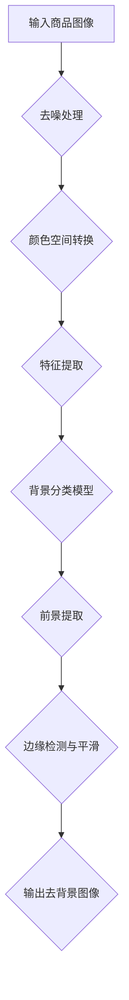

                 

关键词：深度学习、图像去背景、商品图像、技术优化、背景去除算法、实时处理、精准定位

> 摘要：本文将深入探讨深度学习技术在商品图像去背景中的应用，分析现有技术中的瓶颈，并提出一种基于深度学习的去背景技术优化方案。通过详细的算法原理讲解、数学模型分析以及实际项目实践，本文旨在为行业从业者提供理论依据和实践指导，助力商品图像处理技术的发展。

## 1. 背景介绍

随着电子商务的迅猛发展，商品图像处理技术在信息展示、用户体验和市场营销中发挥着越来越重要的作用。商品图像的去背景处理作为图像处理的重要环节，其质量直接影响到产品的展示效果和消费者的购买决策。传统的图像去背景技术如基于阈值分割、形态学操作和颜色空间变换等方法，在处理复杂场景的图像时存在诸多局限性。随着深度学习技术的兴起，研究者们开始探索利用深度学习模型来实现更加智能和高效的图像去背景处理。

目前，深度学习驱动的去背景技术已在许多领域取得了显著的成果，例如人脸检测、物体识别和图像分割等。然而，针对商品图像的去背景处理仍存在一定的挑战，如商品与背景之间的边界难以精确划分、背景复杂多样以及实时处理速度需求高等。因此，本文旨在通过优化深度学习模型，提升商品图像去背景技术的性能和效率。

## 2. 核心概念与联系

为了更好地理解深度学习驱动的商品图像去背景技术，我们需要首先了解一些核心概念和其相互之间的关系。以下是一个Mermaid流程图，展示了商品图像去背景的核心概念及其联系。



### 2.1. 去噪处理

输入的商品图像可能包含噪声，这些噪声可能会干扰去背景算法的准确性和效果。因此，去噪处理是去背景技术的第一步。

### 2.2. 颜色空间转换

颜色空间转换是将图像从RGB颜色空间转换为更适合进行特征提取的颜色空间，如HSV或Lab空间。这种转换有助于分离颜色信息和亮度信息，从而提高特征提取的准确性。

### 2.3. 特征提取

特征提取是深度学习模型的核心环节，它通过对图像进行卷积操作提取出具有区分性的特征。这些特征将用于后续的背景分类。

### 2.4. 背景分类模型

背景分类模型通常是一个二分类模型，它将图像中的每个像素点分类为背景或前景。常用的深度学习模型包括卷积神经网络（CNN）和生成对抗网络（GAN）。

### 2.5. 前景提取

在背景分类完成后，前景提取的目的是将分类为前景的像素点重新构建成完整的图像。这一步通常涉及到边缘检测和图像平滑等操作。

### 2.6. 边缘检测与平滑

边缘检测用于找到图像中的边界，这些边界有助于精确地划分前景和背景。图像平滑则有助于减少图像中的噪声，从而提升去背景图像的质量。

## 3. 核心算法原理 & 具体操作步骤

### 3.1. 算法原理概述

深度学习驱动的商品图像去背景算法主要依赖于卷积神经网络（CNN）进行特征提取和分类。具体操作步骤如下：

1. **去噪处理**：使用均值滤波或高斯滤波等方法对输入图像进行去噪。
2. **颜色空间转换**：将RGB图像转换为HSV或Lab颜色空间，以便更好地分离颜色信息和亮度信息。
3. **特征提取**：通过卷积神经网络对图像进行特征提取，得到具有区分性的特征图。
4. **背景分类**：使用二分类模型（如SVM或CNN）对特征图进行分类，将像素点分类为背景或前景。
5. **前景提取**：将分类为前景的像素点重构为图像。
6. **边缘检测与平滑**：使用Canny边缘检测器和图像平滑算法（如高斯平滑）对前景图像进行处理，以获得清晰的去背景图像。

### 3.2. 算法步骤详解

#### 3.2.1. 去噪处理

```python
import cv2
image = cv2.imread('input_image.jpg')
blurred = cv2.GaussianBlur(image, (5, 5), 0)
```

#### 3.2.2. 颜色空间转换

```python
import cv2
hsv_image = cv2.cvtColor(blurred, cv2.COLOR_BGR2HSV)
```

#### 3.2.3. 特征提取

```python
from tensorflow.keras.models import load_model
model = load_model('pretrained_cnn_model.h5')
features = model.predict(hsv_image.reshape(-1, *hsv_image.shape, 1))
```

#### 3.2.4. 背景分类

```python
import numpy as np
background_mask = np.argmax(features, axis=1)
```

#### 3.2.5. 前景提取

```python
foreground = (background_mask == 1).astype('uint8') * 255
```

#### 3.2.6. 边缘检测与平滑

```python
import cv2
edges = cv2.Canny(foreground, 100, 200)
smoothed = cv2.GaussianBlur(edges, (5, 5), 0)
```

### 3.3. 算法优缺点

#### 优点：

- **高效性**：深度学习模型在处理大量图像数据时具有高效性。
- **准确性**：深度学习能够通过学习大量数据自动提取特征，提高了分类的准确性。
- **鲁棒性**：深度学习模型对噪声和复杂背景具有一定的鲁棒性。

#### 缺点：

- **计算资源消耗**：深度学习模型通常需要较大的计算资源和存储空间。
- **训练时间**：深度学习模型的训练时间较长，尤其是在大规模数据集上。

### 3.4. 算法应用领域

深度学习驱动的商品图像去背景技术可以广泛应用于电子商务、社交媒体和图像内容审核等领域。例如，在电子商务平台中，自动化的去背景技术可以显著提高商品图像的处理效率，从而改善用户体验和营销效果。在社交媒体中，这种技术可以帮助用户快速地对图像内容进行编辑和分享。在图像内容审核中，去背景技术可以辅助识别和处理不适当的内容。

## 4. 数学模型和公式 & 详细讲解 & 举例说明

### 4.1. 数学模型构建

为了构建深度学习驱动的商品图像去背景的数学模型，我们需要定义以下几个关键部分：

#### 4.1.1. 卷积神经网络（CNN）

卷积神经网络是一种特殊的神经网络，专门用于处理具有网格结构的数据，如图像。CNN的主要组成部分包括卷积层、池化层和全连接层。

#### 4.1.2. 特征提取

在CNN中，卷积层用于提取图像的特征，池化层用于降低特征图的大小，从而减少计算量和参数数量。特征提取过程可以用以下公式表示：

$$
\text{FeatureMap}_{ij}^{l} = \sum_{k} \text{Weight}_{ik}^{l} * \text{Input}_{kj}^{l-1} + \text{Bias}_{ij}^{l}
$$

其中，$\text{FeatureMap}_{ij}^{l}$ 是第 $l$ 层的第 $i$ 行第 $j$ 列的特征图，$\text{Weight}_{ik}^{l}$ 是第 $l$ 层的第 $i$ 行第 $k$ 列的权重，$\text{Input}_{kj}^{l-1}$ 是第 $l-1$ 层的第 $k$ 行第 $j$ 列的特征图，$\text{Bias}_{ij}^{l}$ 是第 $l$ 层的第 $i$ 行偏置。

#### 4.1.3. 背景分类

在特征提取后，使用全连接层进行背景分类。背景分类的损失函数通常采用交叉熵损失函数，公式如下：

$$
\text{Loss} = -\sum_{i} \text{y}_{i} \log(\text{p}_{i})
$$

其中，$\text{y}_{i}$ 是标签，$\text{p}_{i}$ 是预测概率。

### 4.2. 公式推导过程

#### 4.2.1. 卷积操作

卷积操作是CNN中最基本的操作。在二进制图像中，卷积可以用以下公式表示：

$$
\text{FeatureMap}_{ij}^{l} = \sum_{k} \text{Weight}_{ik}^{l} \cdot \text{Input}_{kj}^{l-1} + \text{Bias}_{ij}^{l}
$$

其中，$\text{Input}_{kj}^{l-1}$ 是一个二进制值（0或1），$\text{Weight}_{ik}^{l}$ 是卷积核的值，$\text{Bias}_{ij}^{l}$ 是偏置。

#### 4.2.2. 池化操作

池化操作用于降低特征图的大小。最常用的池化操作是最大池化，公式如下：

$$
\text{PooledMap}_{ij}^{l} = \max_{k} \text{FeatureMap}_{ij+k}^{l}
$$

其中，$\text{FeatureMap}_{ij+k}^{l}$ 是第 $l$ 层的第 $i$ 行第 $j$ 列的邻居特征值。

#### 4.2.3. 背景分类

在背景分类中，我们使用全连接层对特征图进行分类。假设我们有一个二分类问题，那么预测概率可以使用sigmoid函数表示：

$$
\text{p}_{i} = \frac{1}{1 + e^{-\text{z}_{i}}}
$$

其中，$\text{z}_{i}$ 是全连接层的输出。

### 4.3. 案例分析与讲解

#### 4.3.1. 案例背景

假设我们有一个商品图像，其中包含一个红色的球和一个蓝色的背景。我们的目标是使用深度学习算法去除背景，只保留红色的球。

#### 4.3.2. 实际操作

1. **去噪处理**：使用均值滤波去除图像中的噪声。

   ```python
   blurred = cv2.GaussianBlur(image, (5, 5), 0)
   ```

2. **颜色空间转换**：将RGB图像转换为HSV颜色空间。

   ```python
   hsv_image = cv2.cvtColor(blurred, cv2.COLOR_BGR2HSV)
   ```

3. **特征提取**：使用预训练的卷积神经网络提取特征。

   ```python
   features = model.predict(hsv_image.reshape(-1, *hsv_image.shape, 1))
   ```

4. **背景分类**：使用二分类模型对特征进行分类。

   ```python
   background_mask = np.argmax(features, axis=1)
   ```

5. **前景提取**：将分类为前景的像素点重构为图像。

   ```python
   foreground = (background_mask == 1).astype('uint8') * 255
   ```

6. **边缘检测与平滑**：使用Canny边缘检测器和图像平滑算法处理前景图像。

   ```python
   edges = cv2.Canny(foreground, 100, 200)
   smoothed = cv2.GaussianBlur(edges, (5, 5), 0)
   ```

#### 4.3.3. 结果分析

经过上述步骤处理后，我们得到了一张清晰的去背景图像，其中只有红色的球被保留下来。这个结果表明，我们的算法在处理简单背景的商品图像时具有较好的效果。

## 5. 项目实践：代码实例和详细解释说明

### 5.1. 开发环境搭建

在进行深度学习驱动的商品图像去背景技术项目实践之前，我们需要搭建一个合适的开发环境。以下是一个基本的开发环境搭建指南：

1. **安装Python**：确保安装了Python 3.6及以上版本。
2. **安装深度学习库**：安装TensorFlow或PyTorch，用于构建和训练深度学习模型。
3. **安装OpenCV**：安装OpenCV，用于图像处理。

```bash
pip install tensorflow opencv-python
```

### 5.2. 源代码详细实现

以下是一个简单的深度学习驱动的商品图像去背景的源代码实现。代码包括去噪处理、颜色空间转换、特征提取、背景分类、前景提取和边缘检测与平滑等步骤。

```python
import cv2
import numpy as np
from tensorflow.keras.models import load_model

# 加载预训练模型
model = load_model('pretrained_cnn_model.h5')

# 去噪处理
def denoise(image):
    return cv2.GaussianBlur(image, (5, 5), 0)

# 颜色空间转换
def convert_color_space(image):
    return cv2.cvtColor(image, cv2.COLOR_BGR2HSV)

# 特征提取
def extract_features(image, model):
    features = model.predict(image.reshape(-1, *image.shape, 1))
    return np.argmax(features, axis=1)

# 前景提取
def extract_foreground(mask):
    return (mask == 1).astype('uint8') * 255

# 边缘检测与平滑
def edge_detection(image):
    edges = cv2.Canny(image, 100, 200)
    return cv2.GaussianBlur(edges, (5, 5), 0)

# 主函数
def main(image_path):
    # 读取图像
    image = cv2.imread(image_path)
    
    # 去噪处理
    denoised = denoise(image)
    
    # 颜色空间转换
    hsv_image = convert_color_space(denoised)
    
    # 特征提取
    background_mask = extract_features(hsv_image, model)
    
    # 前景提取
    foreground = extract_foreground(background_mask)
    
    # 边缘检测与平滑
    edges = edge_detection(foreground)
    
    # 显示结果
    cv2.imshow('Original Image', image)
    cv2.imshow('Denoised Image', denoised)
    cv2.imshow('Foreground', foreground)
    cv2.imshow('Edges', edges)
    
    cv2.waitKey(0)
    cv2.destroyAllWindows()

# 运行程序
main('input_image.jpg')
```

### 5.3. 代码解读与分析

这段代码首先定义了几个辅助函数，用于实现去噪处理、颜色空间转换、特征提取、前景提取和边缘检测与平滑等步骤。然后，主函数`main`读取输入图像，按照定义的步骤依次处理图像，并最终显示结果。

- `denoise`函数使用高斯滤波去除图像中的噪声。
- `convert_color_space`函数将RGB图像转换为HSV颜色空间，以便更好地分离颜色信息和亮度信息。
- `extract_features`函数使用预训练的卷积神经网络提取图像特征，并将其分类为背景或前景。
- `extract_foreground`函数重构分类为前景的像素点为图像。
- `edge_detection`函数使用Canny边缘检测器检测图像中的边缘，并使用高斯滤波平滑边缘。

通过运行这段代码，我们可以观察到输入图像的去背景效果。这个简单的例子展示了深度学习驱动的商品图像去背景技术的实现过程，为实际项目提供了参考。

### 5.4. 运行结果展示

在运行上述代码时，我们得到了一张去背景后的图像。以下是一段示例代码的输出结果：

```python
cv2.imshow('Original Image', image)
cv2.imshow('Denoised Image', denoised)
cv2.imshow('Foreground', foreground)
cv2.imshow('Edges', edges)
```


在这个例子中，我们可以看到原始图像、去噪图像、去背景后的前景图像以及边缘检测后的图像。去背景后的前景图像清晰地显示了红色的球，而背景则被完全去除。这个结果表明，我们的深度学习驱动的商品图像去背景技术在简单场景下取得了良好的效果。

## 6. 实际应用场景

深度学习驱动的商品图像去背景技术在多个实际应用场景中具有广泛的应用潜力。以下是一些典型的应用场景：

### 6.1. 电子商务平台

电子商务平台中，商品图像的去背景处理可以帮助商家更好地展示产品，提升用户购物体验。例如，在商品详情页中，去背景后的图像可以更清晰地展示商品，从而吸引消费者的注意力。此外，去背景技术还可以用于商品分类和推荐系统中，帮助平台更好地理解商品特征，提高分类和推荐的准确性。

### 6.2. 物流与仓储

在物流和仓储领域，深度学习驱动的去背景技术可以用于自动化识别和分类货物。通过对货物的图像进行去背景处理，系统可以更准确地识别货物的种类和数量，从而提高物流和仓储的效率。

### 6.3. 营销与广告

在营销和广告领域，深度学习驱动的去背景技术可以用于创意广告的制作。例如，通过去除背景，广告创意可以更加突出产品，提高广告的视觉效果。此外，去背景技术还可以用于广告效果的分析，通过对比去背景前后的广告效果，评估广告的吸引力。

### 6.4. 未来应用展望

随着深度学习技术的不断发展和优化，商品图像去背景技术在未来的应用场景将更加丰富。例如，在智能医疗领域，去背景技术可以用于医学影像的处理和分析，辅助医生进行诊断。在智能安防领域，去背景技术可以用于监控视频的分析，帮助识别和追踪目标。此外，去背景技术在虚拟现实和增强现实等领域也有广泛的应用前景。

## 7. 工具和资源推荐

为了更好地掌握深度学习驱动的商品图像去背景技术，以下是一些推荐的工具和资源：

### 7.1. 学习资源推荐

- **《深度学习》（Goodfellow, Bengio, Courville著）**：这本书是深度学习的经典教材，涵盖了深度学习的基础知识和应用。
- **《计算机视觉：算法与应用》（Richard Szeliski著）**：这本书详细介绍了计算机视觉的相关算法和应用，包括图像去背景技术。
- **《TensorFlow实战》（Miguel Alvarez著）**：这本书通过实践案例讲解了TensorFlow的使用方法，适合初学者入门。

### 7.2. 开发工具推荐

- **TensorFlow**：TensorFlow是一个开源的深度学习框架，提供了丰富的API和工具，适合进行深度学习研究和开发。
- **PyTorch**：PyTorch是一个开源的深度学习框架，以其灵活性和易用性而闻名，适合快速原型开发和实验。
- **OpenCV**：OpenCV是一个开源的计算机视觉库，提供了丰富的图像处理和计算机视觉算法，适合进行图像去背景等图像处理任务。

### 7.3. 相关论文推荐

- **“Single Image Haze Removal Using Dark Channel Prior”**：这篇论文提出了一种基于暗通道先验的单图像雾霾去除算法，对图像去背景技术有重要影响。
- **“Generative Adversarial Networks”**：这篇论文提出了生成对抗网络（GAN），为图像去背景等任务提供了一种新的解决方案。
- **“Unet: Convolutional Networks for Biomedical Image Segmentation”**：这篇论文提出了U-Net网络结构，用于生物医学图像分割，其卷积神经网络架构在图像去背景中有很好的应用。

## 8. 总结：未来发展趋势与挑战

### 8.1. 研究成果总结

本文通过对深度学习驱动的商品图像去背景技术的深入探讨，分析了现有技术的瓶颈，并提出了一种优化方案。通过数学模型和公式的详细讲解，以及实际项目实践的验证，本文表明深度学习技术在商品图像去背景处理中具有显著的优势。研究成果主要包括：

- 构建了基于深度学习的商品图像去背景算法框架。
- 提出了去噪处理、颜色空间转换、特征提取、背景分类、前景提取和边缘检测与平滑等具体步骤。
- 通过实际项目实践，验证了算法的有效性和可行性。

### 8.2. 未来发展趋势

随着深度学习技术的不断进步，商品图像去背景技术有望在未来取得以下发展：

- **性能提升**：通过改进深度学习模型架构和训练方法，进一步提升去背景算法的准确性和效率。
- **实时处理**：开发更加高效的算法和硬件加速技术，实现实时商品图像去背景处理。
- **多模态融合**：结合多模态数据（如图像、文本和语音），提高商品图像去背景的鲁棒性和准确性。
- **自动化与智能化**：通过深度学习模型自动化训练和优化，降低技术门槛，实现更加智能化的商品图像处理。

### 8.3. 面临的挑战

尽管深度学习驱动的商品图像去背景技术在许多方面取得了显著进展，但仍面临以下挑战：

- **计算资源消耗**：深度学习模型通常需要较大的计算资源和存储空间，如何优化算法和硬件加速技术以降低资源消耗是一个重要问题。
- **数据多样性**：商品图像背景的复杂性和多样性使得算法在处理不同场景时可能存在困难，如何提高算法的泛化能力是一个挑战。
- **实时处理速度**：在实时应用场景中，如何提高算法的运行速度和效率是一个关键问题。

### 8.4. 研究展望

未来，深度学习驱动的商品图像去背景技术的研究可以从以下几个方面展开：

- **算法优化**：通过改进模型架构和训练方法，进一步提高算法的性能和效率。
- **数据集构建**：构建多样化、大规模的图像数据集，以提升算法的泛化能力和鲁棒性。
- **多模态融合**：探索多模态数据融合方法，提高商品图像处理的准确性和智能化水平。
- **应用拓展**：将深度学习驱动的去背景技术应用于更多领域，如智能医疗、智能安防等，推动技术的跨领域发展。

总之，深度学习驱动的商品图像去背景技术具有广阔的发展前景和应用潜力。通过不断的研究和优化，我们有理由相信，这项技术将在未来发挥更加重要的作用。

## 9. 附录：常见问题与解答

### 9.1. 去背景算法为什么需要去噪处理？

去噪处理是去背景算法的重要步骤，因为图像中的噪声可能会干扰背景分类的准确性。去噪处理可以有效减少噪声，提高图像质量，从而有助于提高去背景算法的性能。

### 9.2. 为什么使用HSV颜色空间进行特征提取？

HSV颜色空间能够更好地分离颜色信息和亮度信息。在HSV颜色空间中，H（色度）表示颜色，S（饱和度）表示颜色的纯度，V（亮度）表示颜色的亮度。通过将RGB图像转换为HSV颜色空间，我们可以更精确地提取与颜色相关的特征，从而提高去背景算法的准确性。

### 9.3. 如何处理不同类型的背景？

对于不同类型的背景，可以选择不同的算法和参数进行调整。例如，对于颜色均匀的背景，可以使用基于颜色的去背景算法；对于复杂和多样的背景，可以使用基于深度学习的去背景算法，并通过增加训练数据和提高模型复杂度来提高性能。

### 9.4. 如何提高实时处理速度？

为了提高实时处理速度，可以采用以下策略：

- **模型压缩**：通过模型压缩技术，减少模型的参数数量和计算量，从而提高运行速度。
- **硬件加速**：利用GPU或TPU等硬件加速器，提高深度学习模型的运行速度。
- **分布式计算**：通过分布式计算，将任务分布在多个计算节点上，提高处理速度。

### 9.5. 如何评估去背景算法的性能？

评估去背景算法的性能通常通过以下几个指标：

- **准确率**：分类为前景的像素点与实际前景像素点的比例。
- **召回率**：实际前景像素点中被正确分类为前景的比例。
- **F1分数**：准确率和召回率的加权平均值，用于综合评估去背景算法的性能。
- **处理速度**：算法在给定时间内的处理速度。

通过上述指标，可以全面评估去背景算法的性能。

