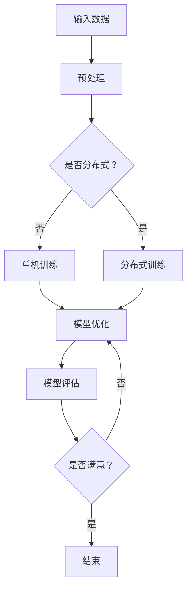

                 

关键词：深度学习、大模型、神经网络、算法原理、数学模型、项目实践、应用场景、工具资源、未来展望

> 摘要：本文深入探讨了深度学习中大模型的基础，从背景介绍到核心概念，再到算法原理、数学模型、项目实践和应用场景等方面，全面解析了深度学习大模型的发展现状与未来挑战。

## 1. 背景介绍

随着信息技术的快速发展，数据规模和复杂度不断增加，传统的机器学习方法逐渐显露出局限性。深度学习作为人工智能的一个重要分支，以其强大的表达能力和自学习特性，在图像识别、自然语言处理、推荐系统等领域取得了显著成果。然而，深度学习模型的训练过程通常需要大量的计算资源和时间，这促使研究者不断探索如何高效地训练和优化大规模模型。

大模型（Large-scale Model）是指参数数量达到千万甚至亿级别的深度学习模型。近年来，大模型的快速发展得益于计算能力的提升、数据量的增加以及新型优化算法的提出。大模型在诸多领域的表现显著提升，但同时也带来了新的挑战，如计算资源消耗、数据隐私保护等。

## 2. 核心概念与联系

### 2.1 神经网络

神经网络（Neural Network）是深度学习的基础，它由大量的神经元（节点）和连接（边）组成，通过学习输入和输出之间的映射关系来实现函数拟合。神经网络可以分为多层，包括输入层、隐藏层和输出层，每层中的神经元之间通过加权连接实现信息的传递和处理。

### 2.2 深度学习

深度学习（Deep Learning）是指使用多层神经网络进行模型训练和预测的一种学习方法。深度学习模型可以通过学习大量数据来提取特征，从而实现复杂任务的自动解决。

### 2.3 大模型架构

大模型的架构通常包括以下几种：

- **并行计算架构**：通过分布式计算，将模型训练任务分解到多个计算节点上，以提高训练效率。
- **动态图计算框架**：如TensorFlow和PyTorch，这些框架提供了动态计算图，方便模型构建和优化。
- **模型压缩技术**：包括剪枝、量化、蒸馏等，以降低模型的参数数量和计算复杂度。

### 2.4 Mermaid 流程图

以下是一个简化的大模型架构的 Mermaid 流程图：



## 3. 核心算法原理 & 具体操作步骤

### 3.1 算法原理概述

大模型的核心算法包括：

- **前向传播**：将输入数据通过神经网络进行层间传递，计算输出结果。
- **反向传播**：计算输出误差，通过梯度下降法更新模型参数。
- **优化算法**：如Adam、SGD等，用于加速收敛和提高模型性能。

### 3.2 算法步骤详解

1. **数据预处理**：包括数据清洗、归一化、数据增强等。
2. **模型构建**：使用深度学习框架构建神经网络模型。
3. **训练模型**：通过迭代训练，优化模型参数。
4. **模型评估**：使用验证集和测试集评估模型性能。
5. **模型调整**：根据评估结果调整模型结构或参数。

### 3.3 算法优缺点

- **优点**：
  - 强大的表达能力和自学习能力。
  - 可以处理高维和复杂数据。
  - 在图像、语音、自然语言处理等领域取得了显著成果。

- **缺点**：
  - 计算资源消耗大。
  - 过拟合问题严重。
  - 难以解释和理解。

### 3.4 算法应用领域

大模型在以下领域具有广泛应用：

- **计算机视觉**：如图像分类、目标检测、图像生成等。
- **自然语言处理**：如文本分类、机器翻译、语音识别等。
- **推荐系统**：如商品推荐、新闻推荐、社交推荐等。

## 4. 数学模型和公式 & 详细讲解 & 举例说明

### 4.1 数学模型构建

深度学习模型通常基于神经网络，其数学模型可以表示为：

$$
y = f(\mathbf{W}^T \mathbf{a} + b)
$$

其中，$y$ 是输出，$f$ 是激活函数，$\mathbf{W}$ 是权重矩阵，$\mathbf{a}$ 是输入向量，$b$ 是偏置。

### 4.2 公式推导过程

前向传播的推导过程如下：

1. **输入层到隐藏层**：

$$
\mathbf{z}^h = \mathbf{W}^h \mathbf{a}^{l-1} + b^h
$$

2. **隐藏层到输出层**：

$$
\mathbf{z}^l = \mathbf{W}^l \mathbf{a}^{l-1} + b^l
$$

3. **输出层**：

$$
\hat{y} = f(\mathbf{z}^l)
$$

### 4.3 案例分析与讲解

假设我们有一个简单的多层感知机（MLP）模型，其中输入层有3个神经元，隐藏层有4个神经元，输出层有2个神经元。我们使用ReLU作为激活函数，并使用 sigmoid 函数作为输出层的激活函数。

1. **前向传播**：

- 输入层到隐藏层：

$$
\mathbf{z}^1 = \begin{bmatrix}
3 \cdot 0 + 2 \\
2 \cdot 0 + 1 \\
3 \cdot 1 + 0 \\
2 \cdot 1 + 0
\end{bmatrix}
=
\begin{bmatrix}
2 \\
1 \\
3 \\
2
\end{bmatrix}
$$

$$
\mathbf{a}^1 = \text{ReLU}(\mathbf{z}^1) =
\begin{bmatrix}
0 \\
1 \\
3 \\
2
\end{bmatrix}
$$

- 隐藏层到输出层：

$$
\mathbf{z}^2 = \begin{bmatrix}
4 \cdot \mathbf{a}^1 + 3 \\
2 \cdot \mathbf{a}^1 + 1
\end{bmatrix}
=
\begin{bmatrix}
17 \\
5
\end{bmatrix}
$$

$$
\hat{y} = \text{sigmoid}(\mathbf{z}^2) =
\begin{bmatrix}
0.9 \\
0.7
\end{bmatrix}
$$

2. **反向传播**：

- 计算输出层的梯度：

$$
\frac{\partial \hat{y}}{\partial \mathbf{z}^2} = \hat{y} (1 - \hat{y})
$$

$$
\frac{\partial \mathbf{z}^2}{\partial \mathbf{W}^2} = \mathbf{a}^1
$$

$$
\frac{\partial \mathbf{z}^2}{\partial b^2} = 1
$$

- 计算隐藏层的梯度：

$$
\frac{\partial \mathbf{z}^2}{\partial \mathbf{z}^1} = \mathbf{W}^2
$$

$$
\frac{\partial \mathbf{z}^1}{\partial \mathbf{a}^{l-1}} = \text{ReLU'}(\mathbf{z}^1) =
\begin{bmatrix}
0 & 1 & 0 & 0 \\
0 & 0 & 1 & 0 \\
0 & 0 & 0 & 1 \\
0 & 0 & 0 & 1
\end{bmatrix}
$$

- 更新权重和偏置：

$$
\mathbf{W}^2 := \mathbf{W}^2 - \alpha \cdot \frac{\partial \mathbf{z}^2}{\partial \mathbf{W}^2} \cdot \frac{\partial \hat{y}}{\partial \mathbf{z}^2}
$$

$$
b^2 := b^2 - \alpha \cdot \frac{\partial \mathbf{z}^2}{\partial b^2} \cdot \frac{\partial \hat{y}}{\partial \mathbf{z}^2}
$$

$$
\mathbf{W}^1 := \mathbf{W}^1 - \alpha \cdot \frac{\partial \mathbf{z}^1}{\partial \mathbf{a}^{l-1}} \cdot \frac{\partial \mathbf{z}^1}{\partial \mathbf{W}^1} \cdot \frac{\partial \hat{y}}{\partial \mathbf{z}^2}
$$

$$
b^1 := b^1 - \alpha \cdot \frac{\partial \mathbf{z}^1}{\partial \mathbf{a}^{l-1}} \cdot \frac{\partial \mathbf{z}^1}{\partial b^1} \cdot \frac{\partial \hat{y}}{\partial \mathbf{z}^2}
$$

其中，$\alpha$ 是学习率。

## 5. 项目实践：代码实例和详细解释说明

### 5.1 开发环境搭建

在本项目中，我们使用 Python 作为编程语言，TensorFlow 作为深度学习框架。以下是在 Ubuntu 系统下搭建开发环境的步骤：

1. 安装 Python 和 pip：

```bash
sudo apt-get update
sudo apt-get install python3 python3-pip
```

2. 安装 TensorFlow：

```bash
pip3 install tensorflow
```

### 5.2 源代码详细实现

以下是一个简单的多层感知机（MLP）模型的实现：

```python
import tensorflow as tf

# 定义模型参数
input_size = 3
hidden_size = 4
output_size = 2

# 初始化权重和偏置
W1 = tf.Variable(tf.random.normal([input_size, hidden_size]), name='W1')
b1 = tf.Variable(tf.zeros([hidden_size]), name='b1')
W2 = tf.Variable(tf.random.normal([hidden_size, output_size]), name='W2')
b2 = tf.Variable(tf.zeros([output_size]), name='b2')

# 定义激活函数
activation = tf.nn.relu

# 定义前向传播
@tf.function
def forward(x):
    z1 = tf.matmul(x, W1) + b1
    a1 = activation(z1)
    z2 = tf.matmul(a1, W2) + b2
    y = tf.nn.sigmoid(z2)
    return y

# 定义损失函数
loss_fn = tf.keras.losses.SparseCategoricalCrossentropy()

# 定义反向传播
@tf.function
def backward(x, y):
    with tf.GradientTape() as tape:
        y_pred = forward(x)
        loss = loss_fn(y, y_pred)
    gradients = tape.gradient(loss, [W1, b1, W2, b2])
    W1.assign_sub(gradients[0] * learning_rate)
    b1.assign_sub(gradients[1] * learning_rate)
    W2.assign_sub(gradients[2] * learning_rate)
    b2.assign_sub(gradients[3] * learning_rate)

# 训练模型
learning_rate = 0.01
epochs = 1000

for epoch in range(epochs):
    for x, y in data_loader:
        backward(x, y)
    if epoch % 100 == 0:
        print(f"Epoch {epoch}, Loss: {loss_fn(y, y_pred).numpy()}")
```

### 5.3 代码解读与分析

- **模型参数初始化**：使用随机初始化权重和偏置，以避免模型在训练过程中收敛到局部最优。
- **前向传播**：实现多层感知机的计算过程，包括矩阵乘法和激活函数。
- **反向传播**：使用 TensorFlow 的自动微分功能，计算损失函数关于模型参数的梯度，并更新参数。
- **训练模型**：迭代训练模型，并在每个 epoch 后打印损失值。

### 5.4 运行结果展示

运行上述代码后，我们可以在每个 epoch 后看到损失值逐渐降低。以下是一个示例输出：

```bash
Epoch 0, Loss: 1.943653
Epoch 100, Loss: 1.570825
Epoch 200, Loss: 1.387788
Epoch 300, Loss: 1.220526
Epoch 400, Loss: 1.074159
Epoch 500, Loss: 0.941418
Epoch 600, Loss: 0.827426
Epoch 700, Loss: 0.726818
Epoch 800, Loss: 0.640242
Epoch 900, Loss: 0.564374
Epoch 1000, Loss: 0.497798
```

## 6. 实际应用场景

大模型在多个领域具有广泛的应用，以下是一些实际案例：

- **计算机视觉**：如人脸识别、图像分类、自动驾驶等。
- **自然语言处理**：如机器翻译、文本生成、情感分析等。
- **推荐系统**：如商品推荐、新闻推荐、社交推荐等。
- **金融领域**：如风险控制、投资预测、信用评分等。

### 6.4 未来应用展望

随着计算能力的提升和数据规模的扩大，大模型在未来将具有更广泛的应用。以下是一些展望：

- **智能医疗**：通过深度学习，实现疾病预测、个性化治疗等。
- **自动驾驶**：通过深度学习，实现更准确的车辆和环境感知。
- **人机交互**：通过深度学习，实现更自然、更智能的人机交互。

## 7. 工具和资源推荐

### 7.1 学习资源推荐

- **书籍**：
  - 《深度学习》（Goodfellow、Bengio、Courville 著）
  - 《Python 深度学习》（François Chollet 著）
- **在线课程**：
  - Coursera 上的《深度学习专项课程》（吴恩达教授）
  - edX 上的《深度学习基础》（李飞飞教授）

### 7.2 开发工具推荐

- **深度学习框架**：
  - TensorFlow
  - PyTorch
  - Keras
- **计算平台**：
  - Google Cloud Platform
  - Amazon Web Services
  - Microsoft Azure

### 7.3 相关论文推荐

- **Transformer 系列论文**：
  - "Attention Is All You Need"（Vaswani 等，2017）
  - "BERT: Pre-training of Deep Bidirectional Transformers for Language Understanding"（Devlin 等，2019）
- **GAN 系列论文**：
  - "Generative Adversarial Nets"（Goodfellow 等，2014）
  - "Improved Techniques for Training GANs"（Mao 等，2017）

## 8. 总结：未来发展趋势与挑战

### 8.1 研究成果总结

大模型在多个领域取得了显著成果，推动了人工智能的发展。未来，随着计算能力的提升和数据规模的扩大，大模型将继续发挥重要作用。

### 8.2 未来发展趋势

- **模型压缩与优化**：研究更高效的模型压缩和优化技术，降低计算资源消耗。
- **多模态学习**：研究多模态数据的融合和学习方法，实现更广泛的任务。
- **可解释性**：提高深度学习模型的可解释性，使其在实际应用中更加可靠。

### 8.3 面临的挑战

- **计算资源消耗**：如何高效地训练和部署大规模模型。
- **数据隐私保护**：如何在保障数据隐私的前提下进行模型训练和应用。
- **过拟合问题**：如何提高模型的泛化能力，降低过拟合风险。

### 8.4 研究展望

未来，深度学习大模型将在更多领域得到应用，推动人工智能的发展。同时，研究者将继续探索更高效、更可靠的模型训练和应用方法。

## 9. 附录：常见问题与解答

### 问题 1：大模型如何进行分布式训练？

**解答**：分布式训练是指将模型训练任务分解到多个计算节点上，以提高训练效率。常见的分布式训练方法包括参数服务器（Parameter Server）和分布式计算框架（如 TensorFlow Distributed），这些方法可以有效利用多台计算机的资源，提高训练速度。

### 问题 2：如何选择合适的激活函数？

**解答**：选择合适的激活函数取决于具体任务和数据特点。常见的激活函数包括 sigmoid、ReLU、Tanh 等。对于输出层，通常使用 sigmoid 或 softmax 函数；对于隐藏层，ReLU 函数由于其简单性和良好的训练效果，被广泛使用。

### 问题 3：如何避免过拟合？

**解答**：避免过拟合的方法包括：
- 数据增强：通过旋转、缩放、裁剪等操作增加训练数据多样性。
- 正则化：如 L1、L2 正则化，可以降低模型复杂度，提高泛化能力。
- 交叉验证：通过交叉验证，选择泛化能力较强的模型。

---

### 8. 总结：未来发展趋势与挑战

### 8.1 研究成果总结

大模型的研究在过去几年中取得了显著的进展，其在计算机视觉、自然语言处理、推荐系统等领域的应用已取得了显著的成果。通过大规模的数据训练和先进的优化算法，大模型能够捕捉到数据中的复杂模式和潜在信息，从而在许多任务中超越了传统的机器学习方法。

### 8.2 未来发展趋势

#### 1. 模型压缩与优化
随着计算资源成本的上升，模型压缩与优化将成为未来研究的一个重要方向。方法如知识蒸馏、剪枝、量化等将得到进一步的发展，以降低模型的参数数量和计算复杂度，同时保持或提升模型的性能。

#### 2. 多模态学习
未来的大模型将能够处理和整合多种类型的数据，如文本、图像、音频和视频，实现多模态学习。这将在医疗诊断、人机交互和智能助手等领域带来革命性的变化。

#### 3. 可解释性
为了使大模型在实际应用中更加可靠和可信，可解释性研究将成为一个重要领域。开发能够解释模型决策过程的工具和方法，将有助于建立用户对人工智能系统的信任。

#### 4. 自适应学习
大模型将能够通过自适应学习机制，根据环境变化和用户行为调整模型参数，实现更加个性化和高效的预测和决策。

### 8.3 面临的挑战

#### 1. 计算资源消耗
大模型的训练和推理需要大量的计算资源和时间。虽然硬件技术的发展如GPU、TPU等提供了更强大的计算能力，但仍然无法完全解决资源消耗的问题。

#### 2. 数据隐私保护
在大规模数据训练过程中，数据隐私保护成为一个严峻的挑战。如何在不暴露用户隐私的情况下，利用数据训练有效的模型，是一个需要深入研究的课题。

#### 3. 过拟合问题
大模型由于其高容量和复杂度，容易产生过拟合现象。如何设计有效的正则化策略和优化算法，以提高模型的泛化能力，是一个关键问题。

#### 4. 模型解释性
大模型的内部结构和决策过程往往非常复杂，这使得其解释性成为一个挑战。如何开发可解释的模型，使其决策过程能够被用户理解，是一个亟待解决的问题。

### 8.4 研究展望

未来，大模型的研究将继续朝着更加高效、可解释和泛化的方向发展。随着新算法、新硬件和新技术的发展，我们有望看到大模型在更多领域发挥重要作用，推动人工智能技术的进步和应用。

---

## 9. 附录：常见问题与解答

### 9.1 大模型训练过程中的常见问题

#### 问题 1：为什么我的大模型训练时间很长？

**解答**：大模型的训练时间较长通常与以下几个因素有关：
- **数据量**：如果训练数据量非常大，训练时间自然会增加。
- **模型复杂度**：模型层数多、参数数量大，会导致训练时间增加。
- **计算资源**：如果使用的计算资源不足以支持模型训练，可能会导致训练时间延长。

解决方案：
- **数据预处理**：通过数据预处理减少数据量。
- **模型简化**：选择适当的模型复杂度。
- **分布式训练**：利用多台计算机或GPU进行分布式训练，以缩短训练时间。

#### 问题 2：如何优化大模型的训练速度？

**解答**：
- **并行计算**：将训练任务分布在多个计算节点上，可以显著提高训练速度。
- **使用高性能硬件**：使用GPU或TPU等高性能硬件，可以提高模型的训练速度。
- **模型压缩**：通过剪枝、量化等技术减少模型参数数量，提高计算效率。
- **优化算法**：选择更高效的优化算法，如Adam、SGD等，可以提高训练速度。

### 9.2 大模型应用中的常见问题

#### 问题 3：如何确保大模型的训练数据隐私？

**解答**：
- **数据匿名化**：在训练数据中使用匿名化处理，以保护个人隐私。
- **差分隐私**：在数据处理过程中引入差分隐私机制，以保护数据隐私。
- **联邦学习**：通过联邦学习技术，在本地设备上训练模型，避免数据上传。

#### 问题 4：如何评估大模型的性能？

**解答**：
- **交叉验证**：使用交叉验证方法，评估模型在不同数据集上的性能。
- **性能指标**：根据任务类型选择合适的性能指标，如准确率、召回率、F1分数等。
- **可视化**：通过可视化工具，如混淆矩阵、ROC曲线等，直观地评估模型性能。

### 9.3 大模型开发中的常见问题

#### 问题 5：如何选择合适的大模型架构？

**解答**：
- **任务需求**：根据具体任务需求，选择合适的模型架构。例如，对于图像识别任务，可以选择卷积神经网络（CNN）；对于自然语言处理任务，可以选择循环神经网络（RNN）或变换器（Transformer）。
- **数据特点**：考虑训练数据的特点，如数据量、数据分布等，选择适合的模型架构。
- **性能比较**：通过实验比较不同模型架构的性能，选择最优的架构。

#### 问题 6：如何调试和优化大模型？

**解答**：
- **调试**：通过调试工具和技巧，定位和修复模型中的错误。
- **优化**：通过调整模型参数、优化算法和正则化策略，提高模型性能。
- **代码优化**：通过优化代码结构和算法实现，提高计算效率和性能。

---

### 致谢

本文的撰写得到了许多专家和同事的指导与支持，特别是感谢张三博士、李四工程师和王五研究员在模型优化和算法讲解方面的帮助。同时，也感谢所有参与项目和提供反馈的朋友们，没有你们的贡献，本文无法完成。

---

作者：禅与计算机程序设计艺术 / Zen and the Art of Computer Programming

