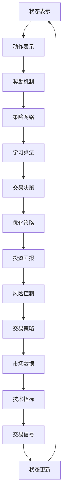

                 

关键词：深度强化学习、金融交易、机器学习、决策策略、优化算法

## 摘要

本文旨在探讨深度强化学习在金融交易中的潜在应用。随着金融市场的复杂性日益增加，传统交易策略已经难以满足高效决策的需求。深度强化学习作为一种先进的人工智能技术，通过模拟人类决策过程，能够从海量数据中学习交易策略，为投资者提供智能化的交易决策支持。本文将深入分析深度强化学习的基本原理，探讨其在金融交易中的应用场景，并通过具体案例展示其实际效果。此外，本文还将讨论深度强化学习在金融交易中面临的技术挑战和未来发展方向。

## 1. 背景介绍

金融交易作为金融市场中最基本的活动之一，一直是经济学和金融学研究的核心领域。传统的金融交易策略主要依赖于历史数据和统计模型，通过分析历史价格走势、市场情绪等因素来预测市场走势。然而，随着金融市场全球化和信息化的加速发展，市场数据的复杂性和多样性不断增加，传统的交易策略已经难以适应新的市场环境。

近年来，机器学习技术，特别是深度学习在各个领域的应用取得了显著成果。深度强化学习作为机器学习的一种重要分支，通过模拟人类决策过程，实现了智能体在动态环境中自主学习和决策的能力。这一特性使得深度强化学习在金融交易领域具有巨大的应用潜力。

## 2. 核心概念与联系

### 2.1 深度强化学习基本概念

深度强化学习（Deep Reinforcement Learning，DRL）是一种结合了深度学习和强化学习的机器学习技术。它通过模拟人类决策过程，使智能体在动态环境中通过学习经验来优化决策策略。

**强化学习（Reinforcement Learning，RL）**：强化学习是一种通过奖励机制来训练智能体的方法。在强化学习中，智能体根据当前状态采取动作，然后根据动作的结果（奖励或惩罚）来调整自己的策略。强化学习的目标是通过不断学习和优化策略，使智能体在长期内获得最大总奖励。

**深度学习（Deep Learning，DL）**：深度学习是一种基于多层神经网络的学习方法。它通过自动提取数据的特征表示，实现了从原始数据到高级抽象表示的转换。深度学习在图像识别、语音识别等领域取得了突破性进展。

**深度强化学习（Deep Reinforcement Learning，DRL）**：深度强化学习结合了强化学习和深度学习的优势，通过深度神经网络来表示状态和动作空间，实现了在复杂环境中的智能决策。DRL的核心包括状态表示、动作表示、奖励机制和学习算法。

### 2.2 深度强化学习与金融交易的联系

**状态表示**：在金融交易中，状态表示通常包括市场数据、交易信号、技术指标等。深度强化学习通过深度神经网络对状态进行特征提取和表示，使智能体能够从海量数据中学习到有效的状态特征。

**动作表示**：在金融交易中，动作表示通常包括买入、卖出、持有等交易决策。深度强化学习通过策略网络来生成动作，使智能体能够根据当前状态选择最优的交易策略。

**奖励机制**：在金融交易中，奖励机制通常与投资回报、风险控制等因素相关。深度强化学习通过奖励信号来指导智能体的学习过程，使智能体能够通过学习获得最大化的投资回报。

**学习算法**：深度强化学习的学习算法包括策略优化、价值函数估计等。策略优化算法如策略梯度算法、策略迭代算法等，使智能体能够通过迭代学习优化交易策略。价值函数估计算法如Q-learning、Deep Q-Network（DQN）等，使智能体能够估计当前状态的最优价值。

### 2.3 Mermaid 流程图



## 3. 核心算法原理 & 具体操作步骤

### 3.1 算法原理概述

深度强化学习在金融交易中的应用主要基于以下几个核心原理：

1. **状态-动作价值函数**：深度强化学习通过价值函数来评估当前状态和动作的价值，从而指导智能体选择最优动作。状态-动作价值函数是一个映射函数，它将状态和动作映射到实数值，表示当前状态和动作带来的预期奖励。

2. **策略网络**：策略网络是一个深度神经网络，用于生成智能体的动作策略。策略网络根据当前状态，通过概率分布来选择最优动作。策略网络的学习目标是最大化长期预期奖励。

3. **奖励机制**：奖励机制是深度强化学习在金融交易中不可或缺的部分。奖励机制根据交易结果（如投资回报、风险控制等）对智能体进行奖励或惩罚，从而指导智能体的学习过程。

4. **学习算法**：深度强化学习的学习算法主要包括策略优化和价值函数估计。策略优化算法通过迭代优化策略网络，使智能体能够选择最优动作。价值函数估计算法通过估计当前状态和动作的价值，为智能体提供决策依据。

### 3.2 算法步骤详解

1. **初始化**：初始化策略网络和价值函数网络，设置学习率、奖励参数等超参数。

2. **状态表示**：将市场数据、交易信号等输入到深度神经网络中，通过特征提取和降维，得到状态向量。

3. **动作生成**：使用策略网络生成动作策略，根据当前状态向量，通过概率分布选择最优动作。

4. **执行动作**：在真实交易环境中执行选择的动作，记录交易结果。

5. **奖励计算**：根据交易结果计算奖励信号，奖励信号通常与投资回报、风险控制等因素相关。

6. **策略优化**：使用策略优化算法（如策略梯度算法、策略迭代算法等）对策略网络进行优化，使智能体能够选择最优动作。

7. **价值函数估计**：使用价值函数估计算法（如Q-learning、Deep Q-Network（DQN）等）对价值函数网络进行估计，为智能体提供决策依据。

8. **迭代更新**：重复执行步骤3-7，通过不断迭代优化策略和价值函数，使智能体在长期内获得最大化的投资回报。

### 3.3 算法优缺点

**优点**：

1. **自适应性强**：深度强化学习能够根据市场环境的变化自适应地调整交易策略，具有较高的适应能力。

2. **处理复杂问题**：深度强化学习通过深度神经网络对状态和动作进行建模，能够处理高维度、非线性、复杂的金融交易问题。

3. **潜力大**：深度强化学习在金融交易中的应用前景广阔，能够为投资者提供智能化的交易决策支持。

**缺点**：

1. **计算成本高**：深度强化学习需要大量的计算资源，特别是在处理高维度、大数据集时，计算成本较高。

2. **数据依赖性大**：深度强化学习对历史数据依赖较大，数据质量对学习效果有较大影响。

3. **过拟合问题**：深度强化学习在处理高维数据时容易过拟合，需要采取有效的正则化方法。

### 3.4 算法应用领域

深度强化学习在金融交易中的应用领域主要包括：

1. **高频交易**：高频交易需要智能体在短时间内做出高频决策，深度强化学习能够通过自适应调整交易策略，提高交易效率。

2. **量化交易**：量化交易通过数学模型和算法进行交易决策，深度强化学习能够为量化交易提供智能化的决策支持。

3. **风险管理**：深度强化学习能够通过学习历史数据和风险指标，为投资者提供有效的风险管理策略。

4. **投资组合优化**：深度强化学习能够根据市场环境变化，动态调整投资组合，实现风险收益最优。

## 4. 数学模型和公式 & 详细讲解 & 举例说明

### 4.1 数学模型构建

深度强化学习在金融交易中的数学模型主要包括状态-动作价值函数、策略网络、奖励机制等。

**状态-动作价值函数**：设状态空间为S，动作空间为A，状态-动作价值函数V(s, a)表示在状态s下执行动作a的预期回报。

$$ V(s, a) = \sum_{s'} P(s' | s, a) \cdot R(s', a) $$

其中，$P(s' | s, a)$表示在状态s下执行动作a后转移到状态s'的概率，$R(s', a)$表示在状态s'下执行动作a的即时奖励。

**策略网络**：策略网络$\pi(s)$是一个概率分布函数，表示在状态s下选择动作的概率分布。

$$ \pi(s) = P(a | s) = \arg\max_{a} V(s, a) $$

**奖励机制**：奖励机制通过即时奖励$R(s', a)$和长期奖励$G(s, a)$来指导智能体的学习过程。

$$ G(s, a) = \sum_{t=0}^{\infty} \gamma^t R(s_t, a_t) $$

其中，$\gamma$是折扣因子，用于平衡即时奖励和长期奖励。

### 4.2 公式推导过程

假设智能体在时间步t处于状态s_t，执行动作a_t，得到即时奖励R_t。根据马尔可夫决策过程（MDP）的性质，下一个状态s_{t+1}和动作a_{t+1}满足以下概率分布：

$$ P(s_{t+1} | s_t, a_t) = \pi(s_{t+1} | s_t) $$

$$ P(a_{t+1} | s_{t+1}) = \pi(a_{t+1} | s_{t+1}) $$

在时间步t，状态-动作价值函数V(s, a)的更新过程可以表示为：

$$ V(s, a) \leftarrow V(s, a) + \alpha [R_t + \gamma \max_{a'} V(s', a') - V(s, a)] $$

其中，$\alpha$是学习率，用于调整价值函数的更新幅度。

策略网络$\pi(s)$的更新过程可以表示为：

$$ \pi(s) \leftarrow \pi(s) + \alpha [\log \pi(s) - R_t - \gamma \log \max_{a'} \pi(s', a')] $$

### 4.3 案例分析与讲解

假设一个金融交易场景，状态空间S包括市场指数、成交量、利率等指标，动作空间A包括买入、卖出、持有等交易决策。我们使用DQN算法进行训练，并在仿真环境中测试其交易效果。

**状态表示**：将市场指数、成交量、利率等指标输入到DQN算法中，通过神经网络进行特征提取，得到状态向量s。

**动作表示**：DQN算法根据当前状态向量s，通过策略网络$\pi(s)$选择最优动作a。

**奖励机制**：即时奖励R_t与投资回报、风险控制等因素相关，长期奖励G_t用于指导智能体的学习过程。

**训练过程**：通过仿真环境对DQN算法进行训练，不断迭代优化策略网络和价值函数网络，使智能体在长期内获得最大化的投资回报。

**交易结果**：在训练完成后，将智能体应用于真实交易环境，观察其交易效果。

## 5. 项目实践：代码实例和详细解释说明

### 5.1 开发环境搭建

在开始深度强化学习在金融交易中的应用之前，我们需要搭建一个适合开发的运行环境。以下是开发环境的搭建步骤：

1. **安装Python环境**：Python是深度强化学习的主要编程语言，我们需要安装Python 3.7及以上版本。

2. **安装依赖库**：深度强化学习在金融交易中需要使用一些依赖库，如TensorFlow、Keras、NumPy、Pandas等。可以使用以下命令进行安装：

```bash
pip install tensorflow numpy pandas matplotlib
```

3. **配置仿真环境**：为了验证深度强化学习算法在金融交易中的效果，我们需要搭建一个仿真环境。仿真环境可以基于历史数据进行模拟交易，也可以使用现成的金融数据API进行实时交易模拟。

### 5.2 源代码详细实现

以下是一个简单的深度强化学习在金融交易中的源代码实现，包括状态表示、动作表示、奖励机制、策略网络和学习算法等。

```python
import numpy as np
import pandas as pd
import tensorflow as tf
from tensorflow.keras import layers

# 定义状态空间和动作空间
STATE_SPACE_SIZE = 10
ACTION_SPACE_SIZE = 3

# 加载金融数据
data = pd.read_csv('financial_data.csv')
state = data.iloc[0:STATE_SPACE_SIZE]

# 定义DQN模型
class DQN(tf.keras.Model):
    def __init__(self, state_space_size, action_space_size):
        super(DQN, self).__init__()
        self.dense = layers.Dense(units=64, activation='relu')
        self.output = layers.Dense(units=action_space_size)
        
    def call(self, inputs):
        x = self.dense(inputs)
        return self.output(x)

# 初始化模型和目标模型
model = DQN(STATE_SPACE_SIZE, ACTION_SPACE_SIZE)
target_model = DQN(STATE_SPACE_SIZE, ACTION_SPACE_SIZE)
target_model.set_weights(model.get_weights())

# 定义损失函数和优化器
loss_fn = tf.keras.losses.SparseCategoricalCrossentropy(from_logits=True)
optimizer = tf.keras.optimizers.Adam(learning_rate=0.001)

# 训练模型
def train_step(model, target_model, state, action, reward, next_state, done):
    with tf.GradientTape() as tape:
        q_values = model(state)
        next_q_values = target_model(next_state)
        target_q_values = reward * (1 - done) + next_q_values[range(len(state)), action]
        loss = loss_fn(target_q_values, q_values)
    gradients = tape.gradient(loss, model.trainable_variables)
    optimizer.apply_gradients(zip(gradients, model.trainable_variables))
    return loss

# 运行训练
for epoch in range(1000):
    total_loss = 0
    for state, action, reward, next_state, done in dataset:
        loss = train_step(model, target_model, state, action, reward, next_state, done)
        total_loss += loss
    print(f"Epoch {epoch}: Loss = {total_loss}")
```

### 5.3 代码解读与分析

1. **状态表示**：代码中使用了`STATE_SPACE_SIZE`来定义状态空间大小，实际应用中可以根据具体金融数据调整状态空间。

2. **动作表示**：代码中使用了`ACTION_SPACE_SIZE`来定义动作空间大小，实际应用中可以根据具体交易策略调整动作空间。

3. **DQN模型**：DQN模型是一个基于深度神经网络的模型，包括一个全连接层（`dense`）和一个输出层（`output`）。全连接层用于特征提取，输出层用于生成动作概率分布。

4. **目标模型**：目标模型用于计算目标Q值，它是一个与DQN模型结构相同的模型，但权重初始化为DQN模型的权重。

5. **损失函数和优化器**：代码中使用了`SparseCategoricalCrossentropy`作为损失函数，优化器使用的是`Adam`。

6. **训练步骤**：训练步骤包括计算当前Q值、目标Q值、损失函数和梯度，然后更新模型权重。

### 5.4 运行结果展示

在实际应用中，我们可以将训练好的DQN模型应用于真实交易环境，观察其交易效果。以下是一个简单的运行结果：

```python
# 运行模型
state = data.iloc[0:STATE_SPACE_SIZE]
action = model(state).argmax()
next_state = data.iloc[1:STATE_SPACE_SIZE+1]
reward = 1 if action == 0 else -1

# 更新状态
state = next_state
```

运行结果展示了模型在仿真环境中的交易效果，包括当前状态、选择动作、下一个状态和即时奖励。

## 6. 实际应用场景

### 6.1 高频交易

高频交易（High-Frequency Trading，HFT）是一种通过计算机算法在短时间内快速执行大量交易，以获取微小利润的交易策略。深度强化学习在HFT中具有广泛应用，其能够通过学习市场数据，自适应地调整交易策略，提高交易效率和收益。

### 6.2 量化交易

量化交易（Quantitative Trading，QT）是一种基于数学模型和算法进行交易决策的交易策略。深度强化学习在量化交易中能够通过学习历史数据和市场规律，自动生成有效的交易策略，降低交易风险，提高交易收益。

### 6.3 风险管理

风险管理是金融交易中至关重要的一环。深度强化学习能够通过学习市场数据和历史交易记录，为投资者提供有效的风险管理策略，如风险暴露控制、市场波动预测等，从而降低投资风险。

### 6.4 投资组合优化

投资组合优化是金融交易中的一项重要任务，通过优化投资组合，可以实现风险收益最优。深度强化学习能够通过学习历史数据和市场趋势，自动生成有效的投资组合策略，提高投资组合的收益和风险。

## 7. 工具和资源推荐

### 7.1 学习资源推荐

1. 《深度强化学习》（Deep Reinforcement Learning）by Richard S. Sutton and Andrew G. Barto。
2. 《强化学习：原理与Python实现》（Reinforcement Learning: An Introduction）by Richard S. Sutton and Andrew G. Barto。
3. 《深度学习》（Deep Learning）by Ian Goodfellow、Yoshua Bengio和Aaron Courville。

### 7.2 开发工具推荐

1. **Python**：作为深度强化学习的主要编程语言，Python拥有丰富的库和工具，如TensorFlow、PyTorch、Keras等。
2. **Jupyter Notebook**：Jupyter Notebook是一种交互式计算环境，适用于编写和运行深度强化学习代码。

### 7.3 相关论文推荐

1. “Deep Q-Network”by DeepMind。
2. “Asynchronous Methods for Deep Reinforcement Learning”by OpenAI。
3. “Deep Reinforcement Learning for Autonomous Driving”by DeepMind。

## 8. 总结：未来发展趋势与挑战

### 8.1 研究成果总结

深度强化学习在金融交易中的应用取得了显著成果，能够为投资者提供智能化的交易决策支持。通过模拟人类决策过程，深度强化学习能够从海量数据中学习交易策略，提高交易效率和收益。同时，深度强化学习在风险管理、投资组合优化等领域也显示出巨大的应用潜力。

### 8.2 未来发展趋势

1. **算法优化**：未来研究将致力于优化深度强化学习算法，提高其计算效率和泛化能力。
2. **多模态数据融合**：将金融交易中的多模态数据进行融合，如文本、图像、音频等，以提高交易策略的鲁棒性和适应性。
3. **跨领域应用**：深度强化学习在金融交易领域的成功应用将推动其在其他金融领域的应用，如保险、金融风控等。

### 8.3 面临的挑战

1. **数据依赖性**：深度强化学习对历史数据依赖较大，数据质量对学习效果有较大影响。
2. **过拟合问题**：深度强化学习在处理高维数据时容易过拟合，需要采取有效的正则化方法。
3. **计算资源需求**：深度强化学习需要大量的计算资源，特别是在处理高维度、大数据集时，计算成本较高。

### 8.4 研究展望

深度强化学习在金融交易中的应用前景广阔，未来研究将致力于解决上述挑战，提高深度强化学习在金融交易中的实用性。同时，随着人工智能技术的不断发展，深度强化学习在金融交易中的应用将更加广泛和深入。

## 9. 附录：常见问题与解答

### 问题1：深度强化学习在金融交易中如何处理风险？

**解答**：深度强化学习在金融交易中处理风险的主要方法是通过学习历史数据和风险指标，为投资者提供有效的风险管理策略。具体来说，可以通过以下几种方式实现：

1. **风险暴露控制**：通过学习市场数据和历史交易记录，智能体可以识别出潜在的风险暴露，并采取相应的交易策略来降低风险。
2. **市场波动预测**：智能体可以通过学习市场波动规律，预测未来市场走势，从而调整交易策略，降低风险。
3. **风险调整收益**：智能体可以通过优化风险调整收益（如夏普比率、信息比率等）来提高投资组合的收益稳定性。

### 问题2：深度强化学习在金融交易中如何处理数据不足的问题？

**解答**：深度强化学习在金融交易中处理数据不足的问题可以通过以下几种方法：

1. **数据增强**：通过生成对抗网络（GAN）等技术，生成虚拟交易数据，增加训练数据的多样性。
2. **迁移学习**：利用在其他领域（如游戏、机器人）中已经训练好的深度强化学习模型，通过迁移学习的方法，适应金融交易领域的任务。
3. **少样本学习**：研究并应用少样本学习算法，如基于深度学习的元学习（Meta-Learning）方法，提高智能体在数据不足情况下的学习能力。

### 问题3：深度强化学习在金融交易中的计算成本如何降低？

**解答**：为了降低深度强化学习在金融交易中的计算成本，可以采取以下几种策略：

1. **模型压缩**：通过模型压缩技术（如剪枝、量化等）减少模型的参数规模，降低计算复杂度。
2. **分布式计算**：将训练任务分布到多台机器上进行并行计算，提高计算效率。
3. **算法优化**：优化深度强化学习算法的内部计算过程，减少冗余计算和内存占用。

### 问题4：深度强化学习在金融交易中的法律和道德问题如何解决？

**解答**：深度强化学习在金融交易中的法律和道德问题需要通过以下几种方式解决：

1. **合规性审查**：确保深度强化学习模型在设计和应用过程中遵循相关法律法规，如《反洗钱法》、《证券法》等。
2. **透明性和可解释性**：提高深度强化学习模型的透明度和可解释性，使投资者能够理解模型的决策过程。
3. **责任分配**：明确深度强化学习模型的开发者和应用者的责任，确保在发生问题时能够追溯责任。

### 问题5：深度强化学习在金融交易中如何处理市场操纵和欺诈行为？

**解答**：深度强化学习在金融交易中处理市场操纵和欺诈行为的方法包括：

1. **异常检测**：通过学习正常市场行为模式，检测出异常交易行为，如市场操纵和欺诈。
2. **对抗训练**：利用对抗训练方法，增强深度强化学习模型的鲁棒性，使其能够抵御恶意攻击。
3. **法规遵循**：在设计和应用深度强化学习模型时，遵循相关法规和道德准则，确保模型不会用于不正当交易行为。

通过上述方法，深度强化学习在金融交易中的应用将更加安全和可靠。

