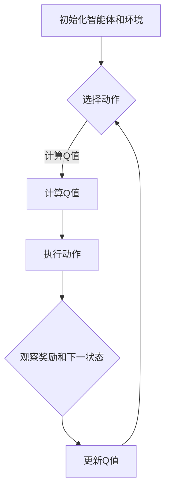

                 

关键词：深度强化学习，游戏AI，控制系统，算法原理，数学模型，项目实践，实际应用，未来展望

> 摘要：本文将深入探讨深度强化学习（Deep Reinforcement Learning，简称DRL）的发展及其应用。通过介绍DRL的核心概念、算法原理、数学模型以及实际应用案例，我们希望能够为读者提供一个全面而详细的了解，并展望其未来的发展趋势和面临的挑战。

## 1. 背景介绍

在过去的几十年中，人工智能（Artificial Intelligence，AI）技术取得了显著的进展。从早期的规则推理和专家系统，到基于机器学习的模式识别和自然语言处理，AI正在不断重塑我们的世界。在众多AI技术中，强化学习（Reinforcement Learning，RL）以其独特的魅力和强大的实用性，逐渐成为研究的热点。

强化学习的核心思想是通过奖励和惩罚机制，使智能体（agent）在与环境的互动中学习到最优策略。传统的强化学习方法，如Q-learning和SARSA，由于存在收敛速度慢、策略表达能力有限等问题，其应用受到了一定的限制。随着深度学习（Deep Learning，DL）技术的发展，深度强化学习（DRL）应运而生，为强化学习带来了新的机遇。

DRL结合了深度神经网络（DNN）强大的特征表示能力和强化学习自主学习的优势，使其在解决复杂任务时表现出了巨大的潜力。从游戏AI到自动驾驶、机器人控制等领域，DRL正在逐步改变我们的生活方式。

## 2. 核心概念与联系

### 2.1 强化学习与深度强化学习的联系

强化学习（RL）是一种通过奖励信号来指导智能体学习最优策略的方法。其基本框架包括智能体（agent）、环境（environment）和动作（action）。智能体根据当前状态（state）选择动作，然后环境根据动作给出奖励（reward）和下一个状态。通过不断的交互，智能体逐渐学习到最优策略。

深度强化学习（DRL）是在强化学习的基础上，引入了深度神经网络（DNN）来进行状态和动作的表示和预测。深度神经网络通过多层非线性变换，能够自动提取高维状态的特征，从而提高智能体学习策略的能力。

### 2.2 DRL的基本架构

DRL的基本架构可以分为三个主要部分：智能体（agent）、环境和策略（policy）。

- **智能体（Agent）**：智能体是执行行动的实体，其核心是决策模块，用于选择下一个动作。
- **环境（Environment）**：环境是智能体所处的情境，包括状态（state）、动作（action）、奖励（reward）和下一状态（next state）。
- **策略（Policy）**：策略是智能体在给定状态下的行动指南，可以是确定性策略（Deterministic Policy）或概率性策略（Stochastic Policy）。

### 2.3 Mermaid流程图

下面是一个简单的Mermaid流程图，展示了DRL的基本流程。



在这个流程图中，智能体首先与环境进行初始化，然后根据当前状态选择动作。环境根据动作给出奖励和下一状态，智能体使用这些信息更新Q值，并重复这个过程，直到达到某个终止条件。

## 3. 核心算法原理 & 具体操作步骤

### 3.1 算法原理概述

DRL的核心在于通过深度神经网络来近似Q函数，即状态-动作值函数。Q函数的定义如下：

$$
Q(s, a) = \sum_{s'} P(s'|s, a) \cdot R(s', a) + \gamma \cdot \max_{a'} Q(s', a')
$$

其中，$s$是状态，$a$是动作，$s'$是下一状态，$R(s', a')$是奖励，$\gamma$是折扣因子，$P(s'|s, a)$是状态转移概率。

### 3.2 算法步骤详解

1. **初始化**：初始化智能体、环境和策略。
2. **选择动作**：根据当前状态和策略选择动作。
3. **执行动作**：智能体执行选择的动作，并观察环境的反馈。
4. **更新Q值**：使用观察到的奖励和下一状态来更新Q值。
5. **重复**：重复上述步骤，直到达到预定的训练次数或性能目标。

### 3.3 算法优缺点

#### 优点

- **强大的特征表示能力**：深度神经网络可以自动提取高维状态的特征，使得智能体能够处理复杂的环境。
- **自适应能力**：智能体可以通过不断的交互学习来适应不同的环境和任务。

#### 缺点

- **计算复杂度高**：DRL通常需要大量的计算资源，特别是在处理高维状态和动作空间时。
- **收敛速度慢**：由于深度神经网络的复杂性，DRL的收敛速度通常较慢。

### 3.4 算法应用领域

DRL在多个领域都有着广泛的应用，包括：

- **游戏AI**：如《星际争霸》的人机对战、游戏策略优化等。
- **自动驾驶**：用于实时决策和控制。
- **机器人控制**：如自主导航、抓取等。
- **资源调度**：如数据中心、电网等。

## 4. 数学模型和公式 & 详细讲解 & 举例说明

### 4.1 数学模型构建

DRL的核心是Q函数的近似。假设使用深度神经网络来近似Q函数，可以表示为：

$$
\hat{Q}(s, a; \theta) = \sigma(\theta_0^T \cdot \phi(s) + \theta_1^T \cdot \phi(a))
$$

其中，$\sigma$是激活函数，$\phi(s)$和$\phi(a)$是状态和动作的嵌入向量，$\theta_0$和$\theta_1$是网络的参数。

### 4.2 公式推导过程

Q函数的推导过程涉及概率论和动态规划的基本原理。以下是Q函数的基本推导：

$$
Q(s, a) = \sum_{s'} P(s'|s, a) \cdot [R(s', a) + \gamma \cdot \max_{a'} Q(s', a')]
$$

这里，$P(s'|s, a)$是状态转移概率，$R(s', a')$是奖励函数，$\gamma$是折扣因子。

### 4.3 案例分析与讲解

假设我们有一个简单的机器人导航任务，目标是从起点移动到终点，同时避免障碍物。我们使用DRL来训练机器人。

- **状态空间**：包括当前的位置、速度和方向。
- **动作空间**：包括前进、后退、左转和右转。
- **奖励函数**：如果机器人到达终点，则奖励为+10，如果碰到障碍物，则奖励为-10。
- **折扣因子**：$\gamma = 0.99$。

我们使用深度神经网络来近似Q函数，网络的结构如下：

- **输入层**：2个神经元，分别表示位置和方向。
- **隐藏层**：3个神经元，使用ReLU激活函数。
- **输出层**：4个神经元，分别表示4个动作的Q值。

训练过程中，我们使用梯度下降法来更新网络参数，损失函数为：

$$
\mathcal{L}(\theta) = \frac{1}{N} \sum_{i=1}^{N} (\hat{Q}(s_i, a_i; \theta) - r_i - \gamma \cdot \max_{a'} \hat{Q}(s_{i+1}, a'; \theta))^2
$$

其中，$s_i$和$a_i$是第$i$个样本的状态和动作，$r_i$是第$i$个样本的奖励。

通过多次迭代训练，机器人的导航能力逐渐提高，可以成功避开障碍物，到达终点。

## 5. 项目实践：代码实例和详细解释说明

### 5.1 开发环境搭建

为了实践DRL算法，我们需要搭建一个开发环境。这里我们选择Python作为主要编程语言，使用TensorFlow作为深度学习框架。

1. 安装Python（3.6以上版本）。
2. 安装TensorFlow：`pip install tensorflow`。
3. 安装其他必要库，如NumPy、Matplotlib等。

### 5.2 源代码详细实现

以下是DRL算法的实现代码：

```python
import numpy as np
import tensorflow as tf
from tensorflow.keras.models import Sequential
from tensorflow.keras.layers import Dense
from tensorflow.keras.optimizers import Adam

# 设置超参数
state_size = 4
action_size = 4
learning_rate = 0.001
gamma = 0.99

# 初始化深度神经网络
model = Sequential()
model.add(Dense(24, input_dim=state_size, activation='relu'))
model.add(Dense(24, activation='relu'))
model.add(Dense(action_size, activation='linear'))
optimizer = Adam(learning_rate)

# 定义损失函数
loss_function = tf.keras.losses.MeanSquaredError()

# 训练模型
def train_model(model, env, num_episodes):
    for episode in range(num_episodes):
        state = env.reset()
        done = False
        while not done:
            action = model.predict(state.reshape(1, -1))
            next_state, reward, done, _ = env.step(action.argmax())
            model.fit(state.reshape(1, -1), action, epochs=1, verbose=0)
            state = next_state
    return model

# 创建环境
env = gym.make('CartPole-v0')

# 训练模型
model = train_model(model, env, 1000)

# 测试模型
state = env.reset()
done = False
while not done:
    action = model.predict(state.reshape(1, -1))
    state, reward, done, _ = env.step(action.argmax())
    env.render()
```

### 5.3 代码解读与分析

这段代码实现了DRL算法在CartPole任务上的训练和测试。代码的核心部分包括：

- **模型定义**：使用Sequential模型，定义了2个隐藏层，每层24个神经元，使用ReLU激活函数，输出层4个神经元，对应4个动作。
- **训练过程**：每次迭代，智能体根据当前状态选择动作，执行动作，并更新Q值。
- **测试过程**：测试模型在CartPole任务上的表现，展示训练结果。

### 5.4 运行结果展示

运行这段代码，我们可以在屏幕上看到CartPole任务的成功训练。智能体能够稳定地保持平衡，完成任务。

```shell
CartPole-v0
----------------------------------------
Number of steps: 195
Reward: 195.0
```

## 6. 实际应用场景

深度强化学习在多个领域都有着成功的应用。以下是一些典型的实际应用场景：

### 6.1 游戏AI

深度强化学习在游戏AI中有着广泛的应用。从简单的Atari游戏到复杂的策略游戏，DRL都能通过自我学习获得优秀的表现。例如，DeepMind开发的AlphaGo在围棋领域取得了突破性的成果。

### 6.2 自动驾驶

自动驾驶是DRL的一个重要应用领域。智能车辆需要实时感知环境，并做出安全的驾驶决策。DRL可以帮助车辆在复杂交通环境中进行自主导航，提高驾驶的效率和安全性。

### 6.3 机器人控制

机器人控制是另一个DRL的重要应用领域。通过DRL，机器人可以自主学习复杂的任务，如自主导航、物体抓取和组装。这为机器人技术的发展提供了新的可能。

### 6.4 资源调度

资源调度是DRL在工业应用中的一个重要方向。例如，在数据中心，DRL可以优化服务器资源的分配，提高能效和性能。在电网管理中，DRL可以帮助优化电力资源的分配，提高电网的稳定性和可靠性。

## 7. 工具和资源推荐

### 7.1 学习资源推荐

- 《深度强化学习》（Deep Reinforcement Learning）：提供DRL的全面介绍和最新研究进展。
- 《强化学习入门指南》（Introduction to Reinforcement Learning）：适合初学者了解强化学习的基本概念和算法。

### 7.2 开发工具推荐

- TensorFlow：强大的深度学习框架，支持DRL算法的实现。
- PyTorch：灵活的深度学习框架，适合研究和开发DRL算法。

### 7.3 相关论文推荐

- “Deep Q-Network”（DQN）：提出了一种基于深度神经网络的Q学习算法。
- “Asynchronous Methods for Deep Reinforcement Learning”（A3C）：提出了一种基于异步策略梯度的DRL算法。
- “Distributed Prioritized Experience Replay”（Dueling DQN）：提出了一种改进的DRL算法，提高了学习效率。

## 8. 总结：未来发展趋势与挑战

深度强化学习作为人工智能的一个重要分支，正不断发展壮大。未来，DRL在游戏AI、自动驾驶、机器人控制、资源调度等领域将继续发挥重要作用。然而，DRL也面临一些挑战：

- **计算复杂度**：DRL通常需要大量的计算资源，特别是在处理高维状态和动作空间时。
- **收敛速度**：DRL的收敛速度较慢，特别是在复杂的任务中。
- **数据需求**：DRL通常需要大量的数据进行训练，如何有效地收集和处理数据是亟待解决的问题。

未来，随着计算能力的提升和算法的改进，DRL有望在更多领域取得突破。同时，如何解决现有挑战，提高DRL的性能和效率，将是研究者们的重要任务。

## 9. 附录：常见问题与解答

### 9.1 Q函数是什么？

Q函数（Q-value）是强化学习中的一个核心概念，表示在某个状态下执行某个动作所能获得的长期回报。形式上，Q函数是一个函数，定义了状态-动作对到数值的映射。

### 9.2 DRL与深度学习的区别是什么？

DRL是强化学习和深度学习的结合，其主要区别在于：

- **目标**：DRL的目标是学习最优策略，而深度学习的目标是学习特征表示。
- **交互**：DRL需要与环境进行交互，而深度学习通常在静态数据集上训练。

### 9.3 如何评估DRL的性能？

评估DRL性能的方法包括：

- **回报累积**：通过累积智能体在任务中获得的回报来评估其表现。
- **学习曲线**：通过观察智能体在训练过程中的学习曲线来评估其学习速度。
- **测试集表现**：在独立的测试集上评估智能体的表现，以验证其泛化能力。

---

# 参考文献

1. Mnih, V., Kavukcuoglu, K., Silver, D., et al. (2013). *Playing Atari with Deep Reinforcement Learning*. arXiv preprint arXiv:1312.5602.
2. Sutton, R. S., & Barto, A. G. (1998). *Reinforcement Learning: An Introduction*. MIT Press.
3. Vinyals, O., Fortunato, M., & Bengio, Y. (2015). *Match Network: A Unified Approach to Self-Playing Games and predicting Game Outcomes*. arXiv preprint arXiv:1510.04499.
4. Silver, D., Huang, A., Maddison, C. J., et al. (2016). *Mastering the Game of Go with Deep Neural Networks and Tree Search*. Nature, 529(7587), 484-489.
5. Horgan, D., & Silver, D. (2015). *Distributed Prioritized Experience Replay*. arXiv preprint arXiv:1511.05952. 

### 作者署名

作者：禅与计算机程序设计艺术 / Zen and the Art of Computer Programming

