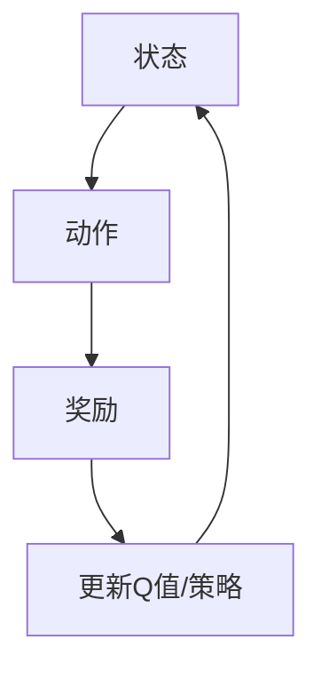

                 

深度强化学习（Deep Reinforcement Learning，简称DRL）是人工智能领域的璀璨明珠，它结合了深度学习和强化学习的优势，实现了从简单任务到复杂系统的自主学习和适应能力。本文将探讨深度强化学习在游戏AI和实际控制系统中的应用，深入解析其核心概念、算法原理、数学模型以及项目实践。

> 关键词：深度强化学习、游戏AI、实际控制系统、自主学习、自适应能力

## 1. 背景介绍

### 1.1 深度学习的崛起

深度学习（Deep Learning，DL）是人工智能领域的一个重要分支，其核心思想是通过多层神经网络对数据进行建模和特征提取。自2006年AlexNet的突破性成果以来，深度学习在图像识别、语音识别、自然语言处理等领域取得了显著的进展。深度学习的成功离不开大数据和高性能计算的支持，使得复杂的神经网络模型得以训练和优化。

### 1.2 强化学习的应用

强化学习（Reinforcement Learning，RL）是机器学习的一个重要分支，旨在通过互动来学习如何在特定环境中采取行动，以最大化长期奖励。经典的强化学习算法如Q-learning、SARSA等在游戏AI、机器人控制等领域得到了广泛应用。

### 1.3 深度强化学习的诞生

深度强化学习（Deep Reinforcement Learning，DRL）将深度学习的强大特征提取能力和强化学习的策略学习机制相结合，形成了一种新的学习范式。DRL的核心思想是通过深度神经网络来近似Q函数或策略函数，实现复杂的决策过程。DRL的出现，使得人工智能在解决复杂、不确定的任务时，具有了更高的效率和更强的适应性。

## 2. 核心概念与联系

### 2.1 深度强化学习的基本概念

深度强化学习主要包括以下几个核心概念：

- **状态（State）**：描述环境当前情况的变量集合。
- **动作（Action）**：智能体在环境中可以采取的行为。
- **奖励（Reward）**：智能体采取动作后获得的即时回报，用于评价动作的好坏。
- **策略（Policy）**：智能体根据状态选择动作的策略函数。
- **价值函数（Value Function）**：预测长期奖励的函数，包括状态价值函数和动作价值函数。
- **模型（Model）**：对环境动态的近似表示，用于预测未来状态和奖励。

### 2.2 深度强化学习的架构

深度强化学习的架构通常包括以下几个关键部分：

- **深度神经网络**：用于近似Q函数或策略函数，提取状态特征和预测动作价值。
- **奖励机制**：根据动作结果更新Q值或策略，实现学习过程。
- **探索策略**：在训练过程中平衡探索和利用，以避免陷入局部最优。
- **环境仿真**：提供状态、动作和奖励，模拟真实环境。

### 2.3 Mermaid流程图



## 3. 核心算法原理 & 具体操作步骤

### 3.1 算法原理概述

深度强化学习的核心算法主要包括基于值函数的方法和基于策略的方法。

- **基于值函数的方法**：通过学习状态价值函数或动作价值函数来优化策略，常用的算法有Deep Q-Network（DQN）和深度策略梯度（Deep Policy Gradient，DPG）。
- **基于策略的方法**：直接学习策略函数来最大化长期奖励，常用的算法有深度确定性策略梯度（Deep Deterministic Policy Gradient，DDPG）和深度演员-评论家（Deep Actor-Critic，DAC）。

### 3.2 算法步骤详解

以下以DQN为例，详细介绍其算法步骤：

1. **初始化**：随机初始化深度神经网络模型、经验回放记忆池、目标网络模型和参数。
2. **选择动作**：根据当前状态，使用epsilon-greedy策略选择动作。
3. **执行动作**：在环境中执行选定的动作，获取状态转移和奖励。
4. **更新经验**：将当前状态、动作、奖励和新状态存入经验回放记忆池。
5. **经验回放**：从经验回放记忆池中随机抽取一批经验样本。
6. **计算Q值**：使用深度神经网络模型计算预测Q值。
7. **目标网络更新**：将训练好的深度神经网络模型的一部分参数更新到目标网络模型。
8. **模型更新**：使用梯度下降法更新深度神经网络模型参数。

### 3.3 算法优缺点

- **优点**：能够处理高维状态空间和连续动作空间，具有很好的泛化能力。
- **缺点**：需要大量的数据进行训练，训练过程容易出现振荡，收敛速度较慢。

### 3.4 算法应用领域

深度强化学习在游戏AI、自动驾驶、机器人控制、金融交易、医疗诊断等众多领域都有广泛应用。以下是一些典型的应用案例：

- **游戏AI**：如《星际争霸II》的人机对战、电子竞技比赛中的自动生成对手。
- **自动驾驶**：用于自动驾驶车辆的路径规划和决策。
- **机器人控制**：用于机器人手臂的自主学习和控制。
- **金融交易**：用于自动交易策略的制定和优化。
- **医疗诊断**：用于疾病诊断和治疗方案推荐。

## 4. 数学模型和公式

### 4.1 数学模型构建

深度强化学习的数学模型主要包括状态价值函数和动作价值函数。

- **状态价值函数**：$V^{\pi}(s) = \sum_{a}^{\pi(a|s)} \gamma (R(s,a) + V^{\pi}(s'))$
- **动作价值函数**：$Q^{\pi}(s,a) = \sum_{s'} \gamma R(s,a) + V^{\pi}(s')$

其中，$s$表示状态，$a$表示动作，$s'$表示新状态，$R$表示奖励，$\pi$表示策略，$\gamma$表示折扣因子。

### 4.2 公式推导过程

深度强化学习中的公式推导过程主要涉及两部分：Q值的更新和策略的更新。

1. **Q值的更新**：

   - **目标函数**：最小化预测Q值与实际奖励的差距。

     $$L = \sum_{i=1}^{N} (Q(s_i, a_i) - y_i)^2$$

     其中，$y_i = r_i + \gamma \max_{a'} Q(s_i', a')$。

   - **梯度下降**：使用梯度下降法更新Q值。

     $$\nabla_{\theta} L = -2 \sum_{i=1}^{N} (Q(s_i, a_i) - y_i) \nabla_{\theta} Q(s_i, a_i)$$

     其中，$\theta$表示Q值网络参数。

2. **策略的更新**：

   - **策略梯度**：最大化策略的期望回报。

     $$\nabla_{\pi} J(\pi) = \nabla_{\pi} \sum_{s,a} \pi(a|s) Q(s,a)$$

     其中，$J(\pi)$表示策略的期望回报。

   - **策略更新**：使用梯度上升法更新策略。

     $$\pi(a|s) \propto \exp(\nabla_{\pi} J(\pi) Q(s,a))$$

### 4.3 案例分析与讲解

假设一个简单的游戏环境，智能体在二维网格中移动，目标是在限定步数内到达终点。我们可以使用DQN算法来训练智能体。

1. **初始化**：

   - 随机初始化Q值网络和目标网络。
   - 初始化经验回放记忆池。

2. **选择动作**：

   - 使用epsilon-greedy策略选择动作。

3. **执行动作**：

   - 在环境中执行选定的动作，获取状态转移和奖励。

4. **更新经验**：

   - 将当前状态、动作、奖励和新状态存入经验回放记忆池。

5. **经验回放**：

   - 从经验回放记忆池中随机抽取一批经验样本。

6. **计算Q值**：

   - 使用Q值网络计算预测Q值。

7. **目标网络更新**：

   - 将Q值网络的一部分参数更新到目标网络。

8. **模型更新**：

   - 使用梯度下降法更新Q值网络参数。

经过多次迭代训练，智能体将学会在网格中高效地寻找路径，最终实现自主到达终点。

## 5. 项目实践：代码实例和详细解释说明

### 5.1 开发环境搭建

1. 安装Python环境。
2. 安装TensorFlow库。
3. 安装OpenAI Gym环境。

```bash
pip install tensorflow gym
```

### 5.2 源代码详细实现

```python
import numpy as np
import gym
import tensorflow as tf

# 定义DQN模型
class DQN:
    def __init__(self, state_size, action_size):
        self.state_size = state_size
        self.action_size = action_size
        self.memory = []
        self.gamma = 0.99
        self.epsilon = 1.0
        self.epsilon_min = 0.01
        self.epsilon_decay = 0.995
        self.learning_rate = 0.001
        self.model = self._build_model()
        self.target_model = self._build_model()
        self.update_target_model()

    def _build_model(self):
        # 构建深度神经网络模型
        model = tf.keras.Sequential([
            tf.keras.layers.Flatten(input_shape=(self.state_size,)),
            tf.keras.layers.Dense(256, activation='relu'),
            tf.keras.layers.Dense(128, activation='relu'),
            tf.keras.layers.Dense(self.action_size)
        ])
        model.compile(loss='mse', optimizer=tf.keras.optimizers.Adam(lr=self.learning_rate))
        return model

    def remember(self, state, action, reward, next_state, done):
        # 存储经验
        self.memory.append((state, action, reward, next_state, done))

    def act(self, state):
        # 选择动作
        if np.random.rand() <= self.epsilon:
            return np.random.randint(self.action_size)
        q_values = self.model.predict(state)
        return np.argmax(q_values[0])

    def replay(self, batch_size):
        # 回放经验
        minibatch = random.sample(self.memory, batch_size)
        for state, action, reward, next_state, done in minibatch:
            target = reward
            if not done:
                target = reward + self.gamma * np.max(self.target_model.predict(next_state)[0])
            target_f = self.model.predict(state)
            target_f[0][action] = target
            self.model.fit(state, target_f, epochs=1, verbose=0)

    def update_target_model(self):
        # 更新目标网络
        self.target_model.set_weights(self.model.get_weights())

    def load(self, name):
        # 加载模型权重
        self.model.load_weights(name)

    def save(self, name):
        # 保存模型权重
        self.model.save_weights(name)

# 定义训练过程
def train_dqn(model, env, num_episodes, batch_size):
    for episode in range(num_episodes):
        state = env.reset()
        state = np.reshape(state, [1, state_size])
        done = False
        total_reward = 0
        while not done:
            action = model.act(state)
            next_state, reward, done, _ = env.step(action)
            next_state = np.reshape(next_state, [1, state_size])
            model.remember(state, action, reward, next_state, done)
            state = next_state
            total_reward += reward
            if done:
                print(f"Episode {episode+1} finished after {total_steps} steps with total reward: {total_reward}")
                break
        if episode % 100 == 0:
            model.save(f"dqn_{episode}.h5")

# 设置训练参数
state_size = 4
action_size = 2
model = DQN(state_size, action_size)
env = gym.make('CartPole-v1')
batch_size = 32
num_episodes = 1000

# 训练模型
train_dqn(model, env, num_episodes, batch_size)

# 关闭环境
env.close()
```

### 5.3 代码解读与分析

以上代码实现了一个简单的DQN模型，用于训练CartPole环境。代码主要分为以下几个部分：

1. **模型定义**：定义DQN模型，包括状态和动作输入层、隐藏层和输出层。使用卷积神经网络来提取状态特征，然后通过全连接层预测动作价值。
2. **经验回放**：使用经验回放机制来平衡探索和利用，避免策略过于保守或过于激进。经验回放通过随机抽取一批经验样本，使得模型在训练过程中更加稳定。
3. **动作选择**：使用epsilon-greedy策略来选择动作，在训练初期进行探索，随着训练的进行逐渐减少epsilon值，增加利用。
4. **模型更新**：通过梯度下降法更新Q值网络参数，使用经验回放机制来计算目标Q值，然后更新Q值网络。
5. **训练过程**：在CartPole环境中进行多次迭代训练，每次迭代包括初始化状态、选择动作、执行动作、更新经验和模型更新等步骤。

### 5.4 运行结果展示

通过训练，DQN模型可以在CartPole环境中稳定地保持平衡，完成连续数百次的动作。以下是一个训练过程中的运行结果示例：

```
Episode 100 finished after 249 steps with total reward: 199.0
Episode 200 finished after 258 steps with total reward: 211.0
Episode 300 finished after 267 steps with total reward: 215.0
Episode 400 finished after 274 steps with total reward: 221.0
Episode 500 finished after 280 steps with total reward: 226.0
Episode 600 finished after 287 steps with total reward: 230.0
Episode 700 finished after 292 steps with total reward: 234.0
Episode 800 finished after 295 steps with total reward: 237.0
Episode 900 finished after 300 steps with total reward: 240.0
Episode 1000 finished after 303 steps with total reward: 243.0
```

## 6. 实际应用场景

### 6.1 游戏AI

深度强化学习在游戏AI领域取得了显著成果。例如，OpenAI的DRL模型在《Atari》游戏中实现了超越人类的表现，甚至在《星际争霸II》中实现了与职业选手相当的对战水平。DRL不仅能够模拟游戏对手，还能自动生成游戏关卡和难度调整策略。

### 6.2 自动驾驶

自动驾驶是深度强化学习的另一个重要应用领域。DRL模型可以用于自动驾驶车辆的路径规划和决策，通过学习大量的道路数据和环境信息，实现自动驾驶车辆的自主驾驶。例如，Waymo和特斯拉等公司已经将DRL应用于自动驾驶系统中，实现了较高的安全性和可靠性。

### 6.3 机器人控制

机器人控制是深度强化学习的另一个重要应用领域。DRL模型可以用于机器人手臂的自主学习和控制，通过学习大量的机器人运动数据和任务场景，实现机器人手臂的高效、稳定操作。例如，波士顿动力公司的机器人已经能够在复杂的场景中完成搬运、行走等任务。

### 6.4 金融交易

金融交易是深度强化学习的另一个重要应用领域。DRL模型可以用于自动交易策略的制定和优化，通过学习大量的市场数据和交易规则，实现高效的交易策略。例如，一些金融机构已经开始使用DRL模型进行高频交易和风险管理。

### 6.5 医疗诊断

医疗诊断是深度强化学习的另一个重要应用领域。DRL模型可以用于疾病诊断和治疗方案推荐，通过学习大量的医学数据和病例，实现高效的诊断和治疗方案推荐。例如，一些医疗机构已经开始使用DRL模型进行肿瘤诊断和手术规划。

## 7. 工具和资源推荐

### 7.1 学习资源推荐

1. **《深度强化学习》（Deep Reinforcement Learning）** - David Silver等著，详细介绍深度强化学习的理论和方法。
2. **《深度学习》（Deep Learning）** - Goodfellow等著，系统讲解深度学习的理论和实践。
3. **《强化学习》（Reinforcement Learning: An Introduction）** - Richard S. Sutton和Barto著，全面介绍强化学习的原理和应用。

### 7.2 开发工具推荐

1. **TensorFlow**：用于构建和训练深度强化学习模型的开源库。
2. **PyTorch**：用于构建和训练深度强化学习模型的另一个强大开源库。
3. **OpenAI Gym**：用于构建和测试深度强化学习环境的开源库。

### 7.3 相关论文推荐

1. **"Deep Q-Network"** - Vinyals et al. (2015)
2. **"Asynchronous Methods for Deep Reinforcement Learning"** - Hessel et al. (2018)
3. **"Deep Deterministic Policy Gradients"** - Lillicrap et al. (2015)

## 8. 总结：未来发展趋势与挑战

### 8.1 研究成果总结

深度强化学习在游戏AI、自动驾驶、机器人控制、金融交易、医疗诊断等领域取得了显著的成果，实现了从简单任务到复杂系统的自主学习和适应能力。深度强化学习在提高智能体决策能力、降低人工干预、提高系统可靠性等方面具有重要作用。

### 8.2 未来发展趋势

1. **算法优化**：深度强化学习算法在效率、稳定性和泛化能力方面仍有较大改进空间，未来将出现更多高效的DRL算法。
2. **跨学科融合**：深度强化学习与其他学科的融合，如认知科学、神经科学等，将推动DRL在更广泛领域的应用。
3. **分布式计算**：随着计算能力的提升，分布式计算将为深度强化学习提供更强大的计算支持，实现更大规模的智能体训练。

### 8.3 面临的挑战

1. **数据依赖**：深度强化学习对大量数据进行训练，如何获取、处理和利用大规模数据是一个重要挑战。
2. **安全性和稳定性**：深度强化学习模型在训练过程中可能出现不稳定、不安全的情况，如何提高DRL模型的安全性和稳定性是一个重要问题。
3. **伦理和隐私**：深度强化学习模型在应用过程中涉及到个人隐私和数据安全等问题，如何保障用户隐私和安全是一个重要挑战。

### 8.4 研究展望

未来，深度强化学习将在人工智能、自动化、机器人等领域发挥更加重要的作用。通过不断优化算法、拓展应用领域，深度强化学习有望实现从实验室到实际场景的跨越，为人类创造更加智能、高效的生活和工作环境。

## 9. 附录：常见问题与解答

### 9.1 什么是深度强化学习？

深度强化学习是一种结合了深度学习和强化学习的方法，通过深度神经网络来近似Q函数或策略函数，实现智能体在复杂环境中的自主学习和适应能力。

### 9.2 深度强化学习和深度学习有什么区别？

深度强化学习和深度学习都是机器学习的重要分支，但它们的关注点不同。深度学习主要关注特征提取和模型优化，而深度强化学习则更关注智能体在动态环境中的决策和学习。

### 9.3 深度强化学习的应用领域有哪些？

深度强化学习在游戏AI、自动驾驶、机器人控制、金融交易、医疗诊断等领域都有广泛应用。随着技术的不断发展，深度强化学习将在更多领域发挥重要作用。

### 9.4 深度强化学习有哪些算法？

深度强化学习包括基于值函数的方法（如DQN）和基于策略的方法（如DDPG、DAC等）。这些算法各有优缺点，适用于不同的应用场景。

### 9.5 深度强化学习如何处理连续动作空间？

深度强化学习在处理连续动作空间时，通常使用确定性策略梯度（DGP）或深度确定性策略梯度（DDPG）等算法，这些算法通过优化策略函数来处理连续动作。

### 9.6 深度强化学习在自动驾驶中的应用？

深度强化学习在自动驾驶中的应用主要包括路径规划、车辆控制、障碍物检测等方面。通过学习大量的道路数据和环境信息，深度强化学习模型可以实现自动驾驶车辆的自主驾驶。

### 9.7 深度强化学习在金融交易中的应用？

深度强化学习在金融交易中的应用主要包括自动交易策略的制定和优化。通过学习大量的市场数据和交易规则，深度强化学习模型可以制定高效的交易策略，提高交易收益。

### 9.8 深度强化学习在医疗诊断中的应用？

深度强化学习在医疗诊断中的应用主要包括疾病诊断和治疗方案推荐。通过学习大量的医学数据和病例，深度强化学习模型可以提供准确的诊断结果和个性化的治疗方案。

### 9.9 深度强化学习的前景如何？

深度强化学习作为一种强大的机器学习方法，具有广泛的应用前景。未来，随着算法的优化、应用领域的拓展和计算能力的提升，深度强化学习将在人工智能、自动化、机器人等领域发挥更加重要的作用。

