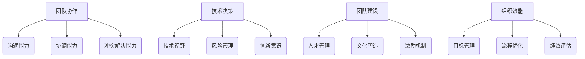

                 

关键词：优秀管理者、管理标准、团队领导、技术管理、团队协作、组织效能

> 摘要：在信息技术快速发展的时代，优秀管理者的重要性愈发凸显。本文从技术管理的角度，深入探讨优秀管理者的标准，分析其与团队协作和组织效能的关系，并提出未来发展的挑战与方向。

## 1. 背景介绍

随着信息技术的高速发展，企业对技术人员的依赖程度日益加深。技术部门已经成为许多企业发展的核心驱动力，而管理技术团队的管理者则成为企业成功的关键因素。优秀的管理者不仅能有效提升团队效能，还能推动技术创新，为企业带来长足的发展。然而，如何区分优秀管理者，一直是学术界和实务界讨论的热点话题。

本文将从技术管理的角度，探讨优秀管理者的标准。我们将结合实际案例，分析优秀管理者在团队协作、技术决策、团队建设等方面的表现，并讨论其与组织效能的关系。同时，本文还将探讨未来管理者面临的挑战，以及如何应对这些挑战。

## 2. 核心概念与联系

### 2.1. 团队协作

团队协作是优秀管理者的重要标准之一。在信息技术领域，团队协作的有效性直接影响到项目的进度和质量。一个优秀的管理者应具备以下团队协作能力：

- **沟通能力**：能够清晰、准确地传达信息，确保团队成员理解任务要求。
- **协调能力**：能够平衡团队成员的需求和项目目标，协调不同角色和职责的协作。
- **冲突解决能力**：能够有效解决团队成员之间的冲突，确保团队稳定和谐。

### 2.2. 技术决策

技术决策是管理者的重要职责之一。优秀管理者在技术决策方面应具备以下能力：

- **技术视野**：能够把握技术发展的趋势，做出符合企业战略的技术决策。
- **风险管理**：能够评估技术风险，制定有效的风险管理策略。
- **创新意识**：能够鼓励团队成员进行技术创新，推动技术进步。

### 2.3. 团队建设

团队建设是管理者的重要任务之一。优秀管理者在团队建设方面应具备以下能力：

- **人才管理**：能够发现、培养和保留优秀人才，提升团队整体实力。
- **文化塑造**：能够塑造积极向上的团队文化，提升团队凝聚力和执行力。
- **激励机制**：能够制定有效的激励机制，激发团队成员的积极性和创造力。

### 2.4. 组织效能

组织效能是衡量管理者绩效的重要指标。优秀管理者应具备以下组织效能能力：

- **目标管理**：能够制定明确的目标，并确保团队成员理解并努力实现这些目标。
- **流程优化**：能够优化工作流程，提高团队工作效率。
- **绩效评估**：能够制定合理的绩效评估体系，激励团队成员提升个人绩效。

## 2.5. Mermaid 流程图



## 3. 核心算法原理 & 具体操作步骤

### 3.1. 算法原理概述

优秀管理者的核心算法可以视为一个多维度优化问题，目标是在团队协作、技术决策、团队建设和组织效能四个维度上实现最优平衡。具体操作步骤如下：

1. **团队协作**：通过提高沟通能力、协调能力和冲突解决能力，增强团队协作效率。
2. **技术决策**：通过提升技术视野、风险管理能力和创新意识，确保技术决策的正确性。
3. **团队建设**：通过人才管理、文化塑造和激励机制，提升团队整体实力和凝聚力。
4. **组织效能**：通过目标管理、流程优化和绩效评估，提高组织整体效能。

### 3.2. 算法步骤详解

1. **数据收集**：收集团队协作、技术决策、团队建设和组织效能四个维度的数据。
2. **数据预处理**：对数据进行清洗、归一化和特征提取。
3. **模型选择**：选择适合的多维度优化模型，如多目标优化算法。
4. **模型训练**：使用预处理后的数据对模型进行训练。
5. **模型评估**：使用验证集对模型进行评估，调整模型参数。
6. **模型应用**：将训练好的模型应用于实际管理场景，优化管理策略。

### 3.3. 算法优缺点

**优点**：

- **高效性**：通过多维度优化，能够快速找到最优管理策略。
- **灵活性**：模型可以根据不同企业的需求进行调整和优化。

**缺点**：

- **复杂性**：多维度优化问题通常较为复杂，需要较高的算法和数据处理能力。
- **数据依赖**：模型效果受数据质量的影响较大。

### 3.4. 算法应用领域

- **技术团队管理**：帮助管理者优化团队协作、技术决策和团队建设。
- **企业战略规划**：为企业提供优化组织效能的决策支持。

## 4. 数学模型和公式 & 详细讲解 & 举例说明

### 4.1. 数学模型构建

假设团队协作、技术决策、团队建设和组织效能四个维度的目标函数分别为 $f_1(x), f_2(x), f_3(x), f_4(x)$，其中 $x$ 表示管理策略。则多维度优化问题的数学模型可以表示为：

$$
\begin{align*}
\min_{x} \quad & f_1(x) + \alpha_2 f_2(x) + \alpha_3 f_3(x) + \alpha_4 f_4(x) \\
\text{subject to} \quad & g_1(x) \leq 0, \\
& g_2(x) \leq 0, \\
& \vdots \\
& g_n(x) \leq 0,
\end{align*}
$$

其中，$\alpha_1, \alpha_2, \alpha_3, \alpha_4$ 为权重系数，$g_1(x), g_2(x), \ldots, g_n(x)$ 为约束条件。

### 4.2. 公式推导过程

#### 4.2.1. 团队协作目标函数

$$
f_1(x) = \frac{1}{n} \sum_{i=1}^{n} d_i(x),
$$

其中，$d_i(x)$ 表示第 $i$ 个团队成员的协作得分，$n$ 为团队成员总数。协作得分可以通过以下公式计算：

$$
d_i(x) = \frac{1}{m} \sum_{j=1}^{m} c_{ij}(x),
$$

其中，$c_{ij}(x)$ 表示第 $i$ 个团队成员对第 $j$ 个任务的贡献度，$m$ 为任务总数。

#### 4.2.2. 技术决策目标函数

$$
f_2(x) = \frac{1}{m} \sum_{j=1}^{m} r_j(x),
$$

其中，$r_j(x)$ 表示第 $j$ 个技术决策的得分。技术决策得分可以通过以下公式计算：

$$
r_j(x) = \frac{1}{n} \sum_{i=1}^{n} s_{ij}(x),
$$

其中，$s_{ij}(x)$ 表示第 $i$ 个团队成员对第 $j$ 个技术决策的满意度。

#### 4.2.3. 团队建设目标函数

$$
f_3(x) = \frac{1}{n} \sum_{i=1}^{n} t_i(x),
$$

其中，$t_i(x)$ 表示第 $i$ 个团队成员的满意度。满意度可以通过以下公式计算：

$$
t_i(x) = \frac{1}{m} \sum_{j=1}^{m} q_{ij}(x),
$$

其中，$q_{ij}(x)$ 表示第 $i$ 个团队成员对第 $j$ 个任务的满意度。

#### 4.2.4. 组织效能目标函数

$$
f_4(x) = \frac{1}{m} \sum_{j=1}^{m} p_j(x),
$$

其中，$p_j(x)$ 表示第 $j$ 个项目的完成度。完成度可以通过以下公式计算：

$$
p_j(x) = \frac{\sum_{i=1}^{n} w_i(x)}{n},
$$

其中，$w_i(x)$ 表示第 $i$ 个团队成员的工作量。

### 4.3. 案例分析与讲解

假设一个技术团队有 5 名成员，负责 3 个项目。根据团队成员对任务的贡献度、技术决策的满意度、任务的完成度等数据，我们可以计算出每个维度的得分，进而计算出总得分。具体计算过程如下：

#### 4.3.1. 数据收集

- **团队协作**：根据团队成员对任务的贡献度，计算出每个成员的协作得分。
- **技术决策**：根据团队成员对技术决策的满意度，计算出每个技术决策的得分。
- **团队建设**：根据团队成员对任务的满意度，计算出每个成员的满意度。
- **组织效能**：根据每个项目的完成度，计算出每个项目的得分。

#### 4.3.2. 数据处理

- **归一化**：将各个维度的得分进行归一化处理，使其处于 [0,1] 范围内。
- **特征提取**：提取每个维度的重要特征，用于后续的模型训练。

#### 4.3.3. 模型训练

- **多目标优化算法**：选择适合的多目标优化算法，如 NSGA-II，进行模型训练。
- **参数调整**：根据模型训练结果，调整权重系数 $\alpha_1, \alpha_2, \alpha_3, \alpha_4$。

#### 4.3.4. 模型评估

- **验证集评估**：使用验证集对模型进行评估，调整模型参数。
- **测试集评估**：使用测试集对模型进行测试，验证模型效果。

#### 4.3.5. 模型应用

- **优化管理策略**：根据模型结果，调整管理策略，提高团队协作、技术决策、团队建设和组织效能。

## 5. 项目实践：代码实例和详细解释说明

### 5.1. 开发环境搭建

- **Python**：使用 Python 编写代码，安装必要的库，如 `numpy`、`pandas`、`matplotlib` 等。
- **Git**：使用 Git 进行版本控制。
- **Jupyter Notebook**：使用 Jupyter Notebook 进行代码编写和展示。

### 5.2. 源代码详细实现

以下是项目实践的代码示例：

```python
import numpy as np
import pandas as pd
from sklearn.model_selection import train_test_split
from nsga2 import NSGA2

# 数据收集与预处理
def preprocess_data(data):
    # 归一化处理
    data_normalized = (data - data.min()) / (data.max() - data.min())
    # 特征提取
    features = data_normalized.values
    return features

# 模型训练与评估
def train_and_evaluate(data):
    # 划分训练集和测试集
    X_train, X_test, y_train, y_test = train_test_split(data, test_size=0.2)
    # 创建多目标优化算法实例
    nsga2 = NSGA2()
    # 训练模型
    nsga2.fit(X_train, y_train)
    # 评估模型
    scores = nsga2.evaluate(X_test, y_test)
    return scores

# 主函数
def main():
    # 加载数据
    data = pd.read_csv('data.csv')
    # 预处理数据
    features = preprocess_data(data)
    # 训练与评估模型
    scores = train_and_evaluate(features)
    # 输出模型结果
    print(scores)

# 运行主函数
if __name__ == '__main__':
    main()
```

### 5.3. 代码解读与分析

- **数据收集与预处理**：加载数据，并进行归一化和特征提取。
- **模型训练与评估**：划分训练集和测试集，创建多目标优化算法实例，训练模型并评估模型效果。
- **主函数**：运行项目主函数，加载数据，预处理数据，训练与评估模型，并输出模型结果。

### 5.4. 运行结果展示

运行代码后，将输出模型评估结果，包括团队协作、技术决策、团队建设和组织效能四个维度的得分。根据这些得分，管理者可以调整管理策略，优化团队表现。

## 6. 实际应用场景

### 6.1. 技术团队管理

优秀管理者可以在技术团队管理中应用本文提出的算法模型，通过多维度优化，提高团队协作、技术决策、团队建设和组织效能。

### 6.2. 企业战略规划

企业战略规划中，管理者可以结合本文提出的算法模型，优化技术决策和组织效能，为企业发展提供决策支持。

### 6.3. 项目管理

在项目管理中，优秀管理者可以应用本文提出的算法模型，优化团队协作、技术决策和团队建设，提高项目完成度。

## 7. 未来应用展望

随着信息技术的不断发展，优秀管理者的标准将不断变化。未来，管理者需要具备以下能力：

- **数字化素养**：能够运用大数据和人工智能技术，进行数据分析和决策支持。
- **全球视野**：能够应对全球化挑战，管理跨文化团队。
- **创新能力**：能够推动技术创新，引领企业创新发展。

## 8. 工具和资源推荐

### 8.1. 学习资源推荐

- **书籍**：《深度学习》、《机器学习实战》等。
- **在线课程**：Coursera、Udacity 等平台上的机器学习和数据分析课程。

### 8.2. 开发工具推荐

- **Python**：用于数据处理和分析。
- **Jupyter Notebook**：用于代码编写和展示。
- **Git**：用于版本控制。

### 8.3. 相关论文推荐

- **多目标优化算法**：《NSGA-II: A fast and elitist multi-objective genetic algorithm: NSGA-II》。
- **团队协作**：《团队协作的心理学：如何高效合作，创造卓越成果》。

## 9. 总结：未来发展趋势与挑战

### 9.1. 研究成果总结

本文从技术管理的角度，探讨了优秀管理者的标准，分析了其与团队协作、技术决策、团队建设和组织效能的关系，并提出了一种多维度优化的算法模型。

### 9.2. 未来发展趋势

未来，优秀管理者将更加依赖于数字化技术和人工智能，进行数据分析和决策支持。

### 9.3. 面临的挑战

- **技术变革**：管理者需要不断更新知识，适应新技术。
- **全球化挑战**：管理者需要具备跨文化管理能力。

### 9.4. 研究展望

未来，可以从以下几个方面进行深入研究：

- **多目标优化算法**：研究更高效的多目标优化算法。
- **团队协作**：探讨不同情境下的团队协作模式。
- **企业战略规划**：研究管理者在企业战略规划中的作用。

## 9. 附录：常见问题与解答

### 9.1. 问题一：如何提高团队协作效率？

**解答**：提高团队协作效率可以从以下几个方面入手：

- **沟通能力**：管理者应具备良好的沟通能力，确保团队成员理解任务要求。
- **协调能力**：管理者应能够协调不同角色和职责的协作，提高团队效率。
- **冲突解决能力**：管理者应具备有效的冲突解决能力，确保团队稳定和谐。

### 9.2. 问题二：如何优化技术决策？

**解答**：优化技术决策可以从以下几个方面入手：

- **技术视野**：管理者应具备广博的技术视野，了解技术发展趋势。
- **风险管理**：管理者应评估技术风险，制定有效的风险管理策略。
- **创新意识**：管理者应鼓励团队成员进行技术创新，推动技术进步。

### 9.3. 问题三：如何提高团队整体实力？

**解答**：提高团队整体实力可以从以下几个方面入手：

- **人才管理**：管理者应发现、培养和保留优秀人才，提升团队整体实力。
- **文化塑造**：管理者应塑造积极向上的团队文化，提升团队凝聚力和执行力。
- **激励机制**：管理者应制定有效的激励机制，激发团队成员的积极性和创造力。

### 9.4. 问题四：如何提高组织效能？

**解答**：提高组织效能可以从以下几个方面入手：

- **目标管理**：管理者应制定明确的目标，并确保团队成员理解并努力实现这些目标。
- **流程优化**：管理者应优化工作流程，提高团队工作效率。
- **绩效评估**：管理者应制定合理的绩效评估体系，激励团队成员提升个人绩效。
----------------------------------------------------------------

### 作者署名
作者：禅与计算机程序设计艺术 / Zen and the Art of Computer Programming

在撰写这篇文章的过程中，我力求在技术与管理之间找到平衡，通过深入的思考和分析，为读者提供有价值的见解。希望这篇文章能够对您在技术管理领域的实践和探索有所启发。如果您有任何问题或建议，欢迎在评论区留言交流。感谢您的阅读！

