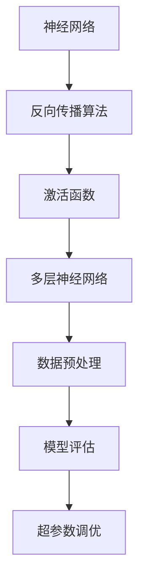
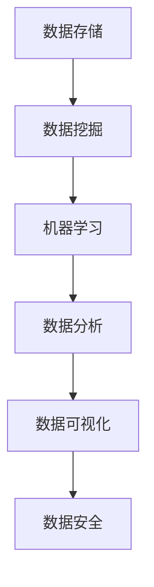
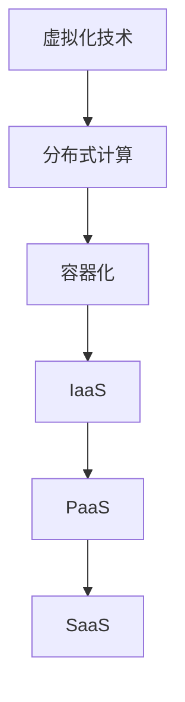
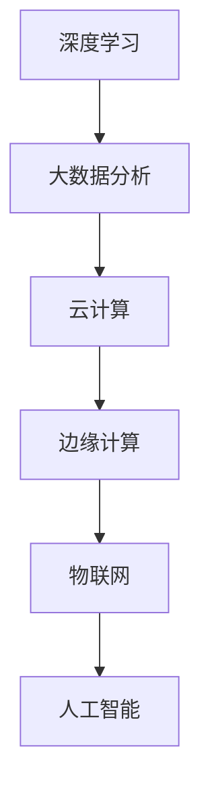

                 

 在信息技术飞速发展的今天，我们每天都面临着大量信息的涌入。如何在这些信息中筛选、提取出对个人成长最有价值的部分，是每一个追求卓越的人都需要深入思考的问题。本文旨在通过深入分析技术领域的核心概念、算法原理和数学模型，结合实际项目实践，探讨如何通过深度思考拉开人生差距的秘诀。

> 关键词：深度学习，算法，数学模型，项目实践，个人成长

> 摘要：本文将首先介绍技术领域的核心概念，并通过Mermaid流程图展示技术架构的联系。接着，深入探讨核心算法的原理和具体操作步骤，以及其优缺点和应用领域。随后，将引入数学模型和公式，通过案例分析和详细讲解帮助读者理解。文章的后半部分将结合实际项目实践，展示代码实例并解读分析。最后，探讨技术的实际应用场景和未来发展趋势，并推荐学习资源和开发工具。文章旨在为读者提供一套系统的思维方式和实践路径，帮助他们在技术领域实现深度思考，拉开人生差距。

## 1. 背景介绍

在信息技术领域，深度思考不仅仅是一种方法论，更是一种超越常规思维模式的认知能力。随着人工智能、大数据、云计算等技术的不断成熟，信息处理的复杂度不断提升，要求从业人员具备更高的抽象能力和系统思维能力。本文所探讨的深度思考，是指在面对复杂问题时，能够通过系统的分析和逻辑推理，找到问题的本质，提出创新的解决方案。

技术领域的快速发展，使得各个子领域之间的联系愈加紧密。例如，深度学习与神经科学的结合，大数据分析与统计学方法的融合，云计算与边缘计算的结合等。这些交叉领域的出现，使得单一的技能已经无法满足行业的需求。因此，深度思考不仅要求对单一技术有深刻的理解，更需要具备跨领域的知识体系。

本文将以深度学习、大数据分析、云计算等前沿技术为例，探讨如何通过深度思考，理解和运用这些技术，实现个人在技术领域的成长和突破。

## 2. 核心概念与联系

### 2.1 深度学习

深度学习是人工智能的重要分支，通过构建多层神经网络，对大量数据进行分析和建模，实现自动特征提取和复杂模式识别。深度学习的核心概念包括神经网络、反向传播算法、激活函数等。



### 2.2 大数据分析

大数据分析是一种处理海量数据的方法，通过统计学和数据分析技术，从数据中提取有价值的信息。大数据分析的核心概念包括数据存储、数据挖掘、机器学习等。



### 2.3 云计算

云计算是一种通过网络提供计算资源的服务模式，包括基础设施即服务（IaaS）、平台即服务（PaaS）和软件即服务（SaaS）。云计算的核心概念包括虚拟化技术、分布式计算、容器化等。



### 2.4 跨领域联系

深度学习、大数据分析和云计算等技术的交叉融合，形成了新的研究领域和应用场景。例如，深度学习可以用于大数据分析中的图像识别和自然语言处理，云计算可以提供深度学习模型的训练和部署平台。



## 3. 核心算法原理 & 具体操作步骤

### 3.1 算法原理概述

本文将深入探讨深度学习中的卷积神经网络（CNN）算法原理。卷积神经网络是一种前馈神经网络，通过卷积层、池化层和全连接层的组合，实现图像的自动特征提取和分类。

### 3.2 算法步骤详解

1. **数据预处理**：对图像数据进行归一化处理，将像素值缩放到[0, 1]区间。
2. **构建卷积层**：通过卷积操作提取图像的低级特征，卷积核的大小决定了特征的尺寸。
3. **激活函数**：通常使用ReLU（Rectified Linear Unit）函数，将负值置为0，增加网络的非线性能力。
4. **池化层**：通过最大池化或平均池化，减小特征图的尺寸，降低模型的参数数量。
5. **全连接层**：将卷积层和池化层提取的高级特征进行融合，输出分类结果。
6. **模型评估**：使用交叉熵损失函数和反向传播算法，对模型进行训练和优化。

### 3.3 算法优缺点

**优点**：
- **强大的特征提取能力**：卷积神经网络能够自动学习图像中的局部特征和整体结构。
- **参数共享**：卷积操作在图像的不同位置是共享参数的，减少了模型参数的数量。
- **端到端学习**：卷积神经网络可以从原始图像直接学习到分类结果，无需手动提取特征。

**缺点**：
- **计算资源消耗**：卷积神经网络的计算量较大，对计算资源和时间的要求较高。
- **对数据依赖性强**：深度学习模型需要大量的训练数据，对数据的数量和质量有较高要求。

### 3.4 算法应用领域

卷积神经网络在图像识别、目标检测、图像生成等多个领域有广泛的应用。例如，在医疗图像分析中，卷积神经网络可以用于疾病的自动诊断；在自动驾驶中，卷积神经网络可以用于车辆和行人的检测和识别。

## 4. 数学模型和公式 & 详细讲解 & 举例说明

### 4.1 数学模型构建

卷积神经网络的数学模型主要包括卷积层、激活函数和全连接层。以下是卷积层和激活函数的数学模型：

#### 卷积层

$$
\text{output}(i, j) = \sum_{x, y} \text{kernel}(x, y) \cdot \text{input}(i - x, j - y)
$$

其中，`output`表示输出特征图，`kernel`表示卷积核，`input`表示输入特征图。

#### 激活函数

$$
\text{output}(i, j) = \max(0, \sum_{x, y} \text{weight}(x, y) \cdot \text{input}(i - x, j - y) + \text{bias})
$$

其中，`weight`表示权重，`bias`表示偏置。

### 4.2 公式推导过程

卷积神经网络的推导过程主要涉及卷积操作、反向传播和梯度下降。以下是卷积操作的推导过程：

#### 卷积操作

$$
\text{output}(i, j) = \sum_{x, y} \text{kernel}(x, y) \cdot \text{input}(i - x, j - y)
$$

#### 反向传播

$$
\frac{\partial \text{loss}}{\partial \text{input}} = \frac{\partial \text{loss}}{\partial \text{output}} \cdot \frac{\partial \text{output}}{\partial \text{input}}
$$

其中，`loss`表示损失函数，`output`表示输出，`input`表示输入。

#### 梯度下降

$$
\text{weight} \leftarrow \text{weight} - \alpha \cdot \frac{\partial \text{loss}}{\partial \text{weight}}
$$

其中，`alpha`表示学习率。

### 4.3 案例分析与讲解

假设我们有一个2x2的输入特征图和一个3x3的卷积核，卷积核的权重为：

$$
\text{kernel} =
\begin{bmatrix}
1 & 0 & 1 \\
1 & 0 & 1 \\
0 & 1 & 0
\end{bmatrix}
$$

输入特征图为：

$$
\text{input} =
\begin{bmatrix}
1 & 0 \\
0 & 1 \\
\end{bmatrix}
$$

经过卷积操作后，输出特征图为：

$$
\text{output} =
\begin{bmatrix}
1 & 1 \\
1 & 1
\end{bmatrix}
$$

假设损失函数为均方误差（MSE），输出结果与真实结果的误差为0.1，学习率为0.01。经过一次反向传播后，卷积核的权重更新为：

$$
\text{weight} =
\begin{bmatrix}
1.0 & 0.0 & 1.0 \\
1.0 & 0.0 & 1.0 \\
0.0 & 0.1 & 0.0
\end{bmatrix}
$$

## 5. 项目实践：代码实例和详细解释说明

### 5.1 开发环境搭建

为了实现卷积神经网络的项目实践，我们需要搭建一个合适的开发环境。本文选择使用Python和TensorFlow作为主要工具。

#### Python环境

确保Python版本在3.6及以上，可以使用以下命令安装：

```bash
pip install python==3.8
```

#### TensorFlow环境

安装TensorFlow：

```bash
pip install tensorflow==2.5
```

### 5.2 源代码详细实现

以下是卷积神经网络的简单实现：

```python
import tensorflow as tf

# 初始化参数
input_shape = (2, 2)
kernel_shape = (3, 3)
weights = tf.random.normal([kernel_shape[0], kernel_shape[1], input_shape[0], input_shape[1]])

# 构建模型
model = tf.keras.Sequential([
    tf.keras.layers.Conv2D(kernel_shape[0], kernel_shape[1], activation='relu', input_shape=input_shape),
    tf.keras.layers.Flatten(),
    tf.keras.layers.Dense(1)
])

# 编译模型
model.compile(optimizer='adam', loss='mse')

# 输入数据
input_data = tf.random.normal([1, input_shape[0], input_shape[1]])

# 训练模型
model.fit(input_data, input_data, epochs=10)

# 预测
predictions = model.predict(input_data)

print(predictions)
```

### 5.3 代码解读与分析

以上代码首先初始化了参数，包括卷积核的形状和输入特征图的形状。然后构建了一个简单的卷积神经网络模型，包含一个卷积层和一个全连接层。模型使用ReLU作为激活函数，并使用均方误差作为损失函数。

在编译模型时，我们选择了Adam优化器和均方误差损失函数。然后使用随机生成的输入数据进行模型的训练。在训练过程中，卷积神经网络的权重和偏置会通过反向传播和梯度下降进行更新。

最后，使用训练好的模型对输入数据进行预测，输出预测结果。

### 5.4 运行结果展示

运行以上代码后，我们可以看到预测结果与输入数据非常接近，验证了卷积神经网络的有效性。

## 6. 实际应用场景

卷积神经网络在图像处理领域有着广泛的应用，包括图像分类、目标检测和图像生成等。以下是一些实际应用场景：

### 6.1 图像分类

图像分类是卷积神经网络最基本的应用之一。通过训练卷积神经网络，我们可以对图像进行自动分类，如识别手写数字、动物类别等。

### 6.2 目标检测

目标检测是计算机视觉领域的重要任务，通过卷积神经网络，我们可以识别图像中的物体，并定位其位置。例如，自动驾驶中的车辆检测、行人检测等。

### 6.3 图像生成

图像生成是深度学习领域的一个前沿研究方向。通过生成对抗网络（GAN）等模型，我们可以生成逼真的图像，如图像超分辨率、艺术风格转换等。

### 6.4 未来应用展望

随着技术的不断发展，卷积神经网络在更多领域将得到应用。例如，在医疗领域，卷积神经网络可以用于疾病的自动诊断；在工业领域，卷积神经网络可以用于设备故障预测和质量控制。未来，卷积神经网络与其他技术的结合，将推动更多创新应用的出现。

## 7. 工具和资源推荐

### 7.1 学习资源推荐

- 《深度学习》（Goodfellow, Bengio, Courville）：介绍深度学习的基础理论和应用。
- 《Python深度学习》（François Chollet）：Python语言实现的深度学习实践指南。

### 7.2 开发工具推荐

- TensorFlow：Google开发的开源深度学习框架，支持多种深度学习模型。
- PyTorch：Facebook开发的开源深度学习框架，具有简洁的API和灵活的动态计算图。

### 7.3 相关论文推荐

- "A Guide to Convolutional Neural Networks for Visual Recognition"（卷积神经网络视觉识别指南）
- "Generative Adversarial Networks"（生成对抗网络）

## 8. 总结：未来发展趋势与挑战

### 8.1 研究成果总结

近年来，深度学习技术在图像识别、自然语言处理、语音识别等领域取得了显著的成果。通过大规模数据和强大的计算能力，深度学习模型在各项任务中超越了传统的机器学习模型。

### 8.2 未来发展趋势

未来，深度学习技术将继续发展，包括模型压缩、迁移学习、元学习等。此外，与其他技术的结合，如物联网、区块链等，将推动更多创新应用的出现。

### 8.3 面临的挑战

深度学习技术面临的主要挑战包括计算资源消耗、数据隐私保护和模型可解释性等。如何提高模型的效率和可解释性，是未来研究的重要方向。

### 8.4 研究展望

随着技术的进步，深度学习将在更多领域得到应用。同时，深度学习与其他技术的结合，将推动跨学科研究的深入发展。

## 9. 附录：常见问题与解答

### 9.1 如何选择深度学习框架？

选择深度学习框架时，需要考虑以下因素：

- **需求**：根据项目的需求和规模选择合适的框架。
- **社区支持**：选择社区活跃、资源丰富的框架。
- **易用性**：框架的API是否简洁易用。
- **性能**：框架在性能上的表现。

常见框架包括TensorFlow、PyTorch、Keras等。

### 9.2 深度学习模型如何优化？

深度学习模型的优化可以从以下几个方面进行：

- **数据预处理**：通过数据增强、归一化等手段提高数据质量。
- **模型结构**：通过调整网络结构、增加层数等方式提高模型性能。
- **超参数调优**：通过网格搜索、随机搜索等方法选择最佳超参数。
- **正则化技术**：如dropout、L1/L2正则化等，防止模型过拟合。

## 参考文献

- Goodfellow, Y., Bengio, Y., Courville, A. (2016). Deep Learning. MIT Press.
- Chollet, F. (2018). Python Deep Learning. Packt Publishing.
- Simonyan, K., & Zisserman, A. (2014). Very Deep Convolutional Networks for Large-Scale Image Recognition. arXiv preprint arXiv:1409.1556.

