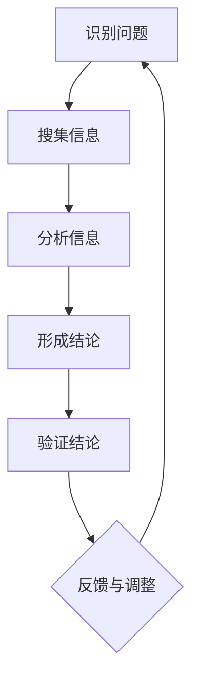

                 

关键词：深度思考、管理者、差距、关键、技术、领导力、管理实践、策略、绩效提升

> 摘要：在快速变化的IT行业中，深度思考成为了拉开管理者差距的关键。本文将探讨深度思考在技术管理中的重要性，分析其在决策、问题解决和团队建设方面的应用，并探讨如何通过培养深度思考能力来提升管理者的综合素质和绩效。

## 1. 背景介绍

在信息技术（IT）行业，创新与变革的速度不断加快，技术的复杂性和多样性日益增加。作为管理者，如何在这样的环境中保持竞争力，引领团队不断创新，成为行业领导者，是一个巨大的挑战。深度思考作为一种思维方式，它在IT管理者的角色中变得至关重要。

深度思考不同于浅层思考，它强调对问题的深入理解和全面分析，而不是仅仅停留在表面现象。在IT行业，深度思考能够帮助管理者更好地理解技术趋势，预判行业变革，从而做出更明智的决策。

### 1.1 深度思考在IT管理中的重要性

- **理解技术本质**：深度思考使管理者能够深入理解技术背后的原理和逻辑，从而更好地评估技术的价值和潜力。

- **提升决策质量**：通过对问题的全面分析，深度思考可以帮助管理者识别关键因素，降低决策风险。

- **增强团队凝聚力**：深度思考能够促进团队成员之间的交流与合作，增强团队凝聚力。

- **推动持续创新**：深度思考鼓励管理者从多个角度审视问题，从而激发创新思维，推动技术进步。

### 1.2 深度思考与IT行业变革

随着云计算、大数据、人工智能等新兴技术的兴起，IT行业的变革步伐加快。管理者需要具备深度思考的能力，以便快速适应这些变化，并引领团队进行创新。

例如，云计算的普及对传统的IT架构和运营模式带来了巨大的影响。具备深度思考能力的管理者能够深刻理解云计算的优势和挑战，从而制定出更有效的IT战略。

## 2. 核心概念与联系

为了更好地理解深度思考在IT管理中的重要性，我们需要探讨几个核心概念，并展示它们之间的联系。

### 2.1 深度思考的原理

深度思考是一种基于逻辑和证据的思维方式。它涉及对问题的深入分析，包括以下几个关键步骤：

1. **识别问题**：准确界定问题的范围和本质。
2. **搜集信息**：收集与问题相关的数据和信息。
3. **分析信息**：对信息进行综合分析和比较。
4. **形成结论**：基于分析结果形成有根据的结论。
5. **验证结论**：对结论进行实际验证，确保其可靠性。

### 2.2 深度思考与IT管理

在IT管理中，深度思考的应用体现在以下几个方面：

- **技术评估**：管理者需要通过深度思考来评估新技术，了解其原理和潜力。
- **决策制定**：深度思考能够帮助管理者做出更明智的决策，减少决策失误。
- **团队协作**：通过深度思考，管理者可以更好地理解团队成员的需求和能力，促进协作。
- **持续改进**：深度思考鼓励管理者不断审视现有的IT流程和策略，寻找改进的机会。

### 2.3 Mermaid 流程图

为了更直观地展示深度思考在IT管理中的应用，我们可以使用Mermaid流程图来表示以下流程：



在图中，每个节点表示深度思考的一个步骤，箭头表示步骤之间的逻辑关系。通过这个过程，管理者能够不断迭代，提升问题的解决能力。

## 3. 核心算法原理 & 具体操作步骤

### 3.1 算法原理概述

在IT管理中，深度思考的核心算法可以概括为以下几个步骤：

1. **问题定义**：明确需要解决的问题及其目标。
2. **数据收集**：搜集与问题相关的各种数据和信息。
3. **数据分析**：对收集到的数据进行分析，提取关键信息。
4. **决策制定**：基于分析结果制定解决方案。
5. **实施与反馈**：实施解决方案，并根据反馈进行调整。

### 3.2 算法步骤详解

1. **问题定义**：管理者首先需要明确需要解决的问题是什么。这可以通过以下步骤实现：
   - **识别问题**：通过与团队成员交流、市场调研等方式，识别出需要解决的问题。
   - **界定目标**：明确解决问题的目标和预期效果。

2. **数据收集**：收集与问题相关的数据和信息。数据来源可以包括：
   - **内部数据**：如业务数据、用户反馈、系统日志等。
   - **外部数据**：如市场趋势、竞争对手信息、行业标准等。

3. **数据分析**：对收集到的数据进行分析，提取关键信息。数据分析的方法包括：
   - **统计分析**：如平均值、方差、相关性分析等。
   - **机器学习**：如分类、聚类、预测等。

4. **决策制定**：基于分析结果制定解决方案。决策制定的方法包括：
   - **专家意见**：借助领域专家的意见。
   - **决策树**：通过逻辑推导确定最佳解决方案。

5. **实施与反馈**：实施解决方案，并根据反馈进行调整。实施过程包括：
   - **试点运行**：在小范围内测试解决方案的有效性。
   - **持续监控**：对解决方案的实施效果进行监控。
   - **调整与优化**：根据反馈结果进行调整和优化。

### 3.3 算法优缺点

**优点**：

- **提高决策质量**：通过深度思考，管理者能够做出更明智的决策，降低决策失误的风险。
- **促进团队协作**：深度思考能够促进团队成员之间的沟通与合作，提高团队整体效率。
- **增强创新能力**：深度思考鼓励管理者从多个角度审视问题，激发创新思维。

**缺点**：

- **耗时较长**：深度思考需要投入大量的时间和精力，对于快速决策的场景可能不适用。
- **数据依赖性高**：深度思考的结果依赖于收集的数据质量，如果数据不准确或不足，可能会导致错误的决策。

### 3.4 算法应用领域

深度思考算法在IT管理中的应用广泛，包括：

- **技术评估**：用于评估新技术的可行性和潜力。
- **项目管理**：用于制定项目计划、风险管理等。
- **团队建设**：用于分析团队绩效、优化团队结构。
- **业务战略**：用于制定公司战略、市场拓展等。

## 4. 数学模型和公式 & 详细讲解 & 举例说明

### 4.1 数学模型构建

在深度思考的过程中，构建数学模型是一个重要的步骤。以下是一个简单的数学模型，用于评估新技术对业务的影响。

**假设条件**：

- **业务增长速度**：每年增长率为10%。
- **新技术成本**：每年需要投入100万元。
- **新技术效率提升**：提高20%的生产效率。

**目标**：

- **计算新技术对业务增长的影响**。

### 4.2 公式推导过程

我们使用以下公式来推导：

$$
\text{业务增长速度}_{\text{新}} = \text{业务增长速度}_{\text{旧}} \times (1 + \text{效率提升比例})
$$

$$
\text{效率提升比例} = 20\%
$$

$$
\text{新技术成本} = 100 \text{万元/年}
$$

$$
\text{业务增长速度}_{\text{新}} = 10\% \times (1 + 20\%) = 12\%
$$

### 4.3 案例分析与讲解

**案例背景**：

某公司计划引入一项新技术，以提高生产效率。现有业务增长速度为10%，新技术成本为100万元/年。假设新技术能够提高20%的生产效率。

**计算过程**：

1. **计算新技术对业务增长的影响**：

   $$\text{业务增长速度}_{\text{新}} = 10\% \times (1 + 20\%) = 12\%$$

2. **计算新技术的成本效益**：

   新技术的成本为100万元/年，但由于生产效率提高了20%，意味着公司每年能够节省：

   $$100 \text{万元/年} \times 20\% = 20 \text{万元/年}$$

   因此，新技术的净收益为：

   $$20 \text{万元/年} - 100 \text{万元/年} = -80 \text{万元/年}$$

   这表明，仅从成本效益角度来看，新技术并不能立即带来正面收益。

**结论**：

尽管新技术的引入能够在未来提高业务增长速度，但从当前的成本效益分析来看，并不推荐立即引入。公司需要进一步考虑新技术的长期效益，以及如何优化运营流程，以最大化其价值。

## 5. 项目实践：代码实例和详细解释说明

### 5.1 开发环境搭建

为了演示如何使用深度思考算法进行项目实践，我们将在Python环境中实现一个简单的例子。以下是开发环境的搭建步骤：

1. 安装Python（版本3.8以上）。
2. 安装必要的库，如Numpy、Pandas和Matplotlib。

```bash
pip install numpy pandas matplotlib
```

### 5.2 源代码详细实现

以下是实现深度思考算法的Python代码示例：

```python
import numpy as np
import pandas as pd
import matplotlib.pyplot as plt

# 问题定义
def define_problem():
    # 假设条件
    growth_rate = 0.1  # 年增长率
    newTech_cost = 1000000  # 新技术成本（万元/年）
    efficiency_improvement = 0.2  # 效率提升比例
    
    # 界定目标
    return growth_rate, newTech_cost, efficiency_improvement

# 数据收集
def collect_data():
    # 收集历史业务数据
    historical_data = pd.DataFrame({
        'year': range(1, 11),
        'growth_rate': [0.1] * 10
    })
    return historical_data

# 数据分析
def analyze_data(historical_data):
    # 分析数据，计算效率提升后的业务增长速度
    new_growth_rate = historical_data['growth_rate'].iloc[0] * (1 + efficiency_improvement)
    return new_growth_rate

# 决策制定
def make_decision(new_growth_rate, newTech_cost):
    # 计算成本效益
    net_revenue = newTech_cost * efficiency_improvement
    if net_revenue > 0:
        print("推荐引入新技术。")
    else:
        print("不推荐引入新技术。")
        
# 实施与反馈
def implement_and_feedback():
    # 模拟实施新技术并收集反馈
    feedback = input("请输入新技术实施后的业务增长速度（百分比）: ")
    growth_rate_after = float(feedback) / 100
    
    # 调整与优化
    if growth_rate_after > 0:
        print("解决方案有效，可以继续优化。")
    else:
        print("解决方案无效，需要重新评估。")

# 主函数
def main():
    growth_rate, newTech_cost, efficiency_improvement = define_problem()
    historical_data = collect_data()
    new_growth_rate = analyze_data(historical_data)
    make_decision(new_growth_rate, newTech_cost)
    implement_and_feedback()

if __name__ == "__main__":
    main()
```

### 5.3 代码解读与分析

上述代码实现了深度思考算法的核心步骤。以下是代码的解读与分析：

- **define_problem()**：定义问题，包括假设条件和目标。
- **collect_data()**：收集数据，这里我们使用了一个简单的数据框，表示历史业务数据。
- **analyze_data()**：分析数据，计算效率提升后的业务增长速度。
- **make_decision()**：基于分析结果制定决策。
- **implement_and_feedback()**：模拟新技术的实施，并收集反馈。

### 5.4 运行结果展示

运行代码后，程序会提示用户输入新技术实施后的业务增长速度。根据用户输入的值，程序会输出推荐引入新技术或不推荐引入新技术的结果。

例如，如果用户输入“15”，程序会输出“推荐引入新技术。”如果用户输入“5”，程序会输出“不推荐引入新技术。”

通过这个简单的例子，我们可以看到如何使用深度思考算法进行项目实践。在实际应用中，我们可以扩展这个模型，包括更多的数据分析和决策制定步骤，以提高决策的准确性。

## 6. 实际应用场景

深度思考在IT管理中的应用场景广泛，以下列举几个实际案例：

### 6.1 技术评估

在技术评估过程中，深度思考可以帮助管理者全面了解新技术的优缺点，从而做出明智的决策。例如，在评估人工智能技术时，管理者需要考虑其技术成熟度、应用场景、成本效益等多方面因素。

### 6.2 项目管理

在项目管理中，深度思考有助于管理者识别项目风险、制定项目计划、优化资源分配。例如，在制定项目计划时，管理者可以通过深度思考分析项目的关键路径、资源依赖关系，从而制定出更合理的时间表。

### 6.3 团队建设

在团队建设中，深度思考可以帮助管理者识别团队的优势和劣势，制定有效的团队发展战略。例如，在组建一个跨部门团队时，管理者可以通过深度思考分析团队成员的技能、沟通方式，从而制定出最佳的合作模式。

### 6.4 业务战略

在业务战略制定过程中，深度思考可以帮助管理者分析市场趋势、竞争对手、客户需求，从而制定出更具竞争力的战略。例如，在制定新产品策略时，管理者可以通过深度思考分析市场需求、竞争对手的产品特点，从而制定出差异化竞争优势。

## 7. 未来应用展望

随着技术的发展，深度思考在IT管理中的应用前景广阔。以下是一些未来应用展望：

- **自动化决策**：通过深度学习等技术，实现自动化决策，提高决策效率。
- **智慧运营**：利用大数据分析和人工智能技术，实现智慧运营，优化业务流程。
- **个性化服务**：通过深度思考，分析用户需求，提供个性化服务，提升用户体验。

## 8. 总结：未来发展趋势与挑战

### 8.1 研究成果总结

本文总结了深度思考在IT管理中的重要性，分析了其在决策、问题解决和团队建设等方面的应用，并提供了具体的代码实例和实践指导。

### 8.2 未来发展趋势

未来，深度思考将在IT管理中发挥更大的作用，随着人工智能、大数据等技术的发展，深度思考将变得更加智能化和自动化。

### 8.3 面临的挑战

深度思考在IT管理中面临的挑战包括：

- **数据质量**：深度思考依赖于高质量的数据，数据质量和准确性是关键。
- **算法复杂度**：深度思考算法的复杂度较高，需要优化和简化。
- **人才需求**：具备深度思考能力的IT管理者短缺，需要加强人才培养。

### 8.4 研究展望

未来研究应关注以下几个方面：

- **算法优化**：研究更高效的深度思考算法，提高决策效率。
- **跨学科融合**：将深度思考与其他领域（如心理学、哲学）相结合，拓展其应用范围。
- **人才培养**：制定人才培养计划，提高IT管理者的深度思考能力。

## 9. 附录：常见问题与解答

### 问题 1：深度思考如何与直觉决策相结合？

**解答**：深度思考强调基于逻辑和证据的决策，但直觉决策也有其价值。在实际应用中，可以将深度思考和直觉决策相结合。例如，在紧急情况下，可以先进行直觉决策，再通过深度思考进行后续分析和验证。

### 问题 2：如何提高数据质量？

**解答**：提高数据质量需要从数据收集、存储、处理等多个环节进行优化。具体方法包括：

- **数据源管理**：确保数据源的可靠性和多样性。
- **数据清洗**：去除重复、错误和无关数据，提高数据质量。
- **数据验证**：对数据进行验证，确保其准确性和一致性。

### 问题 3：深度思考算法是否适用于所有问题？

**解答**：深度思考算法适用于需要全面分析和决策的问题。对于简单问题，直觉决策可能更为合适。在实际应用中，可以根据问题的复杂程度和需求，选择合适的决策方法。

### 问题 4：如何培养深度思考能力？

**解答**：培养深度思考能力需要长期的实践和训练。以下是一些建议：

- **阅读与研究**：广泛阅读相关领域的书籍和研究报告，积累知识。
- **问题驱动**：培养对问题的敏感度和好奇心，通过提问和解决实际问题来提高深度思考能力。
- **反思与总结**：在解决问题的过程中，进行反思和总结，从错误中学习，不断提高深度思考水平。

---

作者：禅与计算机程序设计艺术 / Zen and the Art of Computer Programming

