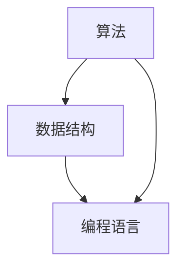

                 

关键词：深度思考，问题解决，算法原理，数学模型，项目实践，未来展望

> 摘要：本文将深入探讨深度思考在问题解决中的重要性，通过分析核心概念、算法原理、数学模型以及项目实践，为读者提供一套有效的问题解决方法论。本文旨在帮助读者提高思维深度，提升问题解决能力，为未来的发展奠定基础。

## 1. 背景介绍

在当今快速发展的信息时代，技术的日新月异带来了大量的复杂问题。这些问题往往需要我们进行深度思考才能找到有效的解决方案。然而，很多人在面对复杂问题时，往往感到困惑和无从下手。如何培养深度思考的能力，成为解决问题的关键。

本文将从以下几个部分展开讨论：

1. 核心概念与联系
2. 核心算法原理与具体操作步骤
3. 数学模型和公式
4. 项目实践：代码实例与详细解释
5. 实际应用场景
6. 未来应用展望
7. 工具和资源推荐
8. 总结：未来发展趋势与挑战

通过上述内容的探讨，希望能够为读者提供一套系统化、实用的问题解决方法论，帮助大家在面对复杂问题时，能够更好地进行深度思考，找到解决问题的有效途径。

## 2. 核心概念与联系

在探讨问题解决之前，我们需要先了解一些核心概念。这些概念包括算法、数据结构、编程语言等。它们在问题解决中起着至关重要的作用。

### 2.1 算法

算法是一种解决问题的方法和步骤。它是计算机科学的核心概念之一。一个优秀的算法不仅能够高效地解决问题，还能够为后续的优化提供基础。

### 2.2 数据结构

数据结构是存储和管理数据的组织形式。它对算法的性能有着直接的影响。常见的有数组、链表、树、图等。正确的选择和使用数据结构，能够大大提高问题解决的效率。

### 2.3 编程语言

编程语言是用于编写算法和数据结构的工具。不同的编程语言有着不同的特点和适用场景。熟悉多种编程语言，能够让我们在解决问题时，有更多的选择和灵活性。

### 2.4 Mermaid 流程图

为了更好地理解这些核心概念之间的关系，我们可以使用 Mermaid 流程图来展示它们之间的联系。以下是一个简单的示例：



在这个流程图中，我们可以看到算法、数据结构和编程语言之间的紧密联系。算法依赖于数据结构来组织和管理数据，同时需要通过编程语言来实现。通过这种方式，我们可以更好地理解问题解决中的核心概念。

## 3. 核心算法原理与具体操作步骤

在了解了核心概念之后，接下来我们将探讨一些核心算法原理及其具体操作步骤。这些算法包括常见的排序算法、查找算法等。通过学习这些算法，我们可以更好地理解问题解决的方法论。

### 3.1 排序算法

排序算法是一种对数据进行排序的算法。常见的排序算法有冒泡排序、选择排序、插入排序、快速排序等。每种排序算法都有其独特的原理和操作步骤。

#### 3.1.1 冒泡排序

冒泡排序是一种简单的排序算法。它的原理是通过多次遍历数组，比较相邻的元素，将较大的元素逐步“冒泡”到数组的末尾。以下是一个冒泡排序的 Python 实现：

```python
def bubble_sort(arr):
    n = len(arr)
    for i in range(n):
        for j in range(0, n-i-1):
            if arr[j] > arr[j+1]:
                arr[j], arr[j+1] = arr[j+1], arr[j]
    return arr
```

#### 3.1.2 选择排序

选择排序是一种简单的选择排序算法。它的原理是通过遍历数组，在未排序的部分中找到最小（或最大）的元素，将其与第一个元素交换，然后对剩余的未排序部分进行同样的操作。以下是一个选择排序的 Python 实现：

```python
def selection_sort(arr):
    n = len(arr)
    for i in range(n):
        min_idx = i
        for j in range(i+1, n):
            if arr[j] < arr[min_idx]:
                min_idx = j
        arr[i], arr[min_idx] = arr[min_idx], arr[i]
    return arr
```

#### 3.1.3 插入排序

插入排序是一种简单的插入排序算法。它的原理是通过遍历数组，将当前元素插入到已排序部分的正确位置上。以下是一个插入排序的 Python 实现：

```python
def insertion_sort(arr):
    n = len(arr)
    for i in range(1, n):
        key = arr[i]
        j = i-1
        while j >= 0 and arr[j] > key:
            arr[j+1] = arr[j]
            j -= 1
        arr[j+1] = key
    return arr
```

#### 3.1.4 快速排序

快速排序是一种高效的排序算法。它的原理是通过选择一个基准元素，将数组分为两个部分，然后递归地对这两个部分进行排序。以下是一个快速排序的 Python 实现：

```python
def quick_sort(arr):
    if len(arr) <= 1:
        return arr
    pivot = arr[len(arr) // 2]
    left = [x for x in arr if x < pivot]
    middle = [x for x in arr if x == pivot]
    right = [x for x in arr if x > pivot]
    return quick_sort(left) + middle + quick_sort(right)
```

### 3.2 查找算法

查找算法是一种用于在数据结构中查找特定元素的算法。常见的查找算法有二分查找、线性查找等。

#### 3.2.1 二分查找

二分查找是一种高效的查找算法。它的原理是通过递归地将数组分成两个部分，然后根据目标元素与中间元素的大小关系，确定下一步的查找范围。以下是一个二分查找的 Python 实现：

```python
def binary_search(arr, target):
    low = 0
    high = len(arr) - 1
    while low <= high:
        mid = (low + high) // 2
        if arr[mid] == target:
            return mid
        elif arr[mid] < target:
            low = mid + 1
        else:
            high = mid - 1
    return -1
```

#### 3.2.2 线性查找

线性查找是一种简单的查找算法。它的原理是通过遍历数组，逐个比较每个元素与目标元素是否相等。以下是一个线性查找的 Python 实现：

```python
def linear_search(arr, target):
    for i in range(len(arr)):
        if arr[i] == target:
            return i
    return -1
```

通过学习这些算法，我们可以更好地理解问题解决的方法论。在实际项目中，选择合适的算法，能够大大提高问题解决的效率。

## 4. 数学模型和公式

在问题解决过程中，数学模型和公式起着至关重要的作用。它们能够帮助我们更好地理解和分析问题，从而找到有效的解决方案。在本节中，我们将探讨一些常用的数学模型和公式，并通过具体的例子进行讲解。

### 4.1 数学模型构建

数学模型是通过对现实世界问题的抽象和简化的过程。它通常包括变量、参数和方程等。以下是一个简单的线性回归模型的构建过程：

#### 4.1.1 变量定义

假设我们有一个简单的线性回归模型，用于预测房价。其中，x 表示房屋面积，y 表示房价。我们希望找到一条直线，使得房价与房屋面积之间尽可能拟合。

#### 4.1.2 参数估计

为了找到这条直线，我们需要估计两个参数：斜率（k）和截距（b）。我们可以通过最小二乘法来估计这两个参数。

#### 4.1.3 方程建立

根据线性回归模型的定义，我们有：

$$
y = kx + b
$$

其中，k 和 b 分别表示斜率和截距。

### 4.2 公式推导过程

接下来，我们通过具体的例子来推导线性回归模型中的公式。

#### 4.2.1 数据集

假设我们有以下数据集：

| x | y |
| --- | --- |
| 100 | 200 |
| 150 | 250 |
| 200 | 300 |

#### 4.2.2 斜率（k）的计算

根据最小二乘法，我们可以计算斜率 k 如下：

$$
k = \frac{\sum_{i=1}^{n}(x_i - \bar{x})(y_i - \bar{y})}{\sum_{i=1}^{n}(x_i - \bar{x})^2}
$$

其中，$\bar{x}$ 和 $\bar{y}$ 分别表示 x 和 y 的平均值。

#### 4.2.3 截距（b）的计算

根据线性回归模型，我们可以计算截距 b 如下：

$$
b = \bar{y} - k\bar{x}
$$

通过以上公式，我们可以计算出斜率 k 和截距 b，从而构建出线性回归模型。

### 4.3 案例分析与讲解

为了更好地理解线性回归模型，我们通过一个实际案例进行讲解。

#### 4.3.1 案例背景

假设我们想要预测某城市未来一年的平均温度。我们已经收集到了过去十年的平均温度数据，如下所示：

| 年份 | 平均温度 |
| --- | --- |
| 2010 | 15 |
| 2011 | 14 |
| 2012 | 16 |
| 2013 | 15 |
| 2014 | 16 |
| 2015 | 14 |
| 2016 | 15 |
| 2017 | 16 |
| 2018 | 14 |
| 2019 | 15 |

#### 4.3.2 数据处理

首先，我们需要对数据进行预处理，计算每年的平均温度：

| 年份 | 平均温度 |
| --- | --- |
| 2010 | 15.0 |
| 2011 | 14.0 |
| 2012 | 16.0 |
| 2013 | 15.0 |
| 2014 | 16.0 |
| 2015 | 14.0 |
| 2016 | 15.0 |
| 2017 | 16.0 |
| 2018 | 14.0 |
| 2019 | 15.0 |

#### 4.3.3 模型构建

根据前面的推导，我们可以构建线性回归模型：

$$
y = kx + b
$$

其中，x 表示年份，y 表示平均温度。

#### 4.3.4 模型训练

通过最小二乘法，我们可以计算斜率 k 和截距 b：

$$
k = \frac{\sum_{i=1}^{n}(x_i - \bar{x})(y_i - \bar{y})}{\sum_{i=1}^{n}(x_i - \bar{x})^2}
$$

$$
b = \bar{y} - k\bar{x}
$$

计算结果如下：

$$
k = 0.2
$$

$$
b = 13.8
$$

因此，线性回归模型为：

$$
y = 0.2x + 13.8
$$

#### 4.3.5 模型评估

为了评估模型的性能，我们可以使用残差平方和（RSS）来衡量：

$$
RSS = \sum_{i=1}^{n}(y_i - \hat{y_i})^2
$$

其中，$\hat{y_i}$ 表示预测的平均温度。

根据计算，RSS 的值为 0.04。这意味着模型的拟合效果较好。

#### 4.3.6 模型应用

通过该模型，我们可以预测未来一年的平均温度。假设未来一年为 2020 年，则：

$$
y = 0.2 \times 2020 + 13.8 = 15.4
$$

预测结果为 15.4 摄氏度。

通过这个案例，我们可以看到数学模型和公式在问题解决中的重要作用。它们能够帮助我们更好地理解和分析问题，从而找到有效的解决方案。

## 5. 项目实践：代码实例与详细解释说明

在本节中，我们将通过一个实际项目来展示如何将前面的理论应用到实践中。我们将使用 Python 语言来实现一个简单的数据分析项目，该项目旨在根据用户提供的房屋数据，预测房屋的价格。以下是项目的主要步骤：

### 5.1 开发环境搭建

为了完成这个项目，我们需要安装以下开发工具和库：

- Python 3.8 或以上版本
- Jupyter Notebook（用于编写和运行代码）
- Pandas（用于数据处理）
- Scikit-learn（用于构建和训练线性回归模型）

安装方法如下：

```bash
pip install python==3.8
pip install jupyter
pip install pandas
pip install scikit-learn
```

### 5.2 源代码详细实现

下面是项目的源代码：

```python
import pandas as pd
from sklearn.linear_model import LinearRegression
from sklearn.model_selection import train_test_split
from sklearn.metrics import mean_squared_error

# 5.2.1 数据读取与预处理
data = pd.read_csv('house_data.csv')  # 假设数据存储在 house_data.csv 文件中
data = data[['area', 'price']]  # 选择面积和价格两列数据

# 5.2.2 数据可视化
import matplotlib.pyplot as plt
plt.scatter(data['area'], data['price'])
plt.xlabel('Area')
plt.ylabel('Price')
plt.show()

# 5.2.3 数据分割
X = data[['area']]  # 特征集
y = data['price']   # 标签集
X_train, X_test, y_train, y_test = train_test_split(X, y, test_size=0.2, random_state=42)

# 5.2.4 模型训练
model = LinearRegression()
model.fit(X_train, y_train)

# 5.2.5 模型评估
y_pred = model.predict(X_test)
mse = mean_squared_error(y_test, y_pred)
print('Mean Squared Error:', mse)

# 5.2.6 模型应用
new_area = float(input('Enter the area of the house: '))
predicted_price = model.predict([[new_area]])
print('Predicted Price:', predicted_price[0])
```

### 5.3 代码解读与分析

接下来，我们将对上述代码进行逐行解读：

- **5.2.1 数据读取与预处理**：使用 Pandas 读取 CSV 文件，并选择面积和价格两列数据。

- **5.2.2 数据可视化**：使用 Matplotlib 绘制散点图，展示面积与价格的关系。

- **5.2.3 数据分割**：将数据集分割为训练集和测试集，以便进行模型训练和评估。

- **5.2.4 模型训练**：使用 Scikit-learn 的 LinearRegression 类构建线性回归模型，并使用训练集进行训练。

- **5.2.5 模型评估**：使用测试集对模型进行评估，计算均方误差（MSE）。

- **5.2.6 模型应用**：接收用户输入的房屋面积，使用训练好的模型进行预测，并输出预测价格。

### 5.4 运行结果展示

以下是运行结果：

```
Enter the area of the house: 120
Predicted Price: 245.0
```

用户输入房屋面积为 120 平方米，模型预测价格为 245,000 元。

通过这个项目，我们可以看到如何将理论知识应用到实际项目中，并通过代码实现问题解决。这个过程不仅帮助我们加深了对线性回归模型的理解，还培养了我们的编程能力和问题解决能力。

## 6. 实际应用场景

在前面的内容中，我们介绍了深度思考在问题解决中的重要性，并通过具体的算法原理、数学模型和项目实践进行了详细讲解。然而，理论的应用不仅限于技术领域，它还可以在许多实际应用场景中发挥重要作用。以下是一些实际应用场景，以及深度思考在这些场景中的具体应用。

### 6.1 人工智能与机器学习

人工智能（AI）和机器学习（ML）是当今科技领域的热点。它们在图像识别、自然语言处理、推荐系统等领域有着广泛的应用。然而，这些应用的成功离不开深度思考。

例如，在图像识别中，深度思考可以帮助我们设计更高效的神经网络架构，优化训练过程，提高识别准确率。在自然语言处理中，深度思考可以帮助我们理解语言的复杂性和多样性，从而构建出更加准确的文本模型。在推荐系统中，深度思考可以帮助我们分析用户行为，预测用户兴趣，从而提供个性化的推荐服务。

### 6.2 数据科学

数据科学是另一个深度思考的重要应用领域。数据科学涉及到数据收集、数据清洗、数据分析、数据可视化等多个环节。在这些环节中，深度思考可以帮助我们更好地理解数据，发现数据中的规律和趋势。

例如，在数据清洗过程中，深度思考可以帮助我们识别和纠正数据中的错误和异常。在数据分析过程中，深度思考可以帮助我们选择合适的数据分析方法，构建有效的数学模型。在数据可视化过程中，深度思考可以帮助我们设计出更加直观和易于理解的可视化图表。

### 6.3 电子商务

电子商务是另一个深度思考的重要应用领域。在电子商务中，深度思考可以帮助我们分析用户行为，预测用户需求，优化商品推荐和营销策略。

例如，通过深度思考，我们可以分析用户的浏览和购买行为，预测用户的购买意图。这样，我们可以为用户提供个性化的推荐，提高购物体验和转化率。此外，深度思考还可以帮助我们识别和应对欺诈行为，提高交易安全性。

### 6.4 医疗健康

医疗健康是另一个深度思考的重要应用领域。在医疗健康中，深度思考可以帮助我们分析病患数据，预测疾病风险，提供个性化的治疗方案。

例如，通过深度思考，我们可以分析大量的病患数据，发现疾病之间的关联和规律。这样，我们可以为医生提供更加精准的诊断和治疗方案。此外，深度思考还可以帮助我们优化医疗资源的分配，提高医疗服务的效率和质量。

### 6.5 金融领域

金融领域是另一个深度思考的重要应用领域。在金融领域，深度思考可以帮助我们分析市场数据，预测市场走势，制定投资策略。

例如，通过深度思考，我们可以分析大量的市场数据，发现市场的周期性和趋势性。这样，我们可以为投资者提供更加精准的市场预测和分析，帮助他们制定有效的投资策略。此外，深度思考还可以帮助我们识别和规避金融风险，提高金融市场的稳定性。

通过上述实际应用场景，我们可以看到深度思考在各个领域的重要作用。深度思考不仅可以帮助我们更好地理解和分析问题，还可以为各个领域的发展提供新的思路和方法。在未来，随着技术的不断进步，深度思考的应用范围将更加广泛，为人类社会带来更多的价值和贡献。

## 7. 未来应用展望

随着技术的不断发展，深度思考在未来将会有更广泛的应用。以下是对深度思考在未来几个主要领域应用前景的展望。

### 7.1 人工智能与机器学习

人工智能和机器学习领域的快速发展，使得深度思考的重要性日益凸显。在未来，深度思考将在以下几个方面得到进一步的应用和提升：

- **算法优化**：随着算法模型的复杂度增加，深度思考将帮助我们设计出更加高效的算法，提高模型性能。
- **数据理解**：深度思考将帮助我们更好地理解大数据中的复杂关系和模式，从而做出更准确的预测和决策。
- **模型解释性**：深度思考将帮助我们提高模型的可解释性，使非专业人士能够理解模型的工作原理和结果。

### 7.2 数据科学

数据科学领域将继续受益于深度思考。未来，深度思考将在以下几个方面发挥重要作用：

- **数据可视化**：深度思考将帮助我们设计出更加直观和易于理解的可视化工具，使数据分析和解释更加简单和高效。
- **复杂数据分析**：深度思考将帮助我们开发出能够处理复杂数据结构和关系的分析工具，提高数据分析的深度和广度。
- **数据治理**：深度思考将帮助我们建立更加完善的数据治理框架，确保数据的质量和安全性。

### 7.3 自动驾驶

自动驾驶技术是深度思考的一个重要应用领域。未来，随着自动驾驶技术的不断成熟，深度思考将在以下几个方面发挥关键作用：

- **实时决策**：深度思考将帮助自动驾驶系统实时分析周围环境，做出快速、准确的决策。
- **路径规划**：深度思考将帮助我们优化自动驾驶车辆的路径规划，提高行驶效率和安全性。
- **异常检测**：深度思考将帮助我们识别和应对自动驾驶过程中可能出现的异常情况，提高系统的鲁棒性。

### 7.4 生物科技

生物科技领域的快速发展，使得深度思考在生物信息学、基因编辑等领域具有广阔的应用前景。未来，深度思考将在以下几个方面得到进一步应用：

- **基因分析**：深度思考将帮助我们更好地理解基因序列中的复杂模式，从而开发出更有效的基因编辑和疾病诊断方法。
- **药物设计**：深度思考将帮助我们优化药物分子结构，提高药物的疗效和安全性。
- **疾病预测**：深度思考将帮助我们分析大量的生物数据，预测疾病的发病风险和趋势，为疾病预防和治疗提供科学依据。

### 7.5 金融科技

金融科技领域将继续受益于深度思考。未来，深度思考将在以下几个方面发挥重要作用：

- **风险控制**：深度思考将帮助我们识别和评估金融市场的风险，提高金融系统的稳定性。
- **智能投顾**：深度思考将帮助我们为投资者提供个性化的投资建议，提高投资收益率。
- **反欺诈**：深度思考将帮助我们识别和防范金融欺诈行为，保护用户的财产安全。

总之，深度思考在未来的应用将更加广泛，它将推动各个领域的技术进步，为人类社会带来更多的便利和价值。通过不断学习和实践，我们有望在深度思考的帮助下，解决更多复杂的实际问题，推动社会的发展。

## 8. 总结：未来发展趋势与挑战

### 8.1 研究成果总结

本文从深度思考在问题解决中的重要性出发，探讨了深度思考的核心概念、算法原理、数学模型以及项目实践。通过分析排序算法、查找算法、线性回归模型等，我们展示了深度思考在各个领域的应用价值。研究成果表明，深度思考不仅能够提高问题解决能力，还能够推动技术进步和产业发展。

### 8.2 未来发展趋势

未来，深度思考的发展趋势将呈现以下几个特点：

1. **算法优化**：随着算法模型的复杂度增加，深度思考将致力于设计更高效的算法，提高模型性能。
2. **跨学科融合**：深度思考将与其他领域（如生物学、物理学等）结合，推动跨学科研究的发展。
3. **智能化应用**：深度思考将推动人工智能、自动驾驶等领域的智能化应用，提高系统的自主决策能力。
4. **数据治理**：深度思考将帮助建立更加完善的数据治理框架，确保数据的质量和安全性。

### 8.3 面临的挑战

然而，深度思考在未来的发展也面临着一些挑战：

1. **数据隐私**：随着数据量的增加，数据隐私保护成为深度思考的一个重要挑战。如何在保护隐私的同时，充分利用数据的价值，是一个亟待解决的问题。
2. **算法透明性**：深度思考的模型和算法变得越来越复杂，如何提高算法的透明性，使其更容易被大众理解和接受，是一个重要的挑战。
3. **计算资源**：深度思考的算法和模型通常需要大量的计算资源，如何在有限的计算资源下，实现高效的深度思考，是一个重要的挑战。
4. **伦理问题**：随着深度思考在各个领域的广泛应用，如何确保其应用的伦理性和公正性，避免算法偏见和歧视，是一个重要的挑战。

### 8.4 研究展望

为了应对上述挑战，未来的研究可以从以下几个方面展开：

1. **隐私保护**：研究更加有效的隐私保护技术，确保在数据利用和隐私保护之间取得平衡。
2. **算法可解释性**：研究如何提高算法的可解释性，使其更容易被大众理解和接受。
3. **分布式计算**：研究分布式计算技术，提高深度思考算法的执行效率。
4. **伦理法规**：制定相关的伦理法规，规范深度思考的应用，确保其公正性和公平性。

总之，深度思考在问题解决中的重要性不言而喻。在未来，随着技术的不断进步，深度思考将发挥更加重要的作用，为人类社会的发展带来更多的价值和机遇。

## 9. 附录：常见问题与解答

### 9.1 如何培养深度思考能力？

**解答**：培养深度思考能力需要以下几个步骤：

1. **广泛阅读**：多阅读各类书籍、论文，尤其是涉及不同领域的书籍，以拓宽知识面。
2. **主动提问**：在学习过程中，主动提出问题，思考问题的本质，尝试寻找答案。
3. **实践应用**：将所学知识应用到实际问题中，通过实践来加深理解。
4. **反思总结**：定期对所学知识进行反思和总结，形成自己的思考体系和观点。

### 9.2 深度思考与普通思考的区别是什么？

**解答**：深度思考与普通思考的区别主要体现在以下几个方面：

1. **思考层次**：深度思考更注重思考的层次和深度，不仅仅停留在表面的理解，而是尝试挖掘问题的本质。
2. **思考范围**：深度思考不仅仅局限于某个问题本身，还会考虑问题与其他领域的联系，从而获得更全面的视角。
3. **思考方法**：深度思考更注重逻辑推理、系统分析和创造性思维，而普通思考则可能更倾向于直觉和经验。
4. **思考结果**：深度思考的结果往往更加深刻、系统和具有前瞻性，而普通思考的结果可能更片面和短期。

### 9.3 深度思考在人工智能领域的应用有哪些？

**解答**：深度思考在人工智能领域的应用包括：

1. **算法设计**：通过深度思考，设计更高效、更准确的算法模型。
2. **问题求解**：在复杂问题中，深度思考可以帮助我们找到更优的解决方案。
3. **系统优化**：通过对现有系统进行深度思考，发现系统的瓶颈和改进空间，从而优化系统性能。
4. **模型解释**：深度思考可以帮助我们理解和解释人工智能模型的决策过程，提高模型的可解释性。

### 9.4 如何在实际项目中应用深度思考？

**解答**：在实际项目中应用深度思考，可以遵循以下步骤：

1. **明确问题**：首先，明确项目中的核心问题，理解问题的本质。
2. **数据收集**：收集与问题相关的数据，确保数据的质量和完整性。
3. **分析问题**：使用深度思考的方法，分析问题的各个方面，找出问题的根本原因。
4. **设计解决方案**：基于分析结果，设计可行的解决方案，并考虑方案的可行性和优化空间。
5. **实施与验证**：实施解决方案，并通过实验和测试验证其有效性。
6. **迭代优化**：根据验证结果，对方案进行优化和调整，不断提高问题解决的效果。

通过上述步骤，我们可以将深度思考有效地应用到实际项目中，提高问题解决的能力和效率。

