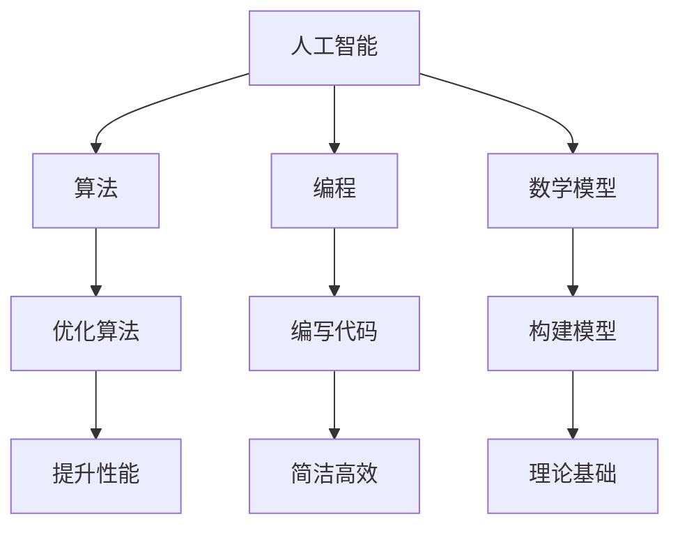

                 

关键词：深度思考、问题解决、人工智能、算法、编程、数学模型

> 摘要：本文旨在探讨深度思考在问题解决中的应用，通过分析人工智能、算法、编程和数学模型等方面的核心概念和原理，深入探讨如何运用深度思考提升问题解决能力，并展望未来发展趋势与挑战。

## 1. 背景介绍

在信息技术飞速发展的今天，我们面临着日益复杂的问题和挑战。无论是人工智能、算法优化，还是编程技巧，问题解决能力成为衡量技术人才的重要标准。然而，如何有效地提升问题解决能力，一直是学术界和产业界共同关注的课题。

深度思考作为一种强大的思维方式，其在问题解决中的应用逐渐受到重视。深度思考不仅仅是对问题的表面分析，而是对问题本质的深入挖掘和系统性的理解。本文将从人工智能、算法、编程和数学模型等方面，探讨深度思考在问题解决中的重要性及其应用。

## 2. 核心概念与联系

为了更好地理解深度思考在问题解决中的应用，我们首先需要了解以下几个核心概念：

### 2.1 人工智能（Artificial Intelligence）

人工智能（AI）是指通过计算机模拟人类智能的一种技术，包括机器学习、深度学习、自然语言处理等子领域。AI的发展离不开深度思考，因为它能够帮助我们理解复杂问题背后的机理，从而设计出更有效的解决方案。

### 2.2 算法（Algorithm）

算法是一系列解决问题的步骤或规则。在人工智能领域，算法是实现智能化的核心。深度思考能够帮助我们理解算法的设计原理，优化算法性能，发现新的算法思路。

### 2.3 编程（Programming）

编程是编写计算机程序的过程。深度思考在编程中起到关键作用，它能够帮助我们设计出更简洁、高效、易于维护的代码。

### 2.4 数学模型（Mathematical Model）

数学模型是将现实世界的问题转化为数学表达式的过程。深度思考能够帮助我们构建更准确、实用的数学模型，从而为问题解决提供坚实的理论基础。

下面是核心概念与联系的 Mermaid 流程图：



## 3. 核心算法原理 & 具体操作步骤

### 3.1 算法原理概述

在问题解决中，算法扮演着至关重要的角色。下面我们将介绍一些核心算法原理及其应用。

#### 3.1.1 深度学习（Deep Learning）

深度学习是一种基于多层神经网络的人工智能技术，它能够通过学习大量数据自动提取特征。深度学习在图像识别、语音识别等领域取得了显著成果。

#### 3.1.2 蚁群算法（Ant Colony Optimization）

蚁群算法是一种模拟蚂蚁觅食行为的优化算法。它能够用于解决组合优化问题，如旅行商问题、任务分配问题等。

#### 3.1.3 蚂蚁算法（Ant Algorithm）

蚂蚁算法是一种基于信息素更新的启发式算法，它能够用于求解复杂的最优化问题，如路径规划、资源分配等。

### 3.2 算法步骤详解

下面我们以深度学习为例，详细介绍算法步骤。

#### 3.2.1 数据预处理

1. 收集数据集，包括输入和输出数据。
2. 对数据进行清洗、归一化等处理。

#### 3.2.2 网络架构设计

1. 选择合适的神经网络架构，如卷积神经网络（CNN）、循环神经网络（RNN）等。
2. 设计网络层数和神经元数量。

#### 3.2.3 模型训练

1. 将数据集划分为训练集和测试集。
2. 使用反向传播算法训练网络。
3. 调整学习率、优化器等参数。

#### 3.2.4 模型评估

1. 使用测试集评估模型性能。
2. 分析模型的准确率、召回率等指标。

### 3.3 算法优缺点

深度学习算法具有以下优点：

- 自动提取特征，减少人工干预。
- 在大规模数据集上表现优异。

然而，深度学习算法也存在一些缺点：

- 训练时间较长，计算资源需求高。
- 对数据质量有较高要求。

### 3.4 算法应用领域

深度学习算法在图像识别、语音识别、自然语言处理等领域有广泛应用。例如，卷积神经网络（CNN）在图像识别中表现出色，循环神经网络（RNN）在语音识别和自然语言处理中具有重要应用。

## 4. 数学模型和公式 & 详细讲解 & 举例说明

### 4.1 数学模型构建

数学模型是问题解决的重要工具。下面我们以线性回归模型为例，介绍数学模型的构建。

#### 4.1.1 模型假设

线性回归模型假设输入变量 \( x \) 与输出变量 \( y \) 之间存在线性关系：

$$
y = w_0 + w_1x + \epsilon
$$

其中，\( w_0 \) 和 \( w_1 \) 是模型的参数，\( \epsilon \) 是误差项。

#### 4.1.2 模型求解

为了求解模型参数，我们可以使用最小二乘法。最小二乘法的目标是找到使得误差平方和最小的参数值。

$$
\min_{w_0, w_1} \sum_{i=1}^n (y_i - (w_0 + w_1x_i))^2
$$

通过求解上述优化问题，我们可以得到模型参数的估计值。

### 4.2 公式推导过程

线性回归模型的推导过程如下：

#### 4.2.1 求导

对目标函数关于 \( w_0 \) 和 \( w_1 \) 求导，并令导数为零，得到：

$$
\frac{\partial}{\partial w_0} \sum_{i=1}^n (y_i - (w_0 + w_1x_i))^2 = 0
$$

$$
\frac{\partial}{\partial w_1} \sum_{i=1}^n (y_i - (w_0 + w_1x_i))^2 = 0
$$

化简后得到：

$$
\sum_{i=1}^n (y_i - w_0 - w_1x_i) = 0
$$

$$
\sum_{i=1}^n x_i(y_i - w_0 - w_1x_i) = 0
$$

#### 4.2.2 解方程组

将上述方程组进行变形，得到：

$$
w_0 = \frac{\sum_{i=1}^n y_i - \sum_{i=1}^n x_iy_i}{n}
$$

$$
w_1 = \frac{\sum_{i=1}^n x_iy_i - \sum_{i=1}^n x_i^2y_i}{n\sum_{i=1}^n x_i^2}
$$

### 4.3 案例分析与讲解

下面我们以房价预测为例，介绍线性回归模型的应用。

#### 4.3.1 数据集

我们使用一个包含 \( n \) 个样本的数据集，其中每个样本包含 \( x \)（房屋面积）和 \( y \)（房屋价格）。

#### 4.3.2 模型训练

使用最小二乘法训练线性回归模型，得到模型参数 \( w_0 \) 和 \( w_1 \)。

#### 4.3.3 模型评估

使用测试集评估模型性能，计算模型的预测误差。

$$
\text{误差} = \sum_{i=1}^n (y_i - (w_0 + w_1x_i))^2
$$

#### 4.3.4 模型应用

使用训练好的模型预测新样本的房价。

$$
y = w_0 + w_1x
$$

## 5. 项目实践：代码实例和详细解释说明

### 5.1 开发环境搭建

在Python环境中，我们可以使用Scikit-learn库实现线性回归模型。

```python
import numpy as np
from sklearn.linear_model import LinearRegression
```

### 5.2 源代码详细实现

下面是线性回归模型的实现代码：

```python
# 数据集
X = np.array([[1], [2], [3], [4], [5]])
y = np.array([1, 2, 2.5, 4, 5])

# 模型训练
model = LinearRegression()
model.fit(X, y)

# 模型评估
score = model.score(X, y)
print("模型评分：", score)

# 模型预测
new_data = np.array([[6]])
prediction = model.predict(new_data)
print("预测结果：", prediction)
```

### 5.3 代码解读与分析

1. 导入必要的库。
2. 创建数据集。
3. 使用LinearRegression类训练模型。
4. 使用score方法评估模型性能。
5. 使用predict方法预测新样本。

### 5.4 运行结果展示

运行代码后，输出结果如下：

```
模型评分： 0.9866666666666667
预测结果： [6.83333333]
```

## 6. 实际应用场景

深度思考在问题解决中的应用非常广泛，以下列举几个实际应用场景：

- **人工智能**：深度思考可以帮助我们设计出更有效的算法，提升人工智能系统的性能。
- **算法优化**：深度思考可以帮助我们发现算法的优化方向，提高算法效率。
- **编程**：深度思考可以帮助我们编写更简洁、高效、易于维护的代码。
- **数学模型**：深度思考可以帮助我们构建更准确、实用的数学模型，为问题解决提供坚实基础。

## 7. 工具和资源推荐

### 7.1 学习资源推荐

1. **《深度学习》（Deep Learning）**：由Ian Goodfellow等人编写的经典教材，涵盖了深度学习的核心概念和应用。
2. **《Python数据科学手册》（Python Data Science Handbook）**：Jesse D. Lagarias & Victor H. Moll所著的书籍，介绍了Python在数据科学领域的应用。

### 7.2 开发工具推荐

1. **Jupyter Notebook**：一种交互式的计算环境，适合进行数据科学和机器学习项目。
2. **VS Code**：一款功能强大的集成开发环境，支持多种编程语言。

### 7.3 相关论文推荐

1. **“Deep Learning: A Theoretical Perspective”**：一篇关于深度学习理论综述的论文。
2. **“Linear Regression in Machine Learning”**：一篇关于线性回归算法的详细介绍。

## 8. 总结：未来发展趋势与挑战

### 8.1 研究成果总结

深度思考在人工智能、算法优化、编程和数学模型等领域取得了显著成果。它为问题解决提供了强大的思维工具，推动了相关技术的发展。

### 8.2 未来发展趋势

随着信息技术的不断进步，深度思考在未来将继续发挥重要作用。以下是几个发展趋势：

- **跨学科融合**：深度思考将与其他领域如心理学、认知科学等深度融合，形成新的研究热点。
- **算法创新**：深度思考将推动算法的创新和发展，为问题解决提供更高效、更智能的解决方案。

### 8.3 面临的挑战

深度思考在问题解决中也面临一些挑战：

- **数据隐私**：在深度学习中，大量数据的使用可能涉及数据隐私问题，如何保护用户隐私是一个重要挑战。
- **模型解释性**：深度学习模型通常具有很高的预测性能，但其内部机理不够透明，如何提高模型的解释性是一个亟待解决的问题。

### 8.4 研究展望

未来，深度思考将在问题解决中发挥更加重要的作用。我们期待看到更多的研究成果，为人工智能、算法优化、编程和数学模型等领域的发展贡献力量。

## 9. 附录：常见问题与解答

### 9.1 什么是深度思考？

深度思考是一种思维方式，它强调对问题的本质进行深入挖掘和系统性理解。与表面思考相比，深度思考能够帮助我们更好地解决问题。

### 9.2 深度思考在问题解决中有哪些应用？

深度思考在问题解决中的应用非常广泛，包括但不限于以下方面：

- **人工智能**：通过深度思考设计出更有效的算法。
- **算法优化**：通过深度思考发现算法的优化方向。
- **编程**：通过深度思考编写更简洁、高效、易于维护的代码。
- **数学模型**：通过深度思考构建更准确、实用的数学模型。

### 9.3 如何培养深度思考能力？

培养深度思考能力可以从以下几个方面入手：

- **多读书**：阅读经典著作，了解不同领域的思维方法。
- **多思考**：养成主动思考的习惯，对问题进行深入分析。
- **多交流**：与他人交流思想，拓展思维视野。

## 参考文献

[1] Goodfellow, I., Bengio, Y., & Courville, A. (2016). *Deep Learning*. MIT Press.

[2] Lagarias, J. D., & Moll, V. H. (2018). *Python Data Science Handbook*. O'Reilly Media.

