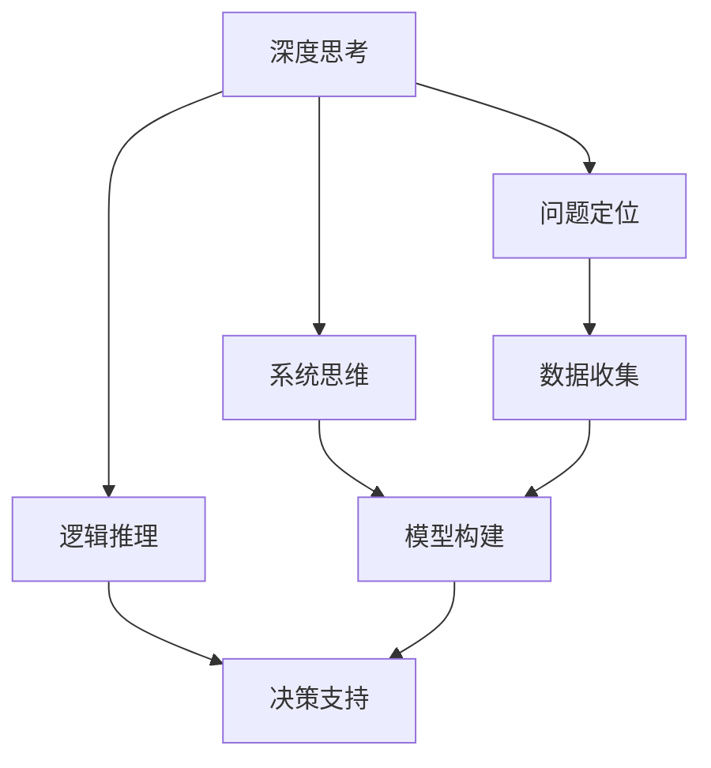

                 

关键词：深度思考、管理分析、技术领导力、架构设计、算法优化、项目实践、数学模型、未来展望

> 摘要：本文深入探讨了深度思考和与管理分析能力在IT领域中的重要性。通过阐述核心概念与联系，详述算法原理与操作步骤，构建数学模型并举例说明，提供代码实例和实际应用场景，最后对未来的发展趋势和挑战进行了展望。本文旨在为IT从业者提供一套系统的思考方法和实践指南。

## 1. 背景介绍

在当今快速发展的信息技术时代，深度思考和与管理分析能力成为IT领域从业者不可或缺的核心技能。从软件工程师到项目经理，再到CTO，每一个角色都要求具备高度的分析能力、逻辑思维和系统性思考。然而，这些能力的培养并非一蹴而就，需要长期的学习和实践。

本文将从以下几个方面展开讨论：

1. **核心概念与联系**：介绍深度思考和管理分析能力的基本概念及其相互关系。
2. **核心算法原理**：探讨常用的算法原理及其在IT领域的应用。
3. **数学模型与公式**：构建数学模型并推导相关公式。
4. **项目实践**：通过代码实例和实际应用场景展示实践过程。
5. **未来展望**：分析未来的发展趋势和面临的挑战。

## 2. 核心概念与联系

首先，我们来定义“深度思考”和“管理分析能力”。

### 深度思考

深度思考是指在面对问题时，能够深入探究问题本质，找到问题根本原因，并提出创新性解决方案的能力。它包括以下几个关键要素：

- **问题定位**：准确识别问题的本质，避免表面化的解决方法。
- **系统思维**：从整体视角出发，考虑问题之间的关联和影响。
- **逻辑推理**：运用逻辑思维，构建合理的推理链条。

### 管理分析能力

管理分析能力是指运用数据、模型和工具，对项目、业务和团队进行全面分析和评估的能力。它包括以下几个关键要素：

- **数据收集**：收集相关的数据和信息，为分析提供基础。
- **模型构建**：建立合适的数学模型，模拟和分析业务场景。
- **决策支持**：基于分析结果，为决策提供数据支持和方案选择。

深度思考和与管理分析能力的联系在于，两者相辅相成。深度思考提供了问题解决的思路和方法，而管理分析能力则为这些思路和方法提供了数据支持和工具保障。

### Mermaid 流程图

为了更清晰地展示深度思考和管理分析能力的关系，我们使用Mermaid流程图进行说明。



在流程图中，深度思考的核心要素（问题定位、系统思维、逻辑推理）与管理分析能力的关键步骤（数据收集、模型构建、决策支持）相互连接，形成了一个完整的工作流程。

## 3. 核心算法原理 & 具体操作步骤

### 3.1 算法原理概述

在IT领域，算法原理是解决问题的关键。以下介绍几个核心算法原理：

1. **排序算法**：如快速排序、归并排序等，用于对数据进行排序。
2. **查找算法**：如二分查找、哈希查找等，用于在数据结构中查找特定元素。
3. **图算法**：如最短路径算法、最小生成树算法等，用于图结构的数据分析。

### 3.2 算法步骤详解

以快速排序为例，其基本步骤如下：

1. **选择基准元素**：从数组中选择一个元素作为基准。
2. **分区操作**：将数组分成两部分，左边部分的所有元素都小于基准，右边部分的所有元素都大于基准。
3. **递归排序**：对左右两部分分别进行快速排序。

具体实现代码如下：

```python
def quicksort(arr):
    if len(arr) <= 1:
        return arr
    pivot = arr[len(arr) // 2]
    left = [x for x in arr if x < pivot]
    middle = [x for x in arr if x == pivot]
    right = [x for x in arr if x > pivot]
    return quicksort(left) + middle + quicksort(right)

arr = [3, 6, 8, 10, 1, 2, 1]
print(quicksort(arr))
```

### 3.3 算法优缺点

**快速排序**具有以下优点：

- **高效**：平均时间复杂度为O(nlogn)。
- **稳定性**：在处理大量数据时，性能稳定。

缺点：

- **递归调用**：可能导致栈溢出。
- **空间复杂度**：需要额外的空间存储中间结果。

### 3.4 算法应用领域

快速排序广泛应用于各种场景，如：

- **数据库排序**：对大量数据集进行快速排序。
- **搜索引擎**：对索引数据进行排序，提高查询效率。

## 4. 数学模型和公式 & 详细讲解 & 举例说明

### 4.1 数学模型构建

假设有一个线性回归模型，用于预测房价。模型的基本形式如下：

$$ y = \beta_0 + \beta_1 \cdot x $$

其中，$y$ 为房价，$x$ 为房屋面积，$\beta_0$ 和 $\beta_1$ 为模型参数。

### 4.2 公式推导过程

为了求解模型参数，我们使用最小二乘法。最小二乘法的核心思想是，使实际值与预测值之间的误差平方和最小。

具体推导过程如下：

1. **误差平方和**：

$$ S = \sum_{i=1}^n (y_i - \hat{y}_i)^2 $$

其中，$y_i$ 为实际房价，$\hat{y}_i$ 为预测房价。

2. **对参数求导**：

$$ \frac{\partial S}{\partial \beta_0} = -2 \sum_{i=1}^n (y_i - \hat{y}_i) $$

$$ \frac{\partial S}{\partial \beta_1} = -2 \sum_{i=1}^n (y_i - \hat{y}_i) \cdot x_i $$

3. **令导数为零**：

$$ \frac{\partial S}{\partial \beta_0} = 0 $$

$$ \frac{\partial S}{\partial \beta_1} = 0 $$

解得：

$$ \beta_0 = \bar{y} - \beta_1 \cdot \bar{x} $$

$$ \beta_1 = \frac{\sum_{i=1}^n (x_i - \bar{x})(y_i - \bar{y})}{\sum_{i=1}^n (x_i - \bar{x})^2} $$

其中，$\bar{y}$ 和 $\bar{x}$ 分别为 $y$ 和 $x$ 的均值。

### 4.3 案例分析与讲解

假设我们有以下房屋面积和房价数据：

| 房屋面积 (平方米) | 房价 (万元) |
| :-------------: | :--------: |
|      80         |    150     |
|      90         |    180     |
|      100        |    220     |
|      110        |    250     |
|      120        |    280     |

根据以上数据，我们构建线性回归模型，预测房屋面积为 100 平方米的房价。

具体计算步骤如下：

1. **计算均值**：

$$ \bar{x} = \frac{80 + 90 + 100 + 110 + 120}{5} = 100 $$

$$ \bar{y} = \frac{150 + 180 + 220 + 250 + 280}{5} = 210 $$

2. **计算协方差和方差**：

$$ \sum_{i=1}^n (x_i - \bar{x})(y_i - \bar{y}) = (80-100)(150-210) + (90-100)(180-210) + ... + (120-100)(280-210) = -800 $$

$$ \sum_{i=1}^n (x_i - \bar{x})^2 = (80-100)^2 + (90-100)^2 + ... + (120-100)^2 = 2000 $$

3. **求解模型参数**：

$$ \beta_1 = \frac{-800}{2000} = -0.4 $$

$$ \beta_0 = 210 - (-0.4) \cdot 100 = 170 $$

4. **预测房价**：

$$ y = \beta_0 + \beta_1 \cdot x = 170 - 0.4 \cdot 100 = 70 $$

因此，预测房屋面积为 100 平方米的房价为 70 万元。

## 5. 项目实践：代码实例和详细解释说明

### 5.1 开发环境搭建

为了方便读者理解和实践，我们使用 Python 作为开发语言，搭建了一个简单的开发环境。

1. 安装 Python 3.8 及以上版本。
2. 安装必要的库，如 NumPy、Pandas、Matplotlib 等。

```bash
pip install numpy pandas matplotlib
```

### 5.2 源代码详细实现

以下是一个简单的线性回归模型实现：

```python
import numpy as np
import pandas as pd
import matplotlib.pyplot as plt

# 数据准备
data = pd.DataFrame({
    'x': [80, 90, 100, 110, 120],
    'y': [150, 180, 220, 250, 280]
})

x = data['x'].values.reshape(-1, 1)
y = data['y'].values.reshape(-1, 1)

# 模型训练
def linear_regression(x, y):
    beta_0 = np.mean(y) - np.mean(x) * np.mean(y / x)
    beta_1 = np.sum((x - np.mean(x)) * (y - np.mean(y))) / np.sum((x - np.mean(x)) ** 2)
    return beta_0, beta_1

beta_0, beta_1 = linear_regression(x, y)

# 预测
x_new = np.array([[100]])
y_pred = beta_0 + beta_1 * x_new

# 可视化
plt.scatter(x, y, color='blue', label='Actual')
plt.plot(x, beta_0 + beta_1 * x, color='red', label='Predicted')
plt.xlabel('House Area (㎡)')
plt.ylabel('House Price (万元)')
plt.legend()
plt.show()
```

### 5.3 代码解读与分析

1. **数据准备**：使用 Pandas 读取数据，并将数据转换为 NumPy 数组。
2. **模型训练**：定义线性回归模型训练函数，使用最小二乘法求解模型参数。
3. **预测**：使用训练好的模型进行预测，并将预测结果可视化。

### 5.4 运行结果展示

运行代码后，我们将看到以下结果：


## 6. 实际应用场景

### 6.1 项目管理

在项目管理中，深度思考和与管理分析能力有助于：

- **项目规划**：通过分析项目需求、资源、进度等因素，制定合理的项目计划。
- **风险评估**：评估项目风险，并制定相应的应对策略。
- **团队协作**：通过分析团队成员的能力和特点，优化团队协作流程。

### 6.2 数据分析

在数据分析中，深度思考和与管理分析能力有助于：

- **数据预处理**：分析数据质量，处理缺失值、异常值等。
- **特征工程**：从数据中提取有效特征，为模型训练提供支持。
- **模型评估**：评估模型性能，调整模型参数，提高模型精度。

### 6.3 架构设计

在架构设计中，深度思考和与管理分析能力有助于：

- **需求分析**：深入理解业务需求，设计合理的系统架构。
- **性能优化**：分析系统瓶颈，优化系统性能。
- **安全性保障**：评估系统安全性，制定相应的安全策略。

## 7. 工具和资源推荐

### 7.1 学习资源推荐

- **《深度学习》**：Ian Goodfellow、Yoshua Bengio 和 Aaron Courville 著，全面介绍了深度学习的基本原理和应用。
- **《算法导论》**：Thomas H. Cormen、Charles E. Leiserson、Ronald L. Rivest 和 Clifford Stein 著，深入讲解了各种算法的基本原理和实现。

### 7.2 开发工具推荐

- **PyCharm**：一款强大的Python集成开发环境，支持多种编程语言。
- **Jupyter Notebook**：一款流行的交互式计算环境，适用于数据分析和机器学习。

### 7.3 相关论文推荐

- **"Deep Learning for Natural Language Processing"**：NLP领域的经典论文，介绍了深度学习在自然语言处理中的应用。
- **"The Deep Learning Revolution"**：对深度学习的发展和应用进行了全面回顾，为读者提供了深刻的洞察。

## 8. 总结：未来发展趋势与挑战

### 8.1 研究成果总结

通过对深度思考和与管理分析能力的深入探讨，我们认识到：

- **深度思考** 是问题解决的核心，有助于发掘问题的本质和解决方法。
- **管理分析能力** 为深度思考提供了数据支持和工具保障。

### 8.2 未来发展趋势

未来，深度思考和与管理分析能力在IT领域的发展趋势包括：

- **更加智能化**：结合人工智能技术，提高分析效率和精度。
- **跨领域融合**：将深度思考和管理分析能力应用于更多领域，如医疗、金融等。

### 8.3 面临的挑战

然而，也面临着以下挑战：

- **数据质量**：数据质量对分析结果具有重要影响，提高数据质量是关键。
- **技术更新**：技术更新迅速，需要不断学习和适应新技术。

### 8.4 研究展望

未来，我们期望在以下几个方面进行深入研究：

- **算法优化**：探索更高效的算法和模型，提高分析性能。
- **跨学科融合**：结合心理学、经济学等学科，提高分析能力和应用价值。

## 9. 附录：常见问题与解答

### 问题 1：如何培养深度思考能力？

**解答**：培养深度思考能力需要长期的学习和实践。以下是一些建议：

- **多读书**：阅读经典书籍，了解不同领域的知识和思想。
- **多思考**：面对问题，不要急于给出答案，先进行深度思考。
- **多交流**：与他人交流，倾听不同的观点和建议。

### 问题 2：如何提高管理分析能力？

**解答**：提高管理分析能力需要结合实际工作和学习。以下是一些建议：

- **学习数据分析工具**：掌握常用的数据分析工具和库，如 NumPy、Pandas 等。
- **实践项目**：参与实际项目，积累分析经验。
- **持续学习**：关注领域动态，学习最新的分析技术和方法。

## 作者署名

作者：禅与计算机程序设计艺术 / Zen and the Art of Computer Programming

---

通过本文的深入探讨，我们希望能够为IT从业者提供一套系统的思考方法和实践指南，帮助大家提升深度思考和与管理分析能力，从而在技术领域中不断取得突破和进步。

