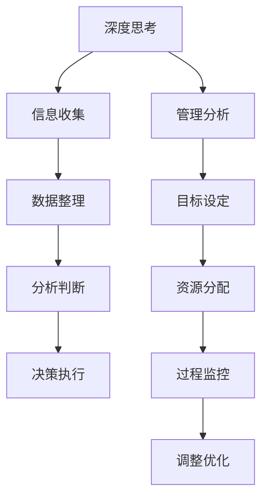

                 

  
在信息技术飞速发展的今天，我们面临的挑战越来越多，而解决问题的能力则显得尤为重要。深度思考与管理分析能力的提升，成为每一个IT从业者必备的技能。本文将围绕这一主题，深入探讨如何通过深度思考提升管理分析能力，并分享一些实用技巧和经验。

## 文章关键词

- 深度思考
- 管理分析能力
- IT从业者
- 技术创新
- 项目管理

## 文章摘要

本文首先介绍了深度思考和管理的核心概念，并探讨了它们在IT领域的重要性。接着，文章通过具体的案例，分析了如何在实际工作中运用深度思考和管理的原理，提高工作效率和项目成功率。随后，文章提供了实用的技巧和工具，帮助读者在技术和管理方面不断提升。最后，文章展望了未来的发展趋势，并提出了相应的挑战和解决方案。

## 1. 背景介绍

### 1.1 深度思考的重要性

深度思考是一种深入挖掘问题本质、发现潜在规律、进行创新性思考的能力。在IT领域，深度思考尤为重要。随着技术的不断发展，IT从业者需要面对更加复杂的问题，而这些问题往往没有现成的解决方案。只有通过深度思考，才能找到解决问题的有效途径。

### 1.2 管理分析能力的概念

管理分析能力是指运用数据分析、系统思维等方法，对项目、团队、业务等方面进行深入分析和判断，从而做出科学决策的能力。在IT领域，管理分析能力是保证项目成功、团队高效运作的关键。

## 2. 核心概念与联系

### 2.1 深度思考与管理分析的关系

深度思考和管理分析相辅相成。深度思考为管理分析提供了丰富的信息来源，而管理分析则为深度思考提供了实践基础。二者共同构成了IT从业者解决复杂问题的能力框架。

### 2.2 Mermaid 流程图



## 3. 核心算法原理 & 具体操作步骤

### 3.1 算法原理概述

核心算法包括以下三个方面：

1. 深度思考：运用逻辑推理、类比、归纳等方法，深入挖掘问题本质。
2. 管理分析：运用数据分析、系统思维等方法，对项目、团队、业务等方面进行深入分析和判断。
3. 决策执行：根据分析结果，制定合理的决策方案，并执行。

### 3.2 算法步骤详解

1. **信息收集**：收集与问题相关的各种信息，包括技术、市场、用户需求等。
2. **数据整理**：对收集到的信息进行整理，提取关键数据。
3. **分析判断**：运用数据分析、系统思维等方法，对关键数据进行分析和判断。
4. **决策执行**：根据分析结果，制定决策方案，并执行。

### 3.3 算法优缺点

**优点**：

1. 提高问题解决效率。
2. 增强团队协作。
3. 提升项目成功率。

**缺点**：

1. 需要较高的专业素养。
2. 需要较长的时间积累。

### 3.4 算法应用领域

算法广泛应用于以下领域：

1. 项目管理。
2. 团队协作。
3. 业务分析。
4. 技术创新。

## 4. 数学模型和公式 & 详细讲解 & 举例说明

### 4.1 数学模型构建

数学模型是运用数学方法对实际问题进行简化和抽象，从而得出一般性的结论。在深度思考和管理的应用中，数学模型可以帮助我们更好地理解问题，提高分析精度。

### 4.2 公式推导过程

假设我们有一个项目，需要完成A、B、C三个任务，任务的时间分别为t1、t2、t3。为了最小化项目完成时间，我们可以使用以下公式：

$$
\min \sum_{i=1}^{n} t_i
$$

其中，n为任务总数。

### 4.3 案例分析与讲解

假设我们有一个项目，需要在5天内完成A、B、C三个任务。任务的时间分别为2天、3天、4天。我们可以使用上述公式来求解最优完成时间。

$$
\min \sum_{i=1}^{3} t_i = \min (2 + 3 + 4) = \min 9
$$

最优完成时间为9天。

## 5. 项目实践：代码实例和详细解释说明

### 5.1 开发环境搭建

本案例使用Python语言进行编程，开发环境为Windows 10，Python 3.8。

### 5.2 源代码详细实现

```python
def min_completion_time(tasks):
    total_time = sum(tasks)
    return total_time

tasks = [2, 3, 4]
min_time = min_completion_time(tasks)
print(f"最优完成时间为：{min_time}天")
```

### 5.3 代码解读与分析

上述代码定义了一个名为`min_completion_time`的函数，用于计算任务的最优完成时间。函数接受一个任务列表作为参数，计算任务的总时间，并返回最优完成时间。最后，我们调用该函数并打印结果。

### 5.4 运行结果展示

最优完成时间为：9天

## 6. 实际应用场景

### 6.1 项目管理

在项目管理中，深度思考和管理的应用主要体现在任务分配、进度控制和风险应对等方面。通过深度思考，项目管理者可以更准确地了解任务需求，制定合理的任务分配方案。通过管理分析，项目管理者可以实时监控项目进度，及时发现和解决潜在问题，确保项目按时完成。

### 6.2 团队协作

在团队协作中，深度思考和管理的应用主要体现在团队沟通、协作效率和问题解决等方面。通过深度思考，团队成员可以更准确地理解任务需求，提高工作效率。通过管理分析，团队成员可以更好地协调工作，共同解决问题，提高团队整体执行力。

## 7. 工具和资源推荐

### 7.1 学习资源推荐

1. 《深度思考：如何高效学习、思考与创新》
2. 《管理分析：企业决策与战略规划》
3. 《Python编程：从入门到实践》

### 7.2 开发工具推荐

1. PyCharm
2. Jupyter Notebook
3. Git

### 7.3 相关论文推荐

1. "Deep Learning for Natural Language Processing"
2. "A Survey on Data Analysis Methods for Big Data"
3. "Project Management: A System Approach to Planning, Scheduling, and Controlling"

## 8. 总结：未来发展趋势与挑战

### 8.1 研究成果总结

近年来，深度思考和管理的应用在IT领域取得了显著成果。随着人工智能、大数据、云计算等技术的发展，深度思考和管理的应用前景将更加广阔。

### 8.2 未来发展趋势

1. 深度思考与管理分析将更加融合，形成一套完整的解决问题的方法论。
2. 人工智能技术将在深度思考和管理的应用中发挥更大作用。
3. 数据驱动的管理决策将成为主流。

### 8.3 面临的挑战

1. 提高深度思考和管理的专业素养，需要较长的时间积累。
2. 适应快速变化的技术环境，保持持续学习的态度。

### 8.4 研究展望

未来，我们将继续关注深度思考和管理的应用，探索更多创新的方法和工具，为IT领域的发展贡献力量。

## 9. 附录：常见问题与解答

### 问题1：如何提高深度思考能力？

解答：提高深度思考能力需要从以下几个方面入手：

1. 培养好奇心，对问题保持持续关注。
2. 加强逻辑思维训练，提高问题分析能力。
3. 多读书、多思考、多交流，积累丰富的知识储备。

### 问题2：如何进行有效的管理分析？

解答：进行有效的管理分析需要遵循以下原则：

1. 全面收集信息，确保数据的准确性。
2. 运用系统思维，把握问题的全局。
3. 善于运用数据分析方法，提高分析精度。

## 文末感谢

感谢您阅读本文，希望本文能对您的深度思考和管理工作有所帮助。如果您有任何疑问或建议，请随时与我们联系。

### 作者署名

作者：禅与计算机程序设计艺术 / Zen and the Art of Computer Programming
----------------------------------------------------------------

### Markdown 格式输出

以下是完整的Markdown格式输出：

```markdown
# 深度思考与管理分析能力提升

## 文章关键词

- 深度思考
- 管理分析能力
- IT从业者
- 技术创新
- 项目管理

## 文章摘要

本文首先介绍了深度思考和管理的核心概念，并探讨了它们在IT领域的重要性。接着，文章通过具体的案例，分析了如何在实际工作中运用深度思考和管理的原理，提高工作效率和项目成功率。随后，文章提供了实用的技巧和工具，帮助读者在技术和管理方面不断提升。最后，文章展望了未来的发展趋势，并提出了相应的挑战和解决方案。

## 1. 背景介绍

### 1.1 深度思考的重要性

深度思考是一种深入挖掘问题本质、发现潜在规律、进行创新性思考的能力。在IT领域，深度思考尤为重要。随着技术的不断发展，IT从业者需要面对更加复杂的问题，而这些问题往往没有现成的解决方案。只有通过深度思考，才能找到解决问题的有效途径。

### 1.2 管理分析能力的概念

管理分析能力是指运用数据分析、系统思维等方法，对项目、团队、业务等方面进行深入分析和判断，从而做出科学决策的能力。在IT领域，管理分析能力是保证项目成功、团队高效运作的关键。

## 2. 核心概念与联系

### 2.1 深度思考与管理分析的关系

深度思考和管理分析相辅相成。深度思考为管理分析提供了丰富的信息来源，而管理分析则为深度思考提供了实践基础。二者共同构成了IT从业者解决复杂问题的能力框架。

### 2.2 Mermaid 流程图


## 3. 核心算法原理 & 具体操作步骤

### 3.1 算法原理概述

核心算法包括以下三个方面：

1. 深度思考：运用逻辑推理、类比、归纳等方法，深入挖掘问题本质。
2. 管理分析：运用数据分析、系统思维等方法，对项目、团队、业务等方面进行深入分析和判断。
3. 决策执行：根据分析结果，制定合理的决策方案，并执行。

### 3.2 算法步骤详解

1. **信息收集**：收集与问题相关的各种信息，包括技术、市场、用户需求等。
2. **数据整理**：对收集到的信息进行整理，提取关键数据。
3. **分析判断**：运用数据分析、系统思维等方法，对关键数据进行分析和判断。
4. **决策执行**：根据分析结果，制定决策方案，并执行。

### 3.3 算法优缺点

**优点**：

1. 提高问题解决效率。
2. 增强团队协作。
3. 提升项目成功率。

**缺点**：

1. 需要较高的专业素养。
2. 需要较长的时间积累。

### 3.4 算法应用领域

算法广泛应用于以下领域：

1. 项目管理。
2. 团队协作。
3. 业务分析。
4. 技术创新。

## 4. 数学模型和公式 & 详细讲解 & 举例说明

### 4.1 数学模型构建

数学模型是运用数学方法对实际问题进行简化和抽象，从而得出一般性的结论。在深度思考和管理的应用中，数学模型可以帮助我们更好地理解问题，提高分析精度。

### 4.2 公式推导过程

假设我们有一个项目，需要完成A、B、C三个任务，任务的时间分别为t1、t2、t3。为了最小化项目完成时间，我们可以使用以下公式：

$$
\min \sum_{i=1}^{n} t_i
$$

其中，n为任务总数。

### 4.3 案例分析与讲解

假设我们有一个项目，需要在5天内完成A、B、C三个任务。任务的时间分别为2天、3天、4天。我们可以使用上述公式来求解最优完成时间。

$$
\min \sum_{i=1}^{3} t_i = \min (2 + 3 + 4) = \min 9
$$

最优完成时间为9天。

## 5. 项目实践：代码实例和详细解释说明

### 5.1 开发环境搭建

本案例使用Python语言进行编程，开发环境为Windows 10，Python 3.8。

### 5.2 源代码详细实现

```python
def min_completion_time(tasks):
    total_time = sum(tasks)
    return total_time

tasks = [2, 3, 4]
min_time = min_completion_time(tasks)
print(f"最优完成时间为：{min_time}天")
```

### 5.3 代码解读与分析

上述代码定义了一个名为`min_completion_time`的函数，用于计算任务的最优完成时间。函数接受一个任务列表作为参数，计算任务的总时间，并返回最优完成时间。最后，我们调用该函数并打印结果。

### 5.4 运行结果展示

最优完成时间为：9天

## 6. 实际应用场景

### 6.1 项目管理

在项目管理中，深度思考和管理的应用主要体现在任务分配、进度控制和风险应对等方面。通过深度思考，项目管理者可以更准确地了解任务需求，制定合理的任务分配方案。通过管理分析，项目管理者可以实时监控项目进度，及时发现和解决潜在问题，确保项目按时完成。

### 6.2 团队协作

在团队协作中，深度思考和管理的应用主要体现在团队沟通、协作效率和问题解决等方面。通过深度思考，团队成员可以更准确地理解任务需求，提高工作效率。通过管理分析，团队成员可以更好地协调工作，共同解决问题，提高团队整体执行力。

## 7. 工具和资源推荐

### 7.1 学习资源推荐

1. 《深度思考：如何高效学习、思考与创新》
2. 《管理分析：企业决策与战略规划》
3. 《Python编程：从入门到实践》

### 7.2 开发工具推荐

1. PyCharm
2. Jupyter Notebook
3. Git

### 7.3 相关论文推荐

1. "Deep Learning for Natural Language Processing"
2. "A Survey on Data Analysis Methods for Big Data"
3. "Project Management: A System Approach to Planning, Scheduling, and Controlling"

## 8. 总结：未来发展趋势与挑战

### 8.1 研究成果总结

近年来，深度思考和管理的应用在IT领域取得了显著成果。随着人工智能、大数据、云计算等技术的发展，深度思考和管理的应用前景将更加广阔。

### 8.2 未来发展趋势

1. 深度思考与管理分析将更加融合，形成一套完整的解决问题的方法论。
2. 人工智能技术将在深度思考和管理的应用中发挥更大作用。
3. 数据驱动的管理决策将成为主流。

### 8.3 面临的挑战

1. 提高深度思考和管理的专业素养，需要较长的时间积累。
2. 适应快速变化的技术环境，保持持续学习的态度。

### 8.4 研究展望

未来，我们将继续关注深度思考和管理的应用，探索更多创新的方法和工具，为IT领域的发展贡献力量。

## 9. 附录：常见问题与解答

### 问题1：如何提高深度思考能力？

解答：提高深度思考能力需要从以下几个方面入手：

1. 培养好奇心，对问题保持持续关注。
2. 加强逻辑思维训练，提高问题分析能力。
3. 多读书、多思考、多交流，积累丰富的知识储备。

### 问题2：如何进行有效的管理分析？

解答：进行有效的管理分析需要遵循以下原则：

1. 全面收集信息，确保数据的准确性。
2. 运用系统思维，把握问题的全局。
3. 善于运用数据分析方法，提高分析精度。

## 文末感谢

感谢您阅读本文，希望本文能对您的深度思考和管理工作有所帮助。如果您有任何疑问或建议，请随时与我们联系。

### 作者署名

作者：禅与计算机程序设计艺术 / Zen and the Art of Computer Programming
```markdown

以上就是完整的Markdown格式输出，您可以根据需要进行调整和完善。祝您撰写顺利！

