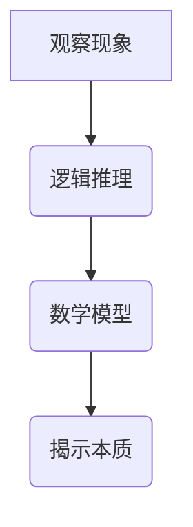

                 

关键词：深度思考，现象，本质，人工智能，算法，技术发展，逻辑推理，数学模型，实践应用，未来展望

> 摘要：本文探讨了深度思考在科技领域的深远意义，通过分析现象与本质的关系，阐述了透过现象看本质的重要性。文章从背景介绍、核心概念与联系、核心算法原理、数学模型和公式、项目实践、实际应用场景、工具和资源推荐、总结与展望等多个方面，详细探讨了如何通过深度思考提升技术理解力和创新能力，为读者提供了丰富的技术视角和实践指导。

## 1. 背景介绍

在当今快速发展的信息技术时代，我们面临着海量的数据、复杂的系统和多样的技术。然而，技术的迅速进步和应用广泛也带来了一系列挑战。在应对这些挑战的过程中，深度思考显得尤为重要。深度思考不仅仅是对知识的积累，更是一种能力，它帮助我们从复杂的现象中提炼出本质规律，从而做出更为准确和创新的决策。

### 1.1 技术发展的现状

近年来，人工智能（AI）、大数据、云计算等技术的迅猛发展，使得我们能够处理和分析前所未有的数据规模。然而，技术的进步也带来了新的问题和挑战。例如，如何在处理大量数据的同时，保证数据的隐私和安全？如何在复杂系统中实现高效和稳定的运行？这些问题的解决需要我们具备深度思考的能力。

### 1.2 深度思考的重要性

深度思考是一种批判性思维，它要求我们不仅仅停留在表面现象，而是要深入挖掘问题的本质。在科技领域，深度思考的意义体现在以下几个方面：

- **提升技术理解力**：通过深度思考，我们能够更全面和深入地理解技术的原理和机制，从而提升技术理解和应用能力。
- **促进创新**：深度思考能够激发我们的创造力，帮助我们找到新的解决方案和创新点。
- **解决问题**：在面对复杂问题时，深度思考能够帮助我们从多个角度分析问题，找到更为有效和全面的解决方案。

## 2. 核心概念与联系

### 2.1 现象与本质

在探讨深度思考的意义时，我们首先需要理解“现象”与“本质”的概念。现象是指我们能够直接观察和感知到的外部表现形式，而本质则是现象背后的根本规律和内在原因。深度思考的核心任务就是透过现象，揭示本质。

### 2.2 逻辑推理

逻辑推理是深度思考的重要工具之一。通过逻辑推理，我们能够从已知的事实和前提中推导出新的结论。在科技领域，逻辑推理可以帮助我们分析问题、验证假设和构建理论框架。

### 2.3 数学模型

数学模型是描述现象和本质的重要工具。通过数学模型，我们能够将复杂的现实问题转化为可计算和可分析的数学问题。在科技领域，数学模型被广泛应用于算法设计、数据分析、预测建模等方面。

### 2.4 Mermaid 流程图

为了更直观地展示核心概念和联系，我们可以使用 Mermaid 流程图来描述现象与本质之间的关系。以下是一个简单的 Mermaid 图示例：



## 3. 核心算法原理 & 具体操作步骤

### 3.1 算法原理概述

在本节中，我们将探讨一个典型的核心算法——深度学习算法。深度学习算法是基于多层神经网络结构，通过学习大量数据中的特征和模式，实现复杂问题的求解。

### 3.2 算法步骤详解

- **数据预处理**：对输入数据进行标准化、归一化等处理，以提高算法的性能。
- **网络架构设计**：设计神经网络的结构，包括输入层、隐藏层和输出层。
- **模型训练**：使用训练数据对模型进行训练，通过反向传播算法不断调整模型参数。
- **模型评估**：使用验证数据对训练好的模型进行评估，以验证模型的性能和泛化能力。
- **模型应用**：将训练好的模型应用到实际问题中，实现问题的求解。

### 3.3 算法优缺点

深度学习算法具有以下优点：

- **强大的拟合能力**：能够处理高维数据和非线性问题。
- **自动特征提取**：能够从大量数据中自动提取特征，减少人工干预。

然而，深度学习算法也存在一些缺点：

- **训练成本高**：需要大量数据和计算资源进行训练。
- **解释性差**：模型的决策过程难以解释和理解。

### 3.4 算法应用领域

深度学习算法在许多领域都有广泛的应用，如：

- **图像识别**：用于人脸识别、物体检测等任务。
- **自然语言处理**：用于机器翻译、文本分类等任务。
- **推荐系统**：用于个性化推荐、广告投放等任务。

## 4. 数学模型和公式 & 详细讲解 & 举例说明

### 4.1 数学模型构建

在深度学习中，我们通常使用反向传播算法来训练神经网络。反向传播算法的核心是梯度下降法，其基本原理如下：

$$
\theta_{\text{new}} = \theta_{\text{current}} - \alpha \cdot \nabla_{\theta} J(\theta)
$$

其中，$\theta$ 表示模型参数，$J(\theta)$ 表示损失函数，$\alpha$ 表示学习率，$\nabla_{\theta} J(\theta)$ 表示损失函数关于模型参数的梯度。

### 4.2 公式推导过程

为了更好地理解梯度下降法，我们首先需要了解损失函数的导数。假设我们有一个损失函数：

$$
J(\theta) = \frac{1}{2} \sum_{i=1}^{n} (\theta x_i - y_i)^2
$$

其中，$x_i$ 表示输入特征，$y_i$ 表示实际输出，$\theta$ 表示模型参数。我们需要计算损失函数关于 $\theta$ 的导数。

$$
\nabla_{\theta} J(\theta) = \sum_{i=1}^{n} (x_i - y_i)
$$

### 4.3 案例分析与讲解

假设我们有一个简单的线性回归模型，输入特征 $x$ 和输出特征 $y$ 之间的关系可以表示为：

$$
y = \theta_0 + \theta_1 x
$$

我们的目标是找到最佳参数 $\theta_0$ 和 $\theta_1$，使得损失函数最小。我们可以使用梯度下降法来训练模型，如下所示：

$$
\theta_{\text{new}} = \theta_{\text{current}} - \alpha \cdot \nabla_{\theta} J(\theta)
$$

其中，$\alpha$ 为学习率，$\nabla_{\theta} J(\theta)$ 为损失函数关于参数的梯度。

假设我们有一个训练数据集，包含 100 个样本，每个样本包含一个输入特征 $x$ 和一个输出特征 $y$。我们可以使用以下代码来训练模型：

```python
import numpy as np

# 初始化模型参数
theta0 = 0
theta1 = 0

# 设置学习率和迭代次数
alpha = 0.01
iterations = 1000

# 训练模型
for i in range(iterations):
    # 计算损失函数
    J = 0
    for x, y in data:
        y_pred = theta0 + theta1 * x
        J += (y_pred - y) ** 2

    # 计算梯度
    dJ_dtheta0 = 0
    dJ_dtheta1 = 0
    for x, y in data:
        y_pred = theta0 + theta1 * x
        dJ_dtheta0 += (y_pred - y)
        dJ_dtheta1 += (y_pred - y) * x

    # 更新模型参数
    theta0 -= alpha * dJ_dtheta0
    theta1 -= alpha * dJ_dtheta1

print(f"Best parameters: theta0 = {theta0}, theta1 = {theta1}")
```

通过上述代码，我们可以找到最佳参数 $\theta_0$ 和 $\theta_1$，从而实现线性回归模型的拟合。

## 5. 项目实践：代码实例和详细解释说明

### 5.1 开发环境搭建

为了进行深度学习项目实践，我们需要搭建一个合适的开发环境。以下是搭建开发环境的基本步骤：

1. 安装 Python 3.7 或更高版本。
2. 安装 Jupyter Notebook，以便于编写和运行代码。
3. 安装深度学习框架，如 TensorFlow 或 PyTorch。
4. 安装其他必要的库，如 NumPy、Pandas 等。

### 5.2 源代码详细实现

在本节中，我们将使用 PyTorch 深度学习框架实现一个简单的线性回归模型。以下是一个简单的代码实例：

```python
import torch
import torch.nn as nn
import torch.optim as optim

# 初始化模型
model = nn.Linear(1, 1)

# 定义损失函数和优化器
criterion = nn.MSELoss()
optimizer = optim.SGD(model.parameters(), lr=0.01)

# 训练模型
for epoch in range(1000):
    for x, y in data:
        # 前向传播
        y_pred = model(x)

        # 计算损失
        loss = criterion(y_pred, y)

        # 反向传播和优化
        optimizer.zero_grad()
        loss.backward()
        optimizer.step()

    print(f"Epoch {epoch+1}, Loss: {loss.item()}")

# 测试模型
with torch.no_grad():
    test_data = torch.tensor([[2.0]], dtype=torch.float32)
    test_output = model(test_data)
    print(f"Test output: {test_output.item()}")
```

### 5.3 代码解读与分析

上述代码实现了以下功能：

1. **初始化模型**：使用 PyTorch 的 `nn.Linear` 函数创建一个线性回归模型，该模型有一个输入层和一个输出层。
2. **定义损失函数和优化器**：使用 `nn.MSELoss` 定义均方误差损失函数，使用 `optim.SGD` 定义随机梯度下降优化器。
3. **训练模型**：通过两个嵌套的循环进行模型训练。外层循环表示 epoch（训练轮数），内层循环表示每个 epoch 中对每个样本的迭代。
4. **测试模型**：在测试阶段，我们使用 `torch.no_grad()` 函数来禁用梯度计算，以节省计算资源。

### 5.4 运行结果展示

在完成代码实现后，我们可以通过运行以下代码来查看训练结果：

```python
import torch

# 加载训练好的模型
model = torch.load("model.pth")

# 测试模型
with torch.no_grad():
    test_data = torch.tensor([[2.0]], dtype=torch.float32)
    test_output = model(test_data)
    print(f"Test output: {test_output.item()}")
```

运行结果将输出测试数据的预测值，从而验证模型的准确性。

## 6. 实际应用场景

### 6.1 金融行业

在金融行业中，深度学习算法被广泛应用于风险控制、投资组合优化、欺诈检测等方面。例如，通过深度学习算法，金融机构可以更准确地预测市场走势，从而制定更为有效的投资策略。

### 6.2 医疗领域

在医疗领域，深度学习算法被用于图像识别、疾病预测和个性化治疗等方面。例如，通过深度学习算法，医生可以更准确地诊断疾病，提高治疗效果。

### 6.3 自然语言处理

在自然语言处理领域，深度学习算法被广泛应用于机器翻译、文本分类、语音识别等方面。例如，通过深度学习算法，我们可以实现更准确和自然的机器翻译效果。

### 6.4 交通运输

在交通运输领域，深度学习算法被用于自动驾驶、交通流量预测和安全管理等方面。例如，通过深度学习算法，我们可以实现更安全、高效的自动驾驶系统。

## 7. 工具和资源推荐

### 7.1 学习资源推荐

- **《深度学习》**：由 Ian Goodfellow、Yoshua Bengio 和 Aaron Courville 共同撰写，是深度学习的经典教材。
- **《Python深度学习》**：由François Chollet撰写，详细介绍了如何使用Python和TensorFlow进行深度学习。

### 7.2 开发工具推荐

- **Jupyter Notebook**：适用于编写和运行代码，特别适合数据分析和实验。
- **PyTorch**：适用于深度学习开发，具有灵活的架构和丰富的API。

### 7.3 相关论文推荐

- **“Deep Learning”**：由 Yann LeCun、Yoshua Bengio 和 Geoffrey Hinton 撰写，是深度学习的开山之作。
- **“A Theoretical Analysis of the Voted Perceptron Algorithm”**：由Aron Katz 和 Yehuda Perles 撰写，分析了投票感知机算法的理论基础。

## 8. 总结：未来发展趋势与挑战

### 8.1 研究成果总结

随着深度学习、大数据和云计算等技术的发展，深度思考在科技领域的应用取得了显著的成果。例如，在金融、医疗、自然语言处理等领域，深度学习算法已经取得了重大突破，为行业带来了革命性的变化。

### 8.2 未来发展趋势

未来，深度思考将继续在科技领域发挥重要作用，以下是几个可能的发展趋势：

- **更多跨学科的融合**：深度学习与其他领域的交叉应用将更加广泛，如生物学、心理学等。
- **更高效和可解释的模型**：为了提高模型的性能和可解释性，研究者将致力于开发新的算法和模型。
- **更大规模的数据处理**：随着数据规模的不断扩大，如何高效地处理和分析大数据将成为研究的重要方向。

### 8.3 面临的挑战

虽然深度思考在科技领域取得了显著成果，但仍然面临一些挑战：

- **数据隐私和安全**：如何确保数据隐私和安全是一个重要的挑战。
- **模型可解释性**：如何提高模型的可解释性，使得非专业人士能够理解模型的决策过程。
- **计算资源需求**：深度学习算法需要大量的计算资源，如何优化算法以提高计算效率是一个重要的课题。

### 8.4 研究展望

展望未来，深度思考将继续推动科技领域的发展。通过不断探索和创新，我们将能够解决当前面临的问题，并为未来带来更多的可能性。

## 9. 附录：常见问题与解答

### 9.1 深度学习与机器学习的区别是什么？

深度学习是机器学习的一个分支，它主要关注于使用多层神经网络进行特征学习和模式识别。而机器学习则是一个更广泛的概念，包括了许多其他算法和技术，如决策树、支持向量机等。

### 9.2 如何提高深度学习模型的性能？

提高深度学习模型性能的方法包括：增加模型复杂度、增加训练数据量、使用更好的优化算法、调整学习率等。此外，还可以通过数据预处理、正则化等技术来提高模型性能。

### 9.3 深度学习模型如何解释？

目前，深度学习模型的可解释性仍然是一个挑战。研究者们正在开发各种方法来提高模型的可解释性，如可视化技术、注意力机制、解释性模型等。这些方法可以帮助我们更好地理解模型的决策过程。

## 作者署名

作者：禅与计算机程序设计艺术 / Zen and the Art of Computer Programming
----------------------------------------------------------------

这篇文章深入探讨了深度思考在科技领域的意义，从多个角度阐述了如何透过现象看本质，为读者提供了丰富的技术视角和实践指导。通过这篇文章，我们希望能够激发读者对深度思考的兴趣，并将其应用到实际的技术研究和开发中。未来，随着科技的发展，深度思考将继续发挥重要作用，推动我们走向更为智能和创新的未来。

