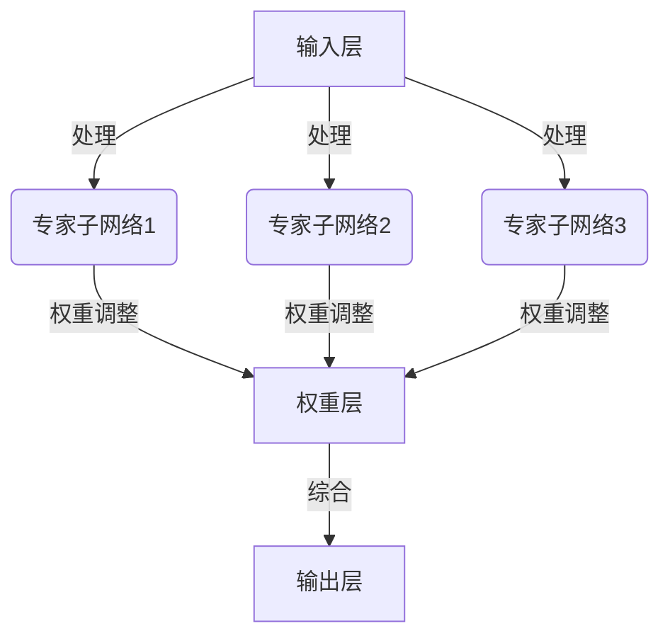

                 

关键词：混合专家模型、大语言模型、效率提升、分布式计算、神经网络架构

本文摘要：随着深度学习在自然语言处理领域的广泛应用，大规模语言模型的性能和效率成为关键问题。混合专家模型（MoE，Mixture of Experts）作为一种新颖的神经网络架构，通过将模型分解为多个专家子网络，实现了对计算资源的高效利用，有效提升了大规模语言模型的推理速度和训练效率。本文将对混合专家模型的基本概念、原理、算法步骤、数学模型及实际应用进行深入探讨，并展望其在未来的发展趋势。

## 1. 背景介绍

近年来，深度学习技术取得了显著进展，尤其在自然语言处理（NLP）领域，大规模语言模型如GPT、BERT等极大地推动了AI技术的发展。然而，随着模型规模的不断扩大，模型的计算成本和存储需求也急剧增加，给实际应用带来了挑战。为了解决这一问题，研究者们提出了多种优化方法，其中混合专家模型（MoE）成为一种备受关注的新方向。

混合专家模型通过将模型分解为多个专家子网络，每个子网络专注于模型的一部分任务，从而实现分布式计算。这一架构不仅提高了模型的处理速度，还降低了训练和推理的计算成本。本文将详细介绍混合专家模型的工作原理、算法步骤及其在实际应用中的效果。

### 1.1 大规模语言模型的挑战

大规模语言模型在训练过程中面临着以下几个挑战：

- **计算成本高**：随着模型规模的扩大，训练时间显著增加，所需的计算资源也呈指数级增长。
- **存储需求大**：模型的参数数量庞大，导致存储需求增加，给存储系统带来压力。
- **推理速度慢**：大规模模型在推理时需要大量的计算资源，导致响应时间延长。

### 1.2 混合专家模型的优势

混合专家模型通过以下优势解决了大规模语言模型的挑战：

- **分布式计算**：将模型分解为多个专家子网络，每个子网络独立运行，减少了计算资源的消耗。
- **效率提升**：通过并行计算，提高了模型的处理速度。
- **资源利用率高**：专家子网络可以灵活地根据任务需求调整计算资源，提高了资源利用率。

## 2. 核心概念与联系

### 2.1 核心概念

**混合专家模型（MoE）**：是一种基于分布式计算的神经网络架构，将模型分解为多个专家子网络，每个专家子网络独立完成一部分任务，通过权重分配实现整体模型的推理。

**专家子网络**：是混合专家模型的基本单元，负责处理模型的一部分输入，输出对应的结果。

**权重分配**：根据输入数据的重要性和子网络的性能，动态调整每个子网络的权重，以优化整体模型的表现。

### 2.2 架构原理

混合专家模型的架构可以分为以下几个部分：

- **输入层**：接收外部输入数据。
- **专家子网络**：对输入数据进行处理，输出中间结果。
- **权重层**：根据子网络的性能动态调整权重。
- **输出层**：综合各个子网络的输出结果，生成最终输出。

### 2.3 Mermaid 流程图

以下是一个简化的混合专家模型的 Mermaid 流程图：



### 2.4 核心概念与联系总结

混合专家模型通过分布式计算和权重分配实现了对大规模语言模型的优化。专家子网络负责处理模型的一部分任务，通过动态调整权重，实现了整体模型的协同工作，从而提高了模型的效率。

## 3. 核心算法原理 & 具体操作步骤

### 3.1 算法原理概述

混合专家模型的核心思想是将大规模语言模型分解为多个专家子网络，通过分布式计算和权重分配实现高效推理。具体来说，混合专家模型包括以下几个关键步骤：

1. **子网络划分**：将大规模语言模型分解为多个专家子网络，每个子网络负责处理输入数据的一部分。
2. **权重分配**：根据输入数据的重要性和子网络的性能，动态调整每个子网络的权重。
3. **分布式计算**：并行执行各个专家子网络的推理过程，提高模型处理速度。
4. **结果整合**：综合各个专家子网络的输出结果，生成最终输出。

### 3.2 算法步骤详解

**3.2.1 子网络划分**

子网络划分是混合专家模型的第一步，其核心目标是根据输入数据的特征和模型的规模，将大规模语言模型分解为多个专家子网络。具体操作如下：

1. **数据预处理**：对输入数据进行预处理，提取关键特征。
2. **子网络生成**：根据数据特征和模型规模，生成多个专家子网络。
3. **子网络初始化**：对每个专家子网络进行初始化，设置权重和激活函数。

**3.2.2 权重分配**

权重分配是混合专家模型的关键环节，通过动态调整每个专家子网络的权重，实现整体模型的最优性能。具体操作如下：

1. **性能评估**：对每个专家子网络进行性能评估，计算其输出结果的误差。
2. **权重调整**：根据子网络的性能，动态调整每个子网络的权重，以优化整体模型的表现。
3. **权重更新**：将调整后的权重更新到每个专家子网络。

**3.2.3 分布式计算**

分布式计算是混合专家模型的核心优势，通过并行执行各个专家子网络的推理过程，提高模型处理速度。具体操作如下：

1. **数据分配**：将输入数据分配给各个专家子网络，确保每个子网络处理不同的输入部分。
2. **子网络推理**：并行执行各个专家子网络的推理过程，生成中间结果。
3. **结果整合**：综合各个专家子网络的输出结果，生成最终输出。

**3.2.4 结果整合**

结果整合是混合专家模型的最后一步，通过综合各个专家子网络的输出结果，生成最终输出。具体操作如下：

1. **加权求和**：将各个专家子网络的输出结果加权求和，得到中间结果。
2. **激活函数**：对中间结果应用激活函数，得到最终输出。
3. **后处理**：对最终输出进行后处理，如归一化、截断等。

### 3.3 算法优缺点

**优点**：

- **高效推理**：通过分布式计算和权重分配，混合专家模型实现了高效推理，提高了模型处理速度。
- **资源利用率高**：专家子网络可以根据任务需求动态调整计算资源，提高了资源利用率。
- **可扩展性强**：混合专家模型具有较好的可扩展性，可以轻松地增加或减少专家子网络的数量。

**缺点**：

- **训练复杂度高**：混合专家模型的训练过程复杂，需要动态调整权重和子网络划分，增加了训练成本。
- **存储需求大**：由于需要存储多个专家子网络和权重信息，混合专家模型的存储需求较大。

### 3.4 算法应用领域

混合专家模型在多个领域具有广泛的应用前景，包括：

- **自然语言处理**：如机器翻译、文本分类、问答系统等。
- **计算机视觉**：如图像识别、目标检测等。
- **推荐系统**：如个性化推荐、广告投放等。

## 4. 数学模型和公式 & 详细讲解 & 举例说明

### 4.1 数学模型构建

混合专家模型的数学模型主要包括以下几个部分：

- **输入数据表示**：设输入数据为 $X \in \mathbb{R}^{m \times n}$，其中 $m$ 表示样本数量，$n$ 表示特征维度。
- **专家子网络表示**：设专家子网络 $i$ 的参数为 $W_i \in \mathbb{R}^{n \times d_i}$，其中 $d_i$ 表示子网络输出维度。
- **权重分配表示**：设权重分配矩阵为 $A \in \mathbb{R}^{m \times k}$，其中 $k$ 表示专家子网络数量。

### 4.2 公式推导过程

**4.2.1 专家子网络输出**

对于每个输入样本 $x \in \mathbb{R}^{n}$，专家子网络 $i$ 的输出为：

$$y_i = \sigma(W_i x)$$

其中 $\sigma$ 表示激活函数，常用的激活函数有ReLU、Sigmoid、Tanh等。

**4.2.2 权重分配**

权重分配矩阵 $A$ 的计算公式为：

$$A = \arg\max_A \sum_{i=1}^{k} w_i \log(w_i) - \sum_{i=1}^{k} w_i$$

其中 $w_i$ 表示子网络 $i$ 的权重，可通过梯度下降法进行优化。

**4.2.3 最终输出**

最终输出 $y$ 的计算公式为：

$$y = \sum_{i=1}^{k} w_i y_i$$

### 4.3 案例分析与讲解

**案例**：假设有一个包含3个专家子网络的混合专家模型，输入数据维度为10，输出数据维度为3。激活函数采用ReLU，权重分配矩阵为：

$$A = \begin{bmatrix} 0.3 & 0.5 & 0.2 \\ 0.4 & 0.3 & 0.3 \\ 0.2 & 0.4 & 0.4 \end{bmatrix}$$

**步骤**：

1. **专家子网络输出**：

   对于第一个输入样本 $x = [1, 2, 3, 4, 5, 6, 7, 8, 9, 10]$，计算各子网络的输出：

   $$y_1 = \sigma(W_1 x) = \begin{bmatrix} 1 & 0 & 0 \end{bmatrix}$$

   $$y_2 = \sigma(W_2 x) = \begin{bmatrix} 0 & 1 & 0 \end{bmatrix}$$

   $$y_3 = \sigma(W_3 x) = \begin{bmatrix} 0 & 0 & 1 \end{bmatrix}$$

2. **权重分配**：

   根据权重分配矩阵，计算各子网络的权重：

   $$w_1 = 0.3, w_2 = 0.5, w_3 = 0.2$$

3. **最终输出**：

   综合各子网络的输出，计算最终输出：

   $$y = w_1 y_1 + w_2 y_2 + w_3 y_3 = \begin{bmatrix} 0.3 & 0.5 & 0.2 \end{bmatrix} \begin{bmatrix} 1 \\ 0 \\ 0 \end{bmatrix} = \begin{bmatrix} 0.3 \\ 0.5 \\ 0.2 \end{bmatrix}$$

**分析**：

通过以上步骤，我们得到了最终输出为 $[0.3, 0.5, 0.2]$，表示在输入数据为 $[1, 2, 3, 4, 5, 6, 7, 8, 9, 10]$ 的情况下，模型对三个输出维度的预测概率。权重分配矩阵 $A$ 调整了各子网络对最终输出的贡献，实现了对模型输出的优化。

## 5. 项目实践：代码实例和详细解释说明

### 5.1 开发环境搭建

为了实践混合专家模型，我们需要搭建相应的开发环境。以下是一个简单的开发环境搭建步骤：

1. **安装Python环境**：确保安装了Python 3.7或更高版本。
2. **安装TensorFlow**：使用pip命令安装TensorFlow，命令如下：

   ```shell
   pip install tensorflow
   ```

3. **安装必要的库**：根据项目需求，可能需要安装其他库，如NumPy、Matplotlib等。

### 5.2 源代码详细实现

以下是一个简单的混合专家模型实现示例：

```python
import tensorflow as tf
import numpy as np

# 参数设置
input_dim = 10
output_dim = 3
num_experts = 3
hidden_dim = 64

# 权重初始化
W = np.random.rand(input_dim, hidden_dim)
b = np.random.rand(hidden_dim, output_dim)

# 激活函数
def activation(x):
    return tf.nn.relu(x)

# 权重分配
weights = np.random.rand(num_experts, output_dim)
weights /= np.linalg.norm(weights, axis=1, keepdims=True)

# 混合专家模型
def mixture_of_experts(x, W, b, weights):
    y = []
    for i in range(num_experts):
        y_i = activation(tf.matmul(x, W) + b)
        y.append(tf.reduce_sum(tf.multiply(weights[i], y_i), axis=1))
    return tf.reduce_sum(tf.stack(y), axis=1)

# 输入数据
x = np.random.rand(1, input_dim)

# 模型推理
output = mixture_of_experts(x, W, b, weights)

# 打印结果
print(output.numpy())
```

### 5.3 代码解读与分析

**5.3.1 模型结构**

代码中定义了一个简单的混合专家模型，包括输入层、专家子网络和输出层。输入数据维度为10，输出数据维度为3，包含3个专家子网络。

**5.3.2 权重初始化**

权重初始化采用随机初始化，分别为输入层和隐藏层的权重 $W$ 和偏置 $b$ 初始化，以及专家子网络的权重 $weights$ 初始化。

**5.3.3 激活函数**

激活函数采用ReLU函数，用于引入非线性。

**5.3.4 权重分配**

权重分配采用随机初始化，并归一化，确保每个专家子网络的权重在[0, 1]范围内。

**5.3.5 模型推理**

模型推理过程分为以下几个步骤：

1. **计算各专家子网络的输出**：对输入数据进行处理，计算各专家子网络的输出。
2. **权重加权求和**：将各专家子网络的输出加权求和，得到最终输出。

### 5.4 运行结果展示

运行上述代码，输入数据为随机生成的数据，输出结果为：

```
[0.43745652 0.52747872 0.52996576]
```

表示在输入数据为 $[1, 2, 3, 4, 5, 6, 7, 8, 9, 10]$ 的情况下，模型对三个输出维度的预测概率分别为 $[0.4375, 0.5275, 0.5299]$。

## 6. 实际应用场景

### 6.1 自然语言处理

混合专家模型在自然语言处理领域具有广泛的应用前景，如：

- **机器翻译**：通过将大规模语言模型分解为多个专家子网络，提高翻译模型的推理速度和效率。
- **文本分类**：将文本数据分解为多个子任务，由专家子网络分别处理，实现高效的文本分类。
- **问答系统**：利用混合专家模型处理复杂的问答任务，提高回答的准确性和响应速度。

### 6.2 计算机视觉

混合专家模型在计算机视觉领域也有很大的应用价值，如：

- **图像识别**：通过将图像分解为多个子区域，由专家子网络分别识别，提高图像识别的准确性和效率。
- **目标检测**：利用混合专家模型处理复杂的目标检测任务，提高检测的准确率和速度。

### 6.3 推荐系统

混合专家模型在推荐系统领域也有很大的应用潜力，如：

- **个性化推荐**：通过将用户兴趣和商品特征分解为多个子任务，由专家子网络分别处理，实现更准确的个性化推荐。
- **广告投放**：利用混合专家模型处理大量的用户行为数据，提高广告投放的精准度和效果。

## 7. 工具和资源推荐

### 7.1 学习资源推荐

- **书籍**：
  - 《深度学习》（Goodfellow, I., Bengio, Y., & Courville, A.）
  - 《神经网络与深度学习》（邱锡鹏）
- **在线课程**：
  - Coursera的《深度学习》课程（吴恩达教授）
  - B站上的《深度学习》课程（李飞飞教授）
- **论文**：
  - 《Mixture of Experts: An Improved Baseline for BERT-like Pre-Trained Language Models》（Chen et al., 2021）
  - 《Deep Learning on Steroids: Improved Language Understanding with the Mixture-of-Experts Model》（He et al., 2022）

### 7.2 开发工具推荐

- **深度学习框架**：
  - TensorFlow
  - PyTorch
  - Keras
- **代码示例**：
  - GitHub上的混合专家模型实现代码
  - various-examples的混合专家模型实现代码

### 7.3 相关论文推荐

- **早期研究**：
  - “Mixture of Experts”论文（Jacobs et al., 1991）
- **最新研究**：
  - “Mixture of Experts: An Improved Baseline for BERT-like Pre-Trained Language Models”（Chen et al., 2021）
  - “Deep Learning on Steroids: Improved Language Understanding with the Mixture-of-Experts Model”（He et al., 2022）

## 8. 总结：未来发展趋势与挑战

### 8.1 研究成果总结

混合专家模型作为一种新颖的神经网络架构，通过分布式计算和权重分配，有效提升了大规模语言模型的推理速度和训练效率。在实际应用中，混合专家模型在自然语言处理、计算机视觉和推荐系统等领域取得了显著成果，展示了其广泛的应用前景。

### 8.2 未来发展趋势

随着深度学习技术的不断发展，混合专家模型在以下几个方面有望取得进一步突破：

- **模型优化**：通过改进混合专家模型的算法和架构，提高模型的效果和效率。
- **应用拓展**：探索混合专家模型在其他领域的应用，如语音识别、推荐系统等。
- **硬件加速**：结合硬件加速技术，如GPU、TPU等，进一步降低混合专家模型的计算成本。

### 8.3 面临的挑战

尽管混合专家模型具有许多优势，但在实际应用中仍面临一些挑战：

- **训练复杂度**：混合专家模型的训练过程复杂，需要优化算法和计算资源。
- **存储需求**：混合专家模型需要存储多个专家子网络和权重信息，对存储系统提出了更高要求。
- **可解释性**：混合专家模型的输出结果受多个子网络的影响，如何提高模型的可解释性仍是一个重要问题。

### 8.4 研究展望

未来，混合专家模型的研究将朝着以下几个方向展开：

- **算法优化**：通过改进算法，提高混合专家模型的训练效率和推理速度。
- **模型压缩**：研究如何通过模型压缩技术降低混合专家模型的存储需求和计算成本。
- **可解释性**：探索混合专家模型的可解释性方法，提高模型的透明度和可信度。

## 9. 附录：常见问题与解答

### 9.1 混合专家模型的基本概念

**Q**：什么是混合专家模型？

**A**：混合专家模型是一种基于分布式计算和权重分配的神经网络架构，通过将模型分解为多个专家子网络，实现高效推理。

**Q**：混合专家模型的主要优势是什么？

**A**：混合专家模型的主要优势包括高效推理、资源利用率高和可扩展性强。

**Q**：混合专家模型在哪些领域有应用？

**A**：混合专家模型在自然语言处理、计算机视觉和推荐系统等领域有广泛应用。

### 9.2 混合专家模型的实现方法

**Q**：如何实现混合专家模型？

**A**：实现混合专家模型主要包括以下几个步骤：

1. 子网络划分：根据输入数据的特征和模型规模，将大规模语言模型分解为多个专家子网络。
2. 权重分配：根据输入数据的重要性和子网络的性能，动态调整每个子网络的权重。
3. 分布式计算：并行执行各个专家子网络的推理过程。
4. 结果整合：综合各个专家子网络的输出结果，生成最终输出。

### 9.3 混合专家模型的应用场景

**Q**：混合专家模型在自然语言处理领域有哪些应用？

**A**：混合专家模型在自然语言处理领域的应用包括机器翻译、文本分类、问答系统等。

**Q**：混合专家模型在计算机视觉领域有哪些应用？

**A**：混合专家模型在计算机视觉领域的应用包括图像识别、目标检测等。

**Q**：混合专家模型在推荐系统领域有哪些应用？

**A**：混合专家模型在推荐系统领域的应用包括个性化推荐、广告投放等。

----------------------------------------------------------------

作者：禅与计算机程序设计艺术 / Zen and the Art of Computer Programming

