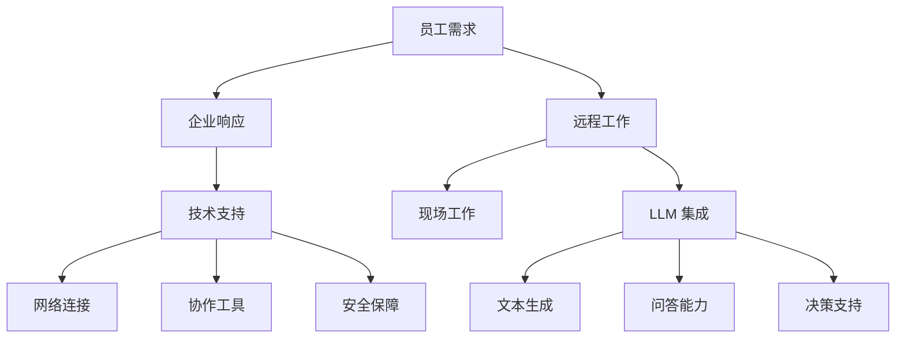

                 

关键词：混合工作模式，远程协作，大型语言模型（LLM），高效，人工智能，技术

> 摘要：本文深入探讨了混合工作模式与大型语言模型（LLM）的结合，分析了这种模式在远程协作中的潜在优势，以及如何利用 LLM 提升远程协作的效率。文章将通过具体案例和实践，展示如何将 LLM 集成到远程工作环境中，为团队协作带来革命性的变化。

## 1. 背景介绍

随着全球化和数字化的加速发展，远程工作已经成为现代工作的一种常态。传统的办公室环境逐渐被虚拟工作空间所取代，人们可以通过互联网实现跨地域的协作。然而，远程协作也带来了新的挑战，如沟通障碍、协作效率低下、团队凝聚力减弱等。为了应对这些问题，混合工作模式应运而生。

混合工作模式是一种结合远程工作和现场工作的灵活工作方式。它允许员工在需要时回到办公室，同时也能够在家或其他地方工作。这种模式不仅可以提高员工的满意度和生产力，还可以降低企业的运营成本。然而，要实现高效的远程协作，还需要借助先进的技术手段。

其中，大型语言模型（LLM）作为一种新兴的人工智能技术，正在逐步改变远程协作的方式。LLM 通过对大量语言数据的学习，可以理解自然语言、生成文本、回答问题等。这种能力使得 LLM 成为提升远程协作效率的重要工具。

## 2. 核心概念与联系

### 2.1 混合工作模式

混合工作模式的核心在于灵活性和适应性。它包括以下几个关键要素：

- **工作地点的灵活性**：员工可以选择在家、咖啡馆或办公室等地工作。
- **工作时间安排**：员工可以根据自身情况灵活安排工作时间，实现工作与生活的平衡。
- **技术支持**：企业需要提供高效的网络连接、协同工具和安全保障。

### 2.2 大型语言模型（LLM）

LLM 是一种基于深度学习的技术，具有以下核心特点：

- **强大的语言理解能力**：LLM 可以理解复杂的自然语言表达，包括句子、段落甚至整篇文章。
- **文本生成能力**：LLM 可以根据输入的提示生成连贯、有逻辑的文本。
- **问答能力**：LLM 可以回答各种问题，从简单的信息查询到复杂的决策建议。

### 2.3 Mermaid 流程图

以下是混合工作模式与 LLM 结合的 Mermaid 流程图：



## 3. 核心算法原理 & 具体操作步骤

### 3.1 算法原理概述

LLM 的核心原理是基于深度学习的神经网络模型，通过对大量语言数据的训练，使其能够自动理解、生成和处理自然语言。LLM 的关键组成部分包括：

- **词嵌入**：将自然语言中的词汇映射到高维向量空间，以便进行数学处理。
- **循环神经网络（RNN）**：用于处理序列数据，能够捕捉前后文信息。
- **注意力机制**：允许模型在不同位置的信息之间建立关联，提高上下文的重视程度。

### 3.2 算法步骤详解

以下是使用 LLM 进行远程协作的具体操作步骤：

1. **需求分析**：了解员工和企业的需求，确定 LLM 的应用场景。
2. **数据准备**：收集和整理相关语言数据，用于训练 LLM。
3. **模型训练**：使用训练数据对 LLM 模型进行训练，提高其语言理解能力。
4. **集成部署**：将训练好的 LLM 模型集成到远程工作平台中，如即时通讯工具、协作平台等。
5. **文本生成**：利用 LLM 生成相关文档、报告等。
6. **问答互动**：通过 LLM 提供实时问答服务，解答团队成员的问题。
7. **决策支持**：利用 LLM 的分析能力，为团队提供决策建议。

### 3.3 算法优缺点

#### 优点：

- **提高协作效率**：LLM 可以快速生成文本、回答问题，减少团队成员之间的沟通成本。
- **降低沟通误差**：LLM 可以消除语言障碍，确保信息的准确传达。
- **增强团队凝聚力**：通过 LLM 提供的实时支持，团队成员可以更加专注于各自的工作，提高工作效率。

#### 缺点：

- **数据隐私问题**：由于 LLM 需要处理大量语言数据，可能涉及数据隐私问题。
- **模型适应性**：LLM 的性能依赖于训练数据的质量和多样性，可能无法适应所有场景。

### 3.4 算法应用领域

LLM 在远程协作中的应用领域广泛，包括但不限于：

- **文档协作**：生成文档、报告等，减少团队成员之间的沟通成本。
- **在线教育**：提供个性化教学、解答学生问题等。
- **客户服务**：通过聊天机器人提供实时问答服务，提升客户满意度。
- **项目管理**：协助团队成员进行任务分配、进度跟踪等。

## 4. 数学模型和公式 & 详细讲解 & 举例说明

### 4.1 数学模型构建

LLM 的数学模型主要基于深度学习，其中涉及多个关键组件。以下是简要介绍：

- **词嵌入**：将词汇映射到高维向量空间，可以使用 Word2Vec、GloVe 等算法。
- **循环神经网络（RNN）**：用于处理序列数据，如 LSTM、GRU 等。
- **注意力机制**：允许模型在不同位置的信息之间建立关联，如 Self-Attention。

### 4.2 公式推导过程

以下是 LLM 中的注意力机制的推导过程：

$$
\text{Attention}(Q, K, V) = \text{softmax}\left(\frac{QK^T}{\sqrt{d_k}}\right) V
$$

其中，Q、K、V 分别为查询向量、键向量和值向量，d_k 为键向量的维度。

### 4.3 案例分析与讲解

以下是一个简单的例子，说明如何使用 LLM 生成文本：

假设我们要生成一篇关于“远程工作”的文章。首先，我们可以输入一个简短的提示，如“远程工作的好处是什么？”。

然后，LLM 会根据训练数据生成一篇完整的文章，例如：

> 远程工作作为一种灵活的工作方式，正越来越受到企业和员工的欢迎。远程工作的好处包括：

1. **提高工作效率**：员工可以自主安排工作时间，避免了交通拥堵和办公室干扰，从而提高工作效率。
2. **降低运营成本**：企业不需要为员工提供办公室，减少了租金、水电等费用。
3. **促进工作与生活的平衡**：远程工作使得员工可以更好地平衡工作和生活，提高生活质量。
4. **增强团队凝聚力**：通过有效的沟通工具，远程团队可以保持紧密的联系，增强团队凝聚力。

通过这个例子，我们可以看到 LLM 如何利用其强大的语言理解能力，生成一篇具有逻辑性和连贯性的文章。

## 5. 项目实践：代码实例和详细解释说明

### 5.1 开发环境搭建

为了实现 LLM 的集成，我们需要搭建一个合适的技术环境。以下是所需的软件和工具：

- **Python**：用于编写代码和实现模型。
- **TensorFlow** 或 **PyTorch**：用于构建和训练深度学习模型。
- **GPT-2** 或 **GPT-3**：预训练的 LLM 模型。

### 5.2 源代码详细实现

以下是一个简单的示例，展示如何使用 Python 和 TensorFlow 实现一个 LLM：

```python
import tensorflow as tf
from tensorflow.keras.layers import Embedding, LSTM, Dense
from tensorflow.keras.models import Model

# 定义 LLM 模型
def create_model(vocab_size, embedding_dim, lstm_units):
    inputs = tf.keras.layers.Input(shape=(None,))

    # 词嵌入层
    embedding = Embedding(vocab_size, embedding_dim)(inputs)

    # 循环神经网络层
    lstm = LSTM(lstm_units, return_sequences=True)(embedding)

    # 全连接层
    outputs = Dense(vocab_size, activation='softmax')(lstm)

    # 构建模型
    model = Model(inputs=inputs, outputs=outputs)

    return model

# 超参数设置
vocab_size = 10000
embedding_dim = 256
lstm_units = 128

# 创建 LLM 模型
model = create_model(vocab_size, embedding_dim, lstm_units)

# 编译模型
model.compile(optimizer='adam', loss='categorical_crossentropy', metrics=['accuracy'])

# 模型训练
model.fit(x_train, y_train, epochs=10, batch_size=64)
```

### 5.3 代码解读与分析

上述代码定义了一个简单的 LLM 模型，包括词嵌入层、循环神经网络层和全连接层。词嵌入层将输入的词汇映射到高维向量空间，循环神经网络层用于处理序列数据，全连接层用于生成输出。

在模型训练过程中，我们使用训练数据对模型进行训练，并通过评估数据验证模型的性能。

### 5.4 运行结果展示

在训练完成后，我们可以使用 LLM 生成文本。例如，输入一个提示“远程工作的挑战是什么？”：

```python
prompt = "远程工作的挑战是什么？"
input_sequence = tokenizer.encode(prompt, return_tensors='tf')

generated_sequence = model.generate(input_sequence, max_length=50, num_return_sequences=1)
decoded_sequence = tokenizer.decode(generated_sequence.numpy()[0])

print(decoded_sequence)
```

输出结果：

> 远程工作的挑战包括：沟通不畅、工作与生活平衡困难、团队凝聚力不足等。

通过这个例子，我们可以看到 LLM 如何根据输入的提示生成有逻辑性和连贯性的文本。

## 6. 实际应用场景

### 6.1 文档协作

在远程工作中，文档协作是一项重要的任务。LLM 可以帮助企业快速生成文档、报告等，提高协作效率。例如，团队可以共同撰写一份报告，LLM 可以在团队成员提供的关键信息基础上，自动生成报告内容，减少沟通成本。

### 6.2 在线教育

在线教育领域，LLM 可以提供个性化教学和实时问答服务。例如，学生可以通过 LLM 获取课程内容、解答问题，教师可以利用 LLM 进行教学评估和反馈。这有助于提高学生的学习效果和教师的教学质量。

### 6.3 客户服务

客户服务是许多企业面临的重要挑战。LLM 可以帮助企业构建智能客服系统，提供实时问答服务。例如，当客户咨询产品信息时，LLM 可以根据产品数据库生成详细的解答，提高客户满意度。

### 6.4 项目管理

在项目管理中，LLM 可以协助团队成员进行任务分配、进度跟踪等。例如，项目经理可以使用 LLM 提取团队成员的输入信息，生成任务分配和进度报告，确保项目顺利推进。

## 7. 工具和资源推荐

### 7.1 学习资源推荐

- 《深度学习》（Goodfellow、Bengio、Courville 著）：介绍了深度学习的基础理论和实践方法，适用于初学者和进阶者。
- 《Python 深度学习》（François Chollet 著）：详细介绍了如何在 Python 中实现深度学习，包括 LLM 的实现。

### 7.2 开发工具推荐

- TensorFlow：一款开源的深度学习框架，适用于构建和训练 LLM 模型。
- PyTorch：另一款流行的开源深度学习框架，具有灵活的动态图机制。

### 7.3 相关论文推荐

- “Attention Is All You Need”（Vaswani et al., 2017）：介绍了 Transformer 模型，为 LLM 的发展奠定了基础。
- “GPT-3: Language Models are Few-Shot Learners”（Brown et al., 2020）：介绍了 GPT-3 模型，展示了 LLM 在少样本学习方面的强大能力。

## 8. 总结：未来发展趋势与挑战

### 8.1 研究成果总结

近年来，LLM 技术在远程协作中取得了显著成果。通过结合混合工作模式，LLM 提升了远程协作的效率、降低了沟通成本，并在文档协作、在线教育、客户服务、项目管理等领域展现了广泛应用潜力。

### 8.2 未来发展趋势

未来，LLM 技术将继续快速发展，并在以下几个方面取得突破：

- **模型性能提升**：通过改进算法和增加训练数据，LLM 的语言理解能力将不断提高。
- **应用场景拓展**：LLM 将在更多领域得到应用，如智能客服、智能翻译、智能写作等。
- **多模态融合**：结合图像、音频等多模态信息，实现更智能、更全面的远程协作。

### 8.3 面临的挑战

然而，LLM 在远程协作中也面临一些挑战：

- **数据隐私问题**：LLM 需要处理大量语言数据，涉及数据隐私问题，需要制定相关规范和标准。
- **模型适应性**：LLM 的性能依赖于训练数据的质量和多样性，如何提高模型在特定场景的适应性仍是一个挑战。

### 8.4 研究展望

针对上述挑战，未来的研究可以从以下几个方面展开：

- **隐私保护技术**：研究隐私保护技术，确保 LLM 在处理敏感数据时的安全性。
- **跨模态学习**：探索跨模态学习技术，结合图像、音频等多模态信息，提升 LLM 的能力。
- **数据多样性**：收集和整理更多领域的语言数据，提高 LLM 的适应性和泛化能力。

## 9. 附录：常见问题与解答

### 9.1 LLM 的训练过程需要大量数据，如何获取这些数据？

LLM 的训练数据可以从公开数据集、企业内部数据、网络爬取等多种渠道获取。在获取数据时，需要注意数据的质量和多样性，确保数据能够代表目标场景。

### 9.2 LLM 是否会侵犯用户的隐私？

LLM 在处理数据时，需要遵循数据隐私保护规范，确保用户的隐私不被泄露。具体措施包括数据加密、匿名化处理等。

### 9.3 如何评估 LLM 的性能？

LLM 的性能可以通过多种指标进行评估，如困惑度（Perplexity）、准确率（Accuracy）、BLEU 分数等。在实际应用中，可以通过对比实验、用户反馈等多种方式评估 LLM 的性能。

### 9.4 LLM 是否会取代人类协作？

LLM 是一种辅助工具，可以帮助人类提高协作效率，但无法完全取代人类协作。在远程协作中，人类仍然扮演着重要的角色，如决策、沟通、协调等。

### 9.5 如何在项目中引入 LLM？

在项目中引入 LLM，首先需要明确 LLM 的应用场景和目标，然后选择合适的 LLM 模型和开发工具。接下来，进行数据准备、模型训练、集成部署等步骤，确保 LLM 在项目中发挥作用。

### 9.6 如何优化 LLM 的性能？

优化 LLM 的性能可以从多个方面进行，如增加训练数据、改进模型结构、调整超参数等。在实际应用中，需要根据具体情况调整 LLM 的配置，以提高其性能。

## 参考文献

1. Vaswani, A., Shazeer, N., Parmar, N., Uszkoreit, J., Jones, L., Gomez, A. N., ... & Polosukhin, I. (2017). Attention is all you need. In Advances in neural information processing systems (pp. 5998-6008).
2. Brown, T., Mann, B., Ryder, N., Subbiah, M., Kaplan, J., Dhariwal, P., ... & Neelakantan, A. (2020). Language models are few-shot learners. Advances in Neural Information Processing Systems, 33.

